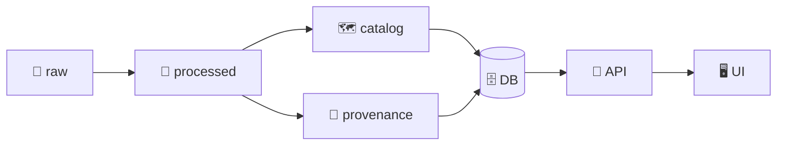

<!--
📄 File: tests/fixtures/README.md
🎯 Purpose: Canonical documentation for deterministic test fixtures used across the KFM stack.
-->

# 🧪 Test Fixtures


> [!NOTE]
> Fixtures are **tiny, deterministic, and committed** on purpose — they let us test the full KFM “raw → processed → catalog/provenance → API” chain locally and in CI.

---

## 🎯 What this folder is for

- ✅ Reproducible inputs for unit + integration tests (API, pipelines, policy).
- ✅ Minimal “golden” datasets + their metadata sidecars.
- ✅ Negative fixtures (intentionally invalid) to prove we **fail closed**.
- ❌ Not production data.
- ❌ Not a dumping ground for large rasters or real-world exports.

---

## 🧠 Fixture philosophy (KFM-style)

KFM is **provenance-first**: even in tests, we treat data like it must pass the same gates as “real” layers.

- **Pipeline order matters**: raw → processed → catalog/prov → DB → API → UI
- **Metadata required**: every dataset fixture should have catalog + provenance docs
- **Small & diffable**: prefer compact JSON/GeoJSON/CSV (or tiny rasters)
- **Governance baked in**: licenses + sensitivity flags are part of the “contract”



---

## 🗂️ Recommended layout

> [!TIP]
> If your tests expect a different layout, update this README (or add per-pack READMEs). The goal is clarity + consistency.

```text
tests/fixtures/
├── 📦 datasets/
│   ├── 🧩 <dataset_slug>/
│   │   ├── 🧱 raw/
│   │   ├── 🧼 processed/
│   │   ├── 🗺️ catalog/
│   │   ├── 🧾 provenance/
│   │   └── 📄 README.md
├── 🔌 api/
│   ├── 🧪 requests/
│   └── ✅ responses/
├── 🛡️ policy/
│   ├── ✅ allow/
│   └── ⛔ deny/
└── 📄 README.md  👈 you are here
```

---

## 🧩 Dataset fixture pack spec

Each dataset fixture lives in `datasets/<dataset_slug>/` and should contain:

### ✅ Required
- **Raw inputs** (`raw/`)
  - Minimal, representative sample (think: 10–200 rows or a handful of geometries).
- **Processed outputs** (`processed/`)
  - The “post-pipeline” artifact used by the API/DB layer in tests.
  - Examples: `*.geojson`, `*.jsonl`, `*.csv`, `*.parquet`, tiny `*.tif`.
- **Catalog metadata** (`catalog/`)
  - STAC Item / Collection JSON (and/or a DCAT record if your pipeline expects it).
- **Provenance log** (`provenance/`)
  - W3C PROV (or KFM-style) JSON describing lineage.

### ⭐ Nice-to-have
- `README.md` inside the pack explaining:
  - What the dataset represents
  - Spatial/temporal extent
  - How it is used by tests
  - Any known edge cases / “gotchas”

### 🧷 Naming conventions
- Use **snake_case** for slugs: `census_1900`, `railroads_1870s`, `drought_1934`
- Prefer deterministic filenames:
  - `processed/<slug>.geojson`
  - `catalog/<slug>.stac-item.json`
  - `provenance/<slug>.prov.json`

---

## ⛔ Negative fixtures (expected failures)

Some tests should verify that we fail safely (“fail closed”).

Common negative fixture ideas:
- Missing `provenance/*.prov.json`
- Missing / empty license in metadata
- Invalid GeoJSON geometry (self-intersections, bad coordinate order, etc.)
- Catalog JSON that violates schema (missing required fields)
- “Restricted” dataset requested by an unauthorized role (policy tests)

Place these either:
- inside `datasets/<slug>/` with a loud `README.md`, or
- in `datasets/_invalid/<slug>/` (if you prefer strict separation)

---

## 🧪 Using fixtures in tests

### 🐍 Python (API / pipelines)

Most API tests load fixture files directly from disk and (depending on test type):
- seed a temporary DB, **or**
- use in-memory repositories/mocks, **or**
- validate outputs of pipeline steps.

```python
from pathlib import Path
import json

FIXTURES = Path(__file__).resolve().parents[2] / "fixtures"

def load_json(rel_path: str) -> dict:
    return json.loads((FIXTURES / rel_path).read_text(encoding="utf-8"))
```

Example patterns:
- Load a processed GeoJSON fixture → insert into PostGIS (or use a stub repo)
- Call an endpoint via FastAPI TestClient → compare response to `api/responses/*.json`

### 🐳 Running tests in the Docker dev stack

If you’re using the compose-based dev environment, it’s common to run:

```bash
docker-compose exec api pytest
```

> [!TIP]
> CI-style policy checks may also be runnable locally (e.g., via Conftest) — use them to catch missing metadata early.

---

## 🛡️ Policy fixtures

If the repo includes OPA/Rego policies (recommended for KFM governance), keep tiny JSON inputs + expected decisions here.

Suggested approach:
- `policy/allow/*.json` → should evaluate to **allow**
- `policy/deny/*.json` → should evaluate to **deny**

Scenario ideas to cover:
- `accessLevel: "Restricted"` + mismatched `ownerGroup`
- dataset marked `status: "withdrawn"`
- “sanitized response” decisions (masking coordinates instead of returning 403)

---

## 🧼 Fixture hygiene rules

> [!IMPORTANT]
> Keep fixtures **small**, **boring**, and **stable** — the point is deterministic tests, not realism at scale.

- ✅ Commit only tiny artifacts
- ✅ Prefer open formats (GeoJSON/CSV/JSON)
- ✅ Avoid anything that could be PII or sensitive
- ✅ If you must reference “large data”, store a **pointer + hash** (don’t commit the blob)
  - (Optional) Use DVC or a remote artifact store if the project supports it

---

## 🔗 Handy links (repo-relative)

- `../../docs/` — architecture + narrative docs
- `../../pipelines/` — ETL scripts that generate `processed/` + metadata
- `../../policy/` — governance rules (OPA/Rego, AI guardrails, etc.)
- `../../api/` — FastAPI backend + tests
- `../../web/` — React + TypeScript frontend