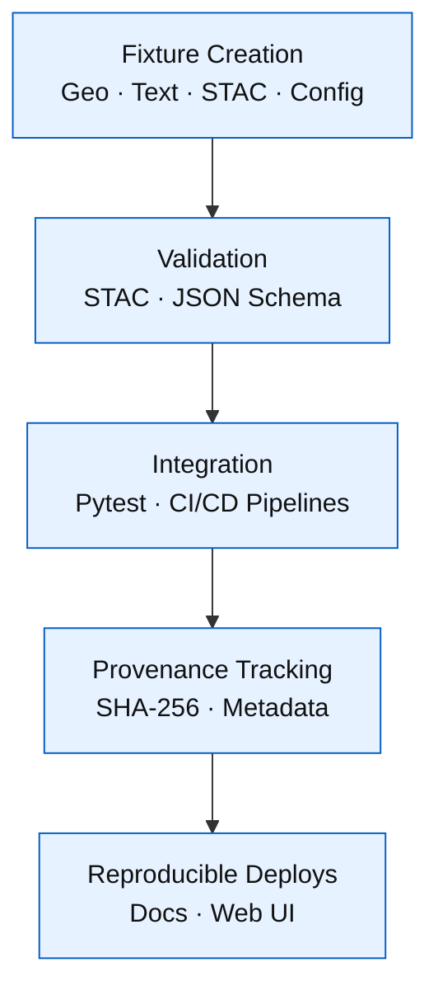

<div align="center">

# 🧱 Kansas Frontier Matrix — **Test Fixtures**  
`tests/fixtures/`

### *“Small Data · Big Confidence — Reproducibility in Every Byte.”*

[](../../.github/workflows/tests.yml)  
[](https://codecov.io/gh/bartytime4life/Kansas-Frontier-Matrix)  
[](../../.github/workflows/stac-validate.yml)  
[](../../docs/)  
[](../../LICENSE)

</div>

---

## 🪶 Overview

The **Kansas Frontier Matrix Test Fixtures** provide reproducible, deterministic, and provenance-tracked datasets for verifying  
all core components of KFM — including **ETL**, **STAC validation**, **NLP/AI pipelines**, and **frontend integrations**.  

Fixtures simulate the *data DNA* of the project — compact, schema-valid, and fully traceable through CI/CD.

- 🧱 **Deterministic** — seed-based generation for repeatable outcomes  
- 🧩 **Schema-Aligned** — STAC 1.0, GeoJSON RFC 7946, JSON Schema  
- 🧭 **Geo-Historic Context** — Kansas-specific test geography and text  
- 🔍 **Provenance-Logged** — SHA-256 and version metadata embedded in each artifact  
- ⚙️ **CI-Integrated** — validated nightly for reproducibility under MCP protocols  

---

## ⚙️ Architecture


<!-- END OF MERMAID -->

---

## 🗂 Directory Layout

```text
tests/fixtures/
├── geo/                     # GeoJSON & raster samples
│   ├── ks_county_sample.geojson
│   ├── tiny_vector.geojson
│   └── dem_sample.tif
├── text/                    # OCR / diary / treaty excerpts
│   ├── sample_diary.txt
│   └── treaty_excerpt.txt
├── stac/                    # STAC Item/Collection examples
│   ├── stac_item_min.json
│   └── stac_collection_min.json
├── sources/                 # Mock dataset manifests
│   └── usgs_topo_sample.json
├── configs/                 # Web UI config fixtures
│   ├── layers_min.json
│   └── app_config_min.json
├── meta/                    # Fixture metadata & changelogs
│   ├── CHANGELOG.md
│   └── version_map.json
└── __init__.py              # Enables Pytest import
```

---

## 🧩 Fixture Standards

| Category | Used By | Schema / Purpose |
|:----------|:--------|:----------------|
| **Geo** | GIS tools, STAC validator | Validate GeoJSON & COG conversion |
| **Text** | NLP / OCR pipelines | Entity extraction (people, places, treaties) |
| **STAC** | `validate_stac.py` | Schema + temporal structure validation |
| **Sources** | `fetch_data.py` | Mock dataset registry (JSON manifest) |
| **Configs** | `build_config.py`, Web UI | UI configuration + STAC layer mapping |

---

## 🧪 Example Fixture — `stac_item_min.json`

```json
{
  "type": "Feature",
  "id": "usgs_topo_larned_1894",
  "properties": {
    "datetime": "1894-01-01T00:00:00Z",
    "proj:epsg": 4326,
    "version": "v1.0.2",
    "checksum:sha256": "94d1b2a4e9b6f4e5c30dff7f91b8d09c0bdf43c2e61af5cba7c1a123456789ab",
    "source": "tests/fixtures/stac/stac_item_min.json"
  },
  "assets": {
    "cog": {
      "href": "data/cogs/usgs_topo_larned_1894.tif",
      "type": "image/tiff; application=geotiff; profile=cloud-optimized"
    }
  },
  "bbox": [-99.4, 38.1, -99.0, 38.4]
}
```

> Minimal, versioned STAC-compliant example with embedded checksum for audit traceability.

---

## 🧩 Usage Examples

### 🐍 Python (Pytest)

```python
from pathlib import Path
import json
import pytest

@pytest.fixture
def stac_item(fixtures_dir):
    return json.loads((fixtures_dir / "stac/stac_item_min.json").read_text())

@pytest.fixture(scope="session")
def fixtures_dir() -> Path:
    return Path(__file__).parent
```

### 💻 JavaScript

```js
import fs from "fs";
const geo = JSON.parse(fs.readFileSync("tests/fixtures/geo/ks_county_sample.geojson", "utf8"));
test("GeoJSON loads", () => expect(geo.type).toBe("FeatureCollection"));
```

---

## 🧩 Versioning & Metadata

| Field | Value |
|:------|:------|
| **Version** | `v1.4.0` |
| **Codename** | *Checksum & Provenance Synchronization* |
| **Last Updated** | 2025-10-17 |
| **Maintainers** | @kfm-engineering · @kfm-data |
| **License** | MIT (code) · CC-BY 4.0 (docs) |
| **Semantic Alignment** | STAC 1.0 · GeoJSON RFC 7946 · OWL-Time · MCP-DL v6.3 |
| **Maturity** | Production |
| **Data Integrity** | SHA-256 version-mapped in `meta/version_map.json` |

---

## 🧾 CHANGELOG

| Version | Date | Author | Summary |
|:--------|:------|:--------|:--------|
| **v1.4.0** | 2025-10-17 | @kfm-engineering | Added unified metadata fields & changelog version mapping |
| **v1.3.0** | 2025-10-10 | @kfm-data | Added GeoJSON CRS and audit metadata |
| **v1.2.0** | 2025-09-30 | @kfm-ci | Integrated STAC schema validation automation |
| **v1.1.0** | 2025-09-25 | @kfm-data | Initial version with deterministic fixture set |

---

## 🧠 MCP-DL v6.3 Compliance

| Principle | Implementation |
|:-----------|:----------------|
| **Documentation-First** | Versioned fixtures with inline provenance metadata |
| **Reproducibility** | Seeded generation + CI-validated hash parity |
| **Provenance** | Embedded SHA-256 and STAC metadata |
| **Accessibility** | JSON/GeoJSON readable, open schema-aligned |
| **Open Standards** | GeoJSON, STAC 1.0, OWL-Time |
| **Auditability** | CI workflow verifies hash & version parity |

---

<div align="center">

**© Kansas Frontier Matrix — Test Fixtures**  
Maintained under the **Master Coder Protocol (MCP)**  

[]()  
[]()

</div>