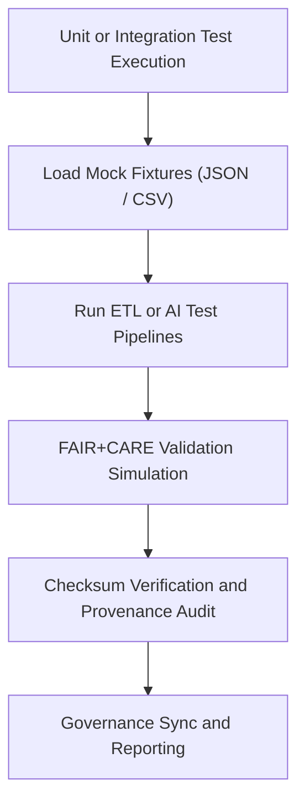

<div align="center">

# 🧱 Kansas Frontier Matrix — **Test Fixtures & Mock Data**
`tests/fixtures/README.md`

**Purpose:**  
FAIR+CARE-certified collection of **mock datasets, simulated AI outputs, and test manifests** designed for reproducible automated testing within the Kansas Frontier Matrix (KFM).  
These fixtures provide controlled data for validating ETL, AI explainability, and governance workflows under MCP-DL v6.3 standards.

[](../../../docs/standards/faircare-validation.md)
[](../../../LICENSE)
[](../../../docs/architecture/repo-focus.md)

</div>

---

## 📚 Overview

The `tests/fixtures/` directory provides **reusable sample data** and governance-linked mock files used during automated validation, schema testing, and FAIR+CARE certification pipelines.  
These controlled datasets mimic real KFM data structures for ETL, AI, validation, and provenance systems while maintaining complete ethical and reproducibility standards.

### Core Responsibilities
- Provide representative mock data for unit, integration, and system tests.  
- Simulate AI model outputs, validation manifests, and ledger transactions.  
- Enable FAIR+CARE ethics verification within test environments.  
- Guarantee checksum and provenance traceability for reproducible testing.  

---

## 🗂️ Directory Layout

```plaintext
tests/fixtures/
├── README.md                              # This file — documentation for test fixtures
│
├── mock_dataset.json                      # Simulated tabular dataset following KFM data contract
├── mock_ai_output.json                    # AI model prediction output for explainability tests
├── mock_manifest.json                     # Example manifest of processed data with checksums
├── mock_ledger_entry.json                 # Governance ledger mock entry for audit validation
├── mock_validation_report.json            # Example schema and FAIR+CARE validation result
└── metadata.json                          # Provenance and governance linkage metadata
```

---

## ⚙️ Test Fixture Workflow



### Workflow Description
1. **Fixture Loading:** Provides pre-built mock datasets for testing without affecting production data.  
2. **Pipeline Simulation:** Runs ETL, AI, or validation processes using synthetic examples.  
3. **FAIR+CARE Audit:** Verifies ethics and accessibility rules using mock FAIR+CARE data.  
4. **Checksum Verification:** Confirms that fixture data integrity remains unchanged.  
5. **Governance Sync:** Registers mock provenance in governance ledger simulations.  

---

## 🧩 Example Fixture Metadata Record

```json
{
  "id": "tests_fixtures_v9.5.0_2025Q4",
  "fixtures_loaded": [
    "mock_dataset.json",
    "mock_ai_output.json",
    "mock_ledger_entry.json"
  ],
  "checksum_verified": true,
  "fairstatus": "compliant",
  "governance_registered": true,
  "telemetry_ref": "releases/v9.5.0/focus-telemetry.json",
  "governance_ref": "reports/audit/ai_tests_fixtures_ledger.json",
  "created": "2025-11-02T23:59:00Z",
  "validator": "@kfm-tests"
}
```

---

## 🧠 FAIR+CARE Governance Matrix

| Principle | Implementation |
|------------|----------------|
| **Findable** | Fixtures indexed with checksum IDs and provenance metadata. |
| **Accessible** | Open JSON mock data following FAIR+CARE accessibility guidelines. |
| **Interoperable** | Structured to align with DCAT 3.0, ISO 19115, and KFM schema contracts. |
| **Reusable** | Enables repeatable, deterministic testing under controlled data conditions. |
| **Collective Benefit** | Promotes open, ethical test reproducibility and validation transparency. |
| **Authority to Control** | FAIR+CARE Council reviews all simulated data for ethics compliance. |
| **Responsibility** | Validators ensure mock data maintains provenance and integrity standards. |
| **Ethics** | All mock datasets anonymized and compliant with data ethics guidelines. |

Audit and ethics verification recorded in:  
`reports/audit/ai_tests_fixtures_ledger.json` • `reports/fair/tests_fixtures_summary.json`

---

## ⚙️ Fixture Components Summary

| Fixture File | Description | Format |
|---------------|--------------|--------|
| `mock_dataset.json` | Simulated dataset for schema and validation testing. | JSON |
| `mock_ai_output.json` | Example AI model output for explainability and drift detection tests. | JSON |
| `mock_manifest.json` | Sample processed data manifest for checksum verification. | JSON |
| `mock_ledger_entry.json` | Governance ledger simulation for provenance and audit tests. | JSON |
| `mock_validation_report.json` | Example FAIR+CARE validation and schema compliance report. | JSON |
| `metadata.json` | Provenance and governance linkage metadata for fixture set. | JSON |

---

## 🧾 Retention Policy

| Fixture Type | Retention Duration | Policy |
|---------------|--------------------|--------|
| Mock Data | Permanent | Retained for reproducible and regression testing. |
| Validation Reports | 365 days | Rotated annually for QA revalidation. |
| Governance Metadata | Permanent | Stored under versioned provenance control. |
| FAIR+CARE Audits | Permanent | Maintained for ethical testing certification. |

Cleanup managed via `tests_fixtures_cleanup.yml`.

---

## 🧾 Internal Use Citation

```text
Kansas Frontier Matrix (2025). Test Fixtures & Mock Data (v9.5.0).
FAIR+CARE-certified synthetic dataset collection for reproducible validation and ethics testing.
Ensures transparent, controlled, and ethical automation under MCP-DL v6.3 compliance.
```

---

## 🧾 Version Notes

| Version | Date | Notes |
|----------|------|--------|
| v9.5.0 | 2025-11-02 | Added FAIR+CARE mock ethics and provenance audit datasets. |
| v9.3.2 | 2025-10-28 | Expanded fixture schema for AI explainability and governance simulation. |
| v9.3.0 | 2025-10-26 | Established test fixtures workspace for deterministic and ethical testing. |

---

<div align="center">

**Kansas Frontier Matrix** · *Synthetic QA × FAIR+CARE Ethics × Provenance Simulation*  
[🔗 Repository](https://github.com/bartytime4life/Kansas-Frontier-Matrix) • [🧭 Docs Portal](../../../docs/) • [⚖️ Governance Ledger](../../../docs/standards/governance/)

</div>

