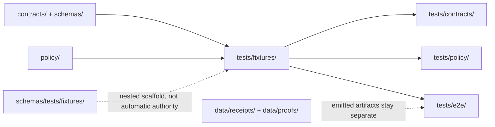

<!-- [KFM_META_BLOCK_V2]
doc_id: kfm://doc/NEEDS_VERIFICATION__tests_fixtures_readme
title: Test Fixtures
type: standard
version: v1
status: draft
owners: @bartytime4life
created: NEEDS_VERIFICATION__YYYY-MM-DD
updated: NEEDS_VERIFICATION__YYYY-MM-DD
policy_label: NEEDS_VERIFICATION__public_or_internal
related: [../README.md, ../contracts/README.md, ../policy/README.md, ../e2e/README.md, ../reproducibility/README.md, ../../contracts/README.md, ../../schemas/README.md, ../../schemas/tests/README.md, ../../schemas/contracts/v1/README.md, ../../.github/CODEOWNERS, ../../.github/workflows/README.md]
tags: [kfm, tests, fixtures, verification]
notes: [Parent fixture README created to make fixture-home law explicit. Broader /tests/ owner coverage is documented in surfaced repo-facing materials, but exact leaf ownership, doc_id, dates, policy_label, and active-branch subtree contents still require direct branch verification.]
[/KFM_META_BLOCK_V2] -->

<a id="top"></a>

# Test Fixtures

Parent README for deterministic, public-safe fixture material that supports KFM governed verification without becoming source truth, policy truth, or release-proof authority.

> [!NOTE]
> **Status:** `experimental`  
> **Owners:** `@bartytime4life` *(confirmed at the broader `/tests/` scope in surfaced repo-facing docs; this exact subtree should still be rechecked before merge)*  
> **Path:** `tests/fixtures/README.md`  
> **Repo fit:** parent fixture boundary for reviewable examples consumed by contract, policy, integration, runtime-proof, and lane-specific tests  
> **Quick jumps:** [Scope](#scope) · [Repo fit](#repo-fit) · [Accepted inputs](#accepted-inputs) · [Exclusions](#exclusions) · [Current documented snapshot](#current-documented-snapshot) · [Directory tree](#directory-tree) · [Quickstart](#quickstart) · [Usage](#usage) · [Diagram](#diagram) · [Operating tables](#operating-tables) · [Task list](#task-list--definition-of-done) · [FAQ](#faq) · [Appendix](#appendix)

<div align="left">


</div>

> [!IMPORTANT]
> This README makes **fixture-home law** explicit. It does **not** settle schema-home authority, prove merge-blocking workflow depth, or upgrade visible directory names into runtime maturity.

> [!TIP]
> Keep the split visible:
>
> - **contracts and schemas define**
> - **fixtures exemplify**
> - **validators verify**
> - **policy decides**
> - **tests prove boundaries**
> - **receipts and proofs remain separate emitted artifacts**

---

## Scope

`tests/fixtures/` is the parent lane for small, reviewable fixture material used to prove KFM behavior under pressure.

This surface exists so the repo has one explicit place to describe what fixtures are for, what they are not for, and how they relate to the stronger neighboring lanes in `tests/`, `contracts/`, `schemas/`, `policy/`, and workflow surfaces.

A healthy fixture lane should help maintainers answer questions like these without guessing:

- Is this example safe to check in?
- Is this sample here to prove a contract shape, a deny path, a runtime response, or a lane-specific edge case?
- Should this live under `tests/fixtures/`, under a narrower executable test family, or under a schema-side scaffold?
- Is this file acting as a reusable example, or is it quietly trying to become a second authority surface?

[Back to top](#top)

---

## Repo fit

This path is a **parent README**, not a catch-all dump.

| Neighbor | Relationship | Why it matters |
| --- | --- | --- |
| [`../README.md`](../README.md) | broader governed verification index | `tests/` explains the full verification family map and trust posture |
| [`../contracts/README.md`](../contracts/README.md) | executable contract-verification lane | move there when object-shape proof is the main job |
| [`../policy/README.md`](../policy/README.md) | policy-test lane | move there when allow / deny / restrict behavior is the point |
| [`../e2e/README.md`](../e2e/README.md) | end-to-end runtime / release / correction lane | move there when whole-path behavior is the point |
| [`../reproducibility/README.md`](../reproducibility/README.md) | rerun consistency lane | use it when repeatability is the primary burden |
| [`../../contracts/README.md`](../../contracts/README.md) | human-readable contract authority | fixtures should support these contracts, not replace them |
| [`../../schemas/README.md`](../../schemas/README.md) | machine-shape and schema-home boundary | this README must not quietly settle schema authority |
| [`../../schemas/tests/README.md`](../../schemas/tests/README.md) | nested schema-side scaffold | keep nested scaffolds explicit instead of flattening them into repo-wide fixture truth |
| [`../../.github/CODEOWNERS`](../../.github/CODEOWNERS) | ownership reference | broader `/tests/` coverage is documented there |
| [`../../.github/workflows/README.md`](../../.github/workflows/README.md) | workflow-orchestration boundary | orchestration belongs there, not here |

### Working interpretation

Use `tests/fixtures/` when the main job is to store **tiny, reviewable, public-safe examples** that can be consumed by stronger test families without hiding authority or overclaiming automation.

Move out of this lane when the main job becomes:

- defining canonical schema or OpenAPI shape
- authoring policy truth
- proving full route wiring or full release choreography
- storing emitted receipts, proof packs, or promoted artifacts as primary records
- caching large provider pulls, raw data, or branch-local scratch material

[Back to top](#top)

---

## Accepted inputs

### Accepted inputs

| Input class | Examples | Why it belongs here |
| --- | --- | --- |
| Valid fixtures | `valid/*.json`, `valid/*.geojson`, tiny positive CSV/NDJSON examples | prove the passing shape with the smallest honest sample |
| Invalid fixtures | `invalid/*.json`, malformed or policy-failing examples named by failure reason | negative paths are first-class in KFM |
| Expected output fragments | `expected/*.json`, golden snippets, normalized reviewer-facing fragments | useful when output shape matters more than every byte |
| Redacted or synthetic source slices | tiny redacted `.ged`, `.csv`, `.geojson`, `.json` examples | lets the repo prove behavior without becoming a provider mirror |
| Runtime request/response examples | compact request payloads, response envelopes, decision examples | supports runtime-proof and shell-payload tests without claiming route maturity |
| Promotion or release candidate examples | small pass/fail bundles, catalog-mismatch examples | useful when downstream validators or e2e lanes need stable reviewed inputs |
| Lane-specific edge cases | sensitivity, rights, missing evidence, malformed chronology, ambiguous IDs | keeps failure classes legible and reviewable |
| Fixture manifests or lane indexes | compact fixture catalogs or README notes | helps keep families navigable without inventing a second contract surface |

### Input rules

1. Prefer the **smallest real pair** first: one valid and one invalid example.
2. Name invalid fixtures by **failure reason**, not by vague sequence number.
3. Keep fixtures **deterministic**: no hidden dependence on network, current time, or remote platform state.
4. Keep fixtures **public-safe**: redacted, synthetic, or generalized when rights or sensitivity are in question.
5. Preserve upstream object vocabulary instead of inventing local aliases.
6. Keep examples **review-sized**; this lane is not a silent provider mirror.
7. If regeneration matters, document it in a nearby README rather than embedding opaque provenance in filenames.

[Back to top](#top)

---

## Exclusions

| Does **not** belong here | Put it here instead | Why |
| --- | --- | --- |
| Canonical schemas, OpenAPI files, vocabularies, standards profiles | [`../../contracts/README.md`](../../contracts/README.md), [`../../schemas/README.md`](../../schemas/README.md) | fixtures support authority; they do not own it |
| Policy bundle source files, reviewer-role maps, obligation registries | [`../policy/README.md`](../policy/README.md) and upstream policy surfaces | policy authorship should stay explicit |
| Runtime application code, ingestion workers, validators, helper implementations | repo-native app, package, infra, or tool lanes | executable logic is not fixture content |
| Release manifests, receipts, SBOMs, proof packs as primary records | governed artifact and data surfaces | tests may reference them, but should not replace them |
| Large raw datasets, scrape caches, branch-local dumps | governed data zones or ignored local paths | this lane must stay small and reviewable |
| Sensitive exact locations, direct identifiers, unpublished source material | steward-only or quarantined surfaces | disclosure risk is often the very thing tests must deny |
| Nested schema-side scaffolds as the implied singular fixture authority | [`../../schemas/tests/README.md`](../../schemas/tests/README.md) | schema-side mirrors and repo-wide fixtures should stay visibly distinct |
| Long-form architecture rationale, incident playbooks, doctrinal essays | `docs/` | narrative guidance belongs with the docs control plane |
| Workflow sequencing or permission logic | [`../../.github/workflows/README.md`](../../.github/workflows/README.md) | orchestration belongs at the workflow boundary |

[Back to top](#top)

---

## Current documented snapshot

This README is deliberately **evidence-bounded**.

The stronger current documented signals available to this file are:

- `tests/` is treated as a real top-level governed verification surface.
- The documented top-level test families include `accessibility/`, `catalog/`, `ci/`, `contracts/`, `e2e/`, `integration/`, `policy/`, `reproducibility/`, and `unit/`.
- `tests/contracts/` is not just README-only in the surfaced repo-facing docs.
- `tests/policy/` includes a documented `genealogy/` child lane.
- `tests/e2e/` includes documented `correction/`, `release_assembly/`, and `runtime_proof/` child lanes.
- `schemas/tests/` exposes a nested `fixtures/` scaffold.
- `schemas/contracts/v1/` exposes first-wave contract families such as `common/`, `correction/`, `data/`, `evidence/`, `policy/`, `release/`, `runtime/`, and `source/`.
- Broader `/tests/` ownership is documented as `@bartytime4life`.

### What is still not proven here

> [!WARNING]
> This README does **not** prove:
>
> - the exact active-branch child inventory under `tests/fixtures/`
> - exact test runner selection
> - merge-blocking coverage depth
> - branch-protection settings or required checks
> - whether nested schema-side scaffolds feed blocking runners
> - archived rollback / correction drill evidence
> - whether root-level shared fixture subtrees already exist or should be created

[Back to top](#top)

---

## Directory tree

### Current documented adjacency

```text
tests/
├── README.md
├── accessibility/
├── catalog/
├── ci/
├── contracts/
├── e2e/
├── integration/
├── policy/
├── reproducibility/
└── unit/

schemas/
└── tests/
    └── fixtures/
```

### Working maturity shape (`PROPOSED`)

```text
tests/fixtures/
├── README.md
├── common/
│   ├── valid/
│   ├── invalid/
│   └── expected/
├── source/
├── runtime/
├── promotion/
└── <lane>/
    ├── valid/
    ├── invalid/
    ├── redacted/
    └── expected/
```

### Reading rule

Use the tree above as a **working boundary model**, not as a claim that every subtree already exists on the active branch.

The safe rule is simple:

- document what is visible
- label what is proposed
- do not let fixture convenience create a second authority surface

[Back to top](#top)

---

## Quickstart

### Safe inspection commands

Use these commands before editing this lane so the branch tells you what is real:

```bash
# inspect the exact fixture surface as the active branch exposes it
find tests/fixtures -maxdepth 4 -type d 2>/dev/null | sort
find tests/fixtures -maxdepth 4 -type f 2>/dev/null | sort

# re-read the stronger neighboring boundaries before widening this lane
sed -n '1,260p' tests/README.md 2>/dev/null || true
sed -n '1,220p' tests/contracts/README.md 2>/dev/null || true
sed -n '1,220p' tests/policy/README.md 2>/dev/null || true
sed -n '1,220p' tests/e2e/README.md 2>/dev/null || true
sed -n '1,260p' contracts/README.md 2>/dev/null || true
sed -n '1,260p' schemas/README.md 2>/dev/null || true
sed -n '1,220p' schemas/tests/README.md 2>/dev/null || true
sed -n '1,220p' .github/CODEOWNERS 2>/dev/null || true
sed -n '1,220p' .github/workflows/README.md 2>/dev/null || true
```

### Fast drift check

Use this before inventing new families or renaming leaves casually:

```bash
git grep -n \
  -e 'tests/fixtures' \
  -e 'schemas/tests/fixtures' \
  -e 'valid/' \
  -e 'invalid/' \
  -e 'expected/' \
  -e 'redacted' \
  -e 'EvidenceBundle' \
  -e 'DecisionEnvelope' \
  -e 'RuntimeResponseEnvelope' \
  -- tests contracts schemas policy docs .github 2>/dev/null || true
```

### First healthy move

When a new fixture family is needed, prefer this sequence:

1. create or confirm the narrowest correct leaf
2. add one valid fixture
3. add one invalid fixture named by failure reason
4. add one expected/golden fragment only if output shape matters
5. link the consuming lane
6. stop until the next burden is real

[Back to top](#top)

---

## Usage

### What this lane is trying to do

This parent README should help contributors place fixtures honestly.

A good fixture here should make at least one of these things obvious:

- what behavior is being proved
- which stronger lane consumes the fixture
- why the example is safe to check in
- which neighboring lane still owns the real authority

### Placement heuristic

| If the main question is... | Prefer... | Reason |
| --- | --- | --- |
| “What does a valid or invalid reusable example look like?” | `tests/fixtures/` | parent fixture lane is appropriate |
| “Does this contract shape validate?” | [`../contracts/README.md`](../contracts/README.md) | executable contract validation should stay there |
| “Does policy allow / deny / restrict this?” | [`../policy/README.md`](../policy/README.md) | policy burden belongs with policy tests |
| “Does the whole runtime or release path behave correctly?” | [`../e2e/README.md`](../e2e/README.md) | end-to-end proof is a different burden |
| “Is this a schema-side illustrative mirror?” | [`../../schemas/tests/README.md`](../../schemas/tests/README.md) | nested scaffold should stay explicit |
| “Is this an emitted receipt or proof?” | governed artifact surfaces, not here | test fixtures must not become artifact storage |

### Add the smallest honest pair first

A minimal serious leaf usually starts with:

- one `valid/` example
- one `invalid/` example named by failure reason
- optionally one `expected/` output
- optionally one `redacted/` or `synthetic/` source slice

That is enough to establish intent without creating a decorative subtree.

[Back to top](#top)

---

## Diagram


```mermaid
flowchart LR
    C[contracts/ + schemas/] --> F[tests/fixtures/]
    P[policy/] --> F
    F --> TC[tests/contracts/]
    F --> TP[tests/policy/]
    F --> TE[tests/e2e/]
    S[schemas/tests/fixtures/] -. nested scaffold, not automatic authority .-> F
    R[data/receipts/ + data/proofs/] -. emitted artifacts stay separate .-> TE
```

[Back to top](#top)

---

## Operating tables

### Fixture vocabulary

| Term | Meaning | Keep it small? |
| --- | --- | --- |
| `valid/` | should pass the intended contract or policy boundary | yes |
| `invalid/` | should fail for a named reason | yes |
| `expected/` | reviewed expected output or summary fragment | yes |
| `redacted/` | source-derived but disclosure-safe example | yes |
| `synthetic/` | invented example for safe deterministic proof | yes |
| `golden` | stable expected output where exact shape matters | yes |

### Candidate lane examples

These are **burden examples**, not a claim of active-branch child inventory:

| Candidate lane | Why it is plausible here |
| --- | --- |
| `hydrology/` | repeatedly proposed as the first proof lane |
| `source/` | source-descriptor and source-admission examples recur across docs |
| `promotion/` | pass / deny / error fixture bundles recur in promotion materials |
| `runtime/` | runtime request / envelope examples recur in shell and runtime proof work |
| `habitat/` | lane plans repeatedly propose no-network habitat fixtures |
| `archaeology/` | lane plans repeatedly propose policy- and sensitivity-heavy fixtures |
| `people/`, `genealogy/`, `dna/`, `land_ownership/` | lane plans propose tightly bounded redacted fixtures |
| `settlements/`, `infrastructure/` | lane plans propose public-safe positive and negative examples |

### Non-negotiables

| Rule | Why it matters |
| --- | --- |
| Do not let fixture convenience settle schema authority | contracts vs schemas remains a separate decision |
| Do not store raw, work, or quarantine material here | tests must stay safe to clone and review |
| Do not turn provider samples into mirrors | rights and review burden drift too easily |
| Name invalid cases by failure reason | review gets faster and less ambiguous |
| Keep emitted receipts and proofs separate | process memory and release-significant artifacts are not fixture authority |

[Back to top](#top)

---

## Task list / definition of done

### Task list

- [ ] Verify whether `tests/fixtures/` already exists on the active branch beyond this README.
- [ ] Replace placeholder `doc_id`, `created`, `updated`, and `policy_label` values with repo-backed values.
- [ ] Recheck whether `@bartytime4life` is the correct owner for this exact subtree, not only for broader `/tests/`.
- [ ] Confirm whether a root-level shared fixture pattern is desired or whether only leaf families should exist.
- [ ] Reconcile this parent lane with any existing `schemas/tests/fixtures/` mirrors or scaffolds.
- [ ] Land one real valid/invalid pair in one child family before widening this tree.
- [ ] Keep all first-wave fixture additions no-network, tiny, and public-safe.
- [ ] Verify that this README does not imply workflow YAML, merge gates, or runner depth the branch does not prove.
- [ ] Add child README links here only after direct branch reinspection.

### Definition of done

This parent README is ready to move from draft toward review when all of the following are true:

1. the active branch clearly proves the parent path
2. branch-backed metadata replaces the current placeholders
3. ownership is confirmed for this exact subtree
4. fixture-home law is explicit without claiming schema-home resolution
5. at least one child fixture family is real, linked, and review-sized
6. neighboring lanes no longer disagree about fixture placement
7. no line in this file overclaims runner, workflow, or runtime maturity

[Back to top](#top)

---

## FAQ

### Why have a parent `tests/fixtures/README.md` at all?

Because fixture-home ambiguity is already a recurring documentation problem. A short parent README makes the boundary explicit before more lane-specific fixture leaves accumulate.

### Why not let `schemas/tests/fixtures/` settle this automatically?

Because schema-side scaffold presence does not, by itself, define repo-wide fixture authority. The parent `tests/fixtures/` lane should stay explicit about that split.

### Are provider-derived examples allowed here?

Only when they are tiny, redacted or generalized as needed, rights-conscious, and review-sized. If a sample starts looking like a source mirror, it no longer belongs here.

### Are receipts, proofs, and release manifests fixtures?

They may be referenced or represented in tests, but this lane should not become the primary storage home for emitted receipts, proofs, or promoted artifacts.

[Back to top](#top)

---

## Appendix

<details>
<summary><strong>Documented adjacency, candidate examples, and open checks</strong></summary>

### Documented adjacency worth rereading before edits

- [`../README.md`](../README.md)
- [`../contracts/README.md`](../contracts/README.md)
- [`../policy/README.md`](../policy/README.md)
- [`../e2e/README.md`](../e2e/README.md)
- [`../reproducibility/README.md`](../reproducibility/README.md)
- [`../../contracts/README.md`](../../contracts/README.md)
- [`../../schemas/README.md`](../../schemas/README.md)
- [`../../schemas/tests/README.md`](../../schemas/tests/README.md)
- [`../../schemas/contracts/v1/README.md`](../../schemas/contracts/v1/README.md)
- [`../../.github/CODEOWNERS`](../../.github/CODEOWNERS)
- [`../../.github/workflows/README.md`](../../.github/workflows/README.md)

### Candidate child examples seen in planning materials (`PROPOSED` / `NEEDS VERIFICATION`)

The broader KFM planning corpus repeatedly proposes fixture leaves or files along lines such as:

- `tests/fixtures/hydrology/...`
- `tests/fixtures/habitat/...`
- `tests/fixtures/archaeology/...`
- `tests/fixtures/people/...`
- `tests/fixtures/genealogy/...`
- `tests/fixtures/dna/...`
- `tests/fixtures/land_ownership/...`
- `tests/fixtures/settlements/...`
- `tests/fixtures/infrastructure/...`
- `tests/fixtures/promotion/...`
- `tests/fixtures/source/...`
- `tests/fixtures/runtime/...`

Treat these as planning pressure and naming guidance, not as direct branch truth.

### Open checks

- Does the active checkout already contain `tests/fixtures/` beyond this parent README?
- Should root-level `common/valid/invalid/expected/` exist, or only leaf-specific families?
- Are schema-side fixture mirrors illustrative only, runnable inputs, or something in between?
- Which lane owns fixture manifests, if any?
- Which visible fixture families are already consumed by blocking runners?
- Does the repo want one shared naming rule for `valid/` and `invalid/`, or lane-local variation?

### Change discipline reminder

Keep this file boring in the right way:

- narrow
- explicit
- reviewable
- non-decorative
- unwilling to overclaim

When branch reality changes, update:

1. the current documented snapshot
2. the directory tree
3. the placement heuristic
4. the task list
5. the appendix adjacency list

</details>

[Back to top](#top)
