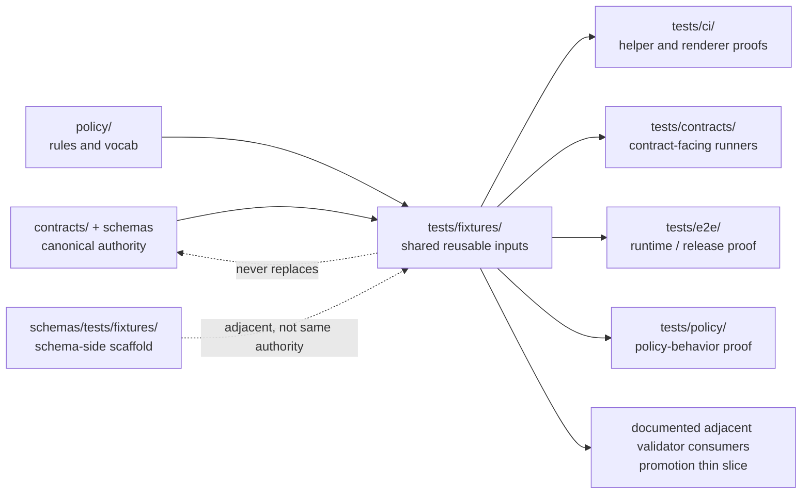

<!-- [KFM_META_BLOCK_V2]
doc_id: kfm://doc/NEEDS_VERIFICATION__tests-fixtures-readme
title: tests/fixtures
type: standard
version: v1
status: draft
owners: @bartytime4life
created: NEEDS_VERIFICATION__set_on_commit
updated: NEEDS_VERIFICATION__set_on_commit
policy_label: public
related: [../README.md, ../ci/README.md, ../contracts/README.md, ../e2e/README.md, ../policy/README.md, ../../contracts/README.md, ../../schemas/README.md, ../../schemas/tests/README.md, ../../policy/README.md, ../../.github/workflows/README.md]
tags: [kfm, tests, fixtures, verification]
notes: [Owners align with the current /tests/ governance surface; shared promotion fixtures under tests/fixtures/promotion are documented by adjacent promotion-gate materials; exact mounted subtree still needs branch verification.]
[/KFM_META_BLOCK_V2] -->

# tests/fixtures

Shared, public-safe, deterministic fixture inputs for cross-family KFM verification.

> **Status:** `experimental`  
> **Owners:** `@bartytime4life`  
> **Path:** `tests/fixtures/README.md`  
> **Repo fit:** shared reusable fixture seam inside [`../README.md`](../README.md); adjacent to [`../ci/README.md`](../ci/README.md), [`../contracts/README.md`](../contracts/README.md), [`../e2e/README.md`](../e2e/README.md), and [`../policy/README.md`](../policy/README.md); bounded by canonical contract and schema law in [`../../contracts/README.md`](../../contracts/README.md), [`../../schemas/README.md`](../../schemas/README.md), and schema-side fixture scaffolds documented in [`../../schemas/tests/README.md`](../../schemas/tests/README.md)  
> **Quick jumps:** [Scope](#scope) · [Repo fit](#repo-fit) · [Accepted inputs](#accepted-inputs) · [Exclusions](#exclusions) · [Current evidence snapshot](#current-evidence-snapshot) · [Directory tree](#directory-tree) · [Quickstart](#quickstart) · [Usage](#usage) · [Diagram](#diagram) · [Tables](#tables) · [Task list](#task-list--definition-of-done) · [FAQ](#faq) · [Appendix](#appendix)


> [!IMPORTANT]
> `tests/fixtures/` is a **shared input seam**, not a second contract, schema, policy, or publication authority.

> [!NOTE]
> This revision is grounded in adjacent repo-facing documentation and KFM doctrinal PDFs surfaced in this session. The session did **not** expose a mounted branch inventory for `tests/fixtures/`, so broader subtree claims stay visibly bounded.

---

## Scope

`tests/fixtures/` is the root-side home for **reusable test inputs** that are:

- consumed by more than one verification family or toolchain step
- easier to review as standalone artifacts than as inline test payloads
- public-safe, tiny, and deterministic
- subordinate to upstream contract, schema, and policy authority

This lane is especially natural when one artifact shape should stay consistent across several consumers, such as:

- candidate inputs reused by validator and renderer proofs
- prior/current comparison inputs reused across review steps
- small shared artifacts that should not be copied into multiple test files
- synthetic negative-path inputs that clarify one failure reason at a time

This lane is **not** where KFM should quietly relocate:

- authoritative schema meaning
- policy decision ownership
- helper implementation code
- runtime proof packs
- release-significant proofs or receipts
- secret-bearing or rights-unclear material

### Truth labels used in this README

| Label | Meaning here |
| --- | --- |
| **CONFIRMED** | Directly supported by surfaced repo-facing documentation or KFM doctrine in this session |
| **INFERRED** | Strongly suggested by adjacent docs, but not freshly proven by a mounted branch inventory |
| **PROPOSED** | Recommended lane shape or growth pattern consistent with current doctrine |
| **UNKNOWN** | Not surfaced strongly enough to describe as current repo fact |
| **NEEDS VERIFICATION** | Path, command, or implementation detail that should be rechecked on the working branch before merge |

---

## Repo fit

**Path:** `tests/fixtures/README.md`  
**Role:** shared fixture seam inside the governed `tests/` boundary.

| Direction | Surface | Why it matters |
| --- | --- | --- |
| Parent | [`../README.md`](../README.md) | `tests/` is the broader governed proof surface; this lane stays subordinate to that contract |
| CI helper proof | [`../ci/README.md`](../ci/README.md) | shared fixtures may feed renderer and summary proofs, but rendering authority stays there |
| Contract-facing tests | [`../contracts/README.md`](../contracts/README.md) | contract runners may consume shared inputs without making this lane authoritative for contract law |
| Runtime / release proof | [`../e2e/README.md`](../e2e/README.md) | broad runtime proof packs stay there, even when they reuse smaller shared inputs from here |
| Policy behavior | [`../policy/README.md`](../policy/README.md) | policy tests may consume fixture inputs, but policy ownership remains separate |
| Canonical law | [`../../contracts/README.md`](../../contracts/README.md), [`../../schemas/README.md`](../../schemas/README.md), [`../../policy/README.md`](../../policy/README.md) | shared fixtures must not silently replace upstream authority |
| Schema-side scaffold | [`../../schemas/tests/README.md`](../../schemas/tests/README.md) | visible nested fixture scaffolds exist adjacent to this lane and must not be flattened into the same authority surface |
| Workflow boundary | [`../../.github/workflows/README.md`](../../.github/workflows/README.md) | orchestration belongs at the workflow boundary, not in fixture prose |

### Working interpretation

Use `tests/fixtures/` when the main job is **share reviewable inputs across verification families**.

Move out of this lane when the main job becomes:

- own canonical schemas
- own policy decisions
- prove one helper in isolation
- exercise full request-time runtime proof
- publish or attest release-significant trust objects
- hide branch-specific assumptions behind copied artifacts

---

## Accepted inputs

Content that belongs here should remain **test-facing**, **repeatable**, and **safe to review**.

### Typical accepted inputs

| Input class | Examples | Why it belongs here |
| --- | --- | --- |
| Shared candidate inputs | `promotion/candidate.runtime.json` | One candidate shape can feed validator, CI-renderer, or adjacent review-handoff proofs without duplication |
| Shared pass / fail artifacts | `*.pass.json`, `*.fail.json` | Keeps positive and negative review cases legible and reusable |
| Deterministic comparison inputs | prior/current JSON inputs, stable diff inputs | Lets multiple consumers reason over the same change surface |
| Reusable governed examples | small bundle, record, or PROV examples | Useful when several lanes need the same artifact shape as input |
| Golden fragments | tiny reviewed JSON or Markdown excerpts | Helpful when structure matters more than full artifact size |
| Synthetic negative-path cases | malformed, missing-field, or mismatch fixtures | KFM requires visible negative states, not just happy-path examples |

### Input rules

1. Prefer declared file inputs over implicit environment scraping.
2. Prefer public-safe, tiny fixtures over copied operational artifacts.
3. Prefer deterministic fixtures over live GitHub, platform, or clock state.
4. Preserve upstream artifact shape instead of re-inventing it in test code.
5. Keep one failure reason per negative fixture whenever practical.
6. Reuse shared fixtures here before creating lane-local duplicates.
7. Keep any sensitive coordinates, unpublished evidence, or rights-unclear material out of this tree.

---

## Exclusions

| Does **not** belong here | Put it here instead | Why |
| --- | --- | --- |
| Canonical contracts or schemas | [`../../contracts/README.md`](../../contracts/README.md), [`../../schemas/README.md`](../../schemas/README.md) | Shared fixtures consume authority; they do not redefine it |
| Schema-side mirror / scaffold fixtures | [`../../schemas/tests/README.md`](../../schemas/tests/README.md) and nested schema-side fixture paths | Schema-adjacent scaffolds are not the same thing as repo-wide shared inputs |
| Helper implementation code | the relevant `tools/` lane | Fixtures prove behavior; they are not executable ownership |
| Policy source files or rule packs | [`../../policy/README.md`](../../policy/README.md) | This lane can feed policy tests without becoming the policy lane |
| Full runtime proof packs | [`../e2e/README.md`](../e2e/README.md) | Shared fixtures are smaller than outward runtime / release proof burdens |
| Lane-local scratch cases that only one consumer needs | the smallest fitting consumer lane | Not every tiny one-off input should become shared surface area |
| Receipts, proofs, or release-significant evidence | governed data / release lanes when mounted | KFM keeps process memory and trust objects distinct from general test inputs |
| Secret-bearing, unpublished, or rights-unclear artifacts | secured non-public storage | Public fixture surfaces must remain safe to clone and review |

---

## Current evidence snapshot

| Evidence item | Status | How this README uses it |
| --- | --- | --- |
| `/tests/` is a governed verification surface and remains within `@bartytime4life` ownership coverage | **CONFIRMED** | Grounds the owner and the lane’s subordinate role inside `tests/` |
| `schemas/tests/` currently exposes `README.md` and `fixtures/` | **CONFIRMED** | Forces this README to distinguish root shared fixtures from schema-side fixture scaffolds |
| Adjacent promotion-gate docs repeatedly reference shared promotion fixtures under `tests/fixtures/promotion/` | **CONFIRMED via adjacent documentation** | Grounds the current documented shared-fixture seam |
| Promotion-gate material repeatedly points to `tests/fixtures/promotion/candidate.runtime.json` as a reusable input | **CONFIRMED via adjacent documentation** | Justifies making `promotion/` the clearest present-tense example in this README |
| The documented promotion thin slice also names shared pass/fail fixture shapes such as promotion record, bundle, and diff-policy examples | **CONFIRMED via adjacent documentation** | Supports example naming guidance without claiming a fresh mounted inventory |
| Exact mounted `tests/fixtures/` contents beyond the promotion seam were not freshly enumerated from a checked-out branch in this session | **UNKNOWN / NEEDS VERIFICATION** | Keeps broader subtree claims bounded |
| A root-side `tests/fixtures/contracts/v1/` shared-fixture subtree is discussed only as an alternative future shape | **PROPOSED** | Kept as future-facing guidance rather than current repo fact |

> [!TIP]
> The discipline here is proportionality: document the shared seam that adjacent materials actually use, then show the growth path without upgrading possibility into fact.

---

## Directory tree

### Current documented shared seam

```text
tests/
└── fixtures/
    └── promotion/
        └── *.json
```

> [!NOTE]
> This tree is grounded in repeated adjacent references to `tests/fixtures/promotion/...`, not in a fresh mounted `find tests/fixtures` inventory.

### Current adjacent schema-side scaffold

```text
schemas/
└── tests/
    └── fixtures/
        └── contracts/
            └── v1/
                ├── README.md
                ├── invalid/
                │   └── README.md
                └── valid/
                    └── README.md
```

### Documented promotion examples already visible in adjacent materials

```text
tests/fixtures/promotion/
├── candidate.runtime.json
├── promotion-bundle.pass.json
├── promotion-bundle.fail.json
├── promotion-bundle-diff-policy.pass.json
├── promotion-bundle-diff-policy.fail.json
├── promotion-record.pass.json
├── promotion-record.fail.json
└── promotion-prov.pass.json
```

> [!WARNING]
> Treat the example tree above as a **documented adjacent shape**, not as a substitute for checking the active branch before merge.

### Possible stable growth shape (`PROPOSED`)

```text
tests/fixtures/
├── README.md
├── promotion/
│   └── *.json
├── catalog/
│   └── *.json
├── review/
│   └── *.json
└── <shared-family>/
    └── ...
```

Keep root growth narrow. Add a new shared subtree only when more than one family truly needs it.

---

## Quickstart

### Safe inspection commands

```bash
# inspect the shared fixture seam as the checked-out branch exposes it
find tests/fixtures -maxdepth 4 -type f 2>/dev/null | sort

# inspect the promotion examples that adjacent docs repeatedly reference
find tests/fixtures/promotion -maxdepth 4 -type f 2>/dev/null | sort

# inspect sibling verification families so placement stays honest
sed -n '1,260p' tests/README.md
sed -n '1,240p' tests/ci/README.md
sed -n '1,260p' tests/contracts/README.md
sed -n '1,240p' tests/e2e/README.md
sed -n '1,240p' tests/policy/README.md

# inspect adjacent authority and schema-side scaffold docs
sed -n '1,240p' contracts/README.md
sed -n '1,240p' schemas/README.md
sed -n '1,240p' schemas/tests/README.md
sed -n '1,220p' schemas/tests/fixtures/contracts/v1/README.md 2>/dev/null || true

# confirm current documentary references before widening this lane
git grep -n "tests/fixtures/promotion\|candidate.runtime.json\|promotion-bundle" -- . || true
```

### First local review pass

1. Verify whether `tests/fixtures/` is actually mounted on the checked-out branch.
2. Verify whether `tests/fixtures/promotion/` still exists at the documented path.
3. Verify whether consumers still reference the same shared fixture names.
4. Verify whether any subtree here has become authoritative by accident.
5. Verify whether any fixture here contains rights-sensitive or release-significant material that should move elsewhere.
6. Verify whether adjacent schema-side scaffolds are mirror-only, illustrative-only, or active runner inputs.
7. Keep visible incompleteness visible instead of smoothing it away.

---

## Usage

### Add a shared fixture here when

Land a fixture under `tests/fixtures/` when all of the following are true:

1. the artifact is an **input**, not the primary executable under test
2. more than one consumer family or proof step benefits from one shared copy
3. the nearest authoritative contract, schema, or policy surface is already declared elsewhere
4. the fixture can stay deterministic, tiny, and public-safe
5. duplicating the artifact into multiple lanes would make drift harder to review

### Keep it out of this lane when

Use another home when any of the following are true:

1. the file is authoritative contract or schema law
2. the file exists only to test one helper’s private edge case
3. the file is a runtime / release / correction proof pack
4. the file belongs to policy semantics rather than shared input shape
5. the file carries secrets, unpublished evidence, or rights-unclear locations

### Naming heuristics

Prefer names that tell reviewers exactly what role the file plays.

| Pattern | Use it for |
| --- | --- |
| `candidate.runtime.json` | a shared runtime-prepared candidate input |
| `*.pass.json` | a representative valid fixture |
| `*.fail.json` | a representative invalid fixture |
| `*.previous.json` / `*.current.json` | prior/current comparison inputs |
| `*.expected.md` | tiny reviewed expected Markdown when output shape matters |

### Fixture authoring rules

- Preserve real field names when a consumer expects a governed artifact shape.
- Strip anything non-deterministic unless the consumer is explicitly testing it.
- Prefer one fixture family per subtree over one mega-pack with unrelated burdens.
- Keep comments and surrounding prose in the README, not inside JSON payloads.
- If a fixture starts acting like a proof object, move it to the correct governed lane.

---

## Diagram


```mermaid
flowchart LR
    A[contracts/ + schemas<br/>canonical authority] --> F[tests/fixtures/<br/>shared reusable inputs]
    P[policy/<br/>rules and vocab] --> F
    SF[schemas/tests/fixtures/<br/>schema-side scaffold] -. adjacent, not same authority .-> F

    F --> CI[tests/ci/<br/>helper and renderer proofs]
    F --> CT[tests/contracts/<br/>contract-facing runners]
    F --> E[tests/e2e/<br/>runtime / release proof]
    F --> PB[tests/policy/<br/>policy-behavior proof]
    F --> V[documented adjacent validator consumers<br/>promotion thin slice]

    F -. never replaces .-> A
```

The directional point stays the same: `tests/fixtures/` should **serve shared proof inputs** without quietly becoming the law those proofs depend on.

---

## Tables

### Fixture placement matrix

| If the fixture mainly serves… | Preferred home | Why |
| --- | --- | --- |
| one reusable candidate input consumed across families | `tests/fixtures/` | shared seam stays visible and diffable |
| schema-side valid / invalid scaffold examples | `schemas/tests/fixtures/` | keeps schema-adjacent scaffolds explicit |
| contract family runners and case packs | `tests/contracts/` | contract-proof burden lives with its runner lane |
| helper-specific renderer proof | `tests/ci/` | do not centralize helper-local test data unnecessarily |
| request-time runtime or release proof pack | `tests/e2e/` | broader trust burden belongs there |
| policy grammar or decision logic examples | `tests/policy/` or `policy/` | keeps policy ownership explicit |

### Current documented promotion fixture consumers

| Shared input | Documented consumer pressure | Why it should stay shared |
| --- | --- | --- |
| `promotion/candidate.runtime.json` | promotion-gate preparation, gate execution, schema validation, and reviewer summary steps | one candidate shape should not fork across every step |
| `promotion-bundle*.json` | bundle writing, bundle summary, prior/current diff, and review handoff | several review surfaces depend on one artifact family |
| `promotion-bundle-diff-policy*.json` | checked-in policy validation and policy-summary rendering | changed-key interpretation must stay reviewable and reusable |

### Governing rules to keep visible

| Rule | Why it matters |
| --- | --- |
| Shared fixtures are reusable inputs, not singular authority | avoids contract / schema drift by stealth |
| Public-safe and deterministic beats comprehensive but unstable | Git review stays trustworthy |
| Negative fixtures should be named by failure reason | faster review, clearer intent |
| Shared input shape should match upstream artifacts | consumers test reality, not ad hoc rewrites |
| Do not widen this lane without more than one real consumer | keeps `tests/fixtures/` from becoming a junk drawer |

---

## Task list / Definition of done

Use this checklist when adding or revising a `tests/fixtures/` subtree.

- [ ] the fixture family is explicitly named
- [ ] the nearest authoritative contract, schema, or policy surface is linked
- [ ] the fixture is deterministic, tiny, and public-safe
- [ ] at least one real consumer lane is named
- [ ] the subtree does not quietly duplicate canonical authority
- [ ] negative-path cases are legible where the artifact is outcome-bearing
- [ ] any schema-side mirror or scaffold relationship is explained
- [ ] local inspection commands still match the checked-out branch
- [ ] this README is updated when the subtree changes materially
- [ ] adjacent consumer docs are updated when shared fixture names change

### Definition of done

This family is meaningfully established when all of the following are true:

1. reviewers can tell **why** a fixture lives here instead of in a consumer lane
2. consumer lanes can point to one shared artifact family without copy drift
3. upstream authority remains visibly elsewhere
4. public-safe negative cases are as readable as passing cases
5. active-branch inspection does not contradict the tree this README claims

---

## FAQ

### Why is this not the same as `schemas/tests/fixtures/`?

Because schema-side fixture scaffolds and root shared fixtures carry different burdens. Schema-side scaffolds sit next to machine-contract files; `tests/fixtures/` is the reusable root-side seam for cross-family inputs.

### Why not keep everything under `tests/validators/fixtures/` or `tests/ci/fixtures/`?

Because some artifacts are shared across multiple consumers. The promotion candidate shape is the clearest current example: adjacent docs repeatedly point several steps and tests at `tests/fixtures/promotion/...` instead of duplicating it in every lane.

### Does a file here make that path canonical?

No. This lane is reusable input surface, not authority surface.

### Can this directory hold secrets, unpublished evidence, or rights-unclear coordinates?

No. Shared fixtures here should remain public-safe and review-safe.

### What about `tests/fixtures/contracts/v1/`?

Current adjacent contract documentation only treats that as a **PROPOSED** alternative root-side shape if fixture-home law later moves root-side. Do not present it as current repo fact unless the branch proves it.

### Does a passing consumer test prove publication or merge-blocking enforcement?

No. It proves the tested behavior only. Publication, attestation, and branch protection remain separate burdens.

---

## Appendix

<details>
<summary><strong>Appendix A — Evidence basis used for this README</strong></summary>

This README is grounded in three evidence layers surfaced in the current session:

1. repo-facing `tests/` documentation showing the broader verification family map and ownership posture
2. adjacent promotion-gate and validator docs that repeatedly reference `tests/fixtures/promotion/...`
3. schema-side `schemas/tests/fixtures/` signals that force fixture-home language to stay honest

The goal is not to invent a wider tree.  
The goal is to document the shared fixture seam that the surfaced materials already rely on.

</details>

<details>
<summary><strong>Appendix B — Direct verification still needed before merge</strong></summary>

Before treating this README as fully settled branch-local truth, verify:

- the exact contents of `tests/fixtures/`
- whether `tests/fixtures/promotion/` exists exactly as documented
- whether any additional shared subtree is already mounted
- whether any file here has become release-significant enough to move elsewhere
- whether adjacent consumer docs still point to the same filenames
- whether schema-side scaffolds are mirror-only or runnable inputs
- whether any platform rules or workflows implicitly depend on paths not named here

</details>

<details>
<summary><strong>Appendix C — Reconciliation rule if the checked-out branch differs</strong></summary>

If the checked-out branch differs from this README:

1. keep the **burden-first** language
2. replace path claims with branch-visible paths immediately
3. preserve the distinction between **shared fixture seam** and **canonical authority**
4. preserve the distinction between **schema-side scaffold** and **repo-wide shared inputs**
5. downgrade unsupported claims to **UNKNOWN** or **NEEDS VERIFICATION**

The goal is not to preserve a guessed tree.  
The goal is to preserve truthful fixture placement law.

</details>
