<div align="center">

# 🧱 **Kansas Frontier Matrix — Test Fixtures & Mock Data (v11)**  
`tests/fixtures/README.md`

### **Deterministic · Synthetic · Sovereignty-Safe · FAIR+CARE · Telemetry-Aligned**

This document defines the **canonical synthetic data fixture suite** used in  
KFM’s v11 Test Platform, enabling **safe, reproducible, ethics-enforced testing**  
for ETL, AI, governance, Story Node v3, Focus Mode v3, STAC/DCAT, and telemetry pipelines.

</div>

---

# 📘 1. Purpose

The v11 fixture layer ensures:

- **Zero real-world sensitive data exposure**  
- **Deterministic, reproducible test behavior** across CI and local runs  
- **Sovereignty-safe mock data** (no cultural sites, no real coordinates)  
- **Perfect schema alignment** with:
  - Story Node v3  
  - STAC 1.x + DCAT 3.0  
  - Telemetry v11  
  - Data Contract v3  
- **AI discipline**: explainability, drift, and bias testing using synthetic patterns  
- **Provenance integrity** through SHA-256 lineage manifests  
- **Governance ledger simulation** for CARE/A2C rules  

All fixtures are **synthetic**, **non-identifying**, and **bias-neutral**, and carry  
full metadata ensuring machine-extractable provenance.

---

# 🗂️ 2. Directory Layout (v11)

```text
tests/fixtures/
│
├── README.md                     # This v11 test fixtures guide
│
├── mock_dataset.json             # Synthetic dataset (Data Contract v3 aligned)
├── mock_ai_output.json           # AI inference + SHAP/attention mock payloads
├── mock_manifest.json            # SHA-256 lineage manifest
├── mock_ledger_entry.json        # Synthetic governance entry (PROV-O + CARE)
├── mock_validation_report.json   # FAIR+CARE + schema compliance sample
└── metadata.json                 # Fixture provenance metadata (v11)
```

---

# 🧬 3. Fixture Architecture (v11)

## 3.1 Functional Purpose

| Fixture | Purpose |
|---------|---------|
| `mock_dataset.json` | Test ETL → data contract → STAC/DCAT shape → graph ingestion. |
| `mock_ai_output.json` | Test Focus Mode v3 explainability, bias, drift without real data. |
| `mock_ledger_entry.json` | Validate governance ledger sync, provenance recording. |
| `mock_manifest.json` | Verify checksum lineage from generation → test run. |
| `mock_validation_report.json` | Validate FAIR+CARE pipeline behavior & ethical gates. |
| `metadata.json` | Bind fixtures to source-of-truth provenance. |

## 3.2 Architecture Diagram

```mermaid
flowchart TD
    A["Test Runner (Pytest/CI)"] --> B["Load Synthetic Fixtures"]
    B --> C["Pipeline Under Test (ETL · AI · Graph · StoryNode · Telemetry)"]
    C --> D["FAIR+CARE · Sovereignty · Ethics Checks"]
    D --> E["Checksum Lineage (mock_manifest.json)"]
    E --> F["Governance Simulation (mock_ledger_entry.json)"]
    F --> G["Telemetry v11 Export (energy · CO₂ · a11y · runtime)"]
```



---

# 🧱 4. Fixture Requirements (v11)

All test fixtures MUST:

- Contain **no real coordinates**, **no real individuals**, **no restricted cultural data**  
- Be deterministic & version-pinned  
- Use **synthetic Story Node geometries** within permitted bounding boxes  
- Match **Data Contract v3** schema  
- Include **full provenance metadata**  
- Align with:
  - CIDOC CRM (`E31 Document`, `E53 Place`, `E5 Event` simulation)
  - OWL-Time (synthetic timestamps)
  - GeoSPARQL (valid mock geometries)
- Support **OpenLineage v2.5** + **PROV-O** output generation tests  

---

# 📦 5. Fixture Component Summary

| File | Description | Standard Alignment |
|------|-------------|-------------------|
| `mock_dataset.json` | Tabular dataset w/ schema correctness. | DCAT 3.0 · STAC · Data Contract v3 |
| `mock_ai_output.json` | Explainability + bias simulation. | XAI · SHAP · Focus Mode v3 |
| `mock_manifest.json` | SHA-256 lineage manifest. | PROV-O · Checksum v11 |
| `mock_ledger_entry.json` | Synthetic governance entry. | CARE · FAIR+CARE · A2C |
| `mock_validation_report.json` | Ethics + schema validation output. | FAIR+CARE · MCP |
| `metadata.json` | Source-of-truth fixture provenance. | ISO 19115 · PROV-O |

---

# ⚖️ 6. FAIR+CARE Governance Matrix (v11)

| Principle | Implementation | Oversight |
|-----------|----------------|-----------|
| **Findable** | UUID + SHA-256 in `metadata.json`. | @kfm-data |
| **Accessible** | MIT-licensed synthetic data. | @kfm-accessibility |
| **Interoperable** | Conforms to STAC/DCAT/ISO/JSON-LD. | @kfm-architecture |
| **Reusable** | Deterministic & version-pinned. | @kfm-design |
| **Collective Benefit** | Supports equitable QA processes. | @faircare-council |
| **Authority to Control** | CARE review of synthetic patterns. | @kfm-governance |
| **Responsibility** | Maintainers ensure ethics + neutrality. | @kfm-security |
| **Ethics** | No bias, no sensitive data, no harm potential. | @kfm-ethics |

Audit references (synthetic):

```
reports/audit/ai_tests_fixtures_ledger.json
reports/fair/tests_fixtures_summary.json
```

---

# 🌱 7. Sustainability Metrics (v11)

| Metric | Target | Verified By |
|--------|---------|-------------|
| Energy/test | ≤ 0.5 Wh | @kfm-sustainability |
| CO₂/test | ≤ 0.6 g | @kfm-security |
| RE100 Compliance | 100% | @kfm-infrastructure |
| FAIR+CARE Pass Rate | 100% | @faircare-council |

Telemetry recorded in:

```
../../../releases/v11.0.0/tests-fixtures-telemetry.json
```

---

# 🧾 8. Example Fixture Metadata Record (v11)

```json
{
  "id": "tests_fixtures_v11.0.0_2025Q4",
  "fixtures_loaded": [
    "mock_dataset.json",
    "mock_ai_output.json",
    "mock_manifest.json",
    "mock_ledger_entry.json"
  ],
  "checksum_verified": true,
  "fairstatus": "certified",
  "governance_registered": true,
  "telemetry_ref": "releases/v11.0.0/tests-fixtures-telemetry.json",
  "governance_ref": "reports/audit/ai_tests_fixtures_ledger.json",
  "created": "2025-11-24T14:55:00Z",
  "validator": "@kfm-tests"
}
```

---

# 🕰️ 9. Version History

| Version | Date | Summary |
|--------:|------|---------|
| v11.0.0 | 2025-11-24 | Full upgrade to KFM-MDP v11, sovereignty-safe fixtures, telemetry v11, CARE v11 tester. |
| v10.0.0 | 2025-11-10 | Previous fixture suite. |
| v9.x    | 2023–2024 | Early synthetic data generation tooling. |

---

<div align="center">

**© 2025 Kansas Frontier Matrix — MIT License**  
**Synthetic QA × FAIR+CARE × Sovereignty × Telemetry v11**  
[Back to Tests Index](../README.md) · [Governance](../../../docs/standards/governance/ROOT-GOVERNANCE.md)

</div>