<div align="center">

# 🧱 Kansas Frontier Matrix — **Test Fixtures**  
`tests/fixtures/`

**Deterministic · Minimal · Provenance-Tracked Sample Data**

[](../../.github/workflows/tests.yml)  
[](https://codecov.io/gh/bartytime4life/Kansas-Frontier-Matrix)  
[](../../docs/)  
[](../../LICENSE)

</div>

---

```yaml
---
title: "KFM • Test Fixtures (tests/fixtures/)"
version: "v1.3.0"
last_updated: "2025-10-17"
owners: ["@kfm-data", "@kfm-engineering"]
tags: ["fixtures","testing","stac","geojson","reproducibility","mcp"]
license: "MIT"
semantic_alignment:
  - STAC 1.0
  - GeoJSON RFC 7946
  - MCP-DL v6.3 Testing & Provenance Standards
---
```

---

## 🧭 Overview

The `tests/fixtures/` directory provides **controlled, reproducible datasets** used to validate every layer of the Kansas Frontier Matrix (KFM) ecosystem —  
from **ETL pipelines** and **STAC validation**, to **AI/NLP testing** and **frontend integration**.

All fixture data are **tiny, deterministic, and traceable**, allowing CI pipelines to execute full validation coverage without large dependencies or network access.

> **Purpose:** To make every test in KFM reproducible, predictable, and auditable — the data “samples” of the frontier lab.

---

## 🧩 Fixture Lifecycle

```mermaid
flowchart TD
    A([Fixture Created<br/>geo · text · stac · config]) --> B([Used in Unit / Integration Tests])
    B --> C([Schema Validation<br/>STAC · JSON Schema])
    C --> D([CI Execution<br/>GitHub Actions])
    D --> E([Coverage Reports<br/>Codecov / Logs])
    E --> F([Validated Build<br/>Deploys Docs & Web UI])

    classDef s fill:#d7ebff,stroke:#0078d4,color:#111;
    classDef v fill:#eafaf1,stroke:#1a7f37,color:#111;
    classDef c fill:#fff8e1,stroke:#ffb300,color:#111;
    classDef done fill:#d1ffd7,stroke:#1a7f37,color:#111;

    class A s;
    class B,C v;
    class D c;
    class E,F done;
```


<!-- END OF MERMAID -->

---

## 🧱 Directory Structure

```
tests/fixtures/
├── geo/                     # GeoJSON & raster samples
│   ├── ks_county_sample.geojson
│   ├── tiny_vector.geojson
│   └── dem_sample.tif
├── text/                    # OCR / diary / treaty excerpts
│   ├── sample_diary.txt
│   └── treaty_excerpt.txt
├── stac/                    # STAC Item/Collection examples
│   ├── stac_item_min.json
│   └── stac_collection_min.json
├── sources/                 # data/sources/ manifests for fetch tests
│   └── usgs_topo_sample.json
├── configs/                 # UI config fixtures
│   ├── layers_min.json
│   └── app_config_min.json
└── __init__.py              # Enables importing fixtures via Pytest
```

---

## 🧩 Fixture Categories

| Category    | Used By                                    | Purpose                                                    |
| :---------- | :----------------------------------------- | :--------------------------------------------------------- |
| **Geo**     | `convert_gis`, `validate_stac`, MapView UI | Validate GeoJSON/COG projections and metadata              |
| **Text**    | NLP / OCR pipelines                        | Test entity recognition (NER) for people, places, treaties |
| **STAC**    | `validate_stac.py`, schema compliance      | Confirm STAC structure and item/collection conformance     |
| **Sources** | `fetch_data.py`                            | Mock remote dataset downloads and manifest parsing         |
| **Configs** | `build_config.py`, frontend tests          | Verify web config generation and layer mapping logic       |

---

## 🧪 Fixture Guidelines

* Keep files **≤ 50 KB** each — optimized for CI and Git diffs.  
* Use **valid schemas** (GeoJSON, STAC 1.0, JSON Schema).  
* Favor **Kansas-specific geography and history** (“Larned”, “Ellsworth”, “Arkansas River”).  
* Encode in **UTF-8** with Unix line endings (`\n`).  
* Include **CRS metadata** (`EPSG:4326`) for spatial data.  
* Seed any randomness (`random.seed(42)`) for reproducibility.  
* Raster fixtures → ≤ 10×10 pixels, single band.  
* Include provenance notes inline or in `meta.json`.  

---

## 🧩 Example Usage

### 🐍 Python (Pytest)

```python
from pathlib import Path
import json
import pytest

@pytest.fixture
def stac_item(fixtures_dir):
    return json.loads((fixtures_dir / "stac/stac_item_min.json").read_text())
```

`conftest.py` provides a base fixture path:

```python
import pytest
from pathlib import Path

@pytest.fixture(scope="session")
def fixtures_dir() -> Path:
    return Path(__file__).parent
```

### 💻 JavaScript

```js
import fs from "fs";
const geo = JSON.parse(fs.readFileSync("tests/fixtures/geo/ks_county_sample.geojson", "utf8"));
test("GeoJSON loads", () => expect(geo.type).toBe("FeatureCollection"));
```

---

## 🧱 Example Fixture — `stac_item_min.json`

```json
{
  "type": "Feature",
  "id": "usgs_topo_larned_1894",
  "properties": {
    "datetime": "1894-01-01T00:00:00Z",
    "proj:epsg": 4326
  },
  "assets": {
    "cog": {
      "href": "data/cogs/usgs_topo_larned_1894.tif",
      "type": "image/tiff; application=geotiff; profile=cloud-optimized"
    }
  },
  "bbox": [-99.4, 38.1, -99.0, 38.4]
}
```

> Minimal STAC-compliant example for unit and schema validation tests.

---

## ⚙️ Regeneration & Provenance

| Task                     | Location                 | Description                                         |
| :----------------------- | :----------------------- | :-------------------------------------------------- |
| **Regeneration Scripts** | `tools/notebooks/`       | Create or update test fixtures                      |
| **Version Control**      | Git                      | Each fixture change tracked with provenance message |
| **Schema Updates**       | `tools/validate_stac.py` | Fixtures revalidated when STAC spec changes         |
| **Public Data Sources**  | USGS, NOAA, NRCS         | Used only for open/public-domain samples            |

* No private or sensitive data.  
* All fixture generation workflows use reproducible scripts with checksum tracking.  

---

## 🧠 Best Practices for Contributors

* Regenerate fixtures only through approved pipelines or notebooks.  
* Always document **why** a fixture changed in your PR description.  
* Do not include heavy external data; create micro-samples instead.  
* Run `pytest tests/fixtures` after any fixture modification to confirm schema validity.  
* Use `.gitignore` for large temporary or derivative files.  

---

## 🧾 Provenance & Integrity

| Artifact         | Description                                      |
| :--------------- | :----------------------------------------------- |
| **Inputs**       | Synthetic data, STAC references, open datasets   |
| **Outputs**      | Minimal JSON, GeoJSON, raster, or text fixtures  |
| **Dependencies** | Python 3.11+, pytest, jsonschema, rasterio       |
| **Integrity**    | SHA256 checksums recorded per fixture            |
| **Traceability** | Linked to PR IDs, commit SHAs, and CI build logs |

---

## 🧠 MCP-DL v6.3 Compliance

| MCP Principle       | Implementation                                        |
| :------------------ | :---------------------------------------------------- |
| Documentation-first | Fixtures documented with metadata and README context  |
| Reproducibility     | Deterministic fixture generation + seeded randomness  |
| Provenance          | SHA-tracked metadata + public dataset citations       |
| Accessibility       | Open licenses + readable schema-conformant JSON       |
| Open Standards      | GeoJSON, STAC 1.0, JSON Schema                        |
| Auditability        | CI schema validation + artifact checksum verification |

---

<div align="center">

🧩 **Small data → big confidence.**  
Fixtures are the **lab samples** that keep Kansas Frontier Matrix verifiable, reproducible, and transparent.

</div>