# KFM Tests Fixtures — README


> **Purpose (required):** Define how to create, store, and maintain **small, synthetic** fixtures under `tests/fixtures/` so KFM tests remain deterministic and aligned to the canonical pipeline + CI validation behavior.  
> *(Fixtures are “contract anchors” — not a mirror of production datasets.)*

> [!IMPORTANT]
> **Fixtures are NOT production data.**  
> If you’re storing real or derived datasets, use the governed data lifecycle (`data/raw → data/work → data/processed`) and publish metadata to catalogs (`data/stac/`, `data/catalog/dcat/`, `data/prov/`).[^pipeline]

<details>
<summary>📌 Table of contents</summary>

- [📘 Overview](#-overview)
- [🗂️ Directory Layout](#️-directory-layout)
- [🧭 Context](#-context)
- [🗺️ Diagrams](#️-diagrams)
- [📦 Data & Metadata](#-data--metadata)
- [🌐 STAC, DCAT & PROV Alignment](#-stac-dcat--prov-alignment)
- [🧱 Architecture](#-architecture)
- [🧠 Story Node & Focus Mode Integration](#-story-node--focus-mode-integration)
- [🧪 Validation & CI/CD](#-validation--cicd)
- [⚖ FAIR+CARE & Governance](#-faircare--governance)
- [📚 Project Reference Library](#-project-reference-library)
- [🕰️ Version History](#️-version-history)

</details>

---

## 📘 Overview

### Purpose

- Provide a canonical home for **tiny, synthetic** inputs used by unit/integration/contract tests.
- Encode explicit test expectations for:
  - **Catalog boundaries** (STAC/DCAT/PROV validation),
  - **Graph boundaries** (Neo4j import + ontology constraints),
  - **API boundaries** (OpenAPI/GraphQL request/response contracts),
  - **UI registry boundaries** (schema + snapshot tests),
  - **Story Node validators** (test-only nodes; never published).
- Prevent silent drift by keeping fixtures **stable, diffable, and governance-safe**.

### Scope

| ✅ In Scope | 🚫 Out of Scope |
|---|---|
| Small synthetic fixtures used by tests (JSON/GeoJSON/CSV, tiny binaries) | Raw source data snapshots (belongs in `data/raw/<domain>/`) |
| Minimal/edge/invalid fixtures for schema validation | Full production catalogs or “golden dumps” of `data/stac/**` |
| Contract fixtures for API boundary and UI registries | Secrets/credentials, PII, or restricted locations (unless generalized + approved) |
| Fixture metadata that describes “what this tests” | Writing or changing governance policy text (belongs in `docs/governance/`) |

### Audience

- **Primary:** Contributors changing pipelines, catalogs, schemas, graph ingestion, API contracts, or UI registries.
- **Secondary:** Maintainers reviewing PRs and debugging CI failures.

### Definitions (aligned to Master Guide v13)

- **Glossary:** `docs/glossary.md` (expected location).[^repo-map]
- **Catalogs:** STAC (assets), DCAT (dataset/distribution discovery), PROV (lineage).[^pipeline]
- **Contract artifact:** A machine-validated schema/spec defining an interface (JSON Schema, OpenAPI, GraphQL SDL, UI config).[^contract-first]
- **Evidence artifact:** Any derived data product treated as “data + metadata + provenance” (cataloged + PROV) before use in UI or narratives.[^pipeline]
- **Story Node:** A governed, machine-ingestible narrative that is provenance-linked.[^pipeline]
- **Focus Mode:** A provenance-linked narrative view — **no unsourced narrative**.[^pipeline]

### Key artifacts (what this doc points to)

| Artifact | Path / Identifier | Why it matters |
|---|---|---|
| Master Guide (canonical pipeline + contracts) | `docs/MASTER_GUIDE_v13.md` | Source of truth for ordering + boundaries |
| Repo structure standard | `docs/standards/KFM_REPO_STRUCTURE_STANDARD.md` | “One subsystem, one canonical home” |
| Markdown work protocol | `docs/standards/KFM_MARKDOWN_WORK_PROTOCOL.md` | Governed doc rules (front-matter + sections) |
| STAC profile | `docs/standards/KFM_STAC_PROFILE.md` | Project-specific STAC expectations |
| DCAT profile | `docs/standards/KFM_DCAT_PROFILE.md` | Project-specific DCAT expectations |
| PROV profile | `docs/standards/KFM_PROV_PROFILE.md` | Project-specific PROV expectations |
| Schemas | `schemas/` | JSON Schemas used in validation gates |
| Pipelines | `src/pipelines/` | Deterministic transforms (idempotent, logged) |
| Graph subsystem | `src/graph/` | Ontology bindings + graph build/import rules |
| API subsystem | `src/server/` | API layer (contracts + redaction) |
| UI subsystem | `web/` | React/Map UI (never queries Neo4j directly) |
| Story Nodes | `docs/reports/story_nodes/` | Draft + published narrative artifacts |

### Definition of done (for this document)

- [x] Front-matter complete and `path` matches file location
- [x] Fixture placement + responsibilities documented
- [x] Structure aligned to Master Guide v13 repo map
- [x] Governance/sensitivity constraints included
- [ ] Repo lint / markdown lint passes (CI or local)
- [ ] Maintainer review

---

## 🗂️ Directory Layout

### This document

- `path`: `tests/fixtures/README.md` (must match front-matter)

### Related repository paths (orientation)

> These are **canonical homes** in the v13 repo map.[^repo-map]

| Area | Path | What lives here |
|---|---|---|
| Tests | `tests/` | Unit/integration/contract/e2e tests + fixtures |
| Schemas | `schemas/` | `stac/`, `dcat/`, `prov/`, `storynodes/`, `ui/`, `telemetry/` |
| Data lifecycle | `data/<domain>/{raw,work,processed}/` | Domain data staging (not fixtures) |
| Catalog outputs | `data/stac/` + `data/catalog/dcat/` + `data/prov/` | Published metadata “boundary artifacts” |
| Pipelines | `src/pipelines/` | Deterministic ETL + catalog builders |
| Graph | `src/graph/` | Ontology + graph import/build |
| API boundary | `src/server/` | API contracts + redaction |
| UI | `web/` | React/Map UI |
| Story Nodes | `docs/reports/story_nodes/` | Draft + published narratives |
| Governance | `docs/governance/` | Ethics + sovereignty + review gates |

### Recommended fixture sub-tree ✅

```text
📁 tests/
├── 📄 README.md
└── 📁 fixtures/
    ├── 📄 README.md
    ├── 📁 catalogs/
    │   ├── 📁 stac/
    │   │   ├── 📁 minimal_valid/
    │   │   ├── 📁 edge_cases/
    │   │   └── 📁 invalid/
    │   ├── 📁 dcat/
    │   │   ├── 📁 minimal_valid/
    │   │   ├── 📁 edge_cases/
    │   │   └── 📁 invalid/
    │   └── 📁 prov/
    │       ├── 📁 minimal_valid/
    │       ├── 📁 edge_cases/
    │       └── 📁 invalid/
    ├── 📁 graph/
    │   ├── 📁 import_samples/         # tiny CSV/JSON import samples
    │   └── 📁 cypher/                 # small Cypher scripts for tests (optional)
    ├── 📁 api/
    │   ├── 📁 requests/
    │   ├── 📁 responses/
    │   └── 📁 schemas/                # copied/minimized OpenAPI/GraphQL fragments (optional)
    ├── 📁 ui/
    │   └── 📁 registry/               # UI config fixtures + schema snapshots
    ├── 📁 assets/
    │   ├── 📁 tiny/                   # tiny binaries (images, gz, etc.)
    │   └── 📁 geo/                    # tiny GeoJSON/GeoParquet samples (optional)
    └── 📁 manifests/
        ├── 📄 fixtures.index.yaml     # registry of fixtures (recommended)
        └── 📄 (per-fixture YAML descriptors, optional)
```

> [!TIP]
> If your tests spin up Postgres/Neo4j via Docker Compose, keep the **seed data** here (tiny SQL/Cypher) and let the environment be created/teardown deterministically per run.[^db-fixtures]

---

## 🧭 Context

### Background (why fixtures exist)

KFM’s canonical ordering is:

**ETL → STAC/DCAT/PROV catalogs → Neo4j graph → APIs → React/Map UI → Story Nodes → Focus Mode**.[^pipeline]

Fixtures exist to make subsystem contracts **testable, reproducible, and auditable** without requiring “full data” replays.

### Non-negotiable invariants (fixtures must respect)

**Contract-first + deterministic pipeline**

- **Contract-first:** Schemas and API contracts are first-class artifacts; changes require strict versioning + compatibility checks.[^contract-first]
- **Deterministic pipeline:** ETL jobs are idempotent, config-driven, and logged, producing stable outputs for given inputs.[^contract-first]

**API boundary preserved**

- The UI (`web/`) must never read Neo4j directly; it consumes only API payloads/contracts.[^api-boundary]

**Governance-safe by default**

- No secrets, no tokens, no credentials.
- No PII.
- No restricted locations unless generalized and explicitly approved (sovereignty + CARE).[^sensitivity]

**No duplicate canonical homes**

- Fixtures are not a second copy of `data/**` or `schemas/**`.
- Evidence artifacts belong in `data/processed/**` and must be cataloged + traced via PROV.[^pipeline]

---

## 🗺️ Diagrams

### Fixtures as contract anchors

```mermaid
flowchart LR
  F["tests/fixtures/**"] --> T["tests/** (unit · integration · contract · e2e)"]
  T --> V["CI gates (schema · contract · security · sovereignty)"]
  V --> C["Catalog outputs (data/stac · data/catalog/dcat · data/prov)"]
  C --> G["Graph (src/graph)"]
  G --> A["API boundary (src/server)"]
  A --> U["UI (web/)"]
  U --> S["Story Nodes (docs/reports/story_nodes)"]
  S --> FM["Focus Mode (provenance-linked)"]
```



---

## 📦 Data & Metadata

### Fixture design principles ✅

1. **Small and synthetic:** exercise logic/contracts, not “real world scale”.
2. **Stable identifiers:** use stable IDs + filenames so snapshots don’t churn.
3. **Deterministic timestamps:** use fixed datetimes; avoid `now()` in fixtures.
4. **License-safe:** include only synthetic or open-licensed content; add attribution when applicable.
5. **Explicit sensitivity:** if a fixture contains any location/cultural knowledge, it must be generalized/redacted and reviewed.[^sensitivity]
6. **Portable execution:** tests should not rely on local machine state; prefer containerized dependencies when needed.[^db-fixtures]

### Naming conventions (recommended)

Use a human-readable filename plus a globally unique **fixture_id** inside a manifest.

Examples:

- `kfm.fixture.stac.minimal_valid.v1`
- `kfm.fixture.api.search_response.edge_case.v1`
- `kfm.fixture.graph.import_sample.minimal.v1`

### Per-fixture manifest (recommended)

Create a YAML descriptor in `tests/fixtures/manifests/` for any fixture that’s more than “one obvious file”.

```yaml
fixture_id: "kfm.fixture.stac.minimal_valid.v1"
owner: "Data/Platform"
type: "stac_item"
expected: "pass"                 # pass | fail
paths:
  - "tests/fixtures/catalogs/stac/minimal_valid/item.json"
schemas:
  - "schemas/stac/item.schema.json"
links:
  stac_to_prov: "tests/fixtures/catalogs/prov/minimal_valid/run.jsonld"
  stac_to_dcat: "tests/fixtures/catalogs/dcat/minimal_valid/dataset.jsonld"
constraints:
  size_budget_mb: 1
  deterministic_time_utc: "2020-01-01T00:00:00Z"
governance:
  sensitivity: "public"
  classification: "open"
  care_label: "TBD"
notes: >
  Minimal valid STAC Item including KFM provenance hooks.
```

> [!NOTE]
> **Deterministic cleanup matters.** If a test creates DB tables, files, or services, it should also teardown deterministically (fixture finalizers / fresh DB per run).[^db-fixtures]

### Budgets & limits (recommended defaults)

These keep CI fast and prevent fixture creep:

- **Size:** ≤ 1 MB per JSON/GeoJSON; ≤ 5 MB total per fixture bundle.
- **Runtime:** each fixture validation should complete in ≤ 2s locally (ballpark).
- **Count:** prefer < 20 fixtures per subsystem bucket; consolidate when possible.

---

## 🌐 STAC, DCAT & PROV Alignment

### Fixture buckets (required)

Keep three buckets to make CI behavior explicit:

- `minimal_valid/` — MUST pass validation (baseline contract)
- `edge_cases/` — MUST pass while exercising rare/optional fields
- `invalid/` — MUST fail (prevents silent regressions)

### Profile references (v11)

Profiles are defined under `docs/standards/` (STAC/DCAT/PROV) and validated in CI.[^pipeline]

### KFM provenance hooks (recommended for *valid* STAC fixtures)

Include project hooks that enable cross-layer linkage:

- `properties.kfm:provenance_ref` → pointer to a PROV Activity/Entity bundle
- `properties.kfm:lineage_sha` → commit that produced the artifact (or placeholder)
- `properties.kfm:telemetry_ref` → run/telemetry identifier (if available)

### Link + size discipline

- Avoid remote asset links in fixtures.
- If a fixture includes `http(s)` URLs, tests should **not** fetch them by default (offline CI).
  - Prefer validating URL *shape* (scheme/host/path) rather than resolving.

---

## 🧱 Architecture

### Where fixtures fit (boundary-by-boundary)

Fixtures support tests at each contract boundary:

- **ETL/pipelines:** parser/normalizer unit tests (no network)
- **Catalogs:** STAC/DCAT/PROV schema + integrity checks
- **Graph:** import schema + ontology constraint tests (run on tiny fixture graph)
- **API boundary:** request/response contract tests + redaction behaviors
- **UI registry:** registry schema checks + accessibility gates
- **Story validators:** Story Node validator tests (published nodes remain elsewhere)

### Non-negotiable boundary 🚧

The UI layer (`web/`) **must not** read Neo4j directly; UI fixtures must be API payloads, not graph queries.[^api-boundary]

---

## 🧠 Story Node & Focus Mode Integration

### Fixture role in narrative safety

- Fixtures may be used to test Story Node validators and “provenance-linked narrative” rules.
- **Do not** store published Story Nodes under `tests/fixtures/`. Published nodes live under `docs/reports/story_nodes/`.[^repo-map]

### Optional pattern (test-only)

- `tests/fixtures/story_nodes/` may hold **non-published** sample nodes used only by validators.  
  Mark them clearly as **TEST ONLY** and keep them synthetic + citation-safe.

---

## 🧪 Validation & CI/CD

### Deterministic behavior contract ✅

- If `tests/fixtures/` (or any sub-root) is absent, validations may **skip**.
- If present but invalid, CI must **fail deterministically**.

### Recommended CI checks for fixtures

Align fixture checks to the Master Guide v13 gates:

- **Markdown/front-matter checks** (docs validated for YAML + required sections).[^ci-gates]
- **Link/reference validation** (no broken internal links / refs).[^ci-gates]
- **Schema validation** for any STAC/DCAT/PROV fixtures present.[^ci-gates]
- **Graph integrity tests** (constraints + ontology regressions) on a tiny fixture graph.[^ci-gates]
- **API contract tests** (OpenAPI/GraphQL lint + responses match contract).[^ci-gates]
- **Security & governance scans** (secrets, PII, sensitive locations, classification consistency).[^ci-gates]

### Local reproduction (placeholders)

```bash
# Replace with repo’s actual commands / make targets.
# Examples only:

# Run all tests
# make test

# Validate metadata schemas
# make validate-schemas

# Validate fixtures (schema + graph + contracts)
# make validate-fixtures
```

---

## ⚖ FAIR+CARE & Governance

### Review gates (fixtures)

Governance review is required when fixtures introduce:

- any sensitive locations or culturally sensitive knowledge (even as “test data”),
- new external sources or licenses,
- new public-facing schema fields.

### CARE / sovereignty considerations

Treat fixtures as publishable artifacts:

- Generalize or redact precise coordinates for protected sites, and document the choice.[^sensitivity]
- Never “downgrade” classification between inputs and outputs (CI flags this).[^ci-gates]

### AI usage constraints

AI transform permissions/prohibitions are defined in front-matter; they must remain aligned with repo governance.

---

## 📚 Project Reference Library

> [!NOTE]
> This section is **non-normative** — it exists to keep fixture authors aligned with the project’s shared reference shelf 📚.

<details>
<summary>📖 Included project PDFs (by theme)</summary>

### 🧭 KFM core (architecture + governance)

- `MARKDOWN_GUIDE_v13.md.gdoc`
- `Kansas Frontier Matrix (KFM) – Comprehensive Technical Documentation.pdf`

### 🗺️ GIS, cartography, and spatial analysis

- `python-geospatial-analysis-cookbook.pdf`
- `KFM- python-geospatial-analysis-cookbook-over-60-recipes-to-work-with-topology-overlays-indoor-routing-and-web-application-analysis-with-python.pdf`
- `making-maps-a-visual-guide-to-map-design-for-gis.pdf`
- `Mobile Mapping_ Space, Cartography and the Digital - 9789048535217.pdf`
- `Archaeological 3D GIS_26_01_12_17_53_09.pdf`
- `Cloud-Based Remote Sensing with Google Earth Engine-Fundamentals and Applications.pdf`

### 🗄️ Data management + databases

- `PostgreSQL Notes for Professionals - PostgreSQLNotesForProfessionals.pdf`
- `Database Performance at Scale.pdf`
- `Scalable Data Management for Future Hardware.pdf`
- `Data Spaces.pdf`

### 📈 Statistics, modeling, and analysis

- `Scientific Modeling and Simulation_ A Comprehensive NASA-Grade Guide.pdf`
- `Understanding Statistics & Experimental Design.pdf`
- `regression-analysis-with-python.pdf`
- `Regression analysis using Python - slides-linear-regression.pdf`
- `think-bayes-bayesian-statistics-in-python.pdf`
- `Deep Learning for Coders with fastai and PyTorch - Deep.Learning.for.Coders.with.fastai.and.PyTorchpdf` *(project file; access may be limited in some tooling)*
- `graphical-data-analysis-with-r.pdf`

### 🧩 Graphs, math, and optimization

- `Spectral Geometry of Graphs.pdf`
- `Generalized Topology Optimization for Structural Design.pdf`

### 🧑‍⚖️ Ethics, law, and human context

- `Introduction to Digital Humanism.pdf`
- `On the path to AI Law’s prophecies and the conceptual foundations of the machine learning age.pdf`
- `Principles of Biological Autonomy - book_9780262381833.pdf`

### 🌐 Web & visualization

- `responsive-web-design-with-html5-and-css3.pdf`
- `webgl-programming-guide-interactive-3d-graphics-programming-with-webgl.pdf`
- `compressed-image-file-formats-jpeg-png-gif-xbm-bmp.pdf`

### 🔐 Security (defensive reference only)

- `ethical-hacking-and-countermeasures-secure-network-infrastructures.pdf`
- `Gray Hat Python - Python Programming for Hackers and Reverse Engineers (2009).pdf`

### 🧰 General programming reference packs

- `A programming Books.pdf`
- `B-C programming Books.pdf`
- `D-E programming Books.pdf`
- `F-H programming Books.pdf`
- `I-L programming Books.pdf`
- `M-N programming Books.pdf`
- `O-R programming Books.pdf`
- `S-T programming Books.pdf`
- `U-X programming Books.pdf`

</details>

---

## 🕰️ Version History

| Version | Date | Summary | Author |
|---|---:|---|---|
| v1.1.0 | 2026-01-14 | Align fixture README to Master Guide v13 repo map + CI gates; add manifest spec + budgets; add project library index | TBD |
| v1.0.0 | 2025-12-27 | Initial fixtures README scaffold | TBD |

---

### Footer refs (do not remove)

- Master Guide (v13): `docs/MASTER_GUIDE_v13.md`
- Master Guide (v12): `docs/MASTER_GUIDE_v12.md`
- Universal Template: `docs/templates/TEMPLATE__KFM_UNIVERSAL_DOC.md`
- Story Node Template: `docs/templates/TEMPLATE__STORY_NODE_V3.md`
- API Contract Template: `docs/templates/TEMPLATE__API_CONTRACT_EXTENSION.md`
- Repo Structure Standard: `docs/standards/KFM_REPO_STRUCTURE_STANDARD.md`
- Governance: `docs/governance/ROOT_GOVERNANCE.md`
- Ethics: `docs/governance/ETHICS.md`
- Sovereignty: `docs/governance/SOVEREIGNTY.md`
- Review Gates: `docs/governance/REVIEW_GATES.md`

---

[^pipeline]: Canonical pipeline ordering, data lifecycle, and catalog “boundary artifacts” are defined in Master Guide v13. [oai_citation:0‡MARKDOWN_GUIDE_v13.md.gdoc](file-service://file-UYVruFXfueR8veHMUKeugU)  [oai_citation:1‡MARKDOWN_GUIDE_v13.md.gdoc](file-service://file-UYVruFXfueR8veHMUKeugU)
[^repo-map]: Repo map + canonical top-level homes (incl. `schemas/`, `src/server/`, `web/`, `docs/reports/story_nodes/`). [oai_citation:2‡MARKDOWN_GUIDE_v13.md.gdoc](file-service://file-UYVruFXfueR8veHMUKeugU)
[^contract-first]: Contract-first + deterministic pipeline definitions (and why they’re enforced). [oai_citation:3‡MARKDOWN_GUIDE_v13.md.gdoc](file-service://file-UYVruFXfueR8veHMUKeugU)
[^api-boundary]: UI consumes the API; it must not query the graph directly. [oai_citation:4‡MARKDOWN_GUIDE_v13.md.gdoc](file-service://file-UYVruFXfueR8veHMUKeugU)
[^ci-gates]: Minimum CI gates: front-matter checks, link validation, schema validation, graph integrity tests, API contract tests, and security/governance scans. [oai_citation:5‡MARKDOWN_GUIDE_v13.md.gdoc](file-service://file-UYVruFXfueR8veHMUKeugU)
[^sensitivity]: Sensitive Location Policy + sovereignty: generalize/redact protected coordinates and use governance review for sensitive cultural knowledge. [oai_citation:6‡Kansas Frontier Matrix (KFM) – Comprehensive Technical Documentation.pdf](file-service://file-AkqwUuYPp5zePf7pv5SMxi)
[^db-fixtures]: Database fixtures should enable repeatable test setup/teardown, often via containerized DBs; tests should clean up deterministically (fixture finalizers / fresh DB per run). [oai_citation:7‡B-C programming Books.pdf](file-service://file-7V9zHZSJakZZrJAw9ASCMJ)  [oai_citation:8‡O-R programming Books.pdf](file-service://file-M6zCNBGmJbot7A2aaUUy9M)