<div align="center">

# 🧱 **Kansas Frontier Matrix — Test Fixtures & Mock Data**
`tests/fixtures/README.md`

**Purpose:**  
Provide a FAIR+CARE-certified library of **synthetic datasets, mock AI outputs, and governance artifacts** for deterministic, ethical, and reproducible testing across KFM’s ETL, AI, and validation pipelines.  
Ensures complete **checksum lineage, ethics verification, and reproducibility** in compliance with **MCP-DL v6.3** and **ISO 19115**.

[](../../../docs/standards/faircare-validation.md)
[](../../../LICENSE)
[](../../../docs/architecture/repo-focus.md)
[]()

</div>

---

## 📘 Overview

Fixtures emulate production KFM data structures with **full ethical safeguards**.  
They allow **unit, integration, and governance tests** to be executed safely, reproducibly, and transparently — preserving FAIR+CARE alignment and checksum provenance without exposing real data.

### Core Responsibilities
- Supply **deterministic inputs** for QA, validation, and reproducibility testing.  
- Simulate **AI explainability**, **schema validation**, and **ledger syncs**.  
- Maintain **checksum and provenance lineage** across test runs.  
- Support **FAIR+CARE ethics automation** in CI/CD governance workflows.

---

## 🗂️ Directory Layout

```plaintext
tests/fixtures/
├── README.md
│
├── mock_dataset.json                   # Representative KFM data-contract sample
├── mock_ai_output.json                 # Explainability and model drift simulation data
├── mock_manifest.json                  # SHA-256 manifest for fixture lineage
├── mock_ledger_entry.json              # Governance ledger sample for provenance audits
├── mock_validation_report.json         # FAIR+CARE-compliant validation artifact
└── metadata.json                       # Fixture provenance + checksum metadata
```

---

## ⚙️ Fixture Workflow

```mermaid
flowchart TD
A["Pytest / CI/CD Invocation"] --> B["Load Mock Fixtures"]
B --> C["Execute ETL · AI Pipelines on Synthetic Data"]
C --> D["Run FAIR+CARE & Ethics Audits"]
D --> E["Checksum Verification & Provenance Sync"]
E --> F["Telemetry Export + Governance Registration"]
```



1. **Load:** Fixtures injected via `conftest.py` during test initialization.  
2. **Execute:** Mock datasets processed by pipelines for deterministic QA.  
3. **Audit:** FAIR+CARE and accessibility audits simulate ethics gates.  
4. **Verify:** Checksum lineage confirmed via `mock_manifest.json`.  
5. **Governance:** Simulated ledger entries linked to telemetry and validation summaries.

---

## 🧾 Example Fixture Metadata Record

```json
{
  "id": "tests_fixtures_v10.0.0_2025Q4",
  "fixtures_loaded": [
    "mock_dataset.json",
    "mock_ai_output.json",
    "mock_ledger_entry.json"
  ],
  "checksum_verified": true,
  "fairstatus": "certified",
  "governance_registered": true,
  "telemetry_ref": "releases/v10.0.0/focus-telemetry.json",
  "governance_ref": "reports/audit/ai_tests_fixtures_ledger.json",
  "created": "2025-11-10T13:05:00Z",
  "validator": "@kfm-tests"
}
```

---

## 🧠 FAIR+CARE Governance Matrix

| Principle | Implementation | Oversight |
|-----------|----------------|-----------|
| **Findable** | Indexed by ID and checksum in `metadata.json`. | @kfm-data |
| **Accessible** | Open JSON/Parquet mocks available under MIT license. | @kfm-accessibility |
| **Interoperable** | Structured for DCAT 3.0, ISO 19115, and KFM schema. | @kfm-architecture |
| **Reusable** | Deterministic, versioned fixtures ensure regression reproducibility. | @kfm-design |
| **Collective Benefit** | Supports equitable QA and FAIR+CARE certification. | @faircare-council |
| **Authority to Control** | Council reviews synthetic data ethics and use. | @kfm-governance |
| **Responsibility** | Maintainers preserve checksums and provenance traceability. | @kfm-security |
| **Ethics** | Fully anonymized and bias-free mock data. | @kfm-ethics |

Audit references:  
`reports/audit/ai_tests_fixtures_ledger.json` · `reports/fair/tests_fixtures_summary.json`

---

## ⚙️ Fixture Components Summary

| File | Description | Format |
|------|-------------|--------|
| `mock_dataset.json` | Data-contract-compliant tabular dataset. | JSON |
| `mock_ai_output.json` | Simulated model outputs for bias testing. | JSON |
| `mock_manifest.json` | Checksum lineage verification registry. | JSON |
| `mock_ledger_entry.json` | Example governance record. | JSON |
| `mock_validation_report.json` | FAIR+CARE and schema audit output. | JSON |
| `metadata.json` | Fixture provenance metadata and lineage reference. | JSON |

---

## ⚖️ Retention & Provenance Policy

| Artifact | Retention Duration | Policy |
|----------|--------------------|--------|
| Mock Data | Permanent | Retained for regression tests and reproducibility. |
| Validation Reports | 365 Days | Rotated annually for QA re-certification. |
| Governance Metadata | Permanent | Immutable and ledger-linked. |
| FAIR+CARE Audits | Permanent | Required for ethical QA documentation. |

Cleanup via `tests_fixtures_cleanup.yml`.

---

## 🌱 Sustainability Metrics

| Metric | Value | Verified By |
|--------|------:|-------------|
| Avg Power / Test Using Fixtures | 0.5 Wh | @kfm-sustainability |
| Carbon Output | 0.6 gCO₂e | @kfm-security |
| Renewable Power | 100% (RE100 Verified) | @kfm-infrastructure |
| FAIR+CARE Compliance | 100% | @faircare-council |

Telemetry file:  
`../../../releases/v10.0.0/focus-telemetry.json`

---

## 🧾 Citation

```text
Kansas Frontier Matrix (2025). Test Fixtures & Mock Data (v10.0.0).
Ethics-verified synthetic data suite enabling deterministic, FAIR+CARE-aligned validation of ETL, AI, and governance systems under MCP-DL v6.3.
```

---

## 🕰️ Version History

| Version | Date | Author | Summary |
|---------|------|--------|----------|
| v10.0.0 | 2025-11-10 | `@kfm-tests` | Upgraded to v10; telemetry schema v3 added; fixture lineage and checksum logic refined. |
| v9.7.0 | 2025-11-05 | `@kfm-tests` | Updated ledger simulation and ethics validation patterns. |
| v9.5.0 | 2025-11-02 | `@kfm-governance` | Introduced FAIR+CARE synthetic datasets for reproducible QA. |

---

<div align="center">

**Kansas Frontier Matrix**  
*Synthetic QA × FAIR+CARE Ethics × Provenance Simulation*  
© 2025 Kansas Frontier Matrix — MIT License  

[Back to Tests Index](../README.md) · [Governance Charter](../../../docs/standards/governance/DATA-GOVERNANCE.md) · [FAIR+CARE Summary](../../../reports/fair/tests_fixtures_summary.json)

</div>
