# 🧪 Test Fixtures (KFM)

> 📍 **Location:** `tests/fixtures/`  
> 🎯 **Purpose:** small, deterministic, provenance-aware inputs for automated tests across the Kansas Frontier Matrix (KFM) pipeline (📥 raw → 🧹 processed → 🗂️ catalog+prov → 🗄️ DB → 🔌 API → 🗺️ UI).

---

## 🧭 Why fixtures exist

KFM is designed to be **evidence-backed** and **provenance-first**—meaning we should be able to trace *any* derived output (including test outputs) back to clear inputs and metadata. Fixtures are the “known-good” mini-worlds we use to verify:

- ✅ data contracts (schemas, validations)
- ✅ deterministic pipeline behavior
- ✅ API responses (FastAPI tests)
- ✅ governance checks (license + provenance requirements)
- ✅ UI rendering assumptions (GeoJSON shape, IDs, etc.)
- ✅ “Focus Mode” / AI safety + citation formatting (when applicable)

If a test can’t be reproduced from fixtures, it’s not trustworthy. 🧾

---

## 🆚 Fixtures vs “sample data”

Use the right home so the repo stays clean and scalable:

- **`tests/fixtures/`** → *tiny* datasets and mock artifacts **only for tests**  
  - Think: “enough to test the logic, not enough to be a real dataset”.
- **`data/raw/sample/`** (or your project’s equivalent) → dev/demo seed datasets used to boot the system locally (may be bigger than fixtures).  
- **Never** use fixtures as a backdoor to bypass canonical pipeline flow. 🚫

---

## 🗂️ Recommended fixture layout

> This is a suggested structure that aligns fixtures to KFM’s pipeline + subsystems.  
> Add folders only when a real test needs them.

```text
tests/fixtures/
├── README.md                         # you are here ✨
├── manifest/
│   ├── fixtures.yaml                 # fixture inventory + checksums
│   └── fixtures.schema.json          # optional: schema for the manifest
├── data/
│   ├── raw/                          # 📥 raw snapshots (tiny!)
│   ├── processed/                    # 🧹 expected processed outputs
│   ├── catalog/                      # 🗂️ STAC/DCAT-style test metadata
│   │   ├── stac/
│   │   └── dcat/
│   └── provenance/                   # 🧾 PROV-like lineage artifacts
├── db/
│   ├── postgis/                      # SQL seed scripts, expected tables
│   └── neo4j/                        # Cypher seeds / JSON graph snapshots
├── api/
│   ├── requests/                     # request payloads (JSON)
│   ├── responses/                    # golden responses (JSON)
│   └── errors/                       # expected error bodies
├── policy/
│   ├── inputs/                       # policy input JSON (OPA-style)
│   └── expected/                     # expected allow/deny decisions
├── ai/
│   ├── prompts/                      # Focus Mode prompts / tool traces
│   └── expected/                     # expected responses + citations
└── web/
    ├── story_nodes/                  # minimal Story Node markdown fixtures
    └── map/                          # style snippets / layer configs for UI tests
```

---

## 🔁 Fixture “pipeline alignment” (the golden rule)

Fixtures should be organized so tests can validate the canonical flow:

```mermaid
flowchart LR
  A[📥 Raw] --> B[🧹 Processed]
  B --> C[🗂️ Catalog + 🧾 Provenance]
  C --> D[🗄️ Databases]
  D --> E[🔌 API]
  E --> F[🗺️ UI]
```



This makes it easy to write tests like:

- “given `raw/`, pipeline produces **exactly** `processed/`”
- “given `processed/`, catalog/prov generator produces **exactly** `catalog/` + `provenance/`”
- “given `catalog/`, DB seed inserts expected rows/nodes”
- “given seeded DB, API returns **golden** JSON response”

---

## 📜 Fixture contract

Every fixture added here should be:

- **Small** 🧊 (prefer KBs, not MBs)
- **Deterministic** 🎯 (stable ordering, stable IDs, no randomness)
- **Explained** 🧠 (a human can understand why it exists)
- **Governable** 🛡️ (license + provenance expectations satisfied, even in miniature)

### ✅ Required metadata (via manifest)

Add each fixture to `tests/fixtures/manifest/fixtures.yaml`.

Suggested fields:

| Field | Why it matters |
|------|-----------------|
| `id` | stable reference across tests |
| `path` | where the file lives |
| `stage` | raw / processed / catalog / provenance / db / api / ui |
| `format` | csv / geojson / json / md / sql / cypher |
| `description` | what behavior this fixture validates |
| `license` | required for governance-style checks |
| `source` | where it came from (or “synthetic”) |
| `sha256` | prevents silent changes / golden drift |

Example:

```yaml
# tests/fixtures/manifest/fixtures.yaml
fixtures:
  - id: geo__tiny_parcels__v1
    path: tests/fixtures/data/raw/geo/tiny_parcels_v1.geojson
    stage: raw
    format: geojson
    description: Minimal parcel polygons for bbox, CRS, and ID-stability tests
    source: synthetic
    license: CC0-1.0
    sha256: "REPLACE_WITH_REAL_HASH"
```

> Tip 🧩: if your project already standardizes metadata (STAC/DCAT/PROV), keep this manifest **thin** and point to the canonical metadata fixture.

---

## 🧱 Naming conventions

Keep filenames predictable so tests are readable:

- Use **snake_case** for filenames  
- Prefer:  
  - `domain__topic__v1.ext` (simple)  
  - or `domain__topic__v1__expected.ext` (golden output)  

Examples:

- `trails__tiny_network__v1.geojson`
- `stac__tiny_item__v1.json`
- `prov__tiny_ingest__v1.json`
- `api__datasets_list__v1__response.json`

---

## 🧪 How tests should use fixtures

### 🐍 Python / `pytest` (typical)

Use `pathlib` so paths are OS-safe:

```python
from pathlib import Path
import json

FIXTURES_DIR = Path(__file__).resolve().parent / "fixtures"

def load_json(rel_path: str) -> dict:
    p = FIXTURES_DIR / rel_path
    return json.loads(p.read_text(encoding="utf-8"))
```

### 🔌 API tests (FastAPI style)

Golden response testing pattern:

```python
from fastapi.testclient import TestClient

# example import path — adjust to your app structure
from api.main import app

client = TestClient(app)

def test_list_datasets_matches_golden():
    expected = load_json("api/responses/datasets__list__v1.json")
    resp = client.get("/datasets")
    assert resp.status_code == 200
    assert resp.json() == expected
```

### 🧺 Fixture-driven pipeline tests

Test the transformation chain:

```python
def test_pipeline_raw_to_processed(tmp_path):
    raw = FIXTURES_DIR / "data/raw/geo/tiny_parcels_v1.geojson"
    expected = FIXTURES_DIR / "data/processed/tiny_parcels_v1__expected.geojson"

    out = tmp_path / "out.geojson"
    run_pipeline(input_path=raw, output_path=out)  # your pipeline entrypoint

    assert out.read_text(encoding="utf-8") == expected.read_text(encoding="utf-8")
```

> 🔁 **Rule of thumb:** if you can’t compare it deterministically, you probably need to normalize the output (sorted keys, stable rounding, stable ID assignment).

### 🧠 AI / Focus Mode fixtures (when testing)

AI-related tests should **not** require a live model. Prefer:

- prompt fixtures (`ai/prompts/`)
- expected response fixtures (`ai/expected/`)
- tool-trace fixtures (if your system records them)

Use these to verify:
- citation formatting
- policy enforcement behavior (allow/deny)
- deterministic summarization behavior (if mocked)

---

## 🛡️ Guardrails (non-negotiable)

### 🚫 Never store
- secrets, API keys, tokens
- personal or sensitive info
- copyrighted datasets without permission
- “real” production dumps

### ✅ Prefer
- **synthetic** mini datasets
- or **downsampled** open data with clear licensing

### 📦 Keep it tiny
If a fixture becomes “big data”, it belongs elsewhere (or behind Git LFS / external pointers). Fixtures should stay fast so CI stays fast. 🏎️

---

## ➕ Adding a new fixture (checklist)

1. 🧩 Pick the right stage folder (`data/raw`, `data/processed`, `api/responses`, etc.)
2. 📝 Add/verify minimal **license + source** info
3. 🧾 Add provenance-style metadata if the test touches governance
4. 🧷 Update `manifest/fixtures.yaml` (include checksum)
5. ✅ Add at least **one** test that uses the fixture
6. 🔁 Run tests locally (and ensure they pass in a clean environment)

---

## 🔍 Troubleshooting

<details>
  <summary><strong>🧭 CRS / coordinate confusion in GeoJSON</strong></summary>

- Ensure your GeoJSON coordinates match expected CRS conventions.
- If your pipeline normalizes to a standard CRS, fixtures should reflect that.
- If output diffs are just float noise, consider rounding rules + stable serialization.

</details>

<details>
  <summary><strong>🧨 “Golden” snapshots keep changing</strong></summary>

Common causes:
- nondeterministic ordering (dict ordering in serialization, DB query ordering)
- timestamps embedded in outputs
- random IDs / UUIDs

Fix:
- normalize (sort keys, sort features, freeze time, seed RNG)
- strip volatile fields before comparison

</details>

---

## 🔗 Related project docs (start here)

- 📚 `docs/` (governed documentation) → `../../docs/`
- 🧱 Architecture / structure → `../../docs/architecture/`
- 🗃️ Data + metadata layout → `../../data/`
- 🏗️ Pipelines → `../../pipelines/`
- 🔌 API service → `../../api/`
- 🗺️ Web UI → `../../web/`

---

## 🧷 TL;DR

Fixtures are **tiny, deterministic, provenance-aware** artifacts that make tests reliable and governance verifiable.  
When in doubt: keep it small, document it, checksum it, and test it. ✅
