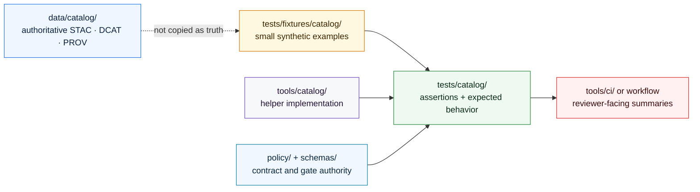

<!-- [KFM_META_BLOCK_V2]
doc_id: kfm://doc/NEEDS_VERIFICATION__tests_fixtures_catalog_readme
title: Catalog Fixtures
type: standard
version: v1
status: draft
owners: @bartytime4life
created: NEEDS_VERIFICATION__YYYY-MM-DD
updated: 2026-04-28
policy_label: NEEDS_VERIFICATION__public_or_internal
related: [../README.md, ../../README.md, ../../catalog/README.md, ../../../tools/catalog/README.md, ../../../data/catalog/README.md, ../../../data/receipts/README.md, ../../../data/proofs/README.md, ../../../policy/README.md, ../../../contracts/README.md, ../../../schemas/README.md, ../../../schemas/contracts/v1/README.md, ../../../.github/CODEOWNERS, ../../../.github/workflows/README.md]
tags: [kfm, tests, fixtures, catalog, catalog-closure, stac, dcat, prov]
notes: [Leaf inventory, created date, and policy label remain active-branch verification items. Owner is carried from the documented /tests/ scope and should be rechecked for this leaf before merge. This README is fixture-facing; authoritative catalog records remain outside tests.]
[/KFM_META_BLOCK_V2] -->

<a id="top"></a>

# Catalog Fixtures

Deterministic, public-safe fixture lane for catalog-closure examples used by KFM tests without turning tests into catalog truth.

> [!NOTE]
> **Status:** `experimental`  
> **Owners:** `@bartytime4life` *(documented at broader `/tests/` scope; leaf-level assignment remains `NEEDS VERIFICATION`)*  
> **Path:** `tests/fixtures/catalog/README.md`  
> **Repo fit:** fixture companion for catalog-helper proof, adjacent to [`../../catalog/`](../../catalog/README.md), [`../../../tools/catalog/`](../../../tools/catalog/README.md), and [`../../../data/catalog/`](../../../data/catalog/README.md)  
> **Quick jumps:** [Scope](#scope) · [Repo fit](#repo-fit) · [Accepted inputs](#accepted-inputs) · [Exclusions](#exclusions) · [Directory tree](#directory-tree) · [Quickstart](#quickstart) · [Usage](#usage) · [Diagram](#diagram) · [Reference tables](#reference-tables) · [Task list](#task-list) · [FAQ](#faq) · [Appendix](#appendix)


> [!IMPORTANT]
> `tests/fixtures/catalog/` stores **small declared examples**, not authoritative STAC, DCAT, PROV, release, receipt, or proof records.
>
> Catalog truth belongs in [`../../../data/catalog/`](../../../data/catalog/README.md). Reusable catalog-checking behavior belongs in [`../../../tools/catalog/`](../../../tools/catalog/README.md). Assertions and test execution belong in [`../../catalog/`](../../catalog/README.md) or another verified test lane.

---

## Scope

`tests/fixtures/catalog/` is the fixture home for compact examples that help KFM prove catalog-closure behavior.

It should make these cases easy to inspect:

- aligned STAC / DCAT / PROV references for one subject and one version
- catalog triplets with intentional subject drift
- catalog triplets with intentional version or release-reference drift
- malformed catalog inputs that must fail closed
- stable expected-output examples that test runners or reviewer helpers can compare without scraping logs

This directory is intentionally narrow. It supports catalog proof; it does not make catalog decisions.

### Truth markers used here

| Marker | Meaning in this README |
|---|---|
| **CONFIRMED** | Directly supported by surfaced repo-facing docs, attached doctrine, or visible current-session inspection |
| **INFERRED** | Conservative repo-fit interpretation from adjacent documented surfaces |
| **PROPOSED** | Recommended fixture shape or convention consistent with KFM doctrine |
| **UNKNOWN** | Not verified strongly enough from available evidence |
| **NEEDS VERIFICATION** | Concrete active-branch check required before merge |

[Back to top](#top)

---

## Repo fit

| Direction | Surface | Relationship |
|---|---|---|
| Parent | [`../README.md`](../README.md) | Fixture-family index; should explain why catalog fixtures live here rather than inside schema mirrors or production catalog paths. |
| Parent verification surface | [`../../README.md`](../../README.md) | Governs test-lane posture, ownership, negative-path proof, and README-first navigation. |
| Adjacent catalog proof lane | [`../../catalog/README.md`](../../catalog/README.md) | Test files should consume these fixtures when proving catalog cross-link or closure behavior. |
| Helper implementation | [`../../../tools/catalog/README.md`](../../../tools/catalog/README.md) | Reusable catalog QA and cross-link helper code belongs here, not in fixtures. |
| Authoritative catalog records | [`../../../data/catalog/README.md`](../../../data/catalog/README.md) | Release-bearing STAC / DCAT / PROV records belong here, not in test fixtures. |
| Process memory | [`../../../data/receipts/README.md`](../../../data/receipts/README.md) | Receipts may be represented by tiny examples, but archived process memory belongs in data surfaces. |
| Release proof | [`../../../data/proofs/README.md`](../../../data/proofs/README.md) | Proof packs may be represented by tiny examples, but proof archives belong in data surfaces. |
| Contract and schema context | [`../../../contracts/README.md`](../../../contracts/README.md), [`../../../schemas/README.md`](../../../schemas/README.md), [`../../../schemas/contracts/v1/README.md`](../../../schemas/contracts/v1/README.md) | Machine contract authority remains outside this fixture lane. |
| Policy context | [`../../../policy/README.md`](../../../policy/README.md) | Policy vocabulary, obligations, and reason-code law remain outside this fixture lane. |
| Workflow boundary | [`../../../.github/workflows/README.md`](../../../.github/workflows/README.md) | CI orchestration may consume fixture-backed tests, but workflow sequencing is not defined here. |

### Fit summary

| Question | Answer |
|---|---|
| What belongs here? | Small, deterministic, public-safe catalog-closure fixtures. |
| What does not belong here? | Authoritative catalog records, helper code, policy bundles, release manifests as primary records, or large source data. |
| Why keep this separate from `tests/catalog/fixtures/`? | `tests/catalog/fixtures/` may stay close to one test file; this lane is the shared fixture shelf when cases need reuse across catalog, CI, release, or schema-adjacent tests. |
| Why keep this separate from `data/catalog/`? | Test fixtures are disposable examples; catalog records are release-bearing metadata. |

[Back to top](#top)

---

## Accepted inputs

Only explicit, reviewable, clone-safe examples belong here.

| Input class | Examples | Why it belongs here |
|---|---|---|
| Aligned catalog examples | synthetic STAC / DCAT / PROV triplet fragments for one subject and version | Proves happy-path closure without requiring production metadata. |
| Misalignment examples | subject drift, version drift, release-ref drift, missing PROV ref | Makes negative-path catalog behavior first-class. |
| Malformed examples | invalid JSON, missing required blocks, unsupported enum values | Proves fail-closed behavior and error reporting. |
| Expected reports | tiny expected-output JSON for helper or validator comparison | Stabilizes CI and reviewer handoff without parsing stdout. |
| Minimal release-adjacent examples | synthetic `release_ref`, `spec_hash`, `catalog_matrix_ref`, or `evidence_refs` values | Lets tests exercise catalog boundaries without importing real release artifacts. |

### Input rules

1. Use tiny synthetic files unless a test explicitly requires a checked-in golden example.
2. Keep every fixture public-safe and credential-free.
3. Preserve the shape a helper or validator actually reads.
4. Prefer one failure reason per invalid fixture.
5. Make expected outcomes explicit: `pass`, `fail`, or `error`.
6. Keep fixtures deterministic and no-network.
7. Do not hide policy or schema meaning inside fixture names alone.

[Back to top](#top)

---

## Exclusions

| Does **not** belong here | Better home | Why |
|---|---|---|
| Authoritative STAC / DCAT / PROV records | [`../../../data/catalog/`](../../../data/catalog/README.md) | Catalog records are release-bearing metadata, not disposable tests. |
| Catalog helper implementation code | [`../../../tools/catalog/`](../../../tools/catalog/README.md) | Helpers should be reusable and testable outside fixture folders. |
| Catalog test files | [`../../catalog/`](../../catalog/README.md) | Tests own assertions; fixtures own examples. |
| Policy bundles, obligations, and reason-code law | [`../../../policy/`](../../../policy/README.md) | Fixtures may trigger policy consequences but must not define policy. |
| Canonical schemas, vocabularies, or OpenAPI contracts | [`../../../schemas/`](../../../schemas/README.md), [`../../../contracts/`](../../../contracts/README.md) | Machine-contract authority remains in schema and contract surfaces. |
| Production release manifests or proof packs as primary records | governed release/proof paths | Tests may include minimal examples only; release proof remains separate. |
| Raw, work, quarantine, processed, or published source artifacts | governed data lifecycle paths | Fixture examples must not bypass the KFM lifecycle. |
| Secrets, tokens, credentials, private URLs, or steward-only notes | never checked into fixtures | Test fixtures must be clone-safe. |
| Exact sensitive coordinates or restricted cultural/ecological locations | governed redaction/generalization surfaces | Fixture convenience must not create public exposure. |

[Back to top](#top)

---

## Directory tree

### Target shape

`NEEDS VERIFICATION`: update this tree after inspecting the active branch.

```text
tests/fixtures/catalog/
├── README.md
├── aligned/
│   ├── catalog-triplet.valid.json
│   └── release-record.valid.json
├── misaligned/
│   ├── prov-subject-drift.invalid.json
│   ├── release-ref-drift.invalid.json
│   └── version-drift.invalid.json
├── malformed/
│   └── missing-required-ref.invalid.json
└── expected/
    ├── catalog-triplet.valid.report.json
    └── prov-subject-drift.invalid.report.json
```

### Minimal first landing

Use this smaller shape when the branch is only ready for the catalog cross-link thin slice.

```text
tests/fixtures/catalog/
├── README.md
├── promotion-record-mismatch.json
└── prov-mismatch.json
```

> [!TIP]
> Keep the first landing small. Expand fixture taxonomy only after one executable catalog test and one helper command prove the naming and report shapes are useful.

[Back to top](#top)

---

## Quickstart

### 1) Inspect before asserting

```bash
find tests/fixtures -maxdepth 4 -type f 2>/dev/null | sort
find tests/catalog -maxdepth 4 -type f 2>/dev/null | sort
find tools/catalog -maxdepth 4 -type f 2>/dev/null | sort
```

### 2) Re-read the parent and adjacent contracts

```bash
sed -n '1,260p' tests/fixtures/README.md 2>/dev/null || true
sed -n '1,260p' tests/README.md 2>/dev/null || true
sed -n '1,260p' tests/catalog/README.md 2>/dev/null || true
sed -n '1,260p' tools/catalog/README.md 2>/dev/null || true
sed -n '1,260p' data/catalog/README.md 2>/dev/null || true
```

### 3) Search for current fixture consumers

```bash
rg -n "tests/fixtures/catalog|catalog-triplet|prov-mismatch|promotion-record-mismatch|CatalogMatrix|STAC|DCAT|PROV" \
  tests tools schemas contracts policy data .github 2>/dev/null
```

### 4) Run catalog tests after the branch confirms them

```bash
pytest -q tests/catalog
```

> [!WARNING]
> Do not add a new fixture shape and then retrofit the validator to it without a contract or README update. That is fixture-driven drift.

[Back to top](#top)

---

## Usage

### Add a valid fixture

A valid fixture should prove the smallest useful aligned case. Before adding it, identify the exact consumer:

- `tests/catalog/test_catalog_crosslink.py`
- a catalog helper under `tools/catalog/`
- a schema validator
- a CI renderer
- a release dry-run validator

Then document the expected result in a nearby report fixture or in the consuming test.

### Add an invalid fixture

Invalid fixtures should be precise. Use the filename to identify the broken invariant, but keep the actual reason visible inside the fixture or expected report.

Preferred naming pattern:

```text
<subject-or-case>.<condition>.<valid|invalid|error>.json
```

Examples:

```text
catalog-triplet.aligned.valid.json
catalog-triplet.prov-subject-drift.invalid.json
catalog-triplet.version-drift.invalid.json
catalog-triplet.malformed.error.json
```

### Keep examples synthetic

Illustrative fixture skeleton only; follow the mounted schema or helper contract when one is verified.

```json
{
  "case_id": "catalog.prov_subject_drift.invalid",
  "case_type": "catalog_triplet_closure",
  "input_refs": {
    "stac_ref": "kfm://catalog/stac/example-subject/v1",
    "dcat_ref": "kfm://catalog/dcat/example-subject/v1",
    "prov_ref": "kfm://catalog/prov/different-subject/v1"
  },
  "expected": {
    "outcome": "fail",
    "reason_codes": ["catalog.subject_mismatch"]
  }
}
```

[Back to top](#top)

---

## Diagram



[Back to top](#top)

---

## Reference tables

### Fixture proof matrix

| Case | Fixture posture | Expected result | Review value |
|---|---|---|---|
| Aligned catalog triplet | valid | `pass` | Confirms the happy path is not overcomplicated. |
| PROV subject drift | invalid | `fail` | Catches lineage misbinding. |
| Version drift | invalid | `fail` | Catches closure drift across outward records. |
| Release-ref drift | invalid | `fail` | Catches promotion-significant mismatch. |
| Missing ref | invalid | `fail` | Confirms incomplete closure cannot pass silently. |
| Malformed JSON | error | `error` | Confirms parser failure is not treated as success. |

### Boundary matrix

| Surface | Owns catalog truth? | Owns helper behavior? | Owns assertions? | Owns fixtures? |
|---|---:|---:|---:|---:|
| `data/catalog/` | ✅ | ❌ | ❌ | ❌ |
| `tools/catalog/` | ❌ | ✅ | ❌ | ❌ |
| `tests/catalog/` | ❌ | ❌ | ✅ | sometimes local |
| `tests/fixtures/catalog/` | ❌ | ❌ | ❌ | ✅ |
| `.github/workflows/` | ❌ | ❌ | orchestration only | ❌ |

### Fixture admission checklist

| Gate | Question | Required answer |
|---|---|---|
| Public safety | Does the fixture contain sensitive exact location, private data, credentials, or steward-only material? | No |
| Determinism | Can the fixture be validated without network access? | Yes |
| Contract fit | Does a schema, helper, or test explain the expected shape? | Yes |
| Failure clarity | If invalid, is the failed invariant obvious? | Yes |
| Boundary fit | Is this an example rather than a production record? | Yes |
| Update path | Does a related test or expected report change with it? | Yes |

[Back to top](#top)

---

## Task list

- [ ] Verify active-branch existence of `tests/fixtures/catalog/`.
- [ ] Confirm whether `tests/fixtures/README.md` links this leaf.
- [ ] Confirm whether `tests/catalog/` consumes shared catalog fixtures or keeps local fixtures only.
- [ ] Keep or adapt the first mismatch fixtures without duplicating production records.
- [ ] Add one aligned fixture and one misaligned fixture before expanding case taxonomy.
- [ ] Confirm runner behavior with a no-network command.
- [ ] Confirm policy and schema references do not move authority into fixtures.
- [ ] Update parent and adjacent README files after the fixture leaf is real.

### Definition of done

This fixture lane is ready for review when:

- the active branch contains this README and at least one consumed fixture
- every fixture is synthetic, public-safe, deterministic, and clone-safe
- valid, invalid, and malformed examples are clearly separated or named
- the consuming test or helper command is documented
- expected outcomes are explicit
- adjacent docs agree about which surface owns fixtures, tests, helpers, and catalog records
- no fixture is the only explanation of a KFM catalog invariant

> [!CAUTION]
> If deleting a fixture would erase the only understandable explanation of catalog closure, too much meaning has leaked into the fixture lane. Move that explanation to a contract, README, schema note, or validator document.

[Back to top](#top)

---

## FAQ

### Why not keep every catalog fixture inside `tests/catalog/fixtures/`?

Small, one-test examples can stay beside the test. Use `tests/fixtures/catalog/` when examples become shared across catalog tests, CI renderers, release dry-runs, schema checks, or documentation examples.

### Can these fixtures include real catalog records?

Only if the record is explicitly public-safe, intentionally checked in as a golden example, and not the primary authoritative copy. The safer default is synthetic examples.

### Can this directory define `CatalogMatrix` semantics?

No. It can demonstrate expected behavior over example payloads. `CatalogMatrix` semantics belong in contract, schema, validator, and catalog/proof documentation surfaces.

### What should happen when a fixture conflicts with a schema?

Treat the conflict as `NEEDS VERIFICATION`. Do not change the schema, helper, and fixture all at once unless the PR clearly explains the contract change and updates validation.

[Back to top](#top)

---

## Appendix

<details>
<summary>Long-form maintenance notes</summary>

### Maintenance rhythm

Review this README when any of the following changes:

- catalog cross-link helper inputs
- catalog matrix schema or vocabulary
- STAC / DCAT / PROV closure expectations
- release-manifest fields consumed by catalog checks
- expected JSON report shape
- parent `tests/fixtures/` placement rules
- adjacent `tests/catalog/` or `tools/catalog/` docs

### Preferred review questions

1. Does this fixture prove one clear behavior?
2. Is the fixture still public-safe?
3. Does the expected result fail closed?
4. Does the consuming test document the assertion?
5. Does the fixture duplicate authoritative catalog state?
6. Would a maintainer understand the invariant without reverse-engineering the fixture?

### Anti-patterns

| Anti-pattern | Why it is harmful |
|---|---|
| Copying production catalog records into fixtures without purpose | Blurs test examples and release truth. |
| Encoding policy meaning only in fixture names | Makes policy non-reviewable. |
| Treating malformed input as pass-by-default | Breaks fail-closed posture. |
| Using network calls to complete fixture validation | Makes fixture behavior non-deterministic. |
| Letting shared fixtures grow without taxonomy | Makes CI failures hard to interpret. |

</details>

[Back to top](#top)
