<div align="center">

# ⚙️ Kansas Frontier Matrix — **Config Fixtures**  
`tests/fixtures/configs/`

### *“Configuration as Contract — Deterministic, Documented, Deployable.”*

[](../../../.github/workflows/tests.yml)  
[](../../../docs/)  
[](../../../LICENSE)

</div>

---

```yaml
---
title: "KFM • Config Fixtures (tests/fixtures/configs/)"
version: "v1.2.0"
last_updated: "2025-10-17"
created: "2025-09-28"
owners: ["@kfm-web", "@kfm-engineering", "@kfm-ci"]
status: "Stable"
maturity: "Production"
tags: ["config","layers","app-settings","fixtures","frontend","mcp","stac","schema"]
license: "MIT"
semantic_alignment:
  - JSON Schema Draft-07
  - STAC 1.0.0 (downstream sync for layer sources)
  - OWL-Time (temporal layer metadata)
  - MCP-DL v6.3 (Configuration Provenance & Reproducibility)
---
```

---

## 🧭 Overview

The **Config Fixtures** directory contains **minimal, deterministic JSON configuration files** that validate:

- Frontend **runtime settings** and **layer definitions**
- Build-time configuration sync in `tools/build_config.py`
- **Schema** and **STAC-derived** field alignment
- Deterministic rebuilds of `web/config/*.json` across environments

> **Purpose:** Ensure each KFM deployment can **reconstruct** its UI configuration from STAC/catalog metadata with complete **provenance** and **schema integrity**.

---

## ⚙️ Architecture

```mermaid
flowchart TD
  A["STAC Catalog / Source Manifests"] --> B["tools/build_config.py<br/>Schema + Field Mapping"]
  B --> C["Config Fixtures<br/>layers.json · app.config.json (tests)"]
  C --> D["React Frontend<br/>Map/Layer Controls & AppShell"]
  D --> E["CI Validation<br/>jsonschema · pytest · vite build"]
  classDef n fill:#eaf3ff,stroke:#005cc5,color:#111;
  class A,B,C,D,E n;
```


<!-- END OF MERMAID -->

---

## 🗂 Directory Layout

```text
tests/fixtures/configs/
├── layers_min.json          # Minimal layers.json (raster + vector)
├── app_config_min.json      # Minimal app.config.json (app/runtime)
└── README.md                # This documentation file
```

---

## 🧩 Fixture Overview

| File | Purpose | Consumed By | Schema |
| :-- | :-- | :-- | :-- |
| `layers_min.json` | Defines test layers (ids, URLs, visibility, temporal ranges) | `tools/build_config.py`, `web/src/components/LayerControls` | STAC-derived Layers Schema |
| `app_config_min.json` | App name, API base, defaults, feature flags | `web/config/app.config.json`, AppShell, Context providers | App Configuration Schema |

---

## 🧩 Example — `layers_min.json`

```json
[
  {
    "id": "historic_topo_1894",
    "title": "USGS Topographic Map (1894)",
    "type": "raster",
    "url": "https://example.org/maps/topo_1894.tif",
    "opacity": 0.8,
    "visible": true,
    "timeRange": { "start": "1894-01-01", "end": "1894-12-31" },
    "legend": "maps/legend_topo_1894.png",
    "license": "Public Domain",
    "attribution": "USGS",
    "checksum:sha256": "2b0f0a8e1c7b...f19",
    "version": "v1.0.0"
  },
  {
    "id": "kansas_treaties",
    "title": "Kansas Treaty Boundaries",
    "type": "vector",
    "url": "https://example.org/layers/treaties.geojson",
    "opacity": 1,
    "visible": false,
    "legend": "maps/legend_treaty.png",
    "license": "CC-BY 4.0",
    "attribution": "KFM Synthetic",
    "style": { "stroke": "#0044cc", "strokeWidth": 1.5, "fill": "rgba(0,68,204,0.08)" },
    "version": "v1.1.0"
  }
]
```

> Two minimal layers, **schema-valid**, with optional checksum, attribution, and style tokens.

---

## 🧩 Example — `app_config_min.json`

```json
{
  "appName": "Kansas Frontier Matrix (Test)",
  "version": "1.2.0-test",
  "apiBaseUrl": "https://api.frontiermatrix.test",
  "defaultMapCenter": [-98.3, 38.5],
  "defaultZoom": 6,
  "enableAI": true,
  "enableAccessibilityFeatures": true,
  "supportedLanguages": ["en"],
  "contactEmail": "test@frontiermatrix.org",
  "tiles": {
    "styleUrl": "/tiles/style.json",
    "fallback": "https://basemaps.cartocdn.com/gl/positron-gl-style/style.json"
  },
  "legal": {
    "codeLicense": "MIT",
    "docsLicense": "CC-BY-4.0"
  }
}
```

> Minimal global config with **feature flags**, **tiles**, and **legal** metadata for reproducibility.

---

## 🧪 Usage in Tests

### 🐍 Pytest — Layers Schema

```python
import json
from tools.build_config import validate_layers

def test_layer_config_schema(fixtures_dir):
    layers = json.loads((fixtures_dir / "configs/layers_min.json").read_text())
    assert all("id" in l and "url" in l for l in layers)
    for layer in layers:
        assert layer["type"] in ("raster", "vector")
```

### 💻 Frontend Validation (CI)

```bash
pnpm run validate:config
# uses app_config_min.json & layers_min.json fixtures during a vite build check
```

---

## 🧮 Schema Validation Workflow

| Step | Tool | Description |
| :--: | :-- | :-- |
| 1️⃣ | `jsonschema` | Validate keys and types for `layers.json` & `app.config.json` |
| 2️⃣ | `pystac` | Cross-check STAC IDs/URLs (when provided) |
| 3️⃣ | `pytest` | Assert deterministic field presence and defaults |
| 4️⃣ | `vite` | Simulate web build with injected fixtures (CI) |

---

## ♿ Accessibility & Design Integration

- Human-readable keys with design-token-friendly fields (`style`, `legend`)  
- `enableAccessibilityFeatures: true` to enforce reduced-motion/high-contrast compliance  
- Layer titles and legends curated for **screen-reader clarity**  

---

## 🧾 Provenance & Integrity

| Artifact | Description |
| :-- | :-- |
| **Inputs** | STAC-derived metadata, deterministic endpoints |
| **Outputs** | Schema-validated config JSONs |
| **Dependencies** | Python (`pytest`, `jsonschema`), Node.js (`vite`) |
| **Integrity** | SHA-256 checksums optional per layer; CI re-validates |
| **Traceability** | Config versions mapped to STAC catalog commit SHA |

---

## 🧮 Versioning & Metadata

| Field | Value |
|:------|:------|
| **Version** | `v1.2.0` |
| **Codename** | *Deterministic UI Contracts* |
| **Last Updated** | 2025-10-17 |
| **Maintainers** | @kfm-web · @kfm-engineering |
| **License** | MIT (code) · CC-BY 4.0 (docs) |
| **Semantic Alignment** | JSON Schema · STAC 1.0.0 · OWL-Time · MCP-DL v6.3 |
| **Maturity** | Production |
| **Integrity** | CI verifies schema + deterministic fields |

---

## 🧾 CHANGELOG

| Version | Date | Author | Summary |
|:--------|:-----|:-------|:--------|
| **v1.2.0** | 2025-10-17 | @kfm-web | Added style tokens, attribution, and checksum fields for layers |
| **v1.1.0** | 2025-10-10 | @kfm-engineering | Introduced tiles fallback & legal metadata to app config |
| **v1.0.0** | 2025-09-28 | @kfm-ci | Initial minimal fixtures for layers/app config tests |

---

## 🧠 MCP-DL v6.3 Compliance

| Principle | Implementation |
|:-----------|:----------------|
| **Documentation-First** | Versioned fixtures documented with schema examples |
| **Reproducibility** | Deterministic values and stable URLs |
| **Provenance** | Optional layer-level checksums + attribution |
| **Accessibility** | Feature flags enforce a11y settings in UI |
| **Open Standards** | JSON Schema, STAC-compatible fields |
| **Auditability** | CI logs and artifacts validate on every PR |

---

<div align="center">

**© Kansas Frontier Matrix — Config Fixtures**  
Maintained under the **Master Coder Protocol (MCP)**

[]()  
[]()

</div>