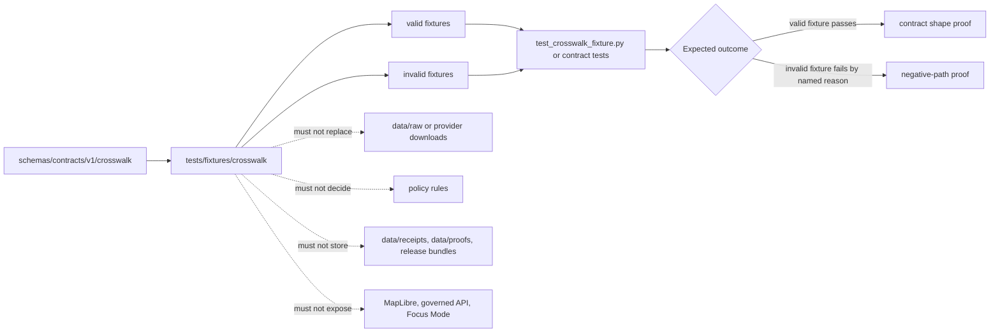

<!-- [KFM_META_BLOCK_V2]
doc_id: kfm://doc/NEEDS-VERIFICATION
title: tests/fixtures/crosswalk
type: standard
version: v1
status: draft
owners: @bartytime4life
created: NEEDS-VERIFICATION
updated: 2026-04-27
policy_label: public
related: [
  ../../README.md,
  ../README.md,
  ../../contracts/README.md,
  ../../../contracts/README.md,
  ../../../schemas/README.md,
  ../../../schemas/contracts/v1/README.md,
  ../../../schemas/contracts/v1/crosswalk/README.md,
  ../../../schemas/contracts/v1/crosswalk/crosswalk_pair.schema.json,
  ../../../schemas/contracts/v1/crosswalk/crosswalk_catalog_manifest.schema.json,
  ../../../policy/README.md,
  ../../../tools/validators/README.md,
  ../../../data/receipts/README.md,
  ../../../data/proofs/README.md,
  ../../../.github/workflows/README.md,
  ../../../.github/CODEOWNERS
]
tags: [kfm, tests, fixtures, crosswalk, hydrology, huc12, administrative-boundaries, schema-validation, fail-closed]
notes: [
  "doc_id and created date require active-checkout verification.",
  "Owner is inherited from broader /tests/ documentation and should be rechecked against CODEOWNERS before merge.",
  "This README documents fixture intent and does not claim merge-blocking CI, runtime enforcement, or publication readiness.",
  "Current public-main evidence showed this README was empty while valid/ and invalid/ fixture examples already existed."
]
[/KFM_META_BLOCK_V2] -->

<a id="top"></a>

# `tests/fixtures/crosswalk/`

Tiny valid/invalid crosswalk examples for proving KFM identity-join behavior without turning fixtures into source data, policy truth, or release evidence.

> [!IMPORTANT]
> **Status:** experimental  
> **Owners:** `@bartytime4life` *(broader `/tests/` ownership is documented; confirm leaf ownership in `.github/CODEOWNERS` before merge)*  
> **Path:** `tests/fixtures/crosswalk/README.md`  
> **Repo fit:** child fixture lane under [`../README.md`](../README.md), consumed by contract/schema tests and aligned with [`../../../schemas/contracts/v1/crosswalk/README.md`](../../../schemas/contracts/v1/crosswalk/README.md)  
> **Quick jumps:** [Scope](#scope) · [Repo fit](#repo-fit) · [Accepted inputs](#accepted-inputs) · [Exclusions](#exclusions) · [Current snapshot](#current-snapshot) · [Directory tree](#directory-tree) · [Quickstart](#quickstart) · [Usage](#usage) · [Diagram](#diagram) · [Operating tables](#operating-tables) · [Task list](#task-list--definition-of-done) · [FAQ](#faq) · [Appendix](#appendix)


---

## Scope

`tests/fixtures/crosswalk/` holds small, deterministic examples for crosswalk records and crosswalk failure cases.

In KFM, a crosswalk is a governed bridge between identifiers, source snapshots, geometries, datasets, or release families. This fixture lane exists to prove that bridge behavior stays reviewable: valid examples should pass the relevant crosswalk schema, and invalid examples should fail for clear, named reasons.

This directory is especially useful for the current HUC12-to-administrative-area fixture family, where a `crosswalk_pair` records overlap, weighting, assignment method, CRS, source snapshots, hashes, and run-receipt identity.

### This lane should help reviewers answer

- Does the positive fixture match the expected crosswalk contract?
- Does the negative fixture fail for the reason in its filename?
- Are source snapshots, `spec_hash`, `geometry_hash`, and `run_receipt_id` visible?
- Is the fixture public-safe and review-sized?
- Is this fixture supporting a contract test rather than becoming a substitute source dataset?

[Back to top](#top)

---

## Repo fit

`tests/fixtures/crosswalk/` is a fixture leaf inside the broader governed verification surface.

| Relationship | Path | Role |
|---|---|---|
| Parent fixture lane | [`../README.md`](../README.md) | Explains what fixtures are and what they must not become. |
| Parent test lane | [`../../README.md`](../../README.md) | Frames KFM tests as governed verification. |
| Contract test neighbor | [`../../contracts/README.md`](../../contracts/README.md) | Expected consumer for schema-valid and schema-invalid examples. |
| Shared crosswalk schema lane | [`../../../schemas/contracts/v1/crosswalk/README.md`](../../../schemas/contracts/v1/crosswalk/README.md) | Defines the machine-contract family this fixture lane exercises. |
| Active pair schema | [`../../../schemas/contracts/v1/crosswalk/crosswalk_pair.schema.json`](../../../schemas/contracts/v1/crosswalk/crosswalk_pair.schema.json) | Shape expected by `valid/crosswalk_pair.valid.json`. |
| Catalog manifest schema | [`../../../schemas/contracts/v1/crosswalk/crosswalk_catalog_manifest.schema.json`](../../../schemas/contracts/v1/crosswalk/crosswalk_catalog_manifest.schema.json) | Adjacent crosswalk release/catalog shape; do not store emitted manifests here as primary records. |
| Policy surface | [`../../../policy/README.md`](../../../policy/README.md) | Owns allow/deny/abstain behavior, not this fixture directory. |
| Validator surface | [`../../../tools/validators/README.md`](../../../tools/validators/README.md) | Owns executable validation helpers when they exist. |
| Receipts and proofs | [`../../../data/receipts/README.md`](../../../data/receipts/README.md), [`../../../data/proofs/README.md`](../../../data/proofs/README.md) | Emitted process memory and proof artifacts stay separate from fixture examples. |
| Workflow boundary | [`../../../.github/workflows/README.md`](../../../.github/workflows/README.md) | Orchestration may call tests; it does not own fixture meaning. |

> [!NOTE]
> This README can safely document the fixture lane. It must not settle schema-home authority, claim CI enforcement, or upgrade example JSON into release evidence.

[Back to top](#top)

---

## Accepted inputs

Keep this lane small, deterministic, and reviewable.

| Accepted input | Examples | Why it belongs here |
|---|---|---|
| Valid crosswalk pair fixtures | `valid/crosswalk_pair.valid.json` | Proves a minimal passing `crosswalk_pair` shape. |
| Invalid crosswalk pair fixtures | `invalid/crosswalk_pair.bad_crs.json` | Proves fail-closed validation for a named failure reason. |
| Tiny expected-output fragments | `expected/*.json` *(only if added)* | Useful when a validator emits stable reason codes or normalized summaries. |
| README notes for fixture leaves | `valid/README.md`, `invalid/README.md` | Helps reviewers understand fixture intent without opening every JSON file. |
| Synthetic source-snapshot IDs | `fixture:wbd:huc12`, `fixture:tiger:county` | Keeps examples source-linked without storing real source pulls. |

### Input rules

1. Add the smallest honest valid/invalid pair first.
2. Name invalid fixtures by failure reason: `bad_crs`, `missing_spec_hash`, `bad_huc12_id`, or similar.
3. Keep all examples deterministic: no network, no current-time dependency, no platform-secret dependency.
4. Keep fixtures public-safe: synthetic IDs, small numbers, no sensitive exact locations, no unpublished source extracts.
5. Preserve KFM field names from the schema; do not invent local aliases for convenience.
6. Fixture JSON may reference receipts or source snapshots by ID, but receipt/proof instances remain outside this lane.

[Back to top](#top)

---

## Exclusions

| Does not belong here | Put it here instead | Why |
|---|---|---|
| Raw WBD, TIGER, Census, NHDPlus, or provider downloads | Governed `data/raw/` or source-specific fixture lanes | This directory is not a source mirror. |
| Processed crosswalk tables, GeoParquet, PMTiles, catalogs, or release bundles | Governed lifecycle and release surfaces | Fixtures are examples, not emitted artifacts. |
| Canonical schema definitions | [`../../../schemas/contracts/v1/crosswalk/`](../../../schemas/contracts/v1/crosswalk/) | Schemas own shape; fixtures only exercise shape. |
| Policy rules or reviewer obligations | [`../../../policy/`](../../../policy/) | Policy decides admissibility and denial behavior. |
| Validator implementation | [`../../../tools/validators/`](../../../tools/validators/) or test modules | Logic must be executable, reusable, and testable. |
| MapLibre layers, governed API route code, or Focus Mode code | App/UI/runtime lanes | Public surfaces consume governed outputs; they do not live in fixtures. |
| Receipts, proofs, manifests, and promotion decisions as primary records | `data/receipts/`, `data/proofs/`, `release/` | KFM keeps process memory and release evidence separate. |

[Back to top](#top)

---

## Current snapshot

The current public fixture lane is intentionally tiny.

| Path | Status | Role |
|---|---|---|
| `README.md` | `CONFIRMED` path; this revision fills an empty README | Directory guide and placement law. |
| `test_crosswalk_fixture.py` | `CONFIRMED` path; executable content `NEEDS VERIFICATION` | Expected local test harness or placeholder for schema checks. |
| `valid/README.md` | `CONFIRMED` path; content `NEEDS VERIFICATION` | Optional leaf note for positive fixtures. |
| `valid/crosswalk_pair.valid.json` | `CONFIRMED` fixture | Positive HUC12/admin crosswalk pair using `EPSG:5070`. |
| `invalid/README.md` | `CONFIRMED` path; content `NEEDS VERIFICATION` | Optional leaf note for negative fixtures. |
| `invalid/crosswalk_pair.bad_crs.json` | `CONFIRMED` fixture | Negative pair using `EPSG:4326` where the schema requires `EPSG:5070`. |

> [!WARNING]
> Do not infer merge-blocking coverage from file presence. A fixture is useful only after a consuming test or validator proves the intended pass/fail behavior.

[Back to top](#top)

---

## Directory tree

```text
tests/fixtures/crosswalk/
├── README.md
├── test_crosswalk_fixture.py
├── valid/
│   ├── README.md
│   └── crosswalk_pair.valid.json
└── invalid/
    ├── README.md
    └── crosswalk_pair.bad_crs.json
```

### Naming convention

```text
valid/<object>.<case>.json
invalid/<object>.<failure_reason>.json
expected/<object>.<case>.expected.json   # optional, only when output shape matters
```

[Back to top](#top)

---

## Quickstart

Run these from the repository root after checking out the active branch.

```bash
# Inspect the exact fixture surface.
find tests/fixtures/crosswalk -maxdepth 3 -type f | sort

# Confirm fixture JSON is parseable before schema validation.
python -m json.tool tests/fixtures/crosswalk/valid/crosswalk_pair.valid.json >/dev/null
python -m json.tool tests/fixtures/crosswalk/invalid/crosswalk_pair.bad_crs.json >/dev/null
```

Run the fixture test if the active branch has wired it.

```bash
# NEEDS VERIFICATION: use the repo-native test command if this differs.
python -m pytest tests/fixtures/crosswalk -q
```

Inspect the schema side before adding new fields.

```bash
sed -n '1,220p' schemas/contracts/v1/crosswalk/README.md
python -m json.tool schemas/contracts/v1/crosswalk/crosswalk_pair.schema.json >/dev/null
python -m json.tool schemas/contracts/v1/crosswalk/crosswalk_catalog_manifest.schema.json >/dev/null
```

[Back to top](#top)

---

## Usage

### Add or update a fixture

1. Decide which schema or validator consumes the fixture.
2. Add one `valid/` example or one `invalid/` example named by failure reason.
3. Keep the fixture minimal enough to review in one screen.
4. Add or update the consuming test so the fixture is not decorative.
5. Record any unresolved source, policy, or schema-home question in the nearest README or verification backlog.

### Keep `crosswalk_pair` fields visible

The current `crosswalk_pair` schema expects the fixture to preserve these responsibilities:

| Responsibility | Example fields |
|---|---|
| Object identity | `object_type` |
| HUC/admin endpoints | `huc12_id`, `admin_id`, `admin_type` |
| Area and overlap support | `huc_area_m2`, `admin_area_m2`, `overlap_m2`, `overlap_pct_huc`, `overlap_pct_admin`, `weight` |
| Assignment rationale | `assignment_method`, `centroid_within_flag`, `shared_boundary_m` |
| Source trace | `source_snapshot_ids`, `algorithm_version`, `run_receipt_id` |
| Spatial discipline | `crs` |
| Deterministic identity | `geometry_hash`, `spec_hash` |

### Failure cases should stay crisp

`invalid/crosswalk_pair.bad_crs.json` should fail because the CRS is wrong, not because multiple unrelated fields drifted. When adding more invalid cases, isolate one failure class per file whenever possible.

[Back to top](#top)

---

## Diagram



[Back to top](#top)

---

## Operating tables

### Fixture-to-contract matrix

| Fixture | Intended contract | Expected result |
|---|---|---|
| `valid/crosswalk_pair.valid.json` | `schemas/contracts/v1/crosswalk/crosswalk_pair.schema.json` | Passes schema shape; uses `EPSG:5070`; preserves hashes, source snapshots, and run receipt ID. |
| `invalid/crosswalk_pair.bad_crs.json` | `schemas/contracts/v1/crosswalk/crosswalk_pair.schema.json` | Fails schema shape because `crs` is not the required value. |

### Consumer matrix

| Consumer | Uses this lane for | Must not do |
|---|---|---|
| Contract tests | Validate positive and negative object shape. | Treat schema-valid as release-approved. |
| Validators | Exercise clear pass/fail cases. | Hide validation logic inside fixture files. |
| Policy tests | Reference fixtures when a crosswalk result should abstain, deny, or require review. | Store policy truth in fixture JSON. |
| EvidenceBundle builders | Use fixture IDs to test closure behavior. | Treat a fixture as an EvidenceBundle or proof pack. |
| Governed APIs / UI tests | Assert finite visible outcomes from crosswalk support. | Let browser or model code infer raw source authority. |

### Truth posture map

| Claim | Label | Current reading |
|---|---|---|
| The crosswalk fixture directory exists on public `main`. | `CONFIRMED` | Directory contains `valid/`, `invalid/`, `README.md`, and `test_crosswalk_fixture.py`. |
| `valid/crosswalk_pair.valid.json` exists. | `CONFIRMED` | Positive fixture includes HUC12/admin overlap fields and `EPSG:5070`. |
| `invalid/crosswalk_pair.bad_crs.json` exists. | `CONFIRMED` | Negative fixture uses `EPSG:4326` against an `EPSG:5070` schema requirement. |
| The fixture test is currently enforcing pass/fail behavior. | `NEEDS VERIFICATION` | File path is visible; executable depth must be verified in the active checkout. |
| These fixtures are publishable crosswalk outputs. | `FALSE` | They are small test fixtures only. |

[Back to top](#top)

---

## Task list & definition of done

Use this checklist before merging changes to this lane.

- [ ] `README.md` has one H1, KFM Meta Block V2, impact block, badges, quick jumps, inputs, exclusions, and repo fit.
- [ ] Every valid fixture has a matching schema or validator consumer.
- [ ] Every invalid fixture is named by failure reason and fails for that reason.
- [ ] No fixture stores raw provider downloads, large generated tables, real sensitive coordinates, or unpublished source material.
- [ ] `spec_hash`, `geometry_hash`, `source_snapshot_ids`, and `run_receipt_id` are present where the schema requires them.
- [ ] CRS failures remain isolated: the bad CRS fixture should not also test unrelated shape drift.
- [ ] Fixture tests run locally or the test gap is marked `NEEDS VERIFICATION`.
- [ ] Related schema, contract, validator, and policy links remain accurate from this directory.
- [ ] No README text claims release readiness, public publication, branch protection, or CI enforcement without current evidence.

[Back to top](#top)

---

## FAQ

### Why are crosswalk fixtures under `tests/fixtures/` instead of `data/`?

Because these are review-sized examples used to prove behavior. Real source pulls, normalized outputs, receipts, proofs, catalogs, and published artifacts belong in governed lifecycle surfaces.

### Why does the invalid fixture use a CRS failure?

The current crosswalk pair schema requires `EPSG:5070`. A bad CRS case is a compact negative path: it shows that spatial support and projection discipline are part of the contract, not a visual preference.

### Can this lane contain NHDPlus HR Permanent Identifier / COMID examples?

Yes, when they are tiny, synthetic or public-safe, and tied to a specific shared or domain-specific crosswalk schema. Do not add real downloaded crosswalk tables here.

### Can these fixtures prove a crosswalk is safe for public use?

No. Fixtures can prove shape and expected failure behavior. Public use still requires source descriptors, evidence closure, policy review, release state, and correction/rollback paths.

[Back to top](#top)

---

## Appendix

<details>
<summary><strong>Minimum current field map for <code>crosswalk_pair</code></strong></summary>

| Field | Why it matters |
|---|---|
| `object_type` | Keeps fixture family explicit. |
| `huc12_id` | Identifies the hydrologic unit side of the pair. |
| `admin_id`, `admin_type` | Identifies the administrative side of the pair. |
| `huc_area_m2`, `admin_area_m2`, `overlap_m2` | Makes area support inspectable. |
| `overlap_pct_huc`, `overlap_pct_admin`, `weight` | Makes assignment and weighting inspectable. |
| `assignment_method` | Explains why the pair was selected or weighted. |
| `centroid_within_flag`, `shared_boundary_m` | Supports tie-break or relationship interpretation where present. |
| `source_snapshot_ids` | Keeps the fixture linked to source snapshots without storing source data. |
| `algorithm_version` | Makes computation version visible. |
| `crs` | Keeps projection requirements explicit. |
| `geometry_hash`, `spec_hash` | Supports deterministic identity and drift detection. |
| `run_receipt_id` | Links the fixture to the process-memory concept without storing the receipt here. |

</details>

<details>
<summary><strong>Review prompt for future fixture additions</strong></summary>

Before adding a new crosswalk fixture, answer:

1. What schema, validator, or test consumes it?
2. Is this the smallest example that proves the behavior?
3. Is it valid, invalid, expected output, or a redacted/synthetic source slice?
4. What single behavior or failure reason does it prove?
5. Does it preserve source and hash fields without storing real provider data?
6. Could this example be mistaken for a published crosswalk artifact?
7. Which adjacent README or test should be updated with it?

</details>

[Back to top](#top)
