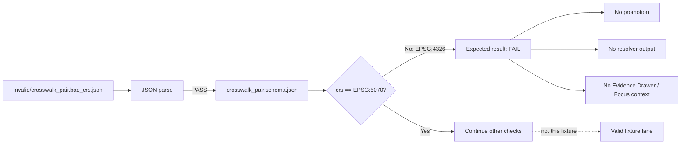

<!-- [KFM_META_BLOCK_V2]
doc_id: kfm://doc/TODO-UUID-tests-fixtures-crosswalk-invalid-readme-NEEDS-VERIFICATION
title: Crosswalk Invalid Fixtures
type: standard
version: v1
status: draft
owners: @bartytime4life (NEEDS VERIFICATION against active CODEOWNERS)
created: TODO-YYYY-MM-DD-NEEDS-VERIFICATION
updated: 2026-04-27
policy_label: TODO-public-or-restricted-NEEDS-VERIFICATION
related: [../README.md, ../valid/README.md, ../../README.md, ../../../README.md, ../../../../schemas/contracts/v1/crosswalk/README.md, ../../../../schemas/contracts/v1/crosswalk/crosswalk_pair.schema.json]
tags: [kfm, tests, fixtures, crosswalk, invalid, fail-closed]
notes: [README-like directory doc; target path currently has an empty README candidate; owner, policy label, active CI, and branch enforcement need verification]
[/KFM_META_BLOCK_V2] -->

# Crosswalk Invalid Fixtures

Intentionally failing crosswalk examples that prove KFM rejects unsafe identity joins instead of laundering them into authoritative output.


> [!NOTE]
> **Status:** `experimental`  
> **Owners:** `@bartytime4life` *(NEEDS VERIFICATION against active-branch CODEOWNERS)*  
> **Path:** `tests/fixtures/crosswalk/invalid/README.md`  
> **Repo fit:** negative fixture lane for crosswalk schema and validator proof  
> **Quick jumps:** [Scope](#scope) · [Repo fit](#repo-fit) · [Accepted inputs](#accepted-inputs) · [Exclusions](#exclusions) · [Current fixture set](#current-fixture-set) · [Directory tree](#directory-tree) · [Quickstart](#quickstart) · [Diagram](#diagram) · [Operating tables](#operating-tables) · [Task list](#task-list--definition-of-done) · [FAQ](#faq) · [Appendix](#appendix)

> [!IMPORTANT]
> Invalid fixtures are not bad data to “fix.” They are governed negative examples. A healthy validator should reject them for the expected reason, preserve the reason for review, and prevent the row from becoming resolver output, map output, Evidence Drawer support, Focus Mode context, release material, or public truth.

---

## Scope

`tests/fixtures/crosswalk/invalid/` stores small, deterministic, public-safe examples that are expected to fail crosswalk validation.

In KFM terms, this directory exists to prove that identity bridges are not treated as casual lookup tables. Crosswalks can affect map features, graph edges, governed API answers, Evidence Drawer payloads, Focus Mode summaries, and release lineage. A rejected crosswalk row should therefore fail visibly and for a named reason.

This README covers invalid fixture behavior only. It does not define the crosswalk schema, source authority, policy rules, validator implementation, release process, or runtime resolver behavior.

[Back to top](#crosswalk-invalid-fixtures)

---

## Repo fit

| Relationship | Relative path | Status | Role |
|---|---|---:|---|
| Parent fixture lane | [`../../README.md`](../../README.md) | `CONFIRMED path / verify active branch` | Defines fixture-home law for small, public-safe valid and invalid examples. |
| Parent crosswalk fixture lane | [`../README.md`](../README.md) | `README exists / content needs verification` | Should explain the valid/invalid crosswalk fixture pair as a family. |
| Positive sibling | [`../valid/README.md`](../valid/README.md) | `README exists / content needs verification` | Companion positive fixture lane. |
| Current invalid payload | [`./crosswalk_pair.bad_crs.json`](./crosswalk_pair.bad_crs.json) | `CONFIRMED path` | Negative example for CRS validation. |
| Broader tests lane | [`../../../README.md`](../../../README.md) | `CONFIRMED path / verify active branch` | Governed verification surface; tests prove boundaries, not production truth. |
| Machine schema lane | [`../../../../schemas/contracts/v1/crosswalk/README.md`](../../../../schemas/contracts/v1/crosswalk/README.md) | `CONFIRMED path / verify active branch` | Crosswalk schema and contract guidance. |
| Pair schema | [`../../../../schemas/contracts/v1/crosswalk/crosswalk_pair.schema.json`](../../../../schemas/contracts/v1/crosswalk/crosswalk_pair.schema.json) | `CONFIRMED path / verify active branch` | Machine shape that this invalid fixture is expected to violate. |
| Validator home | `../../../../tools/validators/**` | `NEEDS VERIFICATION` | Executable validation should live in tooling, not in fixture prose. |
| Policy home | `../../../../policy/**` | `NEEDS VERIFICATION` | Rights, sensitivity, ambiguity, and publication decisions belong in policy. |

### Boundary contract

| This directory may contain | It must not become |
|---|---|
| Tiny invalid JSON fixtures with clear failure reasons. | A quarantine store for real source rows. |
| Negative examples for schema, validator, and policy tests. | A schema-authority surface. |
| Public-safe fixture notes and expected outcomes. | A policy engine or publication gate. |
| A local README that documents why each invalid fixture exists. | Runtime resolver logic or UI behavior. |

[Back to top](#crosswalk-invalid-fixtures)

---

## Accepted inputs

Material belongs here when it is intentionally invalid, compact, deterministic, public-safe, and tied to a named crosswalk failure mode.

| Accepted input | Example | Required posture |
|---|---|---|
| Schema-invalid crosswalk pair | `crosswalk_pair.bad_crs.json` | JSON parses, but schema validation should fail for the documented reason. |
| Relationship-invalid fixture | `crosswalk_pair.ambiguous_relationship.invalid.json` | Use when a future schema or validator rejects unsafe relationship classification. |
| Missing-proof fixture | `crosswalk_pair.missing_receipt.invalid.json` | Use when a row lacks required receipt, source snapshot, or evidence support. |
| Policy-invalid fixture | `crosswalk_pair.rights_unknown.invalid.json` | Use when shape may pass but policy should deny or abstain. |
| Edge-case negative fixture | `crosswalk_pair.bad_weight.invalid.json` | Use when numeric bounds, CRS, identifier format, or source references must fail closed. |

### Naming rule

Name invalid fixtures by **failure reason**, not by sequence number.

```text
good:  crosswalk_pair.bad_crs.json
good:  crosswalk_pair.missing_spec_hash.invalid.json
avoid: crosswalk_pair.invalid_01.json
```

[Back to top](#crosswalk-invalid-fixtures)

---

## Exclusions

| Does **not** belong here | Put it instead in | Why |
|---|---|---|
| Valid crosswalk examples | [`../valid/`](../valid/) | Keeps positive and negative expectations inspectable. |
| Canonical crosswalk schemas | [`../../../../schemas/contracts/v1/crosswalk/`](../../../../schemas/contracts/v1/crosswalk/) | Fixtures exemplify behavior; schemas define machine shape. |
| Human semantic contract doctrine | `../../../../contracts/**` *(NEEDS VERIFICATION)* | Human meaning belongs in contract docs, not invalid fixtures. |
| Validator implementation | `../../../../tools/validators/**` *(NEEDS VERIFICATION)* | Fixture directories should not hide executable logic. |
| Policy source files | `../../../../policy/**` *(NEEDS VERIFICATION)* | Policy decides allow, deny, abstain, obligations, and release admissibility. |
| RAW, WORK, QUARANTINE, or provider downloads | `../../../../data/**` lifecycle lanes *(NEEDS VERIFICATION)* | Invalid fixtures are not source stores or quarantine stores. |
| Receipts, proofs, manifests, and release objects as primary records | `../../../../data/receipts/`, `../../../../data/proofs/`, `../../../../release/` *(NEEDS VERIFICATION)* | Tests may reference tiny examples, but do not own emitted evidence. |
| Secrets, credentials, tokens, private service URLs | Secret manager / local environment | Fixtures must be safe to review in a public or semi-public repo. |
| Sensitive exact geometry | Restricted steward-controlled lanes | Invalid fixtures should not leak the very risk they are designed to block. |

[Back to top](#crosswalk-invalid-fixtures)

---

## Current fixture set

| Fixture | Expected status | Failure class | Why it matters |
|---|---:|---|---|
| [`crosswalk_pair.bad_crs.json`](./crosswalk_pair.bad_crs.json) | `FAIL` | `bad_crs` | The fixture uses `crs: "EPSG:4326"` while the crosswalk pair schema requires `EPSG:5070`. This proves the validator does not accept crosswalk rows in the wrong coordinate reference frame. |

> [!TIP]
> This fixture should parse as JSON. Its failure should come from schema or semantic validation, not from malformed syntax. That distinction keeps `ERROR` and `FAIL` from being collapsed.

### Expected failure contract

| Check | Expected result |
|---|---:|
| JSON syntax parse | `PASS` |
| `object_type == "crosswalk_pair"` | `PASS` |
| Required fields present | `PASS` |
| CRS is the required schema CRS | `FAIL` |
| Public promotion eligibility | `BLOCKED` |
| Resolver / UI / Focus use | `NOT ALLOWED` |

[Back to top](#crosswalk-invalid-fixtures)

---

## Directory tree

Current small fixture shape:

```text
tests/fixtures/crosswalk/invalid/
├── README.md
└── crosswalk_pair.bad_crs.json
```

Expected sibling context:

```text
tests/fixtures/crosswalk/
├── README.md
├── test_crosswalk_fixture.py
├── invalid/
│   ├── README.md
│   └── crosswalk_pair.bad_crs.json
└── valid/
    ├── README.md
    └── crosswalk_pair.valid.json
```

> [!WARNING]
> Re-check the active checkout before merge. Directory listings, test runners, CI workflow names, and validator commands can drift faster than documentation.

[Back to top](#crosswalk-invalid-fixtures)

---

## Quickstart

Run these from the repository root after confirming the active checkout.

```bash
# 1. Confirm branch state before interpreting fixture results.
git status --short
git branch --show-current

# 2. Inspect the crosswalk fixture family.
find tests/fixtures/crosswalk -maxdepth 3 -type f | sort

# 3. Confirm the invalid fixture is syntactically valid JSON.
python -m json.tool tests/fixtures/crosswalk/invalid/crosswalk_pair.bad_crs.json >/dev/null
```

Validator command shape — `NEEDS VERIFICATION` until the repo-native validator is confirmed:

```pseudocode
validate_json_schema(
  schema = "schemas/contracts/v1/crosswalk/crosswalk_pair.schema.json",
  fixture = "tests/fixtures/crosswalk/invalid/crosswalk_pair.bad_crs.json",
  expect = "FAIL",
  reason = "crs_must_be_epsg_5070"
)
```

When a repo-native test runner exists, the assertion should be narrow:

```pseudocode
test("crosswalk_pair.bad_crs.json fails for CRS only") {
  result = validate_crosswalk_pair("tests/fixtures/crosswalk/invalid/crosswalk_pair.bad_crs.json")

  assert result.status == "FAIL"
  assert result.reason_codes includes "crs_must_be_epsg_5070"
  assert result.reason_codes does_not_include "json_parse_error"
  assert result.promotable == false
}
```

[Back to top](#crosswalk-invalid-fixtures)

---

## Diagram



[Back to top](#crosswalk-invalid-fixtures)

---

## Operating tables

### Failure taxonomy

| Failure family | Example | Runtime posture |
|---|---|---|
| `bad_crs` | Fixture CRS differs from schema-required CRS. | `FAIL` validator result; public resolver must not proceed. |
| `missing_required_field` | Required source, hash, receipt, or identity field absent. | `FAIL` or `ABSTAIN` depending on surface. |
| `invalid_identifier` | HUC12 or administrative identifier format does not match the contract. | `FAIL`; do not coerce silently. |
| `bad_numeric_bounds` | Overlap, weight, or area values are outside schema or semantic limits. | `FAIL`; do not normalize into pass without receipt. |
| `ambiguous_relationship` | Relationship cannot support a safe join. | Preserve and route to `ABSTAIN`, quarantine, or steward review. |
| `policy_denied` | Rights, source role, sensitivity, or review state blocks use. | `DENY` or `ABSTAIN`; never release by convenience. |
| `technical_error` | JSON cannot parse, schema cannot load, validator crashes. | `ERROR`; do not convert technical failure into pass. |

### Fixture review checklist

| Question | Required answer before merge |
|---|---|
| Is the fixture intentionally invalid? | Yes, and the failure reason is named. |
| Does the fixture parse as JSON unless malformed JSON is the purpose? | Yes. |
| Is the failure narrow enough to avoid ambiguous test results? | Yes. |
| Is there a valid sibling fixture for comparison? | Yes, or a TODO explains why not. |
| Is the fixture public-safe and small? | Yes. |
| Does documentation state expected validator behavior? | Yes. |
| Could this fixture be mistaken for source truth, release proof, or public output? | No. |

[Back to top](#crosswalk-invalid-fixtures)

---

## Task list / definition of done

A change to this directory is not done until the relevant checks are true.

- [ ] Every invalid fixture has a named failure reason in the filename or nearby README text.
- [ ] Each invalid fixture is tiny, deterministic, and public-safe.
- [ ] JSON syntax validity is intentional and documented.
- [ ] The expected validator outcome is `FAIL`, `ABSTAIN`, `DENY`, or `ERROR`; silent pass is never acceptable.
- [ ] The invalid fixture has a valid sibling or a documented reason why no sibling exists.
- [ ] The failure reason is tested narrowly enough to prevent false positives.
- [ ] No fixture contains RAW, WORK, QUARANTINE, unpublished source material, secrets, credentials, or sensitive exact locations.
- [ ] Relative links to schema, sibling fixtures, tests, and parent README files are verified in the active checkout.
- [ ] Validator or test commands are repo-native, no-network by default, and do not overclaim CI enforcement.
- [ ] Documentation changes accompany fixture behavior changes.

[Back to top](#crosswalk-invalid-fixtures)

---

## FAQ

### Why keep invalid fixtures?

KFM needs negative paths as first-class proof. Invalid fixtures demonstrate that validators, tests, and policy gates can reject unsafe joins before they affect maps, APIs, Evidence Drawer payloads, Focus Mode context, release manifests, or public claims.

### Is `crosswalk_pair.bad_crs.json` malformed JSON?

No. It should be parseable JSON. Its purpose is to fail crosswalk-pair validation because the CRS value is not the expected CRS.

### Does schema failure automatically mean `DENY`?

No. Schema failure is a validator result. Runtime or publication surfaces should translate failed validation into the correct bounded outcome: usually `ERROR` for technical failure, `ABSTAIN` for insufficient support, or `DENY` when policy blocks release or exposure.

### Can invalid fixtures be used by the UI?

No. Public clients and normal UI surfaces should consume governed resolver output or released artifacts. Invalid fixtures are for tests and review only.

### Can this directory store ambiguous real rows?

No. Real ambiguous, malformed, rights-uncertain, or unsupported rows belong in governed lifecycle or quarantine lanes, not in checked-in fixture directories. This directory should contain tiny synthetic or public-safe examples.

[Back to top](#crosswalk-invalid-fixtures)

---

## Appendix

### Truth labels used here

| Label | Meaning |
|---|---|
| `CONFIRMED` | Verified from the current visible repo-facing path, fixture body, adjacent README, schema body, or current branch evidence. |
| `INFERRED` | Strongly supported by adjacent KFM documentation or fixture layout but not directly proven for this exact path. |
| `PROPOSED` | Recommended design, validator expectation, or future fixture expansion not yet verified as active enforcement. |
| `UNKNOWN` | Not verified strongly enough to claim. |
| `NEEDS VERIFICATION` | Requires active checkout, CODEOWNERS, workflow, validator, package manager, CI, or branch-protection evidence. |

### Open verification backlog

- [ ] Confirm active CODEOWNERS coverage for `tests/fixtures/crosswalk/invalid/`.
- [ ] Confirm whether `tests/fixtures/crosswalk/test_crosswalk_fixture.py` is populated and wired into CI.
- [ ] Confirm repo-native JSON Schema validator command.
- [ ] Confirm whether `crosswalk_pair.bad_crs.json` fails only for `crs`.
- [ ] Confirm whether the parent `tests/fixtures/crosswalk/README.md` should remain minimal or become the family index.
- [ ] Confirm whether additional invalid fixtures are needed for missing source snapshots, bad hash format, bad weight bounds, malformed HUC12, and missing run receipt.
- [ ] Confirm branch protection or workflow enforcement before describing these fixtures as merge-blocking.

[Back to top](#crosswalk-invalid-fixtures)
