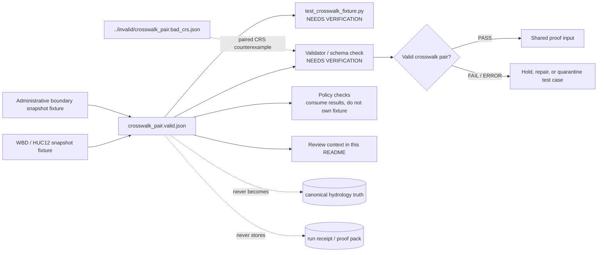

<!-- [KFM_META_BLOCK_V2]
doc_id: TODO: kfm://doc/<uuid>
title: Crosswalk Valid Fixtures
type: standard
version: v1
status: draft
owners: @bartytime4life (fallback; narrower owner NEEDS VERIFICATION)
created: TODO: YYYY-MM-DD
updated: 2026-04-27
policy_label: TODO: verify policy label
related: [../README.md, ../invalid/README.md, ../../README.md, ../../../README.md, ../../../../contracts/README.md, ../../../../schemas/README.md, ../../../../policy/README.md]
tags: [kfm, tests, fixtures, crosswalk, valid, hydrology]
notes: [README-like fixture leaf; doc_id created date and policy_label need registry verification; current public-main fixture inventory was inspected but no mounted checkout was available in this session]
[/KFM_META_BLOCK_V2] -->

<a id="top"></a>

# `valid/` Crosswalk Fixture Positive Cases

Public-safe positive examples for HUC12-to-administrative crosswalk validation under `tests/fixtures/crosswalk/valid/`.


| Field | Value |
| --- | --- |
| **Status** | `experimental` |
| **Owners** | `@bartytime4life` fallback; narrower fixture-lane ownership **NEEDS VERIFICATION** |
| **Path** | `tests/fixtures/crosswalk/valid/README.md` |
| **Repo fit** | child of [`../README.md`](../README.md); paired with [`../invalid/README.md`](../invalid/README.md); inside shared fixture seam [`../../README.md`](../../README.md); inside governed verification surface [`../../../README.md`](../../../README.md) |
| **Upstream authority** | contract/schema/policy surfaces: [`../../../../contracts/README.md`](../../../../contracts/README.md), [`../../../../schemas/README.md`](../../../../schemas/README.md), [`../../../../policy/README.md`](../../../../policy/README.md) |
| **Primary local fixture** | [`crosswalk_pair.valid.json`](./crosswalk_pair.valid.json) |
| **Sibling counterexample** | [`../invalid/crosswalk_pair.bad_crs.json`](../invalid/crosswalk_pair.bad_crs.json) |
| **Quick jumps** | [Scope](#scope) · [Repo fit](#repo-fit) · [Accepted inputs](#accepted-inputs) · [Exclusions](#exclusions) · [Current evidence snapshot](#current-evidence-snapshot) · [Directory tree](#directory-tree) · [Quickstart](#quickstart) · [Usage](#usage) · [Diagram](#diagram) · [Reference tables](#reference-tables) · [Task list](#task-list--definition-of-done) · [FAQ](#faq) · [Appendix](#appendix) |

> [!IMPORTANT]
> `valid/` proves the smallest known happy-path crosswalk shape for review and validation.
> It does **not** publish a crosswalk, define canonical hydrology truth, settle schema-home authority, or prove CI enforcement.

> [!NOTE]
> The current public fixture is useful because it is tiny, deterministic, and paired with a clear negative case.
> The active checkout, validator entrypoint, workflow enforcement, and canonical schema home still **NEED VERIFICATION** before this leaf is treated as implementation proof.

---

## Scope

`tests/fixtures/crosswalk/valid/` is the positive-fixture leaf for crosswalk examples that should pass the crosswalk fixture contract or validator once that validator is verified on the active branch.

The current local burden is narrow:

- keep the positive `crosswalk_pair` example visible and reviewable;
- preserve the relationship between the positive example and its paired invalid CRS counterexample;
- document why this fixture belongs under shared tests rather than contract, schema, policy, receipt, or publication lanes;
- prevent a tiny fixture from being mistaken for canonical data, a release artifact, or an emitted receipt.

### Truth labels used here

| Label | Meaning in this README |
| --- | --- |
| **CONFIRMED** | Directly visible in current public repo evidence or current-session inspection |
| **INFERRED** | Conservative interpretation of paired fixtures or adjacent KFM documentation |
| **PROPOSED** | Recommended branch-local practice not yet proven by active checkout, workflow, or validator evidence |
| **UNKNOWN** | Not verified strongly enough to state as current implementation |
| **NEEDS VERIFICATION** | Must be checked in the active branch before stronger claims are made |

[Back to top](#top)

---

## Repo fit

This leaf sits inside the shared fixture seam, downstream of object meaning, schema shape, policy decisions, and validator ownership.

| Direction | Surface | Why it matters |
| --- | --- | --- |
| Parent | [`../README.md`](../README.md) | Crosswalk fixture-family guide; currently should explain the family boundary before child leaves grow |
| Sibling | [`../invalid/README.md`](../invalid/README.md) | Paired negative fixture lane; keeps failure cases legible |
| Shared fixture seam | [`../../README.md`](../../README.md) | Root-side home for tiny public-safe reusable inputs |
| Governed test surface | [`../../../README.md`](../../../README.md) | Tests prove trust boundaries; tests do not become canonical truth |
| Contract lane | [`../../../../contracts/README.md`](../../../../contracts/README.md) | Object meaning and compatibility expectations belong there |
| Schema lane | [`../../../../schemas/README.md`](../../../../schemas/README.md) | Machine-checkable shape belongs there after schema-home authority is settled |
| Policy lane | [`../../../../policy/README.md`](../../../../policy/README.md) | Rights, sensitivity, admissibility, and deny/default logic belong there |
| Workflow lane | [`../../../../.github/workflows/README.md`](../../../../.github/workflows/README.md) | Orchestration and merge-blocking claims require workflow evidence |

### Working interpretation

A valid crosswalk fixture is a **test input**, not a source of truth. It may be consumed by contract tests, validators, hydrology mapping checks, policy checks, or e2e drills, but it should not define the canonical crosswalk object by itself.

[Back to top](#top)

---

## Accepted inputs

Use this leaf only for small positive examples that are safe to clone, deterministic to replay, and explicitly tied to crosswalk fixture behavior.

| Accepted here | Why it belongs |
| --- | --- |
| `crosswalk_pair.*.valid.json` | Positive examples for HUC12/admin crosswalk pair validation |
| README updates explaining local fixture inventory | Keeps review context close to the fixture |
| Minimal positive examples for a verified crosswalk schema or contract | Useful only when linked to the stronger authority surface |
| Public-safe hydrology/admin synthetic examples | Exercises geometry-derived attributes without exposing sensitive data |
| Migration notes for moving the fixture to a stronger canonical home | Prevents silent authority drift if fixture-home law changes |

### Minimum bar for new valid fixtures

A new file in this leaf should:

1. be JSON unless a verified validator expects another format;
2. name the object family and polarity in the filename;
3. stay tiny enough for full Git review;
4. preserve public-safe synthetic or rights-clear content;
5. include enough fields for the positive behavior under test;
6. have a paired invalid or edge-case fixture when the change introduces a new rule;
7. link back to the authority surface that defines the rule.

[Back to top](#top)

---

## Exclusions

| Does **not** belong here | Put it instead | Why |
| --- | --- | --- |
| Canonical schemas or vocabularies | [`../../../../schemas/`](../../../../schemas/) or the branch-verified schema home | Valid fixtures consume schemas; they do not define them |
| Human semantic contract law | [`../../../../contracts/`](../../../../contracts/) | Meaning and compatibility rules belong in the contract lane |
| Policy bundles, reason codes, or obligations | [`../../../../policy/`](../../../../policy/) | Policy decides admissibility; fixtures only exercise examples |
| Emitted run receipts or proof packs | governed receipt/proof/release lanes once verified | Process memory and proof objects must not collapse into fixtures |
| RAW, WORK, QUARANTINE, or provider mirror data | governed data lifecycle lanes | Public fixture trees must not bypass the trust membrane |
| Secrets, tokens, private locations, or rights-unclear records | secured non-public storage | Shared fixtures must remain safe to review |
| Broad hydrology domain essays | `docs/domains/` or a branch-verified domain lane | This leaf routes fixture behavior only |

> [!CAUTION]
> A positive fixture can still cause trust drift if it quietly becomes the example everyone copies as “the real object.”
> Keep the authority story visible.

[Back to top](#top)

---

## Current evidence snapshot

| Item | Status | Safe reading |
| --- | ---: | --- |
| `tests/fixtures/crosswalk/valid/README.md` | **CONFIRMED** | Current public file exists; this revision replaces a placeholder/empty leaf with guidance |
| `tests/fixtures/crosswalk/valid/crosswalk_pair.valid.json` | **CONFIRMED** | Current positive fixture for a `crosswalk_pair` object |
| `tests/fixtures/crosswalk/invalid/crosswalk_pair.bad_crs.json` | **CONFIRMED** | Current paired negative fixture; invalidity is centered on CRS mismatch |
| `tests/fixtures/crosswalk/test_crosswalk_fixture.py` | **CONFIRMED path / UNKNOWN behavior** | File is present in the family, but current executable test depth must be verified |
| `crs: "EPSG:5070"` in the valid fixture | **INFERRED validity signal** | Paired invalid fixture uses `EPSG:4326`, so equal-area CRS appears to be a rule under test |
| Crosswalk schema path | **UNKNOWN / NEEDS VERIFICATION** | No canonical crosswalk schema home is asserted here |
| Merge-blocking workflow coverage | **UNKNOWN** | Requires workflow and branch-protection evidence |
| This fixture as canonical production crosswalk data | **Not supported** | Treat as public-safe test input only |

[Back to top](#top)

---

## Directory tree

### Current fixture family shape

```text
tests/fixtures/crosswalk/
├── README.md
├── test_crosswalk_fixture.py
├── invalid/
│   ├── README.md
│   └── crosswalk_pair.bad_crs.json
└── valid/
    ├── README.md
    └── crosswalk_pair.valid.json
```

### This leaf

```text
tests/fixtures/crosswalk/valid/
├── README.md
└── crosswalk_pair.valid.json
```

### Candidate future shape (`PROPOSED`)

```text
tests/fixtures/crosswalk/valid/
├── README.md
├── crosswalk_pair.minimal.valid.json
└── crosswalk_pair.primary_overlap_ge_50pct_huc.valid.json
```

Keep the future shape narrow. Add more valid examples only when they prove a distinct positive rule and have paired negative coverage elsewhere.

[Back to top](#top)

---

## Quickstart

Inspect first, then validate with the branch-confirmed runner.

```bash
# Inspect the crosswalk fixture family exactly as the checkout exposes it.
find tests/fixtures/crosswalk -maxdepth 3 -type f | sort
```

```bash
# Pretty-print the current positive fixture without depending on jq.
python -m json.tool tests/fixtures/crosswalk/valid/crosswalk_pair.valid.json
```

```bash
# Compare the current positive fixture to the paired CRS-negative fixture.
python - <<'PY'
import json
from pathlib import Path

valid = json.loads(Path("tests/fixtures/crosswalk/valid/crosswalk_pair.valid.json").read_text())
invalid = json.loads(Path("tests/fixtures/crosswalk/invalid/crosswalk_pair.bad_crs.json").read_text())

assert valid["object_type"] == "crosswalk_pair"
assert valid["crs"] == "EPSG:5070"
assert invalid["crs"] != valid["crs"]

print({
    "valid_crs": valid["crs"],
    "invalid_crs": invalid["crs"],
    "assignment_method": valid["assignment_method"],
    "weight": valid["weight"],
})
PY
```

When the active branch confirms a real pytest runner and non-empty test implementation:

```bash
python -m pytest tests/fixtures/crosswalk
```

> [!WARNING]
> Do not add live network source access to this fixture family.
> Crosswalk tests should begin with no-network, public-safe fixtures before any source connector, watcher, or publication path is exercised.

[Back to top](#top)

---

## Usage

### What the current valid fixture demonstrates

The current positive fixture demonstrates one HUC12/admin crosswalk pair with:

- a HUC12 identifier;
- an administrative identifier and type;
- HUC, admin, and overlap areas;
- HUC-side and admin-side overlap percentages;
- a derived weight;
- an assignment method;
- a CRS suitable for area/distance interpretation;
- source snapshot references;
- geometry and spec hashes;
- a run receipt reference.

### Positive-lane authoring rules

- Keep one object family per file.
- Prefer rule-revealing filenames over vague names.
- Keep valid examples minimal but complete.
- Keep paired invalid cases in `../invalid/`.
- Use hashes and receipt IDs as fixture fields only; do not treat this leaf as receipt storage.
- Preserve real field names already used by tests or validators.
- Update this README when a fixture adds a new validity rule.

### Naming guidance

| Pattern | Use it for |
| --- | --- |
| `crosswalk_pair.valid.json` | current minimal positive example |
| `crosswalk_pair.<rule>.valid.json` | positive case proving one named rule |
| `crosswalk_pair.<failure>.invalid.json` | sibling negative case named by failure reason |
| `*.fixture.json` | avoid unless the role cannot be expressed as valid/invalid |

[Back to top](#top)

---

## Diagram



[Back to top](#top)

---

## Reference tables

### Current fixture field reading

| Field | Role in the positive example | Current posture |
| --- | --- | --- |
| `object_type` | Names the fixture object family as `crosswalk_pair` | **CONFIRMED** |
| `huc12_id` | HUC12-side identity | **CONFIRMED** |
| `admin_id` / `admin_type` | Administrative-side identity and class | **CONFIRMED** |
| `huc_area_m2`, `admin_area_m2`, `overlap_m2` | Area values supporting overlap calculation | **CONFIRMED** |
| `overlap_pct_huc`, `overlap_pct_admin`, `weight` | Derived percentages and weighting signal | **CONFIRMED** |
| `assignment_method` | Explains why this pairing is selected | **CONFIRMED** |
| `centroid_within_flag`, `shared_boundary_m` | Additional spatial relationship cues | **CONFIRMED** |
| `source_snapshot_ids` | Fixture-level source snapshot references | **CONFIRMED** |
| `algorithm_version` | Crosswalk algorithm version marker | **CONFIRMED** |
| `crs` | Coordinate reference system used by the fixture | **CONFIRMED** |
| `geometry_hash`, `spec_hash` | Deterministic integrity signals | **CONFIRMED** |
| `run_receipt_id` | Process-memory reference, not receipt storage | **CONFIRMED** |

### Minimum validity signals

| Signal | Expected in the current positive case | Why it matters |
| --- | --- | --- |
| CRS | `EPSG:5070` | Area and distance calculations need a stable projected context |
| Assignment method | `primary_overlap_ge_50pct_huc` | The pair is selected by an explicit overlap rule |
| HUC-side overlap | `0.6` | Supports the `ge_50pct_huc` assignment method |
| Admin-side overlap | `1.0` | Shows the admin fixture is fully overlapped in this synthetic case |
| Source snapshots | `fixture:wbd:huc12`, `fixture:tiger:county` | Keeps input provenance visible without claiming live source access |
| Hashes | `sha256:*` values | Keeps deterministic identity pressure visible |
| Receipt reference | `run_receipt:*` value | Links process memory without storing the receipt here |

### Placement matrix

| If the file mainly does this… | Preferred home |
| --- | --- |
| proves one reusable crosswalk input shape | `tests/fixtures/crosswalk/valid/` |
| proves one failure reason for that shape | `tests/fixtures/crosswalk/invalid/` |
| defines the crosswalk object meaning | `contracts/` or a branch-confirmed contract lane |
| defines machine-checkable shape | `schemas/` or a branch-confirmed schema lane |
| decides whether a crosswalk can publish | `policy/` plus release/promotion surfaces |
| stores emitted receipts or proof packs | governed receipt/proof/release lanes |
| exercises full runtime/public behavior | `tests/e2e/` or branch-confirmed runtime-proof lane |

[Back to top](#top)

---

## Task list / Definition of done

A change to this leaf is ready for review when:

- [ ] the fixture family and polarity are obvious from the filename;
- [ ] the fixture remains tiny, deterministic, public-safe, and rights-safe;
- [ ] the nearest contract/schema/policy authority is linked or explicitly marked **NEEDS VERIFICATION**;
- [ ] a paired invalid fixture exists when the valid fixture introduces a new rule;
- [ ] the fixture does not contain RAW, WORK, QUARANTINE, secrets, or source mirrors;
- [ ] hashes, algorithm versions, and receipt references are treated as fields under test, not as emitted proof custody;
- [ ] local inspection commands still match the checked-out branch;
- [ ] parent and sibling READMEs are updated when family meaning changes;
- [ ] CI or validator enforcement is not claimed unless verified from workflow and test evidence.

### Definition of done for this leaf

This leaf is meaningfully established when reviewers can answer:

1. why the positive fixture lives here;
2. what makes it valid;
3. where the paired invalid case lives;
4. which stronger surface owns meaning, shape, and policy;
5. which branch-verified validator or test consumes it;
6. what remains unverified.

[Back to top](#top)

---

## FAQ

### Does `crosswalk_pair.valid.json` publish a hydrology crosswalk?

No. It is a tiny shared fixture. It supports review and validation; it is not a published dataset, release manifest, catalog record, or proof pack.

### Why is CRS called out so strongly?

The paired invalid fixture is a bad-CRS case, while the valid fixture uses `EPSG:5070`. That makes CRS the clearest current rule demonstrated by this fixture pair.

### Can this directory hold real source data?

No. Keep real source intake in governed lifecycle lanes. This directory should contain public-safe, deterministic test inputs only.

### Does a passing fixture test prove policy approval?

No. Shape validity and policy admissibility are separate burdens. Policy decisions belong in the policy lane and release/promotion flow.

### Should this leaf grow into the canonical valid fixture home?

Not by accident. If maintainers choose that direction, record the authority decision, update parent READMEs, link schemas/contracts/policy, and wire validators consistently.

[Back to top](#top)

---

## Appendix

### Appendix A — Direct verification still needed

Before treating this README as fully settled branch-local truth, verify:

- whether the active branch still contains exactly this fixture layout;
- whether `test_crosswalk_fixture.py` contains executable assertions;
- whether a canonical crosswalk schema or contract exists;
- whether `EPSG:5070` is formally required by schema, validator, or contract;
- whether any workflow runs crosswalk fixture checks;
- whether parent and sibling crosswalk READMEs should be filled in the same PR;
- whether any hydrology mapping contract lane should be linked more specifically.

### Appendix B — Reconciliation rule if the branch differs

If the checked-out branch differs from this README:

1. preserve the boundary rule: fixture input ≠ schema ≠ policy ≠ receipt ≠ proof ≠ publication;
2. replace any path claims with branch-visible paths;
3. downgrade unsupported claims to **UNKNOWN** or **NEEDS VERIFICATION**;
4. update the directory tree and quickstart commands first;
5. update parent and sibling READMEs in the same change when fixture-home meaning changes.

[Back to top](#top)
