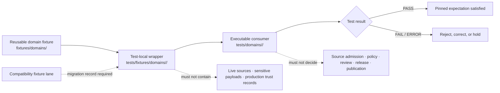

# `tests/fixtures/domains/` — Domain Test-Local Fixture Routing Index

> Repository-grounded parent index for domain-segmented, test-local fixture wrappers. This subtree organizes small synthetic manifests and expectations owned by named domain tests; it does not own reusable fixture payloads, executable tests, domain truth, source admission, evidence, policy decisions, release approval, or public artifacts.

<!-- [KFM_META_BLOCK_V2]
doc_id: kfm://doc/tests-fixtures-domains-readme
title: tests/fixtures/domains/README.md — Domain Test-Local Fixture Routing Index
type: readme; directory-readme; test-local-fixture-domain-index; routing-boundary; non-authoritative
version: v0.1
status: draft; repository-grounded; expanded-from-empty-placeholder; eight-direct-domain-readmes-confirmed; one-domain-with-six-readme-children; five-canonical-domain-fixture-parents-checked-absent; higher-test-fixture-parent-confirmed; executable-domain-test-parent-confirmed; reusable-domain-fixture-parent-minimal; mixed-child-maturity; executable-parent-harness-unestablished; no-network-default; fail-closed; non-authoritative
owners: OWNER_TBD — Test architecture steward · Fixture steward · QA steward · Domain stewards · Source-role steward · Identity steward · Temporal/freshness steward · Rights/sensitivity reviewers · Evidence steward · Receipt steward · Policy steward · Review steward · Release steward · Correction/rollback steward · Security reviewer · CI steward · Docs steward
created: 2026-07-16
updated: 2026-07-16
policy_label: public-doc; tests; fixtures; domains; parent-index; test-local-only; synthetic-only; no-network-default; no-live-source; source-role-fixed; identity-aware; time-aware; sensitive-domain-aware; evidence-required; receipt-aware; review-gated; policy-gated; release-subordinate; correction-aware; revocation-aware; rollback-aware; no-publication
current_path: tests/fixtures/domains/README.md
truth_posture:
  CONFIRMED:
    - Directory Rules define responsibility-root placement and tests/ plus fixtures/ as validation and fixture roots
    - tests/README.md is the canonical enforceability root and records mixed implementation maturity
    - tests/fixtures/README.md defines tests/fixtures as unit-test-scoped and root fixtures as reusable/cross-cutting
    - tests/domains/README.md indexes twelve canonical domain test packages plus compatibility lanes
    - fixtures/domains/README.md exists as a minimal reusable-domain-fixture parent
    - the target path exists as an empty placeholder blob at the pre-write base
    - eight direct child domain README paths were confirmed by repository search and readback
    - archaeology has six confirmed README-only child lanes under this subtree
    - agriculture, fauna, flora, habitat, hazards, hydrology, and soil are parent-only direct lanes in their bounded evidence
    - atmosphere, geology, people-dna-land, roads-rail-trade, and settlements-infrastructure parent READMEs were absent at checked direct paths
    - parent-level conftest.py, manifest_expectations.json, and representative executable test module were absent at checked paths
    - child READMEs consistently route reusable payloads to fixtures/domains/<domain> and executables to tests/domains/<domain>
    - Makefile fixtures target is TODO and default make test excludes this subtree
  PROPOSED:
    - this parent owns direct child indexing, admission rules, common wrapper contracts, consumer backlinks, nonempty coverage, migration guidance, and verification registers
    - domain child parents are created only when a named executable consumer needs test-local declarative wrappers
    - executable tests consume wrappers by reference from their owning tests/domains/<domain> lanes
    - a future machine-readable parent manifest may enumerate children, owners, consumers, fixture homes, and maturity
  CONFLICTED:
    - multiple child READMEs record this parent as absent while the pre-write base contains only an empty placeholder
    - tests/domains has twelve canonical domain packages while this subtree currently has eight direct domain parents
    - several domains have compatibility fixture parents outside tests/fixtures/domains without final migration rules
    - archaeology has a developed README-only child taxonomy while most sibling domains are parent-only
    - reusable fixture roots range from multi-lane indexes to a five-line greenfield stub
    - child schemas, policies, validators, executable tests, and CI have materially different maturity
    - contract, schema, fixture, validator, outcome, sensitivity, and time vocabularies differ across domains and must not be silently normalized
  UNKNOWN:
    - exhaustive recursive inventory, ignored/generated files, dynamic fixture generation, and external fixture stores
    - active consumer tests and two-way backlinks for every child
    - accepted parent and child manifest schemas
    - current pass rates, coverage, branch-protection significance, retained CI artifacts, production consumers, and release dependency
    - whether every canonical domain test package needs a matching test-local fixture parent
  NEEDS_VERIFICATION:
    - accepted owners and CODEOWNERS
    - canonical child-admission threshold
    - relationship between domain-segmented and compatibility fixture lanes
    - canonical fixture IDs, versions, hashes, generators, and generation receipts
    - substantive payload and consumer inventories per child
    - no-network, no-write, no-live-source, no-leak, orphan, duplicate, and nonempty-coverage enforcement
    - parent index synchronization and CI ownership
evidence_snapshot:
  repository: bartytime4life/Kansas-Frontier-Matrix
  repository_id: "1059091169"
  visibility: public
  base_ref: main
  base_commit: 524ec92059a367a1f1107a6d0eb781aeadecf948
  target_prior_blob: 8b137891791fe96927ad78e64b0aad7bded08bdc
  target_state_at_authoring_base: empty-placeholder
  related_repository_blobs:
    directory_rules: 2affb080e6f0043867c64c7f06c1ca52030fbd55
    tests_root_readme: 2c03b844ab8007453e091c3b24160a209e5214ff
    tests_fixtures_parent: 2d0147e85eae86f687e85c5bea0d3e61f9c3a8f7
    tests_domains_parent: d84d692e15cc1882e4eff9771c091e8a6a872911
    reusable_domains_parent: 9dbe30cc5ff006420448cb4af2b9be2fd30f7475
    agriculture_child: 30acac232528b83b8c3891b87fa7d6f562aa322c
    archaeology_child: df2f57ae95e1dbdc144ce68deea2841808356e54
    fauna_child: ba785137bde31dda404c0440245e0b3e0139bd06
    flora_child: f87a7a219c19b3f334e001fd3887cf632125e4af
    habitat_child: b2c2b3392dfeafc3b849d63d7cb4f424745a5719
    hazards_child: 75453b8f9d30580165ca749e739c1b1446853662
    hydrology_child: b1d8d4ddc9bb51712fac109d96d063a68ed86249
    soil_child: 8c665a383cb19040bd46ea21f69b860fd8afff4c
    makefile: 4dc8cf633581893d83fba53219c6ea847992e6be
  direct_child_readmes_confirmed:
    - tests/fixtures/domains/agriculture/README.md
    - tests/fixtures/domains/archaeology/README.md
    - tests/fixtures/domains/fauna/README.md
    - tests/fixtures/domains/flora/README.md
    - tests/fixtures/domains/habitat/README.md
    - tests/fixtures/domains/hazards/README.md
    - tests/fixtures/domains/hydrology/README.md
    - tests/fixtures/domains/soil/README.md
  archaeology_grandchild_readmes_confirmed:
    - tests/fixtures/domains/archaeology/api/README.md
    - tests/fixtures/domains/archaeology/promotion/README.md
    - tests/fixtures/domains/archaeology/review/README.md
    - tests/fixtures/domains/archaeology/sensitive_geometry/README.md
    - tests/fixtures/domains/archaeology/sites/README.md
    - tests/fixtures/domains/archaeology/source/README.md
  checked_absent_direct_domain_parents:
    - tests/fixtures/domains/atmosphere/README.md
    - tests/fixtures/domains/geology/README.md
    - tests/fixtures/domains/people-dna-land/README.md
    - tests/fixtures/domains/roads-rail-trade/README.md
    - tests/fixtures/domains/settlements-infrastructure/README.md
  checked_absent_parent_files:
    - tests/fixtures/domains/conftest.py
    - tests/fixtures/domains/manifest_expectations.json
    - tests/fixtures/domains/test_parent_domain_fixture_index.py
notes:
  - "This file expands the empty parent placeholder without creating child fixtures, executable tests, schemas, contracts, policies, validators, workflows, data, receipts, proofs, releases, or public artifacts."
  - "Direct child presence is demand-driven and does not imply every tests/domains package requires a tests/fixtures/domains child."
  - "README presence is not fixture coverage; child maturity remains domain-specific and evidence-bounded."
  - "Compatibility fixture lanes outside tests/fixtures/domains remain subordinate to accepted migration and ownership decisions."
[/KFM_META_BLOCK_V2] -->

<a id="top"></a>

<p>
  
  
  
  
  
  
  
</p>

> [!IMPORTANT]
> **This is a test-local domain grouping index.** Reusable domain fixture payloads belong under [`fixtures/domains/`](../../../fixtures/domains/README.md) and its child lanes. Executable domain tests belong under [`tests/domains/`](../../domains/README.md). This subtree exists only for small declarative wrappers and expectations owned by named domain tests.

> [!CAUTION]
> **A domain README is not fixture coverage.** The eight direct children have materially different maturity: one has six README-only children, several are parent-only, reusable roots range from detailed indexes to a greenfield stub, and executable consumers remain broadly unverified.

> [!WARNING]
> **The strictest child boundary wins.** Sensitive archaeology, rare-species localities, living-person or land joins, critical infrastructure, exact wells, cultural knowledge, and life-safety-adjacent hazard context must remain denied, generalized, withheld, staged, or synthetic according to the owning domain. A parent index cannot relax a child policy.

**Quick navigation:** [Status](#status-and-evidence-boundary) · [Purpose](#purpose-and-audience) · [Authority](#authority-and-directory-rules-basis) · [Architecture](#parent-role-in-the-fixture-architecture) · [Children](#confirmed-direct-child-index) · [Absent](#checked-absent-canonical-domain-parents) · [Executables](#relationship-to-testsdomains) · [Reusable](#relationship-to-fixturesdomains) · [Compatibility](#compatibility-and-non-domain-fixture-lanes) · [Responsibilities](#parent-responsibilities-and-non-responsibilities) · [Flow](#domain-fixture-routing-flow) · [Admission](#domain-child-admission-contract) · [Child README](#minimum-child-readme-contract) · [Manifest](#minimum-wrapper-manifest-contract) · [Consumers](#consumer-backlinks-orphans-and-nonempty-coverage) · [Invariants](#shared-domain-fixture-invariants) · [Sensitivity](#domain-sensitivity-and-fail-closed-matrix) · [Non-collapse](#domain-specific-non-collapse-canaries) · [Time](#source-role-identity-time-and-freshness-discipline) · [Trust objects](#evidence-receipt-review-policy-and-release-separation) · [Public carriers](#api-map-drawer-focus-export-cache-and-ai-boundary) · [Security](#no-network-security-and-side-effects) · [Determinism](#identity-version-hash-generation-and-replay) · [Outcomes](#outcome-vocabularies-and-claim-discipline) · [Cases](#parent-case-matrix) · [Maturity](#current-maturity-and-drift-matrix) · [Commands](#validation-commands) · [CI](#ci-and-promotion-boundary) · [Failures](#failure-interpretation) · [Passing](#what-passing-does-not-prove) · [Maintenance](#maintenance-migration-and-deprecation) · [Done](#definition-of-done) · [FAQ](#faq) · [Verification](#open-verification-register) · [Evidence](#evidence-ledger) · [Rollback](#documentation-correction-and-rollback)

---

## Status and evidence boundary

- **Authoring snapshot:** `main@524ec92059a367a1f1107a6d0eb781aeadecf948`
- **Current target state at that snapshot:** empty placeholder
- **Prior target blob:** `8b137891791fe96927ad78e64b0aad7bded08bdc`
- **Direct child READMEs confirmed:** eight
- **Direct child with confirmed grandchildren:** Archaeology, six README-only lanes
- **Parent executable harness:** not established
- **Complete payload inventory:** unknown

### Safe conclusion

`tests/fixtures/domains/` is a domain-segmented grouping under the unit-test-scoped fixture root. Its purpose is to route declarative, synthetic, test-local wrappers to named domain consumers without becoming:

- the reusable fixture registry;
- an executable test package;
- a source, lifecycle, evidence, receipt, policy, review, or release store;
- a public API, map, tile, export, cache, screenshot, or AI surface;
- a domain truth or decision-authority root.

### Truth labels used here

| Label | Meaning in this parent |
|---|---|
| **CONFIRMED** | Verified from current repository readback, checked paths, or commit-pinned child READMEs. |
| **PROPOSED** | A design, manifest, command, child lane, or governance improvement not established as current behavior. |
| **CONFLICTED** | Repository paths, vocabularies, or maturity signals disagree; this parent does not silently choose a winner. |
| **UNKNOWN** | Evidence is insufficient to determine the answer. |
| **NEEDS VERIFICATION** | Checkable, but not verified strongly enough for reliance or promotion. |
| **DENY** | A prohibited authority interpretation, sensitive exposure, lifecycle bypass, or publication shortcut. |

[Back to top](#top)

---

## Purpose and audience

This parent serves:

- domain test authors;
- fixture and QA stewards;
- domain stewards;
- source-role, identity, temporal, rights, and sensitivity reviewers;
- evidence, receipt, policy, review, release, and rollback stewards;
- CI and documentation maintainers.

Its purposes are to:

1. index confirmed domain fixture parents;
2. preserve the split between test-local wrappers, reusable fixtures, and executable tests;
3. define when a new domain child belongs here;
4. prevent executable code from drifting into fixture directories;
5. prevent README-only or placeholder-only lanes from appearing implemented;
6. require consumer backlinks and nonempty coverage before a child is called substantive;
7. expose compatibility, vocabulary, sensitivity, and maturity drift;
8. keep changes inspectable and reversible.

This file does not create a requirement that every canonical domain package have a matching fixture parent. A child should exist only when a concrete test-local responsibility exists.

[Back to top](#top)

---

## Authority and Directory Rules basis

Directory Rules state that location encodes ownership, governance, and lifecycle. Topic alone does not justify a path. This parent follows that law:

| Responsibility | Correct home | Relationship to this parent |
|---|---|---|
| Canonical enforceability proof | `tests/` | Owning root. |
| Unit-test-scoped fixture wrappers | `tests/fixtures/` | Higher parent. |
| Domain-segmented test-local wrappers | `tests/fixtures/domains/<domain>/` | Children indexed here. |
| Executable domain tests | `tests/domains/<domain>/` | Named consumers; never stored here. |
| Reusable domain fixture payloads | `fixtures/domains/<domain>/` | Referenced by wrappers; not duplicated here. |
| Cross-domain reusable fixtures | accepted shared `fixtures/` lanes | Used only when no single domain owns the fixture. |
| Semantic meaning | `contracts/` | Referenced; not authored here. |
| Machine shape | `schemas/` | Referenced; not authored here. |
| Admissibility and sensitivity | `policy/` | Referenced; not defined here. |
| Source identity and admission | registry/source roots | Referenced through synthetic IDs only. |
| Evidence and process memory | proof/receipt roots | Synthetic refs only. |
| Release, correction, rollback | `release/` and accepted release roots | Expected behavior only; no authority. |
| Lifecycle data | RAW → WORK/QUARANTINE → PROCESSED → CATALOG/TRIPLET → PUBLISHED | Never stored here. |
| Public access | governed APIs and released carriers | Never direct reads from fixtures or internal stores. |

Promotion is a governed state transition, not a file move. Moving a fixture, changing a README, or passing a test does not transfer authority.

[Back to top](#top)

---

## Parent role in the fixture architecture

The current responsibility split is:

```text
tests/
|-- fixtures/
|   |-- README.md                       # unit-test-scoped fixture authority
|   `-- domains/
|       |-- README.md                   # this parent index
|       `-- <domain>/
|           `-- README.md               # domain test-local wrapper boundary
`-- domains/
    |-- README.md                       # executable domain test index
    `-- <domain>/
        `-- ...                         # assertions, helpers, reports

fixtures/
|-- README.md                           # reusable/runtime fixture authority
`-- domains/
    |-- README.md                       # minimal reusable-domain parent
    `-- <domain>/
        `-- ...                         # shared payloads and expected outputs
```

A mature flow is:

```text
reusable fixture -> test-local wrapper -> executable domain test -> finite result
```

Each arrow requires explicit references. Folder adjacency is not a reference.

[Back to top](#top)

---

## Confirmed direct child index

The following direct child READMEs were confirmed at the authoring snapshot.

| Domain child | Current direct posture | Important boundary | Reusable/executable relationship |
|---|---|---|---|
| [`agriculture/`](agriculture/README.md) | v0.2; README-only direct lane | Aggregate-first; source-role, rights, and private-operation detail must not collapse. | Reusable material under `fixtures/domains/agriculture/`; executable consumers under `tests/domains/agriculture/`. |
| [`archaeology/`](archaeology/README.md) | v0.2; parent plus six README-only children | Deny exact sites, burial/sacred/cultural-security detail, and inferred cultural authority. | Reusable material under `fixtures/domains/archaeology/`; executable fixture tests under `tests/domains/archaeology/fixtures/`. |
| [`fauna/`](fauna/README.md) | v0.2; parent-only direct lane | Taxonomy is not occurrence truth; sensitive locations and observer detail fail closed. | Reusable material under `fixtures/domains/fauna/`; executables under `tests/domains/fauna/`. |
| [`flora/`](flora/README.md) | v0.2; parent-only direct lane | Rare-plant locality, observer/steward privacy, and cultural knowledge fail closed. | Reusable material under `fixtures/domains/flora/`; compatibility wrappers also exist outside this parent; executables under `tests/domains/flora/`. |
| [`habitat/`](habitat/README.md) | v0.2; parent-only direct lane | Model is not observation; habitat context is not species truth; produced sensitive joins require strict review. | Reusable material under `fixtures/domains/habitat/`; shared ecology fixtures are separate; executables under `tests/domains/habitat/`. |
| [`hazards/`](hazards/README.md) | v0.2; parent-only direct lane | KFM is never alert authority; no life-safety instruction; warnings, events, regulatory context, and models remain distinct. | Reusable material under `fixtures/domains/hazards/`; executables under `tests/domains/hazards/`. |
| [`hydrology/`](hydrology/README.md) | v0.2; parent-only direct lane | NFHL is regulatory context, not observed inundation; no flood-warning authority; time and source roles remain distinct. | Reusable, runtime-staging, and compatibility fixture parents coexist outside this child; executables under `tests/domains/hydrology/`. |
| [`soil/`](soil/README.md) | v0.2; parent-only direct lane | Survey, grid, station, satellite, pedon/profile, interpretation, and derivative support types must not collapse. | Reusable root is currently a greenfield stub; executable domain test root is parent-only. |

### Archaeology confirmed grandchildren

Archaeology is the only direct child with confirmed child READMEs in this subtree at the authoring snapshot:

- [`archaeology/api/`](archaeology/api/README.md);
- [`archaeology/promotion/`](archaeology/promotion/README.md);
- [`archaeology/review/`](archaeology/review/README.md);
- [`archaeology/sensitive_geometry/`](archaeology/sensitive_geometry/README.md);
- [`archaeology/sites/`](archaeology/sites/README.md);
- [`archaeology/source/`](archaeology/source/README.md).

All six are README-only in their parent’s bounded evidence. Their existence does not prove payloads or consumers.

[Back to top](#top)

---

## Checked-absent canonical domain parents

`tests/domains/README.md` indexes canonical executable-domain packages that do not currently have a confirmed direct parent here.

The following direct paths were checked and returned not found:

| Canonical domain package | Checked fixture-parent path | Safe interpretation |
|---|---|---|
| Atmosphere | `tests/fixtures/domains/atmosphere/README.md` | No direct test-local domain fixture parent established at the checked ref. |
| Geology | `tests/fixtures/domains/geology/README.md` | No direct test-local domain fixture parent established at the checked ref. |
| People / DNA / Land | `tests/fixtures/domains/people-dna-land/README.md` | No direct test-local domain fixture parent established at the checked ref. |
| Roads / Rail / Trade | `tests/fixtures/domains/roads-rail-trade/README.md` | No direct test-local domain fixture parent established at the checked ref. |
| Settlements / Infrastructure | `tests/fixtures/domains/settlements-infrastructure/README.md` | No direct test-local domain fixture parent established at the checked ref. |

Absence here is not a defect by itself. A child should be created only when:

- a named executable consumer exists or is approved;
- test-local material cannot be represented by reusable fixtures alone;
- ownership and sensitivity are explicit;
- the child will not become a duplicate authority.

[Back to top](#top)

---

## Relationship to `tests/domains/`

`tests/domains/` owns executable domain test packages. This parent does not.

A child wrapper should point to a consumer such as:

```text
tests/fixtures/domains/<domain>/<lane>/manifest.json
  -> tests/domains/<domain>/<lane>/test_<behavior>.py
```

The executable test should point back:

```text
tests/domains/<domain>/<lane>/test_<behavior>.py
  -> tests/fixtures/domains/<domain>/<lane>/manifest.json
```

Rules:

- no `test_*.py` files are proposed by this parent;
- no parent `conftest.py` is assumed;
- collection hooks belong with executable tests unless a verified repository convention says otherwise;
- a domain test package does not require a test-local fixture parent if reusable fixtures are sufficient;
- a wrapper cannot be called active until its consumer resolves.

[Back to top](#top)

---

## Relationship to `fixtures/domains/`

`fixtures/domains/` is the reusable-domain fixture side of the split.

The current parent at `fixtures/domains/README.md` contains only a minimal statement. Its brevity does not change the responsibility split:

- reusable across tests or pipelines → `fixtures/domains/<domain>/`;
- local to one named test need → this subtree may be appropriate;
- executable assertion or helper → `tests/domains/<domain>/`;
- real source, lifecycle, evidence, policy, receipt, or release material → owning governed root.

Reusable maturity varies materially by domain. Some reusable roots have many README-backed lanes; Soil is a greenfield stub. This parent must not flatten those differences into a single maturity claim.

[Back to top](#top)

---

## Compatibility and non-domain fixture lanes

Some fixture lanes exist outside `tests/fixtures/domains/`, including compatibility, UI, renderer, focus, settlements, and domain-specific bare paths.

Examples confirmed through parent or child documentation include:

- `tests/fixtures/flora/`;
- `tests/fixtures/hydrology/`;
- `tests/fixtures/settlements/`;
- `tests/fixtures/settlements-infrastructure/`;
- `tests/fixtures/focus/`;
- `tests/fixtures/layers/`;
- `tests/fixtures/maplibre/`;
- `tests/fixtures/ui/`.

This parent does not absorb them automatically.

Before moving or duplicating a compatibility lane:

1. inventory payloads and consumers;
2. identify canonical responsibility;
3. compare IDs and digests;
4. define compatibility period and redirects;
5. update all backlinks;
6. add migration and rollback records;
7. use an ADR when authority changes materially.

Compatibility is a governed migration state, not permission for parallel fixture authority.

[Back to top](#top)

---

## Parent responsibilities and non-responsibilities

### This parent owns

- direct domain child navigation;
- child-admission and retention criteria;
- the test-local/reusable/executable routing rule;
- common wrapper manifest expectations;
- consumer backlink and orphan rules;
- nonempty coverage and anti-vacuity requirements;
- cross-domain sensitivity inheritance;
- common security, no-network, no-write, and no-live-source rules;
- compatibility and migration guidance;
- parent-level maturity and verification registers;
- documentation correction and rollback instructions.

### This parent does not own

- reusable payload semantics;
- executable tests, helpers, or collection hooks;
- contracts or schemas;
- source descriptors, source exports, or registry admission;
- lifecycle records;
- EvidenceBundles, proofs, receipts, or validation artifacts;
- binding policy or review decisions;
- release manifests, correction notices, or rollback cards;
- public APIs, maps, tiles, exports, caches, screenshots, embeddings, graphs, or AI answers;
- domain truth or cross-domain ownership;
- canonical vocabulary consolidation without evidence and migration governance.

[Back to top](#top)

---

## Domain fixture routing flow



The diagram is a routing contract. It does not prove payloads, consumers, CI, or release gates exist.

[Back to top](#top)

---

## Domain child admission contract

A new `tests/fixtures/domains/<domain>/` child requires:

- a canonical or explicitly governed compatibility domain identity;
- a distinct test-local responsibility;
- at least one named proposed or confirmed executable consumer;
- a clear relationship to the reusable domain fixture root;
- an explicit non-authority statement;
- synthetic, deterministic, public-safe input rules;
- domain sensitivity and rights posture;
- positive and fail-closed case expectations;
- finite test and domain outcomes;
- no-network, no-live-source, no-governed-root-write, and no-leak rules;
- owner, maintenance, deprecation, migration, and rollback expectations;
- this parent index updated in the same change.

A child should be rejected when it:

- duplicates reusable payloads;
- exists only for symmetry with `tests/domains/`;
- carries executable assertions;
- lacks a consumer;
- uses a compatibility slug as new canonical authority;
- would expose real sensitive, private, cultural, infrastructure, or life-safety-adjacent material;
- cannot identify the owning domain for a cross-domain join.

[Back to top](#top)

---

## Minimum child README contract

Each child README should contain:

| Field or section | Requirement |
|---|---|
| Path and purpose | Exact path and one-line test-local responsibility. |
| Authority boundary | Explicitly non-authoritative; reusable and executable homes named. |
| Truth labels | CONFIRMED, PROPOSED, CONFLICTED, UNKNOWN, and NEEDS VERIFICATION where material. |
| Evidence snapshot | Repository, base commit, prior blob/state, inspected parents, and checked absences. |
| Direct inventory | Confirmed files and child lanes; proposed paths separate. |
| Admission rules | What may and may not enter the child. |
| Domain invariants | Source role, identity, time, sensitivity, and decision limits. |
| Consumer contract | Two-way backlinks and orphan handling. |
| Security posture | Synthetic-only, no-network, no-live-source, safe diagnostics. |
| Outcomes | Test outcome separated from runtime/policy/release states. |
| CI posture | Exact current commands or explicit unverified status. |
| Passing limitations | What success does not prove. |
| Correction/rollback | Reversible documentation and fixture migration path. |
| Verification register | Open questions with truth labels and owners where known. |

A child README must not turn proposed paths into inventory.

[Back to top](#top)

---

## Minimum wrapper manifest contract

The example below is **PROPOSED** and contains no real domain data.

```json
{
  "fixture_manifest_id": "kfm://fixture-test/domain/example",
  "fixture_version": "v1",
  "domain": "example-domain",
  "fixture_scope": "test_local_domain_segmented",
  "fixture_authority": "non_authoritative",
  "synthetic": true,
  "child_lane": "example-lane",
  "consumer_refs": [
    "tests/domains/example-domain/example-lane/test_example.py"
  ],
  "canonical_fixture_ref": "fixtures/domains/example-domain/example-lane/example.json",
  "object_family": "ExampleObject",
  "source_role": "synthetic",
  "identity_posture": "toy_deterministic",
  "time_posture": "synthetic_not_current",
  "sensitivity_posture": "public_safe_synthetic",
  "contains_live_source_data": false,
  "contains_restricted_detail": false,
  "evidence_ref": "evidence-ref:fixture:example",
  "run_receipt_ref": "run-receipt:fixture:example",
  "review_ref": null,
  "policy_decision_ref": null,
  "release_manifest_ref": null,
  "rollback_card_ref": "rollback-card:fixture:example",
  "expected_test_outcome": "PASS",
  "expected_domain_outcome": "ABSTAIN",
  "reason_code": "SYNTHETIC_EVIDENCE_INCOMPLETE",
  "must_not_claim": [
    "SOURCE_ADMITTED",
    "DOMAIN_TRUTH_CONFIRMED",
    "EVIDENCE_CLOSED",
    "POLICY_ALLOWED",
    "REVIEW_COMPLETE",
    "RELEASED",
    "MAP_TRUTH",
    "AI_TRUTH"
  ]
}
```

A future accepted manifest schema must settle:

- IDs, versions, hashes, and generators;
- domain and compatibility identity;
- reusable fixture references;
- object and relation families;
- source role and permitted claims;
- identity and time kinds;
- sensitivity and transform profiles;
- test, runtime, policy, review, and release outcomes;
- reason codes and obligations;
- evidence, receipt, correction, withdrawal, revocation, invalidation, and rollback references.

[Back to top](#top)

---

## Consumer backlinks, orphans, and nonempty coverage

Mature child coverage requires two-way traceability:

```text
wrapper -> executable consumer
consumer -> wrapper
```

Parent-level checks should require:

- every direct child has an owner;
- every substantive wrapper names an active consumer;
- every consumer reference resolves;
- reusable payloads are referenced rather than copied;
- compatibility wrappers carry a migration reason;
- every consequential family has positive and fail-closed cases;
- zero collected cases fails;
- README-only and placeholder-only lanes do not count as payload coverage;
- skipped cases carry reason, owner, and expiry;
- orphan wrappers and unused reusable fixtures are reported;
- child and parent indexes remain synchronized;
- removed or superseded fixtures invalidate consumers.

A directory with only a README can be a valid routing boundary. It cannot be reported as substantive test coverage.

[Back to top](#top)

---

## Shared domain fixture invariants

| Invariant | Required behavior | Default failure |
|---|---|---|
| Responsibility integrity | Test-local, reusable, executable, authority, lifecycle, and public roots remain separate. | Block admission. |
| Synthetic identity | Use conspicuous fake IDs, sources, people, places, times, values, and geometries. | Reject fixture. |
| Source-role integrity | Observed, regulatory, modeled, aggregate, administrative, candidate, contextual, and synthetic roles stay fixed. | `DENY` or `ABSTAIN`. |
| Identity integrity | Display labels, paths, and geometry alone do not create canonical identity. | Reject or abstain. |
| Time integrity | Observed, valid, source, retrieval, release, expiry, correction, and supersession times remain distinct. | `DENY`, `HOLD`, or `ABSTAIN`. |
| Evidence separation | EvidenceRef must resolve where consequential; a fixture ref is not proof. | `ABSTAIN`. |
| Receipt separation | A receipt-like fixture is not production process memory or truth proof. | Block consequential use. |
| Policy separation | Fixture metadata is not a PolicyDecision. | Block consequential use. |
| Review separation | Fixture or schema pass is not review approval. | Block consequential use. |
| Release separation | Test success is not release or publication approval. | Promotion block. |
| Watcher non-publisher | Watchers emit no-op or proposed work; they never publish. | Reject direct mutation. |
| No-network | Default fixture tests use local synthetic inputs only. | `ERROR`. |
| No governed-root writes | Tests write only to test-owned temporary locations. | `ERROR`. |
| Safe diagnostics | Errors expose safe reason codes, not protected payloads. | Security failure. |
| Deterministic replay | Same pinned inputs produce the same bounded result. | Fail test. |
| Correction/rollback | Superseded or withdrawn fixtures invalidate dependent expectations. | Fail and block release use. |
| Strictest-policy inheritance | Cross-domain joins apply the most restrictive applicable policy. | Deny, generalize, or hold. |

[Back to top](#top)

---

## Domain sensitivity and fail-closed matrix

| Domain | High-risk fixture concern | Safe default |
|---|---|---|
| Agriculture | Farm/operator detail, economic or operational inference, fine-grained production data. | Aggregate, synthesize, generalize, deny private detail. |
| Archaeology | Exact sites, burials, sacred places, looting risk, sovereignty-bearing knowledge. | Deny, withhold, staged access, cultural/rights review. |
| Fauna | Rare/sensitive species locations, observer identity, nesting/den sites. | Generalize, delay, deny, preserve geoprivacy. |
| Flora | Rare-plant localities, collector/steward privacy, culturally sensitive plant knowledge. | Generalize, deny, rights/cultural review. |
| Habitat | Sensitive species joins, corridors, produced geometry, infrastructure inference. | Strictest join policy, generalized outputs, review. |
| Hazards | Life-safety instructions, current alerts, infrastructure exposure. | `DENY` KFM authority; official-source referral; no live fixture. |
| Hydrology | Flood-warning implication, NFHL upcast, exact sensitive wells. | Keep roles separate; deny alert authority; generalize wells. |
| Soil | Property/person joins, private field detail, operational sensor values, false precision. | Synthetic-only, deny identifying joins, expose support and scale. |

The parent does not define domain policy. It preserves the requirement that child policy cannot be weakened here.

[Back to top](#top)

---

## Domain-specific non-collapse canaries

Every mature child should include canaries appropriate to its domain.

| Domain | Required anti-collapse examples |
|---|---|
| Agriculture | Aggregate versus individual operation; observation versus estimate; crop/yield context versus decision authority. |
| Archaeology | Candidate versus confirmed site; component versus site; public-safe geometry versus exact protected location; consultation versus consent. |
| Fauna | Taxonomy versus occurrence; modeled range versus observation; public versus restricted occurrence; stale source versus current. |
| Flora | Taxonomy versus occurrence/specimen; rare locality versus public geometry; decision envelope versus runtime authority. |
| Habitat | Land-cover observation versus model; habitat context versus species truth; connectivity/corridor derivative versus canonical occurrence. |
| Hazards | Warning versus event; regulatory versus observed; model versus observation; KFM context versus alert authority. |
| Hydrology | NFHL versus observed inundation; reference geometry versus observation; model/forecast versus observed; retrieval time versus observation time. |
| Soil | Survey versus grid versus station versus satellite versus pedon/profile versus interpretation; MUKEY/COKEY/CHKEY and horizon identities distinct. |

A canary is useful only when a named consumer asserts the expected finite result.

[Back to top](#top)

---

## Source role, identity, time, and freshness discipline

Wrappers must preserve the owning domain’s accepted vocabularies. This parent does not invent a universal enum.

At minimum, wrappers should make explicit where material:

- source identity and source role;
- permitted claim scope;
- canonical object or relation identity inputs;
- source vintage and retrieval basis;
- observed, valid, source, retrieval, release, expiry, correction, and supersession times;
- freshness state and source-head state;
- uncertainty and model/derivation posture;
- sensitivity, rights, and transformation posture.

Unknown values must not be silently coerced. An adapter or migration record is required when sibling domains use different vocabulary.

[Back to top](#top)

---

## Evidence, receipt, review, policy, and release separation

| Object or state | Responsibility | Fixture limitation |
|---|---|---|
| EvidenceRef | Stable pointer to support. | Does not prove closure. |
| EvidenceBundle | Claim-scope evidence, provenance, rights, limits, and integrity. | Synthetic fixture is not real evidence. |
| RunReceipt / transform receipt | Process memory and transform provenance. | Does not prove outputs are true or allowed. |
| Validation report | Findings against declared rules. | Does not decide policy or release. |
| ReviewRecord | Human/steward review state. | Cannot be inferred from test success. |
| PolicyDecision | Allow, deny, restrict, hold, or abstain with obligations. | Cannot be authored by a fixture. |
| PromotionDecision | Governed state-transition decision. | A file move is not promotion. |
| ReleaseManifest | Approved public release contents. | Test success is not release approval. |
| Correction / withdrawal / rollback | Public-state correction and reversibility. | Synthetic refs test behavior only. |

A wrapper may carry toy references to these objects. It must not become their storage or authority surface.

[Back to top](#top)

---

## API, map, drawer, Focus, export, cache, and AI boundary

A passing fixture test does not establish a public carrier.

Public-surface expectations must prove:

- input is governed and released, not read directly from fixtures or lifecycle stores;
- source role, time, evidence, policy, and release posture remain visible;
- sensitive or restricted detail is transformed, withheld, or denied;
- child-specific disclaimers and obligations are preserved;
- stale, corrected, withdrawn, or revoked state invalidates caches and exports;
- Evidence Drawer and Focus Mode expose limitations and support;
- AI language cannot upgrade fixture, model, context, or generated content into truth;
- screenshots, logs, tiles, and error messages do not leak protected detail.

Public clients use governed interfaces, never this subtree.

[Back to top](#top)

---

## No-network, security, and side effects

Default tests using this subtree must be hermetic.

They must not:

- call live source APIs, feeds, map services, model runtimes, governed APIs, or AI services;
- depend on credentials, private endpoints, production logs, telemetry, or wall-clock freshness;
- read RAW, WORK, QUARANTINE, unpublished, canonical, or production stores as authority;
- write to registry, lifecycle, catalog, published, proof, receipt, release, or public artifact roots;
- emit live-looking observations, exact sensitive locations, private identities, source excerpts, or infrastructure detail;
- mutate source, policy, review, release, correction, or rollback state.

Allowed writes are limited to test-owned temporary locations.

[Back to top](#top)

---

## Identity, version, hash, generation, and replay

Each substantive wrapper should eventually pin:

- stable fixture ID and version;
- domain and child-lane identity;
- object/relation family and source role;
- reusable fixture ref and digest;
- contract/schema/policy/profile versions;
- source vintage and time posture;
- generator name/version and deterministic seed where generated;
- transformation/generalization posture;
- expected test and domain outcomes;
- safe reason code and obligations;
- evidence, receipt, review, release, correction, and rollback refs;
- consumer refs and supersession lineage;
- content and manifest hashes.

Hashes must not leak restricted material. Replay proves deterministic reproduction of the synthetic case, not domain truth.

[Back to top](#top)

---

## Outcome vocabularies and claim discipline

Do not collapse unrelated state machines.

| Vocabulary | Example values | Owner |
|---|---|---|
| Test result | `PASS`, `FAIL`, `SKIP`, `ERROR` | Test framework |
| Runtime/domain result | `ANSWER`, `ABSTAIN`, `DENY`, `HOLD`, `ERROR` | Governed runtime/policy |
| Fixture maturity | absent, README-only, placeholder, substantive, golden, deprecated | Fixture governance |
| Evidence state | missing, partial, conflicted, resolved, withdrawn | Evidence system |
| Review state | pending, approved, rejected, expired, revoked | Review authority |
| Release state | candidate, held, denied, released, superseded, withdrawn, rolled-back | Release authority |
| Freshness state | current-within-scope, stale, expired, superseded, unknown | Source/time governance |

A test can pass because the expected domain outcome is `DENY` or `ABSTAIN`. A golden fixture is not sovereign truth.

[Back to top](#top)

---

## Parent case matrix

| Case family | Parent expectation | Required failure example |
|---|---|---|
| Parent inventory | Every confirmed direct child indexed exactly once. | Existing child omitted or proposed child presented as confirmed. |
| Child admission | Named responsibility and consumer. | Symmetry-only or ownerless child. |
| Fixture placement | Test-local, reusable, executable, and authority homes distinct. | Copied reusable payload or executable in wrapper lane. |
| Consumer linkage | Two-way backlinks resolve. | Orphan wrapper. |
| Nonempty coverage | Consequential families have positive and fail-closed cases. | README-only green result. |
| Compatibility | Migration reason and rollback target. | Compatibility path silently becomes canonical. |
| Source role | Domain role preserved. | Context/model/regulatory/candidate upcast to observed or authoritative. |
| Identity | Domain identity inputs preserved. | Display label, path, or geometry used as identity. |
| Time/freshness | Time kinds remain distinct. | Retrieval/release time used as observation time. |
| Sensitivity | Strictest child policy applies. | Exact restricted detail reaches fixture/log/report. |
| Evidence/receipt | Responsibilities remain separate. | Receipt treated as evidence closure. |
| Public carrier | Released/governed input only. | Direct fixture read by public surface. |
| Correction/rollback | Invalidation reaches consumers. | Withdrawn fixture remains active. |
| Hermeticity | Local deterministic execution. | Network, secret, or governed-root write. |
| Diagnostics | Safe finite reason codes. | Protected payload excerpt in failure output. |

[Back to top](#top)

---

## Current maturity and drift matrix

| Surface | Confirmed posture | Open risk |
|---|---|---|
| This parent | Empty placeholder at authoring base. | No parent index or synchronization control before this change. |
| Higher fixture parent | Substantive README defines test-local versus reusable split. | Payload inventory and CI remain mixed. |
| Executable domain parent | Twelve canonical domain package READMEs plus compatibility lanes. | Many executable packages remain README-only or mixed maturity. |
| Reusable domain parent | Minimal two-line description below heading. | No parent maturity or child inventory control. |
| Direct child count | Eight confirmed. | Complete recursive inventory remains bounded. |
| Agriculture | Parent-only direct lane. | Consumers and payloads unverified. |
| Archaeology | Parent plus six README-only children. | Rich taxonomy can appear implemented. |
| Fauna | Parent-only; reusable placeholders sampled. | Placeholder filenames can look like coverage. |
| Flora | Parent-only plus external compatibility parent. | Migration relationship unresolved. |
| Habitat | Parent-only plus reusable/cross-domain fixture roots. | Single-domain versus cross-domain threshold unresolved. |
| Hazards | Parent-only; life-safety doctrine strong. | Enforcement and policy/runtime maturity incomplete. |
| Hydrology | Parent-only plus compatibility and runtime-staging roots. | Multi-home migration unresolved. |
| Soil | Parent-only; reusable root greenfield; test root parent-only. | Schema filenames and validator READMEs overstate executable maturity. |
| Checked-absent domain parents | Five canonical domain fixture parents absent. | Demand and ownership not assessed. |
| Parent harness | No checked conftest, manifest, or test module. | No automated index, orphan, or nonempty enforcement. |
| Makefile | Fixture target TODO; default test narrow. | This subtree is not collected by default. |
| CI | No dedicated parent workflow established. | Required-check and promotion significance unknown. |

[Back to top](#top)

---

## Validation commands

### Confirm current inventory in a local checkout

```bash
find tests/fixtures/domains -maxdepth 4 -type f | sort
find tests/domains -maxdepth 3 -type f | sort
find fixtures/domains -maxdepth 4 -type f | sort
```

### Confirm direct child README parity

```bash
find tests/fixtures/domains -mindepth 2 -maxdepth 2 -name README.md -print \
  | sort
```

### Proposed executable-domain test command

```bash
python -m pytest tests/domains -q
```

This command is **PROPOSED / NEEDS VERIFICATION** as a comprehensive domain suite. The current root documentation states no single full-suite command is established.

A future parent checker should fail when:

- the child index diverges from the filesystem;
- a child lacks an owner or consumer;
- a wrapper points to a missing reusable fixture or test;
- duplicate fixture content is found across homes;
- zero substantive cases are collected;
- only READMEs or placeholders are present but coverage is claimed;
- compatibility lanes lack migration posture;
- live or restricted content is detected;
- network or governed-root writes occur;
- sensitive-domain obligations are weakened.

[Back to top](#top)

---

## CI and promotion boundary

Current repository evidence establishes:

- `make fixtures` is TODO-only;
- `make test` runs `tests/schemas` and `tests/contracts`, not this subtree;
- no parent-level executable harness was found here;
- domain workflows and child CI maturity vary;
- no dedicated parent inventory, orphan, nonempty, sensitivity, or fixture-coverage artifact was established;
- branch-protection and promotion dependency are unknown.

A future retained parent report should contain:

- snapshot commit;
- direct and recursive child inventories;
- child owner and maturity;
- reusable and executable counterparts;
- wrapper and consumer counts;
- orphan, duplicate, and missing-reference findings;
- positive and fail-closed case counts;
- sensitive-domain and no-network findings;
- schema, contract, policy, and profile pins;
- correction, withdrawal, revocation, invalidation, and rollback checks;
- overall finite result.

A green report remains subordinate to evidence, policy, review, promotion, release, correction, and rollback authority.

[Back to top](#top)

---

## Failure interpretation

| Failure | Meaning | Safe response |
|---|---|---|
| Parent index drift | Navigation and maturity claims are unreliable. | Block fixture-parent promotion. |
| Missing child owner | No accountable steward. | Hold child admission. |
| Missing consumer | Wrapper is orphaned or speculative. | Reject or keep as explicit proposal only. |
| Duplicate reusable payload | Parallel fixture authority. | Remove duplicate and migrate references. |
| Compatibility without migration | Canonicality is ambiguous. | Hold and document migration/rollback. |
| Zero/README-only coverage | Suite is vacuous. | Fail coverage claim. |
| Unknown vocabulary | Contract or adapter drift. | `ERROR`; fail closed. |
| Source-role or identity collapse | Claim authority was upgraded. | `DENY` or `ABSTAIN`. |
| Sensitive detail leak | Rights/sensitivity boundary failed. | Remove, quarantine, escalate, invalidate artifacts. |
| Missing evidence/policy/release refs | Consequential expectation unsupported. | `DENY`, `HOLD`, or `ABSTAIN`. |
| Network or governed-root write | Hermeticity failed. | `ERROR`; block. |
| Withdrawn fixture remains active | Invalidation failed. | Fail and block dependent release use. |
| Unsafe diagnostics | Error channel leaks protected content. | Suppress and treat as security failure. |

[Back to top](#top)

---

## What passing does not prove

Passing parent, child, wrapper, or domain tests does not prove:

- a source is admitted, active, reachable, current, or authoritative;
- a domain claim is true;
- a reusable fixture corpus is complete;
- every direct child needs to exist;
- every canonical domain has test-local fixture needs;
- a sensitive transformation is approved for production;
- a policy engine evaluated a real record;
- a review, consultation, consent, or rights process is complete;
- evidence or receipt closure exists;
- an API, map, tile, export, cache, screenshot, Focus response, or AI answer is implemented or publishable;
- branch protection requires the check;
- correction, withdrawal, revocation, invalidation, or rollback propagated in production;
- the repository has complete domain fixture coverage.

Passing proves only that named tests satisfied pinned expectations for synthetic inputs.

[Back to top](#top)

---

## Maintenance, migration, and deprecation

When changing this parent or a child:

1. inspect current parent, child, reusable, executable, compatibility, and cross-domain inventories;
2. verify Directory Rules and relevant ADR/drift records;
3. name owners and consumers;
4. choose the smallest correct fixture home;
5. keep inputs synthetic, deterministic, public-safe, and non-authoritative;
6. pin contract, schema, source role, time, sensitivity, policy, generator, and expected outcomes;
7. add positive and fail-closed cases;
8. update two-way backlinks;
9. run no-network, no-write, no-live-source, no-leak, orphan, duplicate, and nonempty checks;
10. update parent and child indexes together;
11. document correction, supersession, withdrawal, revocation, invalidation, and rollback effects.

Renaming, moving, or consolidating a child requires:

- full inbound-reference and payload inventory;
- declared source and destination authority;
- checksums;
- consumer updates;
- compatibility period;
- deprecation marker;
- migration note or receipt;
- rollback target;
- ADR when authority changes materially.

[Back to top](#top)

---

## Definition of done

- [ ] owners and CODEOWNERS are confirmed;
- [ ] parent child-admission rules are accepted;
- [ ] complete direct and recursive inventory is machine-generated;
- [ ] every confirmed child has a current README;
- [ ] checked-absent domain needs are assessed without symmetry-driven creation;
- [ ] compatibility lanes have accepted migration posture;
- [ ] reusable/test-local/executable boundaries are enforced;
- [ ] a machine-checkable parent and child manifest contract exists;
- [ ] substantive wrappers have active two-way consumer backlinks;
- [ ] duplicate, orphan, zero-case, README-only, and placeholder-only checks fail closed;
- [ ] sensitive-domain child obligations are nonempty and enforced;
- [ ] no-network and no-governed-root-write controls are enforced;
- [ ] CI emits a retained deterministic parent report;
- [ ] required-check significance is verified;
- [ ] correction, withdrawal, revocation, invalidation, and rollback behavior is tested;
- [ ] migration and deprecation guidance is current.

Until then, this README is a routing and governance index, not proof of a complete fixture system.

[Back to top](#top)

---

## FAQ

### Why create this parent if child READMEs already exist?

The parent makes direct inventory, admission, maturity, compatibility, and synchronization rules visible. Without it, every child had to describe the parent as absent and there was no single routing contract.

### Does every `tests/domains/<domain>/` package need a matching child here?

No. Create a child only when named tests need test-local declarative wrappers that reusable fixtures cannot satisfy cleanly.

### Can executable tests live under this subtree?

No. Executable domain assertions and helpers belong under `tests/domains/<domain>/` or another accepted executable test lane.

### Can reusable fixtures live here?

Not by default. Shared domain fixtures belong under `fixtures/domains/<domain>/`. A test-local wrapper should contain only narrow deltas or expectations.

### Why is Archaeology different from the other children?

Archaeology currently has six confirmed child READMEs. Their presence reflects documented routing needs, not proven payload or executable coverage.

### What about Flora and Hydrology compatibility fixture parents?

They remain outside this subtree until an accepted migration decision defines canonical relationships and preserves backlinks, consumers, checksums, and rollback.

### Does a README-only child count as implemented?

It counts as an implemented documentation boundary, not as fixture payload, executable test, validator, policy, CI, or release coverage.

### Can sensitive data be included if it is only for tests?

Not merely because it is a test. Use synthetic, generalized, redacted, withheld, denied, or staged-access cases according to the strictest governing policy.

### Does a passing fixture test authorize release?

No. Test, evidence, policy, review, promotion, release, correction, and rollback remain separate governed states.

[Back to top](#top)

---

## Open verification register

| ID | Question | Status |
|---|---|---|
| DOM-FIX-PARENT-001 | Who owns this parent and which CODEOWNERS rule applies? | NEEDS VERIFICATION |
| DOM-FIX-PARENT-002 | Should child admission be controlled by a machine registry? | NEEDS VERIFICATION |
| DOM-FIX-PARENT-003 | Is the current eight-child inventory exhaustive? | UNKNOWN |
| DOM-FIX-PARENT-004 | Which checked-absent canonical domains need test-local fixture parents? | UNKNOWN |
| DOM-FIX-PARENT-005 | What exact threshold separates test-local and reusable fixtures? | NEEDS VERIFICATION |
| DOM-FIX-PARENT-006 | What exact threshold selects a domain fixture versus a cross-domain fixture? | NEEDS VERIFICATION |
| DOM-FIX-PARENT-007 | What schema defines parent and child manifests? | UNKNOWN |
| DOM-FIX-PARENT-008 | What are canonical fixture ID, version, digest, and generator rules? | NEEDS VERIFICATION |
| DOM-FIX-PARENT-009 | How are two-way backlinks validated? | NEEDS VERIFICATION |
| DOM-FIX-PARENT-010 | How are orphan, duplicate, and zero-case checks enforced? | NEEDS VERIFICATION |
| DOM-FIX-PARENT-011 | Which direct children have substantive payloads? | UNKNOWN |
| DOM-FIX-PARENT-012 | Which direct children have active executable consumers? | UNKNOWN |
| DOM-FIX-PARENT-013 | What parent-level maturity vocabulary is accepted? | NEEDS VERIFICATION |
| DOM-FIX-PARENT-014 | How are compatibility fixture lanes registered and retired? | CONFLICTED / NEEDS VERIFICATION |
| DOM-FIX-PARENT-015 | Which contract/schema path variants require child adapters? | UNKNOWN |
| DOM-FIX-PARENT-016 | Which source-role vocabularies are shared versus domain-specific? | NEEDS VERIFICATION |
| DOM-FIX-PARENT-017 | Which identity and time vocabularies are shared versus domain-specific? | NEEDS VERIFICATION |
| DOM-FIX-PARENT-018 | What sensitivity and transform-profile registry is accepted? | UNKNOWN |
| DOM-FIX-PARENT-019 | How are cultural, sovereignty, consent, and rights obligations represented? | NEEDS VERIFICATION |
| DOM-FIX-PARENT-020 | What life-safety and official-source referral contract applies across domains? | UNKNOWN |
| DOM-FIX-PARENT-021 | What safe diagnostic schema prevents protected-content leakage? | UNKNOWN |
| DOM-FIX-PARENT-022 | What no-network and no-write harness is canonical? | NEEDS VERIFICATION |
| DOM-FIX-PARENT-023 | How are generated fixtures registered, hashed, and reproduced? | UNKNOWN |
| DOM-FIX-PARENT-024 | How are fixture corrections and supersession propagated to consumers? | NEEDS VERIFICATION |
| DOM-FIX-PARENT-025 | How are withdrawal, revocation, cache invalidation, and rollback propagated? | NEEDS VERIFICATION |
| DOM-FIX-PARENT-026 | What parent report artifact and destination are accepted? | UNKNOWN |
| DOM-FIX-PARENT-027 | Which workflow runs the parent inventory and coverage checks? | UNKNOWN |
| DOM-FIX-PARENT-028 | Are any fixture-domain checks required by branch protection? | UNKNOWN |
| DOM-FIX-PARENT-029 | Does promotion depend on a nonempty domain fixture report? | UNKNOWN |
| DOM-FIX-PARENT-030 | What retention and review cadence applies to deprecated compatibility lanes? | NEEDS VERIFICATION |

[Back to top](#top)

---

## Evidence ledger

| Evidence | Status | Supports | Does not prove |
|---|---|---|---|
| Directory Rules | CONFIRMED doctrine | Responsibility-root placement, lifecycle separation, no parallel authority. | Current fixture implementation maturity. |
| `tests/README.md` | CONFIRMED repository-grounded root | Tests are the enforceability root with mixed maturity. | Complete domain fixture coverage. |
| `tests/fixtures/README.md` | CONFIRMED | Test-local versus reusable fixture split. | Direct child payloads or consumers. |
| `tests/domains/README.md` | CONFIRMED | Canonical executable-domain package index. | Matching test-local fixture need for every domain. |
| `fixtures/domains/README.md` | CONFIRMED minimal parent | Reusable domain fixture grouping exists. | Child maturity or payload inventory. |
| Current target check | CONFIRMED empty placeholder | A parent expansion is required to establish the index. | Historical path state before the checked base. |
| Eight child README readbacks | CONFIRMED | Direct child paths and bounded maturity statements. | Complete recursive payload or consumer inventory. |
| Archaeology grandchild readbacks | CONFIRMED | Six child routing lanes exist. | Payload or executable coverage. |
| Five absent direct path checks | CONFIRMED bounded absence | No current README at named paths. | Permanent absence or lack of future need. |
| Parent-level 404 checks | CONFIRMED bounded absence | No checked parent harness or manifest file. | Dynamic or external tooling absence. |
| Makefile | CONFIRMED | Fixture target TODO and default test scope narrow. | Future CI or branch protection. |
| Repository search | CONFIRMED bounded search | Current child discovery and compatibility evidence. | Ignored, generated, branch-local, external, or unindexed files. |

[Back to top](#top)

---

## Documentation correction and rollback

This is a documentation-only parent creation.

Before merge, rollback means leaving the draft pull request unmerged or adding a transparent revert commit. After merge, use a transparent revert commit or revert pull request; do not reset or force-push shared history.

Rollback is required if this README:

- is mistaken for fixture, test, schema, contract, source, evidence, policy, review, release, or publication authority;
- directs executable tests into fixture directories;
- requires symmetry-driven child creation without a consumer;
- treats README presence, filenames, placeholders, or proposed commands as coverage;
- weakens a child domain’s sensitivity, rights, cultural, sovereignty, privacy, infrastructure, or life-safety boundary;
- collapses reusable, test-local, executable, compatibility, cross-domain, or authority homes;
- silently normalizes domain vocabularies or compatibility slugs;
- hides missing children, consumers, payloads, parent harnesses, or CI gaps;
- encourages live sources, real sensitive records, private endpoints, credentials, or production trust artifacts in fixtures.

**No-loss assessment:** the target was an empty placeholder at the authoring base. This parent adds routing, inventory, admission, sensitivity, consumer, migration, validation, and rollback guidance without replacing substantive content or creating implementation claims.

[Back to top](#top)
