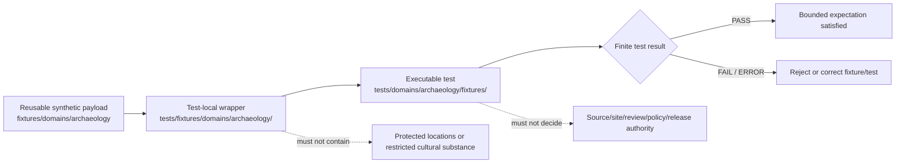

# `tests/fixtures/domains/archaeology/` — Archaeology Test-Local Fixture Routing and Sensitive-Domain Safety Boundary

> Repository-grounded parent contract for test-local Archaeology fixture wrappers. This subtree may organize small synthetic manifests and expectations owned by named tests, but it does not own reusable fixture payloads, executable tests, archaeology truth, source admission, site confirmation, cultural authority, protected geometry, policy decisions, release approval, or public artifacts.

<!-- [KFM_META_BLOCK_V2]
doc_id: kfm://doc/tests-fixtures-domains-archaeology-readme
title: tests/fixtures/domains/archaeology/README.md — Archaeology Test-Local Fixture Routing and Sensitive-Domain Safety Boundary
type: readme; directory-readme; test-local-fixture-parent; archaeology; sensitive-domain; routing-boundary; non-authoritative
version: v0.2
status: draft; repository-grounded; parent-plus-six-readme-only-children; tests-fixtures-parent-confirmed; domains-parent-index-absent; executable-fixture-test-parent-confirmed; reusable-fixture-root-confirmed; child-maturity-mixed; direct-payloads-unestablished; direct-executable-tests-unestablished; ci-unestablished; deny-by-default; non-authoritative
owners: OWNER_TBD — Archaeology steward · Test/QA steward · Fixture steward · Source steward · Site-identity steward · GIS/geoprivacy steward · Review steward · Cultural-review liaison · Sovereignty/CARE reviewer · Rights-holder representative · Contract/schema steward · Evidence steward · Policy steward · Release steward · Correction/rollback steward · Security reviewer · CI steward · Docs steward
created: 2026-07-06
updated: 2026-07-16
supersedes: v0.1 Archaeology test-fixture parent index
policy_label: public-doc; tests; fixtures; archaeology; parent-boundary; test-local-only; synthetic-only; no-network-default; deny-by-default; source-role-fixed; candidate-not-confirmed; component-not-site; exact-location-denied; cultural-authority-deferred; consent-not-inferred; evidence-required; review-gated; policy-gated; release-subordinate; correction-aware; revocation-aware; rollback-aware; no-publication
current_path: tests/fixtures/domains/archaeology/README.md
truth_posture:
  CONFIRMED:
    - target README v0.1 and prior blob
    - tests/fixtures parent README and test-local fixture-home rule
    - tests/fixtures/domains/README.md absent at the checked path
    - six child README lanes: api, promotion, review, sensitive_geometry, sites, and source
    - all six child lanes are repository-grounded v0.2 and README-only in bounded evidence
    - tests/domains/archaeology/fixtures parent v0.2 is the executable fixture-test parent
    - only source_admission is confirmed as a direct child under the executable fixture-test parent
    - fixtures/domains/archaeology is the observed reusable Archaeology fixture root
    - reusable fixture parent reports partial README coverage and unverified payload inventory
    - direct parent-level conftest.py, manifest_expectations.json, and representative test module are absent at named paths
    - Makefile fixtures target is TODO and default test target excludes this subtree
    - domain-archaeology workflow jobs are TODO-only echo scaffolds
  PROPOSED:
    - this parent owns routing, admission criteria, common wrapper invariants, child indexes, manifest expectations, consumer-backlink rules, finite outcomes, maintenance, migration, and rollback guidance
    - child wrappers carry only test-local deltas and refer to reusable fixtures where possible
    - executable tests consume wrappers by reference from owning tests lanes
  CONFLICTED:
    - v0.1 claim that tests/fixtures/README.md was absent
    - v0.1 language implying executable checks could live inside this fixture subtree
    - tests/fixtures/domains/ parent index remains absent while this domain parent and root fixture parent exist
    - rich child documentation versus README-only direct inventories
    - reusable fixture READMEs and planned-file payload names versus unverified or placeholder payload semantics
    - source schema, fixture-root, and registry-path drift
    - Site versus ArchaeologicalSite and Feature versus CandidateFeature/SiteComponent drift
    - review disposition and schema-vocabulary drift
    - public-safe fixture-home duplication and sensitivity profile/receipt scaffolding
  UNKNOWN:
    - exhaustive recursive payload inventory, ignored/generated files, dynamic fixture generation, and external fixture stores
    - active consumer tests and two-way backlinks
    - accepted wrapper manifest schema and reason-code registry
    - current pass rates, branch-protection significance, retained CI artifacts, production consumers, and release dependency
  NEEDS_VERIFICATION:
    - accepted owners and CODEOWNERS
    - whether tests/fixtures/domains/README.md should be created
    - exact threshold for test-local versus reusable fixture placement
    - canonical fixture IDs, versions, hashes, vocabularies, and generation receipts
    - substantive child payloads and executable consumers
    - no-network, no-write, no-leak, orphan, and nonempty-coverage enforcement
    - policy, cultural review, correction, revocation, invalidation, and rollback execution
evidence_snapshot:
  repository: bartytime4life/Kansas-Frontier-Matrix
  repository_id: "1059091169"
  visibility: public
  base_ref: main
  base_commit: da40c9b4e55b2851556ec19ca57e40af41203a6a
  target_prior_blob: 34b8aa536aa19c234f30f939ed1c06fa428b57dc
  related_repository_blobs:
    directory_rules: 2affb080e6f0043867c64c7f06c1ca52030fbd55
    tests_fixtures_parent: 2d0147e85eae86f687e85c5bea0d3e61f9c3a8f7
    executable_fixture_test_parent: af53341811d0f7710a0b4e78651f62b8fbaf5b0d
    reusable_archaeology_fixture_parent: ab348d4a5345d52cb0999072138e7c0feb63e8f1
    api_child: 054905beab4e847588569d3306f56a71e9a1c48e
    promotion_child: e16733aa226e5eb24f09225e64bc920cbb0b32a3
    review_child: ae305821f112832d0613e1c5eb190113c89d20f0
    sensitive_geometry_child: 9119f4db4cb42e8ff0d00baad449235a6d392536
    sites_child: a4b63f42db7aac57f471147bf3d6f264adb9d66d
    source_child: 366deb7a3ee93c8607e1632d5fbb7ec9ed9afb96
    makefile: 4dc8cf633581893d83fba53219c6ea847992e6be
    domain_archaeology_workflow: b6a2869314efe2e34890baa5bbbe41d656629dd3
  direct_lane_files_confirmed:
    - tests/fixtures/domains/archaeology/README.md
    - tests/fixtures/domains/archaeology/api/README.md
    - tests/fixtures/domains/archaeology/promotion/README.md
    - tests/fixtures/domains/archaeology/review/README.md
    - tests/fixtures/domains/archaeology/sensitive_geometry/README.md
    - tests/fixtures/domains/archaeology/sites/README.md
    - tests/fixtures/domains/archaeology/source/README.md
  checked_absent_paths:
    - tests/fixtures/domains/README.md
    - tests/fixtures/domains/archaeology/conftest.py
    - tests/fixtures/domains/archaeology/manifest_expectations.json
    - tests/fixtures/domains/archaeology/test_parent_fixture_manifest_shape.py
notes:
  - "v0.2 corrects stale parent-presence claims and records the six current child lanes as repository-grounded README-only routing surfaces."
  - "This subtree owns test-local wrappers and expectation manifests, not executable tests or reusable payloads."
  - "The executable fixture-test parent is tests/domains/archaeology/fixtures/; the reusable payload parent is fixtures/domains/archaeology/."
  - "No child README proves payload inventory, active consumers, policy execution, or current pass rates."
  - "This revision changes documentation only and creates no fixture payload, test, schema, contract, policy, validator, workflow, source record, site record, review record, receipt, proof, release record, map artifact, API behavior, AI output, or public artifact."
[/KFM_META_BLOCK_V2] -->

<a id="top"></a>

<p>
  
  
  
  
  
  
  
</p>

> [!IMPORTANT]
> **This is the test-local wrapper parent.** Reusable payloads belong under [`fixtures/domains/archaeology/`](../../../../fixtures/domains/archaeology/README.md). Executable fixture tests belong under [`tests/domains/archaeology/fixtures/`](../../../domains/archaeology/fixtures/README.md). This subtree should contain only small wrappers, expectation manifests, and routing documentation owned by named tests.

> [!CAUTION]
> **README presence is not fixture coverage.** All six child lanes are README-only in bounded evidence. A child name, illustrative manifest, proposed command, or green workflow does not prove payload inventory, consumers, enforcement, or safe publication.

> [!WARNING]
> **Archaeology is sensitive by default.** Exact site coordinates, burial or human-remains context, sacred or culturally restricted places, collection-security information, looting-risk detail, private-landowner geometry, restricted oral history, sovereignty-bearing knowledge, and reverse-engineerable derivatives must not appear in fixture payloads, fixture names, snapshots, assertion messages, logs, reports, or CI artifacts.

**Quick navigation:** [Status](#status-and-evidence-boundary) · [Purpose](#purpose-and-audience) · [Authority](#authority-and-directory-rules-basis) · [Surfaces](#three-fixture-and-test-surfaces) · [Children](#confirmed-child-lane-index) · [Responsibilities](#parent-responsibilities-and-non-responsibilities) · [Flow](#fixture-routing-flow) · [Placement](#fixture-home-decision-law) · [Admission](#child-lane-and-wrapper-admission-contract) · [Manifest](#minimum-parent-and-child-manifest-contract) · [Consumers](#consumer-backlinks-orphans-and-nonempty-coverage) · [Invariants](#shared-archaeology-fixture-invariants) · [Authority separation](#object-and-authority-separation) · [Outcomes](#finite-outcomes-and-vocabulary-separation) · [Sensitivity](#sensitivity-cultural-authority-and-rights) · [Source](#source-and-watcher-boundary) · [Sites](#site-candidate-and-component-boundary) · [Review](#review-consultation-and-consent-boundary) · [Geometry](#geometry-transform-profile-and-receipt-boundary) · [Promotion](#promotion-release-correction-and-rollback-boundary) · [API/Map/AI](#api-map-export-cache-and-ai-boundary) · [Security](#no-network-security-and-side-effects) · [Determinism](#identity-version-hash-generation-and-replay) · [Cases](#parent-case-matrix) · [Maturity](#current-maturity-and-drift-matrix) · [Commands](#validation-commands) · [CI](#ci-and-promotion-boundary) · [Failures](#failure-interpretation) · [Passing](#what-passing-does-not-prove) · [Maintenance](#maintenance-migration-and-deprecation) · [Done](#definition-of-done) · [FAQ](#faq) · [Open](#open-verification-register) · [Evidence](#evidence-ledger) · [Rollback](#documentation-correction-and-rollback)

---

## Status and evidence boundary

> [!IMPORTANT]
> **Evidence snapshot:** `main@da40c9b4e55b2851556ec19ca57e40af41203a6a`
> **Prior target blob:** `34b8aa536aa19c234f30f939ed1c06fa428b57dc`
> **Direct subtree:** this parent plus six child READMEs
> **Direct payloads:** not established
> **Direct executable tests:** not established
> **Higher parent:** `tests/fixtures/README.md` exists; `tests/fixtures/domains/README.md` was not found

### Safe conclusion

`tests/fixtures/domains/archaeology/` is a valid test-local fixture routing surface under the `tests/` responsibility root. It documents where wrappers belong and which boundaries all Archaeology fixture examples must preserve.

It is not:

- a reusable fixture corpus;
- an executable test suite;
- a source registry or source-admission queue;
- an ArchaeologicalSite or candidate store;
- a review, consultation, or consent record store;
- a sensitivity profile or redaction implementation;
- an evidence, receipt, policy, promotion, release, correction, or rollback authority;
- an API, map, tile, export, graph, cache, or AI output surface.

### Current direct inventory

```text
tests/fixtures/domains/archaeology/
├── README.md
├── api/
│   └── README.md
├── promotion/
│   └── README.md
├── review/
│   └── README.md
├── sensitive_geometry/
│   └── README.md
├── sites/
│   └── README.md
└── source/
    └── README.md
```

The tree above is a bounded readback of the checked snapshot. It does not prove permanent absence of ignored, generated, branch-local, dynamic, external, or differently named files.

[Back to top](#top)

---

## Purpose and audience

This parent serves maintainers who need to:

- decide whether a fixture belongs in a test-local wrapper lane or a reusable fixture root;
- discover the six current Archaeology wrapper lanes;
- preserve common sensitive-domain constraints across child documentation;
- require named consumers and two-way fixture/test traceability;
- prevent README-only or placeholder lanes from being presented as implemented coverage;
- coordinate migration without creating parallel fixture, contract, schema, policy, registry, or release authority.

The durable question is:

> Can a small synthetic Archaeology wrapper help a named test exercise a bounded behavior without becoming source truth, site truth, cultural authority, protected-location disclosure, evidence closure, policy approval, release approval, or public output?

A passing wrapper check means only that the named test expectation behaved as specified for the pinned synthetic input.

[Back to top](#top)

---

## Authority and Directory Rules basis

Directory Rules state that placement encodes responsibility. The current split is:

| Responsibility | Current or proposed home | This parent’s relationship |
|---|---|---|
| Test-local wrappers and expectation manifests | `tests/fixtures/domains/archaeology/` | Owned here. |
| Executable Archaeology fixture-safety tests | `tests/domains/archaeology/fixtures/` | Consumes wrappers; separate authority. |
| Reusable Archaeology payloads | `fixtures/domains/archaeology/` | Shared fixture corpus; separate authority. |
| Object meaning | `contracts/` | Referenced, never redefined here. |
| Machine shape | `schemas/` | Referenced, never redefined here. |
| Source/rights/sensitivity/admissibility policy | `policy/` | Decides obligations; fixtures do not. |
| Source registry records | accepted `data/registry/` layout | Real instances; never copied here. |
| Evidence and process memory | `data/proofs/`, `data/receipts/` | Trust support; fixtures use toy refs only. |
| Promotion/release/correction/rollback | `release/` | Publication authority; fixtures do not approve. |
| Runtime API/map/AI implementation | implementation roots | Tested indirectly; never implemented here. |

This README does not resolve the absent `tests/fixtures/domains/README.md` index, schema-path conflicts, registry-path conflicts, object-name conflicts, or public-safe fixture-home conflicts. Those remain visible until accepted migration or ADR decisions exist.

[Back to top](#top)

---

## Three fixture and test surfaces

```text
reusable payload
fixtures/domains/archaeology/
        │
        │ referenced by
        ▼
test-local wrapper
tests/fixtures/domains/archaeology/<lane>/
        │
        │ consumed by
        ▼
executable test
tests/domains/archaeology/fixtures/<lane>/
```

| Surface | Owns | Must not own | Current checked maturity |
|---|---|---|---|
| Reusable fixture root | Shared synthetic payloads and reusable valid/invalid examples. | Test implementation, truth, policy, release. | Parent and child READMEs exist; payload inventory remains partial or unverified. |
| This test-local subtree | Small wrappers, manifests, parametrization maps, expected reason codes, and routing docs. | Reusable corpus, executable tests, authority records. | Parent plus six child READMEs; no direct payloads established. |
| Executable fixture-test subtree | Tests that load fixtures and prove behavior. | Reusable payload authority, production decisions. | Parent v0.2 and `source_admission/` child; executable coverage unestablished. |

A wrapper is justified only when it adds a test-local expectation that does not belong in the reusable payload itself.

[Back to top](#top)

---

## Confirmed child lane index

All child lanes below are **CONFIRMED README / README-only direct inventory / executable consumer coverage unestablished**.

| Lane | Durable responsibility | Confirmed maturity signals | Principal boundary |
|---|---|---|---|
| [`api/`](api/README.md) | Request/response, Evidence Drawer, Focus Mode, layer, and decision-envelope wrappers. | No Archaeology-specific route implementation or direct fixture payload was established. | API-shaped data is not API implementation or public release. |
| [`promotion/`](promotion/README.md) | PromotionDecision, promotion receipt, release-gate, correction, withdrawal, and rollback wrappers. | PromotionDecision contract/schema/validator exist; PromotionReceipt and direct consumer suite remain unestablished. | Fixture success is not promotion or release approval. |
| [`review/`](review/README.md) | StewardReview, CulturalReview, ReviewRecord, obligations, and authority-state wrappers. | Reusable approve/deny files are placeholders; domain review schemas are permissive; generic validator is stubbed. | Fixture labels do not prove review, consultation, consent, or cultural authority. |
| [`sensitive_geometry/`](sensitive_geometry/README.md) | Geometry denial, generalization, transform, receipt, map/tile, cache, and reconstruction-risk wrappers. | SpatialGeometry shape exists but validator is stubbed; transform/receipt schemas and profile catalog are scaffolded. | Styling or filenames are not geoprivacy or safe release. |
| [`sites/`](sites/README.md) | ArchaeologicalSite, CandidateFeature, SiteComponent, withheld-detail, and public-carrier wrappers. | Reusable site/candidate JSON files are placeholders; primary site-family schemas are permissive; naming conflicts remain. | Candidate, component, and compatibility names do not become confirmed site truth. |
| [`source/`](source/README.md) | SourceDescriptor, activation, rights, role, watcher, quarantine, stale, and registry-reference wrappers. | Generic SourceDescriptor shape/validator/fixtures exist; positive case is Hydrology; activation shape remains placeholder-only. | Descriptor or watcher metadata is not admission, activation, evidence, or release. |

Child READMEs may be more detailed than this index. This parent should link to them rather than duplicate their full object-specific contracts.

[Back to top](#top)

---

## Parent responsibilities and non-responsibilities

### This parent owns

- the child-lane index;
- the three-surface routing law;
- shared synthetic, no-network, no-write, no-leak, and non-authority rules;
- the threshold for accepting test-local wrappers once governance approves it;
- parent manifest expectations;
- consumer backlinks, orphan checks, nonempty coverage, and vacuous-pass controls;
- common finite-outcome and reason-code separation;
- maintenance, migration, correction, deprecation, and rollback instructions;
- explicit UNKNOWN and NEEDS VERIFICATION registers.

### This parent does not own

- fixture payload semantics already owned by contracts and schemas;
- executable test code;
- source, site, candidate, review, policy, evidence, receipt, or release records;
- runtime APIs, map layers, tiles, exports, graph projections, caches, or AI answers;
- cultural authority, consent, consultation, or rights decisions;
- protected data or reconstruction parameters;
- canonical migration decisions for disputed paths or vocabularies.

[Back to top](#top)

---

## Fixture routing flow



The diagram is a routing model, not proof that all payloads, child executable lanes, validators, CI jobs, or release gates exist.

[Back to top](#top)

---

## Fixture-home decision law

Use the smallest correct home:

1. **Reusable across multiple tests, validators, or pipelines?** Use an accepted `fixtures/` lane.
2. **Owned by one test area and adds only local expectations or parameters?** A `tests/fixtures/` wrapper may be appropriate.
3. **Contains executable assertions or helper code?** Use the owning `tests/` lane.
4. **Carries real source, registry, evidence, review, policy, receipt, release, or lifecycle state?** Use the owning governed root, not fixtures.
5. **Contains protected Archaeology content?** Do not place it in repository fixtures; deny, quarantine, generalize, or use conspicuous synthetic canaries.
6. **Duplicates another fixture?** Reject unless a migration note explains source, destination, checksum, consumers, compatibility period, and rollback.

A topic match is not sufficient. Responsibility and lifecycle determine placement.

[Back to top](#top)

---

## Child-lane and wrapper admission contract

A new child lane requires:

- a distinct test-local responsibility not already covered by an existing child;
- at least one named proposed or confirmed executable consumer;
- a clear reusable fixture relationship;
- an explicit non-authority statement;
- synthetic/public-safe input constraints;
- positive and fail-closed case requirements;
- finite outcomes and safe reason-code expectations;
- no-network, no-governed-root-write, and no-sensitive-output rules;
- owner and migration/rollback expectations;
- parent index update.

A wrapper file belongs here only when:

- it is owned by a named test;
- it is too local to be a reusable fixture;
- it contains no real payload, credential, endpoint secret, protected location, restricted cultural substance, or production trust artifact;
- it pins its reusable fixture, schema, policy/profile, and expected outcome where applicable;
- it declares prohibited claims and side effects;
- it has a two-way consumer backlink;
- removal cannot change runtime, registry, policy, release, or public state.

README-only children remain routing surfaces until those conditions are met by real payloads and consumers.

[Back to top](#top)

---

## Minimum parent and child manifest contract

The example below is **PROPOSED** and intentionally contains no real Archaeology information.

```json
{
  "fixture_manifest_id": "kfm://fixture-test/archaeology/example",
  "fixture_version": "v1",
  "domain": "archaeology",
  "fixture_scope": "test_local",
  "fixture_authority": "non_authoritative",
  "synthetic": true,
  "child_lane": "sites",
  "consumer_refs": [
    "tests/domains/archaeology/fixtures/sites/test_candidate_not_site.py"
  ],
  "canonical_fixture_ref": "fixtures/domains/archaeology/synthetic_candidate_feature/example.json",
  "object_family": "CandidateFeature",
  "source_role": "fixture_only",
  "object_posture": "candidate_not_confirmed",
  "geometry_posture": "withheld_or_generalized",
  "contains_exact_geometry": false,
  "contains_reconstruction_hint": false,
  "contains_restricted_cultural_content": false,
  "evidence_ref": "evidence-ref:fixture:archaeology-example",
  "review_ref": null,
  "policy_decision_ref": null,
  "release_manifest_ref": null,
  "rollback_card_ref": "rollback-card:fixture:archaeology-example",
  "expected_test_outcome": "PASS",
  "expected_domain_outcome": "ABSTAIN",
  "reason_code": "ARCHAEOLOGY_FIXTURE_DOES_NOT_AUTHORIZE_TRUTH_OR_RELEASE",
  "must_not_claim": [
    "SOURCE_ADMITTED",
    "SITE_CONFIRMED",
    "CULTURAL_AUTHORITY_GRANTED",
    "EXACT_LOCATION_PUBLIC",
    "REVIEW_COMPLETE",
    "POLICY_ALLOWED",
    "RELEASED",
    "MAP_TRUTH",
    "AI_TRUTH"
  ]
}
```

Future schema work must settle:

- identity, version, digest, generator, and supersession fields;
- child-lane and object-family vocabularies;
- source-role, candidate/site, geometry, review, policy, and release states;
- test outcomes versus domain outcomes;
- reason codes, obligations, and prohibited claims;
- correction, withdrawal, revocation, invalidation, and rollback references.

[Back to top](#top)

---

## Consumer backlinks, orphans, and nonempty coverage

Mature fixture coverage requires two-way traceability:

```text
wrapper manifest -> executable consumer
executable consumer -> wrapper manifest
```

Required checks:

- every wrapper names at least one active consumer;
- every consumer reference resolves;
- every child lane has a declared owner;
- reusable fixtures are referenced rather than copied;
- every consequential family has at least one positive and one fail-closed case;
- placeholder-only payloads do not count as semantic coverage;
- README-only lanes do not count as payload or executable coverage;
- zero collected cases is a failure, not a green result;
- skipped cases carry reason, owner, and expiry;
- orphaned wrappers and unused reusable fixtures are reported;
- child indexes and parent indexes remain synchronized.

A parent-level dashboard or manifest may summarize counts later, but counts without consumer resolution are not proof.

[Back to top](#top)

---

## Shared Archaeology fixture invariants

Every child must preserve these invariants:

| Invariant | Required behavior | Default failure |
|---|---|---|
| Synthetic identity | Use conspicuous fake IDs and non-authority markers. | Reject fixture. |
| Fixture-home integrity | Test-local wrappers and reusable payloads remain separate. | Block admission. |
| Source-role integrity | Role cannot be silently upgraded downstream. | `DENY` or `ABSTAIN`. |
| Candidate/site integrity | Candidate is not site; component is not whole site. | `DENY` or `ABSTAIN`. |
| Protected-location denial | No real or reconstructable sensitive geometry. | Reject and escalate. |
| Cultural-authority deferral | KFM records and defers to named authority. | Hold or deny. |
| Consent/consultation non-inference | Labels and synthetic refs do not prove process. | Hold or deny. |
| Evidence separation | EvidenceRef must resolve in governed contexts; fixture ref is not proof. | `ABSTAIN`. |
| Review separation | Fixture or schema pass is not review approval. | Block consequential use. |
| Policy separation | Fixture metadata is not a PolicyDecision. | Block consequential use. |
| Receipt separation | Example receipt shape is not process memory. | Block promotion/release. |
| Release separation | Fixture success is not release or publication approval. | Promotion block. |
| No-network | Default tests use local synthetic inputs only. | `ERROR`. |
| No governed-root writes | Tests write only to test-owned temporary locations. | `ERROR`. |
| Deterministic replay | Same inputs and pins yield the same bounded result. | Fail test. |
| Correction/rollback | Superseded or withdrawn fixtures invalidate consumers. | Fail test and block release. |

[Back to top](#top)

---

## Object and authority separation

Do not collapse these families:

| Family | Fixture may model | Fixture must not become |
|---|---|---|
| SourceDescriptor / activation | Synthetic governance metadata and expected decisions. | Registry admission, connector activation, source truth. |
| CandidateFeature | Candidate posture and uncertainty. | Confirmed ArchaeologicalSite. |
| SiteComponent | Bounded component relationship. | Whole-site identity or proof. |
| ArchaeologicalSite | Synthetic reviewed-site-shaped envelope. | Real site record or exact-location authority. |
| StewardReview / CulturalReview / ReviewRecord | Expected shape and obligations. | Consultation, consent, cultural authority, or release approval. |
| SpatialGeometry / transforms / receipts | Synthetic shape, denial, or expected transformation metadata. | Protected geometry, real transform, or valid receipt. |
| PromotionDecision / ReleaseManifest | Expected gate behavior. | Promotion, release, or publication authority. |
| API/map/AI carrier | Public-safe expected response or denial. | Runtime route, map truth, or authoritative generated answer. |
| EvidenceBundle / receipts | Toy refs and failure expectations. | Real proof or process memory. |

Adapters among families must be explicit, versioned, and tested.

[Back to top](#top)

---

## Finite outcomes and vocabulary separation

Do not force unrelated states into one enum.

| Vocabulary | Example values | Owner |
|---|---|---|
| Test result | `PASS`, `FAIL`, `SKIP`, `ERROR` | Test framework |
| Policy result | `ALLOW`, `RESTRICT`, `HOLD`, `DENY`, `ABSTAIN`, `ERROR` | Policy |
| Candidate state | intake, retained, rejected, promoted, quarantined, superseded | Archaeology domain |
| Review disposition | Domain- or governance-specific controlled values | Review contract |
| Promotion decision | promote, hold, deny, or accepted controlled vocabulary | Promotion contract |
| Release state | candidate, released, deprecated, withdrawn | Release |
| Lifecycle state | RAW, WORK, QUARANTINE, PROCESSED, CATALOG, TRIPLET, PUBLISHED | Lifecycle |
| Fixture posture | valid, invalid, denied, abstention, error, correction, rollback | Fixture/test contract |

Every adapter must define source value, destination value, loss behavior, unknown handling, reason code, and test coverage. Unknown values fail closed.

[Back to top](#top)

---

## Sensitivity, cultural authority, and rights

Fixtures must never contain:

- real coordinates, precise footprints, recognizable geometry, parcel clues, road-distance clues, imagery joins, or reconstruction hints;
- burial, human-remains, sacred-place, collection-security, looting-risk, private-owner, or culturally restricted substance;
- real consultation records, consent records, reviewer notes, community identities, or rights-holder communications;
- credentials, private endpoints, restricted source terms, production logs, or secret names.

Synthetic refs may test that these records are required. They do not prove that the records exist or that authority was granted.

Unknown rights, noassertion, denied rights, permission-required rights, stale terms, unresolved cultural authority, or unverified sensitivity fail closed. Safe outcomes are bounded hold, deny, abstain, quarantine, or error decisions under pinned policy.

[Back to top](#top)

---

## Source and watcher boundary

The [`source/`](source/README.md) child must preserve:

- SourceDescriptor is governance metadata, not source truth;
- SourceActivationDecision is distinct from descriptor shape and remains unestablished at the checked contract/schema paths;
- generic SourceDescriptor validation is not Archaeology admission coverage;
- watcher/source-head metadata is observation only;
- unchanged, changed, stale, retired, withdrawn, and superseded states remain distinct;
- a watcher cannot admit, activate, ingest, promote, release, or publish;
- registry path placement cannot imply admission;
- rights, sensitivity, cultural review, source role, evidence, and policy remain separate gates.

Source payloads and real registry records never belong in this subtree.

[Back to top](#top)

---

## Site, candidate, and component boundary

The [`sites/`](sites/README.md) child must preserve:

- `CandidateFeature` is not `ArchaeologicalSite`;
- `SiteComponent` is not the full site;
- the short-name `Site` contract is compatibility/lineage only in current object-map evidence;
- ambiguous `Feature` vocabulary must resolve explicitly to candidate or component;
- filenames such as `valid`, `deny`, or `generalized` do not prove semantics;
- permissive schema acceptance is not site confirmation;
- public-safe fixture-home conflicts remain visible until migrated;
- no map symbol, label, popup, export, search result, graph edge, or generated sentence can upgrade candidate status.

[Back to top](#top)

---

## Review, consultation, and consent boundary

The [`review/`](review/README.md) child must preserve:

- StewardReview, CulturalReview, and generic ReviewRecord remain distinct unless an accepted adapter maps them;
- placeholder filenames such as `approve.json` or `deny.json` do not prove an outcome;
- schema acceptance is not review completion;
- reviewer identity, consultation, consent, rights-holder authority, and cultural authority are never inferred;
- disposition, decision, obligation, and reason-code vocabularies remain pinned and explicit;
- separation of duties remains visible;
- corrections, withdrawals, revocations, and supersession invalidate dependent fixtures and expected outputs.

No real review or consultation substance belongs in fixtures.

[Back to top](#top)

---

## Geometry, transform, profile, and receipt boundary

The [`sensitive_geometry/`](sensitive_geometry/README.md) child must preserve:

- protected geometry is absent, not merely hidden by style;
- a SpatialGeometry shape pass does not prove safe semantics;
- generalization filenames do not prove a transform occurred;
- a named profile must resolve to an accepted policy-controlled profile;
- transform parameters must not enable reconstruction;
- SensitivityTransform, PublicationTransformReceipt, and RedactionReceipt remain separate objects;
- placeholder or permissive schemas do not prove closure;
- tiles, bounds, counts, labels, screenshots, cache keys, errors, exports, graph relations, and AI summaries are side channels;
- correction, revocation, cache invalidation, and rollback must propagate to every public carrier.

Unknown profile or receipt state fails closed.

[Back to top](#top)

---

## Promotion, release, correction, and rollback boundary

The [`promotion/`](promotion/README.md) child must preserve:

- promotion is a governed state transition, not a file move;
- PromotionDecision shape validation is not promotion approval;
- PromotionReceipt and ReleaseManifest remain separate;
- evidence, rights, sensitivity, review, policy, transform/receipt, integrity, correction, and rollback closure remain required;
- fixture success cannot publish;
- release candidates remain distinct from released artifacts;
- withdrawal, supersession, and revocation disable stale carriers;
- rollback points to a known prior safe state and preserves audit history.

A documentation or CI pass cannot waive a missing gate.

[Back to top](#top)

---

## API, map, export, cache, and AI boundary

The [`api/`](api/README.md) child and all public-carrier wrappers must prove:

- normal clients use governed interfaces or released artifacts;
- no direct RAW, WORK, QUARANTINE, PROCESSED, registry, proof, receipt, or release-store reads;
- exact/internal geometry does not reach ordinary clients;
- candidate posture remains visible in responses, maps, labels, legends, popups, search, exports, graphs, and generated text;
- Evidence Drawer or citation refs do not become evidence themselves;
- cache keys and cached values honor release, correction, withdrawal, and rollback state;
- screenshots and exports are treated as publication surfaces;
- AI retrieves evidence and policy context before answering;
- generated language cannot become evidence, review, policy, release, or cultural authority;
- denied and abstained states expose safe reason codes without sensitive detail.

[Back to top](#top)

---

## No-network, security, and side effects

Default fixture execution is hermetic:

- no live source APIs, connectors, watchers, geocoders, map/tile services, public APIs, archives, databases, file shares, cloud buckets, or AI runtimes;
- no direct reads from lifecycle, registry, catalog, proof, receipt, release, or published stores;
- no writes outside test-owned temporary directories;
- no credentials, private endpoints, production logs, or telemetry;
- bounded input size and recursion depth;
- safe parsing of untrusted text and structured data;
- sanitized diagnostics with no protected identifiers or payload excerpts;
- stable timeout and resource limits;
- explicit cleanup of temporary artifacts.

Any unknown network or governed-root write behavior is `ERROR` and fails closed.

[Back to top](#top)

---

## Identity, version, hash, generation, and replay

Every substantive wrapper should eventually record:

- stable fixture ID and version;
- child lane and object family;
- reusable fixture reference and immutable digest;
- schema/contract/policy/profile versions;
- generator name and version, or hand-authored declaration;
- deterministic seed and clock posture where material;
- expected test and domain outcomes;
- safe reason code and obligations;
- consumer refs;
- supersedes/superseded-by refs;
- correction, withdrawal, revocation, and rollback refs;
- content hash and manifest hash.

Hashes must never encode or leak restricted content. Replay success proves deterministic reproduction of the fixture, not real-world truth.

[Back to top](#top)

---

## Parent case matrix

| Case family | Parent expectation | Required failure example |
|---|---|---|
| Child inventory | All confirmed child READMEs indexed exactly once. | Missing, duplicate, or stale child index entry. |
| Fixture placement | Wrapper and reusable payload homes are distinct. | Copied payload or executable file in wrapper lane. |
| Consumer linkage | Every wrapper has a live consumer backlink. | Orphan wrapper or unresolved test ref. |
| Nonempty coverage | Consequential child has positive and fail-closed cases. | Zero cases, README-only, or placeholder-only coverage reported as green. |
| Source role | Role remains bounded. | Downstream upcast from candidate/context/fixture role. |
| Candidate/site | Candidate/component remains distinct from site. | Label, map, API, or AI upgrades status. |
| Rights/cultural authority | Explicit synthetic required refs. | Consent, consultation, or authority inferred. |
| Geometry | Withheld/generalized synthetic posture. | Exact, reconstructable, or side-channel detail. |
| Review | Pinned synthetic decision/obligation vocabulary. | Filename or permissive schema treated as approval. |
| Promotion/release | All gate refs present in expected allow-like case. | Fixture pass treated as promotion or release. |
| Public carrier | Governed/released synthetic output only. | Direct internal read or stale cache/export. |
| Correction/rollback | Invalidation reaches all dependent expectations. | Withdrawn fixture remains active. |
| Hermeticity | Local deterministic execution. | Network, external service, secret, or governed-root write. |
| Diagnostics | Safe finite reason codes. | Payload, protected ID, endpoint, token, or cultural detail in error output. |

[Back to top](#top)

---

## Current maturity and drift matrix

| Surface | Confirmed current posture | Open risk |
|---|---|---|
| This parent | v0.1 before this revision; six child links. | Stale parent claims and no machine-checkable inventory. |
| Six child lanes | Repository-grounded v0.2; README-only direct inventories. | Documentation can outrun payloads and consumers. |
| Higher test-fixture parent | Exists and defines test-local versus reusable split. | `tests/fixtures/domains/README.md` remains absent. |
| Executable fixture-test parent | v0.2 plus confirmed `source_admission/` child. | No direct executable fixture suite established. |
| Reusable Archaeology fixture parent | README and eight child READMEs. | Payload inventory partial/unverified; some named JSON files are placeholders. |
| Source | Detailed generic SourceDescriptor schema/validator/fixtures. | Archaeology semantics and activation decision remain unestablished; path drift exists. |
| Sites | Rich semantic contracts. | Primary schemas permissive; placeholder payloads and naming conflicts. |
| Review | Rich semantic contracts and generic schema family. | Domain schemas permissive; generic validator stub; vocabulary drift. |
| Sensitive geometry | Some concrete shape plus rich doctrine. | Validator/profile/receipt/transform enforcement scaffolded. |
| Promotion | PromotionDecision contract/schema/validator. | PromotionReceipt, direct payloads, policy runtime, and consumers unestablished. |
| API | Detailed fixture contract. | Archaeology-specific routes and direct payloads unestablished. |
| Makefile | `fixtures` target exists. | Target is TODO; default `test` excludes this subtree. |
| Archaeology workflow | Triggered on PR/push. | Jobs only echo TODO commands. |
| Branch protection | UNKNOWN. | Green optional checks may not gate promotion. |

The parent must preserve these differences instead of flattening all children into “implemented” or “missing.”

[Back to top](#top)

---

## Validation commands

### Confirmed inventory commands for a local checkout

```bash
find tests/fixtures/domains/archaeology -maxdepth 3 -type f | sort
find tests/domains/archaeology/fixtures -maxdepth 3 -type f | sort
find fixtures/domains/archaeology -maxdepth 3 -type f | sort
```

### Confirmed generic source shape command

```bash
python tools/validators/validate_source_descriptor.py --fixtures
```

That command validates generic SourceDescriptor fixtures. It does not prove Archaeology wrapper coverage.

### Proposed future executable command

```bash
python -m pytest tests/domains/archaeology/fixtures -q
```

This command is **PROPOSED / NEEDS VERIFICATION** until executable tests exist and collection behavior is confirmed.

A future parent runner must fail when:

- zero cases are collected;
- only READMEs or placeholders are present;
- child inventory and parent index diverge;
- wrappers lack consumers;
- reusable fixtures are duplicated;
- unknown vocabularies or unpinned schemas/policies occur;
- sensitive or reconstructable content is detected;
- network or governed-root writes occur.

[Back to top](#top)

---

## CI and promotion boundary

Current checked repository behavior:

- `make fixtures` prints a TODO message;
- `make test` runs only `tests/schemas` and `tests/contracts`;
- the `domain-archaeology` workflow checks out the repository and echoes TODO commands;
- no parent-level retained fixture inventory, no-leak report, orphan report, or coverage artifact was established;
- required-check and branch-protection status is UNKNOWN.

A future CI gate should emit a deterministic report containing:

- snapshot commit;
- child inventory;
- wrapper and consumer counts;
- reusable fixture refs and digest checks;
- positive/fail-closed counts by child;
- orphan and duplicate findings;
- sensitive-content and no-network findings;
- schema/policy/profile pins;
- finite outcomes and safe reason codes;
- correction/rollback checks;
- overall pass/fail status.

A green CI result remains subordinate to evidence, policy, review, promotion, release, correction, and rollback authority.

[Back to top](#top)

---

## Failure interpretation

| Failure | Meaning | Safe response |
|---|---|---|
| Parent/child index drift | Documentation inventory is unreliable. | Block promotion of fixture changes. |
| Wrapper has no consumer | Fixture is orphaned or speculative. | Reject or move to documented proposal. |
| Reusable payload copied locally | Fixture authority is drifting. | Remove duplicate and migrate refs. |
| Zero or placeholder-only cases | Coverage is vacuous. | Fail suite. |
| Unknown source/object/review/outcome value | Contract drift or unsupported value. | `ERROR`; fail closed. |
| Protected or reconstructable detail | Sensitive-content boundary failed. | Reject, remove, and escalate safely. |
| Missing evidence/review/policy/release refs | Consequential expected output unsupported. | `DENY` or `ABSTAIN`. |
| Network or governed-root write | Hermeticity failed. | `ERROR`; block. |
| Stale/superseded fixture still active | Invalidation failed. | Fail and block release use. |
| Unsafe diagnostics | Error channel leaks restricted content. | Suppress output and treat as security failure. |

Failures must be reproducible and safe to retain. Do not include restricted payload excerpts in reports.

[Back to top](#top)

---

## What passing does not prove

Passing wrapper and fixture tests do not prove:

- a source is admitted, active, reachable, or authoritative;
- a candidate or component is a confirmed archaeological site;
- a location, boundary, date, association, or interpretation is accurate;
- rights, consent, consultation, or cultural authority are current;
- review, policy, transform, receipt, promotion, or release gates are complete;
- an API route, map layer, tile, export, cache, graph, or AI answer is implemented or publishable;
- production correction, withdrawal, revocation, invalidation, or rollback has propagated;
- branch protection requires the checks;
- the repository contains a complete fixture corpus.

Passing proves only the named tests satisfied pinned expectations for synthetic inputs.

[Back to top](#top)

---

## Maintenance, migration, and deprecation

When changing this parent or a child:

1. inspect current parent, child, executable-test, and reusable-fixture inventories;
2. verify Directory Rules and relevant ADR/drift entries;
3. name the owner and consumers;
4. choose the smallest correct fixture home;
5. keep inputs synthetic and public-safe;
6. pin schema, contract, policy/profile, generator, and expected outcomes;
7. add positive and fail-closed cases;
8. update two-way backlinks;
9. run no-network, no-write, no-leak, orphan, duplicate, and nonempty checks;
10. update parent and child indexes together;
11. document correction, supersession, withdrawal, revocation, invalidation, and rollback effects.

Any path, filename, object-name, fixture-home, profile, or vocabulary consolidation requires:

- full inbound-reference and payload inventory;
- declared source and destination authority;
- checksums and consumer updates;
- compatibility period or explicit breaking-change notice;
- deprecation marker;
- migration receipt or note;
- rollback target;
- ADR when authority or compatibility changes materially.

Never silently move a fixture and infer that governance moved with it.

[Back to top](#top)

---

## Definition of done

This parent is not mature until all applicable items are satisfied.

- [ ] owners and CODEOWNERS are confirmed;
- [ ] the `tests/fixtures/domains/` parent decision is accepted;
- [ ] child-lane admission criteria are approved;
- [ ] a machine-checkable parent/child manifest contract exists;
- [ ] all child lanes have substantive payloads or are explicitly documentation-only;
- [ ] executable consumers and two-way backlinks exist;
- [ ] reusable fixture refs and digests are pinned;
- [ ] positive and fail-closed case families are nonempty;
- [ ] zero-case, placeholder-only, orphan, and duplicate checks fail closed;
- [ ] source-role and candidate/site/component anti-collapse tests pass;
- [ ] rights, cultural authority, consultation, consent, and review tests fail closed;
- [ ] protected-location, side-channel, and reconstruction tests pass;
- [ ] evidence, policy, transform/receipt, promotion, release, correction, and rollback closure is tested;
- [ ] no-network and no-governed-root-write controls are enforced;
- [ ] CI emits a retained deterministic report;
- [ ] required-check significance is verified;
- [ ] migration, correction, deprecation, and rollback instructions are current.

Until then, this README is a routing and safety contract, not proof of implemented fixture coverage.

[Back to top](#top)

---

## FAQ

### Why are there both `tests/fixtures/` and `fixtures/`?

The current parent contract assigns test-local wrappers to `tests/fixtures/` and reusable cross-cutting payloads to `fixtures/`. The split must remain explicit and duplication requires migration governance.

### Why are executable tests not stored beside these wrappers?

Executable assertions belong under an owning `tests/` lane. Keeping test code separate prevents a fixture directory from becoming a second implementation or authority surface.

### Does a v0.2 child README mean that child is implemented?

No. The six children are repository-grounded routing documents. Their direct payload and executable consumer coverage remains unestablished unless separate evidence says otherwise.

### Can an exact real location be used as a negative fixture?

No. Use conspicuous synthetic coordinates, fake cells, or non-geographic canaries. Negative tests must not store the sensitive material they are supposed to deny.

### Can a fixture include a real review, consent, or cultural-authority record?

No. It may include a toy reference that tests a required dependency, but real restricted process records remain in governed stores.

### Does a schema-valid fixture prove release readiness?

No. Shape validation is only one layer. Evidence, rights, sensitivity, review, policy, transformation/receipt, promotion, release, correction, and rollback remain separate.

[Back to top](#top)

---

## Open verification register

| ID | Question | Status |
|---|---|---|
| ARCH-FIX-PARENT-001 | Who owns this parent and which CODEOWNERS rule applies? | NEEDS VERIFICATION |
| ARCH-FIX-PARENT-002 | Should `tests/fixtures/domains/README.md` be created? | NEEDS VERIFICATION |
| ARCH-FIX-PARENT-003 | What exact rule separates test-local wrappers from reusable fixtures? | NEEDS VERIFICATION |
| ARCH-FIX-PARENT-004 | What schema defines parent and child manifests? | UNKNOWN |
| ARCH-FIX-PARENT-005 | What are canonical fixture ID, version, digest, and generator rules? | NEEDS VERIFICATION |
| ARCH-FIX-PARENT-006 | Which child lanes are permanent versus compatibility lanes? | NEEDS VERIFICATION |
| ARCH-FIX-PARENT-007 | Which child payload files currently exist and are substantive? | UNKNOWN |
| ARCH-FIX-PARENT-008 | Which executable tests consume each child? | UNKNOWN |
| ARCH-FIX-PARENT-009 | How are backlinks, orphans, and duplicate payloads enforced? | NEEDS VERIFICATION |
| ARCH-FIX-PARENT-010 | How does CI fail on zero or placeholder-only cases? | UNKNOWN |
| ARCH-FIX-PARENT-011 | Which source schema path and filename are canonical? | CONFLICTED |
| ARCH-FIX-PARENT-012 | Which SourceDescriptor fixture root is canonical? | CONFLICTED |
| ARCH-FIX-PARENT-013 | Which Archaeology source registry path is canonical? | CONFLICTED |
| ARCH-FIX-PARENT-014 | What contract/schema defines SourceActivationDecision? | UNKNOWN |
| ARCH-FIX-PARENT-015 | Is `ArchaeologicalSite` the final canonical site object name? | CONFLICTED / NEEDS VERIFICATION |
| ARCH-FIX-PARENT-016 | How is ambiguous `Feature` mapped to candidate or component? | CONFLICTED |
| ARCH-FIX-PARENT-017 | Which public-safe Archaeology fixture lane is canonical for each use? | CONFLICTED |
| ARCH-FIX-PARENT-018 | What adapter relates StewardReview, CulturalReview, and ReviewRecord? | NEEDS VERIFICATION |
| ARCH-FIX-PARENT-019 | What are canonical review decision, disposition, reason, and obligation vocabularies? | CONFLICTED |
| ARCH-FIX-PARENT-020 | Where is the accepted Archaeology sensitivity profile catalog? | UNKNOWN |
| ARCH-FIX-PARENT-021 | Which schemas/validators enforce transforms and receipts substantively? | NEEDS VERIFICATION |
| ARCH-FIX-PARENT-022 | What contract/schema defines PromotionReceipt? | UNKNOWN |
| ARCH-FIX-PARENT-023 | Which Archaeology-specific API routes and envelopes are implemented? | UNKNOWN |
| ARCH-FIX-PARENT-024 | How are cultural authority, rights, consent, and consultation represented safely? | NEEDS VERIFICATION |
| ARCH-FIX-PARENT-025 | How is watcher non-publisher behavior enforced? | NEEDS VERIFICATION |
| ARCH-FIX-PARENT-026 | What no-leak and reconstruction-risk suite is required? | UNKNOWN |
| ARCH-FIX-PARENT-027 | How are corrections, contradictions, and supersession propagated? | NEEDS VERIFICATION |
| ARCH-FIX-PARENT-028 | How are withdrawal, revocation, cache invalidation, and rollback propagated? | NEEDS VERIFICATION |
| ARCH-FIX-PARENT-029 | Which workflow produces the parent fixture report? | UNKNOWN |
| ARCH-FIX-PARENT-030 | Is any Archaeology fixture suite required by branch protection? | UNKNOWN |

[Back to top](#top)

---

## Evidence ledger

| Evidence | Status | Supports | Does not prove |
|---|---|---|---|
| Directory Rules | CONFIRMED doctrine | Responsibility-root placement and no parallel authority. | Current implementation maturity. |
| Target v0.1 README | CONFIRMED prior content | Existing purpose, child list, and safety intent. | Current parent accuracy or coverage. |
| `tests/fixtures/README.md` | CONFIRMED | Test-local versus reusable fixture split. | Domain-parent or child payload maturity. |
| `tests/fixtures/domains/README.md` check | CONFIRMED bounded absence | Named higher index was absent at the pinned ref. | Permanent or historical absence. |
| Six child READMEs | CONFIRMED v0.2 | Current child routing, drift, and safety contracts. | Payloads, consumers, pass rates, or policy execution. |
| `tests/domains/archaeology/fixtures/README.md` | CONFIRMED v0.2 | Executable fixture-test parent and three-surface split. | Executable coverage. |
| `fixtures/domains/archaeology/README.md` | CONFIRMED draft | Reusable fixture root and child index. | Complete or substantive payload inventory. |
| Child placeholder and scaffold evidence | CONFIRMED in child ledgers | Identifies vacuous-coverage and permissive-schema risks. | Permanent absence or final design. |
| Makefile | CONFIRMED | Current `fixtures` TODO and default test scope. | Future runner or branch protection. |
| `domain-archaeology` workflow | CONFIRMED TODO-only | Trigger and scaffold status. | Substantive validation or release gate. |
| Parent-level 404 checks | CONFIRMED bounded | Named manifest/harness/test files absent. | Exhaustive subtree absence. |
| Bounded repository search | CONFIRMED search | Parent plus six child README paths surfaced. | Ignored, generated, dynamic, external, or unindexed files. |

[Back to top](#top)

---

## Documentation correction and rollback

This is a documentation-only revision.

Before merge, rollback means leaving the draft pull request unmerged or adding a transparent revert commit. After merge, use a transparent revert commit or revert pull request; do not reset or force-push shared history.

Rollback is required if this README:

- is mistaken for fixture payload, test implementation, source/site/review/policy/evidence/release, or publication authority;
- directs executable tests into this fixture subtree;
- encourages storage of real source data, protected locations, restricted cultural substance, credentials, or production trust artifacts;
- treats README presence, filenames, placeholders, schema acceptance, map styling, or generated prose as semantic proof;
- collapses source, candidate, site, component, review, policy, receipt, promotion, release, or lifecycle states;
- silently selects a disputed path, object name, fixture home, profile, or vocabulary;
- weakens rights, cultural authority, consent, sensitivity, correction, revocation, invalidation, or rollback safeguards;
- hides README-only children, missing consumers, partial reusable payload inventory, TODO Makefile behavior, or TODO-only CI.

**No-loss assessment:** v0.2 preserves the v0.1 synthetic-only, no-network, source-role, candidate-not-confirmed, exact-location-denied, evidence, review, policy, promotion, release, correction, withdrawal, and rollback boundaries. It corrects stale parent-presence claims, separates the three fixture/test surfaces, indexes current v0.2 child evidence, removes any implication that executable tests belong in this subtree, exposes placeholder and drift risks, and makes future implementation and migration requirements inspectable.

[Back to top](#top)
