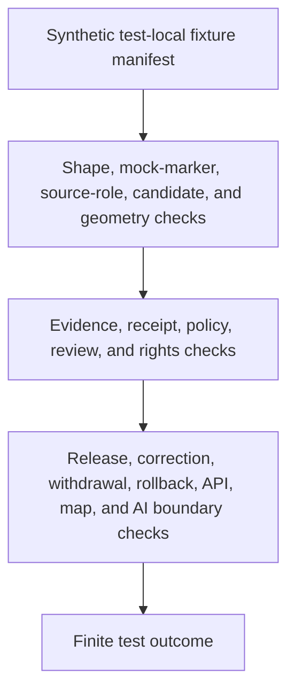

<!-- [KFM_META_BLOCK_V2]
doc_id: kfm://doc/tests-fixtures-domains-archaeology-readme
title: Archaeology Test Fixtures Parent README
type: test-fixture-parent-readme
version: v0.1
status: draft; empty-placeholder-replaced; archaeology-test-fixture-parent-index; PROPOSED / NEEDS VERIFICATION before promotion
owners:
  - OWNER_TBD - Archaeology domain steward
  - OWNER_TBD - Fixture steward
  - OWNER_TBD - QA steward
  - OWNER_TBD - Sensitivity steward
  - OWNER_TBD - Source steward
  - OWNER_TBD - Evidence steward
  - OWNER_TBD - Policy steward
  - OWNER_TBD - Release steward
created: 2026-07-06
updated: 2026-07-06
policy_label: public-doc; tests; fixtures; archaeology; parent-index; synthetic-only; no-network; deny-by-default; evidence-bound; policy-gated; review-gated; release-gated; rollback-aware
tags: [kfm, tests, fixtures, archaeology, parent-index, synthetic-fixtures, source-admission, sensitive-geometry, sites, api-fixtures, promotion-fixtures, review-fixtures, SourceDescriptor, SourceActivationDecision, EvidenceBundle, EvidenceRef, RedactionReceipt, PolicyDecision, ReviewRecord, ReleaseManifest, RollbackCard, ABSTAIN, DENY, ERROR]
related:
  - ../README.md
  - api/README.md
  - promotion/README.md
  - review/README.md
  - sensitive_geometry/README.md
  - sites/README.md
  - source/README.md
  - ../../../README.md
  - ../../../domains/archaeology/README.md
  - ../../../domains/archaeology/fixtures/README.md
  - ../../../domains/archaeology/fixtures/source_admission/README.md
  - ../../../../fixtures/domains/archaeology/README.md
  - ../../../../fixtures/domains/archaeology/site/README.md
  - ../../../../fixtures/domains/archaeology/synthetic_archaeological_site/README.md
  - ../../../../fixtures/domains/archaeology/synthetic_candidate_feature/README.md
  - ../../../../fixtures/domains/archaeology/synthetic_publication_transform_receipt/README.md
  - ../../../../fixtures/domains/archaeology/synthetic_steward_review/README.md
  - ../../../../docs/domains/archaeology/SOURCES.md
  - ../../../../docs/domains/archaeology/SOURCE_REGISTRY.md
  - ../../../../docs/domains/archaeology/CANONICAL_PATHS.md
  - ../../../../docs/domains/archaeology/SENSITIVITY.md
  - ../../../../docs/domains/archaeology/PUBLICATION_AND_POLICY.md
  - ../../../../docs/domains/archaeology/MAP_UI_CONTRACTS.md
  - ../../../../docs/domains/archaeology/OBJECT_FAMILIES.md
  - ../../../../contracts/domains/archaeology/
  - ../../../../schemas/contracts/v1/domains/archaeology/
  - ../../../../policy/domains/archaeology/
  - ../../../../release/candidates/archaeology/
notes:
  - "This README replaces the empty placeholder content at tests/fixtures/domains/archaeology/README.md."
  - "This lane is a parent index for test-local Archaeology fixture expectation lanes. Canonical reusable archaeology fixtures live under fixtures/domains/archaeology/ unless an ADR or parent README says otherwise."
  - "Parent indexes at tests/fixtures/README.md and tests/fixtures/domains/README.md were not found during current-session fetches. This README remains local to the archaeology subtree until those parents are authored."
  - "Confirmed child lanes during authoring are api/, promotion/, review/, sensitive_geometry/, sites/, and source/."
  - "This parent index is not source, fixture payload, contract, schema, policy, evidence, receipt, release, public artifact, map, API, package, pipeline, watcher, or AI authority."
  - "Executable tests, payload inventory, fixture schema bindings, harness wiring, CI jobs, and pass rates remain NEEDS VERIFICATION."
[/KFM_META_BLOCK_V2] -->

<a id="top"></a>

# Archaeology test fixtures

> Parent index for test-local Archaeology fixture expectation lanes under `tests/fixtures/domains/archaeology/`. This subtree documents synthetic fixture wrappers and expected test behavior without becoming the canonical fixture root or any form of archaeology authority.

<p>
  
  
  
  
  
  
</p>

**Path:** `tests/fixtures/domains/archaeology/README.md`  
**Status:** draft / empty placeholder replaced / Archaeology test-fixture parent index / PROPOSED until executable tests are verified  
**Owning root:** `tests/`  
**Lane family:** `fixtures/domains/archaeology`  
**Canonical reusable fixture root:** `fixtures/domains/archaeology/`  
**Default execution posture:** deterministic, synthetic, no-network, public-safe fixture envelopes only  
**Truth posture:** CONFIRMED target file existed as an empty placeholder before replacement; CONFIRMED `tests/fixtures/README.md` and `tests/fixtures/domains/README.md` were not found during current-session fetches; CONFIRMED child README lanes exist for `api/`, `promotion/`, `review/`, `sensitive_geometry/`, `sites/`, and `source/`; CONFIRMED canonical `fixtures/domains/archaeology/README.md` exists and says examples are not authoritative project records, source records, evidence, approvals, release state, or published artifacts; NEEDS VERIFICATION for executable tests, payload inventory, accepted schemas, fixture harnesses, CI coverage, and pass rates.

---

## Purpose

`tests/fixtures/domains/archaeology/` is the parent index for Archaeology test-local fixture expectation lanes.

This subtree should document how tests may use bounded synthetic fixture wrappers for API envelopes, promotion gates, review posture, sensitive geometry, site-shaped examples, and source-admission examples. It should help test authors avoid placing canonical fixtures, source data, protected detail, trust-bearing records, policy authority, release authority, map implementation, API implementation, or AI runtime outputs inside a test-fixture documentation lane.

A passing fixture check under this subtree should not mean that an archaeology claim is true, a site exists, a candidate is confirmed, a source is admitted, a location is public, a review occurred, policy allows release, a release manifest is valid, a map layer is published, or an AI answer is authoritative. It should mean only that a bounded synthetic fixture expectation behaved as designed.

[Back to top](#top)

---

## Placement Basis

Directory Rules place enforceability proof under `tests/`. The canonical reusable fixture root is `fixtures/`. This requested path sits under `tests/fixtures/`, so it must remain test-scoped and subordinate to canonical fixture, source, contract, schema, policy, evidence, receipt, release, map, API, and public artifact roots.

| Responsibility | Correct home | This subtree's relationship |
|---|---|---|
| Archaeology test-local fixture expectations | `tests/fixtures/domains/archaeology/` | This parent index. |
| Higher parent index for test fixtures | `tests/fixtures/README.md` | Not found during current-session fetch; SHOULD be authored before broad promotion. |
| Higher parent index for domain test fixtures | `tests/fixtures/domains/README.md` | Not found during current-session fetch; SHOULD be authored before broad promotion. |
| Reusable archaeology fixtures | `fixtures/domains/archaeology/` | Canonical fixture root; referenced, not replaced. |
| Archaeology domain tests | `tests/domains/archaeology/` | Consumers and validators; not fixture payload authority. |
| Source-admission fixture tests | `tests/domains/archaeology/fixtures/source_admission/` | Confirmed related domain-test lane; not replaced here. |
| Archaeology object contracts | `contracts/domains/archaeology/` | Define object meaning; not owned here. |
| Machine schemas | `schemas/contracts/v1/domains/archaeology/` and source schema homes | Define accepted shape; not owned here. |
| Source registry and descriptors | `data/registry/sources/archaeology/` and accepted source catalog homes | Authority lives there; not here. |
| Policy authority | `policy/domains/archaeology/` or accepted policy roots | Referenced by expected outcomes; not defined here. |
| Evidence, receipts, and proof | `data/proofs/`, `data/receipts/`, and accepted trust roots | Referenced through synthetic refs; not stored here. |
| Release decisions and public artifacts | `release/`, map/API/artifact roots | Referenced through synthetic refs; not decided or published here. |

> [!IMPORTANT]
> This directory may describe test fixture expectations. It must not become a second fixture library, a source registry, a site registry, a protected-location cache, a release queue, a map-layer source, or a public artifact home.

---

## Parent Invariant

> **Archaeology test fixtures are synthetic bounded examples, not archaeology truth.**

All child lanes should preserve these checks:

| Check | Required behavior | Failure outcome |
|---|---|---|
| Fixture-root boundary | Reusable payloads live under `fixtures/domains/archaeology/`; test-local wrappers require a documented reason. | validation failure. |
| Synthetic-only boundary | Fixtures use fake IDs, mock markers, generalized descriptions, and reviewable payloads. | quarantine / validation failure. |
| No-network boundary | Fixture loaders do not call live source systems, restricted APIs, geocoders, map services, release services, public APIs, or AI runtimes. | `ERROR`. |
| Source-role boundary | Source role is explicit and cannot be upcast by fixtures, validators, catalog helpers, maps, API wording, or generated text. | `DENY` / `ABSTAIN`. |
| Candidate boundary | Candidate-shaped fixtures remain candidates and cannot be upgraded into confirmed sites by labels, helpers, maps, API wording, or generated text. | `DENY` / `ABSTAIN`. |
| Sensitive-geometry boundary | Fixtures do not carry protected coordinates, raw geometries, precise footprints, or reverse-geocodable hints. | `DENY` / validation failure. |
| Evidence boundary | Claim-like fixtures cite synthetic EvidenceRef and EvidenceBundle-stub expectations or abstain. | `ABSTAIN`. |
| Review boundary | Steward, cultural, sensitivity, and rights-holder review refs are explicit where materiality requires them. | `DENY` / `ABSTAIN`. |
| Policy boundary | Missing policy, missing review, missing receipt, missing release state, unresolved rights, or exact-detail attempts fail closed. | `DENY` / `ABSTAIN`. |
| Release boundary | Fixture success does not become source admission, promotion approval, release approval, public map publication, correction approval, or rollback approval. | promotion block. |

---

## Confirmed Child Lane Index

The child lanes below were confirmed by GitHub readback during this parent-index authoring sequence or immediately preceding same-session work.

| Test-fixture lane | Status observed | Purpose | Boundary |
|---|---|---|---|
| [`api/`](api/README.md) | CONFIRMED README / executable tests NEEDS VERIFICATION | API-shaped request, response, Evidence Drawer, layer manifest, Focus Mode, and decision-envelope fixture expectations. | Does not prove API implementation or public release. |
| [`promotion/`](promotion/README.md) | CONFIRMED README / executable tests NEEDS VERIFICATION | PromotionDecision, PromotionReceipt, ReleaseManifest-shaped, redaction, correction, withdrawal, and rollback fixture expectations. | Does not approve promotion or release. |
| [`review/`](review/README.md) | CONFIRMED README / executable tests NEEDS VERIFICATION | StewardReview, CulturalReview-adjacent, ReviewRecord, evidence, policy, correction, and rollback fixture expectations. | Does not confer review approval. |
| [`sensitive_geometry/`](sensitive_geometry/README.md) | CONFIRMED README / executable tests NEEDS VERIFICATION | Sensitive-geometry denial, redaction, generalization, map/tile, Focus Mode, correction, withdrawal, and rollback fixture expectations. | Does not store or release protected geometry. |
| [`sites/`](sites/README.md) | CONFIRMED README / executable tests NEEDS VERIFICATION | ArchaeologicalSite-shaped, CandidateFeature-shaped, SiteComponent-shaped, denied-detail, withheld-detail, review, policy, release, and rollback fixture expectations. | Does not create site records or confirm candidates. |
| [`source/`](source/README.md) | CONFIRMED README / executable tests NEEDS VERIFICATION | SourceDescriptor-shaped, SourceActivationDecision-shaped, source-role, rights, steward, watcher, quarantine, supersession, and rollback fixture expectations. | Does not admit sources or create source authority. |

---

## Relationship to Canonical Archaeology Fixtures

The canonical fixture root `fixtures/domains/archaeology/` is the reusable fixture home. It already documents child lanes for golden, invalid, site-shaped, synthetic site, synthetic candidate, publication-transform receipt, steward-review, and valid examples.

This `tests/fixtures/...` subtree should therefore avoid copying canonical payloads. It should document test-local wrappers, expectation manifests, parametrization files, and safety checks that are scoped to test execution.

| Question | Preferred answer |
|---|---|
| Need reusable fixture payloads? | Use `fixtures/domains/archaeology/` or an accepted canonical child lane. |
| Need executable domain fixture tests? | Use `tests/domains/archaeology/fixtures/` or a confirmed domain-test child lane. |
| Need test-local wrappers or expectation manifests? | This subtree may be appropriate when clearly test-scoped. |
| Need source descriptors, source registry records, site records, or lifecycle data? | Do not put them here. Use accepted source, registry, and lifecycle roots. |
| Need policy, schema, contract, evidence, receipt, review, or release authority? | Do not put it here. Use the owning responsibility root. |
| Need public API responses, map layers, tiles, screenshots, Focus Mode packets, exports, or AI outputs? | Do not put them here. Use governed release and public-surface roots. |

---

## Test Fixture Flow



The diagram describes intended test responsibility only. It does not prove that executable tests, validators, fixtures, policy runtime, release jobs, map behavior, AI behavior, or CI jobs currently exist.

---

## Accepted Inputs

Only bounded, synthetic, reviewable material belongs in this subtree:

- references to canonical Archaeology fixtures under `fixtures/domains/archaeology/`
- test-local fixture manifests with fake IDs, mock markers, finite outcomes, expected reason codes, and safe canaries
- synthetic API, promotion, review, sensitive-geometry, site-shaped, candidate-shaped, source-shaped, denied, abstention, correction, withdrawal, and rollback envelopes
- synthetic SourceDescriptor, SourceActivationDecision, EvidenceRef, EvidenceBundle-stub, RedactionReceipt, PolicyDecision, ReviewRecord, ReleaseManifest, CorrectionNotice, WithdrawalNotice, and RollbackCard refs
- synthetic public-surface envelopes for API, map, tile, Focus Mode, export, and generated-answer carriers, only when already generalized or expected to deny/abstain
- canary values that make source-role upcast, candidate-confirmed collapse, exact-detail leakage, protected-location hints, rights overclaiming, review-approval leakage, policy-decision collapse, watcher-publisher collapse, map-truth leakage, AI-truth leakage, or release approval obvious
- local validation envelopes emitted by test helpers

Safe outputs may include public-safe references and operational fields such as fixture ID, fixture family, object family, source family, source role, candidate/site posture, geometry posture, evidence ref, receipt ref, policy decision ID, review record ID, release ref, finite outcome, reason code, correction ref, withdrawal ref, and rollback ref.

---

## Exclusions

Do not place these materials in this subtree:

| Excluded material | Why it does not belong here |
|---|---|
| Real site records, source records, source descriptors, registry YAML, source-system exports, production payloads, or public payloads | Default tests must stay synthetic, deterministic, and no-network. |
| Real coordinates, raw geometry, precise footprints, reverse-geocodable hints, restricted source terms, reviewer notes, consultation records, rights-holder communications, or collection-security details | Sensitive material requires governed policy, review, redaction, and release controls. |
| Direct reads from RAW, WORK, QUARANTINE, internal stores, unpublished candidates, public production stores, or runtime outputs | Bypasses the trust membrane. |
| Secrets, credentials, private endpoints, production logs, or telemetry | Security and exposure risk. |
| Real EvidenceBundles, ProofPacks, production receipts, release manifests, rollback cards, correction notices, withdrawal notices, public artifacts, or audit ledgers | Governed trust records and release artifacts belong in their own roots. |
| Binding policy rules, schema definitions, contract prose, source descriptors, release procedures, API implementation, map implementation, pipeline implementation, watcher implementation, or AI runtime implementation | Authority and implementation belong in their own responsibility roots. |

---

## Suggested Layout

```text
tests/fixtures/domains/archaeology/
|-- README.md
|-- api/
|   `-- README.md
|-- promotion/
|   `-- README.md
|-- review/
|   `-- README.md
|-- sensitive_geometry/
|   `-- README.md
|-- sites/
|   `-- README.md
`-- source/
    `-- README.md
```

The layout above lists README lanes confirmed during authoring. Executable files, payload inventory, fixture schema bindings, and CI wiring remain NEEDS VERIFICATION.

---

## Run Posture

No executable runner was verified while authoring this README. Once tests exist, the expected local command should be documented and verified here.

```bash
: "PROPOSED / NEEDS VERIFICATION"
pytest tests/fixtures/domains/archaeology
```

Required run posture: no network access, no live source calls, no direct lifecycle-store reads, no geocoding, no real secrets, no production logs, no production trust artifacts, no protected location detail, no source exports, no public artifact writes, deterministic fixture inputs, and finite outcomes only: `PASS`, `DENY`, `ABSTAIN`, or `ERROR`.

---

## Minimal Parent Fixture Manifest

Synthetic test-local manifests should describe fixture expectations without carrying real archaeology material or authority.

```json
{
  "fixture_manifest_id": "archaeology-test-fixture-parent-manifest-example",
  "domain": "archaeology",
  "fixture_lane": "tests/fixtures/domains/archaeology",
  "fixture_family": "parent_guardrail_envelope",
  "canonical_fixture_ref": "fixtures/domains/archaeology/valid/example-fixture.json",
  "object_family": "CandidateFeature",
  "source_role": "candidate",
  "geometry_posture": "withheld_or_generalized_placeholder",
  "mock_marker": true,
  "evidence_ref": "evidence-ref-fixture-arch-parent-001",
  "redaction_receipt_ref": "redaction-receipt-fixture-arch-parent-001",
  "policy_decision_ref": "policy-decision-fixture-arch-parent-001",
  "review_record_ref": "review-record-fixture-arch-parent-001",
  "release_manifest_ref": null,
  "rollback_card_ref": "rollback-card-fixture-arch-parent-001",
  "expected_outcome": "ABSTAIN",
  "reason_code": "ARCHAEOLOGY_TEST_FIXTURE_DOES_NOT_AUTHORIZE_TRUTH_OR_PUBLICATION",
  "must_not_claim": [
    "SOURCE_ADMITTED_CANARY",
    "CONFIRMED_SITE_CANARY",
    "EXACT_COORDINATE_CANARY",
    "REVIEW_APPROVAL_CANARY",
    "POLICY_APPROVAL_CANARY",
    "MAP_TRUTH_CANARY",
    "AI_TRUTH_CANARY",
    "RELEASE_APPROVAL_CANARY"
  ]
}
```

The JSON above is illustrative. Accepted schema, field names, fixture homes, source-role vocabulary, geometry-posture vocabulary, reason codes, and CI wiring remain NEEDS VERIFICATION.

---

## Evidence Ledger

| Source | Status | Supports | Limits |
|---|---|---|---|
| `Directory Rules.pdf` and repo directory-rule docs | CONFIRMED doctrine | `tests/` is the enforceability root; `fixtures/` is the fixture responsibility root; source, contract, schema, policy, evidence, receipts, release, map, API, and public artifacts remain separate. | Does not prove executable tests, fixture inventory, CI, or pass rates. |
| GitHub target file before update | CONFIRMED repo evidence | `tests/fixtures/domains/archaeology/README.md` existed as an empty placeholder before replacement. | Placeholder proved path existence only. |
| `tests/fixtures/README.md` | CONFIRMED not found in current GitHub fetch | Higher test-fixture parent index was missing during authoring. | Missing parent should be created before treating this subtree as mature. |
| `tests/fixtures/domains/README.md` | CONFIRMED not found in current GitHub fetch | Higher domain test-fixture parent index was missing during authoring. | Missing parent should be created before treating this subtree as mature. |
| `fixtures/domains/archaeology/README.md` | CONFIRMED repo evidence | Defines the canonical Archaeology fixture root, child fixture lanes, accepted synthetic examples, exclusions, and verification status. | Payload inventory and test wiring remain NEEDS VERIFICATION. |
| Child lane READMEs under this subtree | CONFIRMED repo evidence | Confirms `api/`, `promotion/`, `review/`, `sensitive_geometry/`, `sites/`, and `source/` README lanes exist and all preserve test-local, synthetic, no-network, non-authority posture. | Does not prove executable tests exist. |
| `tests/domains/archaeology/fixtures/source_admission/README.md` | CONFIRMED repo evidence | Defines related source-admission fixture-test responsibilities and source-fixture safety expectations. | It is a domain-test lane, not this test-fixture parent. |
| `docs/domains/archaeology/SENSITIVITY.md` | CONFIRMED repo evidence | Defines deny-by-default handling, redaction, review, receipt, release, and AI-surface discipline for sensitive archaeology material. | Machine-readable enforcement remains in schemas, policy, release, and CI. |
| `docs/domains/archaeology/SOURCES.md` and `SOURCE_REGISTRY.md` | CONFIRMED repo evidence | Define source-family, SourceDescriptor, source-role, rights, steward, watcher, and SourceActivationDecision posture. | Machine truth lives in registry and schema homes; implementation remains NEEDS VERIFICATION where not inspected. |

---

## Validation Checklist

- [ ] Confirm whether `tests/fixtures/` is intended as a supported test-local fixture lane or only a compatibility surface.
- [ ] Create or confirm parent indexes at `tests/fixtures/README.md` and `tests/fixtures/domains/README.md`.
- [ ] Confirm accepted rules for when test-local fixture wrappers may live here instead of `fixtures/domains/archaeology/`.
- [ ] Confirm fixture manifest schema, fixture-family vocabulary, source-role vocabulary, geometry-posture vocabulary, reason-code vocabulary, mock-marker requirements, and canary conventions.
- [ ] Confirm fixture payload inventory under `fixtures/domains/archaeology/` before linking tests to payloads.
- [ ] Add executable checks for parent manifest shape, no-network fixture loading, child-lane inventory, source-role no-upcast, candidate-not-confirmed behavior, protected-geometry denial, evidence refs, policy refs, review refs, receipt refs, release refs, correction refs, withdrawal refs, rollback refs, and public-surface canaries.
- [ ] Confirm tests do not use real source feeds, live systems, secrets, production logs, production trust artifacts, restricted details, direct lifecycle-store reads, geocoders, map services, public APIs, release services, or public artifact writes.
- [ ] Wire this subtree into CI only after executable tests and safe fixtures exist.

---

## Rollback

Rollback is required if this subtree starts to store real source data, source descriptors, source registry records, site records, candidate-confirmation records, exact coordinates, raw geometry, protected-location material, production payloads, trust-bearing records, release records, public artifacts, secrets, production logs, binding policy, contract/schema authority, map implementation, API implementation, pipeline implementation, watcher implementation, or AI runtime behavior.

Rollback is also required if this subtree treats a fixture pass as source admission, source authority, site truth, candidate confirmation, geometry accuracy, evidence proof, policy approval, review approval, promotion approval, release approval, publication approval, map truth, AI truth, correction approval, withdrawal approval, or rollback approval.

Rollback target: restore the previous safe README revision or remove this parent index until higher parent indexes, fixture homes, manifest schema, child lane inventory, source-role behavior, sensitive-geometry expectations, evidence expectations, policy expectations, release relationship, correction behavior, rollback behavior, and CI integration are reverified.

[Back to top](#top)