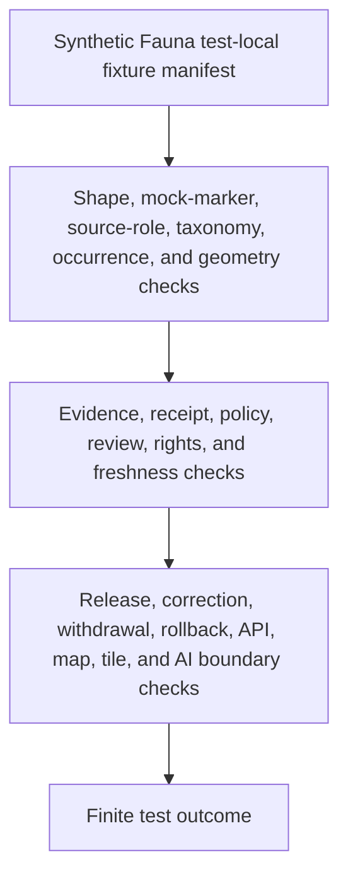

<!-- [KFM_META_BLOCK_V2]
doc_id: kfm://doc/tests-fixtures-domains-fauna-readme
title: Fauna Test Fixtures README
type: test-fixture-parent-readme
version: v0.1
status: draft; empty-placeholder-replaced; fauna-test-fixture-parent-index; PROPOSED / NEEDS VERIFICATION before promotion
owners:
  - OWNER_TBD - Fauna domain steward
  - OWNER_TBD - Fixture steward
  - OWNER_TBD - QA steward
  - OWNER_TBD - Sensitivity steward
  - OWNER_TBD - Evidence steward
  - OWNER_TBD - Policy steward
  - OWNER_TBD - Release steward
created: 2026-07-06
updated: 2026-07-06
policy_label: public-doc; tests; fixtures; fauna; parent-index; synthetic-only; no-network; deny-by-default; public-safe; source-role-aware; evidence-bound; policy-gated; review-gated; release-gated; rollback-aware
tags: [kfm, tests, fixtures, fauna, parent-index, synthetic-fixtures, occurrence-fixtures, species-fixtures, range-fixtures, sensitive-location, geoprivacy, SourceDescriptor, EvidenceBundle, EvidenceRef, RedactionReceipt, PolicyDecision, ReviewRecord, ReleaseManifest, RollbackCard, ABSTAIN, DENY, ERROR]
related:
  - ../README.md
  - ../../../README.md
  - ../../../domains/fauna/README.md
  - ../../../../fixtures/domains/fauna/README.md
  - ../../../../fixtures/domains/fauna/golden/README.md
  - ../../../../fixtures/domains/fauna/invalid/README.md
  - ../../../../fixtures/domains/fauna/layers/README.md
  - ../../../../fixtures/domains/fauna/sensitive_deny/README.md
  - ../../../../fixtures/domains/fauna/stale_source/README.md
  - ../../../../fixtures/domains/fauna/synthetic/README.md
  - ../../../../fixtures/domains/fauna/valid/README.md
  - ../../../../docs/domains/fauna/README.md
  - ../../../../docs/domains/fauna/SENSITIVITY.md
  - ../../../../docs/domains/fauna/MAP_UI_CONTRACTS.md
  - ../../../../docs/domains/fauna/SOURCE_REGISTRY.md
  - ../../../../docs/domains/fauna/DATA_LIFECYCLE.md
  - ../../../../docs/domains/fauna/POLICY.md
  - ../../../../contracts/domains/fauna/
  - ../../../../schemas/contracts/v1/domains/fauna/
  - ../../../../policy/domains/fauna/
  - ../../../../policy/sensitivity/fauna/
  - ../../../../data/registry/sources/fauna/
  - ../../../../release/candidates/fauna/
notes:
  - "This README replaces the empty placeholder content at tests/fixtures/domains/fauna/README.md."
  - "This lane documents test-local expectations for Fauna fixture wrappers and manifests. Canonical reusable Fauna fixtures live under fixtures/domains/fauna/ unless an ADR or parent README says otherwise."
  - "Parent indexes at tests/fixtures/README.md and tests/fixtures/domains/README.md were not found during current-session fetches. This README remains local to the Fauna subtree until those parents are authored."
  - "No child README lanes under tests/fixtures/domains/fauna/ were confirmed during authoring. Child lanes listed here are PROPOSED until files and executable tests are verified."
  - "Fauna test fixtures are not occurrence truth, species truth, range truth, source authority, EvidenceBundles, policy decisions, review approvals, release state, map/API payloads, public artifacts, or AI authority."
  - "Executable tests, payload inventory, fixture schema bindings, harness wiring, CI jobs, and pass rates remain NEEDS VERIFICATION."
[/KFM_META_BLOCK_V2] -->

<a id="top"></a>

# Fauna test fixtures

> Parent index for test-local Fauna fixture expectation lanes under `tests/fixtures/domains/fauna/`. This subtree should document synthetic fixture wrappers and expected test behavior without becoming the canonical fixture root or any form of fauna truth.

<p>
  
  
  
  
  
  
</p>

**Path:** `tests/fixtures/domains/fauna/README.md`  
**Status:** draft / empty placeholder replaced / Fauna test-fixture parent index / PROPOSED until executable tests are verified  
**Owning root:** `tests/`  
**Lane family:** `fixtures/domains/fauna`  
**Canonical reusable fixture root:** `fixtures/domains/fauna/`  
**Default execution posture:** deterministic, synthetic, no-network, public-safe fixture envelopes only  
**Truth posture:** CONFIRMED target file existed as an empty placeholder before replacement; CONFIRMED `tests/fixtures/README.md` and `tests/fixtures/domains/README.md` were not found during current-session fetches; CONFIRMED canonical `fixtures/domains/fauna/README.md` exists and identifies reusable Fauna fixtures as public-safe examples, not authoritative records, source records, EvidenceBundles, source descriptors, policy decisions, rights approvals, review approvals, release state, public API material, public map material, public tiles, or published artifacts; CONFIRMED `tests/domains/fauna/README.md` exists and states domain tests are tests-only; NEEDS VERIFICATION for executable tests, payload inventory, accepted schemas, fixture harnesses, CI coverage, and pass rates.

---

## Purpose

`tests/fixtures/domains/fauna/` is the parent index for Fauna test-local fixture expectation lanes.

This subtree should document how tests may use bounded synthetic fixture wrappers for occurrence-shaped examples, species/taxon examples, range and layer examples, sensitive-location denial examples, stale-source examples, policy-denial examples, governed API envelopes, map UI envelopes, Evidence Drawer payloads, Focus Mode envelopes, correction examples, withdrawal examples, and rollback examples.

A passing fixture check under this subtree should not mean that an animal occurrence is true, a species identification is accepted, a taxon is canonical, a range polygon is authoritative, a sensitive site is public, a source is admitted, an EvidenceBundle exists, policy allows release, a review occurred, a layer is published, or an AI answer is authoritative. It should mean only that a bounded synthetic fixture expectation behaved as designed.

[Back to top](#top)

---

## Placement Basis

Directory Rules place enforceability proof under `tests/`. The canonical reusable fixture root is `fixtures/`. This requested path sits under `tests/fixtures/`, so it must remain test-scoped and subordinate to canonical fixture, source, contract, schema, policy, evidence, receipt, release, map, API, and public artifact roots.

| Responsibility | Correct home | This subtree's relationship |
|---|---|---|
| Fauna test-local fixture expectations | `tests/fixtures/domains/fauna/` | This parent index. |
| Higher parent index for test fixtures | `tests/fixtures/README.md` | Not found during current-session fetch; SHOULD be authored before broad promotion. |
| Higher parent index for domain test fixtures | `tests/fixtures/domains/README.md` | Not found during current-session fetch; SHOULD be authored before broad promotion. |
| Reusable Fauna fixtures | `fixtures/domains/fauna/` | Canonical fixture root; referenced, not replaced. |
| Fauna domain tests | `tests/domains/fauna/` | Consumers and validators; not fixture payload authority. |
| Fauna object contracts | `contracts/domains/fauna/` | Define object meaning; not owned here. |
| Machine schemas | `schemas/contracts/v1/domains/fauna/` and related schema homes | Define accepted shape; not owned here. |
| Source registry and source descriptors | `data/registry/sources/fauna/` and accepted source catalog homes | Authority lives there; not here. |
| Policy authority | `policy/domains/fauna/`, `policy/sensitivity/fauna/`, and accepted policy roots | Referenced by expected outcomes; not defined here. |
| Evidence, receipts, and proof | `data/proofs/`, `data/receipts/`, and accepted trust roots | Referenced through synthetic refs; not stored here. |
| Release decisions and public artifacts | `release/`, map/API/artifact roots | Referenced through synthetic refs; not decided or published here. |

> [!IMPORTANT]
> This directory may describe test fixture expectations. It must not become a second fixture library, a source registry, an occurrence registry, a sensitive-location cache, a release queue, a map-layer source, or a public artifact home.

---

## Parent Invariant

> **Fauna test fixtures are synthetic bounded examples, not fauna truth.**

All child lanes should preserve these checks:

| Check | Required behavior | Failure outcome |
|---|---|---|
| Fixture-root boundary | Reusable payloads live under `fixtures/domains/fauna/`; test-local wrappers require a documented reason. | validation failure. |
| Synthetic-only boundary | Fixtures use fake IDs, mock markers, toy taxa, toy source names, toy timestamps, generalized geometry, and reviewable payloads. | quarantine / validation failure. |
| No-network boundary | Fixture loaders do not call live biodiversity APIs, restricted agency systems, geocoders, map services, release services, public APIs, or AI runtimes. | `ERROR`. |
| Source-role boundary | Source role is explicit and cannot be upcast by fixtures, validators, catalog helpers, maps, API wording, or generated text. | `DENY` / `ABSTAIN`. |
| Taxonomy boundary | Taxon labels and species IDs in fixtures do not create canonical taxonomy or accepted-identification truth. | validation failure / `ABSTAIN`. |
| Occurrence boundary | Occurrence-shaped fixtures do not become observation records, monitoring records, mortality records, disease records, invasive-species records, or release-ready public claims. | `DENY` / `ABSTAIN`. |
| Sensitive-location boundary | Fixtures do not carry restricted coordinates, nest, den, roost, hibernacula, spawning-site, parcel-level, observer, collection, or reconstructive hints. | `DENY` / validation failure. |
| Evidence boundary | Claim-like fixtures cite synthetic EvidenceRef and EvidenceBundle-stub expectations or abstain. | `ABSTAIN`. |
| Review boundary | Fauna, sensitivity, rights, and steward review refs are explicit where materiality requires them. | `DENY` / `ABSTAIN`. |
| Policy boundary | Missing policy, missing review, missing receipt, missing release state, unresolved rights, stale source, or exact-detail attempts fail closed. | `DENY` / `ABSTAIN`. |
| Release boundary | Fixture success does not become source admission, policy approval, review approval, release approval, public map publication, correction approval, or rollback approval. | promotion block. |

---

## Confirmed Test-Local Child Lanes

No child README lanes under `tests/fixtures/domains/fauna/` were confirmed during authoring. This README is the parent index and backlog anchor only.

| Test-fixture lane | Status observed | Purpose | Boundary |
|---|---|---|---|
| `README.md` | CONFIRMED README | Parent test-local fixture index for Fauna. | Does not claim executable tests or fixture payloads. |

---

## Proposed Child Lanes

These are backlog signposts only. They are not implementation claims.

| Proposed lane | Status | Purpose | Boundary |
|---|---|---|---|
| `occurrence/` | PROPOSED | Would test occurrence-shaped fixture wrappers and expected outcomes. | Occurrence-shaped fixture is not an occurrence record. |
| `taxonomy/` | PROPOSED | Would test taxon-label, unresolved taxonomy, synonym, and identification-posture examples. | Taxon fixture is not taxonomy authority. |
| `sensitive_geometry/` | PROPOSED | Would test restricted-location denial, geoprivacy, generalized geometry, and RedactionReceipt refs. | Does not store restricted geometry. |
| `policy/` | PROPOSED | Would test policy-denial, rights, review, sensitivity, and release-state fixture expectations. | Does not define policy. |
| `source/` | PROPOSED | Would test SourceDescriptor-shaped, source-role, freshness, stale-source, and source-admission fixture expectations. | Does not admit sources. |
| `layers/` | PROPOSED | Would test layer-shaped, range-shaped, map, tile, and trust-state fixture expectations. | Layer-shaped fixture is not layer registry. |
| `api/` | PROPOSED | Would test governed API, Evidence Drawer, Focus Mode, and response-envelope fixture expectations. | Does not prove API implementation. |
| `release/` | PROPOSED | Would test ReleaseManifest-shaped, correction, withdrawal, rollback, and cache-invalidation fixture expectations. | Does not approve release. |
| `no_network/` | PROPOSED | Would test deterministic local loading and no live service access. | Does not replace governed integration tests. |

---

## Relationship to Canonical Fauna Fixtures

The canonical fixture root `fixtures/domains/fauna/` is the reusable Fauna fixture home. It already documents child lanes for golden, invalid, layer-shaped, sensitive-denial, stale-source, synthetic, and valid examples.

This `tests/fixtures/...` subtree should therefore avoid copying canonical payloads. It should document test-local wrappers, expectation manifests, parametrization files, and safety checks that are scoped to test execution.

| Question | Preferred answer |
|---|---|
| Need reusable Fauna fixture payloads? | Use `fixtures/domains/fauna/` or an accepted canonical child lane. |
| Need executable Fauna domain tests? | Use `tests/domains/fauna/` or a confirmed domain-test child lane. |
| Need test-local wrappers or expectation manifests? | This subtree may be appropriate when clearly test-scoped. |
| Need source descriptors, source registry records, occurrence records, taxon authority, monitoring data, or lifecycle data? | Do not put them here. Use accepted source, registry, contract, schema, and lifecycle roots. |
| Need policy, schema, contract, evidence, receipt, review, or release authority? | Do not put it here. Use the owning responsibility root. |
| Need public API responses, map layers, tiles, screenshots, Focus Mode packets, exports, or AI outputs? | Do not put them here. Use governed release and public-surface roots. |

---

## Test Fixture Flow



The diagram describes intended test responsibility only. It does not prove that executable tests, validators, fixtures, policy runtime, release jobs, map behavior, AI behavior, or CI jobs currently exist.

---

## Accepted Inputs

Only bounded, synthetic, reviewable material belongs in this subtree:

- references to canonical Fauna fixtures under `fixtures/domains/fauna/`
- test-local fixture manifests with fake IDs, mock markers, finite outcomes, expected reason codes, and safe canaries
- synthetic occurrence-shaped, species-shaped, taxon-shaped, range-shaped, stale-source, denied, abstention, correction, withdrawal, and rollback envelopes
- synthetic SourceDescriptor, EvidenceRef, EvidenceBundle-stub, RedactionReceipt, AggregationReceipt, PolicyDecision, ReviewRecord, ReleaseManifest, CorrectionNotice, WithdrawalNotice, and RollbackCard refs
- synthetic public-surface envelopes for API, map, tile, Evidence Drawer, Focus Mode, export, and generated-answer carriers, only when already generalized or expected to deny/abstain
- canary values that make source-role upcast, taxonomy acceptance collapse, occurrence-truth collapse, exact-location leakage, sensitive-site hints, rights overclaiming, review-approval leakage, policy-decision collapse, map-truth leakage, AI-truth leakage, or release approval obvious
- local validation envelopes emitted by test helpers

Safe outputs may include public-safe references and operational fields such as fixture ID, fixture family, object family, taxon posture, occurrence posture, source family, source role, geometry posture, evidence ref, receipt ref, policy decision ID, review record ID, release ref, finite outcome, reason code, correction ref, withdrawal ref, and rollback ref.

---

## Exclusions

Do not place these materials in this subtree:

| Excluded material | Why it does not belong here |
|---|---|
| Real occurrence records, monitoring records, mortality records, disease records, invasive-species records, taxon authority records, source descriptors, registry YAML, source-system exports, production payloads, or public payloads | Default tests must stay synthetic, deterministic, and no-network. |
| Real coordinates, restricted site detail, precise footprints, reverse-geocodable hints, observer names, collection notes, field notes, timestamps, parcel-level hints, or combinations that could imply a real observation | Sensitive material requires governed policy, review, redaction, generalization, and release controls. |
| Direct reads from RAW, WORK, QUARANTINE, internal stores, unpublished candidates, public production stores, or runtime outputs | Bypasses the trust membrane. |
| Secrets, credentials, private endpoints, production logs, or telemetry | Security and exposure risk. |
| Real EvidenceBundles, ProofPacks, production receipts, release manifests, rollback cards, correction notices, withdrawal notices, public artifacts, or audit ledgers | Governed trust records and release artifacts belong in their own roots. |
| Binding policy rules, schema definitions, contract prose, source descriptors, release procedures, API implementation, map implementation, pipeline implementation, watcher implementation, or AI runtime implementation | Authority and implementation belong in their own responsibility roots. |

---

## Suggested Layout

```text
tests/fixtures/domains/fauna/
|-- README.md
|-- occurrence/
|-- taxonomy/
|-- sensitive_geometry/
|-- policy/
|-- source/
|-- layers/
|-- api/
|-- release/
`-- no_network/
```

Only the parent `README.md` was confirmed during authoring. Child directories are PROPOSED until files and executable tests exist.

---

## Run Posture

No executable runner was verified while authoring this README. Once tests exist, the expected local command should be documented and verified here.

```bash
: "PROPOSED / NEEDS VERIFICATION"
pytest tests/fixtures/domains/fauna
```

Required run posture: no network access, no live source calls, no direct lifecycle-store reads, no geocoding, no real secrets, no production logs, no production trust artifacts, no restricted location detail, no source exports, no public artifact writes, deterministic fixture inputs, and finite outcomes only: `PASS`, `DENY`, `ABSTAIN`, or `ERROR`.

---

## Minimal Parent Fixture Manifest

Synthetic test-local manifests should describe fixture expectations without carrying real Fauna material or authority.

```json
{
  "fixture_manifest_id": "fauna-test-fixture-parent-manifest-example",
  "domain": "fauna",
  "fixture_lane": "tests/fixtures/domains/fauna",
  "fixture_family": "parent_guardrail_envelope",
  "canonical_fixture_ref": "fixtures/domains/fauna/valid/non_sensitive_occurrence.json",
  "object_family": "OccurrenceLikeFixture",
  "taxon_posture": "toy_taxon_not_authority",
  "occurrence_posture": "synthetic_not_observation",
  "source_role": "synthetic",
  "geometry_posture": "withheld_or_generalized_placeholder",
  "mock_marker": true,
  "evidence_ref": "evidence-ref-fixture-fauna-parent-001",
  "redaction_receipt_ref": "redaction-receipt-fixture-fauna-parent-001",
  "policy_decision_ref": "policy-decision-fixture-fauna-parent-001",
  "review_record_ref": "review-record-fixture-fauna-parent-001",
  "release_manifest_ref": null,
  "rollback_card_ref": "rollback-card-fixture-fauna-parent-001",
  "expected_outcome": "ABSTAIN",
  "reason_code": "FAUNA_TEST_FIXTURE_DOES_NOT_AUTHORIZE_TRUTH_OR_PUBLICATION",
  "must_not_claim": [
    "SOURCE_ADMITTED_CANARY",
    "OCCURRENCE_TRUTH_CANARY",
    "TAXON_AUTHORITY_CANARY",
    "EXACT_LOCATION_CANARY",
    "SENSITIVE_SITE_CANARY",
    "REVIEW_APPROVAL_CANARY",
    "POLICY_APPROVAL_CANARY",
    "MAP_TRUTH_CANARY",
    "AI_TRUTH_CANARY",
    "RELEASE_APPROVAL_CANARY"
  ]
}
```

The JSON above is illustrative. Accepted schema, field names, fixture homes, source-role vocabulary, taxon-posture vocabulary, occurrence-posture vocabulary, geometry-posture vocabulary, reason codes, and CI wiring remain NEEDS VERIFICATION.

---

## Evidence Ledger

| Source | Status | Supports | Limits |
|---|---|---|---|
| `Directory Rules.pdf` and repo directory-rule docs | CONFIRMED doctrine | `tests/` is the enforceability root; `fixtures/` is the fixture responsibility root; source, contract, schema, policy, evidence, receipts, release, map, API, and public artifacts remain separate. | Does not prove executable tests, fixture inventory, CI, or pass rates. |
| GitHub target file before update | CONFIRMED repo evidence | `tests/fixtures/domains/fauna/README.md` existed as an empty placeholder before replacement. | Placeholder proved path existence only. |
| `tests/fixtures/README.md` | CONFIRMED not found in current GitHub fetch | Higher test-fixture parent index was missing during authoring. | Missing parent should be created before treating this subtree as mature. |
| `tests/fixtures/domains/README.md` | CONFIRMED not found in current GitHub fetch | Higher domain test-fixture parent index was missing during authoring. | Missing parent should be created before treating this subtree as mature. |
| `fixtures/domains/fauna/README.md` | CONFIRMED repo evidence | Defines the canonical Fauna fixture root, current fixture lanes, accepted material, exclusions, fixture design rules, and non-authority posture. | Payload inventory is partial and many examples remain PROPOSED / NEEDS VERIFICATION. |
| `tests/domains/fauna/README.md` | CONFIRMED repo evidence | Defines Fauna domain test lane posture: tests-only, no-network default, finite outcomes, fail-closed behavior, and separation from source, policy, release, receipts, proofs, and public artifacts. | The README marks executable tests, fixtures, validators, schemas, policies, releases, and CI as not verified. |
| `docs/domains/fauna/SENSITIVITY.md` | CONFIRMED repo evidence | Defines deny-by-default, fail-closed, geoprivacy, RedactionReceipt, review, and release posture for sensitive Fauna material. | Binding enforcement remains in policy/sensitivity/fauna and machine-readable homes. |
| `docs/domains/fauna/MAP_UI_CONTRACTS.md` | CONFIRMED repo evidence | Defines Fauna map/UI seam, governed API, Evidence Drawer, Focus Mode, layer-family, sensitivity, freshness, release, and trust-visible-state posture. | It is a draft standard and marks route/schema implementation details as PROPOSED / NEEDS VERIFICATION where not inspected. |

---

## Validation Checklist

- [ ] Confirm whether `tests/fixtures/` is intended as a supported test-local fixture lane or only a compatibility surface.
- [ ] Create or confirm parent indexes at `tests/fixtures/README.md` and `tests/fixtures/domains/README.md`.
- [ ] Confirm accepted rules for when test-local fixture wrappers may live here instead of `fixtures/domains/fauna/`.
- [ ] Confirm fixture manifest schema, fixture-family vocabulary, source-role vocabulary, taxon-posture vocabulary, occurrence-posture vocabulary, geometry-posture vocabulary, reason-code vocabulary, mock-marker requirements, and canary conventions.
- [ ] Confirm fixture payload inventory under `fixtures/domains/fauna/` before linking tests to payloads.
- [ ] Add executable checks for parent manifest shape, no-network fixture loading, source-role no-upcast, taxonomy non-authority, occurrence non-truth, sensitive-location denial, evidence refs, policy refs, review refs, receipt refs, release refs, correction refs, withdrawal refs, rollback refs, and public-surface canaries.
- [ ] Confirm tests do not use real source feeds, live systems, secrets, production logs, production trust artifacts, restricted details, direct lifecycle-store reads, geocoders, map services, public APIs, release services, or public artifact writes.
- [ ] Wire this subtree into CI only after executable tests and safe fixtures exist.

---

## Rollback

Rollback is required if this subtree starts to store real source data, source descriptors, source registry records, occurrence records, taxon authority records, monitoring records, exact coordinates, raw geometry, protected-location material, production payloads, trust-bearing records, release records, public artifacts, secrets, production logs, binding policy, contract/schema authority, map implementation, API implementation, pipeline implementation, watcher implementation, or AI runtime behavior.

Rollback is also required if this subtree treats a fixture pass as source admission, source authority, occurrence truth, taxon truth, range truth, geometry accuracy, evidence proof, policy approval, review approval, release approval, publication approval, map truth, AI truth, correction approval, withdrawal approval, or rollback approval.

Rollback target: restore the previous safe README revision or remove this parent index until higher parent indexes, fixture homes, manifest schema, child lane inventory, source-role behavior, sensitive-location expectations, evidence expectations, policy expectations, release relationship, correction behavior, rollback behavior, and CI integration are reverified.

[Back to top](#top)