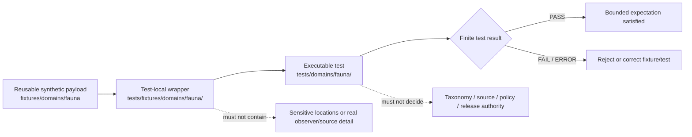

# `tests/fixtures/domains/fauna/` — Fauna Test-Local Fixture Routing and Sensitive-Species Safety Boundary

> Repository-grounded parent contract for test-local Fauna fixture wrappers. This subtree may organize small synthetic manifests and expectations owned by named tests, but it does not own reusable fixture payloads, executable tests, taxonomic authority, occurrence truth, sensitive-site data, source admission, policy decisions, release approval, or public artifacts.

<!-- [KFM_META_BLOCK_V2]
doc_id: kfm://doc/tests-fixtures-domains-fauna-readme
title: tests/fixtures/domains/fauna/README.md — Fauna Test-Local Fixture Routing and Sensitive-Species Safety Boundary
type: readme; directory-readme; test-local-fixture-parent; fauna; sensitive-domain; routing-boundary; non-authoritative
version: v0.2
status: draft; repository-grounded; parent-only-direct-subtree; tests-fixtures-parent-confirmed; domains-parent-index-absent; fauna-domain-test-parent-confirmed; reusable-fixture-root-confirmed; reusable-lanes-readme-backed; checked-payloads-placeholder-only; key-domain-schemas-permissive; policy-scaffolds; validator-indexes-readme-only; executable-enforcement-unestablished; ci-unestablished; deny-by-default; non-authoritative
owners: OWNER_TBD — Fauna steward · Test/QA steward · Fixture steward · Taxonomy steward · Occurrence steward · Sensitive-species/geoprivacy reviewer · Source steward · Rights steward · Evidence steward · Policy steward · Review steward · Release steward · Correction/rollback steward · Map/UI steward · Security reviewer · CI steward · Docs steward
created: 2026-07-06
updated: 2026-07-16
supersedes: v0.1 Fauna test-fixture parent index
policy_label: public-doc; tests; fixtures; fauna; parent-boundary; test-local-only; synthetic-only; no-network-default; deny-by-default; source-role-fixed; taxonomy-not-authority; occurrence-not-truth; sensitive-location-denied; observer-privacy-aware; evidence-required; review-gated; policy-gated; release-subordinate; correction-aware; revocation-aware; rollback-aware; no-publication
current_path: tests/fixtures/domains/fauna/README.md
truth_posture:
  CONFIRMED:
    - target README v0.1 and prior blob
    - tests/fixtures parent README exists and defines the test-local versus reusable fixture split
    - tests/fixtures/domains/README.md was not found at the checked path
    - bounded search surfaced only this README under tests/fixtures/domains/fauna/
    - fixtures/domains/fauna is the observed reusable Fauna fixture root with golden, invalid, layers, sensitive_deny, stale_source, synthetic, and valid README lanes
    - checked named JSON and GeoJSON payloads under valid, invalid, golden, and synthetic are planning placeholders rather than substantive semantic cases
    - tests/domains/fauna/README.md is the Fauna executable-test parent and remains scaffold-oriented
    - occurrence_public, occurrence_restricted, and sensitive_site schemas are permissive empty-property PROPOSED scaffolds
    - policy/domains/fauna and policy/sensitivity/fauna are PROPOSED scaffolds
    - tools/validators/fauna and tools/validators/domains/fauna are routing READMEs; executable Fauna enforcement is not established by them
    - Makefile fixtures target is TODO and default test target excludes this subtree
    - domain-fauna workflow is a repository workflow surface whose substantive fixture enforcement remains unverified
    - direct parent-level conftest.py and manifest_expectations.json are absent at named paths
  PROPOSED:
    - this parent owns routing, admission criteria, common wrapper invariants, proposed child-lane taxonomy, manifest expectations, consumer-backlink rules, finite outcomes, maintenance, migration, and rollback guidance
    - test-local wrappers carry only test-specific deltas and refer to reusable Fauna fixtures where possible
    - executable tests consume wrappers by reference from owning tests/domains/fauna lanes
  CONFLICTED:
    - v0.1 claim that tests/fixtures/README.md was absent
    - v0.1 suggested pytest execution directly against this fixture subtree despite no confirmed executable files
    - proposed child directories were presented alongside the confirmed parent in a way that could be mistaken for implemented lanes
    - reusable fixture filenames imply valid, invalid, golden, stale, or public-safe behavior while checked payloads are placeholders
    - rich Fauna contracts and doctrine versus permissive domain schemas, policy scaffolds, README-only validators, and unestablished executable tests
    - tests/fixtures is test-local while fixtures/domains/fauna describes operational/runtime examples; the exact wrapper admission threshold remains unsettled
    - sensitivity tier and rank vocabularies coexist and must not be silently merged
    - broad and per-domain Fauna validator indexes coexist with overlapping routing descriptions
  UNKNOWN:
    - exhaustive recursive payload inventory, ignored/generated files, dynamic fixture generation, and external fixture stores
    - active consumer tests and two-way backlinks
    - accepted wrapper manifest schema, reason-code registry, and object-state vocabularies
    - substantive schema coverage beyond sampled key objects
    - current pass rates, branch-protection significance, retained CI artifacts, production consumers, and release dependency
  NEEDS_VERIFICATION:
    - accepted owners and CODEOWNERS
    - whether tests/fixtures/domains/README.md should be created
    - exact threshold for test-local versus reusable fixture placement
    - canonical fixture IDs, versions, hashes, generator metadata, and generation receipts
    - substantive reusable payloads and executable consumers
    - no-network, no-write, no-leak, orphan, duplicate, and nonempty-coverage enforcement
    - taxonomy, occurrence, geoprivacy, source-role, policy, review, correction, revocation, invalidation, and rollback execution
evidence_snapshot:
  repository: bartytime4life/Kansas-Frontier-Matrix
  repository_id: "1059091169"
  visibility: public
  base_ref: main
  base_commit: da40c9b4e55b2851556ec19ca57e40af41203a6a
  target_prior_blob: 3d007cb510ff2b79ba6f9356a22b00bc4ed70e11
  related_repository_blobs:
    directory_rules: 2affb080e6f0043867c64c7f06c1ca52030fbd55
    tests_fixtures_parent: 2d0147e85eae86f687e85c5bea0d3e61f9c3a8f7
    fauna_domain_test_parent: f9ea96cd86bf6bc7b4765505d23e6b3d430ae2ce
    reusable_fauna_fixture_parent: 65939f4f866002822e6fe1e8ac8cf524b8772293
    reusable_valid_readme: cdd9f89a21c5a920c52b7fbeebc070c022e26e21
    valid_occurrence_placeholder: ba6ce821b7d021db574495795a21e56094794c47
    range_polygon_placeholder: bdecb13c485c3f4b57e08a804f9603ed194d1078
    seasonal_range_placeholder: 724a0434c9d77fc8df6289a4305e4f0961b3a15c
    unresolved_taxonomy_placeholder: d424c496ec53a6d7323c21519deb63e021ed5cf3
    over_precise_sensitive_placeholder: f04047c37d6a1602f4618cc1f7e10527d2e69401
    missing_source_descriptor_placeholder: d971358b07a84b93d65f084e6bbcf9a8fa8d0b3b
    density_grid_placeholder: 11654857a9ab35b1c13f63802d0c5a7f94b3d30b
    no_network_placeholder: df5bf7ce3fcb98c15544e99d7759a6d01a7a82e3
    fauna_sensitivity_doc: 58c557cda55362345ac3869502910bc301ef5b8c
    fauna_schema_doc: 27257d6ccd69f08b5c1382627ac604a694f33519
    occurrence_public_schema: 4d7d0f1b642b46c5a567561372b2443bb93b8ce8
    occurrence_restricted_schema: 242f04fa30b689237451700b82ec1c4d4f082ff1
    sensitive_site_schema: cd70b353c5b579a6ededb99f2eaaf0478ef491eb
    fauna_policy_readme: 39b7c7dd859614ab9ae9a72208f693056c97f2c6
    fauna_sensitivity_policy_readme: aac9f7b6316b89238d209c7ef4045fbf4df15ea9
    broad_fauna_validator_readme: c51ce8431d54ae84a78b8a7b4510a7d6813f9227
    domain_fauna_validator_readme: 7f424e148389582a1764eaaf484be80cd71e4d7d
    makefile: 4dc8cf633581893d83fba53219c6ea847992e6be
  direct_lane_files_confirmed:
    - tests/fixtures/domains/fauna/README.md
  checked_absent_paths:
    - tests/fixtures/domains/README.md
    - tests/fixtures/domains/fauna/conftest.py
    - tests/fixtures/domains/fauna/manifest_expectations.json
    - tests/fixtures/domains/fauna/occurrence/README.md
notes:
  - "v0.2 corrects stale higher-parent claims and records the direct Fauna test-local subtree as parent-only in bounded evidence."
  - "This subtree owns test-local wrapper routing and expectations, not executable tests or reusable payloads."
  - "The executable Fauna test parent is tests/domains/fauna/; the reusable payload parent is fixtures/domains/fauna/."
  - "Checked named reusable payload files are planning placeholders and do not count as positive, negative, stale, sensitive-denial, or regression coverage."
  - "This revision changes documentation only and creates no fixture payload, test, schema, contract, policy, validator, workflow, source record, taxon record, occurrence record, sensitive-site record, receipt, proof, release record, map artifact, API behavior, AI output, or public artifact."
[/KFM_META_BLOCK_V2] -->

<a id="top"></a>

<p>
  
  
  
  
  
  
  
</p>

> [!IMPORTANT]
> **This is the test-local wrapper parent.** Reusable Fauna payloads belong under [`fixtures/domains/fauna/`](../../../../fixtures/domains/fauna/README.md). Executable Fauna tests belong under [`tests/domains/fauna/`](../../../domains/fauna/README.md). This subtree should contain only small wrappers, expectation manifests, and routing documentation owned by named tests.

> [!CAUTION]
> **Filenames and README lanes are not fixture coverage.** The checked reusable files named `valid`, `invalid`, `golden`, `range`, `sensitive`, and `no_network` are planning placeholders. They cannot be counted as passing, failing, redacted, stale, public-safe, or hermetic cases.

> [!WARNING]
> **Fauna is sensitive by default.** Exact occurrences, nests, dens, roosts, hibernacula, spawning sites, breeding or aggregation sites, telemetry detail, observer identities, collection notes, private-parcel clues, steward-controlled records, and reverse-engineerable derivatives must not appear in fixture payloads, fixture names, snapshots, assertion messages, logs, reports, or CI artifacts.

**Quick navigation:** [Status](#status-and-evidence-boundary) · [Purpose](#purpose-and-audience) · [Authority](#authority-and-directory-rules-basis) · [Surfaces](#three-fixture-and-test-surfaces) · [Inventory](#confirmed-direct-and-reusable-inventory) · [Proposed lanes](#proposed-test-local-child-lanes) · [Responsibilities](#parent-responsibilities-and-non-responsibilities) · [Flow](#fixture-routing-flow) · [Placement](#fixture-home-decision-law) · [Admission](#child-lane-and-wrapper-admission-contract) · [Manifest](#minimum-parent-and-child-manifest-contract) · [Consumers](#consumer-backlinks-orphans-and-nonempty-coverage) · [Invariants](#shared-fauna-fixture-invariants) · [Objects](#object-and-authority-separation) · [Outcomes](#finite-outcomes-and-vocabulary-separation) · [Taxonomy](#taxonomy-and-identification-boundary) · [Occurrences](#occurrence-monitoring-mortality-and-disease-boundary) · [Sensitivity](#sensitive-species-geoprivacy-and-rights) · [Source](#source-role-freshness-and-watcher-boundary) · [Ranges](#range-migration-layer-and-tile-boundary) · [Invasive](#invasive-species-and-private-parcel-boundary) · [Public carriers](#api-map-export-cache-and-ai-boundary) · [Security](#no-network-security-and-side-effects) · [Determinism](#identity-version-hash-generation-and-replay) · [Cases](#parent-case-matrix) · [Maturity](#current-maturity-and-drift-matrix) · [Commands](#validation-commands) · [CI](#ci-and-promotion-boundary) · [Failures](#failure-interpretation) · [Passing](#what-passing-does-not-prove) · [Maintenance](#maintenance-migration-and-deprecation) · [Done](#definition-of-done) · [FAQ](#faq) · [Open](#open-verification-register) · [Evidence](#evidence-ledger) · [Rollback](#documentation-correction-and-rollback)

---

## Status and evidence boundary

> [!IMPORTANT]
> **Evidence snapshot:** `main@da40c9b4e55b2851556ec19ca57e40af41203a6a`
> **Prior target blob:** `3d007cb510ff2b79ba6f9356a22b00bc4ed70e11`
> **Direct subtree:** this parent README only
> **Direct wrappers:** not established
> **Direct executable tests:** not established
> **Higher parent:** `tests/fixtures/README.md` exists; `tests/fixtures/domains/README.md` was not found

### Safe conclusion

`tests/fixtures/domains/fauna/` is a valid test-local fixture routing surface under the `tests/` responsibility root. It documents where future test-specific wrappers belong and which boundaries every Fauna fixture example must preserve.

It is not:

- a reusable fixture corpus;
- an executable test suite;
- a source registry or source-admission queue;
- a taxonomy registry or accepted-identification store;
- an occurrence, monitoring, mortality, disease, invasive-species, range, or sensitive-site store;
- a geoprivacy profile or redaction implementation;
- an evidence, receipt, policy, review, release, correction, or rollback authority;
- an API, map, tile, export, graph, cache, or AI output surface.

### Confirmed direct inventory

```text
tests/fixtures/domains/fauna/
└── README.md
```

Bounded repository search and named-path probes established only this parent README. They do not prove permanent absence of ignored, generated, branch-local, dynamic, external, or differently named files.

[Back to top](#top)

---

## Purpose and audience

This parent serves maintainers who need to:

- decide whether a Fauna fixture belongs in a test-local wrapper lane or the reusable Fauna fixture root;
- preserve sensitive-species and observer-privacy constraints across future child lanes;
- keep taxonomy, occurrence, source, evidence, policy, review, release, and public-carrier states separate;
- require named consumers and two-way fixture/test traceability;
- prevent placeholder files, README lanes, or permissive schemas from being presented as semantic coverage;
- coordinate migrations without creating parallel fixture, schema, policy, source, evidence, or release authority.

The durable question is:

> Can a small synthetic Fauna wrapper help a named test exercise a bounded behavior without becoming taxonomic authority, occurrence truth, source authority, sensitive-location disclosure, evidence closure, policy approval, release approval, or public output?

A passing wrapper check means only that the named test expectation behaved as specified for the pinned synthetic input.

[Back to top](#top)

---

## Authority and Directory Rules basis

Directory Rules state that placement encodes responsibility. The current split is:

| Responsibility | Current or proposed home | This parent’s relationship |
|---|---|---|
| Test-local Fauna wrappers and expectation manifests | `tests/fixtures/domains/fauna/` | Owned here when accepted. |
| Executable Fauna tests | `tests/domains/fauna/` | Consumes wrappers; separate responsibility. |
| Reusable Fauna payloads | `fixtures/domains/fauna/` | Shared fixture corpus; separate responsibility. |
| Fauna meaning | `contracts/domains/fauna/`, accepted contract roots | Referenced, never redefined here. |
| Machine shape | `schemas/contracts/v1/domains/fauna/` | Referenced, never redefined here. |
| Source, rights, sensitivity, and admissibility policy | `policy/` | Decides obligations; fixtures do not. |
| Source registry records | accepted `data/registry/sources/fauna/` layout | Real instances; never copied here. |
| Evidence and process memory | `data/proofs/`, `data/receipts/` | Trust support; fixtures use toy refs only. |
| Promotion, release, correction, and rollback | `release/` | Publication authority; fixtures do not approve. |
| Runtime API, map, tile, and AI implementation | implementation roots | Tested indirectly; never implemented here. |

This README does not resolve the absent `tests/fixtures/domains/README.md` index, sensitivity tier/rank vocabulary, broad/per-domain validator overlap, schema maturity, policy scaffolding, or exact wrapper admission threshold. Those remain visible until accepted governance or migration decisions exist.

[Back to top](#top)

---

## Three fixture and test surfaces

```text
reusable payload
fixtures/domains/fauna/
        │
        │ referenced by
        ▼
test-local wrapper
tests/fixtures/domains/fauna/<lane>/
        │
        │ consumed by
        ▼
executable test
tests/domains/fauna/<lane>/
```

| Surface | Owns | Must not own | Current checked maturity |
|---|---|---|---|
| Reusable Fauna fixture root | Shared synthetic payloads and reusable valid/invalid/golden examples. | Test implementation, truth, policy, release. | Seven README lanes; checked named payloads are placeholders. |
| This test-local subtree | Small wrappers, manifests, parametrization maps, expected reason codes, and routing docs. | Reusable corpus, executable tests, authority records. | Parent-only; no direct wrappers established. |
| Executable Fauna test subtree | Tests that load fixtures and prove behavior. | Reusable payload authority, production decisions. | Parent README exists; executable maturity remains verification-bound. |

A wrapper is justified only when it adds a test-local expectation that does not belong in the reusable payload itself.

[Back to top](#top)

---

## Confirmed direct and reusable inventory

### Test-local subtree

Only this parent README was confirmed.

### Reusable Fauna fixture lanes

The reusable root documents these lanes:

| Lane | Intended purpose | Confirmed maturity boundary |
|---|---|---|
| `golden/` | Stable expected-output examples. | README-backed; checked density-grid file is a planning placeholder. |
| `invalid/` | Expected validation, policy, or boundary failures. | README-backed; checked taxonomy, precision, and source-descriptor files are placeholders. |
| `layers/` | Layer, renderer, manifest, and trust-state examples. | README-backed; substantive payload and consumer coverage NEEDS VERIFICATION. |
| `sensitive_deny/` | Denied sensitive-species, rights, review, transform, and risky-join scenarios. | README-backed; substantive payload and policy execution NEEDS VERIFICATION. |
| `stale_source/` | Freshness, stale badge, supersession, and source-state scenarios. | README-backed; substantive payload and watcher behavior NEEDS VERIFICATION. |
| `synthetic/` | No-network, drift-window, and planning examples. | README-backed; checked no-network file is a planning placeholder. |
| `valid/` | Public-safe positive-path examples. | README-backed; checked occurrence and range files are placeholders. |

### Checked named payload posture

| File | Checked content | Safe conclusion |
|---|---|---|
| `valid/non_sensitive_occurrence.json` | Four-field `PROPOSED` planning record. | Not a valid occurrence case. |
| `valid/range_polygon.geojson` | One-line placeholder text. | Not GeoJSON or a range case. |
| `valid/seasonal_range.geojson` | One-line placeholder text. | Not GeoJSON or a seasonal case. |
| `invalid/unresolved_taxonomy.json` | Four-field planning record. | Not a taxonomy rejection case. |
| `invalid/over_precise_sensitive.json` | Four-field planning record. | Not a sensitive-location denial case. |
| `invalid/missing_source_descriptor.json` | Four-field planning record. | Not a source-admission failure case. |
| `golden/public_safe_density_grid.json` | Four-field planning record. | Not a golden output. |
| `synthetic/no_network_drift_window.json` | Four-field planning record. | Not a no-network or drift-window test case. |

Placeholder records may reserve names. They do not count toward positive, negative, denied, abstained, stale, golden, renderer-safe, release-safe, or no-network coverage.

[Back to top](#top)

---

## Proposed test-local child lanes

No child README lane under this subtree is confirmed. The lanes below are design options only and should not be created automatically.

| Proposed lane | Distinct responsibility required before creation | Must not become |
|---|---|---|
| `occurrence/` | Test-local occurrence wrappers not reusable across the Fauna suite. | Occurrence registry or truth. |
| `taxonomy/` | Identification, synonym, crosswalk, and unresolved-taxon expectation maps. | Taxonomy authority. |
| `sensitive_geometry/` | Test-specific geoprivacy denial and public-carrier no-leak wrappers. | Restricted geometry or profile authority. |
| `policy/` | Test-local expected decisions and obligations under pinned policy. | Policy source. |
| `source/` | Source-role, freshness, stale, watcher, and admission expectation maps. | Source registry or activation authority. |
| `layers/` | Test-specific layer, range, tile, legend, and trust-state wrappers. | Layer registry or published artifact. |
| `api/` | Test-specific governed API, Evidence Drawer, Focus, and response-envelope wrappers. | API implementation or public data. |
| `release/` | Test-local correction, withdrawal, cache invalidation, and rollback expectation maps. | Release authority. |
| `no_network/` | Shared hermeticity canaries only when not better owned by a broader test harness. | Integration test or network policy. |

A new child requires an approved responsibility, at least one named consumer, a clear reusable-fixture relationship, nonempty positive and fail-closed cases, and parent-index updates.

[Back to top](#top)

---

## Parent responsibilities and non-responsibilities

### This parent owns

- direct and proposed child-lane routing;
- the three-surface fixture/test split;
- shared synthetic, no-network, no-write, no-leak, and non-authority rules;
- the threshold for accepting test-local wrappers once approved;
- parent manifest expectations;
- consumer backlinks, orphan checks, nonempty coverage, and vacuous-pass controls;
- finite-outcome and vocabulary separation;
- maintenance, migration, correction, deprecation, and rollback instructions;
- explicit UNKNOWN and NEEDS VERIFICATION registers.

### This parent does not own

- reusable fixture payload semantics;
- executable test code;
- taxonomy, occurrence, range, monitoring, mortality, disease, invasive-species, source, review, policy, evidence, receipt, or release records;
- geoprivacy transforms, concrete parameters, or sensitivity decisions;
- runtime APIs, map layers, tiles, exports, graphs, caches, or AI answers;
- canonical migration decisions for disputed paths, tiers, ranks, profiles, or vocabularies.

[Back to top](#top)

---

## Fixture routing flow



The diagram is a routing model, not proof that child wrappers, executable lanes, validators, CI jobs, policies, or release gates exist.

[Back to top](#top)

---

## Fixture-home decision law

Use the smallest correct home:

1. **Reusable across multiple tests, validators, renderers, or pipelines?** Use an accepted `fixtures/domains/fauna/` lane.
2. **Owned by one test area and adds only local expectations or parameters?** A `tests/fixtures/domains/fauna/` wrapper may be appropriate.
3. **Contains executable assertions or helper code?** Use the owning `tests/domains/fauna/` lane.
4. **Carries real source, registry, evidence, review, policy, receipt, release, or lifecycle state?** Use the owning governed root, not fixtures.
5. **Contains sensitive or reconstructable Fauna detail?** Do not place it in repository fixtures; deny, quarantine, generalize, or use conspicuous synthetic canaries.
6. **Duplicates another fixture?** Reject unless a migration note explains source, destination, checksum, consumers, compatibility period, and rollback.
7. **Is only a planned filename?** Keep it visibly placeholder-marked and exclude it from coverage counts.

A topic match is not sufficient. Responsibility and lifecycle determine placement.

[Back to top](#top)

---

## Child-lane and wrapper admission contract

A new child lane requires:

- a distinct test-local responsibility not already covered by the reusable fixture root or existing tests;
- at least one named proposed or confirmed executable consumer;
- a clear reusable fixture relationship;
- an explicit non-authority statement;
- synthetic/public-safe input constraints;
- positive and fail-closed case requirements;
- finite outcomes and safe reason-code expectations;
- no-network, no-governed-root-write, and no-sensitive-output rules;
- owner and migration/rollback expectations;
- parent index update.

A wrapper file belongs here only when:

- it is owned by a named test;
- it is too local to be a reusable fixture;
- it contains no real source payload, observer identity, credential, endpoint secret, exact occurrence, sensitive site, private-parcel clue, restricted record, or production trust artifact;
- it pins its reusable fixture, schema, policy/profile, and expected outcome where applicable;
- it declares prohibited claims and side effects;
- it has a two-way consumer backlink;
- removal cannot change runtime, source registry, policy, release, or public state.

A README-only or placeholder-only child remains a routing surface until substantive payloads and active consumers exist.

[Back to top](#top)

---

## Minimum parent and child manifest contract

The example below is **PROPOSED** and intentionally contains no real animal or location information.

```json
{
  "fixture_manifest_id": "kfm://fixture-test/fauna/example",
  "fixture_version": "v1",
  "domain": "fauna",
  "fixture_scope": "test_local",
  "fixture_authority": "non_authoritative",
  "synthetic": true,
  "child_lane": "occurrence",
  "consumer_refs": [
    "tests/domains/fauna/occurrence/test_occurrence_not_truth.py"
  ],
  "canonical_fixture_ref": "fixtures/domains/fauna/valid/example.json",
  "object_family": "OccurrenceEvidence",
  "taxon_posture": "toy_taxon_not_authority",
  "identification_posture": "unverified_fixture_only",
  "occurrence_posture": "synthetic_not_observation",
  "source_role": "fixture_only",
  "geometry_posture": "withheld_or_generalized",
  "contains_exact_geometry": false,
  "contains_reconstruction_hint": false,
  "contains_observer_identity": false,
  "evidence_ref": "evidence-ref:fixture:fauna-example",
  "redaction_receipt_ref": null,
  "review_ref": null,
  "policy_decision_ref": null,
  "release_manifest_ref": null,
  "rollback_card_ref": "rollback-card:fixture:fauna-example",
  "expected_test_outcome": "PASS",
  "expected_domain_outcome": "ABSTAIN",
  "reason_code": "FAUNA_FIXTURE_DOES_NOT_AUTHORIZE_TRUTH_OR_RELEASE",
  "must_not_claim": [
    "SOURCE_ADMITTED",
    "TAXON_ACCEPTED",
    "OCCURRENCE_CONFIRMED",
    "SENSITIVE_LOCATION_PUBLIC",
    "REVIEW_COMPLETE",
    "POLICY_ALLOWED",
    "RELEASED",
    "MAP_TRUTH",
    "AI_TRUTH"
  ]
}
```

Future schema work must settle:

- identity, version, digest, generator, and supersession fields;
- child-lane and object-family vocabularies;
- source-role, taxon, identification, occurrence, sensitivity, geometry, review, policy, and release states;
- test outcomes versus domain outcomes;
- reason codes, obligations, and prohibited claims;
- correction, withdrawal, revocation, invalidation, and rollback references.

[Back to top](#top)

---

## Consumer backlinks, orphans, and nonempty coverage

Mature fixture coverage requires two-way traceability:

```text
wrapper manifest -> executable consumer
executable consumer -> wrapper manifest
```

Required checks:

- every wrapper names at least one active consumer;
- every consumer reference resolves;
- every child lane has a declared owner;
- reusable fixtures are referenced rather than copied;
- every consequential family has at least one substantive positive and one fail-closed case;
- placeholder-only payloads do not count as semantic coverage;
- README-only lanes do not count as payload or executable coverage;
- zero collected cases is a failure, not a green result;
- skipped cases carry reason, owner, and expiry;
- orphaned wrappers and unused reusable fixtures are reported;
- parent and child indexes remain synchronized.

A dashboard may summarize counts later, but counts without consumer resolution and payload inspection are not proof.

[Back to top](#top)

---

## Shared Fauna fixture invariants

Every future child must preserve these invariants:

| Invariant | Required behavior | Default failure |
|---|---|---|
| Synthetic identity | Use conspicuous fake IDs, taxa, sources, times, and non-authority markers. | Reject fixture. |
| Fixture-home integrity | Test-local wrappers and reusable payloads remain separate. | Block admission. |
| Source-role integrity | Source role cannot be silently upgraded downstream. | `DENY` or `ABSTAIN`. |
| Taxonomy integrity | Labels, names, and IDs do not establish accepted taxonomy. | `ABSTAIN` or reject. |
| Identification integrity | Identification confidence and review posture remain explicit. | Hold or abstain. |
| Occurrence integrity | Occurrence-shaped data is not an observation or public claim by itself. | `DENY` or `ABSTAIN`. |
| Sensitive-location denial | No real or reconstructable exact occurrence or site geometry. | Reject and escalate. |
| Observer/source privacy | No real observer identity, collection note, source identifier, or private correspondence. | Reject fixture. |
| Evidence separation | EvidenceRef must resolve in governed contexts; fixture ref is not proof. | `ABSTAIN`. |
| Review separation | Fixture or schema pass is not steward review. | Block consequential use. |
| Policy separation | Fixture metadata is not a PolicyDecision. | Block consequential use. |
| Receipt separation | Example receipt shape is not process memory. | Block promotion/release. |
| Release separation | Fixture success is not release or publication approval. | Promotion block. |
| No-network | Default tests use local synthetic inputs only. | `ERROR`. |
| No governed-root writes | Tests write only to test-owned temporary locations. | `ERROR`. |
| Deterministic replay | Same inputs and pins yield the same bounded result. | Fail test. |
| Correction/rollback | Superseded or withdrawn fixtures invalidate consumers. | Fail test and block release. |

[Back to top](#top)

---

## Object and authority separation

Do not collapse these families:

| Family | Fixture may model | Fixture must not become |
|---|---|---|
| `Taxon` | Toy taxon-shaped identity and source refs. | Canonical taxonomy or accepted name. |
| `TaxonCrosswalk` | Synthetic mapping and conflict expectations. | Authority crosswalk. |
| `ConservationStatus` | Synthetic legal/conservation status shape. | Current legal or conservation advice. |
| `OccurrenceEvidence` | Synthetic source-bound occurrence evidence. | Confirmed occurrence or public record. |
| `OccurrenceRestricted` | Denial, review, and transform obligations. | Repository copy of sensitive occurrence data. |
| `OccurrencePublic` | Public-safe expected derivative shape. | Proof that redaction or release occurred. |
| `RangePolygon` / `SeasonalRange` | Toy generalized range and temporal expectations. | Canonical species range. |
| `MigrationRoute` | Synthetic corridor/time-window shape. | Operational movement guidance. |
| `MonitoringEvent` | Toy survey/monitoring event shape. | Real monitoring record. |
| `SensitiveSite` | Required denial and governance dependencies. | Nest, den, roost, hibernacula, spawning, or aggregation location. |
| `MortalityObservation` / `DiseaseObservation` | Synthetic shape and disclosure obligations. | Health, outbreak, emergency, or enforcement authority. |
| `InvasiveSpeciesRecord` | Toy public-reporting and private-parcel boundary. | Enforcement or current occurrence authority. |
| `SourceDescriptor` / watcher state | Synthetic source governance metadata. | Source truth, activation, or publication. |
| `RedactionReceipt` / `AggregationReceipt` | Expected references and failure cases. | Proof that a transform ran. |
| `EvidenceBundle` / `PolicyDecision` / `ReviewRecord` | Toy refs and dependency expectations. | Evidence, policy, or review authority. |
| `ReleaseManifest` / correction / rollback | Expected gate behavior and lineage. | Release or rollback authority. |
| API/map/tile/AI carrier | Public-safe expected response or denial. | Runtime implementation or truth. |

Adapters among families must be explicit, versioned, and tested.

[Back to top](#top)

---

## Finite outcomes and vocabulary separation

Do not force unrelated states into one enum.

| Vocabulary | Example values | Owner |
|---|---|---|
| Test result | `PASS`, `FAIL`, `SKIP`, `ERROR` | Test framework |
| Policy result | `ALLOW`, `RESTRICT`, `HOLD`, `DENY`, `ABSTAIN`, `ERROR` | Policy |
| Taxonomy resolution | unresolved, candidate, matched, conflicting, reviewed | Taxonomy contract/steward |
| Identification posture | unverified, machine-suggested, expert-reviewed, rejected | Fauna domain/review |
| Occurrence posture | evidence, restricted, public-derivative, withdrawn, superseded | Fauna domain |
| Sensitivity audience | T0–T4 or accepted successor vocabulary | Sensitivity policy |
| Sensitivity rank | Separate rank/profile vocabulary when used | Sensitivity policy/profile |
| Source freshness | fresh, stale, changed, unavailable, retired, superseded | Source/watcher contract |
| Release state | candidate, released, deprecated, withdrawn | Release |
| Lifecycle state | RAW, WORK, QUARANTINE, PROCESSED, CATALOG, TRIPLET, PUBLISHED | Lifecycle |
| Fixture posture | valid, invalid, denied, abstention, error, correction, rollback | Fixture/test contract |

Every adapter must define source value, destination value, loss behavior, unknown handling, reason code, and test coverage. Unknown values fail closed.

[Back to top](#top)

---

## Taxonomy and identification boundary

Fauna fixtures must prove that:

- a scientific name, common name, code, or external identifier does not establish canonical taxonomy by itself;
- unresolved synonyms, split/lump changes, authority disagreements, and crosswalk conflicts remain visible;
- aggregator taxonomy does not silently override the admitted source role or authority source;
- machine-suggested identification is not expert review;
- identification confidence, method, reviewer posture, and evidence links remain explicit where consequential;
- taxon changes trigger dependent occurrence, range, layer, cache, citation, and release review;
- invalid or unknown identifiers fail closed rather than being guessed into a canonical taxon.

A placeholder named `unresolved_taxonomy.json` is not a rejection case until it contains a substantive payload and a named consumer proves the expected failure.

[Back to top](#top)

---

## Occurrence, monitoring, mortality, and disease boundary

Fixtures must preserve the distinctions among:

- occurrence evidence;
- restricted occurrence;
- public-safe occurrence derivative;
- monitoring event;
- mortality observation;
- disease observation;
- invasive-species record;
- range and seasonal-range products.

A record-shaped example does not prove that an animal was present, that identification is correct, that a survey was complete, that a mortality or disease event is current, or that public disclosure is safe.

Tests should cover:

- missing or conflicting taxon identity;
- source-role and evidence gaps;
- duplicate or contradictory occurrence records;
- stale observation and superseded source state;
- mortality/disease privacy and sensitive-location joins;
- missing review, policy, receipt, or release references;
- correction and withdrawal propagation to maps, APIs, caches, exports, and generated answers.

Fauna fixtures must not provide health, emergency, hunting, collection, disturbance, or enforcement guidance.

[Back to top](#top)

---

## Sensitive-species geoprivacy and rights

The governing doctrine is deny-by-default and fail-closed. Fixtures must never include:

- real coordinates, precise footprints, parcel clues, road-distance clues, imagery joins, timestamp/location combinations, telemetry tracks, or reconstruction hints;
- nest, den, roost, hibernacula, spawning, breeding, aggregation, or steward-controlled location substance;
- real observer names, collection notes, field notes, agency-restricted identifiers, landowner detail, or private correspondence;
- concrete operational generalization radii, fuzzing parameters, suppression thresholds, or profile secrets.

Synthetic refs may test that a named transform, RedactionReceipt, AggregationReceipt, ReviewRecord, PolicyDecision, rights review, or ReleaseManifest is required. They do not prove those records exist or that a transform occurred.

Unknown rights, denied rights, permission-required rights, stale terms, unresolved sensitivity, or absent review fail closed. Safe expected outcomes are hold, deny, abstain, quarantine, non-render, or error under pinned policy.

The T0–T4 audience-tier vocabulary and any separate sensitivity-rank/profile vocabulary remain distinct unless an accepted adapter defines their relationship.

[Back to top](#top)

---

## Source role, freshness, and watcher boundary

Source-shaped wrappers must preserve:

- SourceDescriptor is governance metadata, not animal truth;
- source role is fixed at admission and cannot be upgraded by a fixture, aggregator, map, API, or generated text;
- source-head and watcher metadata are observations only;
- unchanged, changed, stale, unavailable, retired, withdrawn, and superseded states remain distinct;
- a watcher cannot admit, activate, ingest, validate semantics, promote, release, or publish;
- registry placement does not imply admission;
- rights, sensitivity, taxonomy, evidence, review, policy, release, and correction remain separate gates.

A placeholder named `missing_source_descriptor.json` does not prove a missing-descriptor denial path until an executable consumer asserts it.

[Back to top](#top)

---

## Range, migration, layer, and tile boundary

Fixtures must prove that:

- range and seasonal-range shapes are generalized products, not occurrence truth;
- migration routes and seasonal windows do not become operational movement guidance;
- modeled, observed, regulatory, aggregate, and contextual sources remain distinguishable;
- layers, styles, tiles, legends, popups, and screenshots are downstream carriers;
- public carrier fields are allowlisted and release-backed;
- sparse cells, bounds, labels, counts, time windows, search results, and joins cannot reconstruct sensitive sites;
- range corrections, taxon changes, source withdrawal, or policy changes invalidate derived layers and caches;
- a file extension or `public_safe` filename does not prove valid GeoJSON, transform safety, or release status.

The checked `range_polygon.geojson`, `seasonal_range.geojson`, and `public_safe_density_grid.json` files are placeholders and must not be used as renderer or release regression anchors.

[Back to top](#top)

---

## Invasive-species and private-parcel boundary

Invasive-species fixtures may model public-reporting workflows, but must preserve:

- occurrence evidence versus enforcement authority;
- public reporting versus private-parcel detail;
- source and identification uncertainty;
- freshness and correction state;
- aggregation or generalization obligations where parcel or landowner joins create exposure risk;
- safe messaging that does not become legal, enforcement, eradication, or operational advice.

A public-interest use case does not waive rights, privacy, evidence, review, policy, or release requirements.

[Back to top](#top)

---

## API, map, export, cache, and AI boundary

All public-carrier wrappers must prove:

- normal clients use governed interfaces or released artifacts;
- no direct RAW, WORK, QUARANTINE, PROCESSED, registry, proof, receipt, or release-store reads;
- restricted/internal geometry and source-native detail do not reach ordinary clients;
- taxonomy, identification, source-role, evidence, sensitivity, freshness, review, and release posture remain visible;
- Evidence Drawer or citation refs do not become evidence themselves;
- cache keys and cached values honor release, correction, withdrawal, revocation, and rollback state;
- screenshots and exports are publication surfaces;
- AI retrieves evidence and policy context before answering;
- generated language cannot become evidence, taxonomy, occurrence truth, review, policy, release, or stewardship authority;
- denied and abstained states expose safe reason codes without sensitive detail.

[Back to top](#top)

---

## No-network, security, and side effects

Default fixture execution is hermetic:

- no live biodiversity APIs, agency systems, connectors, watchers, geocoders, map/tile services, public APIs, archives, databases, file shares, cloud buckets, or AI runtimes;
- no direct reads from lifecycle, source registry, catalog, proof, receipt, release, or published stores;
- no writes outside test-owned temporary directories;
- no credentials, private endpoints, production logs, or telemetry;
- bounded input size and recursion depth;
- safe parsing of untrusted text and structured data;
- sanitized diagnostics with no taxon-site combinations, observer identities, source identifiers, or payload excerpts;
- stable timeout and resource limits;
- explicit cleanup of temporary artifacts.

Any unknown network or governed-root write behavior is `ERROR` and fails closed.

[Back to top](#top)

---

## Identity, version, hash, generation, and replay

Every substantive wrapper should eventually record:

- stable fixture ID and version;
- child lane and object family;
- reusable fixture reference and immutable digest;
- schema, contract, policy/profile, taxonomy-crosswalk, and source-descriptor versions;
- generator name and version, or hand-authored declaration;
- deterministic seed and clock posture where material;
- expected test and domain outcomes;
- safe reason code and obligations;
- consumer refs;
- supersedes/superseded-by refs;
- correction, withdrawal, revocation, and rollback refs;
- content hash and manifest hash.

Hashes must never encode or leak restricted content. Replay success proves deterministic reproduction of the fixture, not real-world truth.

[Back to top](#top)

---

## Parent case matrix

| Case family | Parent expectation | Required failure example |
|---|---|---|
| Direct inventory | Parent and confirmed children indexed exactly once. | Proposed child presented as implemented. |
| Fixture placement | Wrapper and reusable payload homes are distinct. | Copied payload or executable file in wrapper lane. |
| Placeholder detection | Placeholders excluded from semantic coverage counts. | Placeholder named valid/invalid/golden counted as case. |
| Consumer linkage | Every wrapper has a live consumer backlink. | Orphan wrapper or unresolved test ref. |
| Nonempty coverage | Consequential family has positive and fail-closed substantive cases. | Zero cases, README-only, or placeholder-only coverage reported as green. |
| Taxonomy | Identity and crosswalk uncertainty remain visible. | Name or external ID silently becomes canonical. |
| Identification | Review/confidence posture remains explicit. | Machine suggestion presented as accepted identification. |
| Occurrence | Evidence/restricted/public forms remain distinct. | Fixture or label becomes occurrence truth. |
| Sensitive site | No exact or reconstructable detail. | Sensitive occurrence or site clue in input/output/log. |
| Source role/freshness | Role and stale state remain bounded. | Aggregator/watcher metadata upgrades authority. |
| Range/layer | Generalized product remains derivative. | Range polygon or tile treated as occurrence evidence. |
| Rights/review/policy | Explicit synthetic required refs. | Approval inferred from filename or schema acceptance. |
| Release/public carrier | All gate refs present in an allow-like expected case. | Fixture pass treated as release or publication. |
| Correction/rollback | Invalidation reaches dependent expectations. | Withdrawn fixture remains active in cache/export/AI. |
| Hermeticity | Local deterministic execution. | Network, external service, secret, or governed-root write. |
| Diagnostics | Safe finite reason codes. | Sensitive combination, endpoint, token, or payload in error output. |

[Back to top](#top)

---

## Current maturity and drift matrix

| Surface | Confirmed current posture | Open risk |
|---|---|---|
| This parent | v0.1 before this revision; parent-only direct subtree. | Stale higher-parent claim and proposed lanes easy to mistake for implementation. |
| Higher test-fixture parent | Exists and defines test-local versus reusable split. | `tests/fixtures/domains/README.md` remains absent. |
| Fauna executable-test parent | README v0.1, implementation status scaffold. | Executable test and consumer inventory unverified. |
| Reusable Fauna fixture parent | Seven README lanes and named payload slots. | Checked payloads are placeholders; coverage is vacuous. |
| Fauna schemas | Rich prose/object-family plan. | Sampled occurrence/sensitive-site schemas are permissive scaffolds. |
| Fauna policy | Domain and sensitivity READMEs exist. | Both are PROPOSED scaffolds; binding runtime not established. |
| Fauna validators | Broad and per-domain routing indexes exist. | Executable inventory, fixtures, reports, receipts, and CI wiring unestablished. |
| Taxonomy/occurrence contracts | Numerous semantic contracts exist. | Schema/test/consumer closure is uneven and not established here. |
| Sensitivity doctrine | Detailed deny-by-default/geoprivacy guidance. | Concrete policy/profile/receipt enforcement remains proposed. |
| Makefile | `fixtures` target exists. | Target is TODO; default `test` excludes this subtree. |
| Domain workflow | Fauna workflow surface exists in repository. | Substantive fixture validation and promotion-blocking significance NEEDS VERIFICATION. |
| Branch protection | UNKNOWN. | Green optional checks may not gate promotion. |

The parent must preserve these differences instead of flattening all surfaces into “implemented” or “missing.”

[Back to top](#top)

---

## Validation commands

### Confirmed inventory commands for a local checkout

```bash
find tests/fixtures/domains/fauna -maxdepth 3 -type f | sort
find tests/domains/fauna -maxdepth 3 -type f | sort
find fixtures/domains/fauna -maxdepth 3 -type f | sort
```

### Placeholder audit

```bash
grep -RIl 'Placeholder created\|PROPOSED placeholder' fixtures/domains/fauna
```

### Proposed future executable command

```bash
python -m pytest tests/domains/fauna -q
```

The pytest command is **PROPOSED / NEEDS VERIFICATION** for this fixture contract until executable consumers, collection behavior, and relevant markers are confirmed.

A future parent runner must fail when:

- zero substantive cases are collected;
- only READMEs or placeholders are present;
- proposed children are counted as implemented;
- wrappers lack consumers;
- reusable fixtures are duplicated;
- unknown vocabularies or unpinned schemas/policies occur;
- sensitive or reconstructable content is detected;
- network or governed-root writes occur.

[Back to top](#top)

---

## CI and promotion boundary

Current checked repository behavior:

- `make fixtures` prints a TODO message;
- `make test` runs only `tests/schemas` and `tests/contracts`;
- no parent-level retained Fauna fixture inventory, placeholder report, no-leak report, orphan report, or coverage artifact was established;
- Fauna validator READMEs do not establish an executable suite or report destination;
- required-check and branch-protection status is UNKNOWN.

A future CI gate should emit a deterministic report containing:

- snapshot commit;
- direct and proposed child inventory;
- placeholder and substantive payload counts;
- wrapper and consumer counts;
- reusable fixture refs and digest checks;
- positive/fail-closed counts by object family;
- orphan and duplicate findings;
- sensitive-content and no-network findings;
- schema/policy/profile/source/taxonomy pins;
- finite outcomes and safe reason codes;
- correction/rollback checks;
- overall pass/fail status.

A green CI result remains subordinate to evidence, policy, review, release, correction, and rollback authority.

[Back to top](#top)

---

## Failure interpretation

| Failure | Meaning | Safe response |
|---|---|---|
| Parent/proposed-child drift | Documentation inventory is unreliable. | Correct index; block fixture promotion. |
| Wrapper has no consumer | Fixture is orphaned or speculative. | Reject or move to documented proposal. |
| Reusable payload copied locally | Fixture authority is drifting. | Remove duplicate and migrate refs. |
| Placeholder counted as case | Coverage is vacuous or misleading. | Fail suite and correct metrics. |
| Zero substantive cases | No behavior is proved. | Fail suite. |
| Unknown taxon/source/review/outcome value | Contract drift or unsupported value. | `ERROR`; fail closed. |
| Protected or reconstructable detail | Sensitive-content boundary failed. | Reject, remove, and escalate safely. |
| Missing evidence/review/policy/release refs | Consequential expected output unsupported. | `DENY` or `ABSTAIN`. |
| Network or governed-root write | Hermeticity failed. | `ERROR`; block. |
| Stale/superseded fixture still active | Invalidation failed. | Fail and block release use. |
| Unsafe diagnostics | Error channel leaks sensitive detail. | Suppress output and treat as security failure. |

Failures must be reproducible and safe to retain. Do not include restricted payload excerpts in reports.

[Back to top](#top)

---

## What passing does not prove

Passing wrapper and fixture tests do not prove:

- a source is admitted, active, reachable, or authoritative;
- a taxon name, code, crosswalk, or identification is accepted;
- an occurrence, monitoring, mortality, disease, invasive-species, range, migration, or sensitive-site claim is true;
- a location, boundary, date, observer, source association, or interpretation is accurate;
- rights, sensitivity, review, or stewardship obligations are current;
- geoprivacy, transform, receipt, policy, or release gates are complete;
- an API route, map layer, tile, export, cache, graph, or AI answer is implemented or publishable;
- production correction, withdrawal, revocation, invalidation, or rollback has propagated;
- branch protection requires the checks;
- the repository contains a complete substantive Fauna fixture corpus.

Passing proves only that named tests satisfied pinned expectations for synthetic inputs.

[Back to top](#top)

---

## Maintenance, migration, and deprecation

When changing this parent or a future child:

1. inspect current test-local, executable-test, and reusable-fixture inventories;
2. verify Directory Rules and relevant ADR/drift entries;
3. name the owner and consumers;
4. choose the smallest correct fixture home;
5. keep inputs synthetic and public-safe;
6. pin schema, contract, policy/profile, source, taxonomy, generator, and expected outcomes;
7. replace placeholders with substantive cases only when active consumers exist;
8. add positive and fail-closed cases;
9. update two-way backlinks;
10. run no-network, no-write, no-leak, placeholder, orphan, duplicate, and nonempty checks;
11. update parent and child indexes together;
12. document correction, supersession, withdrawal, revocation, invalidation, and rollback effects.

Any path, filename, object-name, fixture-home, tier/rank, profile, or vocabulary consolidation requires:

- full inbound-reference and payload inventory;
- declared source and destination authority;
- checksums and consumer updates;
- compatibility period or explicit breaking-change notice;
- deprecation marker;
- migration receipt or note;
- rollback target;
- ADR when authority or compatibility changes materially.

Never silently move a fixture and infer that governance moved with it.

[Back to top](#top)

---

## Definition of done

This parent is not mature until all applicable items are satisfied.

- [ ] owners and CODEOWNERS are confirmed;
- [ ] the `tests/fixtures/domains/` parent decision is accepted;
- [ ] child-lane admission criteria are approved;
- [ ] a machine-checkable parent/child manifest contract exists;
- [ ] proposed children are created only with substantive scope and consumers;
- [ ] reusable placeholder files are replaced, retired, or explicitly excluded from coverage;
- [ ] executable consumers and two-way backlinks exist;
- [ ] reusable fixture refs and digests are pinned;
- [ ] positive and fail-closed case families are nonempty and substantive;
- [ ] zero-case, placeholder-only, orphan, and duplicate checks fail closed;
- [ ] taxonomy, identification, source-role, and occurrence anti-collapse tests pass;
- [ ] rights, sensitivity, observer privacy, review, and geoprivacy tests fail closed;
- [ ] sensitive-location, side-channel, and reconstruction tests pass;
- [ ] evidence, policy, transform/receipt, release, correction, and rollback closure is tested;
- [ ] no-network and no-governed-root-write controls are enforced;
- [ ] CI emits a retained deterministic report;
- [ ] required-check significance is verified;
- [ ] migration, correction, deprecation, and rollback instructions are current.

Until then, this README is a routing and safety contract, not proof of implemented fixture coverage.

[Back to top](#top)

---

## FAQ

### Why are there both `tests/fixtures/` and `fixtures/`?

The current parent contract assigns test-local wrappers to `tests/fixtures/` and reusable cross-cutting or operational fixture payloads to `fixtures/`. The split must remain explicit, and duplication requires migration governance.

### Why are executable tests not stored beside these wrappers?

Executable assertions belong under an owning `tests/domains/fauna/` lane. Keeping test code separate prevents a fixture directory from becoming a second implementation or authority surface.

### Do the proposed child names mean the directories exist?

No. Bounded search surfaced only this parent README. Proposed children are design signposts until their files, consumers, and responsibilities are verified.

### Does a file named `valid`, `invalid`, `golden`, or `public_safe` prove behavior?

No. The checked named payloads are planning placeholders. Behavior requires substantive content, a pinned contract/schema/policy, and an active consumer test.

### Can an exact real sensitive location be used as a negative fixture?

No. Use conspicuous synthetic, non-geographic, or safely generalized canaries. Negative tests must not store the sensitive material they are supposed to deny.

### Can a fixture include a real observer, steward, landowner, or agency-restricted record?

No. It may include a toy reference that tests a required dependency, but real restricted records remain in governed stores.

### Does a schema-valid fixture prove release readiness?

No. Shape validation is only one layer. Evidence, rights, sensitivity, review, policy, transformation/receipt, release, correction, and rollback remain separate.

[Back to top](#top)

---

## Open verification register

| ID | Question | Status |
|---|---|---|
| FAUNA-FIX-PARENT-001 | Who owns this parent and which CODEOWNERS rule applies? | NEEDS VERIFICATION |
| FAUNA-FIX-PARENT-002 | Should `tests/fixtures/domains/README.md` be created? | NEEDS VERIFICATION |
| FAUNA-FIX-PARENT-003 | What exact rule separates test-local wrappers from reusable Fauna fixtures? | NEEDS VERIFICATION |
| FAUNA-FIX-PARENT-004 | What schema defines parent and child manifests? | UNKNOWN |
| FAUNA-FIX-PARENT-005 | What are canonical fixture ID, version, digest, and generator rules? | NEEDS VERIFICATION |
| FAUNA-FIX-PARENT-006 | Which proposed child lanes are actually required? | NEEDS VERIFICATION |
| FAUNA-FIX-PARENT-007 | Which reusable payload files are substantive rather than placeholders? | UNKNOWN |
| FAUNA-FIX-PARENT-008 | Which executable tests consume each reusable or test-local fixture? | UNKNOWN |
| FAUNA-FIX-PARENT-009 | How are backlinks, orphans, duplicates, and placeholder counts enforced? | NEEDS VERIFICATION |
| FAUNA-FIX-PARENT-010 | How does CI fail on zero or placeholder-only cases? | UNKNOWN |
| FAUNA-FIX-PARENT-011 | What are canonical Fauna taxon and identification vocabularies? | NEEDS VERIFICATION |
| FAUNA-FIX-PARENT-012 | How are taxonomy splits, lumps, synonyms, and authority conflicts represented? | NEEDS VERIFICATION |
| FAUNA-FIX-PARENT-013 | Which occurrence object family is canonical at each lifecycle/release state? | NEEDS VERIFICATION |
| FAUNA-FIX-PARENT-014 | Which sampled Fauna schemas are substantive beyond the checked scaffolds? | UNKNOWN |
| FAUNA-FIX-PARENT-015 | What policy bundle and version governs Fauna sensitivity? | UNKNOWN |
| FAUNA-FIX-PARENT-016 | How are T0–T4 tiers related to sensitivity-rank/profile vocabularies? | CONFLICTED / NEEDS VERIFICATION |
| FAUNA-FIX-PARENT-017 | What profiles govern generalization, aggregation, withholding, and embargo? | UNKNOWN |
| FAUNA-FIX-PARENT-018 | Which RedactionReceipt and AggregationReceipt contracts/schemas are canonical? | NEEDS VERIFICATION |
| FAUNA-FIX-PARENT-019 | How is observer/source privacy represented and tested safely? | NEEDS VERIFICATION |
| FAUNA-FIX-PARENT-020 | How is watcher non-publisher behavior enforced? | NEEDS VERIFICATION |
| FAUNA-FIX-PARENT-021 | How are stale, changed, retired, withdrawn, and superseded source states propagated? | NEEDS VERIFICATION |
| FAUNA-FIX-PARENT-022 | How are range, seasonal-range, migration, layer, and tile derivatives invalidated? | NEEDS VERIFICATION |
| FAUNA-FIX-PARENT-023 | How are mortality, disease, and invasive-species disclosures bounded? | NEEDS VERIFICATION |
| FAUNA-FIX-PARENT-024 | Which Fauna-specific governed API routes and envelopes are implemented? | UNKNOWN |
| FAUNA-FIX-PARENT-025 | Which broad versus per-domain validator path owns each executable? | CONFLICTED / NEEDS VERIFICATION |
| FAUNA-FIX-PARENT-026 | What no-leak and reconstruction-risk suite is required? | UNKNOWN |
| FAUNA-FIX-PARENT-027 | How are taxon/source corrections and contradictions propagated? | NEEDS VERIFICATION |
| FAUNA-FIX-PARENT-028 | How are withdrawal, revocation, cache invalidation, and rollback propagated? | NEEDS VERIFICATION |
| FAUNA-FIX-PARENT-029 | Which workflow produces the Fauna fixture report? | UNKNOWN |
| FAUNA-FIX-PARENT-030 | Is any Fauna fixture suite required by branch protection? | UNKNOWN |

[Back to top](#top)

---

## Evidence ledger

| Evidence | Status | Supports | Does not prove |
|---|---|---|---|
| Directory Rules | CONFIRMED doctrine | Responsibility-root placement and no parallel authority. | Current implementation maturity. |
| Target v0.1 README | CONFIRMED prior content | Existing purpose, proposed lane ideas, and safety intent. | Current parent accuracy or coverage. |
| `tests/fixtures/README.md` | CONFIRMED | Test-local versus reusable fixture split. | Fauna payload or consumer maturity. |
| `tests/fixtures/domains/README.md` check | CONFIRMED bounded absence | Named higher index was absent at the pinned ref. | Permanent or historical absence. |
| Bounded direct-subtree search | CONFIRMED | Only this Fauna parent README surfaced. | Ignored, generated, dynamic, external, or unindexed files. |
| `tests/domains/fauna/README.md` | CONFIRMED scaffold | Executable-test parent responsibility and fail-closed intent. | Executable test inventory or pass rates. |
| `fixtures/domains/fauna/README.md` | CONFIRMED draft | Reusable root, seven lane names, design rules, and exclusions. | Substantive payload or consumer coverage. |
| Checked named reusable payloads | CONFIRMED placeholders | Identifies vacuous-coverage risk. | Final fixture design or permanent absence of cases. |
| Fauna sensitivity doctrine | CONFIRMED draft doctrine | Deny-by-default, no exact parameters, transform/receipt/review expectations. | Binding policy or runtime execution. |
| Fauna schema doctrine | CONFIRMED draft crosswalk | Object families and meaning/shape/policy/proof separation. | Substantive schema files or test closure. |
| Sampled Fauna schemas | CONFIRMED permissive scaffolds | Current sampled machine maturity. | Exhaustive schema inventory. |
| Fauna policy READMEs | CONFIRMED PROPOSED scaffolds | Intended policy homes. | Binding rules or evaluation. |
| Broad and per-domain validator READMEs | CONFIRMED routing docs | Intended validator boundaries and deny posture. | Executables, reports, receipts, or CI wiring. |
| Makefile | CONFIRMED | Current `fixtures` TODO and default test scope. | Future runner or branch protection. |
| Parent-level 404 checks | CONFIRMED bounded | Named manifest, harness, and occurrence child README absent. | Exhaustive subtree absence. |

[Back to top](#top)

---

## Documentation correction and rollback

This is a documentation-only revision.

Before merge, rollback means leaving the draft pull request unmerged or adding a transparent revert commit. After merge, use a transparent revert commit or revert pull request; do not reset or force-push shared history.

Rollback is required if this README:

- is mistaken for fixture payload, test implementation, taxonomy/source/policy/evidence/release, or publication authority;
- directs executable tests into this fixture subtree;
- encourages storage of real occurrence data, observer identities, sensitive locations, restricted records, credentials, or production trust artifacts;
- treats README presence, filenames, placeholders, schema acceptance, map styling, or generated prose as semantic proof;
- collapses taxonomy, identification, occurrence, source, sensitivity, review, policy, receipt, release, or lifecycle states;
- silently selects a disputed tier/rank, profile, validator home, fixture home, or vocabulary;
- weakens rights, sensitivity, observer privacy, review, correction, revocation, invalidation, or rollback safeguards;
- hides parent-only direct inventory, placeholder reusable payloads, permissive schemas, policy scaffolds, README-only validators, TODO Makefile behavior, or unestablished CI.

**No-loss assessment:** v0.2 preserves the v0.1 synthetic-only, no-network, source-role, taxonomy-non-authority, occurrence-non-truth, sensitive-location-denied, evidence, review, policy, release, correction, withdrawal, and rollback boundaries. It corrects stale higher-parent claims, separates the three fixture/test surfaces, records the direct subtree as parent-only, demotes proposed child lanes to explicit design options, proves that checked reusable payloads are placeholders, exposes schema/policy/validator maturity gaps, and makes future implementation and migration requirements inspectable.

[Back to top](#top)
