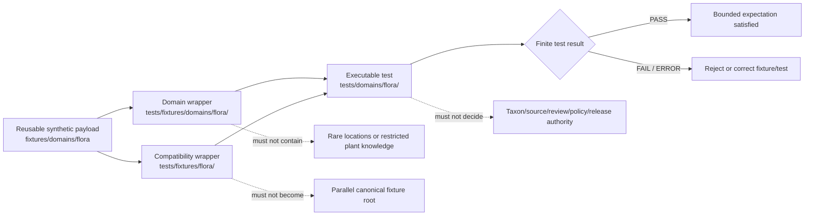

# `tests/fixtures/domains/flora/` — Flora Test-Local Fixture Routing and Rare-Plant Safety Boundary

> Repository-grounded parent contract for domain-segmented, test-local Flora fixture wrappers. This subtree may organize small synthetic manifests and expectations owned by named tests, but it does not own reusable fixture payloads, executable tests, botanical authority, occurrence truth, rare-plant locality data, source admission, policy decisions, release approval, or public artifacts.

<!-- [KFM_META_BLOCK_V2]
doc_id: kfm://doc/tests-fixtures-domains-flora-readme
title: tests/fixtures/domains/flora/README.md — Flora Test-Local Fixture Routing and Rare-Plant Safety Boundary
type: readme; directory-readme; test-local-fixture-parent; flora; sensitive-domain; routing-boundary; non-authoritative
version: v0.2
status: draft; repository-grounded; parent-only-direct-subtree; tests-fixtures-parent-confirmed; domains-parent-index-absent; compatibility-flora-fixture-parent-confirmed; compatibility-runtime-and-source-role-children-confirmed; flora-domain-test-parent-confirmed; reusable-fixture-root-confirmed; reusable-lanes-readme-backed; sampled-payloads-unverified; key-domain-schemas-permissive; policy-scaffolds; validator-index-readme-only; executable-enforcement-unestablished; ci-todo-only; deny-by-default; non-authoritative
owners: OWNER_TBD — Flora steward · Test/QA steward · Fixture steward · Botanical-taxonomy steward · Occurrence/specimen steward · Rare-plant/geoprivacy reviewer · Cultural-knowledge and rights reviewer · Source steward · Evidence steward · Policy steward · Review steward · Release steward · Correction/rollback steward · Map/UI steward · Security reviewer · CI steward · Docs steward
created: 2026-07-06
updated: 2026-07-16
supersedes: v0.1 Flora test-fixture README
policy_label: public-doc; tests; fixtures; flora; parent-boundary; test-local-only; synthetic-only; no-network-default; deny-by-default; source-role-fixed; taxonomy-not-authority; occurrence-not-truth; rare-location-denied; observer-and-steward-privacy-aware; culturally-sensitive-knowledge-aware; evidence-required; review-gated; policy-gated; release-subordinate; correction-aware; revocation-aware; rollback-aware; no-publication
current_path: tests/fixtures/domains/flora/README.md
truth_posture:
  CONFIRMED:
    - target README v0.1 and prior blob
    - tests/fixtures parent README exists and defines the test-local versus reusable fixture split
    - tests/fixtures/domains/README.md was not found at the checked path
    - bounded search surfaced only this README under tests/fixtures/domains/flora/
    - a separate compatibility parent exists at tests/fixtures/flora/ with runtime and source_role_collapse child READMEs
    - fixtures/domains/flora is the observed reusable Flora fixture root with sixteen README-backed child lanes and one planned runtime_envelopes lane
    - sampled valid, RarePlantRecord, and SourceDescriptor fixture lanes explicitly report no verified payload inventory
    - tests/domains/flora is the executable-test parent and documents source_descriptor, sensitivity, and temporal README lanes while executable coverage remains unverified
    - RarePlantRecord schema is a permissive empty-property PROPOSED scaffold
    - policy/domains/flora and policy/sensitivity/flora are PROPOSED scaffolds
    - tools/validators/domains/flora is a routing README and does not establish executable Flora enforcement
    - Makefile fixtures target is TODO and default test target excludes this subtree
    - domain-flora workflow jobs are TODO-only echo scaffolds
    - direct parent-level conftest.py, manifest_expectations.json, and representative occurrence child README are absent at named paths
  PROPOSED:
    - this parent owns domain-segmented wrapper routing, admission criteria, common invariants, child-lane taxonomy, manifest expectations, consumer-backlink rules, finite outcomes, maintenance, migration, and rollback guidance
    - test-local wrappers carry only test-specific deltas and refer to reusable Flora fixtures where possible
    - executable tests consume wrappers by reference from owning tests/domains/flora lanes
    - compatibility-only runtime and source-role-collapse wrappers remain under tests/fixtures/flora until an accepted migration decision says otherwise
  CONFLICTED:
    - v0.1 claim that tests/fixtures/README.md was absent
    - v0.1 proposed executable test modules directly inside this fixture subtree
    - domain-segmented tests/fixtures/domains/flora and compatibility tests/fixtures/flora coexist without a final canonical relationship
    - reusable Flora child READMEs describe populated lanes while sampled lanes report no verified payloads
    - rich Flora object and sensitivity doctrine versus permissive schemas, policy scaffolds, README-only validators, and unverified executable tests
    - decision_envelopes is compatibility-sensitive while runtime_envelopes remains planned
    - domain schema path guidance records domains/flora versus bare flora lineage conflict
    - source-role, fixture-home, review-state, decision-envelope, sensitivity-tier, and reason-code vocabularies require pinned adapters rather than silent normalization
  UNKNOWN:
    - exhaustive recursive payload inventory, ignored/generated files, dynamic fixture generation, and external fixture stores
    - active consumer tests and two-way backlinks
    - accepted wrapper manifest schema, reason-code registry, and object-state vocabularies
    - substantive schema coverage beyond sampled key objects
    - current pass rates, branch-protection significance, retained CI artifacts, production consumers, and release dependency
  NEEDS_VERIFICATION:
    - accepted owners and CODEOWNERS
    - whether tests/fixtures/domains/README.md should be created
    - canonical relationship between tests/fixtures/domains/flora and tests/fixtures/flora
    - exact threshold for test-local versus reusable fixture placement
    - canonical fixture IDs, versions, hashes, generator metadata, and generation receipts
    - substantive reusable payloads and executable consumers
    - no-network, no-write, no-leak, orphan, duplicate, and nonempty-coverage enforcement
    - taxonomy, occurrence, rare-plant geoprivacy, source-role, policy, review, correction, revocation, invalidation, and rollback execution
evidence_snapshot:
  repository: bartytime4life/Kansas-Frontier-Matrix
  repository_id: "1059091169"
  visibility: public
  base_ref: main
  base_commit: 0bc925d42301025dbf5e5ce08a154bbc35388bca
  target_prior_blob: 3dc7e4d8a06eac1263127dd0f3a29c51a43a01e0
  related_repository_blobs:
    directory_rules: 2affb080e6f0043867c64c7f06c1ca52030fbd55
    flora_canonical_paths: 367d40d9781387019443fbd5ca98070be543f31c
    tests_fixtures_parent: 2d0147e85eae86f687e85c5bea0d3e61f9c3a8f7
    compatibility_flora_fixture_parent: 55ad00aaf8fb68c1de19b37df05d8c15c0dd141e
    compatibility_runtime_child: 9bdd7e8bc1ca553d3b9dd450dc3b64fadc7dd9f7
    compatibility_source_role_child: 8ea1356e33eb11477c42d087ce48b5c7cad7ad80
    flora_domain_test_parent: 40411105df823911edbc662d2619389d64edb217
    reusable_flora_fixture_parent: c7c3d770e39c36be901ad100c749289c8f1e448a
    reusable_valid_readme: 0c6d50cea68e17af033b7b3636d327ec24b2c560
    reusable_rare_plant_readme: 7cf1125f1bbae68e5dcede94a9036b0fc187eb5f
    reusable_source_descriptor_readme: 78debfcfba80e53a490d8993cc9b72457351d004
    rare_plant_schema: 7d79a99c86126a4f0ba459f35469bab647e56e3b
    flora_policy_readme: b040bff13e654cff9d2f7336d6d6783c8467eaa9
    flora_sensitivity_policy_readme: 4c65abec24135f7e4467fd108e163cdce594d5f9
    flora_validator_readme: 80820ed0263641f7b70225b8db202ca35a0feace
    domain_flora_workflow: c7737001b3de3f0a1150ea467ef656a52c26b0fd
    makefile: 4dc8cf633581893d83fba53219c6ea847992e6be
  direct_lane_files_confirmed:
    - tests/fixtures/domains/flora/README.md
  compatibility_lane_files_confirmed:
    - tests/fixtures/flora/README.md
    - tests/fixtures/flora/runtime/README.md
    - tests/fixtures/flora/source_role_collapse/README.md
  checked_absent_paths:
    - tests/fixtures/domains/README.md
    - tests/fixtures/domains/flora/conftest.py
    - tests/fixtures/domains/flora/manifest_expectations.json
    - tests/fixtures/domains/flora/occurrence/README.md
notes:
  - "v0.2 corrects stale higher-parent claims and records the requested domain-segmented Flora test-local subtree as parent-only in bounded evidence."
  - "This subtree owns domain-segmented test-local wrapper routing and expectations, not executable tests or reusable payloads."
  - "A separate compatibility parent at tests/fixtures/flora owns backlog-named runtime and source-role-collapse wrapper lanes until migration is governed."
  - "The executable Flora test parent is tests/domains/flora/; the reusable payload parent is fixtures/domains/flora/."
  - "README-backed reusable lanes and illustrative filenames do not count as payload, semantic, validator, or CI coverage without exact file and consumer evidence."
  - "This revision changes documentation only and creates no fixture payload, test, schema, contract, policy, validator, workflow, source record, taxon record, occurrence record, rare-plant record, receipt, proof, release record, map artifact, API behavior, AI output, or public artifact."
[/KFM_META_BLOCK_V2] -->

<a id="top"></a>

<p>
  
  
  
  
  
  
  
  
</p>

> [!IMPORTANT]
> **This is the domain-segmented test-local wrapper parent.** Reusable Flora payloads belong under [`fixtures/domains/flora/`](../../../../fixtures/domains/flora/README.md). Executable Flora tests belong under [`tests/domains/flora/`](../../../domains/flora/README.md). Backlog-named compatibility wrappers currently live under [`tests/fixtures/flora/`](../../flora/README.md). This subtree should contain only small domain-segmented wrappers, expectation manifests, and routing documentation owned by named tests.

> [!CAUTION]
> **README lanes and illustrative names are not fixture coverage.** Sampled reusable lanes explicitly report that no payload inventory was verified. A README, planned path, permissive schema, proposed command, or green TODO workflow does not prove valid, invalid, denied, rare-plant-safe, evidence-closed, source-role-safe, renderer-safe, or release-safe behavior.

> [!WARNING]
> **Flora is sensitive by default where rare, protected, tracked, culturally sensitive, steward-controlled, or join-reidentifiable plant knowledge is involved.** Exact occurrences, locality descriptions, specimen notes, observer or collector identities, private-property clues, steward-only knowledge, culturally restricted plant knowledge, and reverse-engineerable derivatives must not appear in fixture payloads, names, snapshots, assertion messages, logs, reports, exports, or CI artifacts.

**Quick navigation:** [Status](#status-and-evidence-boundary) · [Purpose](#purpose-and-audience) · [Authority](#authority-and-directory-rules-basis) · [Surfaces](#four-fixture-and-test-surfaces) · [Inventory](#confirmed-direct-compatibility-and-reusable-inventory) · [Proposed lanes](#proposed-domain-segmented-child-lanes) · [Responsibilities](#parent-responsibilities-and-non-responsibilities) · [Flow](#fixture-routing-flow) · [Placement](#fixture-home-decision-law) · [Admission](#child-lane-and-wrapper-admission-contract) · [Manifest](#minimum-parent-and-child-manifest-contract) · [Consumers](#consumer-backlinks-orphans-and-nonempty-coverage) · [Invariants](#shared-flora-fixture-invariants) · [Objects](#object-and-authority-separation) · [Outcomes](#finite-outcomes-and-vocabulary-separation) · [Taxonomy](#taxonomy-crosswalk-and-identification-boundary) · [Occurrences](#specimen-occurrence-survey-and-evidence-boundary) · [Sensitivity](#rare-plant-geoprivacy-cultural-knowledge-and-rights) · [Source](#source-role-freshness-and-watcher-boundary) · [Communities](#vegetation-community-habitat-association-and-restoration-boundary) · [Invasive/Phenology](#invasive-plant-and-phenology-boundary) · [Public carriers](#api-map-export-cache-and-ai-boundary) · [Security](#no-network-security-and-side-effects) · [Determinism](#identity-version-hash-generation-and-replay) · [Cases](#parent-case-matrix) · [Maturity](#current-maturity-and-drift-matrix) · [Commands](#validation-commands) · [CI](#ci-and-promotion-boundary) · [Failures](#failure-interpretation) · [Passing](#what-passing-does-not-prove) · [Maintenance](#maintenance-migration-and-deprecation) · [Done](#definition-of-done) · [FAQ](#faq) · [Open](#open-verification-register) · [Evidence](#evidence-ledger) · [Rollback](#documentation-correction-and-rollback)

---

## Status and evidence boundary

> [!IMPORTANT]
> **Evidence snapshot:** `main@0bc925d42301025dbf5e5ce08a154bbc35388bca`
> **Prior target blob:** `3dc7e4d8a06eac1263127dd0f3a29c51a43a01e0`
> **Direct subtree:** this parent README only
> **Compatibility subtree:** parent plus `runtime/` and `source_role_collapse/` READMEs
> **Direct wrappers:** not established
> **Direct executable tests:** not established
> **Higher parent:** `tests/fixtures/README.md` exists; `tests/fixtures/domains/README.md` was not found

### Safe conclusion

`tests/fixtures/domains/flora/` is a valid domain-segmented, test-local fixture routing surface under the `tests/` responsibility root. It documents where future domain-specific wrappers belong and which boundaries every Flora fixture example must preserve.

It is not:

- a reusable fixture corpus;
- an executable test suite;
- a source registry or source-admission queue;
- a taxonomic authority or accepted-name registry;
- a specimen, occurrence, botanical survey, vegetation, invasive-plant, phenology, restoration, or rare-plant record store;
- a geoprivacy profile or redaction implementation;
- an evidence, receipt, policy, review, promotion, release, correction, or rollback authority;
- an API, map, tile, export, graph, cache, or AI output surface.

### Current direct inventory

```text
tests/fixtures/domains/flora/
└── README.md
```

### Current compatibility inventory

```text
tests/fixtures/flora/
├── README.md
├── runtime/
│   └── README.md
└── source_role_collapse/
    └── README.md
```

These trees are bounded readbacks of the checked snapshot. They do not prove permanent absence of ignored, generated, branch-local, dynamic, external, or differently named files.

[Back to top](#top)

---

## Purpose and audience

This parent serves maintainers who need to:

- decide whether a fixture belongs in this domain-segmented test-local surface, the compatibility surface, or the reusable Flora fixture root;
- preserve common rare-plant, cultural-knowledge, rights, source-role, evidence, and publication constraints;
- require named consumers and two-way fixture/test traceability;
- prevent README-only, permissive-schema, or proposed lanes from being presented as implemented coverage;
- coordinate migration without creating parallel fixture, contract, schema, policy, registry, or release authority;
- keep the Flora lane useful for taxonomy, occurrence, specimen, community, invasive, phenology, restoration, evidence, runtime, and public-carrier tests without collapsing those families.

The durable question is:

> Can a small synthetic Flora wrapper help a named test exercise a bounded behavior without becoming botanical truth, occurrence evidence, sensitive-locality disclosure, cultural authority, evidence closure, policy approval, release approval, or public output?

A passing wrapper check means only that the named test expectation behaved as specified for the pinned synthetic input.

[Back to top](#top)

---

## Authority and Directory Rules basis

Directory Rules state that placement encodes responsibility. The current split is:

| Responsibility | Current or proposed home | This parent’s relationship |
|---|---|---|
| Domain-segmented test-local wrappers | `tests/fixtures/domains/flora/` | Owned here. |
| Backlog-named compatibility wrappers | `tests/fixtures/flora/` | Separate compatibility surface; do not duplicate silently. |
| Executable Flora tests | `tests/domains/flora/` | Consumers; separate authority. |
| Reusable Flora payloads | `fixtures/domains/flora/` | Shared fixture corpus; separate authority. |
| Flora object meaning | `contracts/domains/flora/` | Referenced, never redefined here. |
| Machine shape | `schemas/contracts/v1/domains/flora/` and shared schema homes | Referenced, never redefined here. |
| Source, rights, sensitivity, and admissibility policy | `policy/domains/flora/`, `policy/sensitivity/flora/` | Decides obligations; fixtures do not. |
| Source registry records | accepted `data/registry/sources/flora/` layout | Real instances; never copied here. |
| Evidence and process memory | `data/proofs/`, `data/receipts/` | Trust support; fixtures use toy refs only. |
| Promotion, release, correction, rollback | `release/` | Publication authority; fixtures do not approve. |
| Runtime API/map/AI implementation | implementation roots | Tested indirectly; never implemented here. |

The Flora canonical-path register confirms the domain-as-segment law but marks concrete paths and the `domains/flora/` versus bare `flora/` schema segment as drift-prone. This README records current repository facts and does not silently resolve those questions.

[Back to top](#top)

---

## Four fixture and test surfaces

```text
reusable payload
fixtures/domains/flora/
        │
        ├──────────── referenced by ────────────┐
        ▼                                        ▼
domain-segmented wrapper                compatibility wrapper
tests/fixtures/domains/flora/           tests/fixtures/flora/
        │                                        │
        └──────────── consumed by ───────────────┘
                         ▼
executable test
tests/domains/flora/
```

| Surface | Owns | Must not own | Current checked maturity |
|---|---|---|---|
| Reusable fixture root | Shared synthetic payloads and reusable valid/invalid/object/source examples. | Test implementation, truth, policy, release. | Sixteen README-backed child lanes; sampled lanes report no verified payload inventory. |
| This domain-segmented subtree | Domain-scoped wrappers, manifests, parametrization maps, expected reason codes, and routing docs. | Reusable corpus, executable tests, authority records. | Parent README only. |
| Compatibility subtree | Backlog-named runtime and source-role-collapse wrappers. | Canonical fixture authority or general Flora fixture expansion. | Parent plus two child READMEs; payload and consumers unverified. |
| Executable test root | Tests that load fixtures and prove behavior. | Reusable payload authority, production decisions. | Parent plus three README lanes; executable coverage remains unverified. |

A wrapper is justified only when it adds a test-local expectation that does not belong in the reusable payload itself. A compatibility wrapper additionally requires a backlog, test, or migration reason that explains why it does not use the domain-segmented path.

[Back to top](#top)

---

## Confirmed direct, compatibility, and reusable inventory

### Domain-segmented test-local surface

| Path | Status | Safe conclusion |
|---|---|---|
| `tests/fixtures/domains/flora/README.md` | **CONFIRMED** | Parent routing document; direct wrappers and child lanes are unestablished. |

### Compatibility test-local surface

| Path | Status | Safe conclusion |
|---|---|---|
| `tests/fixtures/flora/README.md` | **CONFIRMED v0.1** | Compatibility parent; not canonical fixture authority. |
| `tests/fixtures/flora/runtime/README.md` | **CONFIRMED v0.1 / README-only** | Finite-outcome runtime wrapper lane; payloads and executable consumers unverified. |
| `tests/fixtures/flora/source_role_collapse/README.md` | **CONFIRMED v0.1 / README-only** | Source-role anti-collapse wrapper lane; payloads and executable consumers unverified. |

### Reusable Flora fixture root

| Lane | Documented responsibility | Checked maturity boundary |
|---|---|---|
| `golden/` | Stable expected outputs. | README-backed; payloads not verified in this task. |
| `valid/` | Positive-path synthetic inputs. | README says no payloads verified. |
| `invalid/` | Rejected or bounded non-answer examples. | README-backed; payloads not verified in this task. |
| `synthetic/` | Exploratory toy examples. | README-backed; payloads not verified in this task. |
| `source_descriptors/` | SourceDescriptor family examples. | README says no payloads verified. |
| `sources/` | Source-family fixture parent. | README-backed; payload inventory unverified. |
| `sources/plants/` | USDA PLANTS-style source examples. | README-backed; payload inventory unverified. |
| `plants_drift/` | Source drift and watcher dry-run examples. | README-backed; payload inventory unverified. |
| `plant_taxon/` | PlantTaxon and crosswalk examples. | README-backed; payload inventory unverified. |
| `flora_occurrence/` | Occurrence examples and public-safe behavior. | README-backed; payload inventory unverified. |
| `rare_plant_record/` | Restricted/public-safe rare-plant examples. | README says no payloads verified; paired schema is permissive. |
| `vegetation_community/` | Community polygon and classification examples. | README-backed; payload inventory unverified. |
| `invasive_plant_record/` | Invasive-plant observation examples. | README-backed; payload inventory unverified. |
| `phenology_observation/` | Seasonal/time-series examples. | README-backed; payload inventory unverified. |
| `evidence_bundles/` | EvidenceBundle and catalog-closure examples. | README-backed; payload inventory unverified. |
| `decision_envelopes/` | Finite-outcome decision envelope examples. | README-backed; naming remains compatibility-sensitive. |
| `runtime_envelopes/` | Runtime response envelope examples. | Planned / needs verification. |

“Populated” in an index means the child README exists. It does not prove payload files, semantic polarity, active consumers, validator execution, or current pass rates.

[Back to top](#top)

---

## Proposed domain-segmented child lanes

No direct child README is confirmed below the requested parent. The following lanes are design options only and must not be created without a responsibility and migration check.

| Proposed lane | Distinct responsibility | Must not duplicate |
|---|---|---|
| `taxonomy/` | PlantTaxon, FloraTaxonCrosswalk, synonym, unresolved-name, and accepted-name wrapper expectations. | Reusable `plant_taxon/` payloads or executable taxonomy tests. |
| `occurrence/` | Specimen, occurrence, survey, public/restricted occurrence, and uncertainty wrapper expectations. | Reusable `flora_occurrence/` payloads or production records. |
| `rare_plant/` | RarePlantRecord denial, generalized derivative, review, policy, and receipt wrapper expectations. | Reusable `rare_plant_record/` or compatibility runtime fixtures. |
| `source/` | SourceDescriptor, role, rights, freshness, admission, and watcher wrapper expectations. | Reusable source descriptor/source-family lanes or `source_role_collapse/`. |
| `evidence/` | EvidenceRef, EvidenceBundle, catalog-closure, citation, and abstention wrapper expectations. | Reusable evidence bundle payloads or proof records. |
| `community/` | VegetationCommunity, HabitatAssociation, BotanicalSurvey, and RestorationPlanting wrappers. | Reusable object-specific payloads or cross-domain authority. |
| `invasive_phenology/` | InvasivePlantRecord and PhenologyObservation wrappers. | Reusable object payloads or regulatory/operational authority. |
| `policy_release/` | Policy deny, transform/receipt, release, correction, withdrawal, and rollback wrappers. | Binding policy, release records, or compatibility runtime envelopes. |

A new child lane must demonstrate why it belongs under the domain-segmented parent rather than the compatibility parent or reusable fixture root.

[Back to top](#top)

---

## Parent responsibilities and non-responsibilities

### This parent owns

- the domain-segmented child-lane index;
- the four-surface routing law;
- shared synthetic, no-network, no-write, no-leak, and non-authority rules;
- the threshold for accepting domain-segmented wrappers once governance approves it;
- parent manifest expectations;
- consumer backlinks, orphan checks, nonempty coverage, and vacuous-pass controls;
- common finite-outcome and reason-code separation;
- explicit compatibility routing to `tests/fixtures/flora/`;
- maintenance, migration, correction, deprecation, and rollback instructions;
- explicit UNKNOWN, CONFLICTED, and NEEDS VERIFICATION registers.

### This parent does not own

- fixture payload semantics already owned by contracts and schemas;
- executable test code;
- source, taxon, specimen, occurrence, rare-plant, review, policy, evidence, receipt, or release records;
- runtime APIs, map layers, tiles, exports, graph projections, caches, or AI answers;
- botanical, cultural, stewardship, consent, consultation, or rights decisions;
- protected data or reconstruction parameters;
- canonical migration decisions for disputed paths, fixture homes, envelope names, or vocabularies.

[Back to top](#top)

---

## Fixture routing flow



The diagram is a routing model, not proof that all payloads, child executable lanes, validators, CI jobs, or release gates exist.

[Back to top](#top)

---

## Fixture-home decision law

Use the smallest correct home:

1. **Reusable across multiple tests, validators, renderers, APIs, or dry-runs?** Use an accepted `fixtures/domains/flora/` lane.
2. **Owned by one domain test area and adds only local expectations or parameters?** A `tests/fixtures/domains/flora/` wrapper may be appropriate.
3. **Named by an accepted backlog or compatibility contract as `tests/fixtures/flora/...`?** Use that compatibility lane until migration is governed.
4. **Contains executable assertions or helper code?** Use the owning `tests/domains/flora/` lane.
5. **Carries real source, registry, evidence, review, policy, receipt, release, or lifecycle state?** Use the owning governed root, not fixtures.
6. **Contains protected Flora content?** Do not place it in repository fixtures; deny, quarantine, generalize, withhold, or use conspicuous synthetic canaries.
7. **Duplicates another fixture?** Reject unless a migration note explains source, destination, checksum, consumers, compatibility period, and rollback.
8. **Uses a path only because the topic is Flora?** Re-evaluate; responsibility and lifecycle determine placement.

Never interpret a file move as a promotion, source admission, policy approval, or authority transfer.

[Back to top](#top)

---

## Child-lane and wrapper admission contract

A new child lane requires:

- a distinct test-local responsibility not already covered by an existing reusable or compatibility lane;
- at least one named proposed or confirmed executable consumer;
- a clear reusable fixture relationship;
- an explicit non-authority statement;
- synthetic/public-safe input constraints;
- positive and fail-closed case requirements;
- finite outcomes and safe reason-code expectations;
- no-network, no-governed-root-write, and no-sensitive-output rules;
- owner, deprecation, migration, and rollback expectations;
- parent index update.

A wrapper file belongs here only when:

- it is owned by a named test;
- it is too local to be a reusable fixture;
- it does not belong in an existing compatibility lane;
- it contains no real payload, credential, endpoint secret, rare-plant locality, steward-only knowledge, culturally restricted substance, observer identity, private-property clue, or production trust artifact;
- it pins its reusable fixture, schema, policy/profile, and expected outcome where applicable;
- it declares prohibited claims and side effects;
- it has a two-way consumer backlink;
- removal cannot change runtime, registry, policy, release, or public state.

README-only lanes remain routing surfaces until real payloads and consumers meet these conditions.

[Back to top](#top)

---

## Minimum parent and child manifest contract

The example below is **PROPOSED** and intentionally contains no real Flora information.

```json
{
  "fixture_manifest_id": "kfm://fixture-test/flora/example",
  "fixture_version": "v1",
  "domain": "flora",
  "fixture_scope": "test_local_domain_segmented",
  "fixture_authority": "non_authoritative",
  "synthetic": true,
  "child_lane": "rare_plant",
  "consumer_refs": [
    "tests/domains/flora/sensitivity/test_rare_location_denial.py"
  ],
  "canonical_fixture_ref": "fixtures/domains/flora/rare_plant_record/example.json",
  "compatibility_fixture_ref": null,
  "object_family": "RarePlantRecord",
  "source_role": "synthetic",
  "taxon_posture": "toy_unresolved_or_supported",
  "occurrence_posture": "synthetic_not_observation",
  "geometry_posture": "withheld_or_generalized",
  "contains_exact_geometry": false,
  "contains_reconstruction_hint": false,
  "contains_steward_only_knowledge": false,
  "contains_culturally_restricted_content": false,
  "evidence_ref": "evidence-ref:fixture:flora-example",
  "review_ref": null,
  "policy_decision_ref": null,
  "redaction_receipt_ref": null,
  "release_manifest_ref": null,
  "rollback_card_ref": "rollback-card:fixture:flora-example",
  "expected_test_outcome": "PASS",
  "expected_domain_outcome": "DENY",
  "reason_code": "SENSITIVE_FLORA_LOCATION_DENIED",
  "must_not_claim": [
    "SOURCE_ADMITTED",
    "TAXON_ACCEPTED",
    "OCCURRENCE_CONFIRMED",
    "RARE_LOCATION_PUBLIC",
    "CULTURAL_AUTHORITY_GRANTED",
    "REVIEW_COMPLETE",
    "POLICY_ALLOWED",
    "RELEASED",
    "MAP_TRUTH",
    "AI_TRUTH"
  ]
}
```

Future schema work must settle:

- identity, version, digest, generator, and supersession fields;
- domain-segmented versus compatibility wrapper posture;
- child-lane and object-family vocabularies;
- source-role, taxon, occurrence, geometry, review, policy, and release states;
- test outcomes versus runtime/domain outcomes;
- reason codes, obligations, and prohibited claims;
- correction, withdrawal, revocation, invalidation, and rollback references.

[Back to top](#top)

---

## Consumer backlinks, orphans, and nonempty coverage

Mature fixture coverage requires two-way traceability:

```text
wrapper manifest -> executable consumer
executable consumer -> wrapper manifest
```

Required checks:

- every wrapper names at least one active consumer;
- every consumer reference resolves;
- every child lane has a declared owner;
- reusable fixtures are referenced rather than copied;
- compatibility wrappers carry a backlog, test, or migration reason;
- every consequential family has at least one positive and one fail-closed case;
- placeholder paths, READMEs, or permissive schemas do not count as semantic coverage;
- zero collected cases is a failure, not a green result;
- skipped cases carry reason, owner, and expiry;
- orphaned wrappers and unused reusable fixtures are reported;
- domain-segmented, compatibility, reusable, and executable indexes remain synchronized.

A parent dashboard may summarize counts later, but counts without consumer resolution are not proof.

[Back to top](#top)

---

## Shared Flora fixture invariants

Every child and compatibility lane must preserve these invariants:

| Invariant | Required behavior | Default failure |
|---|---|---|
| Synthetic identity | Use conspicuous fake IDs, toy taxa, toy sources, and non-authority markers. | Reject fixture. |
| Fixture-home integrity | Domain, compatibility, reusable, and executable homes remain distinct. | Block admission. |
| Source-role integrity | Role is fixed at admission and cannot be silently upgraded. | `DENY` or `ABSTAIN`. |
| Taxonomy integrity | Label, synonym, crosswalk, or schema pass does not create accepted botanical authority. | `ABSTAIN` or reject. |
| Occurrence integrity | Specimen, occurrence, survey, modeled range, and synthetic record remain distinct. | `DENY` or `ABSTAIN`. |
| Rare-location denial | No real or reconstructable rare/protected locality. | Reject and escalate. |
| Cultural-knowledge deferral | KFM records and defers to named authority; fixture labels do not grant it. | Hold or deny. |
| Rights and privacy | Observer, collector, property, license, and steward constraints fail closed. | Hold, deny, or abstain. |
| Evidence separation | EvidenceRef must resolve in governed contexts; fixture ref is not proof. | `ABSTAIN`. |
| Review separation | Fixture or schema pass is not review approval. | Block consequential use. |
| Policy separation | Fixture metadata is not a PolicyDecision. | Block consequential use. |
| Receipt separation | Example transform or receipt shape is not process memory. | Block promotion/release. |
| Release separation | Fixture success is not release or publication approval. | Promotion block. |
| No-network | Default tests use local synthetic inputs only. | `ERROR`. |
| No governed-root writes | Tests write only to test-owned temporary locations. | `ERROR`. |
| Deterministic replay | Same inputs and pins yield the same bounded result. | Fail test. |
| Correction/rollback | Superseded or withdrawn fixtures invalidate consumers. | Fail and block release use. |
| Cross-domain ownership | Habitat, Fauna, Soil, Hydrology, Agriculture, Hazards, Archaeology, and People/Land refs retain their own authority. | `DENY` or drift finding. |

[Back to top](#top)

---

## Object and authority separation

Do not collapse these families:

| Family | Fixture may model | Fixture must not become |
|---|---|---|
| `PlantTaxon` | Toy identity, rank, synonym, and support posture. | Accepted taxonomy or legal/conservation status. |
| `FloraTaxonCrosswalk` | Synthetic mapping and ambiguity. | Authority merge or silent synonym resolution. |
| `SpecimenRecord` | Toy vouchered-record shape and source/evidence posture. | Real specimen, occurrence truth, or collection authority. |
| `FloraOccurrence` | Synthetic occurrence umbrella and uncertainty. | Confirmed real-world presence. |
| `OccurrenceRestricted` | Denial and steward-only handling expectation. | Repository storage of exact restricted locality. |
| `OccurrencePublic` | Generalized/public-safe derivative shape. | Proof that transformation, review, or release occurred. |
| `RarePlantRecord` | Synthetic restricted/public-safe decision scenarios. | Real rare-plant record or location authority. |
| `VegetationCommunity` | Toy classification/polygon behavior. | Official vegetation map or Habitat truth. |
| `InvasivePlantRecord` | Synthetic observation and source-role posture. | Regulatory, enforcement, or management authority. |
| `PhenologyObservation` | Toy observed/time-state behavior. | Real trend, forecast, or seasonal truth. |
| `RangePolygon` | Modeled or compiled public-safe geometry example. | Observed occurrence or canonical distribution. |
| `HabitatAssociation` | Explicit cross-domain association. | Ownership transfer from Habitat or other lanes. |
| `BotanicalSurvey` | Synthetic survey scope and completeness metadata. | Proof of site absence/presence beyond support. |
| `RestorationPlanting` | Toy project and modeled/administrative posture. | Regulatory, funding, or ecological success authority. |
| SourceDescriptor / watcher | Synthetic governance and freshness metadata. | Registry admission, source truth, or publication. |
| Evidence / receipts | Toy refs and failure expectations. | Real proof or process memory. |
| Policy / review / release | Expected gate behavior. | Binding decision or public authority. |
| API/map/AI carrier | Public-safe expected response or denial. | Runtime route, rendered truth, or authoritative answer. |

Adapters among families must be explicit, versioned, loss-aware, and tested.

[Back to top](#top)

---

## Finite outcomes and vocabulary separation

Do not force unrelated states into one enum.

| Vocabulary | Example values | Owner |
|---|---|---|
| Test result | `PASS`, `FAIL`, `SKIP`, `ERROR` | Test framework |
| Runtime result | `ANSWER`, `ABSTAIN`, `DENY`, `ERROR` | Runtime response contract |
| Policy result | `ALLOW`, `RESTRICT`, `HOLD`, `DENY`, `ABSTAIN`, `ERROR` | Policy |
| Source state | candidate, active, inactive, restricted, stale, superseded | Source governance |
| Source role | observed, regulatory, modeled, aggregate, administrative, candidate, synthetic | Source contract |
| Taxon state | unresolved, candidate, crosswalk-supported, accepted-by-named-authority | Taxonomy contract |
| Occurrence state | specimen-backed, observed, modeled, public derivative, restricted, synthetic | Flora domain |
| Review state | Domain- or governance-specific controlled values | Review contract |
| Release state | candidate, released, deprecated, withdrawn | Release |
| Lifecycle state | RAW, WORK, QUARANTINE, PROCESSED, CATALOG, TRIPLET, PUBLISHED | Lifecycle |
| Fixture posture | valid, invalid, denied, abstention, error, correction, rollback | Fixture/test contract |

Every adapter must define source value, destination value, loss behavior, unknown handling, reason code, and test coverage. Unknown values fail closed.

[Back to top](#top)

---

## Taxonomy, crosswalk, and identification boundary

Fixtures must prove:

- a taxon label is not accepted identity by itself;
- synonyms and crosswalks preserve source authority, version, confidence, ambiguity, and unresolved state;
- USDA PLANTS-, GBIF-, NatureServe-, herbarium-, and steward-derived identifiers retain their source roles;
- regulatory or conservation status is distinct from occurrence evidence;
- AI or helper-generated normalization cannot silently accept a name;
- taxonomic corrections and supersession invalidate dependent fixture expectations;
- missing or conflicted support yields abstention, hold, review, or validation failure.

No real authority list, unpublished determination, or steward-only note belongs in test fixtures.

[Back to top](#top)

---

## Specimen, occurrence, survey, and evidence boundary

Fixtures must preserve:

- `SpecimenRecord`, `FloraOccurrence`, `BotanicalSurvey`, modeled range, administrative record, and synthetic example as distinct families;
- specimen voucher, observation, determination, source, uncertainty, observed time, retrieval time, and release time as distinct fields or refs where material;
- occurrence-shaped fixture success as shape/behavior only, not real presence;
- negative survey or missing record as insufficient to claim absence unless the contract and evidence support it;
- EvidenceRef and EvidenceBundle closure for claim-like public outputs;
- exact restricted occurrence geometry denial;
- public derivatives as receipt/review/policy/release dependent;
- source-role and taxonomy qualifiers in citations and runtime text.

[Back to top](#top)

---

## Rare-plant geoprivacy, cultural knowledge, and rights

Fixtures must never contain:

- real rare, protected, tracked, or steward-controlled coordinates;
- locality descriptions, road/parcel distances, specimen collection notes, dates, habitat clues, imagery joins, or attribute combinations that reconstruct a site;
- observer, collector, landowner, permit-holder, or private-contact identities;
- culturally restricted plant knowledge, traditional knowledge, medicinal-use detail, or community-controlled information;
- real review, consultation, consent, rights, access, license, or embargo records;
- concrete transform parameters that enable reverse engineering.

Synthetic refs may test that these records are required. They do not prove that the records exist or that authority was granted.

Unknown rights, noassertion, permission-required use, stale terms, unresolved cultural authority, unreviewed rare-plant sensitivity, or missing transform/receipt state fail closed. Safe outcomes are hold, deny, abstain, quarantine, or error under pinned policy.

A negative test must not store the harmful detail it is supposed to deny. Use conspicuous fake cells, fake locality tokens, or no geometry.

[Back to top](#top)

---

## Source role, freshness, and watcher boundary

Flora fixture tests must preserve:

- source role is fixed at admission and never upgraded by promotion;
- `observed`, `regulatory`, `modeled`, `aggregate`, `administrative`, `candidate`, and `synthetic` are distinct;
- SourceDescriptor shape is not registry admission or source truth;
- source-family examples do not become live source configuration;
- watcher/source-head metadata records observation only;
- unchanged, changed, stale, retired, inactive, and superseded states remain distinct;
- a watcher cannot admit, normalize, promote, release, publish, or mutate canonical records;
- PLANTS drift or taxonomy drift fixtures require pinned before/after identity and bounded expected outcomes;
- stale or superseded support invalidates dependent outputs and triggers review;
- source-role-collapse fixtures remain in the compatibility lane unless governed migration moves them.

Source payloads and real registry records never belong in this subtree.

[Back to top](#top)

---

## Vegetation community, habitat association, and restoration boundary

Fixtures must preserve:

- `VegetationCommunity` classification, geometry, source, scale, and confidence as separate from official mapping or Habitat authority;
- `HabitatAssociation` as an explicit cross-domain relationship, not a transfer of Habitat truth into Flora;
- restoration planting records as administrative/project evidence unless observed ecological outcomes are separately supported;
- modeled suitability, community classification, planting plan, and observed occurrence as distinct roles;
- public polygons as generalized, released, and side-channel reviewed;
- corrections to classifications, boundaries, ownership, or source state as invalidating dependent outputs.

[Back to top](#top)

---

## Invasive plant and phenology boundary

Fixtures must preserve:

- invasive-plant observation, regulatory listing, administrative response, and modeled spread as distinct;
- private-parcel and reporter details as sensitive or restricted where applicable;
- no automatic legal, enforcement, treatment, or management advice from fixture success;
- phenology observed time, valid interval, retrieval time, release time, and correction time as distinct;
- synthetic flowering or seasonal patterns as test data, not real trend or forecast;
- climate, habitat, hydrology, agriculture, or management context as governed joins with preserved ownership;
- stale, sparse, conflicted, or modeled support as visibly bounded.

[Back to top](#top)

---

## API, map, export, cache, and AI boundary

All public-carrier wrappers must prove:

- normal clients use governed interfaces or released artifacts;
- no direct RAW, WORK, QUARANTINE, PROCESSED, registry, proof, receipt, or release-store reads;
- exact/internal rare-plant geometry does not reach ordinary clients;
- source role, taxon uncertainty, occurrence posture, sensitivity, evidence, review, freshness, and release state remain visible;
- Evidence Drawer or citation refs do not become evidence themselves;
- cache keys and cached values honor release, correction, withdrawal, and rollback state;
- screenshots, print views, downloads, exports, search, graph edges, and offline packages are publication surfaces;
- runtime outputs use exactly one finite outcome and a safe reason code;
- AI retrieves released evidence and policy context before answering;
- generated language cannot become evidence, taxonomic authority, review, policy, release, or cultural authority;
- denied and abstained states expose safe reasons without blocked values.

Compatibility runtime fixtures may model these expectations, but they do not prove route, DTO, UI, renderer, or model implementation.

[Back to top](#top)

---

## No-network, security, and side effects

Default fixture execution is hermetic:

- no live source APIs, connectors, watchers, herbarium services, biodiversity aggregators, geocoders, map/tile services, public APIs, archives, databases, file shares, cloud buckets, or AI runtimes;
- no direct reads from lifecycle, registry, catalog, proof, receipt, release, or published stores;
- no writes outside test-owned temporary directories;
- no credentials, private endpoints, production logs, telemetry, unpublished source terms, or steward contact data;
- bounded input size and recursion depth;
- safe parsing of untrusted text and structured data;
- sanitized diagnostics with no protected identifiers or payload excerpts;
- stable timeout and resource limits;
- explicit cleanup of temporary artifacts.

Any unknown network or governed-root write behavior is `ERROR` and fails closed.

[Back to top](#top)

---

## Identity, version, hash, generation, and replay

Every substantive wrapper should eventually record:

- stable fixture ID and version;
- fixture surface: domain-segmented or compatibility;
- child lane and object family;
- reusable fixture reference and immutable digest;
- schema, contract, policy/profile, source-descriptor, and envelope versions;
- generator name and version, or hand-authored declaration;
- deterministic seed and clock posture where material;
- expected test, runtime, and domain outcomes;
- safe reason code and obligations;
- consumer refs;
- supersedes/superseded-by refs;
- correction, withdrawal, revocation, and rollback refs;
- content hash and manifest hash.

Hashes must never encode or leak restricted content. Replay success proves deterministic reproduction of the fixture, not botanical or real-world truth.

[Back to top](#top)

---

## Parent case matrix

| Case family | Parent expectation | Required failure example |
|---|---|---|
| Surface routing | Domain, compatibility, reusable, and executable homes are explicit. | Wrapper duplicated or placed without responsibility basis. |
| Child inventory | All confirmed child READMEs indexed exactly once. | Missing, duplicate, or stale entry. |
| Consumer linkage | Every wrapper has a live consumer backlink. | Orphan wrapper or unresolved test ref. |
| Nonempty coverage | Consequential family has positive and fail-closed cases. | Zero cases, README-only, or permissive-schema-only coverage reported as green. |
| Taxonomy | Authority, version, synonym, confidence, and unresolved state remain explicit. | Label silently accepted or crosswalk collapses authority. |
| Source role | Role remains fixed and bounded. | Regulatory/model/aggregate/candidate used as observed truth. |
| Specimen/occurrence | Family, uncertainty, source, and time remain explicit. | Synthetic or modeled record treated as confirmed occurrence. |
| Rare plant | Exact/reconstructable locality denied. | Coordinates, locality, collection notes, or side-channel leak. |
| Cultural knowledge | Named authority and access posture remain external. | Fixture label inferred as consent or authority. |
| Evidence | Claim-like output requires resolvable synthetic support expectations. | Fixture metadata treated as EvidenceBundle. |
| Review/policy | Pinned synthetic refs and fail-closed behavior. | Filename or schema pass treated as approval. |
| Geoprivacy/receipt | Public derivative requires named transform and expected receipt closure. | Styling or generalized name treated as transform proof. |
| Public carrier | Governed/released synthetic output only. | Direct internal read, stale cache, or hidden rare location. |
| Correction/rollback | Invalidation reaches all dependent expectations. | Withdrawn or superseded fixture remains active. |
| Hermeticity | Local deterministic execution. | Network, external service, secret, or governed-root write. |
| Diagnostics | Safe finite reason codes. | Payload, protected locality, endpoint, token, or cultural detail in error output. |

[Back to top](#top)

---

## Current maturity and drift matrix

| Surface | Confirmed current posture | Open risk |
|---|---|---|
| Requested parent | v0.1 before this revision; direct subtree parent-only. | Stale higher-parent claim and proposed tests inside fixture lane. |
| Compatibility parent | v0.1 plus `runtime/` and `source_role_collapse/` READMEs. | Parallel test-local topology and unverified payloads/consumers. |
| Higher test-fixture parent | Exists and defines test-local versus reusable split. | `tests/fixtures/domains/README.md` remains absent. |
| Executable Flora test parent | README plus source_descriptor, sensitivity, temporal README lanes. | Executable coverage, collection, and pass rates unverified. |
| Reusable Flora fixture parent | Sixteen README-backed child lanes; one planned lane. | Sampled lanes report no verified payloads; indexes can overstate maturity. |
| Valid fixtures | Detailed README. | No verified payload inventory. |
| RarePlantRecord | Rich semantic contract and detailed fixture README. | Paired schema is empty-property permissive scaffold; no verified payloads. |
| Source descriptors | Detailed fixture README and source governance docs. | No verified payloads or active consumers in sampled lane. |
| Decision/runtime envelopes | Decision lane README exists; runtime lane planned; compatibility runtime lane exists. | Naming and home relationship unsettled. |
| Flora policies | Domain and sensitivity READMEs exist. | Both are PROPOSED scaffolds; runtime enforcement unestablished. |
| Flora validator index | Detailed routing README. | No child lanes or executables established by the index. |
| Domain schemas | Many named schema files exist. | Sampled high-risk schema is permissive; exhaustive maturity unknown. |
| Makefile | `fixtures` target exists. | Target is TODO; default `test` excludes this subtree. |
| Flora workflow | Triggered on PR/push. | Jobs only echo TODO commands. |
| Branch protection | UNKNOWN. | Green optional checks may not gate promotion. |

The parent must preserve these differences instead of flattening all Flora documentation into either “implemented” or “missing.”

[Back to top](#top)

---

## Validation commands

### Confirmed inventory commands for a local checkout

```bash
find tests/fixtures/domains/flora -maxdepth 3 -type f | sort
find tests/fixtures/flora -maxdepth 3 -type f | sort
find tests/domains/flora -maxdepth 3 -type f | sort
find fixtures/domains/flora -maxdepth 3 -type f | sort
```

### Proposed future executable command

```bash
python -m pytest tests/domains/flora -q
```

This command is **PROPOSED / NEEDS VERIFICATION** until executable collection and dependencies are confirmed. Executable assertions should not be placed under either fixture surface merely to make `pytest tests/fixtures/...` collect something.

A future parent runner must fail when:

- zero cases are collected;
- only READMEs, planned paths, or permissive schemas are present;
- direct, compatibility, reusable, and executable indexes diverge;
- wrappers lack consumers;
- reusable fixtures are duplicated;
- unknown vocabularies or unpinned schemas/policies occur;
- sensitive or reconstructable content is detected;
- network or governed-root writes occur.

[Back to top](#top)

---

## CI and promotion boundary

Current checked repository behavior:

- `make fixtures` prints a TODO message;
- `make test` runs only `tests/schemas` and `tests/contracts`;
- the `domain-flora` workflow checks out the repository and echoes TODO commands;
- no parent-level retained fixture inventory, no-leak report, orphan report, compatibility-drift report, or coverage artifact was established;
- required-check and branch-protection status is UNKNOWN.

A future CI gate should emit a deterministic report containing:

- snapshot commit;
- domain-segmented, compatibility, reusable, and executable inventories;
- wrapper and consumer counts;
- reusable fixture refs and digest checks;
- positive/fail-closed counts by family;
- orphan, duplicate, and compatibility findings;
- rare-location, cultural-knowledge, privacy, and no-network findings;
- schema, source-descriptor, policy/profile, and envelope pins;
- finite outcomes and safe reason codes;
- correction/rollback checks;
- overall pass/fail status.

A green CI result remains subordinate to evidence, policy, review, promotion, release, correction, and rollback authority.

[Back to top](#top)

---

## Failure interpretation

| Failure | Meaning | Safe response |
|---|---|---|
| Parent/child or surface drift | Documentation inventory is unreliable. | Block promotion of fixture changes. |
| Wrapper has no consumer | Fixture is orphaned or speculative. | Reject or move to documented proposal. |
| Reusable payload copied locally | Fixture authority is drifting. | Remove duplicate and migrate refs. |
| Compatibility lane used without reason | Parallel path is expanding silently. | Reject or record migration decision. |
| Zero, README-only, or permissive-schema-only cases | Coverage is vacuous. | Fail suite. |
| Unknown source/taxon/object/review/outcome value | Contract drift or unsupported value. | `ERROR`; fail closed. |
| Rare, private, or culturally restricted detail | Sensitive-content boundary failed. | Reject, remove, and escalate safely. |
| Missing evidence/review/policy/receipt/release refs | Consequential expected output unsupported. | `DENY` or `ABSTAIN`. |
| Network or governed-root write | Hermeticity failed. | `ERROR`; block. |
| Stale/superseded fixture still active | Invalidation failed. | Fail and block release use. |
| Unsafe diagnostics | Error channel leaks restricted content. | Suppress output and treat as security failure. |

Failures must be reproducible and safe to retain. Do not include restricted payload excerpts in reports.

[Back to top](#top)

---

## What passing does not prove

Passing wrapper and fixture tests do not prove:

- a source is admitted, active, reachable, current, or authoritative;
- a plant name, synonym, taxon, conservation status, or regulatory status is accepted;
- a specimen, occurrence, survey result, range, community, invasive record, or phenology observation is true;
- a rare/protected location, boundary, date, association, or interpretation is accurate or public;
- rights, consent, consultation, stewardship, or cultural authority are current;
- evidence, review, policy, transform, receipt, promotion, or release gates are complete;
- an API route, map layer, tile, export, cache, graph, Evidence Drawer, Focus answer, or AI response is implemented or publishable;
- production correction, withdrawal, revocation, invalidation, or rollback has propagated;
- branch protection requires the checks;
- the repository contains a complete fixture corpus.

Passing proves only the named tests satisfied pinned expectations for synthetic inputs.

[Back to top](#top)

---

## Maintenance, migration, and deprecation

When changing this parent or a related Flora fixture surface:

1. inspect current domain, compatibility, executable-test, and reusable-fixture inventories;
2. verify Directory Rules, Flora canonical paths, and relevant ADR/drift entries;
3. name the owner and consumers;
4. choose the smallest correct fixture home;
5. keep inputs synthetic and public-safe;
6. pin schema, contract, source descriptor, policy/profile, generator, and expected outcomes;
7. add positive and fail-closed cases;
8. update two-way backlinks;
9. run no-network, no-write, no-leak, orphan, duplicate, compatibility, and nonempty checks;
10. update every affected parent and child index together;
11. document correction, supersession, withdrawal, revocation, invalidation, and rollback effects.

Any path, filename, object-name, fixture-home, envelope, profile, source-role, taxon, review, or outcome-vocabulary consolidation requires:

- full inbound-reference and payload inventory;
- declared source and destination authority;
- checksums and consumer updates;
- compatibility period or explicit breaking-change notice;
- deprecation marker;
- migration receipt or note;
- rollback target;
- ADR when authority or compatibility changes materially.

Never silently move a fixture and infer that governance moved with it.

[Back to top](#top)

---

## Definition of done

This parent is not mature until all applicable items are satisfied.

- [ ] owners and CODEOWNERS are confirmed;
- [ ] the `tests/fixtures/domains/` parent decision is accepted;
- [ ] the domain-segmented versus compatibility Flora fixture relationship is accepted;
- [ ] child-lane admission criteria are approved;
- [ ] a machine-checkable parent/child manifest contract exists;
- [ ] all reusable and test-local lanes have substantive payloads or are explicitly documentation-only;
- [ ] executable consumers and two-way backlinks exist;
- [ ] reusable fixture refs and digests are pinned;
- [ ] positive and fail-closed case families are nonempty;
- [ ] zero-case, README-only, permissive-schema-only, orphan, duplicate, and compatibility checks fail closed;
- [ ] source-role, taxonomy, specimen/occurrence, and modeled/observed anti-collapse tests pass;
- [ ] rights, cultural authority, privacy, and review tests fail closed;
- [ ] rare-location, side-channel, join-reidentification, and reconstruction tests pass;
- [ ] evidence, policy, transform/receipt, promotion, release, correction, and rollback closure is tested;
- [ ] no-network and no-governed-root-write controls are enforced;
- [ ] CI emits a retained deterministic report;
- [ ] required-check significance is verified;
- [ ] migration, correction, deprecation, and rollback instructions are current.

Until then, this README is a routing and safety contract, not proof of implemented fixture coverage.

[Back to top](#top)

---

## FAQ

### Why are there both `tests/fixtures/domains/flora/` and `tests/fixtures/flora/`?

The domain-segmented path follows the general domain placement pattern. The bare compatibility path is named by Flora verification-backlog work for runtime and source-role-collapse fixture sets. Both are test-local, neither is reusable fixture authority, and their final relationship requires a governed migration decision.

### Why are executable tests not stored beside these wrappers?

Executable assertions belong under `tests/domains/flora/`. Keeping test code separate prevents fixture directories from becoming second implementation or authority surfaces.

### Do the many reusable Flora child READMEs prove a complete fixture corpus?

No. They prove lane documentation. Sampled child READMEs explicitly state that no payload inventory was verified, and several paired schemas remain permissive scaffolds.

### Can a real rare-plant location be used as a negative fixture?

No. Use conspicuous synthetic cells, fake locality tokens, or no geometry. A negative test must not store the harmful detail it is supposed to deny.

### Can a fixture include real steward, collector, landowner, cultural, consent, or review records?

No. It may include a toy reference that tests a required dependency, but real restricted process and identity records remain in governed stores.

### Does a schema-valid fixture prove release readiness?

No. Shape validation is one layer. Meaning, source role, evidence, rights, sensitivity, review, policy, transformation/receipt, promotion, release, correction, and rollback remain separate.

### Where should runtime finite-outcome fixtures go?

The currently documented compatibility lane is `tests/fixtures/flora/runtime/`. Do not create a competing domain-segmented runtime lane until the compatibility relationship is deliberately resolved.

[Back to top](#top)

---

## Open verification register

| ID | Question | Status |
|---|---|---|
| FLORA-FIX-PARENT-001 | Who owns this parent and which CODEOWNERS rule applies? | NEEDS VERIFICATION |
| FLORA-FIX-PARENT-002 | Should `tests/fixtures/domains/README.md` be created? | NEEDS VERIFICATION |
| FLORA-FIX-PARENT-003 | Which Flora test-local parent is canonical: domain-segmented, compatibility, or a deliberate split? | CONFLICTED / NEEDS VERIFICATION |
| FLORA-FIX-PARENT-004 | What exact rule separates domain wrappers, compatibility wrappers, and reusable fixtures? | NEEDS VERIFICATION |
| FLORA-FIX-PARENT-005 | What schema defines parent and child manifests? | UNKNOWN |
| FLORA-FIX-PARENT-006 | What are canonical fixture ID, version, digest, and generator rules? | NEEDS VERIFICATION |
| FLORA-FIX-PARENT-007 | Which proposed domain-segmented child lanes should exist? | NEEDS VERIFICATION |
| FLORA-FIX-PARENT-008 | Which reusable payload files currently exist and are substantive? | UNKNOWN |
| FLORA-FIX-PARENT-009 | Which executable tests consume each reusable or test-local lane? | UNKNOWN |
| FLORA-FIX-PARENT-010 | How are backlinks, orphans, duplicates, compatibility, and zero-case coverage enforced? | NEEDS VERIFICATION |
| FLORA-FIX-PARENT-011 | Which schemas are substantive rather than permissive scaffolds? | UNKNOWN |
| FLORA-FIX-PARENT-012 | Is `domains/flora/` the accepted schema segment, and what migration applies to bare Flora paths? | CONFLICTED |
| FLORA-FIX-PARENT-013 | What adapter relates DecisionEnvelope and RuntimeResponseEnvelope fixture families? | NEEDS VERIFICATION |
| FLORA-FIX-PARENT-014 | What source-role and source-state vocabularies are canonical for Flora fixtures? | NEEDS VERIFICATION |
| FLORA-FIX-PARENT-015 | What taxon identity, synonym, crosswalk, confidence, and unresolved-state vocabularies apply? | NEEDS VERIFICATION |
| FLORA-FIX-PARENT-016 | How are SpecimenRecord, FloraOccurrence, OccurrencePublic, and OccurrenceRestricted related? | NEEDS VERIFICATION |
| FLORA-FIX-PARENT-017 | What constitutes a substantive RarePlantRecord positive and fail-closed fixture? | UNKNOWN |
| FLORA-FIX-PARENT-018 | Where is the accepted Flora geoprivacy profile catalog and activation process? | UNKNOWN |
| FLORA-FIX-PARENT-019 | What tier/rank, precision, audience, and transformation vocabularies are accepted? | NEEDS VERIFICATION |
| FLORA-FIX-PARENT-020 | Which schemas/validators enforce redaction, aggregation, and receipts substantively? | NEEDS VERIFICATION |
| FLORA-FIX-PARENT-021 | How are culturally sensitive plant knowledge, consultation, consent, and authority represented safely? | NEEDS VERIFICATION |
| FLORA-FIX-PARENT-022 | How are observer, collector, landowner, permit, and private-property privacy rules tested? | NEEDS VERIFICATION |
| FLORA-FIX-PARENT-023 | How is watcher non-publisher behavior enforced? | NEEDS VERIFICATION |
| FLORA-FIX-PARENT-024 | Which cross-domain join canaries are required for Habitat, Fauna, Soil, Hydrology, Agriculture, Hazards, Archaeology, and People/Land? | UNKNOWN |
| FLORA-FIX-PARENT-025 | Which Flora-specific API, map, Evidence Drawer, Focus, and export envelopes are implemented? | UNKNOWN |
| FLORA-FIX-PARENT-026 | What no-leak, side-channel, and reconstruction-risk suite is required? | UNKNOWN |
| FLORA-FIX-PARENT-027 | How are taxonomy/source/evidence corrections and supersession propagated? | NEEDS VERIFICATION |
| FLORA-FIX-PARENT-028 | How are withdrawal, revocation, cache invalidation, and rollback propagated? | NEEDS VERIFICATION |
| FLORA-FIX-PARENT-029 | Which workflow produces the Flora fixture report? | UNKNOWN |
| FLORA-FIX-PARENT-030 | Is any Flora fixture suite required by branch protection? | UNKNOWN |

[Back to top](#top)

---

## Evidence ledger

| Evidence | Status | Supports | Does not prove |
|---|---|---|---|
| Directory Rules | CONFIRMED doctrine | Responsibility-root placement and no parallel authority. | Current implementation maturity. |
| Flora canonical paths | CONFIRMED draft register | Domain placement law, concrete path conflict, source-role invariant. | Final path migration decision. |
| Target v0.1 README | CONFIRMED prior content | Existing purpose, safety intent, and stale claims. | Current parent accuracy or coverage. |
| `tests/fixtures/README.md` | CONFIRMED | Test-local versus reusable fixture split. | Domain-parent or child payload maturity. |
| `tests/fixtures/domains/README.md` check | CONFIRMED bounded absence | Named higher index was absent at the pinned ref. | Permanent or historical absence. |
| `tests/fixtures/flora/README.md` | CONFIRMED compatibility parent | Runtime and source-role-collapse compatibility topology. | Payloads or executable coverage. |
| Compatibility child READMEs | CONFIRMED | Finite-outcome and source-role anti-collapse intent. | Payloads, reason-code wiring, or CI. |
| `tests/domains/flora/README.md` | CONFIRMED draft | Executable test authority and proposed proof matrix. | Executable files or pass rates. |
| `fixtures/domains/flora/README.md` | CONFIRMED draft | Reusable fixture root and documented child lanes. | Complete or substantive payload inventory. |
| Sampled valid/rare/source fixture READMEs | CONFIRMED | Detailed lane contracts and explicit no-payload verification statements. | Permanent absence or all-lane status. |
| RarePlantRecord schema | CONFIRMED permissive PROPOSED scaffold | Paired schema path exists. | Field-level or sensitivity enforcement. |
| Flora policy READMEs | CONFIRMED PROPOSED scaffolds | Intended policy homes exist. | Binding policy or runtime evaluation. |
| Flora validator README | CONFIRMED routing index | Intended validator families and fail-closed posture. | Executables or validator reports. |
| Makefile | CONFIRMED | Current `fixtures` TODO and default test scope. | Future runner or branch protection. |
| `domain-flora` workflow | CONFIRMED TODO-only | Trigger and scaffold status. | Substantive validation or release gate. |
| Parent-level 404 checks | CONFIRMED bounded | Named manifest/harness/child files absent. | Exhaustive subtree absence. |
| Bounded repository search | CONFIRMED search | Requested parent-only and compatibility topology surfaced. | Ignored, generated, dynamic, external, or unindexed files. |

[Back to top](#top)

---

## Documentation correction and rollback

This is a documentation-only revision.

Before merge, rollback means leaving the draft pull request unmerged or adding a transparent revert commit. After merge, use a transparent revert commit or revert pull request; do not reset or force-push shared history.

Rollback is required if this README:

- is mistaken for fixture payload, test implementation, taxon/source/occurrence/review/policy/evidence/release, or publication authority;
- directs executable tests into either fixture subtree;
- encourages storage of real source data, rare locations, steward-only or culturally restricted knowledge, private identities, credentials, or production trust artifacts;
- treats README presence, planned paths, permissive schemas, filenames, map styling, or generated prose as semantic proof;
- collapses source, taxon, specimen, occurrence, range, review, policy, receipt, promotion, release, runtime, or lifecycle states;
- silently selects a disputed path, compatibility relationship, object name, envelope, fixture home, profile, or vocabulary;
- weakens rights, cultural authority, privacy, rare-plant sensitivity, correction, revocation, invalidation, or rollback safeguards;
- hides parent-only status, missing consumers, unverified reusable payloads, permissive schemas, policy scaffolds, README-only validators, TODO Makefile behavior, or TODO-only CI.

**No-loss assessment:** v0.2 preserves the v0.1 synthetic-only, no-network, source-role, taxonomy, occurrence, rare-location, evidence, review, policy, release, correction, withdrawal, and rollback boundaries. It corrects stale parent-presence claims, separates four fixture/test surfaces, records the compatibility topology, removes executable-test placement from the fixture parent, exposes README-only and permissive-schema risks, and makes future implementation and migration requirements inspectable.

[Back to top](#top)
