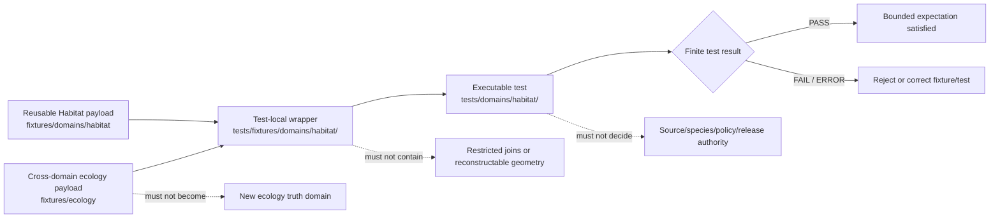

# `tests/fixtures/domains/habitat/` — Habitat Test-Local Fixture Routing and Sensitive-Join Safety Boundary

> Repository-grounded parent contract for domain-segmented, test-local Habitat fixture wrappers. This subtree may organize small synthetic manifests and expectations owned by named tests, but it does not own reusable fixture payloads, executable tests, Habitat truth, species-occurrence truth, sensitive joined geometry, source admission, policy decisions, release approval, or public artifacts.

<!-- [KFM_META_BLOCK_V2]
doc_id: kfm://doc/tests-fixtures-domains-habitat-readme
title: tests/fixtures/domains/habitat/README.md — Habitat Test-Local Fixture Routing and Sensitive-Join Safety Boundary
type: readme; directory-readme; test-local-fixture-parent; habitat; sensitive-join-domain; routing-boundary; non-authoritative
version: v0.2
status: draft; repository-grounded; parent-only-direct-subtree; tests-fixtures-parent-confirmed; domains-parent-index-absent; no-bare-habitat-test-fixture-parent-found; habitat-domain-test-parent-confirmed; reusable-habitat-fixture-root-confirmed; cross-domain-ecology-fixture-root-confirmed; reusable-lanes-readme-backed; sampled-payloads-unverified; sampled-schema-permissive; habitat-policy-scaffold; habitat-sensitivity-policy-readme-absent; validator-index-overlap-visible; executable-enforcement-unestablished; ci-todo-only; fail-closed; non-authoritative
owners: OWNER_TBD — Habitat steward · Test/QA steward · Fixture steward · Land-cover steward · Ecoregion steward · Suitability/model steward · Connectivity/corridor steward · Habitat–Fauna/Flora geoprivacy reviewer · Source steward · Rights steward · Evidence steward · Policy steward · Review steward · Release steward · Correction/rollback steward · Map/UI steward · Security reviewer · CI steward · Docs steward
created: 2026-07-06
updated: 2026-07-16
supersedes: v0.1 Habitat test-fixture README
policy_label: public-doc; tests; fixtures; habitat; parent-boundary; test-local-only; synthetic-only; no-network-default; fail-closed; source-role-fixed; model-not-observation; context-not-species-truth; sensitive-join-denied; produced-geometry-reviewed; evidence-required; review-gated; policy-gated; release-subordinate; correction-aware; revocation-aware; rollback-aware; no-publication
current_path: tests/fixtures/domains/habitat/README.md
truth_posture:
  CONFIRMED:
    - target README v0.1 and prior blob
    - tests/fixtures parent README exists and defines the test-local versus reusable fixture split
    - tests/fixtures/domains/README.md was not found at the checked path
    - bounded search surfaced only this README under tests/fixtures/domains/habitat/
    - bounded search did not surface a tests/fixtures/habitat compatibility parent
    - fixtures/domains/habitat is the reusable Habitat fixture root with twelve README-backed child lanes
    - fixtures/ecology is a separate cross-domain reusable ecology fixture root
    - sampled land-cover observation, invalid, and Habitat-Fauna thin-slice lanes explicitly report no verified payload inventory
    - tests/domains/habitat is the executable-test parent with extensive README coverage while executable pass evidence remains unverified
    - sampled LandCoverObservation schema is a permissive empty-property PROPOSED scaffold
    - policy/domains/habitat is a PROPOSED scaffold
    - policy/sensitivity/habitat/README.md was absent at the checked path
    - tools/validators/domains/habitat and tools/validators/habitat are routing READMEs with overlapping responsibilities
    - tools/validators/geoprivacy/habitat-fauna is a shared cross-domain routing README; executable behavior remains unverified
    - Makefile fixtures target is TODO and default test target excludes this subtree
    - domain-habitat workflow jobs are TODO-only echo scaffolds
    - direct parent-level conftest.py, manifest_expectations.json, representative test module, and land_cover child README are absent at named paths
  PROPOSED:
    - this parent owns domain-segmented wrapper routing, admission criteria, common invariants, proposed child-lane taxonomy, manifest expectations, consumer-backlink rules, finite outcomes, maintenance, migration, and rollback guidance
    - test-local wrappers carry only test-specific deltas and refer to reusable Habitat fixtures where possible
    - executable tests consume wrappers by reference from owning tests/domains/habitat lanes
    - cross-domain examples use fixtures/ecology only when no single domain owns the fixture responsibility
  CONFLICTED:
    - v0.1 claim that tests/fixtures/README.md was absent
    - v0.1 proposed executable test modules directly inside this fixture subtree
    - reusable Habitat child READMEs describe populated lanes while sampled lanes report no verified payloads
    - rich Habitat contracts and doctrine versus permissive schemas, policy scaffolds, README-only validators, and unverified executable tests
    - fixtures/domains/habitat and fixtures/ecology require an explicit single-domain versus cross-domain placement threshold
    - per-domain, broad Habitat, Habitat-facing Fauna adapter, and shared Habitat-Fauna geoprivacy validator surfaces overlap
    - policy/sensitivity/habitat is repeatedly referenced but its README was absent at the checked path
    - schema path guidance records segmented domains/habitat versus flat habitat lineage conflict
    - source-role, object-family, fixture-home, sensitivity, review, decision-envelope, and reason-code vocabularies require pinned adapters rather than silent normalization
  UNKNOWN:
    - exhaustive recursive payload inventory, ignored/generated files, dynamic fixture generation, and external fixture stores
    - active consumer tests and two-way backlinks
    - accepted wrapper manifest schema, reason-code registry, object-state vocabularies, and transform-profile catalog
    - substantive schema coverage beyond the sampled land-cover observation schema
    - current pass rates, branch-protection significance, retained CI artifacts, production consumers, and release dependency
  NEEDS_VERIFICATION:
    - accepted owners and CODEOWNERS
    - whether tests/fixtures/domains/README.md should be created
    - exact threshold for test-local versus reusable fixture placement
    - exact threshold for domain Habitat fixtures versus cross-domain ecology fixtures
    - canonical fixture IDs, versions, hashes, generator metadata, and generation receipts
    - substantive reusable payloads and executable consumers
    - no-network, no-write, no-leak, orphan, duplicate, and nonempty-coverage enforcement
    - land-cover, ecoregion, model/observation, sensitive-join, geoprivacy, source-role, policy, review, correction, revocation, invalidation, and rollback execution
evidence_snapshot:
  repository: bartytime4life/Kansas-Frontier-Matrix
  repository_id: "1059091169"
  visibility: public
  base_ref: main
  base_commit: d4da1d8bd25fac0255c87ea4d05e2e4c2f5a2fd3
  target_prior_blob: dc146a2faf2c2552982432b0451c2a1d699c499d
  related_repository_blobs:
    directory_rules: 2affb080e6f0043867c64c7f06c1ca52030fbd55
    habitat_canonical_paths: 837aa111f70b8df678b5545c72f92c1fdca73b66
    tests_fixtures_parent: 2d0147e85eae86f687e85c5bea0d3e61f9c3a8f7
    habitat_domain_test_parent: 4503de9bcb1c92db45012d897d647fb39a9f7172
    reusable_habitat_fixture_parent: 674c5acf8c2f1739762625e392616ce1034de0e6
    reusable_ecology_fixture_parent: 87429df46f7660029557923f6aeb698a42e89759
    habitat_observation_fixture_readme: 3fd94187306a17b173f4486fc9008c9942c91a0d
    habitat_invalid_fixture_readme: 1b947dabe0d472964dc4d5ea6acaf1da60cdc87d
    habitat_fauna_fixture_readme: c3e46354c0dca886ab4989baf3fc49fd5a3a7297
    habitat_observation_schema: a11cb4111fd763b30fa0343b7fa379da492639b8
    habitat_policy_readme: 8456c65196354695b8eb5b8178ecb61cfc12b7dd
    habitat_domain_validator_readme: 95fc76eb4388327838f773af7bfab3c11e924f82
    habitat_broad_validator_readme: 0508099634ba079f1d01d4a2d91ff291052a480d
    habitat_fauna_geoprivacy_validator_readme: d5793421bdf91a4ddd256c3556bddbce51901eaa
    domain_habitat_workflow: 5fbc81145fe0c85026c9235dc5c79c72d17e6c
    makefile: 4dc8cf633581893d83fba53219c6ea847992e6be
  direct_lane_files_confirmed:
    - tests/fixtures/domains/habitat/README.md
  reusable_lane_readmes_confirmed:
    - fixtures/domains/habitat/ecoregions/README.md
    - fixtures/domains/habitat/golden/README.md
    - fixtures/domains/habitat/invalid/README.md
    - fixtures/domains/habitat/habitat_fauna_thin_slice/README.md
    - fixtures/domains/habitat/land_cover/change_summary/README.md
    - fixtures/domains/habitat/land_cover/class_scheme/README.md
    - fixtures/domains/habitat/land_cover/crosswalk/README.md
    - fixtures/domains/habitat/land_cover/layer_manifest/README.md
    - fixtures/domains/habitat/land_cover/model_run/README.md
    - fixtures/domains/habitat/land_cover/observation/README.md
    - fixtures/domains/habitat/land_cover/uncertainty/README.md
    - fixtures/domains/habitat/land_cover/watcher/README.md
  checked_absent_paths:
    - tests/fixtures/domains/README.md
    - tests/fixtures/habitat/README.md
    - tests/fixtures/domains/habitat/conftest.py
    - tests/fixtures/domains/habitat/manifest_expectations.json
    - tests/fixtures/domains/habitat/test_parent_fixture_manifest_shape.py
    - tests/fixtures/domains/habitat/land_cover/README.md
    - policy/sensitivity/habitat/README.md
notes:
  - "v0.2 corrects stale higher-parent claims and records the requested Habitat test-local subtree as parent-only in bounded evidence."
  - "This subtree owns domain-segmented test-local wrapper routing and expectations, not executable tests or reusable payloads."
  - "The executable Habitat test parent is tests/domains/habitat/; the reusable Habitat payload parent is fixtures/domains/habitat/."
  - "Cross-domain ecology examples may use fixtures/ecology/ only when no single domain owns the fixture responsibility."
  - "README-backed reusable lanes, illustrative filenames, permissive schemas, and routing indexes do not count as payload, semantic, validator, or CI coverage without exact file and consumer evidence."
  - "This revision changes documentation only and creates no fixture payload, test, schema, contract, policy, validator, workflow, source record, Habitat object, species record, receipt, proof, release record, map artifact, API behavior, AI output, or public artifact."
[/KFM_META_BLOCK_V2] -->

<a id="top"></a>

<p>
  
  
  
  
  
  
  
  
</p>

> [!IMPORTANT]
> **This is the domain-segmented test-local wrapper parent.** Reusable Habitat payloads belong under [`fixtures/domains/habitat/`](../../../../fixtures/domains/habitat/README.md). Executable Habitat tests belong under [`tests/domains/habitat/`](../../../domains/habitat/README.md). Cross-domain ecology examples belong under [`fixtures/ecology/`](../../../../fixtures/ecology/README.md) only when no single domain owns the fixture responsibility.

> [!CAUTION]
> **README lanes and illustrative names are not fixture coverage.** Sampled reusable Habitat lanes explicitly report that no payload inventory was verified. A README, planned path, permissive schema, proposed command, routing validator, or green TODO workflow does not prove valid, invalid, sensitive-join-safe, evidence-closed, source-role-safe, renderer-safe, or release-safe behavior.

> [!WARNING]
> **Habitat sensitivity is often join-induced or derivation-induced.** Exact species occurrences, rare-plant locations, nests, dens, roosts, hibernacula, spawning or breeding sites, telemetry, stewardship records, private-property clues, archaeology, infrastructure, and reverse-engineerable model or corridor outputs must not appear in fixture payloads, names, snapshots, assertion messages, logs, reports, exports, tiles, screenshots, or CI artifacts.

**Quick navigation:** [Status](#status-and-evidence-boundary) · [Purpose](#purpose-and-audience) · [Authority](#authority-and-directory-rules-basis) · [Surfaces](#four-fixture-and-test-surfaces) · [Inventory](#confirmed-direct-reusable-and-cross-domain-inventory) · [Proposed lanes](#proposed-domain-segmented-child-lanes) · [Responsibilities](#parent-responsibilities-and-non-responsibilities) · [Flow](#fixture-routing-flow) · [Placement](#fixture-home-decision-law) · [Admission](#child-lane-and-wrapper-admission-contract) · [Manifest](#minimum-parent-and-child-manifest-contract) · [Consumers](#consumer-backlinks-orphans-and-nonempty-coverage) · [Invariants](#shared-habitat-fixture-invariants) · [Objects](#object-and-authority-separation) · [Outcomes](#finite-outcomes-and-vocabulary-separation) · [Land cover](#land-cover-observation-classification-and-change-boundary) · [Models](#suitability-model-vs-observation-and-uncertainty-boundary) · [Connectivity](#connectivity-corridor-and-derived-geometry-boundary) · [Context](#ecoregion-ecological-system-and-context-boundary) · [Restoration](#restoration-opportunity-quality-and-stewardship-boundary) · [Sensitivity](#sensitive-join-geoprivacy-rights-and-produced-geometry) · [Source](#source-role-freshness-and-watcher-boundary) · [Thin slice](#habitat-fauna-thin-slice-and-cross-domain-proof-boundary) · [Public carriers](#api-map-export-cache-and-ai-boundary) · [Security](#no-network-security-and-side-effects) · [Determinism](#identity-version-hash-generation-and-replay) · [Cases](#parent-case-matrix) · [Maturity](#current-maturity-and-drift-matrix) · [Commands](#validation-commands) · [CI](#ci-and-promotion-boundary) · [Failures](#failure-interpretation) · [Passing](#what-passing-does-not-prove) · [Maintenance](#maintenance-migration-and-deprecation) · [Done](#definition-of-done) · [FAQ](#faq) · [Open](#open-verification-register) · [Evidence](#evidence-ledger) · [Rollback](#documentation-correction-and-rollback)

---

## Status and evidence boundary

> [!IMPORTANT]
> **Evidence snapshot:** `main@d4da1d8bd25fac0255c87ea4d05e2e4c2f5a2fd3`
> **Prior target blob:** `dc146a2faf2c2552982432b0451c2a1d699c499d`
> **Direct subtree:** this parent README only
> **Direct wrappers:** not established
> **Direct executable tests:** not established
> **Higher parent:** `tests/fixtures/README.md` exists; `tests/fixtures/domains/README.md` was not found

### Safe conclusion

`tests/fixtures/domains/habitat/` is a valid domain-segmented, test-local fixture routing surface under the `tests/` responsibility root. It documents where future test-specific wrappers belong and which boundaries every Habitat fixture example must preserve.

It is not:

- a reusable fixture corpus or cross-domain ecology fixture root;
- an executable test suite or proof harness;
- a Habitat object, source, layer, or lifecycle store;
- a Fauna or Flora occurrence authority;
- a legal or regulatory critical-habitat authority;
- a geoprivacy profile, redaction implementation, or sensitivity policy bundle;
- an evidence, receipt, policy, review, promotion, release, correction, or rollback authority;
- an API, map, tile, export, graph, cache, Focus Mode, or AI output surface.

### Current direct inventory

```text
tests/fixtures/domains/habitat/
└── README.md
```

The tree above is a bounded readback of the checked snapshot. It does not prove permanent absence of ignored, generated, branch-local, dynamic, external, or differently named files.

[Back to top](#top)

---

## Purpose and audience

This parent serves maintainers who need to:

- choose among test-local wrappers, reusable Habitat fixtures, cross-domain ecology fixtures, and executable tests;
- prevent README-backed or permissive-schema lanes from being presented as implemented coverage;
- preserve model/observation/regulatory/source-role separation;
- prevent Habitat context from becoming species-occurrence truth;
- require named consumers and two-way fixture/test traceability;
- protect join-induced and derivation-induced sensitive locations;
- coordinate migrations without creating parallel fixture, validator, schema, policy, evidence, or release authority.

The durable question is:

> Can a small synthetic Habitat wrapper help a named test exercise a bounded behavior without becoming Habitat truth, species-occurrence truth, regulatory authority, sensitive-location disclosure, evidence closure, policy approval, release approval, or public output?

A passing wrapper check means only that the named test expectation behaved as specified for the pinned synthetic input.

[Back to top](#top)

---

## Authority and Directory Rules basis

Directory Rules state that placement encodes responsibility. The current split is:

| Responsibility | Current or proposed home | This parent’s relationship |
|---|---|---|
| Test-local Habitat wrappers and expectation manifests | `tests/fixtures/domains/habitat/` | Owned here. |
| Executable Habitat tests | `tests/domains/habitat/` | Consume wrappers; separate authority. |
| Reusable Habitat fixtures | `fixtures/domains/habitat/` | Shared Habitat corpus; separate authority. |
| Cross-domain ecology fixtures | `fixtures/ecology/` | Used only when no single domain owns the example. |
| Object meaning | `contracts/domains/habitat/` | Referenced, never redefined here. |
| Machine shape | accepted `schemas/contracts/v1/...` Habitat home | Referenced; schema slug conflict remains visible. |
| Policy and geoprivacy | `policy/domains/habitat/`, sensitivity/geoprivacy homes | Decide admissibility; fixtures do not. |
| Source registry records | `data/registry/sources/habitat/` | Real admission metadata; never copied here. |
| Evidence and process memory | `data/proofs/`, `data/receipts/` | Trust support; fixtures use toy refs only. |
| Promotion/release/correction/rollback | `release/` | Publication authority; fixtures do not approve. |
| Runtime API/map/AI implementation | implementation roots | Tested indirectly; never implemented here. |

This README does not resolve the absent `tests/fixtures/domains/README.md`, the Habitat schema slug conflict, the missing sensitivity-policy README, validator-home overlap, or the Habitat-versus-ecology fixture threshold. Those remain visible until accepted migration or ADR decisions exist.

[Back to top](#top)

---

## Four fixture and test surfaces

```text
single-domain reusable payload
fixtures/domains/habitat/
        │
        ├──────────────┐
        ▼              │
test-local wrapper     │ cross-domain example when ownership is shared
 tests/fixtures/        │ fixtures/ecology/
 domains/habitat/      │
        │              │
        └──────┬───────┘
               ▼
executable tests
tests/domains/habitat/
```

| Surface | Owns | Must not own | Current checked maturity |
|---|---|---|---|
| Reusable Habitat fixture root | Shared synthetic Habitat examples and expected-output lanes. | Test implementation, truth, policy, release. | Parent plus twelve child READMEs; sampled payload inventories unverified. |
| This test-local subtree | Small wrappers, manifests, parametrization maps, expected reason codes, and routing docs. | Reusable corpus, executable tests, authority records. | Parent-only direct inventory. |
| Cross-domain ecology root | Synthetic examples with intentionally shared ecological responsibility. | A new canonical domain or single-domain Habitat payloads. | Parent README; payload inventory unverified. |
| Executable Habitat test root | Assertions that load fixtures and prove behavior. | Reusable payload authority or production decisions. | Extensive README tree; executable pass evidence unverified. |

A wrapper is justified only when it adds a test-local expectation that does not belong in the reusable payload itself.

[Back to top](#top)

---

## Confirmed direct, reusable, and cross-domain inventory

### Direct test-local subtree

| Path | Status | Safe interpretation |
|---|---|---|
| `tests/fixtures/domains/habitat/README.md` | CONFIRMED v0.1 before this revision | Parent routing document only. |
| Direct child READMEs or payloads | Not established | Do not infer child lanes from the old suggested layout. |

### Reusable Habitat fixture lanes

| Lane | Documented responsibility | Current boundary |
|---|---|---|
| `ecoregions/` | Regionalization and contextual boundary examples. | Context is not Habitat or occurrence truth. |
| `golden/` | Stable expected outputs. | Expected output is not release artifact. |
| `invalid/` | Bounded failures and non-answers. | README explicitly reports no verified payloads. |
| `habitat_fauna_thin_slice/` | Cross-domain proof-support examples. | README explicitly reports no verified payloads. |
| `land_cover/change_summary/` | Change between governed observations. | Summary is derived, not observation truth. |
| `land_cover/class_scheme/` | Classification vocabulary and version examples. | Scheme is not observation. |
| `land_cover/crosswalk/` | Directional, lossy mapping examples. | Crosswalk cannot silently recode truth. |
| `land_cover/layer_manifest/` | Layer identity and release-facing metadata examples. | Manifest is not release authority. |
| `land_cover/model_run/` | Model-run and receipt-shaped examples. | Model receipt is not proof or observation. |
| `land_cover/observation/` | LandCoverObservation examples. | README reports no verified payloads; schema is permissive. |
| `land_cover/uncertainty/` | Uncertainty and quality context examples. | Uncertainty is not replacement truth. |
| `land_cover/watcher/` | Drift, checkpoint, no-op, and proposed-work examples. | Watcher is non-publisher. |

### Cross-domain ecology root

`fixtures/ecology/` is a separate reusable root for intentionally cross-domain synthetic examples. Its README directs single-domain Habitat examples back to `fixtures/domains/habitat/` and reports no verified payload inventory.

[Back to top](#top)

---

## Proposed domain-segmented child lanes

No direct child README is confirmed below the requested parent. The following lanes are design options only and must not be created without a responsibility and migration check.

| Proposed lane | Distinct responsibility | Must not duplicate |
|---|---|---|
| `land_cover/` | Test-local wrappers spanning observation, scheme, crosswalk, change, model, uncertainty, layer, and watcher expectations. | Reusable `land_cover/*` payload lanes or executable land-cover tests. |
| `ecoregions/` | Ecoregion/context-fabric wrapper expectations. | Reusable ecoregion payloads or regulatory/species truth. |
| `habitat_patch/` | HabitatPatch identity, extent, evidence, and public-safe geometry wrappers. | Executable object-family tests or lifecycle objects. |
| `suitability/` | SuitabilityModel, model card, uncertainty, and model-not-observation wrappers. | Model outputs, pipeline code, or occurrence truth. |
| `connectivity/` | ConnectivityEdge, Corridor, endpoint, topology, and generalization wrappers. | Graph authority or public corridor products. |
| `sensitive_join/` | Habitat × Fauna/Flora/archaeology/private-land denial and transform expectations. | Real restricted joins or shared geoprivacy policy. |
| `source/` | SourceDescriptor, source role, rights, freshness, and watcher wrappers. | Registry records or broad validator fixtures. |
| `policy_release/` | Policy denial, transform/receipt, release, correction, withdrawal, and rollback wrappers. | Binding policy or release objects. |

A new child lane must demonstrate why it belongs under the test-local parent rather than the reusable Habitat root, cross-domain ecology root, or executable test root.

[Back to top](#top)

---

## Parent responsibilities and non-responsibilities

### This parent owns

- the domain-segmented child-lane index;
- the four-surface routing law;
- shared synthetic, no-network, no-write, no-leak, and non-authority rules;
- the threshold for accepting test-local Habitat wrappers once governance approves it;
- parent manifest expectations;
- consumer backlinks, orphan checks, nonempty coverage, and vacuous-pass controls;
- common finite-outcome and reason-code separation;
- explicit routing to reusable Habitat and cross-domain ecology roots;
- maintenance, migration, correction, deprecation, and rollback instructions;
- explicit UNKNOWN, CONFLICTED, and NEEDS VERIFICATION registers.

### This parent does not own

- fixture payload semantics already owned by contracts and schemas;
- executable test code;
- Habitat objects, species records, source records, policy decisions, evidence, receipts, reviews, or releases;
- geoprivacy thresholds or transform implementations;
- runtime APIs, maps, tiles, exports, graph projections, caches, or AI answers;
- ecological, legal, regulatory, stewardship, or rights decisions;
- canonical migration decisions for disputed paths, fixture homes, validator homes, profiles, or vocabularies.

[Back to top](#top)

---

## Fixture routing flow



The diagram is a routing model, not proof that payloads, child executable lanes, validators, CI jobs, or release gates exist.

[Back to top](#top)

---

## Fixture-home decision law

Use the smallest correct home:

1. **Reusable and primarily Habitat-owned?** Use an accepted `fixtures/domains/habitat/` lane.
2. **Owned by one Habitat test area and adds only local expectations or parameters?** A `tests/fixtures/domains/habitat/` wrapper may be appropriate.
3. **Intentionally cross-domain with no single owner?** Use `fixtures/ecology/` only with explicit ownership and migration notes.
4. **Contains executable assertions or helper code?** Use the owning `tests/domains/habitat/` lane.
5. **Carries real source, lifecycle, evidence, policy, receipt, release, or registry state?** Use the owning governed root, not fixtures.
6. **Contains sensitive or reconstructable joined context?** Deny, quarantine, generalize, withhold, or use conspicuous synthetic canaries.
7. **Duplicates another fixture?** Reject unless a migration note explains source, destination, checksum, consumers, compatibility period, and rollback.
8. **Uses a path only because the topic is Habitat?** Re-evaluate; responsibility and lifecycle determine placement.

Never interpret a file move as promotion, source admission, policy approval, evidence closure, or authority transfer.

[Back to top](#top)

---

## Child-lane and wrapper admission contract

A new child lane requires:

- a distinct test-local responsibility not already covered by a reusable Habitat or cross-domain ecology lane;
- at least one named proposed or confirmed executable consumer;
- a clear reusable fixture relationship;
- an explicit non-authority statement;
- synthetic/public-safe input constraints;
- positive and fail-closed case requirements;
- finite outcomes and safe reason-code expectations;
- no-network, no-governed-root-write, and no-sensitive-output rules;
- owner, deprecation, migration, and rollback expectations;
- parent index update.

A wrapper file belongs here only when:

- it is owned by a named test;
- it is too local to be a reusable fixture;
- it does not belong in the cross-domain ecology root;
- it contains no real payload, credential, endpoint secret, species locality, private-land clue, stewardship detail, infrastructure sensitivity, archaeology detail, or production trust artifact;
- it pins its reusable fixture, schema, policy/profile, and expected outcome where applicable;
- it declares prohibited claims and side effects;
- it has a two-way consumer backlink;
- removal cannot change runtime, registry, policy, release, or public state.

README-only lanes remain routing surfaces until real payloads and consumers meet these conditions.

[Back to top](#top)

---

## Minimum parent and child manifest contract

The example below is **PROPOSED** and intentionally contains no real Habitat information.

```json
{
  "fixture_manifest_id": "kfm://fixture-test/habitat/example",
  "fixture_version": "v1",
  "domain": "habitat",
  "fixture_scope": "test_local_domain_segmented",
  "fixture_authority": "non_authoritative",
  "synthetic": true,
  "child_lane": "sensitive_join",
  "consumer_refs": [
    "tests/domains/habitat/policy/test_sensitive_join_denial.py"
  ],
  "canonical_fixture_ref": "fixtures/domains/habitat/habitat_fauna_thin_slice/example.json",
  "cross_domain_fixture_ref": null,
  "object_family": "HabitatPatch",
  "source_role": "synthetic",
  "habitat_posture": "context_not_species_truth",
  "model_posture": "not_observed",
  "geometry_posture": "withheld_or_generalized",
  "contains_exact_geometry": false,
  "contains_reconstruction_hint": false,
  "contains_restricted_join": false,
  "evidence_ref": "evidence-ref:fixture:habitat-example",
  "review_ref": null,
  "policy_decision_ref": null,
  "redaction_receipt_ref": null,
  "release_manifest_ref": null,
  "rollback_card_ref": "rollback-card:fixture:habitat-example",
  "expected_test_outcome": "PASS",
  "expected_domain_outcome": "DENY",
  "reason_code": "SENSITIVE_JOIN_DENIED",
  "must_not_claim": [
    "SOURCE_ADMITTED",
    "HABITAT_TRUTH_CONFIRMED",
    "SPECIES_OCCURRENCE_CONFIRMED",
    "MODEL_IS_OBSERVATION",
    "SENSITIVE_JOIN_PUBLIC",
    "REVIEW_COMPLETE",
    "POLICY_ALLOWED",
    "RELEASED",
    "MAP_TRUTH",
    "AI_TRUTH"
  ]
}
```

Future schema work must settle identity, version, digest, generator, fixture-home posture, object families, source roles, model/observation states, geometry states, review/policy/release states, test versus domain outcomes, reason codes, obligations, and correction/withdrawal/revocation/rollback references.

[Back to top](#top)

---

## Consumer backlinks, orphans, and nonempty coverage

Mature fixture coverage requires two-way traceability:

```text
wrapper manifest -> executable consumer
executable consumer -> wrapper manifest
```

Required checks:

- every wrapper names at least one active consumer;
- every consumer reference resolves;
- every child lane has a declared owner;
- reusable fixtures are referenced rather than copied;
- cross-domain ecology fixtures carry an ownership and migration reason;
- every consequential family has at least one positive and one fail-closed case;
- placeholder paths, READMEs, permissive schemas, and routing indexes do not count as semantic coverage;
- zero collected cases is a failure, not a green result;
- skipped cases carry reason, owner, and expiry;
- orphaned wrappers and unused reusable fixtures are reported;
- test-local, reusable Habitat, cross-domain ecology, and executable-test indexes remain synchronized.

[Back to top](#top)

---

## Shared Habitat fixture invariants

Every child and related fixture lane must preserve these invariants:

| Invariant | Required behavior | Default failure |
|---|---|---|
| Synthetic identity | Use conspicuous fake IDs, sources, times, geometries, and non-authority markers. | Reject fixture. |
| Fixture-home integrity | Test-local, Habitat reusable, ecology reusable, and executable homes remain distinct. | Block admission. |
| Source-role integrity | Observed, modeled, regulatory, aggregate, administrative, candidate, and synthetic roles stay fixed. | `DENY` or `ABSTAIN`. |
| Object-family integrity | Patch, class, observation, model, corridor, score, opportunity, and zone remain distinct. | Reject or abstain. |
| Species-authority boundary | Habitat context never becomes Fauna/Flora occurrence or taxonomy truth. | `DENY` or `ABSTAIN`. |
| Model/observation boundary | Suitability and other modeled derivatives never become observed facts. | `DENY` or `ABSTAIN`. |
| Regulatory boundary | Critical-habitat context is not legal advice or species-presence proof. | `DENY` or qualified abstention. |
| Produced-geometry review | Evaluate output geometry and side channels, not only inputs. | Deny or quarantine. |
| Most-restrictive propagation | Sensitive joins inherit the strictest applicable policy. | `DENY` or hold. |
| Evidence separation | EvidenceRef must resolve in governed contexts; fixture ref is not proof. | `ABSTAIN`. |
| Review separation | Fixture or schema pass is not review approval. | Block consequential use. |
| Policy separation | Fixture metadata is not a PolicyDecision. | Block consequential use. |
| Receipt separation | Example transform/model receipt is not process memory. | Block promotion/release. |
| Release separation | Fixture success is not release or publication approval. | Promotion block. |
| Watcher non-publisher | Watcher outputs no-op/proposed-work only. | Reject direct mutation/publish. |
| No-network | Default tests use local synthetic inputs only. | `ERROR`. |
| No governed-root writes | Tests write only to test-owned temporary locations. | `ERROR`. |
| Deterministic replay | Same inputs and pins yield the same bounded result. | Fail test. |
| Correction/rollback | Superseded or withdrawn fixtures invalidate consumers. | Fail and block release use. |
| Cross-domain ownership | Fauna, Flora, Hydrology, Soil, Hazards, Archaeology, Infrastructure, and People/Land retain authority. | `DENY` or drift finding. |

[Back to top](#top)

---

## Object and authority separation

Do not collapse these families:

| Family | Fixture may model | Fixture must not become |
|---|---|---|
| `HabitatPatch` | Toy patch identity, extent, evidence, and public-safe geometry. | Official habitat boundary or species occurrence. |
| `EcologicalSystem` / habitat class | Synthetic classification and lineage. | Regulatory status or observed presence. |
| `LandCoverObservation` | Toy observed/classified surface and source-vintage posture. | Class scheme, model run, or release authority. |
| `ClassSchemeProfile` | Vocabulary identity and version. | Observation or source truth. |
| `CoverClassCrosswalk` | Directional, lossy mappings. | Silent semantic equivalence. |
| `LandCoverChangeSummary` | Comparison between governed observations. | Independent observation truth. |
| `SuitabilityModel` | Modeled support, assumptions, uncertainty, and scope. | Observed habitat or species presence. |
| `UncertaintySurface` | Quality, confidence, coverage, and limitations. | Replacement truth or hidden disclaimer. |
| `ConnectivityEdge` / `Corridor` | Derived topology and generalized geometry. | Observed movement or unrestricted public route. |
| `HabitatQualityScore` | Descriptive score and method. | Management instruction or release authority. |
| `RestorationOpportunity` | Candidate opportunity and support. | Decision, commitment, or ecological success. |
| `StewardshipZone` | Administrative/context zone. | Property, access, consent, or decision authority. |
| Ecoregion context | Regionalization and lineage. | Habitat patch, species occurrence, or policy decision. |
| SourceDescriptor / watcher | Synthetic governance and freshness metadata. | Registry admission, source truth, or publication. |
| Evidence / receipts | Toy refs and failure expectations. | Real proof or process memory. |
| Policy / review / release | Expected gate behavior. | Binding decision or public authority. |
| API/map/AI carrier | Public-safe expected response or denial. | Runtime route, rendered truth, or authoritative answer. |

[Back to top](#top)

---

## Finite outcomes and vocabulary separation

Do not force unrelated states into one enum.

| Vocabulary | Example values | Owner |
|---|---|---|
| Test result | `PASS`, `FAIL`, `SKIP`, `ERROR` | Test framework |
| Runtime/domain result | `ANSWER`, `ABSTAIN`, `DENY`, `HOLD`, `ERROR` | Governed runtime/policy |
| Source role | observed, regulatory, modeled, aggregate, administrative, candidate, synthetic | Source governance |
| Watcher result | no-op, proposed work, stale, superseded, withdrawn | Watcher/source governance |
| Object state | candidate, reviewed, valid, invalid, superseded, withdrawn | Habitat contracts/workflow |
| Release state | candidate, released, deprecated, withdrawn | Release |
| Lifecycle state | RAW, WORK, QUARANTINE, PROCESSED, CATALOG, TRIPLET, PUBLISHED | Lifecycle |
| Fixture posture | valid, invalid, denied, abstention, error, correction, rollback | Fixture/test contract |

Every adapter must define source value, destination value, loss behavior, unknown handling, reason code, and test coverage. Unknown values fail closed.

[Back to top](#top)

---

## Land-cover observation, classification, and change boundary

Habitat land-cover fixtures must preserve:

- `LandCoverObservation` is not `ClassSchemeProfile`, `CoverClassCrosswalk`, or `LandCoverChangeSummary`;
- source identity, source role, source vintage, CRS/resolution, spatial scope, temporal scope, valid-pixel support, and uncertainty remain explicit;
- crosswalks are directional and may be lossy;
- nodata, unknown, unclassified, mixed, and unmapped remain distinct;
- change summaries compare governed observations and do not create a new observation;
- a permissive schema pass does not prove semantic completeness;
- a public layer manifest is downstream of validation, evidence, policy, review, and release;
- filenames such as valid, invalid, observed, or changed do not prove behavior.

[Back to top](#top)

---

## Suitability, model-vs-observation, and uncertainty boundary

Modeled Habitat fixture families must prove:

- `SuitabilityModel` outputs remain modeled and never become observed presence;
- training or source locations cannot be reconstructed from surfaces, tiles, screenshots, contours, endpoints, or AI summaries;
- model identity, code/config/version, inputs, source roles, temporal scope, spatial scope, uncertainty, and limitations remain inspectable;
- model-run receipts are process memory, not EvidenceBundles or release approval;
- uncertainty is visible and machine-readable where material;
- missing model card, input closure, uncertainty, evidence, review, or policy produces a bounded negative outcome;
- model corrections and supersession invalidate downstream fixtures and expected outputs.

[Back to top](#top)

---

## Connectivity, corridor, and derived-geometry boundary

Connectivity and corridor fixtures must preserve:

- `ConnectivityEdge` and `Corridor` are derived support, not observed animal movement;
- endpoints, bottlenecks, stepping stones, routes, and graph relationships can reveal sensitive source locations;
- topology validity, graph validity, geometry validity, evidence support, uncertainty, and public safety are separate checks;
- produced geometry is evaluated after joins and transformations;
- public corridors are generalized, aggregated, withheld, or denied according to policy;
- exact endpoints, training points, private-land detail, infrastructure vulnerabilities, and sensitive species context are excluded;
- maps, tiles, exports, screenshots, search, graph, embeddings, and AI text are treated as public side channels.

[Back to top](#top)

---

## Ecoregion, ecological-system, and context boundary

Ecoregion and ecological-system fixtures must prove:

- context boundaries are not species occurrence, habitat patch, regulatory designation, or release truth;
- classification scheme, authority, edition, source vintage, scale, geometry lineage, and crosswalk posture remain explicit;
- ecoregion context can support interpretation but cannot substitute for Habitat evidence;
- cross-domain joins preserve the owning domain of every input;
- official, modeled, administrative, and synthetic context remain distinct;
- public labels and legends do not erase uncertainty, lineage, or source role.

[Back to top](#top)

---

## Restoration opportunity, quality, and stewardship boundary

Fixtures for `RestorationOpportunity`, `HabitatQualityScore`, and `StewardshipZone` must preserve:

- opportunity is a candidate recommendation surface, not a decision, commitment, grant award, or management order;
- quality scores disclose method, inputs, time, uncertainty, limitations, and source roles;
- stewardship zones are context and do not grant access, consent, ownership, jurisdiction, or policy authority;
- private-property, Indigenous/tribal, cultural, conservation, agency, and infrastructure sensitivities fail closed;
- generated recommendations never outrank evidence, policy, review, rights, or release state;
- corrections and withdrawals propagate to maps, exports, Focus Mode, and AI carriers.

[Back to top](#top)

---

## Sensitive-join geoprivacy, rights, and produced geometry

Sensitive Habitat handling is often determined by what the output reveals, not by whether the original Habitat input was public.

Required fixture expectations:

- Habitat × Fauna and Habitat × Flora exact occurrence joins fail closed;
- archaeology, private-land, stewardship, infrastructure, culturally restricted, and other sensitive joins use the most restrictive applicable disposition;
- produced geometry, bounds, counts, labels, contours, graph edges, tile patterns, error text, exports, screenshots, and generated summaries are reviewed for reconstruction risk;
- public-safe transforms require an accepted profile and governed receipt where policy requires it;
- fixtures never encode real thresholds, radii, grid sizes, geohash precision, or other reverse-engineering aids;
- unknown rights, missing review, missing policy, missing receipt, stale release, or unresolved source role yields `DENY`, `HOLD`, or `ABSTAIN`;
- denial fixtures do not reveal the blocked value.

[Back to top](#top)

---

## Source role, freshness, and watcher boundary

Source-shaped Habitat fixtures must preserve:

- source role is fixed at admission and cannot be upgraded by promotion;
- observed land cover, regulatory critical habitat, modeled suitability, aggregate products, administrative boundaries, candidates, and synthetic examples remain distinct;
- registry presence is not admission, activation, evidence, or release;
- watchers compare source heads and emit no-op or proposed work only;
- unchanged, changed, stale, retired, withdrawn, and superseded remain distinct;
- a watcher cannot ingest, mutate canonical objects, promote, release, or publish;
- freshness, rights, sensitivity, source role, evidence, review, and policy remain separate gates;
- source corrections and supersession invalidate dependent fixture expectations.

[Back to top](#top)

---

## Habitat-Fauna thin slice and cross-domain proof boundary

The reusable `habitat_fauna_thin_slice/` lane and executable proof/test surfaces must prove:

- Habitat context and Fauna evidence retain their owning domains;
- public-safe occurrence-to-habitat assignment uses generalized or redacted inputs;
- EvidenceRef resolves to EvidenceBundle before claim-bearing public output;
- policy, review, transform receipt, release, correction, and rollback state remain inspectable;
- public clients use governed interfaces or released artifacts, never internal lifecycle stores;
- proof-run success is not evidence truth, release approval, or publication;
- proof receipts and artifacts live in their governed homes, not fixture directories;
- missing support yields finite blockers rather than persuasive output.

[Back to top](#top)

---

## API, map, export, cache, and AI boundary

All public-carrier wrappers must prove:

- normal clients use governed interfaces or released artifacts;
- no direct RAW, WORK, QUARANTINE, PROCESSED, registry, proof, receipt, or release-store reads;
- internal or restricted geometry does not reach ordinary clients;
- source role, model/observation posture, uncertainty, evidence, policy, freshness, release, and correction state remain visible;
- cache keys and cached values honor release, correction, withdrawal, and rollback state;
- screenshots, tiles, exports, search results, graph projections, embeddings, and generated text are publication surfaces;
- AI retrieves evidence and policy context before answering;
- generated language cannot become evidence, policy, release, species authority, legal advice, or stewardship authority;
- denied and abstained states expose safe reason codes without sensitive detail.

[Back to top](#top)

---

## No-network, security, and side effects

Default fixture execution is hermetic:

- no live source APIs, connectors, watchers, geocoders, map/tile services, public APIs, archives, databases, file shares, cloud buckets, or AI runtimes;
- no direct reads from lifecycle, registry, catalog, proof, receipt, release, or published stores;
- no writes outside test-owned temporary directories;
- no credentials, private endpoints, production logs, or telemetry;
- bounded input size and recursion depth;
- safe parsing of untrusted text, JSON, YAML, GeoJSON, and raster/vector metadata;
- sanitized diagnostics with no restricted identifiers or payload excerpts;
- stable timeout and resource limits;
- explicit cleanup of temporary artifacts.

Any unknown network or governed-root write behavior is `ERROR` and fails closed.

[Back to top](#top)

---

## Identity, version, hash, generation, and replay

Every substantive wrapper should eventually record:

- stable fixture ID and version;
- child lane and object family;
- reusable fixture reference and immutable digest;
- schema, contract, source descriptor, policy/profile, model, and crosswalk versions;
- generator name and version, or hand-authored declaration;
- deterministic seed and clock posture where material;
- expected test and domain outcomes;
- safe reason code and obligations;
- consumer refs;
- supersedes/superseded-by refs;
- correction, withdrawal, revocation, and rollback refs;
- content hash and manifest hash.

Hashes must never encode or leak restricted content. Replay success proves deterministic reproduction of the fixture, not real-world Habitat truth.

[Back to top](#top)

---

## Parent case matrix

| Case family | Parent expectation | Required failure example |
|---|---|---|
| Direct inventory | Confirmed child lanes indexed exactly once. | Proposed lane reported as implemented. |
| Fixture placement | Test-local, reusable Habitat, ecology, and executable homes are distinct. | Copied payload or executable file in wrapper lane. |
| Consumer linkage | Every wrapper has a live consumer backlink. | Orphan wrapper or unresolved test ref. |
| Nonempty coverage | Consequential family has positive and fail-closed cases. | Zero, README-only, or permissive-schema-only coverage reported as green. |
| Source role | Role remains bounded. | Modeled/regulatory/aggregate/candidate upcast to observed. |
| Object family | Habitat objects remain distinct. | Model, patch, corridor, or score silently reclassified. |
| Species boundary | Habitat context stays context. | Habitat output treated as Fauna/Flora occurrence truth. |
| Sensitive join | Most-restrictive disposition and public-safe geometry. | Exact or reconstructable joined location. |
| Rights/stewardship | Required synthetic refs and finite outcome. | Access, consent, ownership, or authority inferred. |
| Evidence | EvidenceRef closure required for claim-bearing output. | Unsupported `ANSWER` or map claim. |
| Promotion/release | All gate refs present in expected allow-like case. | Fixture pass treated as release. |
| Public carrier | Governed/released synthetic output only. | Direct internal read or stale cache/export. |
| Correction/rollback | Invalidation reaches all dependent expectations. | Withdrawn fixture remains active. |
| Hermeticity | Local deterministic execution. | Network, secret, external service, or governed-root write. |
| Diagnostics | Safe finite reason codes. | Payload, protected ID, endpoint, or restricted detail in errors. |

[Back to top](#top)

---

## Current maturity and drift matrix

| Surface | Confirmed current posture | Open risk |
|---|---|---|
| This parent | v0.1 before this revision; parent-only direct subtree. | Stale parent claims and no machine-checkable inventory. |
| Higher test-fixture parent | Exists and defines test-local versus reusable split. | `tests/fixtures/domains/README.md` remains absent. |
| Reusable Habitat fixture root | Parent plus twelve README-backed lanes. | Sampled lanes report no verified payloads. |
| Cross-domain ecology root | README-backed cross-domain fixture boundary. | Payload inventory and ownership thresholds unverified. |
| Executable Habitat test root | Extensive v0.2 README tree. | Commands and pass rates unverified. |
| Land-cover observation | Rich contract/README posture. | Paired schema is permissive; payloads unverified. |
| Sensitive joins | Rich doctrine and geoprivacy routing. | Policy bundle, thresholds, executables, and receipts unverified. |
| Habitat policy | Domain README is a PROPOSED scaffold. | Binding policy/runtime evaluation unestablished. |
| Sensitivity policy | Referenced path absent at checked README path. | Canonical sensitivity policy home/content unresolved. |
| Validators | Per-domain, broad Habitat, adapter, and shared geoprivacy READMEs. | Overlap, executables, reports, and CI unverified. |
| Schema home | Segmented and flat Habitat path forms documented as conflicted. | Migration/ADR decision open. |
| Makefile | `fixtures` target exists. | Target is TODO; default `test` excludes this subtree. |
| Habitat workflow | Triggered on PR/push. | Jobs only echo TODO commands. |
| Branch protection | UNKNOWN. | Green optional checks may not gate promotion. |

[Back to top](#top)

---

## Validation commands

### Confirmed inventory commands for a local checkout

```bash
find tests/fixtures/domains/habitat -maxdepth 4 -type f | sort
find tests/domains/habitat -maxdepth 4 -type f | sort
find fixtures/domains/habitat -maxdepth 5 -type f | sort
find fixtures/ecology -maxdepth 4 -type f | sort
```

### Proposed future executable command

```bash
python -m pytest tests/domains/habitat -q
```

This command is **PROPOSED / NEEDS VERIFICATION** until executable collection and consumer relationships are confirmed.

A future parent runner must fail when:

- zero cases are collected;
- only READMEs, placeholders, or permissive schemas are present;
- indexes diverge;
- wrappers lack consumers;
- reusable fixtures are duplicated;
- cross-domain examples lack an owner/migration reason;
- unknown vocabularies or unpinned schemas/policies occur;
- sensitive or reconstructable content is detected;
- network or governed-root writes occur.

[Back to top](#top)

---

## CI and promotion boundary

Current checked repository behavior:

- `make fixtures` prints a TODO message;
- `make test` runs only `tests/schemas` and `tests/contracts`;
- the `domain-habitat` workflow checks out the repository and echoes TODO commands;
- no parent-level retained fixture inventory, no-leak report, orphan report, compatibility report, or coverage artifact was established;
- required-check and branch-protection status is UNKNOWN.

A future CI gate should emit a deterministic report containing snapshot commit, inventories, wrapper/consumer counts, fixture refs and digests, positive/fail-closed counts, orphan/duplicate findings, sensitive-join and produced-geometry findings, no-network findings, schema/policy/profile pins, finite outcomes, correction/rollback checks, and overall status.

A green CI result remains subordinate to evidence, policy, review, promotion, release, correction, and rollback authority.

[Back to top](#top)

---

## Failure interpretation

| Failure | Meaning | Safe response |
|---|---|---|
| Parent/index drift | Documentation inventory is unreliable. | Block promotion of fixture changes. |
| Wrapper has no consumer | Fixture is orphaned or speculative. | Reject or move to documented proposal. |
| Reusable payload copied locally | Fixture authority is drifting. | Remove duplicate and migrate refs. |
| Cross-domain ownership missing | Ecology fixture has no responsible owner. | Hold and assign ownership. |
| Zero, README-only, or permissive-schema-only cases | Coverage is vacuous. | Fail suite. |
| Unknown source/object/outcome value | Contract drift or unsupported value. | `ERROR`; fail closed. |
| Model presented as observation | Truth posture collapsed. | `DENY` or `ABSTAIN`. |
| Habitat presented as species truth | Cross-domain authority collapsed. | `DENY` or `ABSTAIN`. |
| Restricted or reconstructable detail | Sensitive-content boundary failed. | Reject, remove, and escalate safely. |
| Missing evidence/review/policy/receipt/release refs | Consequential expected output unsupported. | `DENY`, `HOLD`, or `ABSTAIN`. |
| Network or governed-root write | Hermeticity failed. | `ERROR`; block. |
| Stale/superseded fixture still active | Invalidation failed. | Fail and block release use. |
| Unsafe diagnostics | Error channel leaks restricted content. | Suppress output and treat as security failure. |

[Back to top](#top)

---

## What passing does not prove

Passing wrapper and fixture tests do not prove:

- a source is admitted, active, reachable, current, or authoritative;
- a HabitatPatch, EcologicalSystem, land-cover class, observation, or change is accurate;
- a suitability surface, corridor, connectivity edge, quality score, or restoration opportunity is true or actionable;
- a Habitat output proves Fauna/Flora occurrence, legal designation, land ownership, access, or stewardship authority;
- a sensitive join, boundary, date, association, geometry, or interpretation is public-safe;
- rights, consent, consultation, stewardship, or cultural authority are current;
- evidence, review, policy, transform, receipt, promotion, or release gates are complete;
- an API route, map layer, tile, export, cache, graph, Evidence Drawer, Focus answer, or AI response is implemented or publishable;
- production correction, withdrawal, revocation, invalidation, or rollback has propagated;
- branch protection requires the checks;
- the repository contains a complete fixture corpus.

[Back to top](#top)

---

## Maintenance, migration, and deprecation

When changing this parent or a related Habitat fixture surface:

1. inspect current test-local, reusable Habitat, cross-domain ecology, executable-test, validator, and policy inventories;
2. verify Directory Rules, Habitat canonical paths, and relevant ADR/drift entries;
3. name the owner and consumers;
4. choose the smallest correct fixture home;
5. keep inputs synthetic and public-safe;
6. pin schema, contract, source descriptor, policy/profile, model/crosswalk, generator, and expected outcomes;
7. add positive and fail-closed cases;
8. update two-way backlinks;
9. run no-network, no-write, no-leak, orphan, duplicate, ownership, and nonempty checks;
10. update every affected parent and child index together;
11. document correction, supersession, withdrawal, revocation, invalidation, and rollback effects.

Any path, filename, object-name, fixture-home, validator-home, schema slug, profile, source-role, review, or outcome-vocabulary consolidation requires full inbound-reference and payload inventory, declared authority, checksums, consumer updates, compatibility period, deprecation marker, migration note/receipt, rollback target, and an ADR when authority changes materially.

[Back to top](#top)

---

## Definition of done

This parent is not mature until all applicable items are satisfied.

- [ ] owners and CODEOWNERS are confirmed;
- [ ] the `tests/fixtures/domains/` parent decision is accepted;
- [ ] the Habitat-versus-ecology reusable fixture threshold is accepted;
- [ ] child-lane admission criteria are approved;
- [ ] a machine-checkable parent/child manifest contract exists;
- [ ] all reusable and test-local lanes have substantive payloads or are explicitly documentation-only;
- [ ] executable consumers and two-way backlinks exist;
- [ ] reusable fixture refs and digests are pinned;
- [ ] positive and fail-closed case families are nonempty;
- [ ] zero-case, README-only, permissive-schema-only, orphan, duplicate, and ownership checks fail closed;
- [ ] source-role, object-family, model/observation, and Habitat/species anti-collapse tests pass;
- [ ] rights, stewardship, sensitive-join, produced-geometry, and review tests fail closed;
- [ ] evidence, policy, transform/receipt, promotion, release, correction, and rollback closure is tested;
- [ ] no-network and no-governed-root-write controls are enforced;
- [ ] CI emits a retained deterministic report;
- [ ] required-check significance is verified;
- [ ] migration, correction, deprecation, and rollback instructions are current.

[Back to top](#top)

---

## FAQ

### Why are there both `fixtures/domains/habitat/` and `fixtures/ecology/`?

The Habitat root owns reusable single-domain examples. The ecology root is for intentionally cross-domain examples with no single owner. The most specific responsible lane should be preferred.

### Why are executable tests not stored beside these wrappers?

Executable assertions belong under `tests/domains/habitat/`. Keeping test code separate prevents fixture directories from becoming implementation or authority surfaces.

### Do the many Habitat child READMEs prove a complete fixture corpus?

No. They prove lane documentation. Sampled child READMEs explicitly state that no payload inventory was verified, and the sampled schema is permissive.

### Can real occurrence or rare-plant geometry be used as a negative fixture?

No. Use conspicuous synthetic cells, fake locality tokens, or no geometry. A negative test must not store the harmful detail it is supposed to deny.

### Can regulatory critical habitat be treated as species-presence proof?

No. Regulatory context, observed occurrence, modeled suitability, and administrative designations remain distinct source and claim roles.

### Does a schema-valid fixture prove release readiness?

No. Shape validation is one layer. Meaning, source role, evidence, rights, sensitivity, review, policy, transformation/receipt, promotion, release, correction, and rollback remain separate.

[Back to top](#top)

---

## Open verification register

| ID | Question | Status |
|---|---|---|
| HAB-FIX-PARENT-001 | Who owns this parent and which CODEOWNERS rule applies? | NEEDS VERIFICATION |
| HAB-FIX-PARENT-002 | Should `tests/fixtures/domains/README.md` be created? | NEEDS VERIFICATION |
| HAB-FIX-PARENT-003 | What exact rule separates test-local wrappers from reusable Habitat fixtures? | NEEDS VERIFICATION |
| HAB-FIX-PARENT-004 | What exact rule separates Habitat fixtures from cross-domain ecology fixtures? | NEEDS VERIFICATION |
| HAB-FIX-PARENT-005 | What schema defines parent and child manifests? | UNKNOWN |
| HAB-FIX-PARENT-006 | What are canonical fixture ID, version, digest, and generator rules? | NEEDS VERIFICATION |
| HAB-FIX-PARENT-007 | Which proposed direct child lanes should exist? | NEEDS VERIFICATION |
| HAB-FIX-PARENT-008 | Which reusable payload files currently exist and are substantive? | UNKNOWN |
| HAB-FIX-PARENT-009 | Which executable tests consume each reusable or test-local lane? | UNKNOWN |
| HAB-FIX-PARENT-010 | How are backlinks, orphans, duplicates, ownership, and zero-case coverage enforced? | NEEDS VERIFICATION |
| HAB-FIX-PARENT-011 | Which Habitat schemas are substantive rather than permissive scaffolds? | UNKNOWN |
| HAB-FIX-PARENT-012 | Is segmented `domains/habitat/` the accepted schema slug, and what migration applies to flat paths? | CONFLICTED |
| HAB-FIX-PARENT-013 | Where is the accepted Habitat sensitivity/geoprivacy policy home? | CONFLICTED / NEEDS VERIFICATION |
| HAB-FIX-PARENT-014 | Which Habitat validator surface is canonical for each concern? | CONFLICTED / NEEDS VERIFICATION |
| HAB-FIX-PARENT-015 | What source-role, source-state, and watcher vocabularies are canonical? | NEEDS VERIFICATION |
| HAB-FIX-PARENT-016 | How are HabitatPatch, EcologicalSystem, land-cover observation, and public layer related? | NEEDS VERIFICATION |
| HAB-FIX-PARENT-017 | What model-card and uncertainty fields are mandatory for SuitabilityModel fixtures? | UNKNOWN |
| HAB-FIX-PARENT-018 | What constitutes substantive ConnectivityEdge and Corridor positive/fail-closed coverage? | UNKNOWN |
| HAB-FIX-PARENT-019 | Where is the accepted public-safe geometry profile catalog and activation process? | UNKNOWN |
| HAB-FIX-PARENT-020 | Which schemas/validators enforce transforms and receipts substantively? | NEEDS VERIFICATION |
| HAB-FIX-PARENT-021 | How are Habitat × Fauna and Habitat × Flora sensitivity propagation rules encoded? | NEEDS VERIFICATION |
| HAB-FIX-PARENT-022 | How are private-land, stewardship, archaeology, infrastructure, and cultural restrictions tested? | NEEDS VERIFICATION |
| HAB-FIX-PARENT-023 | How is watcher non-publisher behavior enforced? | NEEDS VERIFICATION |
| HAB-FIX-PARENT-024 | What cross-domain ownership canaries are required for neighboring lanes? | UNKNOWN |
| HAB-FIX-PARENT-025 | Which Habitat-specific API, map, Evidence Drawer, Focus, tile, and export envelopes are implemented? | UNKNOWN |
| HAB-FIX-PARENT-026 | What no-leak, side-channel, produced-geometry, and reconstruction-risk suite is required? | UNKNOWN |
| HAB-FIX-PARENT-027 | How are source/model/evidence corrections and supersession propagated? | NEEDS VERIFICATION |
| HAB-FIX-PARENT-028 | How are withdrawal, revocation, cache invalidation, and rollback propagated? | NEEDS VERIFICATION |
| HAB-FIX-PARENT-029 | Which workflow produces the Habitat fixture report? | UNKNOWN |
| HAB-FIX-PARENT-030 | Is any Habitat fixture suite required by branch protection? | UNKNOWN |

[Back to top](#top)

---

## Evidence ledger

| Evidence | Status | Supports | Does not prove |
|---|---|---|---|
| Directory Rules | CONFIRMED doctrine | Responsibility-root placement and no parallel authority. | Current implementation maturity. |
| Habitat canonical paths | CONFIRMED draft register | Domain placement, schema conflict, sensitive-join posture. | Final migration/ADR decisions. |
| Target v0.1 README | CONFIRMED prior content | Existing purpose, safety intent, and stale claims. | Current parent accuracy or coverage. |
| `tests/fixtures/README.md` | CONFIRMED | Test-local versus reusable fixture split. | Domain-parent or payload maturity. |
| `tests/fixtures/domains/README.md` check | CONFIRMED bounded absence | Named higher index absent at pinned ref. | Permanent/historical absence. |
| `tests/domains/habitat/README.md` | CONFIRMED v0.2 | Executable test authority and documented lane map. | Executable files or pass rates. |
| `fixtures/domains/habitat/README.md` | CONFIRMED draft | Reusable Habitat root and twelve child READMEs. | Complete or substantive payload inventory. |
| `fixtures/ecology/README.md` | CONFIRMED draft | Cross-domain reusable fixture boundary. | Payloads or final ownership threshold. |
| Sampled observation/invalid/thin-slice READMEs | CONFIRMED | Detailed lane contracts and explicit no-payload verification. | Permanent absence or all-lane status. |
| LandCoverObservation schema | CONFIRMED permissive PROPOSED scaffold | Paired schema path exists. | Field-level or semantic enforcement. |
| Habitat policy README | CONFIRMED PROPOSED scaffold | Intended domain policy home exists. | Binding policy/runtime evaluation. |
| Habitat sensitivity policy check | CONFIRMED bounded absence | Named README absent at pinned ref. | Permanent absence or alternate policy files. |
| Habitat validator READMEs | CONFIRMED routing indexes | Intended validation families and overlap. | Executables or reports. |
| Habitat-Fauna geoprivacy README | CONFIRMED routing index | Sensitive-join and produced-geometry posture. | Executable validation or policy bundle. |
| Makefile | CONFIRMED | Current `fixtures` TODO and default test scope. | Future runner or branch protection. |
| `domain-habitat` workflow | CONFIRMED TODO-only | Trigger and scaffold status. | Substantive validation or release gate. |
| Parent-level 404 checks | CONFIRMED bounded | Named manifest/harness/child files absent. | Exhaustive subtree absence. |
| Bounded repository search | CONFIRMED search | Parent-only test-local topology and no bare compatibility parent surfaced. | Ignored, generated, dynamic, external, or unindexed files. |

[Back to top](#top)

---

## Documentation correction and rollback

This is a documentation-only revision.

Before merge, rollback means leaving the draft pull request unmerged or adding a transparent revert commit. After merge, use a transparent revert commit or revert pull request; do not reset or force-push shared history.

Rollback is required if this README:

- is mistaken for fixture payload, test implementation, Habitat/species/source/review/policy/evidence/release, or publication authority;
- directs executable tests into this fixture subtree;
- encourages storage of real source data, sensitive joins, exact locations, stewardship/private/cultural detail, credentials, or production trust artifacts;
- treats README presence, planned paths, permissive schemas, filenames, map styling, validator routing, or generated prose as semantic proof;
- collapses source role, model/observation, Habitat/species, object families, review, policy, receipt, promotion, release, runtime, or lifecycle states;
- silently selects a disputed path, schema slug, fixture home, validator home, profile, or vocabulary;
- weakens rights, stewardship, sensitive-join, produced-geometry, correction, revocation, invalidation, or rollback safeguards;
- hides parent-only status, missing consumers, unverified reusable payloads, permissive schemas, policy gaps, README-only validators, TODO Makefile behavior, or TODO-only CI.

**No-loss assessment:** v0.2 preserves the v0.1 synthetic-only, no-network, source-role, model/observation, sensitive-join, geoprivacy, evidence, review, policy, release, correction, withdrawal, and rollback boundaries. It corrects stale parent-presence claims, separates four fixture/test surfaces, removes executable-test placement from the fixture parent, exposes payload/schema/policy/validator maturity gaps, and makes future implementation and migration requirements inspectable.

[Back to top](#top)
