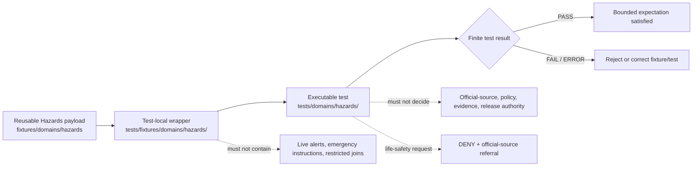

# `tests/fixtures/domains/hazards/` — Hazards Test-Local Fixture Routing and Life-Safety Boundary

> Repository-grounded parent contract for domain-segmented, test-local Hazards fixture wrappers. This subtree may organize small synthetic manifests and expectations owned by named tests, but it does not own reusable fixture payloads, executable tests, Hazards truth, official warning authority, life-safety instruction, source admission, policy decisions, release approval, or public artifacts.

<!-- [KFM_META_BLOCK_V2]
doc_id: kfm://doc/tests-fixtures-domains-hazards-readme
title: tests/fixtures/domains/hazards/README.md — Hazards Test-Local Fixture Routing and Life-Safety Boundary
type: readme; directory-readme; test-local-fixture-parent; hazards; life-safety-adjacent; routing-boundary; non-authoritative
version: v0.2
status: draft; repository-grounded; parent-only-direct-subtree; tests-fixtures-parent-confirmed; domains-parent-index-absent; no-bare-hazards-test-fixture-parent-found; hazards-domain-test-parent-confirmed; reusable-hazards-fixture-root-confirmed; reusable-lanes-readme-backed; sampled-payloads-unverified; sampled-schema-permissive; hazards-policy-scaffold; hazards-release-policy-readme-absent; contract-home-conflict-visible; schema-home-conflict-visible; validator-index-overlap-visible; executable-enforcement-unestablished; ci-todo-only; life-safety-deny; non-authoritative
owners: OWNER_TBD — Hazards steward · Test/QA steward · Fixture steward · Source-role steward · Freshness/time steward · Life-safety boundary reviewer · Official-source attribution reviewer · Evidence steward · Policy steward · Review steward · Release steward · Correction/rollback steward · Map/UI steward · Security reviewer · CI steward · Docs steward
created: 2026-07-06
updated: 2026-07-16
supersedes: v0.1 Hazards test-fixture README
policy_label: public-doc; tests; fixtures; hazards; parent-boundary; test-local-only; synthetic-only; no-network-default; not-alert-authority; no-life-safety-instruction; official-source-referral; freshness-expiry-aware; source-role-fixed; warning-not-event; regulatory-not-observed; model-not-observation; critical-infrastructure-aware; evidence-required; review-gated; policy-gated; release-subordinate; correction-aware; revocation-aware; rollback-aware; no-publication
current_path: tests/fixtures/domains/hazards/README.md
truth_posture:
  CONFIRMED:
    - target README v0.1 and prior blob
    - tests/fixtures parent README exists and defines the test-local versus reusable fixture split
    - tests/fixtures/domains/README.md was not found at the checked path
    - bounded search surfaced only this README under tests/fixtures/domains/hazards/
    - bounded search did not surface a tests/fixtures/hazards compatibility parent
    - fixtures/domains/hazards is the reusable Hazards fixture root with nine README-backed child lanes
    - sampled valid and negative fixture lanes explicitly report no verified payload inventory
    - tests/domains/hazards is the executable-test parent with six documented child lanes while executable pass evidence remains unverified
    - sampled decision-envelope schema is a permissive PROPOSED scaffold
    - policy/domains/hazards is a PROPOSED scaffold
    - policy/release/hazards/README.md was absent at the checked path
    - contracts/hazards is a compatibility pointer while contracts/domains/hazards is the populated semantic-contract lane
    - schemas/contracts/v1/hazards is a conflict guardrail while active schema files are surfaced under schemas/contracts/v1/domains/hazards
    - tools/validators/domains/hazards and tools/validators/hazards are routing READMEs with overlapping responsibilities
    - related air, atmosphere, hydrology, flood, and exposure validator lanes exist as README surfaces
    - Makefile fixtures target is TODO and default test target excludes this subtree
    - domain-hazards workflow jobs are TODO-only echo scaffolds
    - direct parent-level conftest.py, manifest_expectations.json, and representative test module are absent at named paths
  PROPOSED:
    - this parent owns domain-segmented wrapper routing, admission criteria, common invariants, proposed child-lane taxonomy, manifest expectations, consumer-backlink rules, finite outcomes, maintenance, migration, and rollback guidance
    - test-local wrappers carry only test-specific deltas and refer to reusable Hazards fixtures where possible
    - executable tests consume wrappers by reference from owning tests/domains/hazards lanes
    - cross-domain hazard examples stay with the lowest common or owning responsibility lane
  CONFLICTED:
    - v0.1 proposed executable test modules directly inside this fixture subtree
    - v0.1 suggested pytest execution against the fixture subtree
    - reusable Hazards child READMEs describe populated lanes while sampled lanes report no verified payloads
    - rich life-safety and Hazards doctrine versus permissive schemas, policy scaffolds, README-only validators, and unverified executable tests
    - contracts/hazards flat-path doctrine versus contracts/domains/hazards compatibility and current populated-lane evidence
    - schemas/contracts/v1/hazards flat-path doctrine versus schemas/contracts/v1/domains/hazards populated-lane evidence
    - fixture-home guidance names both fixtures/domains/hazards and tests/fixtures/domains/hazards while the higher parent defines a strict reusable-versus-test-local split
    - per-domain, broad Hazards, air-hazards, atmosphere-hazards, flood-context, hydrology-hazards, and exposure validator surfaces overlap
    - policy/release/hazards is repeatedly referenced but its README was absent at the checked path
    - source-role, time-kind, freshness, object-family, fixture-home, review, decision-envelope, and reason-code vocabularies require pinned adapters rather than silent normalization
  UNKNOWN:
    - exhaustive recursive payload inventory, ignored/generated files, dynamic fixture generation, and external fixture stores
    - active consumer tests and two-way backlinks
    - accepted wrapper manifest schema, reason-code registry, object-state vocabularies, official-referral contract, and freshness-profile catalog
    - substantive schema coverage beyond the sampled decision-envelope schema
    - current pass rates, branch-protection significance, retained CI artifacts, production consumers, and release dependency
  NEEDS_VERIFICATION:
    - accepted owners and CODEOWNERS
    - whether tests/fixtures/domains/README.md should be created
    - exact threshold for test-local versus reusable fixture placement
    - canonical contract and schema homes and migration rules
    - canonical fixture IDs, versions, hashes, generator metadata, and generation receipts
    - substantive reusable payloads and executable consumers
    - no-network, no-write, no-alert, no-leak, orphan, duplicate, and nonempty-coverage enforcement
    - source-role, freshness, expiry, official-referral, evidence, policy, review, correction, revocation, invalidation, and rollback execution
evidence_snapshot:
  repository: bartytime4life/Kansas-Frontier-Matrix
  repository_id: "1059091169"
  visibility: public
  base_ref: main
  base_commit: d0151870581168ab8cdd0ae0d852d902469ee3b4
  target_prior_blob: 4e8606fb9b18de823d0178c2cb1ae15b168e7c10
  related_repository_blobs:
    directory_rules: 2affb080e6f0043867c64c7f06c1ca52030fbd55
    hazards_canonical_paths: 6612e1d0e3584c9181c89d596eaf6ffb476422b5
    hazards_life_safety_boundary: 62c06931cd832a1fbaf1d0e909bc80532bebca30
    tests_fixtures_parent: 2d0147e85eae86f687e85c5bea0d3e61f9c3a8f7
    hazards_domain_test_parent: 9cac0ce1a3699bfb88fd925b021575ae410e15ab
    reusable_hazards_fixture_parent: 133f34cb5e94a9e8faeae2cb148dc62b97863e64
    hazards_valid_fixture_readme: 0b52e8540ddd5c738c5760ec417e167a5ebcdf87
    hazards_negative_fixture_readme: 62c634f4d338e3e48a266a966c952da0032bcdc6
    hazards_decision_envelope_schema: a23395b7b24bade9bfd377bbfacfaaeceb16f45a
    hazards_policy_readme: 6118f23a6cd480494f92e8355cbfe61b19a0c25c
    hazards_contract_compat_readme: eb796eb402a927c82b7b02620bd071f8f760cfed
    hazards_contract_domain_readme: 9e042fab5bfb1b6c9659aba030f072e0033e4e9b
    hazards_schema_flat_guardrail: 8af5102916d93319912653b2d37b767245551749
    hazards_domain_validator_readme: 20b1f0851475cfc14aacdd3248f9ff1133595296
    hazards_broad_validator_readme: c3b68e4750978fa3bc08f6617f3699a93f5663ad
    domain_hazards_workflow: ada4e42302667488316fd0ca96137c76e1d6d4f5
    makefile: 4dc8cf633581893d83fba53219c6ea847992e6be
  direct_lane_files_confirmed:
    - tests/fixtures/domains/hazards/README.md
  reusable_lane_readmes_confirmed:
    - fixtures/domains/hazards/valid/README.md
    - fixtures/domains/hazards/negative/README.md
    - fixtures/domains/hazards/invalid/README.md
    - fixtures/domains/hazards/golden/README.md
    - fixtures/domains/hazards/feature_resolver/README.md
    - fixtures/domains/hazards/drawer/README.md
    - fixtures/domains/hazards/focus/README.md
    - fixtures/domains/hazards/identity/README.md
    - fixtures/domains/hazards/layer_manifest/README.md
  checked_absent_paths:
    - tests/fixtures/domains/README.md
    - tests/fixtures/hazards/README.md
    - tests/fixtures/domains/hazards/conftest.py
    - tests/fixtures/domains/hazards/manifest_expectations.json
    - tests/fixtures/domains/hazards/test_parent_fixture_manifest_shape.py
    - policy/release/hazards/README.md
notes:
  - "v0.2 records the requested Hazards test-local subtree as parent-only in bounded evidence."
  - "This subtree owns domain-segmented test-local wrapper routing and expectations, not executable tests or reusable payloads."
  - "The executable Hazards test parent is tests/domains/hazards/; the reusable Hazards payload parent is fixtures/domains/hazards/."
  - "KFM-as-alert-authority and life-safety instruction are absolute DENY boundaries; fixture tests must not create an allow path."
  - "README-backed reusable lanes, illustrative filenames, permissive schemas, and routing indexes do not count as payload, semantic, validator, or CI coverage without exact file and consumer evidence."
  - "This revision changes documentation only and creates no fixture payload, test, schema, contract, policy, validator, workflow, source record, hazard record, warning, advisory, receipt, proof, release record, map artifact, API behavior, AI output, or public artifact."
[/KFM_META_BLOCK_V2] -->

<a id="top"></a>

<p>
  
  
  
  
  
  
  
  
</p>

> [!IMPORTANT]
> **This is the domain-segmented test-local wrapper parent.** Reusable Hazards payloads belong under [`fixtures/domains/hazards/`](../../../../fixtures/domains/hazards/README.md). Executable Hazards tests belong under [`tests/domains/hazards/`](../../../domains/hazards/README.md). Cross-domain examples must stay with the owning domain, a governed relation/join lane, or the lowest common responsibility root.

> [!CAUTION]
> **README lanes and illustrative names are not fixture coverage.** Sampled reusable Hazards lanes explicitly report that no payload inventory was verified. A README, planned path, permissive schema, proposed command, routing validator, or green TODO workflow does not prove valid, invalid, freshness-safe, evidence-closed, source-role-safe, life-safety-safe, renderer-safe, or release-safe behavior.

> [!WARNING]
> **KFM is never an alert authority.** Test fixtures must not issue, relay, interpret, or simulate operational instructions as KFM-authored guidance. Operational warning, watch, advisory, or detection examples may be represented only as conspicuously synthetic context with issue/expiry posture, official-source attribution, denial/referral expectations, and no real current data.

**Quick navigation:** [Status](#status-and-evidence-boundary) · [Purpose](#purpose-and-audience) · [Authority](#authority-and-directory-rules-basis) · [Surfaces](#four-fixture-and-test-surfaces) · [Inventory](#confirmed-direct-reusable-and-executable-inventory) · [Proposed lanes](#proposed-domain-segmented-child-lanes) · [Responsibilities](#parent-responsibilities-and-non-responsibilities) · [Flow](#fixture-routing-flow) · [Placement](#fixture-home-decision-law) · [Admission](#child-lane-and-wrapper-admission-contract) · [Manifest](#minimum-parent-and-child-manifest-contract) · [Consumers](#consumer-backlinks-orphans-and-nonempty-coverage) · [Invariants](#shared-hazards-fixture-invariants) · [Objects](#object-and-authority-separation) · [Outcomes](#finite-outcomes-and-vocabulary-separation) · [Events](#event-observation-and-declaration-boundary) · [Alerts](#warning-advisory-life-safety-and-referral-boundary) · [Flood](#flood-regulatory-observed-and-modeled-boundary) · [Fire/Air](#wildfire-smoke-and-atmosphere-boundary) · [Other hazards](#drought-earthquake-heat-and-cold-boundary) · [Exposure](#exposure-resilience-and-sensitive-join-boundary) · [Time](#identity-time-freshness-expiry-and-supersession) · [Source](#source-role-official-attribution-and-watcher-boundary) · [Public carriers](#api-map-drawer-focus-export-cache-and-ai-boundary) · [Security](#no-network-security-and-side-effects) · [Determinism](#identity-version-hash-generation-and-replay) · [Cases](#parent-case-matrix) · [Maturity](#current-maturity-and-drift-matrix) · [Commands](#validation-commands) · [CI](#ci-and-promotion-boundary) · [Failures](#failure-interpretation) · [Passing](#what-passing-does-not-prove) · [Maintenance](#maintenance-migration-and-deprecation) · [Done](#definition-of-done) · [FAQ](#faq) · [Open](#open-verification-register) · [Evidence](#evidence-ledger) · [Rollback](#documentation-correction-and-rollback)

---

## Status and evidence boundary

> [!IMPORTANT]
> **Evidence snapshot:** `main@d0151870581168ab8cdd0ae0d852d902469ee3b4`
> **Prior target blob:** `4e8606fb9b18de823d0178c2cb1ae15b168e7c10`
> **Direct subtree:** this parent README only
> **Direct wrappers:** not established
> **Direct executable tests:** not established
> **Higher parent:** `tests/fixtures/README.md` exists; `tests/fixtures/domains/README.md` was not found

### Safe conclusion

`tests/fixtures/domains/hazards/` is a valid domain-segmented, test-local fixture routing surface under the `tests/` responsibility root. It documents where future test-specific wrappers may belong and which boundaries every Hazards fixture example must preserve.

It is not:

- a reusable fixture corpus;
- an executable test suite;
- a source registry or live-feed cache;
- an official warning, watch, advisory, or alert channel;
- a life-safety instruction system;
- a contract, schema, policy, evidence, receipt, proof, review, release, or publication authority;
- a public API, map, tile, export, Focus Mode, or AI runtime surface.

### Truth labels

| Label | Meaning here |
|---|---|
| `CONFIRMED` | Verified in the current repository evidence snapshot. |
| `PROPOSED` | A recommended parent rule or future shape not established by executable evidence. |
| `CONFLICTED` | Current documents or paths disagree and no accepted migration decision was verified. |
| `UNKNOWN` | Not resolvable from the bounded evidence inspected. |
| `NEEDS VERIFICATION` | Checkable but not sufficiently verified to act as implementation fact. |

[Back to top](#top)

---

## Purpose and audience

This README serves maintainers who add, review, consume, migrate, or remove test-local Hazards fixture wrappers.

Its purpose is to:

- preserve the split between test-local wrappers and reusable fixtures;
- keep executable assertions in the executable test root;
- make life-safety, freshness, source-role, and official-referral boundaries testable without carrying live operational content;
- prevent fixture examples from becoming source, policy, release, map, or AI authority;
- expose current implementation gaps and path conflicts;
- define reversible admission, migration, correction, and rollback rules.

The primary audiences are Hazards stewards, QA/test maintainers, source and freshness stewards, policy/release reviewers, UI/API maintainers, security reviewers, and documentation maintainers.

[Back to top](#top)

---

## Authority and Directory Rules basis

Directory placement encodes responsibility.

| Responsibility | Preferred or current home | This parent’s relationship |
|---|---|---|
| Test-local Hazards wrappers | `tests/fixtures/domains/hazards/` | Requested parent; wrapper routing only. |
| Reusable Hazards examples | `fixtures/domains/hazards/` | Referenced, not copied or replaced. |
| Executable Hazards tests | `tests/domains/hazards/` | Consumers and assertions. |
| Hazards meaning | `contracts/domains/hazards/` in current populated evidence; flat path remains compatibility/conflict material | Referenced only. |
| Hazards machine shape | Active files surfaced under `schemas/contracts/v1/domains/hazards/`; flat path is conflict guardrail | Referenced only. |
| Hazards policy | `policy/domains/hazards/` and accepted release/safety policy homes | Referenced only. |
| Source identity and role | `data/registry/sources/hazards/` | Referenced only. |
| Evidence, receipts, and proofs | accepted `data/proofs/` and `data/receipts/` homes | Synthetic refs only. |
| Release, correction, rollback | `release/` and accepted release sublanes | Synthetic refs only. |
| Public clients | governed API and released carriers | Never read this subtree as truth. |

The lifecycle invariant remains:

```text
RAW -> WORK / QUARANTINE -> PROCESSED -> CATALOG / TRIPLET -> PUBLISHED
```

A fixture move is not promotion. A test pass is not publication. A schema pass is not policy approval. A validator pass is not release approval.

[Back to top](#top)

---

## Four fixture and test surfaces

| Surface | Responsibility | Current evidence |
|---|---|---|
| `tests/fixtures/domains/hazards/` | Domain-segmented test-local wrappers, parameters, and expectation manifests. | Parent README only. |
| `fixtures/domains/hazards/` | Reusable synthetic Hazards examples and expected outputs. | Parent plus nine README-backed child lanes; sampled payload coverage unverified. |
| `tests/domains/hazards/` | Executable assertions and domain test organization. | Parent plus six documented child lanes; executable pass evidence unverified. |
| Neighboring-domain and cross-domain lanes | Hydrology, Atmosphere/Air, Infrastructure, Roads, Habitat, Agriculture, People/Land, and shared joins retain ownership of their truth and specialized checks. | Multiple validator and relation lanes surfaced; exact fixture ownership remains case-specific. |

No bare `tests/fixtures/hazards/` compatibility parent was surfaced by bounded search. Do not invent one without a placement and migration decision.

[Back to top](#top)

---

## Confirmed direct reusable and executable inventory

### Direct test-local inventory

```text
tests/fixtures/domains/hazards/
`-- README.md
```

No direct wrapper, manifest, `conftest.py`, or representative executable test was established.

### Reusable Hazards fixture README lanes

| Lane | Documented purpose | Current bounded posture |
|---|---|---|
| `valid/` | Positive-path synthetic envelopes. | README-backed; sampled payload inventory unverified. |
| `negative/` | Exploratory fail-closed scenarios. | README-backed; sampled payload inventory unverified. |
| `invalid/` | Stable defect-family cases. | README-backed; payload inventory not established here. |
| `golden/` | Stable expected outputs. | README-backed; producer/consumer linkage unverified. |
| `feature_resolver/` | Feature/detail resolver examples. | README-backed; runtime implementation unverified. |
| `drawer/` | Evidence Drawer projections. | README-backed; evidence closure and UI implementation unverified. |
| `focus/` | Focus Mode request/response examples. | README-backed; AI/runtime implementation unverified. |
| `identity/` | Stable identity, duplicate, correction, and temporal examples. | README-backed; machine enforcement unverified. |
| `layer_manifest/` | Layer manifest, freshness, release, correction, and rollback examples. | README-backed; release and renderer enforcement unverified. |

### Executable Hazards test README lanes

| Lane | Documented responsibility | Current bounded posture |
|---|---|---|
| `drawer/` | Drawer trust-state tests. | README present; executable modules/pass rate unverified. |
| `feature_resolver/` | Governed feature resolution tests. | README present; executable modules/pass rate unverified. |
| `focus/` | Focus finite-outcome tests. | README present; executable modules/pass rate unverified. |
| `focus/emergency_alert_denial/` | Alert-authority denial/referral tests. | README present; executable modules/pass rate unverified. |
| `layer_manifest/` | Layer manifest tests. | README present; executable modules/pass rate unverified. |
| `source_role_anti_collapse_test/` | Source-role anti-collapse tests. | README present; executable modules/pass rate unverified. |

[Back to top](#top)

---

## Proposed domain-segmented child lanes

No direct child README is confirmed below the requested parent. The following lanes are design options only.

| Proposed lane | Distinct responsibility | Must not duplicate |
|---|---|---|
| `operational_context/` | Warning, watch, advisory, declaration, official-referral, and non-alert-authority wrapper expectations. | Live alerts, executable Focus tests, or source feeds. |
| `freshness_expiry/` | Issue, valid, expiry, retrieval, release, correction, stale, and supersession wrappers. | Source registry or runtime cache authority. |
| `source_role/` | Observed, regulatory, modeled, aggregate, administrative, candidate, and synthetic role wrappers. | Reusable source fixtures or source registry records. |
| `feature_resolver/` | Test-local resolver parameters and expected finite outcomes. | Reusable resolver payloads or API implementation. |
| `drawer_focus/` | Test-local drawer/Focus expectation deltas. | Reusable drawer/Focus examples or AI/runtime code. |
| `identity_layer/` | Feature identity, layer-manifest, correction, rollback, and duplicate wrappers. | Canonical identity or release records. |
| `cross_domain/` | Ownership-preserving Hazards joins with Hydrology, Air, Infrastructure, Roads, Habitat, Agriculture, or People/Land. | Neighboring-domain truth or shared validator authority. |
| `policy_release/` | Policy denial, official referral, release, correction, withdrawal, and rollback wrappers. | Binding policy or release objects. |

A child lane must demonstrate why it belongs under the test-local parent rather than the reusable root or executable test root.

[Back to top](#top)

---

## Parent responsibilities and non-responsibilities

### This parent owns

- the domain-segmented child-lane index;
- the four-surface routing law;
- shared synthetic, no-network, no-write, no-alert, no-leak, and non-authority rules;
- the threshold for accepting test-local Hazards wrappers;
- parent manifest expectations;
- consumer backlinks, orphan checks, nonempty coverage, and vacuous-pass controls;
- finite-outcome and reason-code separation;
- maintenance, migration, correction, deprecation, and rollback instructions;
- explicit `UNKNOWN`, `CONFLICTED`, and `NEEDS VERIFICATION` registers.

### This parent does not own

- fixture payload semantics already owned by contracts and schemas;
- executable test code;
- source data, official warning issuance, policy decisions, evidence, receipts, reviews, or releases;
- alerting, emergency instruction, or protective-action guidance;
- freshness thresholds, operational SLAs, or official-source authority;
- runtime APIs, maps, tiles, exports, caches, or AI answers;
- canonical migration decisions for disputed paths, profiles, or vocabularies.

[Back to top](#top)

---

## Fixture routing flow



The diagram is a routing model, not proof that payloads, executables, validators, CI jobs, or release gates exist.

[Back to top](#top)

---

## Fixture-home decision law

Use the smallest correct home:

1. **Reusable across multiple tests, renderers, APIs, or dry-runs?** Use an accepted `fixtures/domains/hazards/` lane.
2. **Owned by one Hazards test area and adds only local expectations or parameters?** A `tests/fixtures/domains/hazards/` wrapper may be appropriate.
3. **Contains executable assertions or helper code?** Use the owning `tests/domains/hazards/` lane.
4. **Primarily belongs to Hydrology, Atmosphere/Air, Infrastructure, Roads, Habitat, Agriculture, or People/Land?** Keep the fixture with the owning lane or an accepted shared relation/join home.
5. **Carries real source, lifecycle, evidence, policy, receipt, release, or registry state?** Use the owning governed root.
6. **Contains live/current operational content or protective-action language?** Do not place it in repository fixtures.
7. **Duplicates another fixture?** Reject unless a migration note explains source, destination, checksum, consumers, compatibility period, and rollback.
8. **Uses a path only because the topic is Hazards?** Re-evaluate; responsibility and lifecycle determine placement.

Never interpret a file move as promotion, source admission, policy approval, evidence closure, or authority transfer.

[Back to top](#top)

---

## Child-lane and wrapper admission contract

A new child lane requires:

- a distinct test-local responsibility;
- at least one named proposed or confirmed executable consumer;
- a clear reusable fixture relationship;
- an explicit non-authority statement;
- synthetic/public-safe input constraints;
- positive and fail-closed case requirements;
- finite outcomes and safe reason-code expectations;
- no-network, no-governed-root-write, no-live-alert, and no-sensitive-output rules;
- owner, deprecation, migration, and rollback expectations;
- parent index update.

A wrapper file belongs here only when:

- it is owned by a named test;
- it is too local to be reusable;
- it contains no real alert, warning, advisory, event feed, credential, private endpoint, critical-infrastructure detail, personal/property exposure, or production trust artifact;
- it pins reusable fixture, schema, policy/profile, official-referral expectation, and expected outcome where applicable;
- it declares prohibited claims and side effects;
- it has a two-way consumer backlink;
- removal cannot change runtime, registry, policy, release, or public state.

README-only lanes remain routing surfaces until real payloads and consumers satisfy these conditions.

[Back to top](#top)

---

## Minimum parent and child manifest contract

The example below is **PROPOSED** and contains no real Hazards information.

```json
{
  "fixture_manifest_id": "kfm://fixture-test/hazards/example",
  "fixture_version": "v1",
  "domain": "hazards",
  "fixture_scope": "test_local_domain_segmented",
  "fixture_authority": "non_authoritative",
  "synthetic": true,
  "child_lane": "operational_context",
  "consumer_refs": [
    "tests/domains/hazards/focus/emergency_alert_denial/test_alert_authority_denied.py"
  ],
  "canonical_fixture_ref": "fixtures/domains/hazards/invalid/expired_context/example.json",
  "object_family": "WarningContext",
  "source_role": "synthetic",
  "issuer_posture": "official_source_placeholder",
  "alert_authority_posture": "kfm_never_authority",
  "freshness_posture": "expired_synthetic_canary",
  "contains_live_operational_content": false,
  "contains_protective_action_instruction": false,
  "contains_sensitive_infrastructure": false,
  "evidence_ref": "evidence-ref:fixture:hazards-example",
  "review_ref": null,
  "policy_decision_ref": null,
  "official_source_ref": "official-source-ref:fixture:hazards-example",
  "release_manifest_ref": null,
  "rollback_card_ref": "rollback-card:fixture:hazards-example",
  "expected_test_outcome": "PASS",
  "expected_domain_outcome": "DENY",
  "reason_code": "ALERT_AUTHORITY_DENIED",
  "must_not_claim": [
    "KFM_ISSUED_WARNING",
    "CURRENT_ALERT_CONFIRMED",
    "PROTECTIVE_ACTION_RECOMMENDED",
    "EVENT_OBSERVED",
    "REGULATORY_ZONE_IS_EVENT",
    "MODEL_IS_OBSERVATION",
    "REVIEW_COMPLETE",
    "POLICY_ALLOWED",
    "RELEASED",
    "MAP_TRUTH",
    "AI_TRUTH"
  ]
}
```

Future schema work must settle identity, version, digest, generator, fixture-home posture, object families, source roles, issuer/official-source posture, time kinds, freshness states, test versus domain outcomes, reason codes, obligations, and correction/withdrawal/revocation/rollback references.

[Back to top](#top)

---

## Consumer backlinks orphans and nonempty coverage

Mature fixture coverage requires two-way traceability:

```text
wrapper manifest -> executable consumer
executable consumer -> wrapper manifest
```

Required checks:

- every wrapper names at least one active consumer;
- every consumer reference resolves;
- every child lane has a declared owner;
- reusable fixtures are referenced rather than copied;
- every consequential family has at least one positive and one fail-closed case;
- alert-authority denial and protective-action denial are nonempty absolute-boundary cases;
- placeholder paths, READMEs, permissive schemas, and routing indexes do not count as semantic coverage;
- zero collected cases is a failure, not a green result;
- skipped cases carry reason, owner, and expiry;
- orphaned wrappers and unused reusable fixtures are reported;
- test-local, reusable, executable, and cross-domain indexes remain synchronized.

[Back to top](#top)

---

## Shared Hazards fixture invariants

| Invariant | Required behavior | Default failure |
|---|---|---|
| Synthetic identity | Use conspicuous fake IDs, sources, times, geometries, and non-authority markers. | Reject fixture. |
| Fixture-home integrity | Test-local, reusable, executable, and neighboring-domain homes remain distinct. | Block admission. |
| Alert-authority denial | KFM never becomes issuer, relay, interpreter, or action authority. | `DENY`. |
| Life-safety instruction denial | No protective-action, evacuation, shelter, routing, or emergency-response instruction. | `DENY` + referral. |
| Official-source referral | Denied operational requests point to an official-source reference without KFM interpreting action. | `DENY` or fail test. |
| Source-role integrity | Observed, regulatory, modeled, aggregate, administrative, candidate, and synthetic roles stay fixed. | `DENY` or `ABSTAIN`. |
| Warning/event separation | Warning and advisory context never becomes observed event evidence. | `DENY` or `ABSTAIN`. |
| Regulatory/observed separation | Regulatory zones and declarations do not become observed hazard extent. | `DENY` or `ABSTAIN`. |
| Model/observation separation | Forecasts, detections, estimates, and models do not become observed facts. | `DENY` or `ABSTAIN`. |
| Freshness and expiry | Issue, valid, expiry, retrieval, release, correction, stale, and superseded states remain explicit. | `DENY`, `HOLD`, or `ABSTAIN`. |
| Sensitive-join protection | Infrastructure, private property, people, roads, facilities, and restricted places inherit the strictest policy. | Deny or generalize. |
| Evidence separation | EvidenceRef must resolve in governed contexts; fixture ref is not proof. | `ABSTAIN`. |
| Review separation | Fixture or schema pass is not review approval. | Block consequential use. |
| Policy separation | Fixture metadata is not a PolicyDecision. | Block consequential use. |
| Release separation | Fixture success is not release or publication approval. | Promotion block. |
| Watcher non-publisher | Watchers emit no-op/proposed-work, never publish or issue alerts. | Reject direct mutation/publish. |
| No-network | Default tests use local synthetic inputs only. | `ERROR`. |
| No governed-root writes | Tests write only to test-owned temporary locations. | `ERROR`. |
| Deterministic replay | Same inputs and pins yield the same bounded result. | Fail test. |
| Correction/rollback | Superseded or withdrawn fixtures invalidate consumers. | Fail and block release use. |
| Cross-domain ownership | Hydrology, Air, Infrastructure, Roads, Habitat, Agriculture, and People/Land retain authority. | `DENY` or drift finding. |

[Back to top](#top)

---

## Object and authority separation

| Family | Fixture may model | Fixture must not become |
|---|---|---|
| `HazardEvent` | Synthetic historical or observed event identity and support. | Current warning or KFM-issued alert. |
| `HazardObservation` | Toy measurement/detection with uncertainty and source role. | Regulatory status, forecast, or protective-action guidance. |
| `WarningContext` | Synthetic official-source context with issue/expiry/referral. | KFM-authored warning or event truth. |
| `AdvisoryContext` | Synthetic official-source advisory context. | Life-safety instruction. |
| `DisasterDeclaration` | Administrative declaration context. | Observed damage or current emergency command. |
| `FloodContext` | Regulatory, observed, modeled, historical, or synthetic flood context. | Silent collapse among those roles. |
| `WildfireDetection` | Toy thermal/detection context. | Legal fire status, perimeter truth, or evacuation guidance. |
| `SmokeContext` | Synthetic plume/model/observation context. | AQI/health/emergency authority without owning support. |
| `DroughtIndicator` | Toy aggregate/model time series. | Local impact truth or emergency declaration. |
| `EarthquakeEvent` | Synthetic event record and uncertainty. | Structural-safety or emergency instruction. |
| `HeatColdEvent` | Synthetic historical/observed/modeled context. | Current protective-action advice. |
| `ExposureSummary` | Aggregate public-safe exposure context. | Individual, facility, or critical-infrastructure disclosure. |
| `ResilienceSummary` | Planning/context indicators. | Funding, compliance, or operational decision authority. |
| `HazardTimeline` | Ordered synthetic context with time kinds. | Current warning state by implication. |
| `ImpactArea` | Generalized or toy affected-area representation. | Exact sensitive/private exposure or official damage assessment. |
| SourceDescriptor / watcher | Synthetic governance and freshness metadata. | Registry admission, source truth, alert issuance, or publication. |
| Evidence / receipts | Toy refs and failure expectations. | Real proof or process memory. |
| Policy / review / release | Expected gate behavior. | Binding decision or public authority. |
| API/map/drawer/Focus/AI carrier | Public-safe expected response or denial. | Runtime route, rendered truth, alert, or authoritative answer. |

[Back to top](#top)

---

## Finite outcomes and vocabulary separation

| Vocabulary | Example values | Owner |
|---|---|---|
| Test result | `PASS`, `FAIL`, `SKIP`, `ERROR` | Test framework |
| Runtime/domain result | `ANSWER`, `ABSTAIN`, `DENY`, `HOLD`, `ERROR` | Governed runtime/policy |
| Source role | observed, regulatory, modeled, aggregate, administrative, candidate, synthetic | Source governance |
| Operational-context state | issued, valid, expired, superseded, corrected, stale, unknown | Time/freshness contract |
| Release state | candidate, review-required, denied, released, superseded, withdrawn, rolled-back | Release authority |
| Fixture maturity | README-only, placeholder, substantive, golden, deprecated | Fixture governance |
| Evidence state | missing, unresolved, partial, conflicted, resolved, withdrawn | Evidence system |

Do not equate:

- test `PASS` with runtime `ANSWER`;
- runtime `DENY` with test failure;
- expired with invalid schema;
- regulatory with observed;
- modeled with forecast authority;
- released with current;
- fixture `golden` with official truth.

[Back to top](#top)

---

## Event observation and declaration boundary

Fixtures must preserve the difference among an observed event, an observation/detection, an administrative declaration, and an operational message.

Required negative cases include:

- declaration presented as observed damage;
- observation presented as official warning;
- warning presented as event evidence;
- modeled event presented as measured;
- historical event presented as current;
- candidate event presented as released.

Identity should include the source role and time posture required to prevent accidental collapse.

[Back to top](#top)

---

## Warning advisory life-safety and referral boundary

The alert-authority boundary is absolute. It has no fixture-based allow path.

A mature fixture suite must prove:

- KFM is never the issuer or relay authority;
- warning/watch/advisory context carries official-source attribution;
- issue and expiry state are explicit;
- expired context cannot appear current;
- protective-action requests produce `DENY`;
- AI/Focus wording cannot convert context into instruction;
- referral output does not interpret the action the official source should recommend;
- no live warning payload is stored in repository fixtures.

A valid test may pass because the domain outcome is `DENY` with a safe referral.

[Back to top](#top)

---

## Flood regulatory observed and modeled boundary

Flood fixtures must distinguish:

- regulatory floodplain/context;
- observed inundation;
- modeled or forecast flood extent;
- historical event footprint;
- administrative declaration;
- synthetic test geometry.

Required fail-closed cases include regulatory-as-observed, forecast-as-observed, stale operational context shown as current, and direct Hydrology truth absorption.

Hydrology retains water and forecast authority. Hazards may carry governed hazard context without absorbing Hydrology ownership.

[Back to top](#top)

---

## Wildfire smoke and atmosphere boundary

Wildfire and smoke fixtures must preserve:

- thermal detection versus confirmed event/perimeter;
- perimeter versus legal/operational status;
- smoke plume/model versus observed concentration;
- Atmosphere/Air ownership versus Hazards context;
- event time, retrieval time, valid time, release time, and correction time;
- official-source attribution and not-for-life-safety posture.

No fixture may turn a thermal detection, plume, model, or screenshot into emergency guidance.

[Back to top](#top)

---

## Drought earthquake heat and cold boundary

Fixtures for drought, earthquake, heat, and cold must keep object and authority roles explicit.

| Family | Required separation |
|---|---|
| Drought | indicator/model/aggregate versus local impact or declaration |
| Earthquake | event/catalog record versus structural safety assessment or instruction |
| Heat/cold | observation/model/historical event versus operational advisory or action guidance |
| Administrative context | declaration/program status versus observed physical impact |
| Exposure/resilience | planning context versus individual risk or emergency decision |

Unknown or stale support produces `ABSTAIN`, `HOLD`, or `DENY`, not confident current-condition language.

[Back to top](#top)

---

## Exposure resilience and sensitive-join boundary

Exposure and resilience fixtures must not reveal:

- exact critical-infrastructure geometry;
- private facilities or access points;
- individual or household exposure;
- private-property details;
- vulnerable-person targeting;
- sensitive roads/rail/facility dependencies;
- restricted archaeology, habitat, or stewardship joins.

Public-safe examples should use conspicuous synthetic aggregates or denial canaries. Most-restrictive policy propagation applies to joined outputs.

[Back to top](#top)

---

## Identity time freshness expiry and supersession

Time is part of Hazards identity and trust posture.

A wrapper should pin the applicable time kinds:

- source event/issue time;
- observation time;
- validity start/end;
- expiry time;
- retrieval time;
- processing time;
- release time;
- correction time;
- supersession/withdrawal time.

Required tests should reject impossible ordering, missing expiry where required, stale-as-current behavior, and identity that ignores source role or temporal scope.

[Back to top](#top)

---

## Source role official attribution and watcher boundary

Source role is fixed at admission and never upgraded by promotion.

Required canaries include:

- regulatory polygon cited as observed event;
- modeled surface cited as measured;
- aggregate summary cited as per-location fact;
- administrative declaration cited as physical impact;
- candidate record exposed publicly;
- synthetic record used as real evidence;
- watcher output issuing or publishing an alert;
- missing official issuer/reference on operational context.

Watchers compare state and propose work. They do not publish, issue, relay, or interpret warnings.

[Back to top](#top)

---

## API map drawer Focus export cache and AI boundary

Public carriers are downstream.

A mature suite should verify:

- governed interfaces only;
- no direct fixture/internal-store read by public clients;
- `ANSWER`, `ABSTAIN`, `DENY`, and `ERROR` remain explicit;
- not-for-life-safety state is visible and machine-readable where required;
- official-source referral survives API, map, drawer, Focus, export, cache, screenshot, and AI projection;
- freshness, expiry, correction, and release state remain visible;
- sensitive infrastructure/private joins cannot leak through popups, labels, tiles, screenshots, exports, caches, embeddings, or generated text;
- a cached or exported context cannot outlive its validity without stale/expired handling.

Map styling, badges, prose, and screenshots never create truth or release authority.

[Back to top](#top)

---

## No-network security and side effects

Default tests must:

- disable live NOAA, NWS, FEMA, USGS, NASA, Kansas/local authority, map, tile, release, and AI calls;
- use no production credentials, endpoints, logs, telemetry, or trust artifacts;
- avoid DNS and hidden HTTP calls;
- write only to test-owned temporary directories;
- redact payload excerpts from diagnostics;
- avoid storing live current-condition content;
- fail when an undeclared network or governed-root write occurs.

No-network success means the test was hermetic. It does not prove a live source is available or current.

[Back to top](#top)

---

## Identity version hash generation and replay

A substantive wrapper should eventually carry:

- fixture ID and version;
- object family and source role;
- synthetic marker;
- reusable fixture reference and content digest;
- schema/contract/policy/profile pins;
- official-source/reference posture;
- issue/valid/expiry/freshness state;
- generator name/version and deterministic seed where material;
- expected test and domain outcomes;
- safe reason code and obligations;
- consumer refs;
- supersedes/superseded-by refs;
- correction, withdrawal, revocation, and rollback refs;
- content and manifest hashes.

Hashes must never encode or leak restricted content. Replay proves deterministic reproduction of the fixture, not real-world Hazards truth or current conditions.

[Back to top](#top)

---

## Parent case matrix

| Case family | Parent expectation | Required failure example |
|---|---|---|
| Direct inventory | Confirmed child lanes indexed exactly once. | Proposed lane reported as implemented. |
| Fixture placement | Test-local, reusable, executable, and cross-domain homes are distinct. | Copied payload or executable file in wrapper lane. |
| Consumer linkage | Every wrapper has a live consumer backlink. | Orphan wrapper or unresolved test ref. |
| Nonempty coverage | Consequential family has positive and fail-closed cases. | Zero, README-only, or permissive-schema-only coverage reported green. |
| Alert boundary | Absolute denial and safe referral. | KFM presented as issuer or action authority. |
| Freshness | Current/stale/expired/superseded explicit. | Expired context displayed current. |
| Source role | Role remains bounded. | Regulatory/modeled/aggregate/candidate upcast to observed. |
| Object family | Event, observation, warning, declaration, model, summary remain distinct. | Silent reclassification. |
| Official attribution | Issuer/reference required where operational context exists. | Missing or KFM-authored issuer. |
| Evidence | EvidenceRef closure required for claim-bearing output. | Unsupported `ANSWER` or map claim. |
| Promotion/release | All gate refs present in expected allow-like case. | Fixture pass treated as release. |
| Sensitive join | Most-restrictive policy and generalized output. | Facility/private/people detail leak. |
| Public carrier | Governed/released synthetic output only. | Direct internal read or stale cache/export. |
| Correction/rollback | Invalidation reaches all dependent expectations. | Withdrawn fixture remains active. |
| Hermeticity | Local deterministic execution. | Network, secret, external service, or governed-root write. |
| Diagnostics | Safe finite reason codes. | Payload, endpoint, alert text, or restricted detail in errors. |

[Back to top](#top)

---

## Current maturity and drift matrix

| Surface | Confirmed current posture | Open risk |
|---|---|---|
| This parent | v0.1 before revision; parent-only direct subtree. | Stale placement/run guidance and no machine inventory. |
| Higher test-fixture parent | Exists and defines test-local versus reusable split. | `tests/fixtures/domains/README.md` absent. |
| Reusable Hazards root | Parent plus nine README-backed lanes. | Sampled lanes report no verified payloads. |
| Executable Hazards test root | Parent plus six README-backed lanes. | Commands and pass rates unverified. |
| Valid/negative lanes | Rich documentation. | Payloads and consumers unverified. |
| Decision-envelope schema | Three-field permissive PROPOSED scaffold. | Semantic and life-safety enforcement absent. |
| Domain policy | PROPOSED scaffold. | Binding evaluation unestablished. |
| Release policy | Referenced path absent at checked README path. | Official-referral/release rules unresolved. |
| Contract homes | Flat compatibility pointer and populated segmented lane. | Canonical/migration decision conflicted. |
| Schema homes | Flat conflict guardrail and populated segmented lane. | Canonical/migration decision conflicted. |
| Validators | Per-domain, broad, air, atmosphere, flood, hydrology, exposure lanes. | Ownership overlap, executables, reports, CI unverified. |
| Makefile | `fixtures` target exists. | Target is TODO; default `test` excludes this subtree. |
| Hazards workflow | Triggered on PR/push. | Jobs only echo TODO commands. |
| Branch protection | UNKNOWN. | Green optional checks may not gate promotion. |

[Back to top](#top)

---

## Validation commands

### Confirmed inventory commands for a local checkout

```bash
find tests/fixtures/domains/hazards -maxdepth 4 -type f | sort
find tests/domains/hazards -maxdepth 5 -type f | sort
find fixtures/domains/hazards -maxdepth 5 -type f | sort
```

### Proposed future executable command

```bash
python -m pytest tests/domains/hazards -q
```

This command is **PROPOSED / NEEDS VERIFICATION** until executable collection and consumer relationships are confirmed.

A future parent runner must fail when:

- zero cases are collected;
- only READMEs, placeholders, or permissive schemas are present;
- indexes diverge;
- wrappers lack consumers;
- reusable fixtures are duplicated;
- official-source/referral or freshness requirements are missing;
- unknown vocabularies or unpinned schemas/policies occur;
- live/current alert or restricted content is detected;
- network or governed-root writes occur.

[Back to top](#top)

---

## CI and promotion boundary

Current checked repository behavior:

- `make fixtures` prints a TODO message;
- `make test` runs only `tests/schemas` and `tests/contracts`;
- the `domain-hazards` workflow checks out the repository and echoes TODO commands;
- no retained fixture inventory, no-alert report, freshness report, orphan report, or coverage artifact was established;
- required-check and branch-protection status is `UNKNOWN`.

A future CI gate should emit a deterministic report containing snapshot commit, inventories, wrapper/consumer counts, fixture refs/digests, positive/fail-closed counts, alert-authority denial results, freshness/expiry results, official-referral results, source-role findings, no-network findings, schema/policy pins, finite outcomes, correction/rollback checks, and overall status.

A green CI result remains subordinate to evidence, policy, review, promotion, release, correction, and rollback authority.

[Back to top](#top)

---

## Failure interpretation

| Failure | Meaning | Safe response |
|---|---|---|
| Parent/index drift | Documentation inventory is unreliable. | Block promotion of fixture changes. |
| Wrapper has no consumer | Fixture is orphaned or speculative. | Reject or move to documented proposal. |
| Reusable payload copied locally | Fixture authority is drifting. | Remove duplicate and migrate refs. |
| Zero/README/permissive-only cases | Coverage is vacuous. | Fail suite. |
| Unknown source/object/time/outcome | Contract drift or unsupported value. | `ERROR`; fail closed. |
| KFM presented as alert authority | Absolute life-safety boundary failed. | `DENY`; safe referral. |
| Protective-action language | Out-of-scope instruction. | `DENY`; remove output. |
| Expired context displayed current | Freshness boundary failed. | `DENY`; stale/expired state. |
| Warning/regulatory/model as observed | Truth/source role collapsed. | `DENY` or `ABSTAIN`. |
| Missing official attribution/referral | Operational context unsupported. | `DENY` or fail test. |
| Sensitive/private/infrastructure detail | Exposure boundary failed. | Reject, remove, and escalate safely. |
| Missing evidence/review/policy/release refs | Consequential output unsupported. | `DENY`, `HOLD`, or `ABSTAIN`. |
| Network or governed-root write | Hermeticity failed. | `ERROR`; block. |
| Stale/superseded fixture still active | Invalidation failed. | Fail and block release use. |
| Unsafe diagnostics | Error channel leaks operational/restricted content. | Suppress and treat as security failure. |

[Back to top](#top)

---

## What passing does not prove

Passing wrapper and fixture tests do not prove:

- a source is admitted, active, reachable, current, or authoritative;
- a hazard event, warning, observation, declaration, forecast, model, or detection is current or accurate;
- KFM may issue, relay, interpret, or advise on an alert;
- a regulatory polygon is an observed event;
- a model or detection is observed ground truth;
- an official authority recommends any particular action;
- an exposure or resilience summary is complete, individual, or operational;
- evidence, review, policy, freshness, release, correction, or rollback gates are complete;
- an API route, map layer, tile, export, cache, drawer, Focus answer, or AI response is implemented or publishable;
- production correction, withdrawal, revocation, invalidation, or rollback propagated;
- branch protection requires the checks;
- the repository contains a complete fixture corpus.

Passing proves only that named tests satisfied pinned expectations for synthetic inputs.

[Back to top](#top)

---

## Maintenance migration and deprecation

When changing this parent or a related Hazards fixture surface:

1. inspect test-local, reusable, executable-test, validator, contract, schema, and policy inventories;
2. verify Directory Rules, Hazards canonical paths, and relevant ADR/drift entries;
3. name owners and consumers;
4. choose the smallest correct fixture home;
5. keep inputs synthetic, non-current, and public-safe;
6. pin schema, contract, source descriptor, policy/profile, official-referral, generator, and expected outcomes;
7. add positive and fail-closed cases;
8. update two-way backlinks;
9. run no-network, no-write, no-alert, no-leak, orphan, duplicate, freshness, and nonempty checks;
10. update every affected parent and child index together;
11. document correction, supersession, withdrawal, revocation, invalidation, and rollback effects.

Any path, object name, fixture home, contract/schema home, validator home, time vocabulary, profile, source role, review state, or reason-code consolidation requires full inbound-reference and payload inventory, declared authority, checksums, consumer updates, compatibility period, deprecation marker, migration note/receipt, rollback target, and an ADR when authority changes materially.

[Back to top](#top)

---

## Definition of done

- [ ] owners and CODEOWNERS are confirmed;
- [ ] the `tests/fixtures/domains/` parent decision is accepted;
- [ ] the reusable-versus-test-local fixture threshold is accepted;
- [ ] contract and schema homes have accepted migration/alias rules;
- [ ] child-lane admission criteria are approved;
- [ ] a machine-checkable parent/child manifest contract exists;
- [ ] all reusable and test-local lanes have substantive payloads or are explicitly documentation-only;
- [ ] executable consumers and two-way backlinks exist;
- [ ] reusable fixture refs and digests are pinned;
- [ ] positive and fail-closed case families are nonempty;
- [ ] alert-authority and protective-action denial cases are nonempty and absolute;
- [ ] zero-case, README-only, permissive-schema-only, orphan, and duplicate checks fail closed;
- [ ] source-role, warning/event, regulatory/observed, and model/observation anti-collapse tests pass;
- [ ] freshness, expiry, official attribution, and referral tests pass;
- [ ] sensitive infrastructure/private-person join tests fail closed;
- [ ] evidence, policy, promotion, release, correction, and rollback closure is tested;
- [ ] no-network and no-governed-root-write controls are enforced;
- [ ] CI emits a retained deterministic report;
- [ ] required-check significance is verified;
- [ ] migration, correction, deprecation, and rollback instructions are current.

Until then, this README is a routing and safety contract, not proof of implemented fixture coverage.

[Back to top](#top)

---

## FAQ

### Why are executable tests not stored beside these wrappers?

Executable assertions belong under `tests/domains/hazards/`. Keeping test code separate prevents fixture directories from becoming implementation or authority surfaces.

### Do the nine reusable Hazards child READMEs prove a complete fixture corpus?

No. They prove lane documentation. Sampled child READMEs explicitly state that no payload inventory was verified.

### Can a real warning or advisory be used as a fixture?

No live/current operational message should be stored in this repository fixture lane. Use conspicuous synthetic context with fake issuer/reference, non-current times, and explicit denial/referral expectations.

### Can a valid fixture produce `DENY`?

Yes. A structurally valid life-safety request should produce the governed domain outcome `DENY`. The test passes when the denial is correct.

### Does “not for life safety” make protective-action guidance acceptable?

No. The boundary is absolute. A disclaimer cannot convert KFM-authored emergency instruction into an allowed output.

### Which contract or schema path is canonical?

Current repository evidence is conflicted. The flat contract path is a compatibility pointer to the populated domain-segmented contract lane. The flat schema path is a conflict guardrail while active schemas are in the segmented lane. Do not add new parallel authority without an accepted ADR/migration plan.

### Does a schema-valid fixture prove release readiness?

No. Shape validation is one layer. Meaning, source role, evidence, freshness, official attribution, review, policy, release, correction, and rollback remain separate.

[Back to top](#top)

---

## Open verification register

| ID | Question | Status |
|---|---|---|
| HAZ-FIX-PARENT-001 | Who owns this parent and which CODEOWNERS rule applies? | NEEDS VERIFICATION |
| HAZ-FIX-PARENT-002 | Should `tests/fixtures/domains/README.md` be created? | NEEDS VERIFICATION |
| HAZ-FIX-PARENT-003 | What exact rule separates test-local wrappers from reusable Hazards fixtures? | NEEDS VERIFICATION |
| HAZ-FIX-PARENT-004 | What schema defines parent and child manifests? | UNKNOWN |
| HAZ-FIX-PARENT-005 | What are canonical fixture ID, version, digest, and generator rules? | NEEDS VERIFICATION |
| HAZ-FIX-PARENT-006 | Which proposed direct child lanes should exist? | NEEDS VERIFICATION |
| HAZ-FIX-PARENT-007 | Which reusable payload files currently exist and are substantive? | UNKNOWN |
| HAZ-FIX-PARENT-008 | Which executable tests consume each reusable or test-local lane? | UNKNOWN |
| HAZ-FIX-PARENT-009 | How are backlinks, orphans, duplicates, and zero-case coverage enforced? | NEEDS VERIFICATION |
| HAZ-FIX-PARENT-010 | Which Hazards schemas are substantive rather than permissive scaffolds? | UNKNOWN |
| HAZ-FIX-PARENT-011 | Which Hazards contract home is canonical and what compatibility period applies? | CONFLICTED |
| HAZ-FIX-PARENT-012 | Which Hazards schema home is canonical and what migration applies? | CONFLICTED |
| HAZ-FIX-PARENT-013 | Where is the accepted Hazards release/life-safety policy bundle? | CONFLICTED / NEEDS VERIFICATION |
| HAZ-FIX-PARENT-014 | Which Hazards validator surface is canonical for each concern? | CONFLICTED / NEEDS VERIFICATION |
| HAZ-FIX-PARENT-015 | What source-role and issuer-role vocabularies are canonical? | NEEDS VERIFICATION |
| HAZ-FIX-PARENT-016 | What time kinds and freshness/expiry states are canonical? | NEEDS VERIFICATION |
| HAZ-FIX-PARENT-017 | What fields are mandatory for WarningContext and AdvisoryContext fixtures? | UNKNOWN |
| HAZ-FIX-PARENT-018 | What constitutes substantive alert-authority and protective-action denial coverage? | NEEDS VERIFICATION |
| HAZ-FIX-PARENT-019 | What official-source referral contract is accepted for API/UI/Focus surfaces? | UNKNOWN |
| HAZ-FIX-PARENT-020 | How are regulatory, observed, modeled, and forecast flood contexts separated? | NEEDS VERIFICATION |
| HAZ-FIX-PARENT-021 | How are wildfire detection, perimeter, smoke, and Atmosphere ownership separated? | NEEDS VERIFICATION |
| HAZ-FIX-PARENT-022 | How are critical infrastructure, private property, people, roads, and facilities protected? | NEEDS VERIFICATION |
| HAZ-FIX-PARENT-023 | How is watcher non-publisher/non-alert behavior enforced? | NEEDS VERIFICATION |
| HAZ-FIX-PARENT-024 | What cross-domain ownership canaries are required? | UNKNOWN |
| HAZ-FIX-PARENT-025 | Which Hazards API, map, drawer, Focus, tile, and export envelopes are implemented? | UNKNOWN |
| HAZ-FIX-PARENT-026 | What no-alert, no-leak, cache-expiry, and side-channel suite is required? | UNKNOWN |
| HAZ-FIX-PARENT-027 | How are source/event/evidence corrections and supersession propagated? | NEEDS VERIFICATION |
| HAZ-FIX-PARENT-028 | How are withdrawal, revocation, cache invalidation, and rollback propagated? | NEEDS VERIFICATION |
| HAZ-FIX-PARENT-029 | Which workflow produces the Hazards fixture report? | UNKNOWN |
| HAZ-FIX-PARENT-030 | Is any Hazards fixture suite required by branch protection? | UNKNOWN |

[Back to top](#top)

---

## Evidence ledger

| Evidence | Status | Supports | Does not prove |
|---|---|---|---|
| Directory Rules | CONFIRMED doctrine | Responsibility-root placement and no parallel authority. | Current implementation maturity. |
| Hazards canonical paths | CONFIRMED draft register | Life-safety posture, fixture-home tension, contract/schema conflicts. | Final ADR/migration decisions. |
| Hazards life-safety boundary | CONFIRMED doctrine / proposed mechanics | Absolute alert-authority and instruction denial. | Runtime enforcement. |
| Target v0.1 README | CONFIRMED prior content | Existing purpose, safety intent, and placement/run errors. | Current coverage. |
| `tests/fixtures/README.md` | CONFIRMED | Test-local versus reusable fixture split. | Domain-parent or payload maturity. |
| `tests/fixtures/domains/README.md` check | CONFIRMED bounded absence | Named higher index absent at pinned ref. | Permanent/historical absence. |
| `tests/domains/hazards/README.md` | CONFIRMED draft | Executable test authority and documented lane map. | Executable files or pass rates. |
| `fixtures/domains/hazards/README.md` | CONFIRMED draft | Reusable Hazards root and nine child READMEs. | Complete or substantive payload inventory. |
| Sampled valid/negative READMEs | CONFIRMED | Detailed lane contracts and explicit no-payload verification. | Permanent absence or all-lane status. |
| Decision-envelope schema | CONFIRMED permissive PROPOSED scaffold | Paired schema path exists. | Semantic/life-safety enforcement. |
| Hazards policy README | CONFIRMED PROPOSED scaffold | Intended domain policy home exists. | Binding evaluation. |
| Hazards release-policy check | CONFIRMED bounded absence | Named README absent at pinned ref. | Permanent absence or alternate files. |
| Contract READMEs | CONFIRMED conflict/compatibility evidence | Flat pointer and populated segmented lane. | Final canonical decision. |
| Schema flat guardrail | CONFIRMED conflict evidence | Active schemas surfaced in segmented lane. | Final canonical decision. |
| Hazards validator READMEs | CONFIRMED routing indexes | Intended validation families and overlap. | Executables or reports. |
| Makefile | CONFIRMED | Current `fixtures` TODO and default test scope. | Future runner or branch protection. |
| `domain-hazards` workflow | CONFIRMED TODO-only | Trigger and scaffold status. | Substantive validation or release gate. |
| Parent-level 404 checks | CONFIRMED bounded | Named manifest/harness files absent. | Exhaustive subtree absence. |
| Bounded repository search | CONFIRMED search | Parent-only test-local topology and no bare compatibility parent. | Ignored, generated, dynamic, external, or unindexed files. |

[Back to top](#top)

---

## Documentation correction and rollback

This is a documentation-only revision.

Before merge, rollback means leaving the draft pull request unmerged or adding a transparent revert commit. After merge, use a transparent revert commit or revert pull request; do not reset or force-push shared history.

Rollback is required if this README:

- is mistaken for fixture payload, test implementation, Hazards/source/policy/evidence/release, or publication authority;
- directs executable tests into this fixture subtree;
- encourages live warning/advisory content, life-safety instruction, critical-infrastructure detail, private data, credentials, or production trust artifacts;
- treats README presence, planned paths, permissive schemas, map styling, validator routing, or generated prose as semantic proof;
- collapses source role, warning/event, regulatory/observed, model/observation, freshness, review, policy, receipt, promotion, release, runtime, or lifecycle states;
- silently selects a disputed contract path, schema path, fixture home, validator home, policy profile, or vocabulary;
- weakens official attribution, freshness, referral, sensitive-join, correction, revocation, invalidation, or rollback safeguards;
- hides parent-only status, missing consumers, unverified reusable payloads, permissive schemas, policy gaps, README-only validators, TODO Makefile behavior, or TODO-only CI.

**No-loss assessment:** v0.2 preserves the v0.1 synthetic-only, no-network, source-role, freshness, life-safety, official-referral, evidence, review, policy, release, correction, withdrawal, and rollback boundaries. It removes executable-test placement from the fixture parent, separates fixture/test surfaces, exposes contract/schema/policy/validator maturity gaps, and makes future implementation and migration requirements inspectable.

[Back to top](#top)
