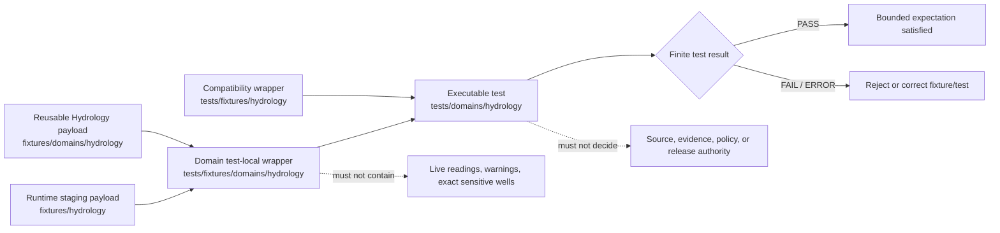

# `tests/fixtures/domains/hydrology/` — Hydrology Test-Local Fixture Routing and Water-Truth Boundary

> Repository-grounded parent contract for domain-segmented, test-local Hydrology fixture wrappers. This subtree may organize small synthetic manifests and expectations owned by named tests, but it does not own reusable fixture payloads, executable tests, Hydrology truth, source admission, flood-warning authority, policy decisions, release approval, or public artifacts.

<!-- [KFM_META_BLOCK_V2]
doc_id: kfm://doc/tests-fixtures-domains-hydrology-readme
title: tests/fixtures/domains/hydrology/README.md — Hydrology Test-Local Fixture Routing and Water-Truth Boundary
type: readme; directory-readme; test-local-fixture-parent; hydrology; time-aware-domain; routing-boundary; non-authoritative
version: v0.2
status: draft; repository-grounded; parent-only-direct-subtree; tests-fixtures-parent-confirmed; domains-parent-index-absent; compatibility-test-fixture-parent-confirmed; domain-reusable-root-confirmed; top-level-runtime-fixture-parent-confirmed; hydrology-domain-test-parent-confirmed; reusable-lanes-readme-backed; sampled-payloads-unverified; domain-schemas-proposed-aliases; common-runtime-schema-substantive-but-proposed; hydrology-policy-scaffold; sensitivity-policy-readme-absent; release-policy-readme-absent; validator-index-overlap-visible; executable-enforcement-unestablished; ci-todo-only; not-flood-warning; non-authoritative
owners: OWNER_TBD — Hydrology steward · Test/QA steward · Fixture steward · Source-role steward · Identity steward · Temporal/freshness steward · Groundwater-sensitivity reviewer · Flood-boundary reviewer · Evidence steward · Receipt steward · Policy steward · Review steward · Release steward · Correction/rollback steward · Map/UI steward · Security reviewer · CI steward · Docs steward
created: 2026-07-06
updated: 2026-07-16
supersedes: v0.1 Hydrology test-fixture README
policy_label: public-doc; tests; fixtures; hydrology; parent-boundary; test-local-only; synthetic-only; no-network-default; no-live-source; not-flood-warning; no-emergency-instruction; source-role-fixed; nfhl-regulatory-not-observed; model-not-observation; time-kinds-separated; groundwater-precision-aware; evidence-required; receipt-aware; review-gated; policy-gated; release-subordinate; correction-aware; revocation-aware; rollback-aware; no-publication
current_path: tests/fixtures/domains/hydrology/README.md
truth_posture:
  CONFIRMED:
    - target README v0.1 and prior blob
    - tests/fixtures parent README exists and defines the test-local versus reusable fixture split
    - tests/fixtures/domains/README.md was not found at the checked path
    - bounded search surfaced only this README under tests/fixtures/domains/hydrology/
    - tests/fixtures/hydrology is a separate compatibility/test-local parent
    - fixtures/domains/hydrology is the domain-owned reusable fixture root with eight README-backed child families
    - fixtures/hydrology is a separate top-level runtime/staging fixture parent
    - sampled reusable fixture parents explicitly report no verified payload inventory
    - tests/domains/hydrology is the executable-test parent with eight documented child lanes while executable pass evidence remains unverified
    - Hydrology decision-envelope and run-receipt domain schemas are PROPOSED aliases to common runtime schemas
    - the common decision-envelope schema has substantive fields but remains status PROPOSED
    - policy/domains/hydrology is a PROPOSED scaffold
    - policy/sensitivity/hydrology/README.md and policy/release/hydrology/README.md were absent at checked paths
    - tools/validators/domains/hydrology and tools/validators/hydrology are routing READMEs with overlapping responsibilities
    - hydro shorthand, flood-context, hydrology-hazards, and atmosphere-hydrology validator surfaces are documented routing lanes
    - Makefile fixtures target is TODO and default test target excludes this subtree
    - domain-hydrology workflow jobs are TODO-only echo scaffolds
    - direct parent-level conftest.py, manifest_expectations.json, and representative test module are absent at named paths
  PROPOSED:
    - this parent owns domain-segmented wrapper routing, admission criteria, common invariants, proposed child-lane taxonomy, manifest expectations, consumer-backlink rules, finite outcomes, maintenance, migration, and rollback guidance
    - test-local wrappers carry only test-specific deltas and refer to reusable Hydrology fixtures where possible
    - executable tests consume wrappers by reference from owning tests/domains/hydrology lanes
    - compatibility and top-level runtime fixture paths remain bounded staging surfaces until migration is governed
  CONFLICTED:
    - v0.1 proposed executable test modules directly inside this fixture subtree
    - v0.1 suggested pytest execution against the fixture subtree
    - domain-segmented and bare test-local Hydrology fixture parents coexist without a final canonical relationship
    - domain-owned and top-level runtime Hydrology fixture parents coexist with an incomplete migration threshold
    - reusable child READMEs describe populated lanes while sampled lanes report no verified payloads
    - rich Hydrology doctrine versus proposed alias schemas, policy scaffolds, README-only validators, and unverified executable tests
    - per-domain, full-name, shorthand, flood-context, hydrology-hazards, and atmosphere-hydrology validator surfaces overlap
    - source-role, time-kind, freshness, fixture-home, decision-envelope, receipt, review, and reason-code vocabularies require pinned adapters rather than silent normalization
  UNKNOWN:
    - exhaustive recursive payload inventory, ignored/generated files, dynamic fixture generation, and external fixture stores
    - active consumer tests and two-way backlinks
    - accepted wrapper manifest schema, reason-code registry, official-referral contract, and freshness-profile catalog
    - substantive field coverage across all Hydrology schemas and validators
    - current pass rates, branch-protection significance, retained CI artifacts, production consumers, and release dependency
  NEEDS_VERIFICATION:
    - accepted owners and CODEOWNERS
    - whether tests/fixtures/domains/README.md should be created
    - canonical relationship among tests/fixtures/domains/hydrology, tests/fixtures/hydrology, fixtures/domains/hydrology, and fixtures/hydrology
    - exact threshold for test-local, reusable, runtime-staging, and cross-domain fixture placement
    - canonical fixture IDs, versions, hashes, generator metadata, and generation receipts
    - substantive reusable payloads and executable consumers
    - no-network, no-write, no-live-source, no-leak, orphan, duplicate, and nonempty-coverage enforcement
    - source-role, identity, temporal, NFHL, groundwater, evidence, receipt, policy, review, correction, revocation, invalidation, and rollback execution
evidence_snapshot:
  repository: bartytime4life/Kansas-Frontier-Matrix
  repository_id: "1059091169"
  visibility: public
  base_ref: main
  base_commit: b22a43297c76248c174e15bfd6d5b2c75c563e92
  target_prior_blob: b1a5dde83fd8c6f556a8bd78223a9a3313f6078b
  related_repository_blobs:
    directory_rules: 2affb080e6f0043867c64c7f06c1ca52030fbd55
    hydrology_canonical_paths: f5adebc9353b5ee6a93a068a17d6e4de206635a4
    hydrology_boundary: e25d76925846b908d182f921503f7857ad64a8b0
    tests_fixtures_parent: 2d0147e85eae86f687e85c5bea0d3e61f9c3a8f7
    compatibility_test_fixture_parent: 393111bde70286f8e5006bd5a00398872a53daae
    domain_reusable_fixture_parent: 24e97fe01336e28caf0b87d5ecc82d5b4852479f
    top_level_runtime_fixture_parent: dab1a46361cce833d88ed21c453339b006b35a0b
    hydrology_domain_test_parent: e1266df9b3075be05e75da42e0d87bf5dd25589b
    hydrology_decision_envelope_schema: 73e60dda464ee76e7fed925bbb96bdfdf40680cb
    common_decision_envelope_schema: 349782c8760f77e432ed1e9239d5ddc2ffe1f9b8
    hydrology_run_receipt_schema: 996c27ce3eb98dbf94ffa97e7a07600daa778214
    hydrology_policy_readme: 6d4a011079d647b58a44ad70e15ee4a980d00896
    hydrology_domain_validator_readme: b82dffa92b173f26cd013e7496b85db4a780db3b
    hydrology_broad_validator_readme: 2b407093a825cbc5b4605f5a9edd1e955b1190d7
    domain_hydrology_workflow: b54f7dbd425da657176a05f828c5ebeb952a2077
    makefile: 4dc8cf633581893d83fba53219c6ea847992e6be
  direct_lane_files_confirmed:
    - tests/fixtures/domains/hydrology/README.md
  compatibility_lane_files_confirmed:
    - tests/fixtures/hydrology/README.md
  reusable_domain_lane_readmes_confirmed:
    - fixtures/domains/hydrology/decision_envelope/README.md
    - fixtures/domains/hydrology/evidence_bundle/README.md
    - fixtures/domains/hydrology/run_receipt/README.md
    - fixtures/domains/hydrology/sources/README.md
    - fixtures/domains/hydrology/valid/README.md
    - fixtures/domains/hydrology/invalid/README.md
    - fixtures/domains/hydrology/negative/README.md
    - fixtures/domains/hydrology/golden/README.md
  checked_absent_paths:
    - tests/fixtures/domains/README.md
    - tests/fixtures/domains/hydrology/conftest.py
    - tests/fixtures/domains/hydrology/manifest_expectations.json
    - tests/fixtures/domains/hydrology/test_parent_fixture_manifest_shape.py
    - tests/fixtures/hydrology/runtime/README.md
    - policy/sensitivity/hydrology/README.md
    - policy/release/hydrology/README.md
notes:
  - "v0.2 records the requested Hydrology test-local subtree as parent-only in bounded evidence."
  - "This subtree owns domain-segmented test-local wrapper routing and expectations, not executable tests or reusable payloads."
  - "Reusable Hydrology payloads belong under fixtures/domains/hydrology; executable tests belong under tests/domains/hydrology."
  - "The bare test-local and top-level runtime parents are compatibility/staging surfaces, not parallel Hydrology authority."
  - "NFHL regulatory context, observed inundation, forecasts/models, and emergency warnings remain distinct truth classes."
  - "This revision changes documentation only and creates no fixture payload, test, schema, contract, policy, validator, workflow, source record, water record, receipt, proof, release record, map artifact, API behavior, AI output, or public artifact."
[/KFM_META_BLOCK_V2] -->

<a id="top"></a>

<p>
  
  
  
  
  
  
  
  
</p>

> [!IMPORTANT]
> **This is the domain-segmented test-local wrapper parent.** Reusable Hydrology payloads belong under [`fixtures/domains/hydrology/`](../../../../fixtures/domains/hydrology/README.md). Executable Hydrology tests belong under [`tests/domains/hydrology/`](../../../domains/hydrology/README.md). The bare compatibility parent at [`tests/fixtures/hydrology/`](../../hydrology/README.md) and top-level runtime/staging parent at [`fixtures/hydrology/`](../../../../fixtures/hydrology/README.md) remain bounded compatibility surfaces until an accepted migration decision says otherwise.

> [!CAUTION]
> **README lanes, aliases, and illustrative names are not fixture coverage.** Sampled reusable Hydrology lanes explicitly report that no payload inventory was verified. A README, planned path, schema alias, proposed command, routing validator, or green TODO workflow does not prove valid, invalid, source-role-safe, temporally correct, evidence-closed, receipt-complete, renderer-safe, or release-safe behavior.

> [!WARNING]
> **Hydrology is not a flood-warning, emergency-response, navigation, engineering, insurance, or regulatory-decision authority.** NFHL and similar products are regulatory context, never observed inundation. Live gauge values, operational forecasts, warnings, instructions, exact sensitive wells, private-property exposure, and reverse-engineerable infrastructure details must not appear in fixture payloads, names, snapshots, assertion messages, logs, reports, exports, tiles, screenshots, or CI artifacts.

---

## Status and evidence boundary

**Evidence snapshot:** `main@b22a43297c76248c174e15bfd6d5b2c75c563e92`  
**Prior target blob:** `b1a5dde83fd8c6f556a8bd78223a9a3313f6078b`  
**Direct subtree:** this parent README only  
**Bare compatibility subtree:** parent README only in bounded search  
**Reusable domain root:** eight README-backed child families  
**Top-level runtime root:** README-backed staging parent; payload inventory unverified  
**Direct wrappers:** not established  
**Direct executable tests:** not established  
**Higher parent:** `tests/fixtures/README.md` exists; `tests/fixtures/domains/README.md` was not found

### Safe conclusion

`tests/fixtures/domains/hydrology/` is a domain-segmented, test-local fixture routing surface under the `tests/` responsibility root. It is not a reusable fixture authority, runtime fixture authority, executable-test home, source registry, lifecycle store, evidence store, receipt store, policy root, release root, public API, public map, or Hydrology truth source.

The strongest current statement is documentation-level: the parent exists; the direct subtree is parent-only in bounded search; reusable and compatibility fixture parents exist elsewhere; executable Hydrology test lanes are documented elsewhere; schema and policy maturity is mixed; and executable enforcement remains unverified.

---

## Purpose and audience

This parent serves maintainers, test authors, Hydrology stewards, source stewards, evidence and receipt reviewers, policy/release reviewers, map/UI reviewers, and CI maintainers.

Its purposes are to:

- route a prospective fixture to the smallest correct responsibility home;
- define what a test-local Hydrology wrapper may contain;
- prevent duplicate reusable fixture authority;
- prevent executable assertions from drifting into fixture directories;
- preserve source role, identity, time, freshness, evidence, receipt, policy, review, release, correction, and rollback boundaries;
- make compatibility and implementation gaps inspectable;
- ensure a green result cannot be produced from zero cases, README-only lanes, or unverified aliases.

This README is not a claim that every proposed child lane, fixture family, validator, test, policy, route, or CI gate exists.

---

## Authority and Directory Rules basis

The owning root is `tests/`. Directory placement follows responsibility, not topic.

| Responsibility | Owning home | This parent’s relationship |
|---|---|---|
| Domain-segmented test-local wrappers | `tests/fixtures/domains/hydrology/` | This parent; routing and expectations only. |
| Compatibility test-local wrappers | `tests/fixtures/hydrology/` | Existing compatibility parent; bounded, not canonical reusable authority. |
| Executable Hydrology tests | `tests/domains/hydrology/` | Owning consumer/test surface. |
| Reusable domain fixtures | `fixtures/domains/hydrology/` | Preferred reusable Hydrology fixture root. |
| Runtime/staging fixtures | `fixtures/hydrology/` | Existing top-level compatibility/staging surface; not domain authority. |
| Semantic meaning | `contracts/domains/hydrology/` | Defines object and envelope meaning. |
| Machine shape | `schemas/contracts/v1/domains/hydrology/` plus accepted common roots | Defines accepted shape; domain aliases remain subordinate to common schemas. |
| Policy/admissibility | `policy/domains/hydrology/` and accepted sensitivity/release homes | Decides allow, deny, hold, restrict, or abstain. |
| Source identity/admission | `data/registry/sources/hydrology/` | Owns source role, rights, cadence, freshness, and activation. |
| Evidence and receipts | Accepted proof/receipt roots | Fixtures may reference toy IDs only. |
| Release/correction/rollback | `release/` and accepted release homes | Owns promotion and public-state decisions. |
| Lifecycle data | `data/<phase>/hydrology/` | Preserves RAW → WORK/QUARANTINE → PROCESSED → CATALOG/TRIPLET → PUBLISHED. |
| Public serving | Governed APIs and released carriers | Public clients do not read fixture or internal stores. |

A fixture move is never a promotion, source admission, evidence closure, or release decision.

---

## Five fixture and test surfaces

| Surface | Confirmed role | Must not become |
|---|---|---|
| `fixtures/domains/hydrology/` | Domain-owned reusable synthetic fixture families. | Source truth, proof store, release authority, or executable test root. |
| `fixtures/hydrology/` | Top-level public-safe runtime/staging examples before routing. | Parallel domain fixture authority. |
| `tests/fixtures/domains/hydrology/` | Domain-segmented test-local wrapper routing. | Reusable payload root or executable-test home. |
| `tests/fixtures/hydrology/` | Bare compatibility/test-local parent. | A second canonical test-local or reusable root. |
| `tests/domains/hydrology/` | Executable enforceability proof. | Source registry, lifecycle store, policy, release, or public surface. |

A future migration may consolidate compatibility paths only after exact payload/reference inventory, declared authority, consumer updates, digest preservation, deprecation, compatibility period, and rollback.

---

## Confirmed direct compatibility and reusable inventory

### Direct test-local subtree

Bounded search surfaced only:

```text
tests/fixtures/domains/hydrology/
`-- README.md
```

Named parent-level checks were absent: `conftest.py`, `manifest_expectations.json`, and `test_parent_fixture_manifest_shape.py`.

### Compatibility test-local parent

Confirmed:

```text
tests/fixtures/hydrology/
`-- README.md
```

The compatibility README proposes future children, but `runtime/README.md` was not found at the checked path.

### Domain-owned reusable root

Confirmed README-backed families:

```text
fixtures/domains/hydrology/
|-- decision_envelope/
|-- evidence_bundle/
|-- run_receipt/
|-- sources/
|-- valid/
|-- invalid/
|-- negative/
`-- golden/
```

The parent and sampled child READMEs state that payload files were not verified during their authoring passes.

### Top-level runtime/staging root

Confirmed:

```text
fixtures/hydrology/
`-- README.md
```

This path is runtime/staging only and routes domain-owned fixtures toward `fixtures/domains/hydrology/`.

### Executable-test parent

Confirmed README-backed lanes:

```text
tests/domains/hydrology/
|-- continuity_inventory_check/
|-- identity/
|-- no_network/
|-- policy/
|-- redaction/
|-- schema/
|-- sources/
`-- temporal/
```

These lane READMEs do not establish executable modules or passing results.

---

## Proposed domain-segmented child lanes

No direct child README is confirmed below this parent. These are design options only.

| Proposed lane | Distinct responsibility | Must not duplicate |
|---|---|---|
| `identity/` | Test-local HUC, reach, gauge, well, source/version/time/digest wrapper expectations. | Executable identity tests or reusable object payloads. |
| `observations/` | Gauge, flow, level, quality, unit, qualifier, timestamp, and retrieval wrappers. | Live observations or reusable fixtures. |
| `flood_context/` | NFHL/regulatory, observed inundation, modeled extent, forecast, and warning anti-collapse wrappers. | Shared flood-context validators or real operational data. |
| `groundwater/` | Well/aquifer precision, rights, privacy, generalization, and denial wrappers. | Real well locations or source records. |
| `source/` | SourceDescriptor, role, rights, cadence, source-head, freshness, and watcher wrappers. | Registry records or reusable source fixtures. |
| `evidence_receipts/` | EvidenceBundle, RunReceipt, validation, correction, and rollback reference expectations. | Real proofs or receipts. |
| `policy_release/` | Policy denial, public-safe transformation, release, withdrawal, invalidation, and rollback wrappers. | Binding policy or release objects. |

A new child lane must demonstrate why it belongs here rather than in the domain reusable root, top-level runtime root, compatibility test-local parent, or executable test root.

---

## Parent responsibilities and non-responsibilities

### This parent owns

- domain-segmented wrapper routing;
- the five-surface decision rule;
- shared synthetic, no-network, no-write, no-live-source, and non-authority rules;
- child-lane admission criteria;
- wrapper manifest expectations;
- consumer backlinks, orphan checks, duplicate checks, and nonempty coverage;
- source-role, time-kind, evidence, receipt, correction, and rollback boundaries;
- compatibility and migration guidance;
- explicit UNKNOWN, CONFLICTED, and NEEDS VERIFICATION registers.

### This parent does not own

- fixture payload semantics already owned by contracts and schemas;
- executable assertions or test helpers;
- source descriptors, lifecycle records, water observations, evidence, receipts, policy decisions, reviews, or releases;
- live APIs, map layers, tiles, exports, caches, or AI answers;
- flood warnings, emergency instructions, navigation, engineering, insurance, or regulatory decisions;
- canonical migration decisions for disputed fixture or validator homes.

---

## Fixture routing flow



The diagram is a routing model, not proof that payloads, executables, validators, CI jobs, or release gates exist.

---

## Fixture-home decision law

Use the smallest correct home:

1. Reusable and Hydrology-owned: use `fixtures/domains/hydrology/`.
2. Runtime or renderer staging before ownership is settled: use `fixtures/hydrology/` only with a routing/migration note.
3. Test-local and owned by one domain test area: a wrapper under this parent may be appropriate.
4. Existing compatibility consumer requires the bare test-local parent: keep it there until migration is governed.
5. Contains executable assertions or helpers: use `tests/domains/hydrology/`.
6. Carries real source, lifecycle, evidence, policy, receipt, registry, or release state: use the owning governed root.
7. Contains live water conditions, emergency content, exact sensitive wells, or private/critical exposure: do not place it in repository fixtures.
8. Duplicates another fixture: reject unless a migration record identifies source, destination, checksum, consumers, compatibility period, and rollback.

Never interpret a file move as promotion, source admission, evidence closure, or authority transfer.

---

## Child-lane and wrapper admission contract

A new child lane requires:

- a distinct test-local responsibility;
- a named proposed or confirmed executable consumer;
- a clear reusable fixture relationship;
- an explicit non-authority statement;
- synthetic/public-safe input constraints;
- positive and fail-closed case requirements;
- finite outcomes and safe reason codes;
- no-network, no-governed-root-write, no-live-source, and no-sensitive-output rules;
- owner, deprecation, migration, and rollback expectations;
- parent index update.

A wrapper file belongs here only when it is local to a named test, too narrow to be reusable, does not belong in an existing compatibility lane, contains no real source or sensitive material, pins applicable fixture/schema/policy expectations, declares prohibited claims and side effects, and has a two-way consumer backlink.

README-only lanes remain routing surfaces until real payloads and consumers satisfy these conditions.

---

## Minimum parent and child manifest contract

The example below is **PROPOSED** and intentionally contains no real Hydrology information.

```json
{
  "fixture_manifest_id": "kfm://fixture-test/hydrology/example",
  "fixture_version": "v1",
  "domain": "hydrology",
  "fixture_scope": "test_local_domain_segmented",
  "fixture_authority": "non_authoritative",
  "synthetic": true,
  "child_lane": "flood_context",
  "consumer_refs": [
    "tests/domains/hydrology/policy/test_nfhl_not_observed.py"
  ],
  "canonical_fixture_ref": "fixtures/domains/hydrology/decision_envelope/invalid/example.json",
  "runtime_fixture_ref": null,
  "compatibility_fixture_ref": null,
  "object_family": "NFHLZone",
  "source_role": "regulatory",
  "interpretation_posture": "context_not_observed_inundation",
  "observed_time": null,
  "valid_time": null,
  "retrieval_time": "2099-01-01T00:00:00Z",
  "freshness_posture": "synthetic_not_current",
  "contains_live_source_data": false,
  "contains_exact_sensitive_well": false,
  "evidence_ref": "evidence-ref:fixture:hydrology-example",
  "run_receipt_ref": "run-receipt:fixture:hydrology-example",
  "review_ref": null,
  "policy_decision_ref": null,
  "release_manifest_ref": null,
  "rollback_card_ref": "rollback-card:fixture:hydrology-example",
  "expected_test_outcome": "PASS",
  "expected_domain_outcome": "DENY",
  "reason_code": "NFHL_REGULATORY_NOT_OBSERVED_INUNDATION",
  "must_not_claim": [
    "SOURCE_ADMITTED",
    "CURRENT_CONDITION_CONFIRMED",
    "OBSERVED_INUNDATION_CONFIRMED",
    "FLOOD_WARNING_ISSUED",
    "MODEL_IS_OBSERVATION",
    "EVIDENCE_CLOSED",
    "POLICY_ALLOWED",
    "RELEASED",
    "MAP_TRUTH",
    "AI_TRUTH"
  ]
}
```

Future schema work must settle identity, version, digest, generator, fixture-home posture, object families, source roles, time kinds, freshness states, evidence/receipt refs, test versus domain outcomes, reason codes, obligations, and correction/withdrawal/revocation/rollback references.

---

## Consumer backlinks, orphans, and nonempty coverage

Mature fixture coverage requires two-way traceability:

```text
wrapper manifest -> executable consumer
executable consumer -> wrapper manifest
```

Required checks:

- every wrapper names at least one active consumer;
- every consumer reference resolves;
- every child lane has an owner;
- reusable fixtures are referenced rather than copied;
- runtime and compatibility fixtures carry a reason and migration posture;
- every consequential family has positive and fail-closed cases;
- NFHL anti-collapse, no-live-source, and groundwater-precision cases are nonempty;
- README-only, alias-only, and zero-case coverage cannot pass;
- skipped cases carry reason, owner, and expiry;
- orphaned wrappers and unused reusable fixtures are reported;
- all five indexes remain synchronized.

---

## Shared Hydrology fixture invariants

| Invariant | Required behavior | Default failure |
|---|---|---|
| Synthetic identity | Use conspicuous fake IDs, sources, times, values, geometries, and non-authority markers. | Reject fixture. |
| Fixture-home integrity | Reusable, runtime, test-local, compatibility, and executable homes remain distinct. | Block admission. |
| Source-role integrity | Observed, regulatory, modeled, aggregate, administrative, candidate, and synthetic roles stay fixed. | `DENY` or `ABSTAIN`. |
| NFHL boundary | Regulatory flood context never becomes observed inundation, forecast, model output, or warning. | `DENY` or `ABSTAIN`. |
| Observation boundary | Gauge and water observations retain parameter, unit, qualifier, method, site, and observation time. | Reject or abstain. |
| Time-kind separation | Observed, valid, source, retrieval, release, expiry, stale, correction, and supersession states remain distinct. | `DENY`, `HOLD`, or `ABSTAIN`. |
| Identity integrity | Watershed, HUC, reach, feature, site, well, and observation identities remain object-specific and deterministic. | Reject fixture. |
| Groundwater precision | Exact sensitive well or aquifer access detail is withheld, generalized, denied, or staged. | Deny or quarantine. |
| Evidence separation | EvidenceRef must resolve in governed contexts; a fixture ref is not proof. | `ABSTAIN`. |
| Receipt separation | A RunReceipt-like fixture is not production process memory or truth proof. | Block promotion/release. |
| Policy separation | Fixture metadata is not a PolicyDecision. | Block consequential use. |
| Review separation | Fixture or schema pass is not review approval. | Block consequential use. |
| Release separation | Fixture success is not release or publication approval. | Promotion block. |
| Watcher non-publisher | Watchers emit no-op/proposed-work only and never publish. | Reject direct mutation/publish. |
| No-network | Default tests use local synthetic inputs only. | `ERROR`. |
| No governed-root writes | Tests write only to test-owned temporary locations. | `ERROR`. |
| Deterministic replay | Same inputs and pins yield the same bounded result. | Fail test. |
| Correction/rollback | Superseded or withdrawn fixtures invalidate consumers. | Fail and block release use. |
| Cross-domain ownership | Hazards, Habitat, Soil, Agriculture, Infrastructure, Roads, Geology, and People/Land retain authority. | `DENY` or drift finding. |

---

## Object and authority separation

| Family | Fixture may model | Fixture must not become |
|---|---|---|
| `Watershed` / `HUCUnit` | Toy hierarchy, lineage, version, and geometry. | Official WBD truth or policy boundary. |
| `HydroFeature` / `ReachIdentity` | Toy flowline/reach identity and crosswalk. | Source geometry authority or observed flow. |
| `GaugeSite` | Synthetic station identity, datum, operator, and public-safe location. | Live station authority or private facility detail. |
| `FlowObservation` | Toy discharge value, unit, qualifier, method, and time. | Current condition or forecast. |
| `WaterLevelObservation` | Toy stage/elevation observation. | Flood warning or inundation claim. |
| `WaterQualityObservation` | Toy parameter, method, unit, result, and support. | Health, regulatory, or compliance determination. |
| `GroundwaterWell` | Synthetic/generalized well context. | Exact sensitive well, ownership, access, or legal right. |
| `AquiferObservation` | Toy aquifer measurement and uncertainty. | Regional groundwater truth or management decision. |
| `NFHLZone` | Synthetic regulatory context. | Observed inundation, model output, forecast, or alert. |
| Observed flood event | Synthetic historical evidence scenario. | NFHL-derived event or current warning. |
| `Hydrograph` | Toy observed or modeled series with explicit role. | Silent model/observation collapse. |
| `UpstreamTrace` | Synthetic topology projection and evidence support. | Hydrologic proof beyond declared graph/method. |
| SourceDescriptor / watcher | Synthetic governance and freshness metadata. | Registry admission, source truth, or publication. |
| EvidenceBundle / RunReceipt | Toy support and provenance refs. | Real proof, process memory, or approval. |
| Decision envelope | Bounded expected outcome. | Policy authority, release approval, or API implementation. |
| API/map/drawer/Focus/AI carrier | Public-safe expected response or denial. | Runtime route, rendered truth, warning, or authoritative answer. |

---

## Finite outcomes and vocabulary separation

Do not force unrelated states into one enum.

| Vocabulary | Example values | Owner |
|---|---|---|
| Test result | `PASS`, `FAIL`, `SKIP`, `ERROR` | Test framework |
| Runtime/domain result | `ANSWER`, `ABSTAIN`, `DENY`, `HOLD`, `ERROR` | Governed runtime/policy |
| Source role | observed, regulatory, modeled, aggregate, administrative, candidate, synthetic | Source governance |
| Time kind | observed, valid, source, retrieval, release, expiry, correction | Temporal contract |
| Freshness state | current-within-scope, stale, expired, superseded, unknown | Source/time governance |
| Release state | candidate, review-required, denied, released, superseded, withdrawn, rolled-back | Release authority |
| Fixture maturity | README-only, placeholder, substantive, golden, deprecated | Fixture governance |
| Evidence state | missing, unresolved, partial, conflicted, resolved, withdrawn | Evidence system |

A test may pass because the governed domain outcome is `DENY` or `ABSTAIN`. A golden fixture is not official truth. A released artifact is not necessarily current.

---

## Watershed, HUC, reach, and topology boundary

Hydrology fixtures must preserve hierarchy and identity instead of treating path or geometry coincidence as identity.

Required cases include:

- valid HUC hierarchy with explicit version;
- invalid parent/child HUC relationship;
- reach identity with source/version/digest support;
- duplicate reach aliases that require a crosswalk;
- geometry-only identity attempt;
- broken upstream/downstream topology;
- topology projection presented as observed flow;
- source-vintage mismatch across joined features.

Topology success proves only the named graph and identity checks.

---

## Gauge observation, unit, and time boundary

Gauge-like fixtures must bind observations to a synthetic site, parameter, unit, qualifier, method, and time.

Fail-closed examples should cover:

- missing or incompatible units;
- unknown parameter code;
- observation time replaced by retrieval time;
- stale synthetic value displayed as current;
- modeled or reconstructed value labeled observed;
- site identity inferred from display name;
- duplicate measurement with conflicting qualifiers;
- observation used as warning or protective-action guidance.

No fixture may contain a live reading or imply that its toy value describes current conditions.

---

## NFHL regulatory, observed, modeled, and warning boundary

The following truth classes must remain separate:

1. regulatory flood context such as NFHL-like zoning;
2. observed historical inundation supported by evidence;
3. modeled or forecast flood extent;
4. operational warning/advisory context owned by official/Hazards authorities;
5. synthetic fixture-only examples.

Mandatory negative cases include NFHL presented as observed inundation, regulatory geometry presented as a forecast, modeled output presented as measured, stale context presented as current, and Hydrology presented as a warning or evacuation authority.

There is no fixture-based path that turns KFM into a flood-warning system.

---

## Groundwater well, aquifer, and precision boundary

Groundwater fixtures may test identity, construction/aquifer context, generalized location, source role, evidence, rights, and release posture. They must not contain real sensitive well precision, private access details, ownership/title claims, or operational security information.

Required fail-closed families include:

- exact well coordinate in a public fixture;
- private-property join without rights/review support;
- sensitive infrastructure inference;
- well ownership inferred from parcel overlap;
- aquifer observation presented as regional condition without support;
- redaction/generalization without a synthetic receipt expectation;
- public carrier exposing the pre-transform geometry.

---

## EvidenceBundle, RunReceipt, and decision-envelope boundary

These objects have different responsibilities:

| Object | Responsibility | Must not become |
|---|---|---|
| EvidenceRef | Stable pointer to evidence support. | Evidence closure by itself. |
| EvidenceBundle | Claim-scope support, provenance, rights, limitations, and integrity. | Policy or release decision. |
| RunReceipt | Process memory for a governed run. | Proof that its outputs are true. |
| Validation report | Findings against declared rules. | Policy approval or publication. |
| Decision envelope | Bounded finite outcome and obligations. | Evidence, receipt storage, or release authority. |

Hydrology domain schemas for decision envelopes and RunReceipts are aliases to common schemas and remain PROPOSED. Alias validity does not prove semantic, policy, evidence, or runtime implementation.

---

## Source role, freshness, source-head, and watcher boundary

Source-like fixtures must keep source identity, role, rights, permitted claims, cadence, source-head, freshness, activation, and supersession explicit.

Required negative cases include:

- NFHL regulatory source used as observed inundation;
- NHD/NHDPlus reference geometry used as flow observation;
- modeled/forecast source upgraded to observed;
- aggregate source used as per-site original evidence;
- candidate source treated as active;
- stale source-head treated as current;
- watcher output writing catalog/published state;
- unresolved rights treated as public-safe.

Watchers compare state and emit no-op/proposed-work candidates; they never publish.

---

## Cross-domain joins and ownership boundary

Hydrology lends context but does not absorb neighboring authority.

| Neighbor | Hydrology may lend | Must remain with owner |
|---|---|---|
| Hazards | Observed flow/level context and regulatory flood context with role labels. | Warnings, emergency response, disaster authority. |
| Habitat/Flora/Fauna | Watershed, reach, wetland, and public-safe water context. | Occurrence, species, habitat, and sensitivity truth. |
| Soil | Watershed/reach context. | Soil map units, properties, and interpretations. |
| Agriculture | Water availability and irrigation-link context. | Crop/yield/management truth. |
| Infrastructure/Roads | Reach proximity and generalized flood context. | Asset identity, closure, operations, or critical detail. |
| Geology | Aquifer/water observations as cited context. | Geologic unit and mineral/resource truth. |
| People/Land | Administrative reference only where allowed. | Ownership, title, consent, and private identities. |
| Spatial Foundation | Hydrology consumes CRS and generalization profiles. | CRS, GeographyVersion, and base-layer authority. |

Every join must preserve ownership, source role, sensitivity, and evidence support.

---

## API, map, drawer, Focus, export, cache, and AI boundary

Fixture success does not establish a public route or safe carrier.

Public-facing expectations must prove:

- governed/released input rather than direct fixture or lifecycle-store reads;
- source role, time, freshness, evidence, policy, and release state remain visible;
- NFHL is labeled regulatory context;
- no live/emergency authority is implied;
- exact sensitive groundwater or infrastructure detail is absent;
- stale/superseded/withdrawn state invalidates caches and exports;
- drawer and Focus outputs expose limitations and evidence posture;
- AI language cannot upgrade model, context, or fixture data into truth.

---

## No-network, security, and side effects

Default fixture tests must be hermetic.

They must not:

- call USGS, FEMA, NOAA, state water agencies, map services, model services, governed APIs, or AI runtimes;
- depend on credentials, private endpoints, production logs, telemetry, or external clocks;
- read RAW, WORK, QUARANTINE, unpublished, canonical, or production stores as authority;
- write to registry, catalog, published, proof, receipt, release, or public artifact roots;
- emit live-looking readings, exact sensitive wells, private identifiers, or infrastructure detail in diagnostics.

Allowed writes are limited to test-owned temporary locations.

---

## Identity, version, hash, generation, and replay

Each substantive fixture or wrapper should eventually pin:

- stable fixture ID and version;
- object/source identity and role;
- source vintage and schema/contract version;
- generator name/version and deterministic seed where generated;
- observed/valid/source/retrieval/release/expiry times where material;
- reusable fixture ref and digest;
- evidence, receipt, policy, review, release, correction, and rollback refs;
- expected test/domain outcomes and safe reason code;
- consumer refs and supersession lineage;
- content and manifest hashes.

Hashes must not encode or leak restricted material. Replay success proves deterministic reproduction of the fixture, not real-world water truth.

---

## Parent case matrix

| Case family | Parent expectation | Required failure example |
|---|---|---|
| Direct inventory | Confirmed child lanes indexed exactly once. | Proposed lane reported as implemented. |
| Fixture placement | Five homes remain distinct. | Copied payload or executable in wrapper lane. |
| Consumer linkage | Every wrapper has a live consumer backlink. | Orphan wrapper or unresolved test ref. |
| Nonempty coverage | Consequential family has positive and fail-closed cases. | README-only or zero-case green result. |
| Source role | Role remains bounded. | Regulatory/model/reference/candidate upcast to observed. |
| Time kinds | Time semantics remain distinct. | Retrieval/release time used as observation time. |
| NFHL | Regulatory context remains regulatory. | NFHL presented as observed inundation or warning. |
| Observation | Parameter/unit/site/time support preserved. | Toy observation presented as current condition. |
| Groundwater | Public-safe precision and rights posture. | Exact sensitive well or private-property leak. |
| Evidence/receipt | Each object retains its responsibility. | Receipt treated as truth or evidence closure. |
| Public carrier | Governed/released synthetic output only. | Direct fixture/internal read. |
| Correction/rollback | Invalidation reaches dependent expectations. | Withdrawn fixture remains active. |
| Hermeticity | Local deterministic execution. | Network, secret, external service, or governed-root write. |
| Diagnostics | Safe finite reason codes. | Live value, protected detail, endpoint, or payload excerpt. |

---

## Current maturity and drift matrix

| Surface | Confirmed current posture | Open risk |
|---|---|---|
| This parent | v0.1 before this revision; parent-only direct subtree. | Stale placement/run guidance and no machine inventory. |
| Higher fixture parent | Exists and defines test-local/reusable split. | `tests/fixtures/domains/README.md` absent. |
| Domain reusable root | Eight README-backed families. | Sampled payload inventory unverified. |
| Top-level runtime root | README-backed staging parent. | Payloads and migration threshold unverified. |
| Bare test-local parent | README-backed compatibility parent. | Final relationship with domain-segmented parent unresolved. |
| Executable test root | Eight documented lanes. | Executable files and pass rates unverified. |
| Decision schema | Domain alias to substantive common PROPOSED schema. | Runtime binding and policy semantics unverified. |
| RunReceipt schema | Domain alias to common PROPOSED schema. | Receipt implementation and consumer coverage unverified. |
| Hydrology policy | Domain README is a PROPOSED scaffold. | Binding runtime policy unestablished. |
| Sensitivity/release policy | Named README paths absent. | Canonical policy home/content unresolved. |
| Validators | Per-domain, full-name, shorthand, flood, and cross-domain indexes. | Overlap, executables, reports, and CI unverified. |
| Makefile | `fixtures` target exists. | TODO only; default test excludes this subtree. |
| Hydrology workflow | Triggered on PR/push. | Jobs only echo TODO commands. |
| Branch protection | UNKNOWN. | Green optional checks may not gate promotion. |

---

## Validation commands

### Confirmed inventory commands for a local checkout

```bash
find tests/fixtures/domains/hydrology -maxdepth 4 -type f | sort
find tests/fixtures/hydrology -maxdepth 4 -type f | sort
find fixtures/domains/hydrology -maxdepth 5 -type f | sort
find fixtures/hydrology -maxdepth 4 -type f | sort
find tests/domains/hydrology -maxdepth 4 -type f | sort
```

### Proposed executable command

```bash
python -m pytest tests/domains/hydrology -q
```

This command is **PROPOSED / NEEDS VERIFICATION** until executable collection and consumer relationships are confirmed.

A future runner must fail when zero cases are collected, only READMEs or aliases exist, indexes diverge, wrappers lack consumers, reusable fixtures are copied, compatibility paths lack migration posture, unknown vocabularies occur, live/sensitive content is detected, or network/governed-root writes occur.

---

## CI and promotion boundary

Current checked repository behavior:

- `make fixtures` prints a TODO message;
- `make test` runs only `tests/schemas` and `tests/contracts`;
- the `domain-hydrology` workflow checks out the repository and echoes TODO commands;
- no retained fixture inventory, no-network report, source-role report, temporal report, orphan report, or coverage artifact was established;
- required-check and branch-protection status is UNKNOWN.

A future CI gate should emit a deterministic report with snapshot commit, inventories, wrapper/consumer counts, fixture refs/digests, positive/fail-closed counts, source-role/time/NFHL/groundwater findings, no-network findings, schema/policy pins, finite outcomes, correction/rollback checks, and overall status.

A green CI result remains subordinate to evidence, policy, review, promotion, release, correction, and rollback authority.

---

## Failure interpretation

| Failure | Meaning | Safe response |
|---|---|---|
| Parent/index drift | Documentation inventory is unreliable. | Block promotion of fixture changes. |
| Wrapper has no consumer | Fixture is orphaned or speculative. | Reject or move to documented proposal. |
| Reusable payload copied locally | Fixture authority is drifting. | Remove duplicate and migrate refs. |
| Compatibility path lacks reason | Parallel authority risk. | Hold and document migration. |
| Zero/README/alias-only cases | Coverage is vacuous. | Fail suite. |
| Unknown source/object/time/outcome | Contract drift or unsupported value. | `ERROR`; fail closed. |
| NFHL/model/reference as observed | Truth/source role collapsed. | `DENY` or `ABSTAIN`. |
| Stale value displayed current | Freshness boundary failed. | `DENY`; mark stale/expired. |
| Exact sensitive well/private detail | Sensitivity boundary failed. | Reject, remove, and escalate safely. |
| Missing evidence/receipt/policy/release refs | Consequential output unsupported. | `DENY`, `HOLD`, or `ABSTAIN`. |
| Network or governed-root write | Hermeticity failed. | `ERROR`; block. |
| Stale/superseded fixture active | Invalidation failed. | Fail and block release use. |
| Unsafe diagnostics | Error channel leaks operational/restricted content. | Suppress and treat as security failure. |

---

## What passing does not prove

Passing wrapper and fixture tests do not prove:

- a source is admitted, active, reachable, current, or authoritative;
- a watershed, reach, gauge, well, observation, hydrograph, flood context, or trace is accurate;
- NFHL is observed inundation, a forecast, or an alert;
- a synthetic value describes current conditions;
- a modeled or reconstructed flow is observed;
- evidence, review, policy, redaction, receipt, promotion, release, correction, or rollback gates are complete;
- an API route, map layer, tile, export, cache, drawer, Focus answer, or AI response is implemented or publishable;
- production correction, withdrawal, revocation, invalidation, or rollback propagated;
- branch protection requires the checks;
- the repository contains a complete fixture corpus.

Passing proves only that named tests satisfied pinned expectations for synthetic inputs.

---

## Maintenance, migration, and deprecation

When changing this parent or related Hydrology fixture surfaces:

1. inspect all five inventories;
2. verify Directory Rules, Hydrology canonical paths, boundary doctrine, ADRs, and drift records;
3. name owners and consumers;
4. choose the smallest correct fixture home;
5. keep inputs synthetic, non-current, and public-safe;
6. pin schemas, contracts, source descriptors, policy/profile, generator, and expected outcomes;
7. add positive and fail-closed cases;
8. update two-way backlinks;
9. run no-network, no-write, no-live-source, no-leak, orphan, duplicate, compatibility, and nonempty checks;
10. update affected indexes together;
11. document correction, supersession, withdrawal, revocation, invalidation, and rollback effects.

Any path, object name, fixture home, validator home, time vocabulary, profile, source role, review state, or reason-code consolidation requires full inbound-reference and payload inventory, declared authority, checksums, consumer updates, compatibility period, deprecation marker, migration note/receipt, rollback target, and an ADR when authority changes materially.

---

## Definition of done

- [ ] owners and CODEOWNERS are confirmed;
- [ ] the `tests/fixtures/domains/` parent decision is accepted;
- [ ] the five-surface fixture relationship is accepted;
- [ ] child-lane admission criteria are approved;
- [ ] a machine-checkable parent/child manifest contract exists;
- [ ] all reusable and test-local lanes have substantive payloads or are explicitly documentation-only;
- [ ] executable consumers and two-way backlinks exist;
- [ ] reusable fixture refs and digests are pinned;
- [ ] positive and fail-closed families are nonempty;
- [ ] zero-case, README-only, alias-only, orphan, duplicate, and compatibility checks fail closed;
- [ ] source-role, identity, temporal, NFHL, and model/observation anti-collapse tests pass;
- [ ] groundwater precision, private-property, infrastructure, and sensitive-join tests fail closed;
- [ ] evidence, receipt, policy, promotion, release, correction, and rollback closure is tested;
- [ ] no-network and no-governed-root-write controls are enforced;
- [ ] CI emits a retained deterministic report;
- [ ] required-check significance is verified;
- [ ] migration, correction, deprecation, and rollback instructions are current.

Until then, this README is a routing and safety contract, not proof of implemented fixture coverage.

---

## FAQ

### Why are there four fixture parents plus an executable-test root?

They currently serve different documented purposes: domain reusable, runtime staging, domain-segmented test-local, bare compatibility test-local, and executable tests. Their final consolidation requires governed migration, not an implicit README choice.

### Why are executable tests not stored beside these wrappers?

Executable assertions belong under `tests/domains/hydrology/`. Fixture directories carry inputs and expectations, not implementation.

### Do the eight reusable child READMEs prove a complete corpus?

No. They prove lane documentation. The parent and sampled lanes report that payload inventory was not verified.

### Can a real gauge reading or forecast be used as a fixture?

No live/current value should be stored here. Use conspicuous synthetic values and explicit non-current/freshness posture.

### Can NFHL be used as observed inundation in a negative test?

Use a synthetic canary that attempts the collapse and expects `DENY`; do not store or imply real observed inundation.

### Does a schema-valid alias prove release readiness?

No. Shape validation remains separate from meaning, source role, time, evidence, receipts, rights, sensitivity, policy, review, release, correction, and rollback.

---

## Open verification register

| ID | Question | Status |
|---|---|---|
| HYD-FIX-PARENT-001 | Who owns this parent and which CODEOWNERS rule applies? | NEEDS VERIFICATION |
| HYD-FIX-PARENT-002 | Should `tests/fixtures/domains/README.md` be created? | NEEDS VERIFICATION |
| HYD-FIX-PARENT-003 | What exact rule separates the two test-local parents? | CONFLICTED / NEEDS VERIFICATION |
| HYD-FIX-PARENT-004 | What exact rule separates domain reusable and top-level runtime fixtures? | NEEDS VERIFICATION |
| HYD-FIX-PARENT-005 | What schema defines wrapper manifests? | UNKNOWN |
| HYD-FIX-PARENT-006 | What are canonical fixture ID, version, digest, and generator rules? | NEEDS VERIFICATION |
| HYD-FIX-PARENT-007 | Which proposed direct child lanes should exist? | NEEDS VERIFICATION |
| HYD-FIX-PARENT-008 | Which reusable payload files currently exist and are substantive? | UNKNOWN |
| HYD-FIX-PARENT-009 | Which executable tests consume each fixture lane? | UNKNOWN |
| HYD-FIX-PARENT-010 | How are backlinks, orphans, duplicates, compatibility, and zero-case coverage enforced? | NEEDS VERIFICATION |
| HYD-FIX-PARENT-011 | Which Hydrology schemas are substantive versus aliases/scaffolds? | UNKNOWN |
| HYD-FIX-PARENT-012 | What source-role and permitted-claims vocabularies are canonical? | NEEDS VERIFICATION |
| HYD-FIX-PARENT-013 | What time-kind and freshness vocabularies are canonical? | NEEDS VERIFICATION |
| HYD-FIX-PARENT-014 | Which Hydrology validator surface is canonical for each concern? | CONFLICTED / NEEDS VERIFICATION |
| HYD-FIX-PARENT-015 | Where are accepted sensitivity and release policy bundles? | UNKNOWN |
| HYD-FIX-PARENT-016 | How are watershed, HUC, hydro feature, reach, and site identities related? | NEEDS VERIFICATION |
| HYD-FIX-PARENT-017 | What fields are mandatory for gauge and observation fixtures? | UNKNOWN |
| HYD-FIX-PARENT-018 | What constitutes substantive NFHL anti-collapse coverage? | NEEDS VERIFICATION |
| HYD-FIX-PARENT-019 | What public-safe groundwater profile and activation process is accepted? | UNKNOWN |
| HYD-FIX-PARENT-020 | How are observed and modeled hydrographs separated? | NEEDS VERIFICATION |
| HYD-FIX-PARENT-021 | How are EvidenceBundle and RunReceipt closure tested independently? | NEEDS VERIFICATION |
| HYD-FIX-PARENT-022 | What official-source referral contract applies to flood-warning requests? | UNKNOWN |
| HYD-FIX-PARENT-023 | How is watcher non-publisher behavior enforced? | NEEDS VERIFICATION |
| HYD-FIX-PARENT-024 | What cross-domain ownership canaries are required? | UNKNOWN |
| HYD-FIX-PARENT-025 | Which Hydrology API, map, drawer, Focus, tile, and export envelopes are implemented? | UNKNOWN |
| HYD-FIX-PARENT-026 | What no-live-source, no-leak, cache-expiry, and side-channel suite is required? | UNKNOWN |
| HYD-FIX-PARENT-027 | How are source/observation/evidence corrections and supersession propagated? | NEEDS VERIFICATION |
| HYD-FIX-PARENT-028 | How are withdrawal, revocation, cache invalidation, and rollback propagated? | NEEDS VERIFICATION |
| HYD-FIX-PARENT-029 | Which workflow produces the Hydrology fixture report? | UNKNOWN |
| HYD-FIX-PARENT-030 | Is any Hydrology fixture suite required by branch protection? | UNKNOWN |

---

## Evidence ledger

| Evidence | Status | Supports | Does not prove |
|---|---|---|---|
| Directory Rules | CONFIRMED doctrine | Responsibility-root placement and no parallel authority. | Current implementation maturity. |
| Hydrology canonical paths | CONFIRMED draft register | Domain placement, fixture-sprawl warning, lifecycle and trust membrane. | Final compatibility migration. |
| Hydrology boundary | CONFIRMED doctrine | Owned objects, NFHL boundary, non-emergency posture, cross-domain ownership. | Runtime enforcement. |
| Target v0.1 README | CONFIRMED prior content | Existing intent plus placement/run errors. | Current coverage. |
| `tests/fixtures/README.md` | CONFIRMED | Test-local versus reusable split. | Domain-parent/payload maturity. |
| `tests/fixtures/domains/README.md` check | CONFIRMED bounded absence | Named higher index absent. | Permanent/historical absence. |
| `tests/fixtures/hydrology/README.md` | CONFIRMED compatibility parent | Bare test-local compatibility posture. | Payloads or consumers. |
| `fixtures/domains/hydrology/README.md` | CONFIRMED draft | Domain reusable root and eight families. | Substantive payload inventory. |
| `fixtures/hydrology/README.md` | CONFIRMED draft | Runtime/staging compatibility posture. | Runtime implementation or payloads. |
| `tests/domains/hydrology/README.md` | CONFIRMED draft | Executable-test authority and eight documented lanes. | Executables/pass rates. |
| Decision-envelope schemas | CONFIRMED proposed alias + common schema | Machine-shape inheritance and finite outcomes. | Semantic/policy/runtime enforcement. |
| RunReceipt schema | CONFIRMED proposed alias | Domain/common provenance shape relationship. | Receipt emission or replay. |
| Hydrology policy README | CONFIRMED PROPOSED scaffold | Intended domain policy home. | Binding evaluation. |
| Sensitivity/release policy checks | CONFIRMED bounded absence | Named README paths absent. | Permanent absence or alternate files. |
| Hydrology validator READMEs | CONFIRMED routing indexes | Intended validation families and overlap. | Executables or reports. |
| Makefile | CONFIRMED | Current TODO fixture target/default test scope. | Future runner or branch protection. |
| `domain-hydrology` workflow | CONFIRMED TODO-only | Trigger/scaffold status. | Substantive validation or release gate. |
| Parent-level 404 checks | CONFIRMED bounded | Named manifest/harness files absent. | Exhaustive subtree absence. |
| Bounded search | CONFIRMED search | Five-surface topology and parent-only direct lane. | Ignored, generated, dynamic, external, or unindexed files. |

---

## Documentation correction and rollback

This is a documentation-only revision.

Before merge, rollback means leaving the draft pull request unmerged or adding a transparent revert commit. After merge, use a transparent revert commit or revert pull request; do not reset or force-push shared history.

Rollback is required if this README:

- is mistaken for fixture payload, test implementation, source/evidence/receipt/policy/release, or publication authority;
- directs executable tests into a fixture subtree;
- encourages live source data, emergency content, exact sensitive wells, private detail, credentials, or production trust artifacts;
- treats README presence, schema aliases, planned paths, validator routing, or generated prose as semantic proof;
- collapses source role, time kinds, NFHL/observed/model/warning classes, evidence/receipt, policy, promotion, release, runtime, or lifecycle states;
- silently selects a disputed fixture or validator home;
- weakens rights, groundwater sensitivity, no-network, correction, revocation, invalidation, or rollback safeguards;
- hides parent-only status, missing consumers, unverified payloads, policy gaps, README-only validators, TODO Makefile behavior, or TODO-only CI.

**No-loss assessment:** v0.2 preserves the v0.1 synthetic-only, no-network, source-role, temporal, NFHL, groundwater, evidence, receipt, policy, release, correction, withdrawal, and rollback boundaries. It corrects executable-test placement and fixture-subtree execution guidance, records the five-surface topology, exposes payload/policy/validator maturity gaps, and makes future implementation and migration requirements inspectable.

[Back to top](#top)
