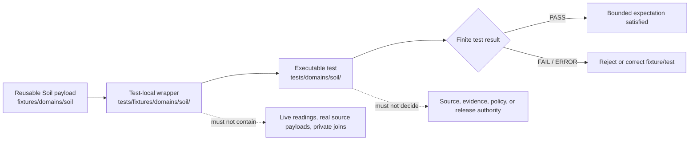

# `tests/fixtures/domains/soil/` — Soil Test-Local Fixture Routing and Support-Type Integrity Boundary

> Repository-grounded parent contract for domain-segmented, test-local Soil fixture wrappers. This subtree may organize small synthetic manifests and expectations owned by named tests, but it does not own reusable fixture payloads, executable tests, Soil truth, source admission, agronomic or engineering advice, policy decisions, release approval, or public artifacts.

<!-- [KFM_META_BLOCK_V2]
doc_id: kfm://doc/tests-fixtures-domains-soil-readme
title: tests/fixtures/domains/soil/README.md — Soil Test-Local Fixture Routing and Support-Type Integrity Boundary
type: readme; directory-readme; test-local-fixture-parent; soil; support-type-sensitive-domain; routing-boundary; non-authoritative
version: v0.2
status: draft; repository-grounded; parent-only-direct-subtree; tests-fixtures-parent-confirmed; domains-parent-index-absent; no-bare-soil-test-fixture-parent-found; no-top-level-soil-fixture-parent-found; reusable-soil-fixture-root-greenfield-stub; soil-domain-test-parent-only; soil-validator-children-readme-backed; reusable-payloads-unverified; sampled-schema-permissive; soil-policy-scaffold; sensitivity-policy-readme-absent; release-policy-readme-absent; contract-path-compatibility-guard; schema-path-compatibility-guard; executable-enforcement-unestablished; ci-todo-only; fail-closed; non-authoritative
owners: OWNER_TBD — Soil steward · Test/QA steward · Fixture steward · Source steward · Identity steward · Support-type steward · Resolution/resampling steward · Horizon/profile steward · Soil-moisture steward · Rights/sensitivity reviewer · Evidence steward · Receipt steward · Policy steward · Review steward · Release steward · Correction/rollback steward · Map/UI steward · Security reviewer · CI steward · Docs steward
created: 2026-07-06
updated: 2026-07-16
supersedes: v0.1 Soil test-fixture README
policy_label: public-doc; tests; fixtures; soil; parent-boundary; test-local-only; synthetic-only; no-network-default; no-live-source; support-type-fixed; source-role-fixed; resolution-explicit; identity-separated; depth-aware; unit-aware; no-landowner-identifying-joins; evidence-required; receipt-aware; review-gated; policy-gated; release-subordinate; correction-aware; revocation-aware; rollback-aware; no-publication
current_path: tests/fixtures/domains/soil/README.md
truth_posture:
  CONFIRMED:
    - target README v0.1 and prior blob
    - tests/fixtures parent README exists and defines the test-local versus reusable fixture split
    - tests/fixtures/domains/README.md was not found at the checked path
    - bounded search surfaced only this README under tests/fixtures/domains/soil/
    - tests/fixtures/soil/README.md was absent at the checked path
    - fixtures/soil/README.md was absent at the checked path
    - fixtures/domains/soil/README.md exists as a five-line greenfield stub
    - tests/domains/soil/README.md is a parent-only domain-test index with no confirmed child lanes
    - schemas/contracts/v1/domains/soil contains many schema files, while the sampled SoilMapUnit schema is a field-empty permissive PROPOSED scaffold
    - contracts/soil is a compatibility guard while contracts/domains/soil is the inspected working semantic-contract lane
    - schemas/contracts/v1/soil is a compatibility guard while schemas/contracts/v1/domains/soil is the populated schema lane
    - policy/domains/soil is a PROPOSED scaffold
    - policy/sensitivity/soil/README.md and policy/release/soil/README.md were absent at checked paths
    - tools/validators/domains/soil has six README-backed child lanes while executable behavior remains unverified
    - Makefile fixtures target is TODO and default test target excludes this subtree
    - domain-soil workflow jobs are TODO-only echo scaffolds
    - direct parent-level conftest.py and manifest_expectations.json are absent at named paths
  PROPOSED:
    - this parent owns domain-segmented wrapper routing, admission criteria, common invariants, proposed child-lane taxonomy, manifest expectations, consumer-backlink rules, finite outcomes, maintenance, migration, and rollback guidance
    - test-local wrappers carry only test-specific deltas and refer to reusable Soil fixtures when those fixtures exist
    - executable tests consume wrappers by reference from owning tests/domains/soil lanes
  CONFLICTED:
    - v0.1 proposed executable test modules directly inside this fixture subtree
    - v0.1 suggested pytest execution against the fixture subtree
    - canonical reusable Soil fixture root is named but remains a greenfield stub
    - contract and schema flat-path lineage remains visible despite current compatibility guards pointing to segmented working lanes
    - rich Soil doctrine and validator routing versus field-empty schemas, policy scaffolds, missing fixture payloads, and unverified executable tests
    - validator responsibilities overlap among per-domain Soil lanes, shared catalog closure, soil-suitability, agriculture-soil joins, and other cross-domain validators
    - source-role, support-type, source-resolution, depth, unit, identity, review, receipt, and reason-code vocabularies require pinned adapters rather than silent normalization
  UNKNOWN:
    - exhaustive recursive payload inventory, ignored/generated files, dynamic fixture generation, and external fixture stores
    - active consumer tests and two-way backlinks
    - accepted wrapper manifest schema, reason-code registry, support-type registry, source-resolution registry, and public-safe transform catalog
    - substantive field coverage across Soil schemas and validators beyond sampled evidence
    - current pass rates, branch-protection significance, retained CI artifacts, production consumers, and release dependency
  NEEDS_VERIFICATION:
    - accepted owners and CODEOWNERS
    - whether tests/fixtures/domains/README.md should be created
    - exact threshold for test-local versus reusable Soil fixture placement
    - canonical contract and schema homes and migration rules
    - canonical fixture IDs, versions, hashes, generator metadata, and generation receipts
    - substantive reusable payloads and executable consumers
    - no-network, no-write, no-live-source, no-leak, orphan, duplicate, and nonempty-coverage enforcement
    - support-type, resolution, identity, depth, unit, moisture, evidence, receipt, policy, review, correction, revocation, invalidation, and rollback execution
evidence_snapshot:
  repository: bartytime4life/Kansas-Frontier-Matrix
  repository_id: "1059091169"
  visibility: public
  base_ref: main
  base_commit: 6198329ebbf875cd0a2c71a391e3f4a6f9693501
  target_prior_blob: 55272c663e0698cf88b4b2321578a456ba1b81b9
  related_repository_blobs:
    directory_rules: 2affb080e6f0043867c64c7f06c1ca52030fbd55
    tests_fixtures_parent: 2d0147e85eae86f687e85c5bea0d3e61f9c3a8f7
    soil_canonical_paths: 89a0a07abe1f3f2318e25a42c53b09308c01783d
    soil_domain_test_parent: 4d22e62ce32aa311a8ff15be45167ca0f9561d32
    reusable_soil_fixture_parent: 09aab1f4ba27d061dbb0287b8a8457229d665827
    soil_contract_domain_readme: 06c5b9a435f7a9c00d5a0b9968b31a9061720d22
    soil_contract_compat_readme: 6baa05c10c4bcaf275f146b34d2b47064addcfe7
    soil_schema_domain_readme: da161213279c9154c6db538b044889aaab706d03
    soil_schema_flat_guardrail: ebb42a768fc68b1e3107ffdac89768a8c632230e
    soil_map_unit_schema: 4e94ee95e51b109cae539d87440e5dfc11a6a326
    soil_policy_readme: 551e67681f90b1c3c717c3421f1782e155121865
    soil_validator_readme: bceca437345f9fe2f84428385274b2a57f5bba01
    domain_soil_workflow: b2cdd2d6b2d178bbe7f0a47507ac26d3f4377268
    makefile: 4dc8cf633581893d83fba53219c6ea847992e6be
  direct_lane_files_confirmed:
    - tests/fixtures/domains/soil/README.md
  reusable_lane_files_confirmed:
    - fixtures/domains/soil/README.md
  executable_test_lane_files_confirmed:
    - tests/domains/soil/README.md
  validator_child_readmes_confirmed:
    - tools/validators/domains/soil/catalog_closure/README.md
    - tools/validators/domains/soil/dual_hash/README.md
    - tools/validators/domains/soil/horizon_depth/README.md
    - tools/validators/domains/soil/lineage/README.md
    - tools/validators/domains/soil/moisture/README.md
    - tools/validators/domains/soil/support_type/README.md
  checked_absent_paths:
    - tests/fixtures/domains/README.md
    - tests/fixtures/soil/README.md
    - fixtures/soil/README.md
    - tests/fixtures/domains/soil/conftest.py
    - tests/fixtures/domains/soil/manifest_expectations.json
    - policy/sensitivity/soil/README.md
    - policy/release/soil/README.md
notes:
  - "v0.2 records the requested Soil test-local subtree as parent-only in bounded evidence."
  - "This subtree owns domain-segmented test-local wrapper routing and expectations, not executable tests or reusable payloads."
  - "The reusable Soil fixture root exists but remains a greenfield stub; executable Soil tests remain parent-only."
  - "Static survey, gridded derivative, station observation, satellite grid, pedon/profile, interpretation, and synthetic support types must not collapse."
  - "README presence, filenames, contract prose, schema scaffolds, and validator routing do not count as executable or semantic coverage."
  - "This revision changes documentation only and creates no fixture payload, test, schema, contract, policy, validator, workflow, source record, Soil record, receipt, proof, release record, map artifact, API behavior, AI output, or public artifact."
[/KFM_META_BLOCK_V2] -->

<a id="top"></a>

<p>
  
  
  
  
  
  
  
  
</p>

> [!IMPORTANT]
> **This is the domain-segmented test-local wrapper parent.** Reusable Soil fixtures belong under [`fixtures/domains/soil/`](../../../../fixtures/domains/soil/README.md), but that root is currently a greenfield stub. Executable Soil tests belong under [`tests/domains/soil/`](../../../domains/soil/README.md), which is currently a parent-only test index.

> [!CAUTION]
> **README lanes, schema files, and illustrative names are not fixture coverage.** The reusable Soil fixture root is only a stub, the executable-test root has no confirmed child lanes, and the sampled `SoilMapUnit` schema has no fields and allows additional properties. None of those surfaces proves valid, invalid, support-type-safe, identity-safe, evidence-closed, receipt-complete, policy-safe, or release-safe behavior.

> [!WARNING]
> **Soil support classes must not collapse.** Static survey, gridded derivative, station observation, satellite grid, pedon/profile, interpretation, public-safe derivative, candidate, and synthetic carriers have different claim limits. Fixtures must not present survey data as current field condition, station readings as countywide truth, satellite grids as station observations, pedons as map-unit truth, or interpretations as legal, agronomic, engineering, insurance, or hazard decisions.

**Quick navigation:** [Status](#status-and-evidence-boundary) · [Purpose](#purpose-and-audience) · [Authority](#authority-and-directory-rules-basis) · [Surfaces](#three-fixture-and-test-surfaces) · [Inventory](#confirmed-current-inventory) · [Proposed lanes](#proposed-domain-segmented-child-lanes) · [Responsibilities](#parent-responsibilities-and-non-responsibilities) · [Flow](#fixture-routing-flow) · [Placement](#fixture-home-decision-law) · [Admission](#child-lane-and-wrapper-admission-contract) · [Manifest](#minimum-parent-and-child-manifest-contract) · [Consumers](#consumer-backlinks-orphans-and-nonempty-coverage) · [Invariants](#shared-soil-fixture-invariants) · [Objects](#object-and-authority-separation) · [Outcomes](#finite-outcomes-and-vocabulary-separation) · [Support](#support-type-source-role-and-resolution-boundary) · [Identity](#mukey-cokey-chkey-and-object-identity-boundary) · [Depth](#component-horizon-depth-and-property-boundary) · [Moisture](#soil-moisture-unit-qc-depth-and-time-boundary) · [Grids](#gridded-satellite-station-and-survey-boundary) · [Profiles](#pedon-profile-interpretation-and-derived-view-boundary) · [Sensitivity](#rights-sensitivity-property-and-person-join-boundary) · [Evidence](#evidencebundle-runreceipt-and-validation-boundary) · [Sources](#source-freshness-lineage-and-watcher-boundary) · [Joins](#cross-domain-joins-and-ownership-boundary) · [Public carriers](#api-map-drawer-focus-export-cache-and-ai-boundary) · [Security](#no-network-security-and-side-effects) · [Determinism](#identity-version-hash-generation-and-replay) · [Cases](#parent-case-matrix) · [Maturity](#current-maturity-and-drift-matrix) · [Commands](#validation-commands) · [CI](#ci-and-promotion-boundary) · [Failures](#failure-interpretation) · [Limitations](#what-passing-does-not-prove) · [Maintenance](#maintenance-migration-and-deprecation) · [Done](#definition-of-done) · [FAQ](#faq) · [Verification](#open-verification-register) · [Evidence ledger](#evidence-ledger) · [Rollback](#documentation-correction-and-rollback)

---

## Status and evidence boundary

**Evidence snapshot:** `main@6198329ebbf875cd0a2c71a391e3f4a6f9693501`
**Prior target blob:** `55272c663e0698cf88b4b2321578a456ba1b81b9`
**Direct subtree:** this parent README only
**Reusable fixture root:** five-line greenfield stub
**Executable Soil test tree:** parent README only
**Validator tree:** six README-backed child lanes; executables unverified
**Schema tree:** populated file inventory; sampled schemas remain field-empty scaffolds
**Higher fixture parent:** `tests/fixtures/README.md` exists; `tests/fixtures/domains/README.md` was not found

### Safe conclusion

`tests/fixtures/domains/soil/` is a domain-segmented, test-local fixture routing surface under the `tests/` responsibility root. It is not reusable fixture authority, executable-test authority, source registry, lifecycle data, contract/schema/policy authority, evidence/receipt storage, release authority, public API, map layer, or Soil truth.

The strongest current implementation statement is narrow: this README exists; its direct subtree is parent-only in bounded search; the reusable fixture root is a stub; executable Soil tests are parent-only; validators have documentation-backed child lanes; contract/schema compatibility guards exist; and executable enforcement remains unverified.

[Back to top](#top)

---

## Purpose and audience

This parent serves Soil maintainers, test authors, source and identity stewards, support-type reviewers, horizon/profile reviewers, moisture reviewers, evidence and receipt reviewers, policy and release reviewers, map/UI reviewers, security reviewers, and CI maintainers.

Its purposes are to:

- route prospective fixtures to the smallest correct responsibility home;
- define what a test-local Soil wrapper may contain;
- prevent a parent-only test fixture directory from appearing implemented;
- prevent reusable fixture authority from being inferred from a greenfield stub;
- keep executable assertions under `tests/domains/soil/`;
- preserve support type, source role, resolution, units, depth, identity, evidence, receipt, policy, release, and correction boundaries;
- keep contract/schema compatibility paths visible without creating parallel authority;
- make future implementation, migration, validation, and rollback requirements inspectable.

This README does not create a fixture corpus, runner, schema, validator, policy rule, source mapping, public route, release gate, or implementation maturity.

[Back to top](#top)

---

## Authority and Directory Rules basis

Directory placement follows responsibility rather than topic:

| Responsibility | Current or intended home | This parent’s relationship |
|---|---|---|
| Unit-test-scoped Soil wrapper | `tests/fixtures/domains/soil/` | This parent. |
| Reusable Soil fixture payload | `fixtures/domains/soil/` | Referenced; currently greenfield-stubbed. |
| Executable Soil assertion | `tests/domains/soil/` | Consumer; currently parent-only. |
| Soil semantic meaning | `contracts/domains/soil/` | Inspected working lane. |
| Flat contract lineage | `contracts/soil/` | Compatibility guard only. |
| Soil machine shape | `schemas/contracts/v1/domains/soil/` | Populated schema lane; maturity incomplete. |
| Flat schema lineage | `schemas/contracts/v1/soil/` | Compatibility guard only. |
| Soil policy | `policy/domains/soil/` | Scaffolded policy home. |
| Source identity and claims | `data/registry/sources/soil/` or accepted registry home | Never fixture authority. |
| Evidence, proof, receipts | governed proof/receipt roots | Synthetic refs only here. |
| Release/correction/rollback | `release/` and accepted release roots | Expected behavior only. |
| Lifecycle data | RAW → WORK/QUARANTINE → PROCESSED → CATALOG/TRIPLET → PUBLISHED | Never stored here. |
| Public access | governed APIs and released carriers | Never direct fixture or internal-store reads. |

Promotion is a governed state transition, not a file move. A fixture path, schema pass, validator report, map render, generated summary, or release-shaped filename cannot transfer authority.

[Back to top](#top)

---

## Three fixture and test surfaces

Current evidence supports three distinct surfaces.

| Surface | Path | Responsibility | Current maturity |
|---|---|---|---|
| Domain reusable fixtures | `fixtures/domains/soil/` | Shared Soil fixture payloads and expected outputs. | Five-line greenfield stub; payloads unverified. |
| Domain test-local wrappers | `tests/fixtures/domains/soil/` | Small wrappers and expectations owned by named Soil tests. | Parent README only. |
| Executable Soil tests | `tests/domains/soil/` | Assertions, helpers, collection, and test reports. | Parent README only; proposed child families documented. |

No bare `tests/fixtures/soil/README.md` or top-level `fixtures/soil/README.md` was found at checked paths. Their absence is bounded evidence, not a permanent repository guarantee.

[Back to top](#top)

---

## Confirmed current inventory

### Direct test-local subtree

```text
tests/fixtures/domains/soil/
`-- README.md
```

Named parent-level files checked and absent:

- `conftest.py`;
- `manifest_expectations.json`.

### Reusable Soil fixture root

```text
fixtures/domains/soil/
`-- README.md
```

The README content is only:

```text
# fixtures/domains/soil

Greenfield stub.
```

No reusable child-lane or payload inventory is established by that file.

### Executable Soil test root

```text
tests/domains/soil/
`-- README.md
```

The parent proposes future test families, but no child README lane was confirmed in its own evidence record.

### Validator routing tree

Confirmed README-backed validator children:

```text
tools/validators/domains/soil/
|-- catalog_closure/
|-- dual_hash/
|-- horizon_depth/
|-- lineage/
|-- moisture/
`-- support_type/
```

These are routing and contract surfaces. Executable scripts, reports, retained artifacts, and CI significance remain unverified.

[Back to top](#top)

---

## Proposed domain-segmented child lanes

No direct child README is confirmed below this parent. These are design options only.

| Proposed lane | Distinct responsibility | Must not duplicate |
|---|---|---|
| `identity/` | MUKEY/COKEY/CHKEY, map-unit/component/horizon, source/version, and digest wrapper expectations. | Reusable payloads or executable identity tests. |
| `horizon_depth/` | Top/bottom depth, units, overlap, gap, component-horizon join, and profile wrappers. | Validator implementation or source tables. |
| `moisture/` | Unit, depth, QC, cadence, time-kind, station/grid support, and freshness wrappers. | Live station data or executable moisture tests. |
| `support_type/` | Survey, grid, station, satellite, pedon/profile, interpretation, derivative, and synthetic anti-collapse wrappers. | Canonical support-type registry or validator code. |
| `resolution/` | Source resolution, scale support, resampling, aggregation, interpolation, and uncertainty wrappers. | Renderer/pipeline implementation or raster payloads. |
| `source/` | SourceDescriptor, role, rights, permitted claims, vintage, cadence, source-head, and watcher wrappers. | Registry records or source exports. |
| `evidence_receipts/` | EvidenceBundle, RunReceipt, validation, correction, and rollback ref expectations. | Real proofs or receipts. |
| `policy_release/` | Rights, sensitivity, generalization, denial, release, withdrawal, invalidation, and rollback wrappers. | Binding policy or release objects. |

A new child lane must explain why it belongs under the test-local parent rather than the reusable fixture root or executable test root.

[Back to top](#top)

---

## Parent responsibilities and non-responsibilities

### This parent owns

- domain-segmented wrapper routing;
- the three-surface decision rule;
- shared synthetic, no-network, no-write, no-live-source, and non-authority rules;
- child-lane admission criteria;
- wrapper manifest expectations;
- consumer backlinks, orphan checks, duplicate checks, and nonempty coverage;
- support-type, identity, resolution, depth, unit, evidence, receipt, correction, and rollback boundaries;
- compatibility and migration guidance for flat contract/schema guardrails;
- explicit UNKNOWN, CONFLICTED, and NEEDS VERIFICATION registers.

### This parent does not own

- fixture payload semantics already owned by contracts and schemas;
- executable assertions or test helpers;
- source descriptors, lifecycle records, soil observations, evidence, receipts, policy decisions, reviews, or releases;
- live APIs, maps, tiles, exports, caches, models, or AI answers;
- agronomic, engineering, legal, insurance, compliance, land-value, or hazard decisions;
- canonical migration decisions for disputed contract, schema, fixture, or validator homes.

[Back to top](#top)

---

## Fixture routing flow



The diagram is a routing model, not proof that payloads, child wrappers, executables, validators, CI jobs, or release gates exist.

[Back to top](#top)

---

## Fixture-home decision law

Use the smallest correct home:

1. **Reusable across multiple tests, validators, pipelines, or public dry-runs?** Use an accepted lane under `fixtures/domains/soil/`.
2. **Owned by one Soil test area and adds only local parameters or expected deltas?** A wrapper under this parent may be appropriate.
3. **Contains executable assertions, collection hooks, or helpers?** Use `tests/domains/soil/`.
4. **Carries real source, lifecycle, evidence, policy, receipt, registry, or release state?** Use the owning governed root.
5. **Contains live observations, source exports, real survey tables, real raster tiles, private-property detail, landowner-identifying joins, or restricted field notes?** Do not place it in repository fixtures.
6. **Duplicates another fixture?** Reject unless a migration record identifies source, destination, checksum, consumers, compatibility period, and rollback.
7. **Uses a path only because the topic is Soil?** Re-evaluate; responsibility and lifecycle determine placement.
8. **Relies on a flat contract/schema path?** Preserve the compatibility pointer and follow the accepted migration decision; do not create parallel authority.

Never interpret a file move as promotion, source admission, evidence closure, or authority transfer.

[Back to top](#top)

---

## Child-lane and wrapper admission contract

A new child lane requires:

- a distinct test-local responsibility;
- at least one named proposed or confirmed executable consumer;
- a clear reusable fixture relationship;
- an explicit non-authority statement;
- synthetic/public-safe input constraints;
- positive and fail-closed case requirements;
- finite outcomes and safe reason codes;
- no-network, no-governed-root-write, no-live-source, and no-sensitive-output rules;
- owner, deprecation, migration, and rollback expectations;
- parent index update.

A wrapper file belongs here only when:

- it is owned by a named Soil test;
- it is too narrow to be reusable;
- it contains no real survey, station, satellite, pedon, parcel, ownership, person, credential, endpoint, or production trust material;
- it pins applicable reusable fixture, contract/schema, policy/profile, source-role, support-type, resolution, and expected outcome;
- it declares prohibited claims and side effects;
- it has a two-way consumer backlink;
- removal cannot change registry, lifecycle, policy, release, or public state.

README-only lanes remain routing surfaces until real payloads and consumers satisfy these conditions.

[Back to top](#top)

---

## Minimum parent and child manifest contract

The example below is **PROPOSED** and intentionally contains no real Soil information.

```json
{
  "fixture_manifest_id": "kfm://fixture-test/soil/example",
  "fixture_version": "v1",
  "domain": "soil",
  "fixture_scope": "test_local_domain_segmented",
  "fixture_authority": "non_authoritative",
  "synthetic": true,
  "child_lane": "support_type",
  "consumer_refs": [
    "tests/domains/soil/support_type/test_support_type_no_fusion.py"
  ],
  "canonical_fixture_ref": "fixtures/domains/soil/support_type/invalid/example.json",
  "object_family": "SoilProperty",
  "source_role": "synthetic",
  "support_type": "gridded_derivative",
  "source_resolution": "toy_250m_grid",
  "resampling_posture": "explicit_nearest_neighbor_canary",
  "mukey": "SYN-MUKEY-001",
  "cokey": null,
  "chkey": null,
  "depth_top_cm": 0,
  "depth_bottom_cm": 10,
  "unit": "synthetic_unit",
  "contains_live_source_data": false,
  "contains_real_property_join": false,
  "evidence_ref": "evidence-ref:fixture:soil-example",
  "run_receipt_ref": "run-receipt:fixture:soil-example",
  "review_ref": null,
  "policy_decision_ref": null,
  "release_manifest_ref": null,
  "rollback_card_ref": "rollback-card:fixture:soil-example",
  "expected_test_outcome": "PASS",
  "expected_domain_outcome": "DENY",
  "reason_code": "SUPPORT_TYPE_FUSION_DENIED",
  "must_not_claim": [
    "SOURCE_ADMITTED",
    "CURRENT_FIELD_CONDITION_CONFIRMED",
    "MAP_UNIT_TRUTH_CONFIRMED",
    "STATION_OBSERVATION_CONFIRMED",
    "SUPPORT_TYPES_EQUIVALENT",
    "EVIDENCE_CLOSED",
    "POLICY_ALLOWED",
    "RELEASED",
    "MAP_TRUTH",
    "AI_TRUTH"
  ]
}
```

Future schema work must settle identity, version, digest, generator, fixture-home posture, object family, source role, support type, resolution, resampling, depth, units, evidence/receipt refs, test versus domain outcomes, reason codes, obligations, and correction/withdrawal/revocation/rollback references.

[Back to top](#top)

---

## Consumer backlinks, orphans, and nonempty coverage

Mature fixture coverage requires two-way traceability:

```text
wrapper manifest -> executable consumer
executable consumer -> wrapper manifest
```

Required checks:

- every wrapper names at least one active consumer;
- every consumer reference resolves;
- every child lane has an owner;
- reusable fixtures are referenced rather than copied;
- every consequential family has positive and fail-closed cases;
- support-type anti-collapse, identity, horizon-depth, moisture, no-live-source, and private-join denial cases are nonempty;
- placeholder paths, READMEs, field-empty schemas, and routing indexes do not count as semantic coverage;
- zero collected cases is a failure, not a green result;
- skipped cases carry reason, owner, and expiry;
- orphaned wrappers and unused reusable fixtures are reported;
- test-local, reusable, executable-test, schema, and validator indexes remain synchronized.

[Back to top](#top)

---

## Shared Soil fixture invariants

| Invariant | Required behavior | Default failure |
|---|---|---|
| Synthetic identity | Use conspicuous fake keys, sources, times, values, geometries, and non-authority markers. | Reject fixture. |
| Fixture-home integrity | Reusable, test-local, and executable homes remain distinct. | Block admission. |
| Source-role integrity | Observed, regulatory, modeled, aggregate, administrative, candidate, and synthetic roles stay fixed. | `DENY` or `ABSTAIN`. |
| Support-type integrity | Survey, grid, station, satellite, pedon/profile, interpretation, derivative, and synthetic support stay distinct. | `DENY` or fail validation. |
| Resolution integrity | Source scale, cell size, survey scale, aggregation, interpolation, and resampling stay explicit. | `DENY` or fail validation. |
| Identity integrity | MUKEY, COKEY, CHKEY, component, horizon, pedon, profile, property, and derivative identities stay distinct. | Reject fixture. |
| Depth integrity | Horizon/profile depth units, bounds, ordering, overlap, and gaps remain explicit. | Reject or abstain. |
| Unit/QC integrity | Observation parameter, unit, method, depth, QC, source, and time remain bound. | Reject or abstain. |
| Property/person protection | Landowner-identifying, parcel, person, private field, and restricted joins fail closed. | `DENY` or quarantine. |
| Evidence separation | EvidenceRef must resolve in governed contexts; a fixture ref is not proof. | `ABSTAIN`. |
| Receipt separation | A RunReceipt-like fixture is process-memory shape, not truth proof. | Block promotion/release. |
| Policy separation | Fixture metadata is not a PolicyDecision. | Block consequential use. |
| Review separation | Fixture or schema pass is not review approval. | Block consequential use. |
| Release separation | Fixture success is not release or publication approval. | Promotion block. |
| Watcher non-publisher | Watchers emit no-op/proposed-work only and never publish. | Reject direct mutation/publish. |
| No-network | Default tests use local synthetic inputs only. | `ERROR`. |
| No governed-root writes | Tests write only to test-owned temporary locations. | `ERROR`. |
| Deterministic replay | Same inputs and pins yield the same bounded result. | Fail test. |
| Correction/rollback | Superseded or withdrawn fixtures invalidate consumers. | Fail and block release use. |
| Cross-domain ownership | Agriculture, Hydrology, Geology, Habitat, Flora, Fauna, Hazards, Atmosphere, and People/Land retain authority. | `DENY` or drift finding. |

[Back to top](#top)

---

## Object and authority separation

| Family | Fixture may model | Fixture must not become |
|---|---|---|
| `SoilMapUnit` | Toy map-unit identity, source vintage, geometry, and lineage. | Official NRCS map-unit truth or current field condition. |
| `SoilComponent` | Toy component identity, percent, rank, and map-unit relation. | Map-unit identity or exhaustive site composition. |
| `Horizon` | Synthetic layer identity, top/bottom depth, texture/property context. | Component, pedon, or observation truth. |
| `SoilProperty` | Toy property, unit, method, depth, support, and uncertainty. | Unqualified agronomic or engineering decision. |
| `HydrologicSoilGroup` | Synthetic classification and method/version. | Hydrology truth, runoff forecast, or regulatory decision. |
| `SoilMoistureObservation` | Toy station/grid observation with units, depth, QC, time, and support. | Current field condition, countywide truth, or warning. |
| `Pedon` / `SoilProfileView` | Synthetic profile evidence and depth structure. | Map-unit truth, landowner identity, or site-wide condition. |
| `ComponentHorizonJoin` | Toy relationship and weighting logic. | Source join authority or canonical database result. |
| `ErosionRisk` | Synthetic interpretation, assumptions, scale, uncertainty, and evidence. | Conservation directive, compliance, insurance, or legal conclusion. |
| `SuitabilityRating` | Toy interpretation with intended use, method, limits, and scale. | Farm decision, economic advice, engineering design, or release authority. |
| `SoilTimeCaveat` | Synthetic source/observation/retrieval/release/correction limitations. | Hidden disclaimer or substitute for temporal evidence. |
| SourceDescriptor / watcher | Synthetic governance and freshness metadata. | Registry admission, source truth, or publication. |
| EvidenceBundle / RunReceipt | Toy support and provenance refs. | Real proof, process memory, policy decision, or approval. |
| Decision envelope | Bounded expected outcome and obligations. | Evidence, receipt storage, release approval, or API implementation. |
| Public carrier | Expected safe projection or denial. | Direct fixture exposure, map truth, or AI authority. |

[Back to top](#top)

---

## Finite outcomes and vocabulary separation

Do not force unrelated states into one enum.

| Vocabulary | Example values | Owner |
|---|---|---|
| Test result | `PASS`, `FAIL`, `SKIP`, `ERROR` | Test framework |
| Runtime/domain result | `ANSWER`, `ABSTAIN`, `DENY`, `HOLD`, `ERROR` | Governed runtime/policy |
| Source role | observed, regulatory, modeled, aggregate, administrative, candidate, synthetic | Source governance |
| Support type | static survey, gridded derivative, station observation, satellite grid, pedon/profile, interpretation, public-safe derivative, synthetic | Soil contract/policy governance |
| Resolution state | native, resampled, aggregated, interpolated, generalized, unknown | Transform/resolution contract |
| Fixture maturity | README-only, placeholder, substantive, golden, deprecated | Fixture governance |
| Evidence state | missing, unresolved, partial, conflicted, resolved, withdrawn | Evidence system |
| Release state | candidate, review-required, denied, released, superseded, withdrawn, rolled-back | Release authority |

A test may pass because the governed domain outcome is `DENY` or `ABSTAIN`. A golden fixture is not official Soil truth. A released artifact is not necessarily current, precise, or fit for a new use.

[Back to top](#top)

---

## Support type, source role, and resolution boundary

Support type describes what kind of evidence carrier a Soil record is. Source role describes how a source may support claims. Resolution describes scale or sampling support. They are related but not interchangeable.

Required anti-collapse cases include:

- static survey presented as live field condition;
- gridded derivative presented as survey polygon truth;
- station observation presented as countywide or map-unit truth;
- satellite grid presented as in-situ station observation;
- pedon/profile evidence presented as full map-unit composition;
- interpretation presented as observed measurement;
- public-safe derivative presented as canonical internal geometry;
- candidate or synthetic record presented as admitted observation;
- resampled raster presented at false native precision;
- aggregate statistic presented as original per-site evidence.

Every fixture must make its support type, source role, resolution, and permitted claims visible where material.

[Back to top](#top)

---

## MUKEY, COKEY, CHKEY, and object identity boundary

Soil identity must not be inferred from display labels, geometry coincidence, serialization order, or a convenient join.

Required cases include:

- fake but syntactically distinct MUKEY, COKEY, and CHKEY values;
- component that references the wrong MUKEY;
- horizon that references the wrong COKEY;
- duplicate keys with conflicting source vintage;
- geometry-only map-unit identity;
- component percent sum outside declared policy;
- source-version change without supersession;
- derived grid cell treated as MUKEY identity;
- pedon/profile identity treated as component or horizon identity;
- identity crosswalk without direction, lossiness, or provenance.

Identity success proves only the declared identity and relationship checks, not source authority or real NRCS lineage.

[Back to top](#top)

---

## Component, horizon, depth, and property boundary

Horizon and component fixtures must preserve:

- top and bottom depth with explicit units;
- ordering and non-negative intervals;
- overlap, gap, truncation, and missing-bound posture;
- component-to-map-unit and horizon-to-component relationships;
- property method, unit, representative value, range, and null posture;
- component percent and aggregation method;
- source vintage and transform lineage;
- uncertainty and intended-use limitations.

Fail-closed cases should include reversed depths, overlapping horizons, mixed depth units, property without method or unit, horizon linked to the wrong component, weighted aggregation without weights, and interpretation derived from unsupported properties.

[Back to top](#top)

---

## Soil moisture, unit, QC, depth, and time boundary

Soil-moisture fixtures may model station, network, satellite, gridded, or synthetic observations, but they must preserve support and time semantics.

Required fields or expectations where material:

- synthetic site or grid identity;
- parameter and unit;
- measurement or retrieval method;
- depth or layer;
- QC/qualifier state;
- observed time;
- source time;
- retrieval time;
- valid time or applicability window;
- freshness/stale state;
- evidence and source refs;
- release/correction posture.

Required negative cases include unit mismatch, unknown depth, missing QC, retrieval time used as observation time, satellite grid labeled station reading, station reading presented as statewide truth, stale reading displayed current, and live-looking value without a conspicuous synthetic marker.

[Back to top](#top)

---

## Gridded, satellite, station, and survey boundary

Fixtures that compare or combine gSSURGO/gNATSGO-like, SoilGrids-like, SMAP-like, station-like, and survey-like carriers must expose:

- native support type;
- source version/vintage;
- cell size or survey scale;
- depth support;
- resampling/interpolation/aggregation method;
- nodata and coverage posture;
- uncertainty and edge effects;
- temporal support;
- permitted claims;
- transform/receipt expectation.

A composite is not automatically a coherent “soil condition” surface. If support classes cannot be reconciled under a declared contract and policy, the expected result is `DENY`, `HOLD`, or `ABSTAIN`.

[Back to top](#top)

---

## Pedon, profile, interpretation, and derived-view boundary

Pedon and profile fixtures represent local evidence with explicit site, method, depth, and support limitations. They do not automatically describe an entire map unit.

Interpretation fixtures such as erosion risk and suitability ratings must carry:

- intended use;
- source properties and evidence refs;
- method/model/version;
- support type and resolution;
- assumptions and limitations;
- uncertainty or confidence posture;
- rights and sensitivity posture;
- review and release expectation;
- explicit non-authority statement.

A rating fixture must not become agronomic advice, engineering design, land valuation, insurance determination, regulatory compliance, legal conclusion, or operational instruction.

[Back to top](#top)

---

## Rights, sensitivity, property, and person join boundary

Soil data is often public, but joins can create sensitive or misleading context.

Fixtures must fail closed when they expose or imply:

- landowner identity;
- parcel ownership or title;
- private farm or field performance;
- precise private pedon or sensor location;
- proprietary field notes;
- restricted source terms;
- critical infrastructure context;
- precise groundwater/well context borrowed from another lane;
- person/farm/operation linkage without rights, purpose, and review support;
- reverse-engineerable geometry after public transformation.

Use conspicuous synthetic canaries, generalized cells, fake parcel tokens, or no geometry. A negative test must not store the harmful detail it is meant to deny.

[Back to top](#top)

---

## EvidenceBundle, RunReceipt, and validation boundary

These objects have different responsibilities:

| Object | Responsibility | Must not become |
|---|---|---|
| EvidenceRef | Stable pointer to claim support. | Evidence closure by itself. |
| EvidenceBundle | Claim-scope support, provenance, rights, limitations, and integrity. | Policy or release decision. |
| RunReceipt | Process memory for a governed run. | Proof that outputs are true. |
| Validation report | Findings against declared contracts, schemas, and policy inputs. | Policy approval or publication. |
| Decision envelope | Bounded finite outcome and obligations. | Evidence, receipt storage, or release authority. |

Fixture refs may model missing, conflicted, partial, resolved, corrected, superseded, or withdrawn states. Real trust-bearing records remain in their governed roots.

[Back to top](#top)

---

## Source freshness, lineage, and watcher boundary

Source-like fixtures must keep source identity, role, rights, permitted claims, source family, vintage, retrieval basis, query/hash, cadence, freshness, activation, and supersession explicit.

Required negative cases include:

- survey source used as current observation;
- SDA query result treated as a durable source record without query/provenance;
- gSSURGO/gNATSGO derivative presented as native SSURGO polygon truth;
- SoilGrids or SMAP modeled/gridded carrier upgraded to observed;
- station source used as field/farm truth;
- candidate source treated as active;
- stale source-head treated as current;
- watcher output writing catalog or published state;
- unresolved rights treated as public-safe.

Watchers compare state and emit no-op or proposed-work candidates. They never admit sources, publish records, or mutate public state.

[Back to top](#top)

---

## Cross-domain joins and ownership boundary

Soil lends context but does not absorb neighboring authority.

| Neighbor | Soil may lend or receive | Must remain with owner |
|---|---|---|
| Agriculture | Soil properties, hydrologic group, suitability context with limits. | Crop, yield, management, economics, and farm decisions. |
| Hydrology | Hydrologic soil group and drainage context; water observations as cited context. | Streamflow, groundwater, flood, and water truth. |
| Geology | Parent-material or lithology context with evidence. | Geologic units, boreholes, stratigraphy, and resources. |
| Habitat/Flora/Fauna | Public-safe soil context for habitat/occurrence analysis. | Habitat, species, occurrence, and sensitivity truth. |
| Hazards | Erosion, drought, flood-support context with role labels. | Warning, emergency, exposure, and hazard authority. |
| Atmosphere | Precipitation/weather context as external support. | Weather and atmospheric observations/models. |
| People/Land | Administrative reference only where allowed. | Ownership, title, consent, person, and operation identity. |
| Spatial Foundation | Soil consumes CRS/generalization profiles. | CRS, GeographyVersion, and base-layer authority. |

Every join must preserve ownership, source role, support type, sensitivity, evidence, and release posture.

[Back to top](#top)

---

## API, map, drawer, Focus, export, cache, and AI boundary

Fixture success does not establish a public route or safe carrier.

Public-facing expectations must prove:

- governed/released input rather than direct fixture or lifecycle-store reads;
- source role, support type, resolution, time, evidence, policy, and release state remain visible;
- static survey, gridded, station, satellite, pedon/profile, and interpretation carriers are labeled distinctly;
- no private property/person or restricted-detail leakage;
- public geometry and precision follow an accepted transform/profile;
- stale, superseded, corrected, or withdrawn state invalidates caches and exports;
- Evidence Drawer and Focus output expose limitations and evidence posture;
- AI language cannot upgrade fixture, model, interpretation, or derivative data into truth;
- no operational agronomic, engineering, legal, insurance, valuation, or compliance recommendation is implied.

[Back to top](#top)

---

## No-network, security, and side effects

Default fixture tests must be hermetic.

They must not:

- call NRCS Web Soil Survey, SDA, SSURGO/gSSURGO/gNATSGO services, Kansas Mesonet, SCAN/AWDB, USCRN, SMAP, SoilGrids, map services, governed APIs, or AI runtimes;
- depend on credentials, private endpoints, production logs, telemetry, or external clocks;
- read RAW, WORK, QUARANTINE, unpublished, canonical, or production stores as authority;
- write to registry, catalog, published, proof, receipt, release, or public artifact roots;
- emit live-looking observations, real source excerpts, parcel/person identifiers, or restricted precision in diagnostics.

Allowed writes are limited to test-owned temporary locations.

[Back to top](#top)

---

## Identity, version, hash, generation, and replay

Each substantive fixture or wrapper should eventually pin:

- stable fixture ID and version;
- object/source identity and role;
- support type and permitted claims;
- source vintage and schema/contract version;
- generator name/version and deterministic seed where generated;
- resolution, resampling, aggregation, and generalization posture;
- depth, unit, method, and QC posture where material;
- reusable fixture ref and digest;
- evidence, receipt, policy, review, release, correction, and rollback refs;
- expected test/domain outcomes and safe reason code;
- consumer refs and supersession lineage;
- content and manifest hashes.

Hashes must not encode or leak restricted material. Replay success proves deterministic reproduction of the fixture, not real-world Soil truth.

[Back to top](#top)

---

## Parent case matrix

| Case family | Parent expectation | Required failure example |
|---|---|---|
| Direct inventory | Confirmed child lanes indexed exactly once. | Proposed lane reported as implemented. |
| Fixture placement | Reusable, test-local, and executable homes remain distinct. | Copied payload or executable in wrapper lane. |
| Consumer linkage | Every wrapper has a live consumer backlink. | Orphan wrapper or unresolved test ref. |
| Nonempty coverage | Consequential family has positive and fail-closed cases. | README-only or zero-case green result. |
| Source role | Role remains bounded. | Grid/model/candidate upcast to observed. |
| Support type | Support remains explicit. | Survey/station/satellite/pedon/interpretation collapse. |
| Resolution | Scale and transform remain explicit. | Resampled derivative presented at false native precision. |
| Identity | MUKEY/COKEY/CHKEY and object identities remain distinct. | Horizon attached to wrong component or grid cell treated as MUKEY. |
| Depth/unit | Bounds, units, method, and QC remain valid. | Reversed depth, incompatible units, or missing QC. |
| Moisture/time | Observation and retrieval semantics remain distinct. | Stale synthetic reading displayed current. |
| Rights/sensitivity | Public-safe precision and join posture. | Landowner/person/private-field detail exposed. |
| Evidence/receipt | Each object retains its responsibility. | Receipt treated as truth or evidence closure. |
| Public carrier | Governed/released synthetic output only. | Direct fixture/internal read. |
| Correction/rollback | Invalidation reaches dependent expectations. | Withdrawn fixture remains active. |
| Hermeticity | Local deterministic execution. | Network, secret, external service, or governed-root write. |
| Diagnostics | Safe finite reason codes. | Source payload, private detail, endpoint, or live value in errors. |

[Back to top](#top)

---

## Current maturity and drift matrix

| Surface | Confirmed current posture | Open risk |
|---|---|---|
| This parent | v0.1 before this revision; parent-only direct subtree. | Stale executable placement/run guidance. |
| Higher fixture parent | Exists and defines test-local/reusable split. | `tests/fixtures/domains/README.md` absent. |
| Reusable Soil fixture root | Five-line greenfield stub. | No payload or child-lane inventory. |
| Executable Soil test root | Parent README only. | No confirmed child lanes, modules, or pass rates. |
| Contract lane | Populated segmented working lane. | Flat compatibility guard and lineage references require migration discipline. |
| Schema lane | Many files; domain index says opened examples are field-empty scaffolds. | Shape and semantic coverage can appear more mature than they are. |
| Flat schema lane | Compatibility guard only. | Parallel authority risk. |
| Soil policy | Domain README is a PROPOSED scaffold. | Binding policy/runtime evaluation unestablished. |
| Sensitivity/release policy | Named README paths absent. | Canonical policy content unresolved. |
| Validators | Six per-domain README-backed child lanes. | Executables, reports, receipts, and CI wiring unverified. |
| Shared validators | Catalog closure, soil-suitability, agriculture-soil joins, and cross-domain lanes exist. | Responsibility overlap and routing thresholds require verification. |
| Makefile | `fixtures` target exists. | TODO only; default `test` excludes this subtree. |
| Soil workflow | Triggered on PR/push. | Jobs only echo TODO commands. |
| Branch protection | UNKNOWN. | Green optional checks may not gate promotion. |

[Back to top](#top)

---

## Validation commands

### Confirmed inventory commands for a local checkout

```bash
find tests/fixtures/domains/soil -maxdepth 4 -type f | sort
find fixtures/domains/soil -maxdepth 5 -type f | sort
find tests/domains/soil -maxdepth 4 -type f | sort
find tools/validators/domains/soil -maxdepth 4 -type f | sort
find schemas/contracts/v1/domains/soil -maxdepth 3 -type f | sort
```

### Proposed executable command

```bash
python -m pytest tests/domains/soil -q
```

This command is **PROPOSED / NEEDS VERIFICATION** until executable collection and consumer relationships are confirmed.

A future runner must fail when:

- zero cases are collected;
- only READMEs, placeholders, or field-empty schemas are present;
- indexes diverge;
- wrappers lack consumers;
- reusable fixtures are duplicated;
- support-type, resolution, identity, depth, unit, or time vocabulary is unknown;
- live source or restricted content is detected;
- network or governed-root writes occur;
- compatibility paths silently become canonical authority.

[Back to top](#top)

---

## CI and promotion boundary

Current checked repository behavior:

- `make fixtures` prints a TODO message;
- `make test` runs only `tests/schemas` and `tests/contracts`;
- the `domain-soil` workflow checks out the repository and echoes TODO commands;
- no retained fixture inventory, no-network report, support-type report, identity report, horizon-depth report, moisture report, orphan report, or coverage artifact was established;
- required-check and branch-protection status is UNKNOWN.

A future CI gate should emit a deterministic report with snapshot commit, inventories, wrapper/consumer counts, fixture refs/digests, positive/fail-closed counts, support-type/resolution/identity/depth/unit/moisture findings, no-network findings, schema/policy pins, finite outcomes, correction/rollback checks, and overall status.

A green CI result remains subordinate to evidence, policy, review, promotion, release, correction, and rollback authority.

[Back to top](#top)

---

## Failure interpretation

| Failure | Meaning | Safe response |
|---|---|---|
| Parent/index drift | Documentation inventory is unreliable. | Block promotion of fixture changes. |
| Wrapper has no consumer | Fixture is orphaned or speculative. | Reject or move to documented proposal. |
| Reusable payload copied locally | Fixture authority is drifting. | Remove duplicate and migrate refs. |
| Zero/README/scaffold-only cases | Coverage is vacuous. | Fail suite. |
| Unknown source/support/resolution/outcome | Contract drift or unsupported value. | `ERROR`; fail closed. |
| Support types fused | Claim support was upgraded or flattened. | `DENY` or `ABSTAIN`. |
| False precision | Resampled/generalized data presented as native. | `DENY`; expose transform posture. |
| Identity collapse | MUKEY/COKEY/CHKEY or object families collapsed. | Reject fixture. |
| Invalid depth/unit/QC | Observation/profile semantics are unsupported. | Reject or abstain. |
| Live/stale value presented current | Freshness boundary failed. | `DENY`; mark stale/synthetic. |
| Private/property/person detail | Sensitivity boundary failed. | Reject, remove, and escalate safely. |
| Missing evidence/receipt/policy/release refs | Consequential output unsupported. | `DENY`, `HOLD`, or `ABSTAIN`. |
| Network or governed-root write | Hermeticity failed. | `ERROR`; block. |
| Stale/superseded fixture active | Invalidation failed. | Fail and block release use. |
| Unsafe diagnostics | Error channel leaks source or restricted content. | Suppress and treat as security failure. |

[Back to top](#top)

---

## What passing does not prove

Passing wrapper and fixture tests do not prove:

- a source is admitted, active, reachable, current, or authoritative;
- an NRCS key, map unit, component, horizon, property, pedon, or profile is accurate;
- a station or satellite value is current or representative;
- a survey, gridded derivative, station, satellite, pedon/profile, or interpretation support class can be fused;
- a Soil interpretation is appropriate for agronomic, engineering, legal, insurance, valuation, compliance, or operational decisions;
- a property, person, parcel, farm, well, or infrastructure join is public-safe;
- evidence, receipt, review, policy, transformation, promotion, release, correction, or rollback gates are complete;
- an API route, map layer, tile, export, cache, drawer, Focus answer, or AI response is implemented or publishable;
- production correction, withdrawal, revocation, invalidation, or rollback propagated;
- branch protection requires the checks;
- the repository contains a substantive Soil fixture corpus.

Passing proves only that named tests satisfied pinned expectations for synthetic inputs.

[Back to top](#top)

---

## Maintenance, migration, and deprecation

When changing this parent or a related Soil fixture surface:

1. inspect current test-local, reusable, executable-test, schema, contract, policy, validator, and source-registry inventories;
2. verify Directory Rules, Soil canonical paths, and relevant ADR/drift entries;
3. name owners and consumers;
4. choose the smallest correct fixture home;
5. keep inputs synthetic, non-current, public-safe, and non-authoritative;
6. pin schema, contract, source descriptor, support type, resolution/profile, policy, generator, and expected outcomes;
7. add positive and fail-closed cases;
8. update two-way backlinks;
9. run no-network, no-write, no-live-source, no-leak, orphan, duplicate, and nonempty checks;
10. update every affected parent and child index together;
11. document correction, supersession, withdrawal, revocation, invalidation, and rollback effects.

Any path, object name, fixture home, contract/schema home, validator home, support type, source role, resolution vocabulary, review state, or reason-code consolidation requires full inbound-reference and payload inventory, declared authority, checksums, consumer updates, compatibility period, deprecation marker, migration note/receipt, rollback target, and an ADR when authority changes materially.

[Back to top](#top)

---

## Definition of done

- [ ] owners and CODEOWNERS are confirmed;
- [ ] the `tests/fixtures/domains/` parent decision is accepted;
- [ ] the test-local versus reusable fixture threshold is accepted;
- [ ] contract and schema compatibility paths have accepted migration/alias rules;
- [ ] child-lane admission criteria are approved;
- [ ] a machine-checkable parent/child manifest contract exists;
- [ ] the reusable Soil fixture root has substantive payloads or is explicitly documentation-only;
- [ ] executable consumers and two-way backlinks exist;
- [ ] reusable fixture refs and digests are pinned;
- [ ] positive and fail-closed case families are nonempty;
- [ ] zero-case, README-only, field-empty-schema-only, orphan, and duplicate checks fail closed;
- [ ] source-role, support-type, resolution, and object-family anti-collapse tests pass;
- [ ] MUKEY/COKEY/CHKEY, horizon-depth, unit/QC, and moisture-time tests pass;
- [ ] rights, private-property/person, restricted precision, and public transform tests fail closed;
- [ ] evidence, receipt, policy, promotion, release, correction, and rollback closure is tested;
- [ ] no-network and no-governed-root-write controls are enforced;
- [ ] CI emits a retained deterministic report;
- [ ] required-check significance is verified;
- [ ] migration, correction, deprecation, and rollback instructions are current.

Until then, this README is a routing and safety contract, not proof of implemented fixture coverage.

[Back to top](#top)

---

## FAQ

### Why are executable tests not stored beside these wrappers?

Executable assertions belong under `tests/domains/soil/`. Keeping test code separate prevents fixture directories from becoming implementation or authority surfaces.

### Does `fixtures/domains/soil/README.md` prove reusable fixture coverage?

No. It is currently a five-line greenfield stub and establishes no child-lane or payload inventory.

### Do the many Soil schemas prove field-level coverage?

No. The domain schema index says opened examples are field-empty permissive scaffolds; the sampled `SoilMapUnit` schema confirms that posture.

### Can real SSURGO, SDA, SMAP, SoilGrids, Mesonet, SCAN, or USCRN content be used as fixtures?

Not in this test-local lane. Use conspicuous synthetic carriers. Real source material must follow source admission, lifecycle, rights, evidence, policy, review, release, correction, and rollback controls.

### Can a valid fixture produce `DENY`?

Yes. A structurally valid support-type fusion, false-precision, private-join, or unsupported interpretation request should produce the governed result `DENY`. The test passes when the denial is correct.

### Can a pedon or station observation represent a whole map unit?

Not without an explicit, evidence-backed model or aggregation contract and policy posture. The default fixture expectation is no silent upcast.

### Which contract or schema path is canonical?

Current repository evidence treats `contracts/domains/soil/` and `schemas/contracts/v1/domains/soil/` as inspected working lanes. The flat paths are compatibility guards. Final migration and ADR posture still requires verification.

### Does schema validity prove release readiness?

No. Shape validation is separate from meaning, source role, support type, resolution, identity, evidence, receipts, rights, sensitivity, policy, review, release, correction, and rollback.

[Back to top](#top)

---

## Open verification register

| ID | Question | Status |
|---|---|---|
| SOIL-FIX-PARENT-001 | Who owns this parent and which CODEOWNERS rule applies? | NEEDS VERIFICATION |
| SOIL-FIX-PARENT-002 | Should `tests/fixtures/domains/README.md` be created? | NEEDS VERIFICATION |
| SOIL-FIX-PARENT-003 | What exact rule separates test-local wrappers from reusable Soil fixtures? | NEEDS VERIFICATION |
| SOIL-FIX-PARENT-004 | What schema defines parent and child wrapper manifests? | UNKNOWN |
| SOIL-FIX-PARENT-005 | What are canonical fixture ID, version, digest, and generator rules? | NEEDS VERIFICATION |
| SOIL-FIX-PARENT-006 | Which proposed direct child lanes should exist? | NEEDS VERIFICATION |
| SOIL-FIX-PARENT-007 | Which reusable payload files currently exist and are substantive? | UNKNOWN |
| SOIL-FIX-PARENT-008 | Which executable tests consume each fixture lane? | UNKNOWN |
| SOIL-FIX-PARENT-009 | How are backlinks, orphans, duplicates, and zero-case coverage enforced? | NEEDS VERIFICATION |
| SOIL-FIX-PARENT-010 | Which Soil schemas are substantive rather than field-empty scaffolds? | UNKNOWN |
| SOIL-FIX-PARENT-011 | What is the accepted long-term contract-path migration posture? | CONFLICTED / NEEDS VERIFICATION |
| SOIL-FIX-PARENT-012 | What is the accepted long-term schema-path migration posture? | CONFLICTED / NEEDS VERIFICATION |
| SOIL-FIX-PARENT-013 | Where are accepted Soil sensitivity and release policy bundles? | UNKNOWN |
| SOIL-FIX-PARENT-014 | Which Soil validator surface is canonical for each concern? | CONFLICTED / NEEDS VERIFICATION |
| SOIL-FIX-PARENT-015 | What source-role and permitted-claims vocabularies are canonical? | NEEDS VERIFICATION |
| SOIL-FIX-PARENT-016 | What support-type registry and adapter rules are canonical? | NEEDS VERIFICATION |
| SOIL-FIX-PARENT-017 | What source-resolution, aggregation, interpolation, and resampling vocabularies are canonical? | NEEDS VERIFICATION |
| SOIL-FIX-PARENT-018 | What constitutes substantive MUKEY/COKEY/CHKEY identity coverage? | NEEDS VERIFICATION |
| SOIL-FIX-PARENT-019 | What horizon-depth, gap, overlap, truncation, and unit rules are accepted? | UNKNOWN |
| SOIL-FIX-PARENT-020 | What fields are mandatory for SoilMoistureObservation fixtures? | UNKNOWN |
| SOIL-FIX-PARENT-021 | What public-safe property/person/parcel join profile is accepted? | UNKNOWN |
| SOIL-FIX-PARENT-022 | How are EvidenceBundle, RunReceipt, validation, and policy closure tested independently? | NEEDS VERIFICATION |
| SOIL-FIX-PARENT-023 | How is watcher non-publisher behavior enforced? | NEEDS VERIFICATION |
| SOIL-FIX-PARENT-024 | What cross-domain ownership canaries are required? | UNKNOWN |
| SOIL-FIX-PARENT-025 | Which Soil API, map, drawer, Focus, tile, and export envelopes are implemented? | UNKNOWN |
| SOIL-FIX-PARENT-026 | What no-live-source, no-leak, cache-invalidation, and side-channel suite is required? | UNKNOWN |
| SOIL-FIX-PARENT-027 | How are source/property/observation corrections and supersession propagated? | NEEDS VERIFICATION |
| SOIL-FIX-PARENT-028 | How are withdrawal, revocation, cache invalidation, and rollback propagated? | NEEDS VERIFICATION |
| SOIL-FIX-PARENT-029 | Which workflow produces the Soil fixture report? | UNKNOWN |
| SOIL-FIX-PARENT-030 | Is any Soil fixture suite required by branch protection? | UNKNOWN |

[Back to top](#top)

---

## Evidence ledger

| Evidence | Status | Supports | Does not prove |
|---|---|---|---|
| Directory Rules | CONFIRMED doctrine | Responsibility-root placement and no parallel authority. | Current implementation maturity. |
| Soil canonical paths | CONFIRMED draft register | Domain placement, support-type separation, path variance, lifecycle, trust membrane. | Final migration/ADR decisions. |
| Target v0.1 README | CONFIRMED prior content | Existing safety intent plus executable placement/run errors. | Current coverage. |
| `tests/fixtures/README.md` | CONFIRMED | Test-local versus reusable split. | Domain-parent or payload maturity. |
| `tests/fixtures/domains/README.md` check | CONFIRMED bounded absence | Named higher index absent. | Permanent/historical absence. |
| Bare/top-level Soil fixture checks | CONFIRMED bounded absence | No separate compatibility fixture parents at checked paths. | Permanent absence. |
| `fixtures/domains/soil/README.md` | CONFIRMED greenfield stub | Intended reusable root exists. | Child lanes or payloads. |
| `tests/domains/soil/README.md` | CONFIRMED draft parent | Executable-test authority and proposed families. | Child lanes, executables, or pass rates. |
| Contract READMEs | CONFIRMED compatibility and working-lane evidence | Segmented working lane plus flat guard. | Final migration decision. |
| Soil schema READMEs | CONFIRMED compatibility and populated-lane evidence | Segmented schema inventory plus flat guard. | Field completeness or enforcement. |
| `SoilMapUnit` schema | CONFIRMED field-empty PROPOSED scaffold | Exact sampled schema maturity. | Other schema maturity. |
| Soil policy README | CONFIRMED PROPOSED scaffold | Intended domain policy home. | Binding runtime evaluation. |
| Sensitivity/release policy checks | CONFIRMED bounded absence | Named README paths absent. | Permanent absence or alternate files. |
| Soil validator README | CONFIRMED routing index and six children | Intended validation families. | Executables, reports, or CI wiring. |
| Makefile | CONFIRMED | Current TODO fixture target and default test scope. | Future runner or branch protection. |
| `domain-soil` workflow | CONFIRMED TODO-only | Trigger and scaffold status. | Substantive validation or release gate. |
| Parent-level 404 checks | CONFIRMED bounded | Named manifest/harness files absent. | Exhaustive subtree absence. |
| Bounded repository search | CONFIRMED search | Parent-only direct test and fixture topology. | Ignored, generated, dynamic, external, or unindexed files. |

[Back to top](#top)

---

## Documentation correction and rollback

This is a documentation-only revision.

Before merge, rollback means leaving the draft pull request unmerged or adding a transparent revert commit. After merge, use a transparent revert commit or revert pull request; do not reset or force-push shared history.

Rollback is required if this README:

- is mistaken for fixture payload, test implementation, source/evidence/receipt/policy/release, or publication authority;
- directs executable tests into a fixture subtree;
- encourages live source data, real survey tables, raster/source payloads, private-property/person joins, credentials, or production trust artifacts;
- treats README presence, schema filenames, field-empty scaffolds, validator routing, or generated prose as semantic proof;
- collapses source role, support type, resolution, identity, depth/unit/QC, evidence/receipt, policy, promotion, release, runtime, or lifecycle states;
- silently selects a disputed contract, schema, fixture, or validator home;
- weakens rights, sensitivity, no-network, correction, revocation, invalidation, or rollback safeguards;
- hides parent-only status, greenfield reusable root, missing consumers, field-empty schemas, policy gaps, README-only validators, TODO Makefile behavior, or TODO-only CI.

**No-loss assessment:** v0.2 preserves the v0.1 synthetic-only, no-network, support-type, source-resolution, identity, horizon-depth, moisture, rights, evidence, receipt, policy, release, correction, withdrawal, and rollback boundaries. It corrects executable-test placement and fixture-subtree execution guidance, records the verified three-surface topology, exposes payload/schema/policy/validator maturity gaps, and makes future implementation and migration requirements inspectable.

[Back to top](#top)
