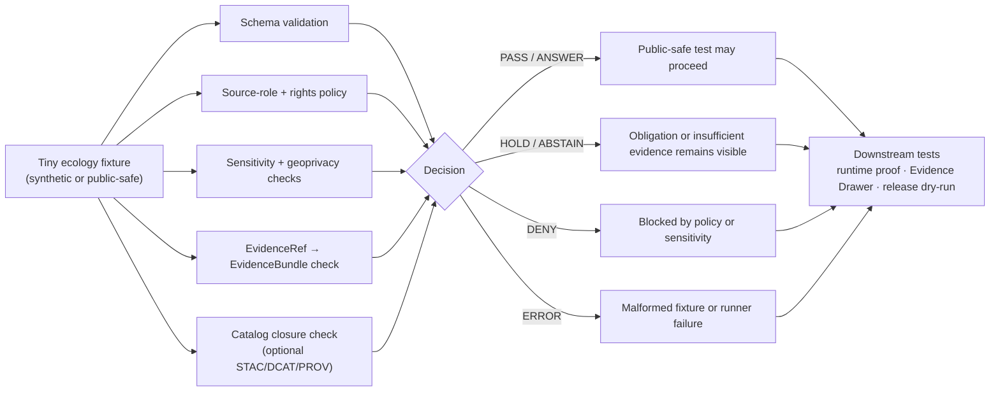

<!-- [KFM_META_BLOCK_V2]
doc_id: kfm://doc/NEEDS_VERIFICATION__tests_fixtures_ecology_readme
title: Ecology Fixtures
type: standard
version: v1
status: draft
owners: NEEDS_VERIFICATION__owners
created: NEEDS_VERIFICATION__YYYY-MM-DD
updated: NEEDS_VERIFICATION__YYYY-MM-DD
policy_label: NEEDS_VERIFICATION__public_or_internal
related: [../../../README.md, ../../README.md, ../README.md, ../../../contracts/README.md, ../../../schemas/README.md, ../../../policy/README.md, ../../../docs/standards/README.md]
tags: [kfm, tests, fixtures, ecology, habitat, fauna, flora, evidence]
notes: [No mounted KFM repository was available in the current session. Exact owner, active fixture inventory, parent README availability, policy label, schema home, and runner wiring remain branch-level verification items.]
[/KFM_META_BLOCK_V2] -->

<a id="top"></a>

# Ecology Fixtures

Small, reviewable, public-safe fixtures for proving ecology-domain validation without turning `tests/fixtures/` into a data mirror, policy source, or publication surface.

> [!NOTE]
> **Status:** `experimental`  
> **Owners:** `NEEDS_VERIFICATION__owners`  
> **Path:** `tests/fixtures/ecology/README.md`  
> **Repo fit:** child fixture README for ecology examples inside the broader KFM tests and verification boundary  
> **Quick jumps:** [Scope](#scope) · [Repo fit](#repo-fit) · [Accepted inputs](#accepted-inputs) · [Exclusions](#exclusions) · [Directory tree](#directory-tree) · [Quickstart](#quickstart) · [Usage](#usage) · [Diagram](#diagram) · [Operating tables](#operating-tables) · [Definition of done](#definition-of-done) · [FAQ](#faq) · [Appendix](#appendix)


> [!IMPORTANT]
> This leaf is **fixture-bounded**. It may hold small valid and invalid examples for validators, policy tests, catalog-closure tests, and runtime-envelope tests. It must not become a provider mirror, sensitive occurrence cache, raw source landing zone, canonical schema home, or substitute policy engine.

---

## Scope

This directory is for compact ecology-domain fixtures that help KFM prove that ecology claims remain evidence-bound, policy-aware, rights-aware, and public-safe.

Ecology here is an umbrella test fixture label. It does **not** collapse the stronger domain distinctions that KFM needs to preserve:

| Keep distinct | Why it matters |
|---|---|
| **Observed occurrence** | a species observation, specimen, survey, or monitoring record is not the same as habitat support |
| **Modeled range or suitability** | modeled context must stay visibly modeled and should not be presented as observed presence |
| **Habitat context** | land cover, wetland, soil, hydrology, protected-area, or vegetation context can support interpretation but does not prove occurrence by itself |
| **Regulatory or conservation status** | legal/status sources are not occurrence aggregators and should not be treated as field observations |
| **Flora, fauna, and habitat lanes** | each carries different source roles, sensitivity rules, and review burdens |
| **Public-safe derivative** | generalized, redacted, or aggregated output is not the same thing as the restricted source record |

**Current safe claim:** `tests/fixtures/ecology/README.md` is the requested target path. The active branch contents for this exact leaf were not available in this session, so all fixture names and runner commands below are either `PROPOSED` or `NEEDS VERIFICATION` unless later branch inspection confirms them.

[Back to top](#top)

---

## Repo fit

**Path:** `tests/fixtures/ecology/README.md`  
**Role:** leaf README for ecology-domain fixtures used by tests, validators, policy checks, and downstream runtime proof harnesses.

### Upstream and adjacent anchors

| Relation | Path | Use |
|---|---|---|
| Repo root posture | [`../../../README.md`](../../../README.md) | project-wide orientation and evidence-first posture; `NEEDS VERIFICATION` in active branch |
| Parent tests lattice | [`../../README.md`](../../README.md) | broader test-family expectations; `NEEDS VERIFICATION` |
| Parent fixture family | [`../README.md`](../README.md) | fixture taxonomy and naming rules; `NEEDS VERIFICATION` |
| Contract source | [`../../../contracts/README.md`](../../../contracts/README.md) | human-facing contract authority; this leaf consumes, not defines |
| Schema source | [`../../../schemas/README.md`](../../../schemas/README.md) | machine-contract authority; this leaf must not create a second schema home |
| Policy source | [`../../../policy/README.md`](../../../policy/README.md) | allow/deny/review logic belongs upstream |
| Standards docs | [`../../../docs/standards/README.md`](../../../docs/standards/README.md) | fixture, validator, and documentation conventions; `NEEDS VERIFICATION` |
| Runtime proof consumers | [`../../e2e/runtime_proof/README.md`](../../e2e/runtime_proof/README.md) | downstream request-time proof harness; `NEEDS VERIFICATION` |
| Release/correction siblings | [`../../e2e/release_assembly/README.md`](../../e2e/release_assembly/README.md), [`../../e2e/correction/README.md`](../../e2e/correction/README.md) | use those leaves when proof packs, promotion, rollback, withdrawal, or correction lineage is the main burden |

### Downstream consumers

| Consumer | What it may read from this leaf | What it must not assume |
|---|---|---|
| Schema validators | small valid/invalid fixture bodies | that the fixture is production data |
| Policy tests | deny/hold/abstain examples for source role, rights, sensitivity, and publication class | that policy was authored here |
| Geoprivacy checks | synthetic sensitive-location cases and redaction-receipt examples | that real restricted coordinates are safe to store here |
| Catalog tests | tiny STAC/DCAT/PROV closure snippets tied to fixture evidence | that catalog snippets are signed release artifacts |
| Runtime proof harnesses | expected `ANSWER`, `ABSTAIN`, `DENY`, or `ERROR` examples | that a live route or UI component exists |
| Documentation reviewers | fixture intent, accepted inputs, exclusions, and open verification items | that README prose proves CI enforcement |

[Back to top](#top)

---

## Accepted inputs

Content belongs here only when it is small, synthetic or safely generalized, reviewable in Git, and tied to an explicit test burden.

| Input class | Belongs here when… | Expected posture |
|---|---|---|
| `SourceDescriptor` fixtures | they prove source-role, rights, sensitivity, cadence, or authority-scope handling for ecology sources | valid/invalid examples only |
| Habitat-context fixtures | they show land-cover, wetland, protected-area, soil, hydrology, or vegetation context as **support**, not occurrence proof | public-safe support |
| Occurrence-publication fixtures | they prove public-safe generalized occurrence behavior, missing evidence abstention, or exact-sensitive-location denial | synthetic or generalized |
| Flora/fauna status fixtures | they distinguish legal/status authority from observation or aggregation sources | source-role explicit |
| Geoprivacy fixtures | they prove redaction, generalization, embargo, steward review, or quarantine behavior | no real restricted coordinates |
| Evidence fixtures | they reference `EvidenceRef`, `EvidenceBundle`, or citation obligations for a small ecology claim | cite-or-abstain |
| Decision fixtures | they prove finite outcomes such as `PASS`, `HOLD`, `DENY`, `ERROR`, or runtime `ANSWER`, `ABSTAIN`, `DENY`, `ERROR` | outcome is visible |
| Catalog-closure fixtures | they show tiny STAC/DCAT/PROV snippets that close back to the same evidence-bearing subject | release-like, not release |
| Negative fixtures | they intentionally fail for unknown rights, missing source role, sensitive exact geometry, modeled-as-observed drift, ambiguous taxonomy, or missing evidence refs | failure reason named |

### Good first thin-slice cases

A minimal honest starter set is:

1. one valid public-safe habitat-context fixture,
2. one valid generalized ecology claim fixture with evidence references,
3. one invalid fixture for unknown rights or missing source role,
4. one invalid fixture for exact sensitive coordinates in public output,
5. one invalid fixture for modeled habitat being mislabeled as observed occurrence,
6. one malformed fixture that must produce an explicit `ERROR`.

[Back to top](#top)

---

## Exclusions

This directory is not the authoritative home for every ecology-adjacent concern.

| Does **not** belong here | Put it here instead | Why |
|---|---|---|
| Raw provider downloads, bulk occurrence pulls, scrape caches, or source snapshots | governed lifecycle data zones such as `data/raw/`, `data/work/`, or `data/quarantine/` if those exist | fixtures must stay compact and reviewable |
| Real sensitive coordinates, exact rare-species sites, steward-only records, or private land details | quarantined or restricted-access surfaces | public fixture lanes must not leak protected locations |
| Canonical schemas | [`../../../schemas/README.md`](../../../schemas/README.md) and confirmed schema homes | this leaf consumes schema authority |
| Human contract definitions | [`../../../contracts/README.md`](../../../contracts/README.md) | fixture examples should not redefine contracts |
| Policy source files | [`../../../policy/README.md`](../../../policy/README.md) and confirmed policy homes | policy belongs upstream |
| Live connectors, watchers, scheduler wiring, or API route handlers | confirmed pipeline, package, service, or tool directories | README prose is not implementation proof |
| Signed proof packs, release manifests, publication bundles, or rollback receipts | release/correction fixtures or governed release surfaces | release proof has a different burden |
| UI components or MapLibre layer implementation | confirmed app/UI directories | this leaf may provide expected payloads, not component code |
| AI prompts or model outputs that reveal restricted data | governed AI test surfaces after evidence and policy checks | AI is interpretive, never root truth |

[Back to top](#top)

---

## Directory tree

### Verified branch snapshot

Current fixture inventory in this branch:

```text
tests/fixtures/ecology/
├── README.md
├── invalid/
│   ├── README.md
│   ├── derived_vegetation_layer.missing_catalog_refs.invalid.json
│   ├── habitat_assignment.missing_class.invalid.json
│   ├── missing_policy_id.invalid.json
│   ├── observation_plot.unknown_rights.invalid.json
│   ├── sensitive_occurrence_record.public_exact_geometry.invalid.json
│   └── taxon_record.missing_spec_hash.invalid.json
├── malformed/
│   ├── README.md
│   ├── error_invalid_fixture_shape.json
│   ├── geometry/
│   │   └── precision_served_missing.json
│   ├── occurrence/
│   │   ├── missing_provenance.json
│   │   ├── missing_required_fields.json
│   │   └── source_role_flattened.json
│   ├── rights/
│   │   └── redistribution_posture_missing.json
│   ├── runtime/
│   │   └── malformed_envelope_missing_reason_code.json
│   ├── sensitivity/
│   │   └── exact_location_conflicts_with_sensitive_flag.json
│   └── taxonomy/
│       └── blank_scientific_name.json
├── policy/
│   ├── README.md
│   ├── allow_derived_layer_with_catalog_closure.json
│   ├── allow_public_taxon.json
│   ├── deny_derived_layer_as_confirmed.json
│   ├── deny_sensitive_exact_geometry.json
│   ├── deny_unknown_rights.json
│   ├── deny_unresolved_evidence_bundle.json
│   ├── derived_layer_as_confirmed.policy.json
│   ├── generalize_sensitive_occurrence.json
│   ├── restricted_exact_location_case.json
│   ├── sensitive_exact_public_geometry.policy.json
│   └── unknown_rights.policy.json
└── valid/
    ├── README.md
    ├── derived_vegetation_layer.valid.json
    ├── habitat_assignment.valid.json
    ├── observation_bundle_public_safe.valid.json
    ├── observation_plot.valid.json
    ├── sensitive_occurrence_record.valid.json
    └── taxon_record.valid.json
```

> [!TIP]
> Use the subdirectory indexes for file navigation: [`valid/README.md`](./valid/README.md), [`invalid/README.md`](./invalid/README.md), [`policy/README.md`](./policy/README.md), and [`malformed/README.md`](./malformed/README.md).

[Back to top](#top)

---

## Quickstart

Use inspection-first commands. These are safe because they check current branch shape before assuming runners, schemas, or workflow wiring.

### 1) Inspect the leaf

```bash
# Run from the repository root after the real checkout is mounted.
find tests/fixtures/ecology -maxdepth 4 -type f 2>/dev/null | sort
```

### 2) Re-read the nearby authority surfaces

```bash
sed -n '1,260p' tests/README.md 2>/dev/null || true
sed -n '1,260p' tests/fixtures/README.md 2>/dev/null || true
sed -n '1,260p' contracts/README.md 2>/dev/null || true
sed -n '1,260p' schemas/README.md 2>/dev/null || true
sed -n '1,260p' policy/README.md 2>/dev/null || true
sed -n '1,220p' docs/standards/README.md 2>/dev/null || true
```

### 3) Check for drift before adding fields or folders

```bash
git grep -n \
  -e 'ecology' \
  -e 'fauna' \
  -e 'flora' \
  -e 'habitat' \
  -e 'SourceDescriptor' \
  -e 'EvidenceBundle' \
  -e 'DecisionEnvelope' \
  -e 'geoprivacy' \
  -e 'sensitive' \
  -- tests contracts schemas policy docs apps packages tools 2>/dev/null || true
```

### 4) Run validators only after the active branch exposes them

```bash
# NEEDS VERIFICATION: adapt to the repo-native validator command.
python tools/validators/run_all.py --fixtures tests/fixtures/ecology
```

> [!WARNING]
> Do not add live-source network fetches to this leaf. If a test requires a source system, use a controlled fixture or a separately governed source snapshot with explicit rights and sensitivity review.

[Back to top](#top)

---

## Usage

### Working rule for adding a fixture

1. Name the fixture by **behavior** or **failure reason**.
2. Keep `source_role`, rights posture, sensitivity posture, and evidence refs visible.
3. Use synthetic or generalized geometry unless the fixture is proving denial.
4. Never include real protected coordinates, private identifiers, or steward-only detail.
5. If the fixture exercises modeled support, label it as modeled.
6. If the fixture includes a public outcome, include the evidence and policy condition that makes it safe.
7. If the fixture includes a negative outcome, make the denial or abstention visible rather than smoothing it into a generic failure.
8. Do not imply live connector, workflow, signing, route, or UI maturity unless direct branch evidence proves it.

### Naming guidance

| Case | Preferred naming pattern |
|---|---|
| Valid public-safe support | `valid/<source_or_support>_public_safe.*.json` |
| Missing evidence | `invalid/missing_policy_id.invalid.json` |
| Unknown rights | `invalid/observation_plot.unknown_rights.invalid.json` |
| Source-role misuse | `invalid/taxon_record.missing_spec_hash.invalid.json` |
| Sensitive exact geometry | `invalid/sensitive_occurrence_record.public_exact_geometry.invalid.json` |
| Modeled/observed collapse | `invalid/habitat_assignment.missing_class.invalid.json` |
| Malformed body | `malformed/error_invalid_fixture_shape.json` |
| Malformed missing required fields | `malformed/occurrence/missing_required_fields.json` |
| Malformed missing provenance | `malformed/occurrence/missing_provenance.json` |
| Malformed source-role flattening | `malformed/occurrence/source_role_flattened.json` |
| Malformed rights posture | `malformed/rights/redistribution_posture_missing.json` |
| Malformed sensitivity conflict | `malformed/sensitivity/exact_location_conflicts_with_sensitive_flag.json` |
| Malformed blank taxon name | `malformed/taxonomy/blank_scientific_name.json` |
| Malformed missing served precision | `malformed/geometry/precision_served_missing.json` |
| Malformed runtime envelope | `malformed/runtime/malformed_envelope_missing_reason_code.json` |

### Outcome grammar

Use the narrowest truthful outcome.

| Outcome | Use when |
|---|---|
| `PASS` | a validator confirms the fixture meets the stated contract |
| `HOLD` | obligations remain, such as steward review, missing rights review, or unresolved source authority |
| `DENY` | policy forbids the public or runtime action |
| `ERROR` | the fixture or runner is malformed, unavailable, or invalid |
| `ANSWER` | runtime can return a supported public-safe ecology answer |
| `ABSTAIN` | evidence is insufficient or unresolved, but policy does not require denial |
| `NEEDS VERIFICATION` | branch evidence, owner, runner, schema home, or fixture inventory is still unconfirmed |

[Back to top](#top)

---

## Diagram



[Back to top](#top)

---

## Operating tables

### Source-role boundaries

| Fixture source family | May support | Must not claim |
|---|---|---|
| Land cover / habitat context | habitat support, environmental context, modeled or observed support depending on source | species occurrence by itself |
| Occurrence aggregator | occurrence evidence or corroboration after rights and quality checks | legal-status authority |
| Agency legal/status source | state or federal conservation/regulatory status within authority scope | field observation unless source records it |
| Herbarium or specimen collection | specimen-backed flora evidence with date, collector, and locality posture | current presence without interpretation |
| Community science observation | observation evidence after quality, rights, and geoprivacy review | unrestricted public precision |
| Modeled suitability or range | modeled support with uncertainty and provenance | observed presence |
| Protected-area context | management or conservation context | species occurrence or ownership truth |

### Required fields by fixture burden

| Burden | Required in the fixture or paired expected output |
|---|---|
| Source admission | `source_id`, `source_role`, authority scope, rights posture, sensitivity posture, access mode |
| Public-safe occurrence | public geometry class, sensitivity summary, evidence refs, redaction/generalization receipt if applicable |
| Habitat assignment | occurrence support, habitat/context support, derivation method, uncertainty or support class, evidence refs |
| Catalog closure | same subject identity across EvidenceBundle, catalog snippets, and expected decision |
| Negative outcome | explicit reason code, blocked field or obligation, expected outcome |
| Runtime proof | request fixture, expected decision/envelope, and optional drawer payload if a downstream harness consumes it |

[Back to top](#top)

---

## Definition of done

Before a fixture is considered ready for review:

- [ ] The fixture is the smallest example that proves the rule.
- [ ] The file is named by behavior or failure reason.
- [ ] The fixture does not contain real sensitive coordinates or private occurrence detail.
- [ ] `source_role` is explicit where source authority matters.
- [ ] Rights posture is explicit; unknown rights do not silently allow publication.
- [ ] Sensitivity posture is explicit; exact sensitive geometry is denied or generalized.
- [ ] Modeled support is not mislabeled as observed occurrence.
- [ ] Evidence refs are present when the expected outcome makes a factual claim.
- [ ] Negative fixtures include expected denial, abstention, hold, or error reasoning.
- [ ] Catalog snippets, if present, close back to the same fixture subject and evidence bundle.
- [ ] The fixture does not imply live connector, public release, route, UI, workflow, signing, or deployment maturity that the branch does not prove.
- [ ] Any behavior-changing update also updates the relevant README, contract, schema, policy, or validator documentation.

[Back to top](#top)

---

## FAQ

### Why `ecology/` instead of only `fauna/`, `flora/`, or `habitat/`?

`ecology/` is useful as a fixture umbrella when a test crosses habitat, flora, fauna, source-role, evidence, or public-safety boundaries. It must not flatten those domains. If a fixture is purely fauna-, flora-, or habitat-owned and the repo has those leaves, keep it there instead.

### Can this directory contain real occurrence records?

Only if they are already public-safe, rights-cleared, non-sensitive, and necessary for the fixture burden. The safer default is synthetic or generalized fixtures.

### Can a generalized public-safe fixture prove a source is unrestricted?

No. It proves only that the fixture’s expected public output is safe under the declared evidence and policy conditions. It does not change source rights, sensitivity, steward review obligations, or release posture.

### Do `ABSTAIN`, `HOLD`, and `DENY` count as successful tests?

Yes. In KFM, visible refusal states are part of the trust contract. A well-explained refusal can be the correct outcome.

### Should this README define final JSON schema keys?

Only where the active branch already proves the contract. Otherwise, examples remain illustrative and should be converted into concrete schema-backed fixtures after branch verification.

### Can this leaf prove a published release?

No. It can support release tests, but proof packs, ReleaseManifests, signatures, and rollback/correction receipts belong in release-bearing surfaces.

[Back to top](#top)

---

## Appendix

<details>
<summary><strong>Illustrative fixture sketches</strong> — not canonical until schema-backed</summary>

### Valid source descriptor sketch

```json
{
  "kind": "SourceDescriptor",
  "version": "v1",
  "identity": {
    "source_id": "kfm://source/NEEDS_VERIFICATION__ecology_habitat_context_fixture",
    "title": "Synthetic ecology habitat context fixture"
  },
  "role_and_scope": {
    "source_role": "habitat_context",
    "authority_scope": "synthetic_fixture_only",
    "domain": "ecology"
  },
  "rights_and_sensitivity": {
    "rights_status": "fixture_public_safe",
    "sensitivity_class": "public_generalized",
    "publication_allowed": true
  },
  "validation": {
    "expected_outcome": "PASS",
    "notes": [
      "Illustrative only.",
      "Does not prove a live source connector."
    ]
  }
}
```

### Invalid source-role sketch

```json
{
  "kind": "SourceDescriptor",
  "version": "v1",
  "identity": {
    "source_id": "kfm://source/NEEDS_VERIFICATION__occurrence_aggregator_fixture",
    "title": "Synthetic occurrence aggregator fixture"
  },
  "role_and_scope": {
    "source_role": "occurrence_aggregator",
    "claim_type": "legal_status_authority"
  },
  "rights_and_sensitivity": {
    "rights_status": "unknown",
    "publication_allowed": true
  },
  "validation": {
    "expected_outcome": "DENY",
    "reason": "Occurrence aggregators must not be treated as legal-status authority, and unknown rights cannot permit publication."
  }
}
```

### Deny exact sensitive location sketch

```json
{
  "kind": "EcologyPublicPayloadFixture",
  "version": "v1",
  "claim": {
    "claim_type": "species_occurrence_public_payload",
    "source_role": "occurrence_evidence"
  },
  "geometry": {
    "precision_served": "exact_point",
    "synthetic": true,
    "coordinates": [-98.000000, 38.000000]
  },
  "sensitivity": {
    "sensitivity_class": "restricted_precise",
    "redaction_receipt_ref": null
  },
  "expected": {
    "outcome": "DENY",
    "reason_code": "sensitive_exact_geometry_public_payload"
  }
}
```

### Abstain missing evidence sketch

```json
{
  "kind": "EcologyRuntimeFixture",
  "version": "v1",
  "question": "Is the requested species present in this area?",
  "support": {
    "habitat_context_ref": "kfm://fixture/habitat_context/generalized",
    "occurrence_evidence_ref": null
  },
  "expected": {
    "outcome": "ABSTAIN",
    "reason_code": "missing_occurrence_evidence",
    "message": "Habitat context alone does not prove species occurrence."
  }
}
```

</details>

<details>
<summary><strong>Open verification checklist</strong></summary>

Verify these before merging a real fixture update:

- [ ] Is `tests/fixtures/ecology/` already present on the active branch?
- [ ] Is there a parent `tests/fixtures/README.md` convention to preserve?
- [ ] Is `ecology/` the right leaf, or should the active branch use `fauna/`, `flora/`, `habitat/`, or `biodiversity/`?
- [ ] Is there an existing schema fixture taxonomy under `schemas/tests/fixtures/`?
- [ ] Is the canonical schema home `schemas/contracts/v1/`, `contracts/`, or another confirmed path?
- [ ] Are policy tests OPA/Rego, Python, TypeScript, or another repo-native runner?
- [ ] Does CI already include fixture validation?
- [ ] Are `EvidenceBundle`, `DecisionEnvelope`, `ReleaseManifest`, and `SourceDescriptor` schemas already mounted?
- [ ] Are owners and CODEOWNERS confirmed for this leaf?
- [ ] Is the policy label for this README public, internal, or restricted?

</details>

[Back to top](#top)
