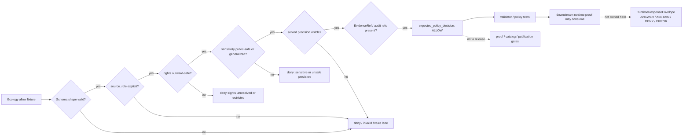

<!-- [KFM_META_BLOCK_V2]
doc_id: kfm://doc/NEEDS_VERIFICATION__tests_fixtures_ecology_allow_readme
title: Ecology Allow Fixtures
type: standard
version: v1
status: draft
owners: NEEDS_VERIFICATION__tests_or_ecology_steward
created: NEEDS_VERIFICATION__YYYY-MM-DD
updated: NEEDS_VERIFICATION__YYYY-MM-DD
policy_label: NEEDS_VERIFICATION__public_or_internal
related: [../README.md, ../../README.md, ../../../README.md, ../../../../README.md, ../../../../contracts/README.md, ../../../../schemas/README.md, ../../../../policy/README.md, ../../../../data/registry/ecology/README.md, ../../../e2e/runtime_proof/ecology/README.md]
tags: [kfm, tests, fixtures, ecology, allow]
notes: [Leaf path, owner, dates, policy label, companion validator, and sibling deny/invalid fixture inventory remain NEEDS_VERIFICATION until checked against the mounted repository. This README is fixture-facing and does not claim live connectors, workflow enforcement, publication approval, or runtime implementation.]
[/KFM_META_BLOCK_V2] -->

<a id="top"></a>

# Ecology Allow Fixtures

Positive, deterministic ecology fixtures that prove **public-safe allow behavior** without turning tests into source mirrors, release artifacts, or runtime truth.

> [!IMPORTANT]
> **Status:** `experimental`  
> **Owners:** `NEEDS_VERIFICATION__tests_or_ecology_steward`  
> **Path:** `tests/fixtures/ecology/allow/README.md`  
> **Repo fit:** child fixture README for allow/pass examples under `tests/fixtures/ecology/`  
> **Quick jumps:** [Scope](#scope) · [Repo fit](#repo-fit) · [Accepted inputs](#accepted-inputs) · [Exclusions](#exclusions) · [Directory tree](#directory-tree) · [Quickstart](#quickstart) · [Allow contract](#allow-fixture-contract) · [Diagram](#diagram) · [Operating tables](#operating-tables) · [Task list](#task-list--definition-of-done) · [FAQ](#faq) · [Appendix](#appendix)


> [!NOTE]
> This directory documents **positive fixture intent**. An `ALLOW` fixture is not a publication decision, not a proof pack, not a live-source connector, and not a guarantee that a downstream runtime will return `ANSWER`.

---

## Scope

This leaf is for ecology fixtures that are expected to pass the relevant **allow-side** schema, validator, or policy checks.

Use it when the fixture proves that an ecology-support object is safe enough to proceed because it keeps all of the following visible:

- source identity and `source_role`
- rights posture
- sensitivity posture
- served precision, including generalization
- evidence references or fixture-local stand-ins
- audit or review linkage
- source-role distinctions between observation, habitat context, modeled context, and regulatory context

This leaf should help reviewers answer:

> “Can this ecology fixture pass because it is public-safe, rights-safe, provenance-aware, and explicit about what kind of ecological support it represents?”

### Current evidence posture

| Marker | Meaning in this README |
|---|---|
| **CONFIRMED** | Grounded in surfaced KFM doctrine or directly inspected current-session workspace evidence |
| **INFERRED** | Strongly implied by adjacent fixture, runtime-proof, ecology/fauna/flora/habitat, and documentation-control materials |
| **PROPOSED** | Repo-native structure that fits KFM doctrine but is not proven present in the active branch |
| **UNKNOWN** | Not verified strongly enough to describe as current implementation |
| **NEEDS VERIFICATION** | Must be checked against the mounted repository before merge or CI wiring claims |

[Back to top](#top)

---

## Repo fit

**Path:** `tests/fixtures/ecology/allow/README.md`  
**Role:** allow-side fixture README for ecology-positive examples under the broader `tests/fixtures/` verification boundary.

### Upstream and downstream anchors

| Relation | Path | Status | Why it matters |
|---|---:|---|---|
| Parent ecology fixture lane | [`../README.md`](../README.md) | NEEDS VERIFICATION | should define the whole ecology fixture family |
| Fixture home | [`../../README.md`](../../README.md) | NEEDS VERIFICATION | should define fixture-home rules and valid/invalid split |
| Tests root | [`../../../README.md`](../../../README.md) | NEEDS VERIFICATION | should define test ownership and local execution posture |
| Repo root | [`../../../../README.md`](../../../../README.md) | NEEDS VERIFICATION | should expose KFM’s evidence-first repo posture |
| Contract home | [`../../../../contracts/README.md`](../../../../contracts/README.md) | NEEDS VERIFICATION | semantic contracts should outrank fixture examples |
| Schema home | [`../../../../schemas/README.md`](../../../../schemas/README.md) | NEEDS VERIFICATION | machine shapes should be defined outside this leaf |
| Policy home | [`../../../../policy/README.md`](../../../../policy/README.md) | NEEDS VERIFICATION | allow/deny grammar belongs to policy, not fixture prose |
| Ecology registry | [`../../../../data/registry/ecology/README.md`](../../../../data/registry/ecology/README.md) | PROPOSED / NEEDS VERIFICATION | source roles and rights profiles should resolve from a registry |
| Runtime proof sibling | [`../../../e2e/runtime_proof/ecology/README.md`](../../../e2e/runtime_proof/ecology/README.md) | PROPOSED / NEEDS VERIFICATION | request-time `ANSWER` / `ABSTAIN` / `DENY` / `ERROR` proofs belong there |
| Deny/invalid sibling | [`../deny/README.md`](../deny/README.md) | PROPOSED / NEEDS VERIFICATION | negative fixtures should prove failure modes without diluting this allow lane |

> [!CAUTION]
> If any linked path does not exist in the active checkout, keep the relationship as a review item rather than silently inventing a new authority home.

[Back to top](#top)

---

## Accepted inputs

Allow fixtures belong here when they are **small**, **deterministic**, **public-safe**, and **reviewable**.

### What belongs here

- JSON or YAML fixtures expected to produce an allow/pass decision
- ecology support candidates with explicit `source_family` and `source_role`
- public-safe, generalized occurrence support
- habitat-context fixtures that do not claim species presence by themselves
- modeled-range or suitability-context fixtures with visible model qualifiers
- regulatory/protected-area context fixtures that do not masquerade as observed occurrence
- fixture-local `EvidenceRef` / `EvidenceBundle` stand-ins used only for no-network validation
- examples that prove rights, sensitivity, precision, provenance, and audit fields are present

### Minimum fixture posture

| Requirement | Expected allow-side posture |
|---|---|
| Source role | explicit; never inferred from filename alone |
| Rights | `outward_safe`, `public_safe`, or an equivalent repo-approved allow value |
| Sensitivity | public-safe or generalized public-safe |
| Precision | served precision visible; generalized when needed |
| Evidence | refs present or deliberately fixture-local |
| Runtime implication | no claim of runtime `ANSWER` unless downstream runtime proof consumes it |
| Network use | none |

[Back to top](#top)

---

## Exclusions

| Do not put this here | Better home | Why |
|---|---|---|
| Sensitive exact-location positive claims | `../deny/` or a restricted internal fixture lane | exact public exposure is not an ordinary allow condition |
| Unknown rights or unresolved redistribution posture | `../deny/` or `../review/` if present | unresolved rights should not pass silently |
| Malformed ecology objects | `../deny/`, `../invalid/`, or schema-specific invalid fixtures | this leaf is for positive examples |
| Live API payload dumps | `data/raw/`, `data/work/`, or `data/quarantine/` | fixtures are not source mirrors |
| Source descriptors | `contracts/source/` or `data/registry/` | source admission is upstream law |
| Proof packs, catalog records, release manifests | `data/proofs/`, `data/catalog/`, `data/published/`, or release fixture lanes | allow fixtures are not publication artifacts |
| Runtime response envelopes | `tests/e2e/runtime_proof/ecology/` | request-time behavior is a downstream proof burden |
| Policy definitions | `policy/ecology/` or repo-approved policy home | this leaf consumes policy; it does not become policy |

> [!WARNING]
> Do not use this directory to make an unsafe case “look allowed.” A fixture that requires generalization, withholding, review, or denial belongs in the negative or review lane until those obligations are explicitly satisfied.

[Back to top](#top)

---

## Directory tree

Exact mounted contents under this path are **UNKNOWN** in this session. The tree below is a target shape, not a claim of current branch inventory.

```text
tests/fixtures/ecology/
├── README.md                         # parent ecology fixture contract — NEEDS VERIFICATION
├── allow/
│   ├── README.md                     # this file
│   ├── public_generalized_occurrence.allow.json
│   ├── habitat_context_public_safe.allow.json
│   ├── modeled_range_qualified.allow.json
│   ├── regulatory_context_qualified.allow.json
│   └── occurrence_habitat_join_generalized.allow.json
└── deny/
    └── README.md                     # expected negative companion — NEEDS VERIFICATION
```

Suggested file naming pattern:

```text
<behavior-or-support-kind>.<expected-decision>.json
```

Examples:

```text
public_generalized_occurrence.allow.json
sensitive_exact_location.deny.json
missing_source_role.deny.json
```

[Back to top](#top)

---

## Quickstart

Use these checks from the repository root after the active branch confirms the companion files and test runner.

```bash
# Inspect this fixture lane without running live source access.
find tests/fixtures/ecology/allow -maxdepth 2 -type f | sort

# Confirm the README is staged or changed as expected.
git status --short tests/fixtures/ecology/allow
```

Policy or schema validation commands are **NEEDS VERIFICATION** until the mounted repo proves the active toolchain.

```bash
# NEEDS VERIFICATION: replace with the repo-native validator command.
python -m pytest tests/fixtures/ecology

# NEEDS VERIFICATION: run only if the repo uses Conftest/OPA for this lane.
conftest test policy/ecology tests/fixtures/ecology/allow
```

> [!IMPORTANT]
> Allow fixtures should be testable without network access. A test that fetches live ecological source data is not a fixture test.

[Back to top](#top)

---

## Allow fixture contract

An allow fixture should be boring in the best way: small enough to review, explicit enough to audit, and strict enough that a missing field turns into a negative test.

### Minimum fields to preserve

| Field family | Examples | Why it matters |
|---|---|---|
| Identity | `fixture_id`, `object_type`, `schema_version` | keeps fixtures addressable and versioned |
| Source role | `source_family`, `source_role` | prevents observation/model/regulation flattening |
| Scope | `taxon_scope`, `place_scope`, `time_window` | bounds ecological meaning |
| Precision | `precision_served`, `generalized` | makes public precision visible |
| Rights | `rights_status`, `license_ref`, `terms_ref` | prevents accidental publication assumptions |
| Sensitivity | `sensitivity_status`, `sensitivity_reason` when relevant | prevents exact sensitive exposure |
| Evidence | `evidence_refs`, `evidence_bundle_ref` | keeps cite-or-abstain posture alive |
| Audit | `audit_ref`, `review_state` | supports review and correction lineage |
| Expected result | `expected_policy_decision: "ALLOW"` | distinguishes policy fixtures from runtime envelopes |

### Allow-side rule

A fixture may pass only when it remains honest about what it supports.

| Support type | May be allowed when… | Must not claim… |
|---|---|---|
| `observed_occurrence` | provenance, rights, sensitivity, time, and served precision are explicit | modeled range, legal status, or unrestricted exact public presence |
| `habitat_context` | habitat source role and spatial support are explicit | species observation or occupancy |
| `modeled_range` | model provenance and uncertainty/qualifier are visible | direct observation or legal authority |
| `regulatory_context` | authority scope and effective time are visible | observed occurrence or biological abundance |
| `protected_area_context` | source role and boundary meaning are visible | habitat suitability or species presence by itself |

[Back to top](#top)

---

## Diagram



[Back to top](#top)

---

## Operating tables

### Allow versus runtime outcomes

| Layer | Vocabulary | This directory owns it? | Notes |
|---|---|---:|---|
| Policy or validator fixture | `ALLOW` / `DENY` / `ERROR` or repo-native equivalent | yes, for positive allow examples | exact enum names still NEED VERIFICATION |
| Runtime public response | `ANSWER` / `ABSTAIN` / `DENY` / `ERROR` | no | belongs in runtime proof lanes |
| Promotion or release | `PROMOTED` / `HELD` / `QUARANTINED` / `NO_CHANGE` or repo-native equivalent | no | belongs to promotion/release fixtures |
| Catalog/proof closure | pass/fail gate records | no | fixtures may reference them but do not replace them |

### Positive fixture review matrix

| Review question | Pass condition |
|---|---|
| Does the filename name the behavior? | yes; filename describes support type and expected allow result |
| Does the fixture preserve source role? | yes; no role inferred from UI copy or taxon label |
| Does it avoid sensitive exact exposure? | yes; precision is generalized or explicitly public-safe |
| Does it carry rights posture? | yes; outward use is allowed or fixture is not here |
| Does it resolve evidence? | yes; refs are present or fixture-local and named as such |
| Does it overclaim? | no; observation, habitat, model, and regulation stay separate |
| Does it require a live network? | no |

[Back to top](#top)

---

## Task list / definition of done

This README is ready to move from `draft` toward `review` when:

- [ ] the mounted repo confirms whether `tests/fixtures/ecology/allow/` already exists
- [ ] the meta block placeholders are replaced with repo-backed owner, date, policy label, and related links
- [ ] parent and sibling README paths are verified
- [ ] at least one valid allow fixture exists
- [ ] at least one paired negative fixture exists for any high-risk allow condition
- [ ] the validator command is confirmed and documented
- [ ] validation runs without network access
- [ ] allow fixtures do not reference RAW, WORK, QUARANTINE, or unpublished source stores as public support
- [ ] source role, rights, sensitivity, precision, evidence, and audit fields are present
- [ ] no fixture exposes exact sensitive species, cultural, private, or steward-controlled location details
- [ ] downstream runtime proof files consume allow fixtures without changing their meaning

[Back to top](#top)

---

## FAQ

### Does an allow fixture mean KFM can publish the underlying ecology source?

No. It means the fixture satisfies a positive test condition under the declared schema, policy, or validator. Publication still needs source rights, sensitivity handling, catalog/proof closure, release state, and review.

### Can an observed occurrence and a modeled range appear in the same allow fixture?

Only when their roles remain visibly separate. The fixture must not flatten modeled support into observed occurrence truth.

### Can exact coordinates ever appear in an allow fixture?

Treat that as exceptional and review-bound. For ecology, positive public fixtures should normally use public-safe generalized precision unless repo-backed policy explicitly proves exact public precision is allowed.

### Should this directory include `ABSTAIN` fixtures?

Usually no. `ABSTAIN` is a runtime-facing outcome or a policy decision state depending on the contract. Put insufficient-evidence examples in the runtime proof or deny/review fixture lane, not in the allow directory.

### Does this README prove active CI coverage?

No. It defines the fixture burden and target structure. Workflow YAML, merge-blocking checks, and validator execution remain **NEEDS VERIFICATION** until confirmed in the active repository.

[Back to top](#top)

---

## Appendix

<details>
<summary><strong>Illustrative minimal allow fixture</strong> (<strong>illustrative only</strong>)</summary>

This example is here to show the intended shape. It is not a claim that this exact schema or filename exists.

```json
{
  "fixture_id": "ecology_allow_public_generalized_occurrence_v1",
  "expected_policy_decision": "ALLOW",
  "object_type": "ecology_support_candidate",
  "schema_version": "v1",
  "support": {
    "source_family": "example_occurrence_provider",
    "source_role": "observed_occurrence",
    "taxon_scope": "example_public_safe_taxon",
    "place_scope": "example_county",
    "time_window": {
      "start": "2026-04-01",
      "end": "2026-04-30"
    },
    "precision_served": "county",
    "generalized": true
  },
  "evidence": {
    "evidence_refs": [
      "kfm://evidence/example/ecology/occurrence-001"
    ],
    "evidence_bundle_ref": "kfm://evidence-bundle/example/ecology/allow-001",
    "audit_ref": "kfm://audit/ecology/allow-001"
  },
  "policy": {
    "rights_status": "outward_safe",
    "sensitivity_status": "generalized_public_safe",
    "review_state": "reviewed_fixture"
  }
}
```

Review reminders:

- keep examples synthetic or public-safe
- do not include live provider mirrors
- do not use fixture examples to bypass policy
- keep paired negative examples nearby for risky conditions

</details>

[Back to top](#top)
