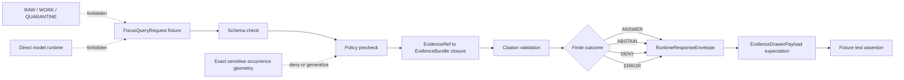

<!-- [KFM_META_BLOCK_V2]
doc_id: kfm://doc/TODO-tests-fixtures-ecology-focus-mode-readme-uuid
title: Ecology Focus Mode Fixtures
type: standard
version: v1
status: draft
owners: TODO(kfm-verify-owner)
created: TODO(kfm-verify-created-date)
updated: 2026-04-29
policy_label: TODO(kfm-verify-policy-label)
related: [tests/fixtures/ecology/focus_mode/README.md, tests/fixtures/ecology/README.md, tests/fixtures/README.md, tests/README.md, docs/architecture/focus-mode.md, docs/architecture/evidence-flow.md, docs/architecture/evidence-drawer-ai-implications.md, schemas/contracts/v1, contracts/OBJECT_MAP.md]
tags: [kfm, tests, fixtures, ecology, focus-mode, governed-ai, evidence-bundle]
notes: [Repo checkout was not mounted during this authoring pass; adjacent paths, owners, policy label, created date, and exact fixture filenames remain NEEDS VERIFICATION.]
[/KFM_META_BLOCK_V2] -->

<a id="top"></a>

# Ecology Focus Mode Fixtures

No-network fixtures for testing KFM Focus Mode over public-safe ecology evidence envelopes.

<div align="left">


</div>

> [!IMPORTANT]
> **Status:** experimental  
> **Owners:** `TODO(kfm-verify): confirm owner for tests/fixtures/ecology/focus_mode`  
> **Path:** `tests/fixtures/ecology/focus_mode/README.md`  
> **Quick jumps:** [Scope](#scope) · [Repo fit](#repo-fit) · [Inputs](#inputs) · [Exclusions](#exclusions) · [Directory tree](#directory-tree) · [Quickstart](#quickstart) · [Usage](#usage) · [Diagram](#diagram) · [Fixture matrix](#fixture-matrix) · [Task list](#task-list) · [FAQ](#faq) · [Appendix](#appendix)

> [!NOTE]
> This README is written as a fixture-directory contract. It does **not** claim that every suggested fixture file already exists. Items marked **PROPOSED** or **NEEDS VERIFICATION** must be checked against the active repository before being treated as implementation fact.

---

## Scope

This directory is for **small, deterministic, public-safe ecology fixtures** that exercise Focus Mode behavior without reaching live sources, model runtimes, canonical stores, or unpublished data.

The fixtures here should prove that ecology-focused answers can move through the KFM trust path:

1. scoped Focus request;
2. policy precheck;
3. `EvidenceRef` → `EvidenceBundle` resolution;
4. bounded synthesis or refusal;
5. citation validation;
6. policy postcheck;
7. finite `RuntimeResponseEnvelope`;
8. drawer-ready evidence and trust state.

### Truth posture

| Label | Applies here |
| --- | --- |
| **CONFIRMED** | Target file requested: `tests/fixtures/ecology/focus_mode/README.md`. KFM doctrine requires governed APIs, EvidenceBundle resolution, finite outcomes, cite-or-abstain behavior, and no direct model-client path. |
| **PROPOSED** | Fixture naming, directory grouping, and example validation commands below. |
| **NEEDS VERIFICATION** | Actual repo ownership, adjacent README paths, canonical schema home, validator command, test runner, and exact fixture filenames. |
| **UNKNOWN** | Whether this target directory already exists in the active checkout; the authoring workspace did not expose a mounted KFM repository. |

[Back to top](#top)

---

## Repo fit

| Relationship | Path | Status | Role |
| --- | --- | --- | --- |
| This README | `tests/fixtures/ecology/focus_mode/README.md` | **CONFIRMED target** | Directory guide for ecology Focus Mode fixtures. |
| Ecology fixture parent | `tests/fixtures/ecology/README.md` | **NEEDS VERIFICATION** | Expected parent for ecology fixture families. |
| Fixture root | `tests/fixtures/README.md` | **NEEDS VERIFICATION** | Expected fixture-wide conventions and validation notes. |
| Test root | `tests/README.md` | **NEEDS VERIFICATION** | Expected test-suite ownership and run instructions. |
| Focus Mode architecture | `docs/architecture/focus-mode.md` | **NEEDS VERIFICATION** | Expected doctrine and runtime-envelope explanation. |
| Evidence flow architecture | `docs/architecture/evidence-flow.md` | **NEEDS VERIFICATION** | Expected `EvidenceRef` → `EvidenceBundle` resolution rules. |
| Evidence Drawer + AI implications | `docs/architecture/evidence-drawer-ai-implications.md` | **NEEDS VERIFICATION** | Expected trust-visible UI payload guidance. |
| Machine schemas | `schemas/contracts/v1/` or repo-native contract home | **NEEDS VERIFICATION** | Schema authority must be confirmed before fixture validation is wired. |
| Object map | `contracts/OBJECT_MAP.md` | **NEEDS VERIFICATION** | Expected crosswalk for `RuntimeResponseEnvelope`, `EvidenceBundle`, `PolicyDecision`, and drawer payload objects. |

> [!WARNING]
> Do not create parallel schema authority for this fixture lane. If both `contracts/` and `schemas/` exist in the active repo, resolve the canonical machine-schema home through an ADR before adding new schema-backed fixtures.

[Back to top](#top)

---

## Inputs

The following fixture families belong here when they are **synthetic or public-safe**, deterministic, and no-network.

| Input family | Accepted when | Expected fixture value |
| --- | --- | --- |
| `FocusQueryRequest` | The request scope is explicit: place, time, selected feature, release scope, role, and requested ecology claim. | Tests scope inheritance and policy precheck. |
| `RuntimeResponseEnvelope` | The response has one finite outcome: `ANSWER`, `ABSTAIN`, `DENY`, or `ERROR`. | Tests that Focus Mode never emits free-form model text as the public object. |
| `EvidenceRef` / `EvidenceBundle` | Every cited support object resolves or intentionally fails in a negative fixture. | Tests closure, citation validation, and cite-or-abstain behavior. |
| `EvidenceDrawerPayload` | Payload is drawer-ready and includes evidence, policy, review, release, correction, freshness, and caveat signals. | Tests that the drawer remains one hop away from consequential claims. |
| `PolicyDecision` | The fixture makes rights, sensitivity, source role, review state, and release state visible. | Tests fail-closed behavior and negative-state messaging. |
| Ecology join cases | Habitat, fauna, flora, range, occurrence, or landscape-context examples are synthetic, generalized, or already public-safe. | Tests ecology reasoning without exposing sensitive exact locations. |

### Fixture design rules

- Use **synthetic public-safe geography** unless exact geometry has documented release support.
- Prefer small JSON fixtures that can be reviewed in a pull request.
- Make negative outcomes first-class; `ABSTAIN` and `DENY` fixtures are not failures.
- Include enough metadata to reconstruct why the expected outcome is safe.
- Keep model-provider details out of fixtures unless they are part of a controlled mock-adapter test.

[Back to top](#top)

---

## Exclusions

| Does not belong here | Put it somewhere else | Reason |
| --- | --- | --- |
| Live source payloads from biodiversity, habitat, land-cover, or agency endpoints | `data/raw/`, `data/work/`, or a source-specific staging area after source activation | This directory is for no-network fixtures, not source intake. |
| RAW, WORK, or QUARANTINE paths | Lifecycle storage only | Public/UI/Focus fixtures must not normalize raw access as a test pattern. |
| Real exact sensitive species locations | Restricted steward workflows or quarantine; public fixtures must generalize, suppress, or synthesize | Exact sensitive ecology locations fail closed unless reviewed release support exists. |
| Canonical ecology records or graph-store dumps | Canonical domain stores or graph projection fixtures | Focus fixtures test governed envelopes, not root truth stores. |
| Validator implementation code | `tools/validators/` or repo-native validation package | Keep fixture data separate from executable validation logic. |
| Machine schemas | `schemas/contracts/v1/`, `contracts/`, or the ADR-confirmed schema home | Fixtures should conform to schemas, not define them. |
| Direct model prompts, raw model output, or provider transcripts | Mock-adapter fixtures only, with envelope context and no secrets | KFM Focus Mode uses governed envelopes, not raw model text. |
| Published layer manifests or tiles | `data/published/`, `data/proofs/`, or release fixture homes | Published artifacts require promotion, proof, and rollback context. |

[Back to top](#top)

---

## Directory tree

> [!NOTE]
> The tree below is **PROPOSED** because the active repository was not available during this authoring pass. Treat it as the target shape for a new or revised fixture lane, then reconcile with actual files.

```text
tests/fixtures/ecology/focus_mode/
├── README.md
├── answer/
│   ├── public_safe_habitat_summary.runtime_response_envelope.json
│   └── public_safe_habitat_summary.evidence_drawer_payload.json
├── abstain/
│   ├── unresolved_evidence_ref.runtime_response_envelope.json
│   └── insufficient_release_scope.runtime_response_envelope.json
├── deny/
│   ├── sensitive_exact_location.runtime_response_envelope.json
│   └── unreviewed_occurrence_geometry.runtime_response_envelope.json
├── error/
│   └── malformed_focus_request.runtime_response_envelope.json
├── requests/
│   ├── selected_feature.focus_query_request.json
│   └── time_scoped_ecology.focus_query_request.json
└── bundles/
    ├── public_safe_habitat.evidence_bundle.json
    └── unresolved_ref.evidence_bundle_negative.json
```

### Naming pattern

Use a stable pattern that makes the expected outcome obvious in review:

```text
<outcome>/<case>.<object_family>.json
```

Examples:

```text
answer/public_safe_habitat_summary.runtime_response_envelope.json
deny/sensitive_exact_location.runtime_response_envelope.json
abstain/unresolved_evidence_ref.runtime_response_envelope.json
```

[Back to top](#top)

---

## Quickstart

Run these checks from the repository root after the active checkout is mounted.

```bash
# 1. Inspect the fixture inventory.
find tests/fixtures/ecology/focus_mode -maxdepth 3 -type f | sort

# 2. Smoke-check JSON well-formedness without network access.
python - <<'PY'
from pathlib import Path
import json
root = Path("tests/fixtures/ecology/focus_mode")
failed = []
for path in sorted(root.rglob("*.json")):
    try:
        json.loads(path.read_text(encoding="utf-8"))
    except Exception as exc:
        failed.append((path, exc))
if failed:
    for path, exc in failed:
        print(f"JSON_ERROR {path}: {exc}")
    raise SystemExit(1)
print("JSON_OK")
PY

# 3. Run the repo-native Focus/ecology fixture tests.
# TODO(kfm-verify): replace with the actual test command once the package manager and test runner are confirmed.
# Example only:
# pytest tests -k "ecology and focus_mode"
```

> [!CAUTION]
> The example test command is intentionally commented out. Do not promote it to canonical documentation until the repo’s actual runner, package manager, and test selection syntax are verified.

[Back to top](#top)

---

## Usage

### Add a new fixture

1. Choose the expected finite outcome: `ANSWER`, `ABSTAIN`, `DENY`, or `ERROR`.
2. Place the fixture under the matching outcome directory.
3. Include a small request or response object with explicit scope, policy state, and evidence references.
4. Pair answer-like fixtures with drawer-ready support, or explain why a drawer payload is not expected.
5. Add or update the corresponding test assertion.
6. Record any schema, policy, or object-family change outside this directory.

### Minimum review signals

Every Focus Mode fixture should make these signals easy to inspect:

| Signal | Why it matters |
| --- | --- |
| `request_id` or fixture-local equivalent | Ties fixture behavior to a reconstructable test case. |
| `surface_class` / `surface_state` or equivalent | Keeps Focus Mode scoped to a governed UI surface. |
| finite `outcome` | Prevents raw model text from becoming the response contract. |
| `evidence_refs` / `citations` | Supports cite-or-abstain validation. |
| `policy` | Makes rights, sensitivity, review, release, and obligations testable. |
| `release_scope` or dry-run release state | Prevents unpublished support from leaking into public-like fixtures. |
| `freshness`, `review`, or `correction` signals when relevant | Keeps stale, superseded, corrected, or unresolved states visible. |

[Back to top](#top)

---

## Diagram



This fixture lane tests the governed Focus path, not the whole ecology pipeline. Source activation, normalization, publication, and release proof belong in their own lifecycle and validator surfaces.

[Back to top](#top)

---

## Fixture matrix

### Outcome expectations

| Outcome | Use when | Required expectation |
| --- | --- | --- |
| `ANSWER` | Evidence resolves, policy allows, citations validate, and the response stays within scope. | Response includes or points to supporting `EvidenceBundle` material and drawer-ready trust state. |
| `ABSTAIN` | Evidence is missing, unresolved, ambiguous, stale beyond policy, or insufficient for the requested claim. | Response explains insufficiency without inventing a claim. |
| `DENY` | Rights, sensitivity, role, release state, or exact-location policy blocks the request. | Response does not call the model and does not reveal restricted support. |
| `ERROR` | Fixture intentionally violates shape, required fields, or test harness assumptions. | Error is structured and does not normalize broken output as a valid answer. |

### Ecology-specific safeguards

| Fixture pressure | Expected guardrail |
| --- | --- |
| Habitat assignment from occurrence evidence | Keep occurrence, habitat context, and derived assignment separate. |
| Rare or protected species request | Deny exact sensitive location unless public release support is explicit. |
| Modeled habitat or range surface | Label as modeled or derived support, not direct occurrence truth. |
| Aggregated public map request | Use generalized public-safe geometry and expose transform or caveat signals. |
| Unclear source role | Abstain or deny; do not promote source-role ambiguity into an answer. |

[Back to top](#top)

---

## Task list

### Definition of done for this directory

- [ ] Owner is verified in repo-native ownership files.
- [ ] KFM Meta Block placeholders are replaced or explicitly accepted as review TODOs.
- [ ] Fixture filenames match actual test expectations.
- [ ] JSON fixtures are well formed.
- [ ] Fixtures validate against the canonical schema home.
- [ ] Positive fixture includes resolvable evidence support.
- [ ] Negative fixtures cover `ABSTAIN`, `DENY`, and `ERROR`.
- [ ] Sensitive exact-location request is denied or generalized.
- [ ] No fixture contains RAW, WORK, QUARANTINE, credential, model-runtime, or internal-store access paths.
- [ ] Citation validation expectations are explicit.
- [ ] Evidence Drawer payload expectations are represented or intentionally omitted with a reason.
- [ ] Test command is replaced with the repo-native runner.
- [ ] Any schema-home ambiguity is captured in an ADR before new schema-backed fixture families land.

### Review gates

| Gate | Pass condition |
| --- | --- |
| No-network gate | Fixture tests run without live source calls or model-provider calls. |
| Evidence closure gate | Each cited support ref resolves or intentionally fails in a negative fixture. |
| Policy gate | Rights, sensitivity, release, and review states produce expected finite outcomes. |
| UI trust gate | Drawer-ready signals remain visible for consequential claims. |
| Regression gate | Existing Focus Mode fixture behavior is preserved unless a migration note explains the change. |
| Rollback gate | Fixture changes can be reverted without touching canonical data, live connectors, or released artifacts. |

[Back to top](#top)

---

## FAQ

### Why keep Focus Mode fixtures under ecology?

Ecology joins habitat, fauna, flora, landscape context, and sometimes sensitive occurrence evidence. Keeping these fixtures local to `tests/fixtures/ecology/focus_mode/` makes it easier to review ecology-specific guardrails without turning the governed-AI fixture set into a shapeless global bucket.

### Why are `ABSTAIN` and `DENY` fixtures required?

KFM treats refusal and bounded uncertainty as valid system behavior. A Focus Mode surface that can only demonstrate happy-path answers is not proving the trust membrane.

### Can these fixtures use real species names?

Use synthetic or public-safe examples by default. Real names may be acceptable for common, public, non-sensitive examples only when rights, source role, and release posture are clear. Exact sensitive locations do not belong here.

### Can a fixture include model output?

Only inside a governed envelope or deterministic mock-adapter fixture. Raw provider transcripts, chain-of-thought, prompt logs, or detached assistant answers do not belong in this directory.

### What should happen when evidence does not resolve?

Use `ABSTAIN` for insufficient support or unresolved evidence. Use `DENY` when policy blocks the request. Use `ERROR` only for malformed fixture shape or test harness failure.

[Back to top](#top)

---

## Appendix

<details>
<summary>Suggested fixture object checklist</summary>

A complete fixture does not need every field below, but the test should be clear about which object family is being exercised.

| Object family | Suggested signals |
| --- | --- |
| `FocusQueryRequest` | request id, selected feature, time window, release scope, user role or surface role, question, expected policy posture |
| `EvidenceBundle` | bundle id, evidence refs, source descriptors, source roles, rights, sensitivity, review state, release state, provenance, digest or fixture hash |
| `RuntimeResponseEnvelope` | schema version, object type, request id, audit ref, surface class, surface state, result outcome, citations, policy decision, freshness, release scope |
| `EvidenceDrawerPayload` | claim, evidence refs, source role, policy state, review state, release state, correction state, caveats, confidence or uncertainty label |
| `PolicyDecision` | decision id, outcome, reason codes, obligations, sensitivity treatment, release permission, audit reference |

</details>

<details>
<summary>Open verification backlog</summary>

- `TODO(kfm-verify):` confirm whether this directory already exists in the active repository.
- `TODO(kfm-verify):` confirm fixture owner from `CODEOWNERS` or repo-native ownership docs.
- `TODO(kfm-verify):` confirm canonical schema home for Focus Mode and ecology fixture objects.
- `TODO(kfm-verify):` confirm whether adjacent README files exist and add relative links after verification.
- `TODO(kfm-verify):` confirm exact test runner and replace the commented quickstart command.
- `TODO(kfm-verify):` confirm whether fixture names should align with existing `FocusQueryRequest`, `RuntimeResponseEnvelope`, `EvidenceDrawerPayload`, and `EvidenceBundle` schemas.
- `TODO(kfm-verify):` confirm policy label for this README and fixture directory.

</details>

[Back to top](#top)
