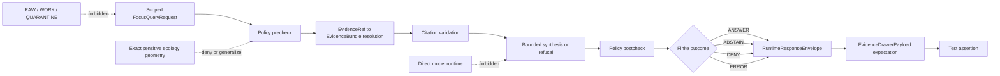

<!-- [KFM_META_BLOCK_V2]
doc_id: kfm://doc/TODO-tests-fixtures-ecology-focus-mode-readme-uuid
title: Ecology Focus Mode Fixtures
type: standard
version: v1
status: draft
owners: TODO(kfm-verify-owner)
created: TODO(kfm-verify-created-date)
updated: 2026-04-29
policy_label: TODO(kfm-verify-policy-label)
related: [tests/fixtures/ecology/focus_mode/README.md, tests/fixtures/ecology/README.md, tests/fixtures/README.md, tests/README.md, docs/architecture/focus-mode.md, docs/architecture/evidence-flow.md, docs/architecture/evidence-drawer-ai-implications.md, schemas/contracts/v1, contracts/OBJECT_MAP.md]
tags: [kfm, tests, fixtures, ecology, focus-mode, governed-ai, evidence-bundle, no-network]
notes: [Repo checkout was not mounted during this authoring pass; adjacent paths, owners, policy label, schema home, validator command, test runner, and exact fixture filenames remain NEEDS VERIFICATION.]
[/KFM_META_BLOCK_V2] -->

<a id="top"></a>

# Ecology Focus Mode Fixtures

No-network fixtures for testing **KFM Focus Mode** over public-safe ecology evidence envelopes.

<div align="left">


</div>

<p>
  <a href="#scope">Scope</a> ·
  <a href="#repo-fit">Repo fit</a> ·
  <a href="#fixture-contract">Fixture contract</a> ·
  <a href="#directory-shape">Directory shape</a> ·
  <a href="#quickstart">Quickstart</a> ·
  <a href="#validation">Validation</a> ·
  <a href="#fixture-matrix">Fixture matrix</a> ·
  <a href="#risk-register">Risks</a> ·
  <a href="#definition-of-done">Definition of done</a> ·
  <a href="#appendix">Appendix</a>
</p>

> [!IMPORTANT]
> This README is repo-ready guidance, not proof of current implementation. Claims about actual files, owners, schemas, tests, workflows, routes, badges, or runtime behavior remain `UNKNOWN` until verified from current repository evidence.

| Field | Value |
|---|---|
| Status | `draft` |
| Intended path | `tests/fixtures/ecology/focus_mode/README.md` |
| Owners | `TODO(kfm-verify): confirm owner from CODEOWNERS or repo-native ownership docs` |
| Evidence mode | `CORPUS_ONLY` / `NO_LOCAL_REPO_EVIDENCE` for this authoring pass |
| Policy label | `TODO(kfm-verify): confirm policy label for fixture directory` |
| Public posture | Cite-or-abstain; fail closed on unresolved rights, sensitivity, review, or release state |
| Accepted inputs | Public-safe, deterministic, no-network request, response, evidence, policy, and drawer fixtures |
| Explicit exclusions | Live source payloads, RAW/WORK/QUARANTINE paths, direct model calls, credentials, real sensitive exact locations |

| What this document does | What it does not do |
|---|---|
| Defines the expected role of ecology Focus Mode fixtures. | Does not prove the directory exists in the active repo. |
| Names accepted object families and finite outcomes. | Does not define canonical machine schemas. |
| Gives no-network validation and review expectations. | Does not authorize live source intake or public release. |
| Preserves negative outcomes as valid test behavior. | Does not allow direct model-client or canonical-store access. |

---

## Scope

This directory is for **small, deterministic, public-safe ecology fixtures** that exercise Focus Mode behavior without reaching live sources, model runtimes, canonical stores, unpublished data, or restricted steward material.

The fixtures should prove that ecology-focused requests can move through the KFM trust path without bypassing governance:



### Truth posture

| Label | Applies here |
|---|---|
| **CONFIRMED** | This README is intended for the ecology Focus Mode fixture lane named in the document itself. KFM doctrine requires governed APIs, `EvidenceRef` → `EvidenceBundle` resolution, finite outcomes, cite-or-abstain behavior, and no direct model-client path. |
| **PROPOSED** | Fixture naming, directory grouping, example payload shells, and illustrative validation commands below. |
| **NEEDS VERIFICATION** | Actual repo ownership, adjacent README paths, canonical schema home, validator command, test runner, exact fixture filenames, and policy label. |
| **UNKNOWN** | Whether this target directory already exists in the active checkout; the authoring workspace did not expose a mounted KFM repository. |

<p align="right"><a href="#top">Back to top ↑</a></p>

---

## Repo fit

| Relationship | Path | Status | Role |
|---|---|---|---|
| This README | `tests/fixtures/ecology/focus_mode/README.md` | **PROPOSED / intended target** | Directory guide for ecology Focus Mode fixtures. |
| Ecology fixture parent | `tests/fixtures/ecology/README.md` | **NEEDS VERIFICATION** | Expected parent for ecology fixture families. |
| Fixture root | `tests/fixtures/README.md` | **NEEDS VERIFICATION** | Expected fixture-wide conventions and validation notes. |
| Test root | `tests/README.md` | **NEEDS VERIFICATION** | Expected test-suite ownership and run instructions. |
| Focus Mode architecture | `docs/architecture/focus-mode.md` | **NEEDS VERIFICATION** | Expected doctrine and runtime-envelope explanation. |
| Evidence flow architecture | `docs/architecture/evidence-flow.md` | **NEEDS VERIFICATION** | Expected `EvidenceRef` → `EvidenceBundle` resolution rules. |
| Evidence Drawer + AI implications | `docs/architecture/evidence-drawer-ai-implications.md` | **NEEDS VERIFICATION** | Expected trust-visible UI payload guidance. |
| Machine schemas | `schemas/contracts/v1/` or repo-native contract home | **NEEDS VERIFICATION** | Schema authority must be confirmed before fixture validation is wired. |
| Object map | `contracts/OBJECT_MAP.md` | **NEEDS VERIFICATION** | Expected crosswalk for `RuntimeResponseEnvelope`, `EvidenceBundle`, `PolicyDecision`, and drawer payload objects. |

> [!WARNING]
> Do not create parallel schema authority for this fixture lane. If both `contracts/` and `schemas/` exist in the active repo, resolve the canonical machine-schema home through an ADR before adding or expanding schema-backed fixtures.

<p align="right"><a href="#top">Back to top ↑</a></p>

---

## Fixture contract

Focus Mode fixtures should test the **governed response surface**, not the whole ecology pipeline and not root truth stores.

### Accepted inputs

| Input family | Accepted when | Fixture value |
|---|---|---|
| `FocusQueryRequest` | Scope is explicit: place, time, selected feature, release scope, user/surface role, and requested ecology claim. | Tests scope inheritance and policy precheck. |
| `RuntimeResponseEnvelope` | Response has one finite outcome: `ANSWER`, `ABSTAIN`, `DENY`, or `ERROR`. | Tests that Focus Mode never emits free-form model text as the public object. |
| `EvidenceRef` / `EvidenceBundle` | Every cited support object resolves, or intentionally fails in a negative fixture. | Tests closure, citation validation, and cite-or-abstain behavior. |
| `EvidenceDrawerPayload` | Payload is drawer-ready and exposes evidence, policy, review, release, correction, freshness, and caveat signals. | Tests that consequential claims stay inspectable. |
| `PolicyDecision` | Rights, sensitivity, source role, review state, and release state are visible. | Tests fail-closed behavior and negative-state messaging. |
| Ecology join cases | Habitat, fauna, flora, range, occurrence, or landscape context examples are synthetic, generalized, or already public-safe. | Tests ecology reasoning without exposing sensitive exact locations. |

### Exclusions

| Does not belong here | Put it somewhere else | Reason |
|---|---|---|
| Live biodiversity, habitat, land-cover, or agency endpoint payloads | `data/raw/`, `data/work/`, or source-specific staging after source activation | This directory is for no-network fixtures, not source intake. |
| RAW, WORK, or QUARANTINE paths | Lifecycle storage only | Public/UI/Focus fixtures must not normalize raw access as a test pattern. |
| Real exact sensitive species locations | Restricted steward workflows or quarantine; public fixtures must generalize, suppress, or synthesize | Exact sensitive ecology locations fail closed unless reviewed release support exists. |
| Canonical ecology records or graph-store dumps | Canonical domain stores or graph projection fixtures | Focus fixtures test governed envelopes, not root truth stores. |
| Validator implementation code | `tools/validators/` or repo-native validation package | Fixture data should remain separate from executable validation logic. |
| Machine schemas | `schemas/contracts/v1/`, `contracts/`, or the ADR-confirmed schema home | Fixtures conform to schemas; they do not define schema authority. |
| Direct model prompts, raw model output, provider transcripts, or chain-of-thought | Mock-adapter fixtures only, with envelope context and no secrets | KFM Focus Mode uses governed envelopes, not raw model text. |
| Published layer manifests or tiles | `data/published/`, `data/proofs/`, or release fixture homes | Published artifacts require promotion, proof, and rollback context. |

### Fixture design rules

- Use **synthetic public-safe geography** unless exact geometry has documented release support.
- Prefer small JSON fixtures that can be reviewed in a pull request.
- Make negative outcomes first-class; `ABSTAIN`, `DENY`, and `ERROR` fixtures are valid coverage.
- Include enough metadata to reconstruct why the expected outcome is safe.
- Keep provider-specific model details out of fixtures unless the case explicitly tests a deterministic mock adapter.
- Keep occurrence, habitat context, modeled range, and derived assignment as separate support concepts.
- Do not let an ecology fixture imply that a rendered map, tile, summary, vector index, or AI answer is sovereign truth.

<p align="right"><a href="#top">Back to top ↑</a></p>

---

## Directory shape

> [!NOTE]
> The tree below is **PROPOSED** because the active repository was not available during this authoring pass. Reconcile it with actual files before landing changes.

```text
tests/fixtures/ecology/focus_mode/
├── README.md
├── answer/
│   ├── public_safe_habitat_summary.runtime_response_envelope.json
│   └── public_safe_habitat_summary.evidence_drawer_payload.json
├── abstain/
│   ├── unresolved_evidence_ref.runtime_response_envelope.json
│   └── insufficient_release_scope.runtime_response_envelope.json
├── deny/
│   ├── sensitive_exact_location.runtime_response_envelope.json
│   └── unreviewed_occurrence_geometry.runtime_response_envelope.json
├── error/
│   └── malformed_focus_request.runtime_response_envelope.json
├── requests/
│   ├── selected_feature.focus_query_request.json
│   └── time_scoped_ecology.focus_query_request.json
└── bundles/
    ├── public_safe_habitat.evidence_bundle.json
    └── unresolved_ref.evidence_bundle_negative.json
```

### Naming pattern

Use a stable, review-readable pattern:

```text
<outcome>/<case>.<object_family>.json
```

Examples:

```text
answer/public_safe_habitat_summary.runtime_response_envelope.json
deny/sensitive_exact_location.runtime_response_envelope.json
abstain/unresolved_evidence_ref.runtime_response_envelope.json
error/malformed_focus_request.runtime_response_envelope.json
```

### Directory roles

| Directory | Role | Review expectation |
|---|---|---|
| `requests/` | Input requests to Focus Mode. | Scope, selected feature, time, role, and release state are explicit. |
| `bundles/` | Positive or negative evidence-bundle fixtures. | Evidence closure is testable; unresolved refs are intentional. |
| `answer/` | Valid `ANSWER` envelopes and paired drawer payloads. | Citations resolve and policy allows the bounded claim. |
| `abstain/` | Valid `ABSTAIN` envelopes. | Evidence insufficiency is explained without inventing a claim. |
| `deny/` | Valid `DENY` envelopes. | Restricted support is not revealed; model call is not needed. |
| `error/` | Intentional malformed or harness-error fixtures. | Error remains structured and does not normalize broken output. |

<p align="right"><a href="#top">Back to top ↑</a></p>

---

## Quickstart

Run these checks from the repository root after the active checkout is mounted.

```bash
# 1. Inspect the fixture inventory.
find tests/fixtures/ecology/focus_mode -maxdepth 3 -type f | sort

# 2. Smoke-check JSON well-formedness without network access.
python - <<'PY'
from pathlib import Path
import json

root = Path("tests/fixtures/ecology/focus_mode")
failed = []

for path in sorted(root.rglob("*.json")):
    try:
        json.loads(path.read_text(encoding="utf-8"))
    except Exception as exc:  # noqa: BLE001 - fixture smoke script prints all parse failures
        failed.append((path, exc))

if failed:
    for path, exc in failed:
        print(f"JSON_ERROR {path}: {exc}")
    raise SystemExit(1)

print("JSON_OK")
PY

# 3. Run the repo-native Focus/ecology fixture tests.
# TODO(kfm-verify): replace with the actual test command once the package manager and test runner are confirmed.
# Example only:
# pytest tests -k "ecology and focus_mode"
```

> [!CAUTION]
> The example test command is intentionally commented out. Do not promote it to canonical documentation until the repo’s actual runner, package manager, and test selection syntax are verified.

<p align="right"><a href="#top">Back to top ↑</a></p>

---

## Validation

### Minimum validation gates

| Gate | Pass condition |
|---|---|
| No-network gate | Fixture tests run without live source calls, model-provider calls, or private service dependencies. |
| Shape gate | Each JSON fixture is well formed and validates against the canonical schema home after that home is verified. |
| Evidence closure gate | Each cited support ref resolves to an `EvidenceBundle`, or the negative fixture intentionally proves unresolved support. |
| Policy gate | Rights, sensitivity, release, and review states produce the expected finite outcome. |
| Citation gate | `ANSWER` fixtures have support citations; insufficient support produces `ABSTAIN`. |
| UI trust gate | Drawer-ready signals remain visible for consequential claims. |
| Regression gate | Existing fixture behavior is preserved unless a migration note explains the change. |
| Rollback gate | Fixture changes can be reverted without touching canonical data, live connectors, or released artifacts. |

### No-network assertion pattern

Use repo-native tests when available. Until then, the intended assertions are:

```text
request fixture + evidence bundle fixture + policy fixture
  -> Focus Mode handler or mock adapter
  -> RuntimeResponseEnvelope with finite outcome
  -> citation validation result
  -> optional EvidenceDrawerPayload expectation
```

### Negative-path coverage

| Negative case | Expected result |
|---|---|
| `EvidenceRef` does not resolve. | `ABSTAIN` unless policy requires `DENY`. |
| Source role is unknown or insufficient for the requested claim. | `ABSTAIN` or `DENY`; never `ANSWER`. |
| Sensitive exact location is requested. | `DENY` or generalized public-safe answer only when release support exists. |
| Review state is missing for consequential ecology support. | `ABSTAIN` or `DENY` depending on policy. |
| Release scope is insufficient. | `ABSTAIN` or `DENY`; do not leak unpublished support. |
| Request shape is malformed. | `ERROR` with structured error fields. |
| Direct model-provider path is attempted. | Test failure or `DENY` depending on harness design. |

<p align="right"><a href="#top">Back to top ↑</a></p>

---

## Usage

### Add a fixture

1. Choose the expected finite outcome: `ANSWER`, `ABSTAIN`, `DENY`, or `ERROR`.
2. Place the fixture under the matching outcome directory.
3. Include a small request or response object with explicit scope, policy state, and evidence references.
4. Pair answer-like fixtures with drawer-ready support, or state why a drawer payload is intentionally absent.
5. Add or update the corresponding test assertion.
6. Record schema, policy, or object-family changes outside this directory.

### Minimum review signals

| Signal | Why it matters |
|---|---|
| `request_id` or fixture-local equivalent | Ties fixture behavior to a reconstructable test case. |
| `surface_class` / `surface_state` or equivalent | Keeps Focus Mode scoped to a governed UI surface. |
| finite `outcome` | Prevents raw model text from becoming the response contract. |
| `evidence_refs` / `citations` | Supports cite-or-abstain validation. |
| `policy` | Makes rights, sensitivity, review, release, and obligations testable. |
| `release_scope` or dry-run release state | Prevents unpublished support from leaking into public-like fixtures. |
| `freshness`, `review`, or `correction` signals | Keeps stale, superseded, corrected, or unresolved states visible. |

### Reviewer prompts

Before approving fixture changes, ask:

- Does the fixture prove Focus Mode behavior, or is it smuggling source intake, schema design, or canonical data into a fixture directory?
- Can every `ANSWER` be reconstructed through evidence and citation support?
- Does every `DENY` avoid revealing restricted support?
- Are `ABSTAIN` cases treated as successful trust behavior rather than test failures?
- Can the change be rolled back without touching live connectors, canonical stores, or released artifacts?

<p align="right"><a href="#top">Back to top ↑</a></p>

---

## Fixture matrix

### Outcome expectations

| Outcome | Use when | Required expectation |
|---|---|---|
| `ANSWER` | Evidence resolves, policy allows, citations validate, and the response stays within scope. | Response includes or points to supporting `EvidenceBundle` material and drawer-ready trust state. |
| `ABSTAIN` | Evidence is missing, unresolved, ambiguous, stale beyond policy, or insufficient for the requested claim. | Response explains insufficiency without inventing a claim. |
| `DENY` | Rights, sensitivity, role, release state, or exact-location policy blocks the request. | Response does not call the model and does not reveal restricted support. |
| `ERROR` | Fixture intentionally violates shape, required fields, or test harness assumptions. | Error is structured and does not normalize broken output as a valid answer. |

### Ecology-specific safeguards

| Fixture pressure | Expected guardrail |
|---|---|
| Habitat assignment from occurrence evidence | Keep occurrence evidence, habitat context, and derived assignment separate. |
| Rare or protected species request | Deny exact sensitive location unless public release support is explicit. |
| Modeled habitat or range surface | Label as modeled or derived support, not direct occurrence truth. |
| Aggregated public map request | Use generalized public-safe geometry and expose transform or caveat signals. |
| Unclear source role | Abstain or deny; do not promote source-role ambiguity into an answer. |
| Time-scoped request | Preserve time window and freshness state in the envelope. |
| Corrected or superseded evidence | Expose correction lineage or abstain if lineage cannot be resolved. |

<p align="right"><a href="#top">Back to top ↑</a></p>

---

## Risk register

| Risk | Why it matters | Mitigation |
|---|---|---|
| Fixture implies exact sensitive ecology geometry is public-safe. | Could normalize harmful disclosure patterns. | Use synthetic/generalized geometry; add `DENY` fixture for exact-location request. |
| Fixture uses unresolved or ambiguous evidence but expects `ANSWER`. | Breaks cite-or-abstain posture. | Add evidence-closure assertion; expect `ABSTAIN` for insufficient support. |
| Direct model output is treated as the response object. | Collapses generation and governed release. | Require `RuntimeResponseEnvelope` and citation validation before answer-like output. |
| Schema-home ambiguity creates duplicate contracts. | Produces drift and weak validation. | Verify schema home; record ADR before adding schema-backed fixture families. |
| Fixture reaches live services. | Makes tests brittle and may bypass rights/source-role checks. | Enforce no-network fixture tests and deterministic mock inputs. |
| Negative outcomes are removed as “failures.” | Weakens trust membrane coverage. | Require `ABSTAIN`, `DENY`, and `ERROR` coverage in definition of done. |

<p align="right"><a href="#top">Back to top ↑</a></p>

---

## Rollback and correction

Fixture changes should be reversible and should not require changes to canonical data, live source connectors, published artifacts, or released tiles.

| Scenario | Rollback action |
|---|---|
| New fixture breaks validation because schema home was guessed. | Revert fixture addition; add schema-home ADR task; keep README note as `NEEDS VERIFICATION`. |
| Fixture accidentally includes restricted geometry or private support. | Remove fixture immediately; add sanitized replacement; record review note in the PR. |
| Test command is wrong for repo-native runner. | Keep illustrative command commented; replace only after repo evidence confirms runner syntax. |
| Object-family naming changes in canonical contracts. | Add migration note and update fixture filenames and assertions together. |
| Negative outcome expectation changes due to policy update. | Update policy fixture, expected envelope, and review note in the same PR. |

<p align="right"><a href="#top">Back to top ↑</a></p>

---

## Definition of done

### Directory readiness

- [ ] Owner is verified in repo-native ownership files.
- [ ] KFM Meta Block placeholders are replaced or explicitly accepted as review TODOs.
- [ ] Policy label is verified.
- [ ] Fixture filenames match actual test expectations.
- [ ] JSON fixtures are well formed.
- [ ] Fixtures validate against the canonical schema home.
- [ ] Positive fixture includes resolvable evidence support.
- [ ] Negative fixtures cover `ABSTAIN`, `DENY`, and `ERROR`.
- [ ] Sensitive exact-location request is denied or generalized.
- [ ] No fixture contains RAW, WORK, QUARANTINE, credential, model-runtime, or internal-store access paths.
- [ ] Citation validation expectations are explicit.
- [ ] Evidence Drawer payload expectations are represented or intentionally omitted with a reason.
- [ ] Test command is replaced with the repo-native runner.
- [ ] Schema-home ambiguity is captured in an ADR before new schema-backed fixture families land.

### Review gates

| Gate | Pass condition |
|---|---|
| No-network gate | Fixture tests run without live source calls or model-provider calls. |
| Evidence closure gate | Each cited support ref resolves or intentionally fails in a negative fixture. |
| Policy gate | Rights, sensitivity, release, and review states produce expected finite outcomes. |
| UI trust gate | Drawer-ready signals remain visible for consequential claims. |
| Regression gate | Existing Focus Mode fixture behavior is preserved unless a migration note explains the change. |
| Rollback gate | Fixture changes can be reverted without touching canonical data, live connectors, or released artifacts. |

<p align="right"><a href="#top">Back to top ↑</a></p>

---

## FAQ

### Why keep Focus Mode fixtures under ecology?

Ecology joins habitat, fauna, flora, landscape context, and sometimes sensitive occurrence evidence. Keeping these fixtures local to `tests/fixtures/ecology/focus_mode/` makes it easier to review ecology-specific guardrails without turning the governed-AI fixture set into a shapeless global bucket.

### Why are `ABSTAIN` and `DENY` fixtures required?

KFM treats refusal and bounded uncertainty as valid system behavior. A Focus Mode surface that can only demonstrate happy-path answers is not proving the trust membrane.

### Can these fixtures use real species names?

Use synthetic or public-safe examples by default. Real names may be acceptable for common, public, non-sensitive examples only when rights, source role, and release posture are clear. Exact sensitive locations do not belong here.

### Can a fixture include model output?

Only inside a governed envelope or deterministic mock-adapter fixture. Raw provider transcripts, chain-of-thought, prompt logs, or detached assistant answers do not belong in this directory.

### What should happen when evidence does not resolve?

Use `ABSTAIN` for insufficient support or unresolved evidence. Use `DENY` when policy blocks the request. Use `ERROR` only for malformed fixture shape or test harness failure.

<p align="right"><a href="#top">Back to top ↑</a></p>

---

## Appendix

<details>
<summary>Suggested fixture object checklist</summary>

A complete fixture does not need every field below, but the test should be clear about which object family is being exercised.

| Object family | Suggested signals |
|---|---|
| `FocusQueryRequest` | request id, selected feature, time window, release scope, user role or surface role, question, expected policy posture |
| `EvidenceBundle` | bundle id, evidence refs, source descriptors, source roles, rights, sensitivity, review state, release state, provenance, digest or fixture hash |
| `RuntimeResponseEnvelope` | schema version, object type, request id, audit ref, surface class, surface state, result outcome, citations, policy decision, freshness, release scope |
| `EvidenceDrawerPayload` | claim, evidence refs, source role, policy state, review state, release state, correction state, caveats, confidence or uncertainty label |
| `PolicyDecision` | decision id, outcome, reason codes, obligations, sensitivity treatment, release permission, audit reference |
| `CitationValidationReport` | cited refs, resolved refs, missing refs, unsupported claim refs, validation outcome |

</details>

<details>
<summary>Illustrative payload shells — PROPOSED, schema home needs verification</summary>

These shells are intentionally small. They are examples of review shape, not canonical schema definitions.

```json
{
  "object_type": "RuntimeResponseEnvelope",
  "schema_version": "TODO(kfm-verify-schema-version)",
  "request_id": "fixture-request-public-safe-habitat-summary",
  "surface_class": "focus_mode",
  "outcome": "ANSWER",
  "answer": {
    "claim": "Synthetic habitat context supports a bounded public-safe summary.",
    "scope": {
      "place": "synthetic-public-safe-ecology-cell",
      "time_window": "2021-01-01/2021-12-31"
    }
  },
  "citations": [
    {
      "evidence_ref": "evidence-ref-public-safe-habitat-001",
      "bundle_id": "evidence-bundle-public-safe-habitat"
    }
  ],
  "policy": {
    "outcome": "allow",
    "sensitivity": "public_safe",
    "release_scope": "fixture_only"
  }
}
```

```json
{
  "object_type": "RuntimeResponseEnvelope",
  "schema_version": "TODO(kfm-verify-schema-version)",
  "request_id": "fixture-request-sensitive-exact-location",
  "surface_class": "focus_mode",
  "outcome": "DENY",
  "denial": {
    "reason_codes": ["sensitive_exact_location", "insufficient_public_release_support"],
    "safe_message": "The requested exact location cannot be displayed or summarized at this release scope."
  },
  "policy": {
    "outcome": "deny",
    "sensitivity": "restricted",
    "release_scope": "public"
  }
}
```

```json
{
  "object_type": "RuntimeResponseEnvelope",
  "schema_version": "TODO(kfm-verify-schema-version)",
  "request_id": "fixture-request-unresolved-evidence-ref",
  "surface_class": "focus_mode",
  "outcome": "ABSTAIN",
  "abstention": {
    "reason_codes": ["unresolved_evidence_ref"],
    "safe_message": "The evidence reference did not resolve to an EvidenceBundle, so no ecology claim is made."
  },
  "citations": [],
  "policy": {
    "outcome": "allow_abstain",
    "release_scope": "fixture_only"
  }
}
```

</details>

<details>
<summary>Open verification backlog</summary>

- `TODO(kfm-verify):` confirm whether this directory already exists in the active repository.
- `TODO(kfm-verify):` confirm fixture owner from `CODEOWNERS` or repo-native ownership docs.
- `TODO(kfm-verify):` confirm canonical schema home for Focus Mode and ecology fixture objects.
- `TODO(kfm-verify):` confirm whether adjacent README files exist and add relative links after verification.
- `TODO(kfm-verify):` confirm exact test runner and replace the commented quickstart command.
- `TODO(kfm-verify):` confirm whether fixture names should align with existing `FocusQueryRequest`, `RuntimeResponseEnvelope`, `EvidenceDrawerPayload`, and `EvidenceBundle` schemas.
- `TODO(kfm-verify):` confirm policy label for this README and fixture directory.
- `TODO(kfm-verify):` confirm whether repo conventions prefer `focus_mode` or `focus-mode` in fixture paths.
- `TODO(kfm-verify):` confirm whether negative fixture naming should use `negative` suffixes or outcome directories only.

</details>

<p align="right"><a href="#top">Back to top ↑</a></p>
