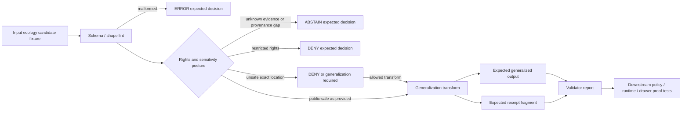

<!-- [KFM_META_BLOCK_V2]
doc_id: kfm://doc/NEEDS_VERIFICATION__tests_fixtures_ecology_generalize_readme
title: Ecology Generalization Fixtures
type: standard
version: v1
status: draft
owners: NEEDS_VERIFICATION__tests_or_ecology_owner
created: NEEDS_VERIFICATION__YYYY-MM-DD
updated: NEEDS_VERIFICATION__YYYY-MM-DD
policy_label: NEEDS_VERIFICATION__public_or_internal
related: [../../README.md, ../../../README.md, ../../../../schemas/README.md, ../../../../policy/README.md, ../../../../tools/validators/README.md]
tags: [kfm, tests, fixtures, ecology, generalization, sensitivity, public-safe]
notes: [Target path supplied as tests/fixtures/ecology/generalize/README.md. Active-branch fixture inventory, owners, exact schema links, and validator names remain NEEDS VERIFICATION.]
[/KFM_META_BLOCK_V2] -->

# Ecology Generalization Fixtures

Fixture lane for proving KFM ecology generalization, withholding, and public-safe precision behavior without storing live or sensitive occurrence data.

<a id="top"></a>

## Impact block

| Field | Value |
|---|---|
| **Status** | `experimental` |
| **Owners** | `NEEDS_VERIFICATION__tests_or_ecology_owner` |
| **Path** | `tests/fixtures/ecology/generalize/` |
| **Repo fit** | Child fixture leaf under `tests/fixtures/`; consumes schemas and policy, does not author them |
| **Truth posture** | `CONFIRMED` target path from request · `PROPOSED` fixture shape · `UNKNOWN` active-branch inventory |
| **Quick jumps** | [Scope](#scope) · [Repo fit](#repo-fit) · [Accepted inputs](#accepted-inputs) · [Exclusions](#exclusions) · [Directory tree](#directory-tree) · [Quickstart](#quickstart) · [Usage](#usage) · [Flow](#flow) · [Operating tables](#operating-tables) · [Definition of done](#task-list--definition-of-done) · [FAQ](#faq) |


> [!IMPORTANT]
> This directory is for **small, reviewable, public-safe test fixtures**. It must not become a hidden archive of raw occurrence records, precise sensitive coordinates, restricted provider data, or unpublished ecology evidence.

> [!WARNING]
> Generalization is not decoration. In KFM, a generalized ecology output must preserve the reason for precision reduction, source role, rights posture, sensitivity posture, evidence references, and review obligations. A map-safe shape is not automatically a publishable claim.

---

## Scope

`tests/fixtures/ecology/generalize/` exists to support tests that prove whether ecology-facing data can be safely transformed, withheld, denied, or rejected before public or semi-public use.

This leaf is especially relevant to biodiversity, rare species, flora, fauna, habitat, modeled range, protected-area context, and other ecology-adjacent records where exact location exposure can be unsafe or rights-constrained.

### This leaf owns

- **Fixture examples** for public-safe ecology generalization decisions.
- **Expected outputs** that make precision changes visible.
- **Expected negative outcomes** for missing provenance, restricted rights, sensitive exact location, and malformed input.
- **Receipt-adjacent examples** when a validator needs to confirm that a generalization or withholding transform was recorded.
- **Thin-slice review support** for tests that prove `ANSWER`, `ABSTAIN`, `DENY`, and `ERROR` paths without live source calls.

### This leaf does not own

- Canonical ecology records.
- Source admission policy.
- Live connector logic.
- Release manifests or proof packs.
- Steward-only precise occurrence storage.
- Evidence Drawer implementation.
- Runtime route behavior.

### Working path note

The local directory name is `generalize`, but the stronger KFM vocabulary remains:

- public-safe precision
- sensitivity-aware publication
- source-role discipline
- rights-aware withholding
- EvidenceRef → EvidenceBundle resolution
- receipt/proof/catalog/runtime separation
- visible negative outcomes

Treat `generalize/` as a **fixture role**, not as permission to blur evidence.

[Back to top](#top)

---

## Repo fit

This README is a directory README for a fixture leaf. It should feel native beside other `tests/fixtures/**/README.md` files and should stay downstream of the project’s contract, schema, policy, and validator surfaces.

| Relationship | Relative link from this file | Role | Verification |
|---|---:|---|---|
| Parent fixture surface | [`../../README.md`](../../README.md) | fixture-home guidance for `tests/fixtures/` | `NEEDS VERIFICATION` |
| Tests landing page | [`../../../README.md`](../../../README.md) | broader test boundary and ownership | `NEEDS VERIFICATION` |
| Ecology fixture parent | [`../README.md`](../README.md) | local ecology fixture grouping | `NEEDS VERIFICATION` |
| Schema/control surface | [`../../../../schemas/README.md`](../../../../schemas/README.md) | machine schema authority, if repo convention confirms | `NEEDS VERIFICATION` |
| Policy surface | [`../../../../policy/README.md`](../../../../policy/README.md) | source-role, rights, sensitivity, and publication policy | `NEEDS VERIFICATION` |
| Validator surface | [`../../../../tools/validators/README.md`](../../../../tools/validators/README.md) | validator entry points and reports | `NEEDS VERIFICATION` |
| Runtime proof sibling | [`../../../e2e/runtime_proof/fauna/README.md`](../../../e2e/runtime_proof/fauna/README.md) | downstream request-time proof, if present | `NEEDS VERIFICATION` |
| Receipts / proofs / catalog | [`../../../../data/receipts/README.md`](../../../../data/receipts/README.md) · [`../../../../data/proofs/README.md`](../../../../data/proofs/README.md) · [`../../../../data/catalog/README.md`](../../../../data/catalog/README.md) | release-significant artifact families, if present | `NEEDS VERIFICATION` |

> [!NOTE]
> If the mounted repository uses different homes for schemas, contracts, validators, or runtime proof, update the links above rather than creating duplicate authority paths under this fixture leaf.

[Back to top](#top)

---

## Accepted inputs

Content that belongs here is deliberately small and behavior-focused.

| Input class | Why it belongs here | Expected posture |
|---|---|---|
| Synthetic sensitive-location candidates | proves exact-location requests fail closed without exposing real sites | `DENY` or transformed public-safe output |
| Generalized occurrence fixtures | proves public output can carry reduced precision visibly | `ANSWER` with `precision_served` and `generalized: true` |
| Modeled range or habitat-context fixtures | proves modeled/contextual support stays distinct from observed occurrence | `ANSWER` or `ABSTAIN`, depending on support |
| Missing-provenance fixtures | proves the system abstains instead of bluffing | `ABSTAIN` |
| Restricted-rights fixtures | proves rights posture can block outward reuse | `DENY` |
| Malformed geometry or missing required fields | proves schema failures are explicit | `ERROR` |
| Expected generalization receipt fragments | proves the transform reason, method, and public precision were recorded when required | fixture-only, not a proof pack |

### Good first thin-slice set

A minimal honest starter pack would include:

1. one valid **county-level public-safe occurrence** fixture
2. one valid **HUC12 or range-context** fixture
3. one invalid **exact sensitive location** fixture
4. one invalid **missing provenance** fixture
5. one invalid **restricted rights** fixture
6. one invalid **malformed geometry or shape** fixture

[Back to top](#top)

---

## Exclusions

This fixture leaf must stay narrow. The table below is the guardrail.

| Does **not** belong here | Put it here instead | Why |
|---|---|---|
| Raw GBIF, eBird, iNaturalist, NatureServe, KDWP, USFWS, or provider pulls | governed RAW / WORK / QUARANTINE zones | tests should not become source custody |
| Precise real sensitive coordinates | restricted steward-only stores or quarantine | this leaf proves public safety, not exposure |
| Canonical source descriptors | source registry / schema surface | source admission law belongs upstream |
| Rego or policy source files | `policy/**` | fixtures consume policy; they do not author it |
| Validator implementation code | `tools/validators/**` or repo-native test helpers | code belongs in executable surfaces |
| Release manifests, signatures, proof packs, catalog closure | release, receipt, proof, and catalog homes | publication evidence is a different burden |
| Evidence Drawer component payload implementation | UI or app contract surface | this leaf may provide fixtures, not shell behavior |
| Live watcher code or scheduler config | pipeline / connector lanes | fixture tests should be no-network by default |
| AI-generated explanations as expected truth | governed AI/runtime proof surfaces with EvidenceBundle resolution | generated prose is not root evidence |

[Back to top](#top)

---

## Directory tree

### Current safe claim

`CONFIRMED`: the requested target file is `tests/fixtures/ecology/generalize/README.md`.

`UNKNOWN`: active-branch contents for this exact leaf were not visible in this session.

### Proposed starter shape

```text
tests/fixtures/ecology/generalize/
├── README.md
├── manifests/
│   └── generalization_cases.v1.json
├── valid/
│   ├── county_public_safe_occurrence/
│   │   ├── input.candidate.json
│   │   ├── expected.generalized.json
│   │   └── expected.receipt.json
│   └── huc12_public_safe_habitat_context/
│       ├── input.candidate.json
│       ├── expected.generalized.json
│       └── expected.receipt.json
└── invalid/
    ├── exact_sensitive_location/
    │   ├── input.candidate.json
    │   └── expected.decision.json
    ├── missing_provenance/
    │   ├── input.candidate.json
    │   └── expected.decision.json
    ├── restricted_rights/
    │   ├── input.candidate.json
    │   └── expected.decision.json
    └── malformed_geometry/
        ├── input.candidate.json
        └── expected.decision.json
```

> [!TIP]
> Keep the first fixture pack boring on purpose. A small synthetic set that proves the negative paths is more valuable than a large ecology data sample that reviewers cannot safely inspect.

[Back to top](#top)

---

## Quickstart

### Safe inspection commands

```bash
# List the leaf exactly as the checked-out branch exposes it.
find tests/fixtures/ecology/generalize -maxdepth 5 -type f | sort

# Show any JSON files before running validators.
find tests/fixtures/ecology/generalize -name '*.json' -type f | sort
```

### Basic JSON sanity check

```bash
# No network. No provider calls. JSON syntax only.
find tests/fixtures/ecology/generalize -name '*.json' -print0 \
  | xargs -0 -n1 python -m json.tool >/dev/null
```

### Proposed validator entry point

```bash
# NEEDS VERIFICATION: replace with the repo-native validator once surfaced.
python tools/validators/validate_ecology_generalize_fixtures.py \
  tests/fixtures/ecology/generalize
```

### Review-only smoke checklist

```bash
# Confirm this leaf does not hide live data or raw provider files.
find tests/fixtures/ecology/generalize -type f \
  ! -name '*.md' \
  ! -name '*.json' \
  -print
```

[Back to top](#top)

---

## Usage

Use this leaf when a test needs to prove that ecology data can move toward public-safe output without losing the evidence and policy trail.

### Adding a fixture

1. Choose a case directory under `valid/` or `invalid/`.
2. Use synthetic or already-public generalized content only.
3. Keep the source role explicit, such as `observed_occurrence`, `modeled_range`, `habitat_context`, or `regulatory_context`.
4. Include requested precision and served precision when precision is part of the test.
5. Preserve rights and sensitivity posture in the input or expected decision.
6. Add an expected decision, generalized output, or receipt fragment only if the validator consumes it.
7. Keep evidence references as fixture references, not live provider records.
8. Run JSON syntax checks and the repo-native validator before merge.

### Suggested fixture fields

| Field | Why it matters | Notes |
|---|---|---|
| `fixture_id` | stable review handle | should not depend on local file path alone |
| `source_ref` | source identity | use fixture-safe refs, not hidden live records |
| `source_role` | evidence semantics | observed, modeled, regulatory, or context support must not collapse |
| `evidence_refs` | evidence traceability | use fixture EvidenceRefs or empty list when testing abstention |
| `rights_status` | reuse decision | unknown or restricted should block outward reuse |
| `sensitivity_status` | public exposure decision | unresolved or sensitive should fail closed |
| `requested_precision` | user or runtime ask | for example `exact_point`, `county`, `huc12`, `range_context` |
| `precision_served` | outward precision | must be visible when generalized |
| `generalized` | transform flag | `true` only when a transform actually happened |
| `generalization_method` | reproducibility | record method without leaking reversible details |
| `obligations` | downstream actions | examples: `generalize`, `withhold`, `review_required`, `review_rights` |
| `receipt_ref` | process memory | receipt fragments are not proof packs |

> [!CAUTION]
> Do not place real sensitive points here “just for tests.” Use synthetic geometry, already-public generalized geometry, or test doubles whose non-real status is obvious to reviewers.

[Back to top](#top)

---

## Flow



The important boundary is the branch between **candidate input** and **served public precision**. A fixture passes only when the expected output makes that boundary visible.

[Back to top](#top)

---

## Operating tables

### Outcome matrix

| Case | Expected outcome | Must prove | Must not imply |
|---|---|---|---|
| `county_public_safe_occurrence` | `ANSWER` | public-safe precision is served and visible | exact record is public |
| `huc12_public_safe_habitat_context` | `ANSWER` | context layer can support a bounded claim | modeled/contextual support is observed occurrence |
| `missing_provenance` | `ABSTAIN` | evidence gaps block outward certainty | missing evidence is “probably fine” |
| `exact_sensitive_location` | `DENY` or transform-required decision | exact public exposure fails closed | sensitive locations can be shown because this is a test |
| `restricted_rights` | `DENY` | reuse limits are enforced | open access equals redistributable |
| `malformed_geometry` | `ERROR` | bad shape is explicit | validator silently repairs unsupported input |

### Generalization posture

| Public-safe served precision | Typical use | Review burden |
|---|---|---|
| `county` | broad occurrence or range-context summary | low to medium, if rights and source role are clear |
| `huc12` | ecology/habitat context where hydrologic geography is appropriate | medium; must not imply exact occurrence |
| `range_context` | modeled or regulatory range context | medium; model/regulatory status must remain visible |
| `withheld` | sensitive or restricted record | high; denial reason and obligation should be explicit |
| `exact_point` | steward-only or internal restricted use | not allowed for public fixture outputs |

### Fixture health signals

| Healthy signal | Failure signal |
|---|---|
| source role is explicit | source family appears without source role |
| rights posture is explicit | license or redistribution status is absent |
| sensitivity posture is explicit | exact public safety is assumed |
| requested and served precision differ visibly when generalized | `generalized: true` with no method, reason, or served precision |
| expected decision names reason and obligations | negative outcome is hidden as UX failure |
| receipt fragment records transform purpose | fixture output silently strips fields |
| no live provider calls required | test depends on current external API behavior |
| synthetic sensitive geometry is clearly synthetic | real or possibly real sensitive coordinate appears |

[Back to top](#top)

---

## Task list / definition of done

Treat this README as healthy only when it remains both useful and honest.

- [ ] Verify whether `tests/fixtures/ecology/generalize/` already exists on the active branch beyond this README.
- [ ] Replace `NEEDS_VERIFICATION` metadata values with repo-backed `doc_id`, dates, owners, and policy label.
- [ ] Confirm parent README paths from this leaf.
- [ ] Confirm whether schemas live under `schemas/contracts/v1/**`, `contracts/**`, or another repo-native authority.
- [ ] Confirm the repo-native validator name before keeping any command that references `validate_ecology_generalize_fixtures.py`.
- [ ] Add at least one valid generalized fixture and one invalid fail-closed fixture.
- [ ] Keep all fixture geometry synthetic or already public-safe.
- [ ] Ensure each fixture declares source role, rights posture, sensitivity posture, and requested/served precision where relevant.
- [ ] Keep receipt fragments separate from proof packs.
- [ ] Confirm no raw, work, quarantine, live connector, or provider cache content lands under this leaf.
- [ ] Add negative-path assertions for `ABSTAIN`, `DENY`, and `ERROR`.
- [ ] Verify the README does not imply workflow, CI, signing, runtime, or publication maturity not proven by the active branch.

### Definition of done

This leaf is ready to move from `draft` toward `review` when:

1. active-branch contents are inventoried
2. placeholders in the meta block are resolved or explicitly accepted for review
3. fixture files are small enough for pull-request review
4. valid and invalid cases both exist
5. validator output is machine-readable or clearly documented
6. exact sensitive locations are absent from public fixtures
7. rights and sensitivity failures produce visible negative outcomes
8. generalization outputs retain transform reason and served precision
9. this leaf consumes, rather than replaces, schema and policy authority
10. rollback is a simple fixture/doc revert with no data migration

[Back to top](#top)

---

## FAQ

### Why keep this under `tests/fixtures/` instead of `data/`?

Because the purpose is verification support, not data custody. These files should help tests prove behavior around public-safe ecology precision, not become canonical ecology records.

### Can a fixture include exact coordinates?

Only if they are synthetic, plainly non-real, and necessary to prove denial or transformation behavior. Real sensitive coordinates, steward-only records, and provider-derived exact occurrence data do not belong here.

### Why include negative outcomes?

KFM treats visible refusal, abstention, denial, and error states as part of the trust model. A fixture pack that only proves happy-path generalization would miss the most important public-safety behavior.

### Is generalized geometry authoritative?

No. Generalized geometry is a served representation or derived public-safe output. It must not silently replace canonical source geometry, EvidenceBundles, review state, or release artifacts.

### What should happen when provenance is incomplete?

The fixture should expect `ABSTAIN` unless a specific policy and evidence chain prove otherwise. Do not invent confidence to make the fixture pass.

[Back to top](#top)

---

<details>
<summary>Appendix — pre-publish checklist</summary>

Use this checklist before merging changes in this leaf.

- [ ] Badges are present and conservative.
- [ ] Owners are present or clearly marked `NEEDS_VERIFICATION`.
- [ ] Status is present.
- [ ] Quick jumps are present.
- [ ] Repo fit is explicit.
- [ ] Accepted inputs and exclusions are explicit.
- [ ] Directory tree is included and marked `PROPOSED` where not branch-proven.
- [ ] Quickstart snippets are language-tagged.
- [ ] Mermaid diagram is included and meaningful.
- [ ] Tables clarify case classes, fields, and posture.
- [ ] Definition of done includes gates.
- [ ] No destructive commands are present.
- [ ] Relative links are reviewed from `tests/fixtures/ecology/generalize/`.
- [ ] Long reference material is hidden in `<details>`.
- [ ] No claim implies active CI, workflow, validator, route, or release behavior without repo evidence.
- [ ] No raw provider data or sensitive exact coordinates are included.
- [ ] Generalization remains visibly tied to evidence, rights, sensitivity, and review obligations.

</details>

[Back to top](#top)
