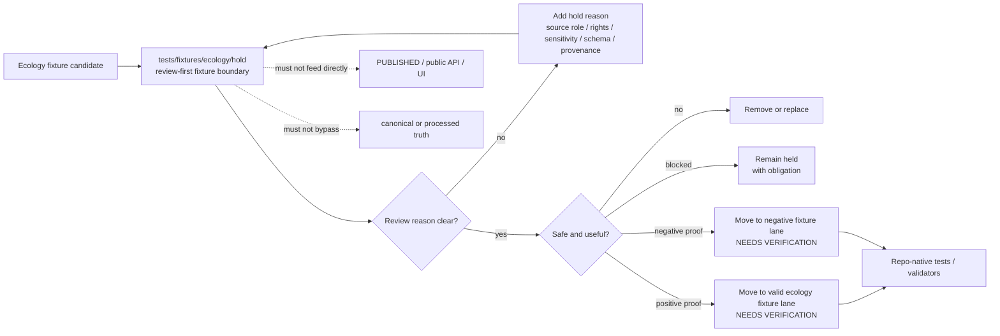

<!-- [KFM_META_BLOCK_V2]
doc_id: kfm://doc/TODO-NEEDS-UUID
title: Ecology Hold Fixtures
type: standard
version: v1
status: draft
owners: TODO-NEEDS-OWNER
created: TODO-NEEDS-VERIFICATION
updated: 2026-04-29
policy_label: TODO-NEEDS-VERIFICATION
related: [tests/fixtures/ecology/README.md, tests/fixtures/README.md, tests/README.md, schemas/contracts/v1/, contracts/, policy/, docs/]
tags: [kfm, tests, fixtures, ecology, hold, evidence, sensitivity, quarantine]
notes: [Target path supplied by task. Repository checkout, adjacent README files, fixture inventory, owner assignment, created date, and final policy label remain NEEDS VERIFICATION. This README treats hold/ as a review-first fixture boundary, not as a published or canonical data surface.]
[/KFM_META_BLOCK_V2] -->

<a id="top"></a>

# Ecology Hold Fixtures

Temporary, review-first home for ecology fixture candidates that are not yet safe, valid, or settled enough to become ordinary test fixtures.


> [!IMPORTANT]
> **Status:** experimental  
> **Owners:** `TODO-NEEDS-OWNER`  
> **Path:** `tests/fixtures/ecology/hold/README.md`  
> **Authority:** local README for a fixture hold surface; not a schema, policy, source registry, catalog, release, or publication authority.  
> **Quick jumps:** [Scope](#scope) · [Repo fit](#repo-fit) · [Accepted inputs](#accepted-inputs) · [Exclusions](#exclusions) · [Directory tree](#directory-tree) · [Quickstart](#quickstart) · [Usage](#usage) · [Diagram](#diagram) · [Operating tables](#operating-tables) · [Task list](#task-list--definition-of-done) · [FAQ](#faq) · [Appendix](#appendix)

> [!NOTE]
> The directory role is **INFERRED** from the target path name `hold/` and KFM lifecycle doctrine. Treat every stronger claim about current fixtures, validators, owners, or CI behavior as **NEEDS VERIFICATION** until the active branch is inspected.

---

## Scope

`tests/fixtures/ecology/hold/` is for **small, reviewable ecology fixture candidates** that should stay visible but blocked from ordinary fixture consumption until their evidence, rights, sensitivity, schema, source-role, or expected-outcome posture is clear.

This directory is useful when a fixture needs to say:

> “Keep me available for review or negative-path testing, but do not let me quietly become trusted fixture truth.”

It is especially relevant to ecology-facing fixture work where habitat, fauna, flora, occurrence, land-cover, range, or sensitivity examples may look usable before they are actually safe to use.

### Truth labels used here

| Label | Meaning in this README |
|---|---|
| **CONFIRMED** | Supported by the task path, current-session workspace inspection, or attached KFM doctrine. |
| **INFERRED** | Reasonable from the path name and KFM lifecycle, but not proven as active branch behavior. |
| **PROPOSED** | Recommended local convention for this directory. |
| **UNKNOWN** | Not verified because the repository checkout, branch files, tests, and fixtures were not visible. |
| **NEEDS VERIFICATION** | Reviewer must confirm before treating the statement as repo reality. |

<p align="right"><a href="#top">Back to top ↑</a></p>

---

## Repo fit

This README belongs to a narrow test-fixture leaf. Its job is to keep held ecology examples legible, bounded, and hard to mistake for processed fixtures or published evidence.

| Relationship | Path | Status | Notes |
|---|---|---:|---|
| This file | `tests/fixtures/ecology/hold/README.md` | **CONFIRMED target** | Path supplied by the task; current repo presence remains **UNKNOWN**. |
| Current directory | [`./`](./) | **INFERRED** | Downstream fixture files should live here only while blocked or under review. |
| Ecology fixtures parent | [`../`](../) | **NEEDS VERIFICATION** | Expected parent for ecology fixture families. |
| Fixture root | [`../../`](../../) | **NEEDS VERIFICATION** | Expected broader fixture boundary. |
| Tests root | [`../../../`](../../../) | **NEEDS VERIFICATION** | Expected test documentation and runner context. |
| Repository root | [`../../../../`](../../../../) | **NEEDS VERIFICATION** | Expected root for contracts, schemas, policy, docs, and CI surfaces. |

### Authority boundary

This README may define local handling rules for files in `hold/`.

It must not redefine:

- ecology schemas or contracts
- source-role authority
- rights or sensitivity policy
- publication or promotion gates
- EvidenceBundle shape
- runtime response envelopes
- release manifests
- public layer behavior
- AI or Focus Mode behavior

Those belong in the repo’s owning contract, schema, policy, API, UI, release, and documentation-control surfaces once verified.

<p align="right"><a href="#top">Back to top ↑</a></p>

---

## Accepted inputs

Files belong here only when they are intentionally held and reviewable.

| Accepted item | Why it can belong here | Required posture |
|---|---|---|
| Synthetic ecology fixtures with unresolved placement | Useful before the correct fixture family is confirmed. | Mark as synthetic and explain the intended future home. |
| Negative-path fixtures | Prove that invalid, unsafe, unresolved, or blocked ecology payloads fail visibly. | Include expected outcome or hold reason. |
| Redaction/generalization examples | Exercise public-safe geometry handling without exposing real sensitive detail. | No real exact protected coordinates. |
| Rights or source-role ambiguity examples | Preserve a fixture that should fail closed until rights or role is resolved. | State the ambiguity clearly. |
| Schema-failure examples | Keep malformed examples available for validator tests. | Keep small; avoid live source payloads. |
| Review/stewardship handoff examples | Show why a fixture needs human or policy review. | Use review-safe handles, not restricted detail. |
| Migration candidates | Preserve old fixture shapes until mapped, replaced, or removed. | Include old-to-new mapping notes where possible. |

> [!TIP]
> Good hold fixtures are boring on purpose: small, synthetic or redacted, easy to diff, easy to explain, and explicit about why they are not ready.

<p align="right"><a href="#top">Back to top ↑</a></p>

---

## Exclusions

Do not put these in `tests/fixtures/ecology/hold/`.

| Excluded item | Why excluded | Better home or action |
|---|---|---|
| Live source dumps | Test fixtures should not become hidden RAW intake. | Source intake or raw-data lifecycle path after SourceDescriptor review. |
| Real exact sensitive species or habitat coordinates | Exact protected locations can create public-safety and stewardship risk. | Redact, generalize, synthesize, or quarantine under a controlled data path. |
| Production EvidenceBundles, ReleaseManifests, proof packs, or receipts | Emitted trust objects belong to their governed artifact homes. | `data/receipts/`, `data/proofs/`, `data/catalog/`, `data/releases/`, or repo-native equivalent after verification. |
| Source connectors, scrapers, API routes, or validators | Code does not belong in a fixture hold leaf. | Owning `tools/`, `packages/`, `apps/`, or pipeline path. |
| Map tiles, PMTiles, screenshots, or visual regression images | Large or rendered derivatives can hide source and policy posture. | Dedicated layer, UI, visual-regression, or release-artifact fixture family. |
| AI-generated prose treated as evidence | Generated language is not a root truth source. | Runtime proof fixtures with EvidenceBundle refs and finite outcomes. |
| “Looks valid” ecology examples with no provenance | Silence is not proof. | Hold until provenance, rights, source role, and expected behavior are stated. |

> [!WARNING]
> A file in `hold/` is not safer because it is in a test directory. Held fixtures still need source, rights, sensitivity, and expected-disposition discipline.

<p align="right"><a href="#top">Back to top ↑</a></p>

---

## Directory tree

Current branch inventory is **UNKNOWN**. This starter tree shows only the intended shape for this README.

```text
tests/
└── fixtures/
    └── ecology/
        └── hold/
            ├── README.md
            └── <held fixture files>  # UNKNOWN until branch inspection
```

Recommended local grouping is **PROPOSED** until the active branch fixture naming convention is verified:

```text
tests/fixtures/ecology/hold/
├── README.md
├── rights/
│   └── <fixtures blocked by rights posture>
├── sensitivity/
│   └── <fixtures blocked by public-safety or geoprivacy posture>
├── schema/
│   └── <fixtures blocked by malformed or incompatible shape>
├── source-role/
│   └── <fixtures blocked by authority-role ambiguity>
└── migration/
    └── <fixtures awaiting old-to-new mapping>
```

<p align="right"><a href="#top">Back to top ↑</a></p>

---

## Quickstart

Use this as a review and inspection path, not as proof that the active branch already has a test runner for this leaf.

### 1. Confirm branch state

```bash
git status --short
git branch --show-current
```

### 2. Inventory the hold leaf

```bash
find tests/fixtures/ecology/hold -maxdepth 3 -type f | sort
```

### 3. Run a first-pass sensitive-field scan

```bash
grep -RInE \
  '(exact_location|restricted_geometry|sensitive_species|latitude|longitude|coordinates|license|rights|redistribution|source_role)' \
  tests/fixtures/ecology/hold || true
```

> [!NOTE]
> The grep scan is only a review aid. It is not a substitute for schema validation, geoprivacy validation, source-role policy, or rights review.

### 4. Verify the repo-native fixture test command

**NEEDS VERIFICATION:** test runner, validator commands, schema homes, and CI workflow names are not confirmed in this session. Do not add a command here until the active branch proves it.

<p align="right"><a href="#top">Back to top ↑</a></p>

---

## Usage

### Admission workflow

1. Add the smallest fixture that proves the hold condition.
2. Confirm the fixture is synthetic, redacted, generalized, or otherwise safe for a test fixture path.
3. Add a hold reason in the filename, sidecar metadata, or adjacent review note.
4. State the expected disposition: remain held, move to another fixture family, become a negative fixture, or be removed.
5. Link to the owning schema, validator, policy, or review surface once verified.
6. Do not move a held fixture into ordinary fixture paths until validation and policy behavior are explicit.

### Naming guidance

Use repo-native naming if it exists. Until verified, prefer names that surface the reason for the hold:

| Pattern | Example | Meaning |
|---|---|---|
| `*.rights-unknown.json` | `occurrence.rights-unknown.json` | Rights posture blocks use. |
| `*.sensitivity-unresolved.json` | `habitat_join.sensitivity-unresolved.json` | Public-safe precision is not settled. |
| `*.schema-failed.json` | `occurrence.schema-failed.json` | Shape is intentionally invalid. |
| `*.source-role-ambiguous.json` | `species_status.source-role-ambiguous.json` | Source authority scope is unclear. |
| `*.migration-hold.json` | `legacy_occurrence.migration-hold.json` | Old shape awaits mapping. |

### Promotion out of `hold/`

A file should leave `hold/` only when its next state is clearer than its current one.

| Next state | Minimum condition |
|---|---|
| Ordinary valid fixture | Schema-valid, policy-safe, expected behavior documented. |
| Negative fixture | Expected fail/deny/hold/error outcome documented. |
| Migration fixture | Old-to-new mapping and non-regression intent documented. |
| Removal | Fixture is duplicate, unsafe, unsupported, or no longer useful. |
| Continued hold | Blocking reason remains real and visible. |

<p align="right"><a href="#top">Back to top ↑</a></p>

---

## Diagram



This diagram is **PROPOSED** for the fixture leaf. It reflects KFM’s broader truth-path discipline but does not prove current branch automation.

<p align="right"><a href="#top">Back to top ↑</a></p>

---

## Operating tables

### Hold reason matrix

| Hold reason | Use when | Expected reviewer action |
|---|---|---|
| `rights.unknown` | License, redistribution, attribution, or source terms are missing. | Resolve rights or keep blocked. |
| `sensitivity.unresolved` | Public-safe precision or ecological sensitivity is unclear. | Generalize, redact, synthesize, or require steward review. |
| `source_role.unclear` | The fixture blurs observation, model, context, legal status, or corroboration. | Assign source role and authority scope. |
| `validation.schema_failed` | The fixture is malformed or intentionally invalid. | Keep only as a negative fixture with expected result. |
| `provenance.missing` | The fixture cannot point to a source, run, review note, or synthetic declaration. | Add provenance or remove. |
| `taxonomy.ambiguous` | Taxon identity, synonym, rank, or authority mapping is unresolved. | Keep match state explicit; do not silently merge. |
| `geometry.too_precise` | Geometry could expose detail that should not be public. | Redact/generalize before outward use. |
| `migration.unmapped` | Legacy fixture shape has no successor mapping yet. | Add compatibility note or deprecate. |

### Fixture posture matrix

| Fixture posture | May live here? | May be consumed by ordinary tests? | Notes |
|---|---:|---:|---|
| Synthetic, blocked pending home | Yes | No | Good temporary hold candidate. |
| Synthetic negative-path fixture with expected result | Yes | Only by explicit negative tests | Expected outcome must be documented. |
| Redacted/generalized public-safe example | Temporarily | Only after moved or explicitly referenced | Prefer ordinary valid fixture lane once settled. |
| Real restricted source record | No | No | Do not store here. |
| Real exact sensitive coordinate example | No | No | Use synthetic or generalized substitute. |
| Production release artifact | No | No | Release artifacts need governed artifact homes. |

### Review checks

| Check | Pass signal | Block signal |
|---|---|---|
| Source role | `source_role` and authority scope are explicit. | Aggregator/context source is treated as legal or occurrence authority without support. |
| Rights | License and redistribution posture are known or intentionally blocked. | Unknown rights are used as if outward-safe. |
| Sensitivity | Precision served is safe and stated. | Exact sensitive geometry appears in public-like payload. |
| Provenance | Source, synthetic declaration, or review note is present. | Fixture appears from nowhere. |
| Expected outcome | PASS/HOLD/DENY/ERROR or equivalent test behavior is explicit where relevant. | Test meaning depends on reviewer guesswork. |
| Scope | Fixture proves one thing. | Fixture combines schema, rights, geometry, and runtime claims without clear target. |

<p align="right"><a href="#top">Back to top ↑</a></p>

---

## Task list / definition of done

This README is ready for first commit when:

- [ ] Owner or CODEOWNERS coverage is verified.
- [ ] Adjacent directory README links are verified or updated.
- [ ] Current fixture inventory is added or explicitly marked empty.
- [ ] Repo-native test runner and validator commands are confirmed.
- [ ] Every held fixture has a visible hold reason.
- [ ] Every held fixture has an expected disposition.
- [ ] Synthetic fixtures are clearly marked synthetic.
- [ ] No real exact sensitive ecology coordinates are present.
- [ ] Rights-unknown examples remain blocked and visibly labeled.
- [ ] Source-role ambiguity examples do not masquerade as valid evidence.
- [ ] Negative fixtures include expected outcome artifacts where the harness supports them.
- [ ] No public API, UI, Focus Mode, map layer, or release path consumes this directory directly.
- [ ] Moving a file out of `hold/` requires schema, policy, sensitivity, and provenance review appropriate to its new home.

<p align="right"><a href="#top">Back to top ↑</a></p>

---

## FAQ

### Is `hold/` the same as `quarantine/`?

No. `hold/` is a test-fixture leaf in the repository. It may model quarantine-like cases, but it is not the data lifecycle quarantine store.

### Can invalid fixtures live here?

Yes, when they are small, intentional, and documented with an expected negative result. Invalid fixtures without a test purpose should be removed.

### Can this directory contain real ecology records?

Not by default. Use synthetic, redacted, or generalized examples unless the repo’s steward, rights, and sensitivity process explicitly approves otherwise.

### Can production code read from this directory?

No. This is a test fixture surface. Production code, public UI, governed APIs, and release paths should consume released artifacts and governed interfaces, not held fixtures.

<p align="right"><a href="#top">Back to top ↑</a></p>

---

## Appendix

<details>
<summary><strong>Suggested sidecar metadata skeleton — illustrative only</strong></summary>

This is **PROPOSED** and not a schema. Use the repo’s actual fixture metadata convention once verified.

```yaml
fixture_id: TODO
fixture_status: hold
fixture_family: ecology
synthetic: true
contains_real_source_record: false
contains_exact_sensitive_location: false

hold_reasons:
  - rights.unknown
  - sensitivity.unresolved

source_role: TODO
authority_scope: TODO
rights_status: unknown
sensitivity_status: not_resolved

expected_disposition: remain_in_hold
expected_outcome: HOLD
evidence_refs: []
audit_ref: TODO

review_notes:
  - "Explain why this fixture is held."
  - "Explain what proof would allow it to move."
```

</details>

<details>
<summary><strong>Reviewer checklist before adding or moving a fixture</strong></summary>

- Confirm the file is small enough to review in a PR.
- Confirm it is synthetic, redacted, generalized, or approved for fixture use.
- Confirm rights and sensitivity fields are not silently omitted.
- Confirm source-role language does not collapse observation, modeled context, legal status, and corroboration.
- Confirm exact protected coordinates are not present.
- Confirm the fixture is not a production artifact.
- Confirm expected behavior is documented.
- Confirm the target fixture lane is more appropriate than `hold/` before moving it.
- Confirm rollback is simple: removing the fixture should not affect production data, releases, or public artifacts.

</details>

<p align="right"><a href="#top">Back to top ↑</a></p>
