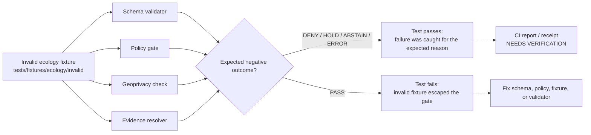

<!-- [KFM_META_BLOCK_V2]
doc_id: kfm://doc/NEEDS-VERIFICATION
title: Ecology Invalid Fixtures
type: standard
version: v1
status: draft
owners: NEEDS_VERIFICATION
created: NEEDS_VERIFICATION_YYYY-MM-DD
updated: NEEDS_VERIFICATION_YYYY-MM-DD
policy_label: NEEDS_VERIFICATION_public_or_restricted
related: [../README.md, ../../README.md, ../../../README.md, ../../../../schemas/README.md, ../../../../policy/README.md, ../../../../tools/validators/README.md]
tags: [kfm, tests, fixtures, ecology, invalid, validation, policy, geoprivacy]
notes: [Target path requested as tests/fixtures/ecology/invalid/README.md; no mounted repository was available in this session, so owners, dates, policy label, adjacent file existence, schema home, validator commands, and fixture inventory remain NEEDS_VERIFICATION.]
[/KFM_META_BLOCK_V2] -->

<a id="top"></a>

# Ecology Invalid Fixtures

Synthetic negative fixtures for ecology-domain validators, policy gates, geoprivacy checks, and evidence-resolution failure cases.

> [!IMPORTANT]
> **Status:** `experimental`  
> **Document status:** `draft`  
> **Owners:** `NEEDS_VERIFICATION`  
> **Path:** `tests/fixtures/ecology/invalid/README.md`  
> **Policy label:** `NEEDS_VERIFICATION_public_or_restricted`  
> 
> 
> 
> 
> 
>   
> **Quick jumps:** [Scope](#scope) · [Repo fit](#repo-fit) · [Inputs](#accepted-inputs) · [Exclusions](#exclusions) · [Fixture rules](#fixture-rules) · [Invalid matrix](#invalid-fixture-matrix) · [Validation](#validation) · [Review gates](#review-gates)

> [!NOTE]
> `ecology` is treated here as an **INFERRED** umbrella fixture lane for habitat/fauna/flora-style biodiversity validation. The actual repo convention for this directory, schema home, validator names, and adjacent README structure remains **NEEDS VERIFICATION** before merge.

---

## Scope

This directory is for **negative test fixtures**: small, synthetic records that should fail a schema, policy, public-safety, evidence-resolution, source-role, rights, taxonomy, or geoprivacy check for a known reason.

These fixtures help prove that KFM fails closed instead of accidentally accepting weak, unsafe, uncited, ambiguous, or policy-forbidden ecology payloads.

They are not examples of production data.

[Back to top](#top)

## Repo fit

| Role | Path or surface | Status |
|---|---|---|
| This README | `tests/fixtures/ecology/invalid/README.md` | **CONFIRMED target path from request** |
| Parent ecology fixtures | `tests/fixtures/ecology/` | **NEEDS VERIFICATION** |
| Valid ecology fixtures | `tests/fixtures/ecology/valid/` | **PROPOSED / NEEDS VERIFICATION** |
| Test root | `tests/` | **NEEDS VERIFICATION** |
| Schema contracts | `schemas/contracts/v1/` or repo-confirmed equivalent | **NEEDS VERIFICATION** |
| Policy gates | `policy/` or repo-confirmed equivalent | **NEEDS VERIFICATION** |
| Validators | `tools/validators/` or repo-confirmed equivalent | **NEEDS VERIFICATION** |

**Upstream dependencies:** schema contracts, policy rules, source-role registry, sensitivity/geoprivacy rules, EvidenceBundle contracts, and validator implementations.

**Downstream consumers:** schema tests, policy negative tests, geoprivacy tests, source-registry tests, EvidenceBundle resolver tests, API/Focus Mode contract tests, and CI smoke checks.

[Back to top](#top)

## Accepted inputs

Use this directory for fixtures that are all of the following:

- **Synthetic:** no real sensitive occurrence coordinates, protected-species locations, steward-only records, unpublished field records, or live source payloads.
- **Small:** enough fields to prove the failure and no more.
- **Deterministic:** stable IDs, timestamps, and hashes where the schema requires them.
- **Single-purpose:** one primary expected failure per fixture whenever possible.
- **Traceable:** the expected failure is clear from the filename, test name, or fixture metadata if the schema permits metadata.
- **Safe to publish in a repository:** invalid does not mean unsafe.

Examples of accepted invalid fixture themes:

| Theme | Fixture intent |
|---|---|
| Missing evidence | A public-facing ecology claim has no resolvable `EvidenceBundle` or `EvidenceRef`. |
| Unknown rights | A source or record requests public release while rights are unknown. |
| Source-role misuse | An occurrence aggregator is treated as legal authority. |
| Sensitive exact geometry | A public payload exposes exact restricted coordinates. |
| Missing redaction receipt | A generalized public geometry lacks a receipt for the transform. |
| Taxonomy ambiguity | An ambiguous taxon match is silently merged instead of held. |
| Focus Mode failure | A model-facing payload includes restricted fields or uncited ecology claims. |

[Back to top](#top)

## Exclusions

Do **not** place these here.

| Excluded material | Where it belongs instead |
|---|---|
| Valid ecology fixtures | `../valid/` or repo-confirmed valid-fixture home |
| Real RAW source snapshots | `data/raw/`, `data/work/`, or `data/quarantine/` under the governed lifecycle |
| Protected or steward-only exact locations | Restricted stores only; never public fixtures |
| Generated validator reports | `build/`, `data/receipts/`, or repo-confirmed report output home |
| Release manifests, proof packs, or catalog outputs | `data/proofs/`, `data/catalog/`, `data/published/`, or repo-confirmed equivalents |
| Live connector outputs | Connector dry-run output or quarantine, never static invalid fixtures |
| Broad malformed blobs with unclear failure reason | Split into focused negative fixtures |

> [!CAUTION]
> A fixture can be invalid without containing real sensitive data. Use sentinel IDs, synthetic geometries, and obviously fake species/source names when the test does not require real-world identity.

[Back to top](#top)

## Expected directory shape

**PROPOSED / NEEDS VERIFICATION:** this tree is a recommended local shape, not a confirmed inventory.

```text
tests/fixtures/ecology/invalid/
├── README.md
├── evidence-ref-missing.invalid.json
├── rights-unknown-publication.invalid.json
├── source-role-unknown.invalid.json
├── source-role-aggregator-as-authority.invalid.json
├── sensitive-exact-public-geometry.invalid.json
├── redaction-receipt-missing.invalid.json
├── taxonomy-ambiguous-merged.invalid.json
└── focus-uncited-species-claim.invalid.json
```

Do not create every example just to match this tree. Add only fixtures that are tied to a schema, validator, policy gate, or regression test.

[Back to top](#top)

## Fixture rules

### Naming

**PROPOSED convention:**

```text
<object-or-surface>.<failure-reason>.invalid.<json|yaml|yml>
```

Examples:

```text
occurrence.sensitive-exact-public.invalid.json
source_descriptor.unknown-rights.invalid.json
focus_payload.uncited-claim.invalid.json
```

### Shape

A good invalid fixture should answer four questions immediately:

| Question | Expected answer |
|---|---|
| What object is being tested? | Schema or policy target, such as source descriptor, occurrence, layer manifest, or Focus payload. |
| Why should it fail? | One specific expected failure. |
| Which validator or policy should catch it? | Repo-confirmed validator, test, or policy gate. |
| Why is it safe to commit? | Synthetic content, no real restricted location, no live source payload. |

### Metadata

When the target schema permits metadata, include expected failure metadata. When it does not, keep the expected failure in the filename and test assertion instead.

```json
{
  "meta": {
    "fixture_kind": "invalid",
    "expected_outcome": "DENY",
    "expected_failure": "restricted_geometry_in_public_payload",
    "synthetic": true
  }
}
```

> [!IMPORTANT]
> Do not add metadata fields to a fixture if the point of the fixture is to validate a strict schema that forbids them. In that case, document the expected failure in the test name or nearby assertion.

[Back to top](#top)

## Invalid fixture matrix

| Fixture class | Expected result | Gate that should catch it | Notes |
|---|---:|---|---|
| Missing `EvidenceRef` or unresolved `EvidenceBundle` | `DENY` or `HOLD` | evidence resolver / schema validator | Public claims must not outrun evidence. |
| Unknown rights with public release intent | `DENY` | source registry / publication policy | Unknown rights block public promotion. |
| Unknown `source_role` used as authority | `DENY` | source-role policy | Source role must be explicit before authority claims. |
| Occurrence aggregator used as legal authority | `DENY` | source authority policy | Aggregators can support occurrence evidence only under their verified role. |
| Exact restricted geometry in public payload | `DENY` | geoprivacy / public-safety validator | No public precise restricted locations. |
| Missing redaction receipt after generalization | `DENY` or `HOLD` | redaction receipt validator | Transform reason and before/after identity must be auditable. |
| Ambiguous taxonomy silently merged | `HOLD` or `ABSTAIN` | taxonomy resolver | Ambiguous matches require obligations, not silent merge. |
| Focus payload includes restricted fields | `DENY` | governed-AI / Focus policy | Model context must be public-safe and evidence-bounded. |
| Uncited species or habitat claim | `ABSTAIN` or `DENY` | citation validator | Cite-or-abstain applies to generated language. |
| Public layer manifest exposes restricted field | `DENY` | layer manifest validator | Tile metadata and field allowlists are part of public safety. |

[Back to top](#top)

## Validation

### Flow



### Local smoke checks

These commands are safe inspection helpers from the repository root.

```bash
find tests/fixtures/ecology/invalid \
  -maxdepth 1 \
  -type f \
  \( -name '*.json' -o -name '*.yaml' -o -name '*.yml' \) \
  -print | sort
```

The actual repo-native validator command is **NEEDS VERIFICATION**.

```text
# NEEDS VERIFICATION — replace with the repo-confirmed test or validator command.
<repo-native invalid-fixture validation command>
```

Expected behavior:

- invalid fixtures are discovered by tests;
- each invalid fixture fails for the expected reason;
- no invalid fixture is accepted as a valid public, policy-safe, or release-ready payload;
- no test requires network access;
- no live connector is invoked.

[Back to top](#top)

## Review gates

Before adding or changing a fixture in this directory, confirm:

- [ ] Fixture is synthetic and safe to commit.
- [ ] Fixture has one primary expected failure.
- [ ] Filename or test name states the failure reason.
- [ ] Expected outcome is one of `DENY`, `HOLD`, `ABSTAIN`, or `ERROR`.
- [ ] No real sensitive exact coordinates are included.
- [ ] No RAW, WORK, QUARANTINE, unpublished, or steward-only payload is copied here.
- [ ] Unknown rights, unknown source roles, and missing evidence are treated as blockers.
- [ ] Redaction/generalization failures include receipt expectations where relevant.
- [ ] Taxonomy ambiguity is not silently merged.
- [ ] Public layer/API/Focus payload fixtures do not expose restricted fields.
- [ ] Parent README or test file documents the repo-native command.
- [ ] Adjacent schema, policy, validator, and test updates are included in the same PR when behavior changes.

[Back to top](#top)

## Definition of done

This README is merge-ready when:

| Gate | Status |
|---|---|
| KFM meta block fields are verified or clearly marked | `NEEDS VERIFICATION` |
| Adjacent README links are verified from this path | `NEEDS VERIFICATION` |
| Owners and policy label are confirmed | `NEEDS VERIFICATION` |
| Invalid fixture inventory matches actual files | `NEEDS VERIFICATION` |
| Repo-native validation command is documented | `NEEDS VERIFICATION` |
| All invalid fixtures fail for expected reasons | `NEEDS VERIFICATION` |
| No fixture contains real sensitive ecology data | `REQUIRED` |

[Back to top](#top)

<details>
<summary>Appendix: fixture design cards</summary>

### Missing evidence

Use when a public ecology claim, popup payload, layer manifest, or Focus response lacks a resolvable `EvidenceRef` or `EvidenceBundle`.

Expected result: `DENY`, `HOLD`, or `ABSTAIN`.

### Unknown rights

Use when a source descriptor, occurrence record, habitat layer, flora/fauna status record, or derived public product requests release while `rights_status` is unknown.

Expected result: `DENY`.

### Sensitive exact public geometry

Use when an output marked public contains precise restricted coordinates, private source geometry, or enough fields to reverse-engineer a protected location.

Expected result: `DENY`.

### Missing redaction receipt

Use when a fixture claims a generalized or redacted public geometry but has no receipt that records transform class, reason, policy version, and before/after identity.

Expected result: `DENY` or `HOLD`.

### Taxonomy ambiguity

Use when multiple taxon mappings are plausible and the fixture wrongly resolves to one canonical identity without obligations, review, or receipt.

Expected result: `HOLD` or `ABSTAIN`.

### Focus Mode unsafe context

Use when model-facing context includes restricted fields, lacks citation support, bypasses EvidenceBundle resolution, or asks the model to infer species presence beyond evidence.

Expected result: `DENY` or `ABSTAIN`.

</details>

[Back to top](#top)
