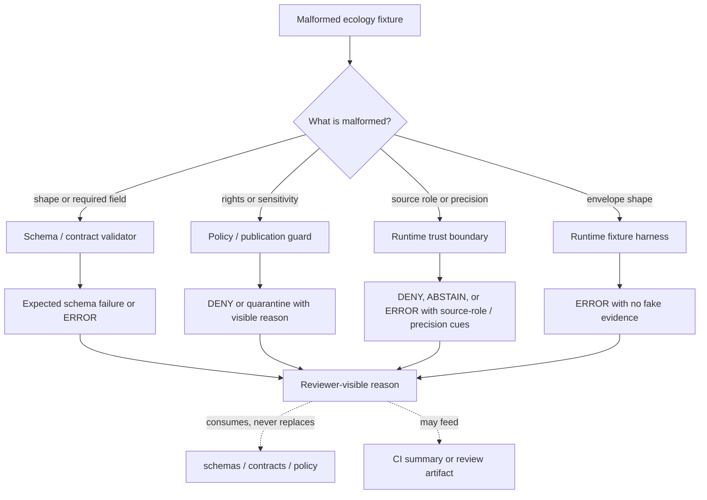

<!-- [KFM_META_BLOCK_V2]
doc_id: kfm://doc/NEEDS_VERIFICATION__ecology_malformed_fixtures_readme
title: Ecology Malformed Fixtures
type: standard
version: v1
status: draft
owners: @bartytime4life
created: NEEDS_VERIFICATION__YYYY-MM-DD
updated: NEEDS_VERIFICATION__YYYY-MM-DD
policy_label: NEEDS_VERIFICATION__public_or_internal
related: [../README.md, ../../README.md, ../../../README.md, ../../../../README.md, ../../../../contracts/README.md, ../../../../schemas/README.md, ../../../../policy/README.md, ../../../../tools/validators/README.md, ../../../../.github/CODEOWNERS]
tags: [kfm, tests, fixtures, ecology, malformed, negative-path, occurrence-evidence]
notes: [Owner is grounded only at the surfaced /tests scope; leaf-specific ownership, doc_id, created date, updated date, policy label, active fixture inventory, runner wiring, and schema authority remain NEEDS VERIFICATION. This README is fixture-facing and does not claim live validators, CI enforcement, source connectors, or publication readiness.]
[/KFM_META_BLOCK_V2] -->

<a id="top"></a>

# Ecology Malformed Fixtures

Small, public-safe negative fixtures for proving that KFM ecology validation fails closed when occurrence, habitat, source-role, rights, sensitivity, taxonomy, or precision support is malformed.

> [!NOTE]
> **Status:** `experimental`  
> **Owners:** `@bartytime4life` *(confirmed only at the surfaced `/tests` scope; leaf-specific ownership remains `NEEDS VERIFICATION`)*  
> **Path:** `tests/fixtures/ecology/malformed/README.md`  
> **Repo fit:** child fixture lane under `tests/fixtures/` for deliberately invalid ecology-support objects; this directory supplies negative examples, not canonical ecology truth  
> **Quick jumps:** [Scope](#scope) · [Repo fit](#repo-fit) · [Accepted inputs](#accepted-inputs) · [Exclusions](#exclusions) · [Directory tree](#directory-tree) · [Quickstart](#quickstart) · [Usage](#usage) · [Malformed taxonomy](#malformed-taxonomy) · [Diagram](#diagram) · [Definition of done](#definition-of-done) · [FAQ](#faq) · [Appendix](#appendix)


> [!IMPORTANT]
> `malformed/` is a **negative-path fixture lane**. A malformed fixture is useful only when it produces a clear expected failure, denial, quarantine, or runtime `ERROR` without inventing evidence or leaking sensitive ecological detail.

> [!WARNING]
> Do not store real exact rare-species coordinates, non-public observation records, provider mirrors, or rights-unclear payloads here. Malformed fixtures should be tiny, synthetic, reviewable, and safe to clone.

---

## Scope

This directory owns intentionally malformed ecology fixtures used to pressure KFM’s fail-closed behavior.

In this README, **ecology** is a cross-domain fixture label covering the seams between:

- occurrence evidence,
- fauna / flora observation support,
- habitat or protected-area context,
- modeled range or derived surfaces,
- taxonomy and accepted-name handling,
- rights, sensitivity, and public precision,
- source-role separation.

It does **not** create a new canonical ecology truth store, and it must not collapse fauna, flora, habitat, modeled context, statutory context, and observed occurrence into one undifferentiated class.

### What this lane should prove

A good malformed ecology fixture proves at least one of these things:

- malformed input fails before publication,
- invalid support does not become an inspectable claim,
- rights or sensitivity defects stay visible,
- missing provenance does not get silently “fixed,”
- source-role flattening is blocked,
- requested precision is not mistaken for served precision,
- validator, runtime, and reviewer-facing outputs use finite and explainable outcomes.

[Back to top](#top)

---

## Repo fit

| Surface | Relationship | Path |
| --- | --- | --- |
| Parent fixture family | broader fixture custody and reviewable test data | [`../../README.md`](../../README.md) |
| Ecology fixture parent | local ecology fixture grouping, if present | [`../README.md`](../README.md) |
| Tests index | verification posture, negative-path conventions, and review boundaries | [`../../../README.md`](../../../README.md) |
| Schemas | source of machine shape authority; this lane consumes schemas | [`../../../../schemas/README.md`](../../../../schemas/README.md) |
| Contracts | source-admission and human-readable contract law | [`../../../../contracts/README.md`](../../../../contracts/README.md) |
| Policy | rights, sensitivity, precision, release, and denial logic | [`../../../../policy/README.md`](../../../../policy/README.md) |
| Validators | expected consumers of malformed fixtures | [`../../../../tools/validators/README.md`](../../../../tools/validators/README.md) |
| CODEOWNERS | owner confirmation surface | [`../../../../.github/CODEOWNERS`](../../../../.github/CODEOWNERS) |

### Upstream / downstream

```text
schemas + contracts + policy
          │
          ▼
tests/fixtures/ecology/malformed
          │
          ├─► schema and validator negative tests
          ├─► runtime ERROR / DENY fixture tests
          ├─► reviewer-summary examples
          └─► CI fail-closed checks, once verified
```

> [!NOTE]
> The links above are repo-relative from this README’s target location. Their existence and exact names still need active-branch verification before merge.

[Back to top](#top)

---

## Accepted inputs

Use this directory for compact malformed objects that are valuable because they are wrong in a precise, reviewable way.

| Input class | Example shape | Expected burden |
| --- | --- | --- |
| Schema-broken occurrence support | missing `object_type`, `schema_version`, `spec_hash`, or required occurrence ID | validator must fail visibly |
| Provenance-incomplete support | missing `source_uri`, `retrieved_at`, `source_record_id`, `source_dataset_id`, or `run_receipt_ref` | no promotion; runtime should not answer as if evidence is complete |
| Rights-malformed support | missing license, contradictory redistribution posture, or unsupported public reuse | `DENY`, quarantine, or explicit fail-closed validation |
| Sensitivity-conflicted support | exact geometry marked public-safe while sensitive-species flags say otherwise | `DENY` or quarantine; no exact public disclosure |
| Taxonomy-malformed support | blank scientific name, missing rank, or hidden unresolved accepted-name status | fail validation or abstain visibly, depending on harness |
| Source-role-flattened support | observed occurrence mixed with modeled range or statutory context under one role | deny or fail validation; no class flattening |
| Precision-mismatched support | requested exact point but served county/grid/withheld precision is not recorded | fail or deny; served precision must stay visible |
| Runtime-wrapper malformed fixture | expected envelope omits `outcome`, `reason.code`, or audit linkage where required | runtime or fixture test should emit `ERROR` |

### Fixture rules

1. Keep every fixture **tiny**.
2. Name every malformed fixture by the reason it is malformed.
3. Prefer synthetic identifiers such as `kfm://fixture/ecology/...`.
4. Include expected failure artifacts only when the active harness requires them.
5. Never use malformed fixtures to encode canonical source law, live provider behavior, or policy authorship.
6. Keep negative outcomes explicit; do not smooth `ERROR`, `DENY`, or `ABSTAIN` into a generic empty state.

[Back to top](#top)

---

## Exclusions

| Does **not** belong here | Put it here instead | Why |
| --- | --- | --- |
| Valid public-safe ecology fixtures | `tests/fixtures/ecology/valid/` or the owning runtime-proof fixture lane | Keep malformed fixtures visibly negative |
| Canonical occurrence schemas | `schemas/` or `schemas/contracts/v1/` | Schema authority must not form inside fixtures |
| Source descriptors for eBird, iNaturalist, KDWP, GBIF, NatureServe, or USFWS | `contracts/source/` or source-registry surfaces | Source admission is upstream law |
| Policy bundles or Rego rules | `policy/` | This lane consumes policy decisions; it does not author them |
| Release manifests, proof packs, signed bundles, STAC/DCAT/PROV records | release, catalog, proof, or promotion surfaces | Publication proof is a different burden |
| Exact sensitive coordinates or steward-only occurrence data | quarantine, restricted, or steward-only data lanes | This public fixture lane must remain safe |
| Large raw provider pulls or scrape caches | governed data lifecycle zones, not test fixtures | Fixtures must stay reviewable and deterministic |
| UI screenshots or rendered map baselines | UI example or Evidence Drawer test lanes | This lane owns malformed input shape, not visual rendering |

[Back to top](#top)

---

## Directory tree

### Current safe claim

`NEEDS VERIFICATION`: active-branch contents for this exact target directory were not directly available in this session. Treat the tree below as the intended, reviewable shape.

```text
tests/fixtures/ecology/malformed/
├── README.md
├── occurrence/
│   ├── missing_required_fields.json
│   ├── missing_provenance.json
│   └── source_role_flattened.json
├── rights/
│   └── redistribution_posture_missing.json
├── sensitivity/
│   └── exact_location_conflicts_with_sensitive_flag.json
├── taxonomy/
│   └── blank_scientific_name.json
├── geometry/
│   └── precision_served_missing.json
└── runtime/
    └── malformed_envelope_missing_reason_code.json
```

### Naming pattern

Prefer this shape:

```text
<malform-family>/<reason>.json
```

Good names are boring and diagnostic:

- `occurrence/missing_provenance.json`
- `sensitivity/exact_location_conflicts_with_sensitive_flag.json`
- `taxonomy/blank_scientific_name.json`
- `runtime/malformed_envelope_missing_reason_code.json`

[Back to top](#top)

---

## Quickstart

There is no confirmed runner for this leaf yet. Use these commands only to inspect the local fixture inventory and keep terminology visible.

```bash
# From repo root.
find tests/fixtures/ecology/malformed -maxdepth 3 -type f | sort
```

```bash
# Inspect whether malformed fixtures preserve the key trust terms.
grep -RIn \
  -e 'object_type' \
  -e 'schema_version' \
  -e 'spec_hash' \
  -e 'source_role' \
  -e 'source_uri' \
  -e 'retrieved_at' \
  -e 'rights' \
  -e 'sensitivity' \
  -e 'precision_served' \
  -e 'expected_outcome' \
  tests/fixtures/ecology/malformed 2>/dev/null || true
```

> [!CAUTION]
> Do not add guessed `pytest`, `pnpm`, `node`, `opa`, `conftest`, or workflow commands here. Once the active branch proves the real validator or CI entrypoint, document that command and the expected negative results in this section.

[Back to top](#top)

---

## Usage

### Add a malformed fixture

1. Identify the exact failure burden: schema, provenance, rights, sensitivity, taxonomy, precision, source-role, or runtime-envelope shape.
2. Choose the smallest fixture family that explains the defect.
3. Use synthetic data.
4. Keep source role explicit when source role is part of the defect.
5. Keep requested precision and served precision separate when geometry is involved.
6. Pair the fixture with an expected failure object only when the owning test harness requires it.
7. Update this README when a new malformed family becomes stable enough to document.

### Review a malformed fixture

A reviewer should be able to answer all of these without opening a provider payload:

- What is intentionally wrong?
- Which validator, contract, policy, or runtime boundary should catch it?
- Is the expected outcome `ERROR`, `DENY`, `ABSTAIN`, or a schema-level failure?
- Does the fixture avoid real sensitive coordinates and real restricted records?
- Does the fixture preserve source-role and precision vocabulary rather than hiding it?
- Is the failure reason visible enough for a future CI summary or Evidence Drawer-adjacent reviewer note?

[Back to top](#top)

---

## Malformed taxonomy

| Malformed family | Typical defect | Preferred expected result | Must not happen |
| --- | --- | --- | --- |
| `occurrence` | required occurrence fields missing or wrong type | schema failure or runtime `ERROR` | runtime `ANSWER` |
| `provenance` | source identity or retrieval fields missing | schema failure, `ABSTAIN`, or `ERROR` | silent provenance repair |
| `rights` | license or redistribution posture missing/contradictory | `DENY` or quarantine | outward reuse without rights cue |
| `sensitivity` | exact sensitive geometry public-marked | `DENY` or quarantine | exact protected detail leaked |
| `taxonomy` | scientific name, rank, or accepted-name status broken | schema failure or explicit insufficiency | invented normalization |
| `geometry` | precision class absent, impossible, or contradictory | `DENY` or `ERROR` | pretending requested precision was served |
| `source_role` | observed, modeled, protected-area, and statutory support flattened | `DENY` or schema failure | source-class collapse |
| `runtime` | envelope lacks outcome/reason/audit shape | runtime `ERROR` or fixture test failure | empty state with no reason |

### Outcome split

| Outcome | Use in this leaf |
| --- | --- |
| `ERROR` | malformed request, malformed fixture, broken envelope, or non-policy technical fault |
| `DENY` | explicit rights, sensitivity, exact-location, or source-role violation blocks outward use |
| `ABSTAIN` | object is structurally readable but support is too incomplete or unresolved to answer |
| `ANSWER` | generally belongs outside this directory, except as a documented control in another valid fixture lane |

> [!IMPORTANT]
> A negative fixture can be a successful test when the system reaches the expected failure state visibly and safely.

[Back to top](#top)

---

## Diagram



[Back to top](#top)

---

## Operating tables

### Trust-visible fields to preserve when relevant

| Field | Why it matters |
| --- | --- |
| `outcome` | keeps finite runtime grammar visible |
| `reason.code` | gives tests and reviewers a stable failure cause |
| `source_ref` | preserves source traceability |
| `source_role` | prevents observation/model/regulation flattening |
| `spec_hash` | supports deterministic identity checks when present |
| `evidence_refs` | prevents fake evidence claims |
| `audit_ref` | joins negative results to review context |
| `rights.status` | makes reuse posture visible |
| `sensitivity.status` | makes geoprivacy and public-safety posture visible |
| `requested_precision` | records what the caller asked for |
| `precision_served` | records what KFM actually served or withheld |
| `generalized` | makes public-safety transforms visible |
| `validation.schema_valid` | prevents malformed objects from being treated as valid support |

### Minimal fixture review matrix

| Check | Required? | Notes |
| --- | ---: | --- |
| Synthetic, public-safe contents | yes | No exact protected locations or restricted source records |
| Defect obvious from filename | yes | Prefer reason-based names |
| Expected failure class documented | yes | Schema failure, `ERROR`, `DENY`, or `ABSTAIN` |
| Source role visible when ecology support is involved | yes | Especially observed vs modeled vs statutory |
| Rights/sensitivity visible when relevant | yes | No decorative metadata |
| No live fetch dependency | yes | Fixtures must be deterministic |
| No proof/catalog/release impersonation | yes | Runtime fixture output is not a proof pack |

[Back to top](#top)

---

## Definition of done

Before merging changes in this directory:

- [ ] The fixture is intentionally malformed for one clearly named reason.
- [ ] The fixture is tiny and synthetic.
- [ ] No exact sensitive location or real restricted record is present.
- [ ] The expected failure class is visible in the filename, neighboring expected artifact, or test name.
- [ ] Source role is not flattened.
- [ ] Requested precision and served precision are not confused.
- [ ] Rights and sensitivity defects fail closed.
- [ ] No fixture is described as canonical source truth.
- [ ] No unverified runner, route, workflow, validator, or schema enforcement is claimed.
- [ ] This README is updated if a new malformed family is introduced.

[Back to top](#top)

---

## FAQ

### Is malformed data allowed in the repo?

Yes, when it is deliberate, synthetic, public-safe, and paired with a clear expected failure burden. Malformed fixtures are part of KFM’s fail-closed verification posture.

### Can this directory contain a passing ecology fixture?

Usually no. Put valid public-safe support in a valid fixture lane or runtime-proof fixture family. Keep this directory focused on negative cases.

### Should malformed fixtures include real provider IDs?

Prefer synthetic IDs. A real provider ID should only appear when the active repo has verified rights, privacy, and fixture policy for that exact use.

### Is `ERROR` always the expected result?

No. A malformed runtime envelope or malformed object may produce `ERROR`, while a rights or sensitivity conflict may produce `DENY`. Structurally readable but underqualified support may produce `ABSTAIN`.

[Back to top](#top)

---

## Appendix

<details>
<summary>Review prompts for maintainers</summary>

Use these prompts during review:

1. Does this fixture prove one negative behavior, or is it trying to be a scenario zoo?
2. Could a future reader mistake this fixture for real ecological evidence?
3. Does the fixture keep occurrence, habitat, modeled range, protected-area context, and statutory context distinct?
4. Is public precision explicit and safe?
5. Is the expected failure useful for a validator, runtime, or reviewer-facing summary?
6. Can this fixture be removed or replaced without breaking source, proof, catalog, or release continuity?

</details>

<details>
<summary>Current verification gaps</summary>

`NEEDS VERIFICATION` before this README is promoted beyond draft:

- active branch contents under `tests/fixtures/ecology/malformed/`,
- exact owner for this leaf,
- exact schema home for ecology / occurrence evidence contracts,
- validator entrypoints and local runner commands,
- whether malformed ecology fixtures are JSON only or may include YAML / JSONL,
- whether expected artifacts use `expected.response.json`, `expected.decision.json`, `expected.envelope.json`, or another convention,
- whether CI publishes negative-fixture summaries,
- policy label for this directory.

</details>

[Back to top](#top)
