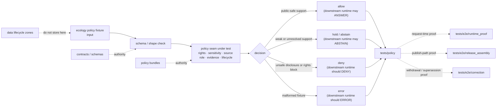

<!-- [KFM_META_BLOCK_V2]
doc_id: kfm://doc/NEEDS_VERIFICATION__tests_fixtures_ecology_policy_readme
title: Ecology Policy Fixtures
type: standard
version: v1
status: draft
owners: NEEDS_VERIFICATION__tests_or_policy_steward
created: NEEDS_VERIFICATION__YYYY-MM-DD
updated: NEEDS_VERIFICATION__YYYY-MM-DD
policy_label: NEEDS_VERIFICATION__public_or_restricted
related: [../../README.md, ../../../README.md, ../../../policy/README.md, ../../../e2e/runtime_proof/README.md, ../../../e2e/release_assembly/README.md, ../../../e2e/correction/README.md, ../../../../policy/README.md, ../../../../schemas/README.md, ../../../../contracts/README.md, ../../../../data/README.md]
tags: [kfm, tests, fixtures, ecology, policy, fauna, flora, habitat, sensitivity, rights]
notes: [Fixture inventory was updated in-session; owner, dates, policy label, and runner wiring still require branch-level verification.]
[/KFM_META_BLOCK_V2] -->

<a id="top"></a>

# Ecology Policy Fixtures

Deterministic, public-safe fixture lane for ecology policy cases that prove rights, sensitivity, source-role, evidence, lifecycle, and public-geometry decisions without becoming ecology truth.

> [!NOTE]
> **Status:** `experimental`  
> **Owners:** `NEEDS_VERIFICATION__tests_or_policy_steward`  
> **Path:** `tests/fixtures/ecology/policy/README.md`  
> **Repo fit:** child fixture README inside the `tests/fixtures/` proof-support surface; this lane feeds policy and runtime/release proof, but does not own policy law, ecology source truth, or release artifacts.  
> **Quick jumps:** [Scope](#scope) · [Repo fit](#repo-fit) · [Accepted inputs](#accepted-inputs) · [Exclusions](#exclusions) · [Directory tree](#directory-tree) · [Quickstart](#quickstart) · [Usage](#usage) · [Diagram](#diagram) · [Operating tables](#operating-tables) · [Task list](#task-list--definition-of-done) · [FAQ](#faq) · [Appendix](#appendix)


> [!IMPORTANT]
> This directory is **fixture-bounded**. It may hold compact allow / hold / deny / error examples for ecology policy pressure, but it must not become a mirror of provider data, a hidden source registry, a second schema home, or an executable policy bundle.

> [!WARNING]
> Do not place real sensitive species coordinates, rare-plant locations, nest/den/roost/hibernacula/spawning locations, steward-controlled occurrence records, restricted provider payloads, credentials, or raw source pulls in this directory.

---

## Scope

`tests/fixtures/ecology/policy/` exists to make ecology policy behavior reviewable with small, deterministic inputs.

In KFM terms, **ecology** here is an umbrella fixture context for fauna, flora, habitat, and habitat-support joins where policy pressure is unusually easy to blur:

- observed occurrence versus modeled range or habitat support
- public-safe generalized geometry versus restricted exact geometry
- source role versus legal or conservation authority
- open, unknown, restricted, or inherited rights
- evidence-backed claims versus evidence-thin context
- fixture proof versus release-grade proof

### Evidence boundary used here

| Evidence layer | What this README treats as settled |
|---|---|
| **CONFIRMED — current session** | The repository is mounted and this fixture lane contains concrete allow/generalize/deny/abstain/error examples; ownership and runner wiring remain unverified. |
| **CONFIRMED — KFM doctrine** | KFM uses an evidence-first, map-first, time-aware, governed posture; lifecycle state and public exposure must remain explicit; sensitive exact locations fail closed. |
| **INFERRED — repo role** | This leaf should behave like a `tests/fixtures/` child surface: compact examples for proof lanes, not canonical ecology data. |
| **PROPOSED — first useful fill** | Add one public-safe allow case, one evidence-thin hold/abstain case, one sensitive-location deny case, one rights-deny case, and one malformed error case. |

[Back to top](#top)

---

## Repo fit

**Path:** `tests/fixtures/ecology/policy/README.md`

| Direction | Surface | Why it matters | Status |
|---|---|---|---|
| Parent fixture surface | [`../../README.md`][tests-fixtures-readme] | Keeps this leaf subordinate to the shared test-fixture boundary. | **NEEDS VERIFICATION** |
| Local ecology fixture parent | [`../README.md`][ecology-fixtures-readme] | Should explain ecology-wide fixture placement if present. | **NEEDS VERIFICATION** |
| Test root | [`../../../README.md`][tests-readme] | Keeps this lane aligned with repo-wide verification posture. | **NEEDS VERIFICATION** |
| Repo-facing policy proof | [`../../../policy/README.md`][tests-policy-readme] | Broader policy behavior should be proven there, not re-owned here. | **NEEDS VERIFICATION** |
| Runtime proof | [`../../../e2e/runtime_proof/README.md`][runtime-proof-readme] | Use when policy fixture outcomes must survive request-time envelopes. | **NEEDS VERIFICATION** |
| Release assembly proof | [`../../../e2e/release_assembly/README.md`][release-assembly-readme] | Use when fixture outcomes affect publishability or release closure. | **NEEDS VERIFICATION** |
| Correction proof | [`../../../e2e/correction/README.md`][correction-readme] | Use when denial, withdrawal, supersession, or stale visibility must be exercised end to end. | **NEEDS VERIFICATION** |
| Policy authority | [`../../../../policy/README.md`][root-policy-readme] | Policy law and bundles belong under the policy surface, not this fixture leaf. | **NEEDS VERIFICATION** |
| Policy fixture sibling | [`../../../../policy/fixtures/README.md`][root-policy-fixtures-readme] | Shared policy examples may live there when they are not ecology-specific. | **NEEDS VERIFICATION** |
| Contract authority | [`../../../../contracts/README.md`][contracts-readme] | Trust-object meaning stays upstream from fixtures. | **NEEDS VERIFICATION** |
| Schema authority | [`../../../../schemas/README.md`][schemas-readme] | Fixture shape should pressure-test schema law, not replace it. | **NEEDS VERIFICATION** |
| Data lifecycle | [`../../../../data/README.md`][data-readme] | RAW / WORK / QUARANTINE / PROCESSED / CATALOG / PUBLISHED artifacts belong in governed data zones. | **NEEDS VERIFICATION** |

### Placement rule

This directory should answer a narrow question:

> “Can ecology policy examples prove safe, explicit decisions for public-safe support, weak evidence, sensitive geometry, restricted rights, and malformed inputs?”

It should not answer broader questions about source admission, release assembly, runtime UI behavior, or correction propagation except by linking to the surfaces that own those burdens.

[Back to top](#top)

---

## Accepted inputs

Content that belongs here is small, deterministic, synthetic or public-safe, and reviewable.

| Input class | What belongs here | Why it belongs |
|---|---|---|
| Public-safe allow examples | Generalized fauna/flora/habitat context with evidence refs and safe precision | Proves policy can allow safe ecology material without leaking sensitive detail. |
| Hold / abstain examples | Missing evidence, unresolved provenance, unresolved review, ambiguous taxon, or uncertain habitat-support context | Proves KFM can refuse overconfident claims without inventing certainty. |
| Deny examples | Exact sensitive location, unknown rights, restricted license, missing redaction receipt, source-role misuse, RAW/WORK/QUARANTINE exposure | Proves fail-closed behavior where publication or runtime disclosure is unsafe. |
| Error examples | Malformed fixture shape, impossible lifecycle state, invalid enum, broken evidence reference shape | Proves technical failures are visible errors, not disguised policy denials. |
| Expected decision sidecars | Small expected-output fixtures tied to the branch’s confirmed decision-envelope or policy-decision shape | Keeps tests reviewable once the exact runner and schema are verified. |
| Case README notes | Short rationale for a fixture family when the policy distinction would otherwise be easy to misread | Helps reviewers understand why a case exists. |

### Good first fixture cases

A minimal honest starter set is:

1. `allow/generalized_public_habitat_support/`
2. `hold/missing_evidence_bundle/`
3. `deny/sensitive_exact_location/`
4. `deny/unknown_or_restricted_rights/`
5. `error/malformed_ecology_policy_input/`

> [!TIP]
> Use synthetic examples unless a source steward explicitly confirms that the fixture is public-safe, redistributable, and non-sensitive. A fixture can be useful without being real provider data.

[Back to top](#top)

---

## Exclusions

| Does **not** belong here | Put it here instead | Why |
|---|---|---|
| Policy bundle source files, rule packs, or Rego modules | [`../../../../policy/README.md`][root-policy-readme] or the repo’s verified policy bundle lane | This leaf consumes policy semantics; it does not author them. |
| Canonical JSON Schema, OpenAPI, vocabularies, or trust-object contracts | [`../../../../schemas/README.md`][schemas-readme] and [`../../../../contracts/README.md`][contracts-readme] | Fixtures must not create a second authority surface. |
| Shared non-ecology policy examples | [`../../../../policy/fixtures/README.md`][root-policy-fixtures-readme] | Keep reusable policy fixtures out of a domain-specific leaf. |
| Repo-wide policy proof | [`../../../policy/README.md`][tests-policy-readme] | This leaf supplies examples; broader proof belongs in the test proof lane. |
| Request-time Focus or API response fixtures | [`../../../e2e/runtime_proof/README.md`][runtime-proof-readme] | Runtime envelope behavior is a separate burden. |
| Release manifests, proof packs, signed artifacts, or publish-path inventories | [`../../../e2e/release_assembly/README.md`][release-assembly-readme] and release-bearing surfaces | Release proof is not a local fixture concern. |
| Withdrawal, supersession, stale-state, or correction drills | [`../../../e2e/correction/README.md`][correction-readme] | Correction lineage deserves an end-to-end proof lane. |
| RAW / WORK / QUARANTINE / PROCESSED / CATALOG / PUBLISHED data | [`../../../../data/README.md`][data-readme] | Lifecycle artifacts belong in governed data zones, not fixture docs. |
| Live connectors, scrapers, watchers, schedulers, or credentials | pipeline/tool/infra surfaces after branch verification | Fixture paths must stay reviewable and offline. |
| Real sensitive coordinates or steward-controlled records | quarantined or steward-only surfaces | Exact ecological location exposure is often the decision this lane must deny. |

[Back to top](#top)

---

## Directory tree

### Current inventory

```text
tests/fixtures/ecology/policy/
├── README.md
├── abstain_unresolved_evidence_bundle.json
├── allow_derived_layer_with_catalog_closure.json
├── allow_public_taxon.json
├── deny_derived_layer_as_confirmed.json
├── deny_sensitive_exact_geometry.json
├── deny_unknown_rights.json
├── deny_unresolved_evidence_bundle.json
├── derived_layer_as_confirmed.policy.json
├── error_malformed_policy_input.json
├── generalize_sensitive_occurrence.json
├── restricted_exact_location_case.json
├── sensitive_exact_public_geometry.policy.json
└── unknown_rights.policy.json
```

### Next executable fill

Keep adding cases in the current flat-file naming convention unless a runner explicitly requires nested lanes.

> [!NOTE]
> The example filenames are placement guidance, not schema law. If the branch already has a fixture naming convention, use that convention and update this tree.

[Back to top](#top)

---

## Quickstart

Run these from the repository root after the branch is mounted.

### 1. Inspect the fixture inventory

```bash
find tests/fixtures/ecology/policy -maxdepth 4 -type f | sort
```

### 2. Syntax-check JSON fixtures, if present

```bash
python - <<'PY'
from pathlib import Path
import json
import sys

root = Path("tests/fixtures/ecology/policy")
json_files = sorted(root.rglob("*.json"))

if not json_files:
    print("No JSON fixtures found under", root)
    sys.exit(0)

failed = False
for path in json_files:
    try:
        json.loads(path.read_text(encoding="utf-8"))
        print("OK", path)
    except Exception as exc:
        failed = True
        print("ERROR", path, exc)

sys.exit(1 if failed else 0)
PY
```

### 3. Run policy tests only after runner wiring is verified

```bash
# NEEDS VERIFICATION:
# Use only if the checked-out branch confirms conftest/OPA or an equivalent runner.
conftest test tests/fixtures/ecology/policy --policy policy
```

> [!CAUTION]
> Do not add a command to this README as a required gate unless the active branch proves the runner, policy path, and expected output shape.

[Back to top](#top)

---

## Usage

### Add a fixture case

1. Start with the policy seam: `rights`, `sensitivity`, `source-role`, `evidence`, `review`, `lifecycle`, `generalization`, `runtime`, `release`, or `correction`.
2. Pick the smallest case that proves the seam.
3. Use synthetic or public-safe records.
4. Include evidence refs only when the referenced fixture or bundle exists.
5. Keep source role, rights status, sensitivity class, precision served, lifecycle state, and review posture visible.
6. Pair each allow case with at least one negative-path case.
7. Route broader proof to `tests/policy/`, `tests/e2e/runtime_proof/`, `tests/e2e/release_assembly/`, or `tests/e2e/correction/` when the fixture affects those surfaces.

### Keep outcome grammar surface-specific

Policy fixtures may pressure multiple outward surfaces. Do not collapse their vocabularies.

| Surface | Expected grammar | Use here |
|---|---|---|
| Local policy or gate decision | `allow` / `hold` / `deny` / `error` or the branch-confirmed equivalent | Use for policy fixture expectations. |
| Runtime / public response | `ANSWER` / `ABSTAIN` / `DENY` / `ERROR` | Use only when linking to runtime-proof expectations. |
| Release state | `PROMOTED` / `BLOCKED` / `REVERTED` or branch-confirmed equivalent | Use only when linking to release-assembly proof. |

> [!IMPORTANT]
> A negative result is not a documentation failure. In KFM, explicit `ABSTAIN`, `DENY`, `HOLD`, or `ERROR` behavior is often the proof that governance is working.

[Back to top](#top)

---

## Diagram



[Back to top](#top)

---

## Operating tables

### Policy seam matrix

| Seam | Fixture should prove | Common deny / hold pressure |
|---|---|---|
| Source role | The fixture names whether a source is observational, modeled, regulatory, steward-reviewed, or corroborative. | Occurrence aggregator used as legal authority; modeled range presented as observed truth. |
| Rights | Rights status is explicit enough for the requested action. | Unknown rights, restricted reuse, missing attribution, inherited license ambiguity. |
| Sensitivity | Exact/internal versus public-safe geometry is visibly separated. | Sensitive exact location, rare/protected taxon, steward-controlled record, reverse-engineering risk. |
| Generalization | Public geometry transform is recorded or required. | Missing redaction/generalization receipt, public payload contains restricted geometry. |
| Evidence | Consequential claims carry evidence refs or fail closed. | Missing `EvidenceBundle`, dangling evidence ref, unsupported claim. |
| Lifecycle | Public fixture expectations do not allow RAW / WORK / QUARANTINE exposure. | Public payload leaks internal lifecycle refs or raw source fields. |
| Review | Review-required cases do not silently publish. | Missing `ReviewRecord`, unresolved steward review, incomplete release scope. |
| Derivation | Habitat assignment or support join remains derived, not canonical truth. | Point-to-raster assignment treated as species preference or occurrence truth. |
| Correction | Denied, withdrawn, or superseded states remain visible when relevant. | Stale or corrected material still appears as current public truth. |

### Starter behavior matrix

| Fixture family | Expected local policy posture | Downstream runtime correspondence | Minimum review burden |
|---|---|---|---|
| `allow/generalized_public_habitat_support/` | Allow public-safe use | `ANSWER` may be valid if evidence is resolved | Source role, public precision, evidence ref, rights status. |
| `hold/missing_evidence_bundle/` | Hold or abstain equivalent | `ABSTAIN` | Reason says evidence is insufficient; no fake precision. |
| `deny/sensitive_exact_location/` | Deny | `DENY` | Reason says exact sensitive location is blocked; obligation requires generalize/withhold/review. |
| `deny/unknown_or_restricted_rights/` | Deny or review-required | `DENY` or `ABSTAIN`, depending on branch grammar | Rights status is explicit; no public release. |
| `error/malformed_ecology_policy_input/` | Error | `ERROR` | Technical failure is not disguised as a policy denial. |

[Back to top](#top)

---

## Task list / Definition of done

Treat this README as healthy only when the lane stays truthful, small, and useful.

- [ ] Meta block placeholders are resolved from branch-backed evidence.
- [ ] The directory tree matches the checked-out branch or is clearly marked as proposed.
- [ ] Every fixture is synthetic, public-safe, or explicitly confirmed redistributable.
- [ ] No fixture contains real sensitive coordinates, restricted occurrence records, credentials, or provider mirrors.
- [ ] Every allow fixture has at least one nearby negative-path fixture.
- [ ] Reason codes and obligation codes come from the branch-confirmed policy vocabulary or are marked illustrative.
- [ ] Fixtures validate against the branch-confirmed schema or contract shape.
- [ ] Policy runner claims match the branch’s actual toolchain.
- [ ] Runtime, release, or correction implications are escalated to the relevant `tests/e2e/` proof lane.
- [ ] Changes to ecology policy fixtures update this README, adjacent fixture indexes, and any test docs that consume the cases.

[Back to top](#top)

---

## FAQ

### Is this directory the ecology policy source of truth?

No. This is a fixture-support lane. Policy law belongs in the policy surface. Schema and contract law belong in schema/contract surfaces. Source truth belongs in governed source and data lifecycle surfaces.

### Can this directory contain real species observations?

Default to **no**.

Use synthetic, generalized, or explicitly public-safe records. Real observations, rare species, exact coordinates, or steward-controlled records belong only in governed lifecycle zones with rights, sensitivity, and review controls.

### Why include deny and error cases?

Because KFM’s trust posture depends on visible negative states. A fixture set that only proves happy-path allowance cannot demonstrate fail-closed ecology policy behavior.

### Does this README prove an active policy runner exists?

No. The runner, toolchain, workflow wiring, and branch protections are **NEEDS VERIFICATION** until inspected in the active branch.

### Should habitat support be treated as species truth?

No. Habitat support and point-to-raster assignment are derived context. They may support a public-safe claim, but they must not silently become canonical truth about species presence or preference.

[Back to top](#top)

---

## Appendix

<details>
<summary><strong>Illustrative fixture envelope — not a committed schema</strong></summary>

The example below shows the kind of information an ecology policy fixture should make visible. It is **illustrative** and should be replaced by the branch-confirmed schema or contract shape before executable use.

```json
{
  "case_id": "deny_sensitive_exact_location.example",
  "status": "illustrative",
  "domain": "ecology",
  "policy_surface": "publication_or_runtime_disclosure",
  "input": {
    "ecology_subdomain": "fauna",
    "source_role": "occurrence_observation",
    "rights_status": "open",
    "sensitivity_class": "protected_species",
    "geometry_precision": "exact_internal",
    "requested_public_precision": "exact",
    "lifecycle_state": "PROCESSED",
    "evidence_bundle_refs": [
      "kfm://evidence/example-public-safe"
    ],
    "review_state": "review_required"
  },
  "expected": {
    "policy_result": "deny",
    "reason_codes": [
      "precise_sensitive_location_denied",
      "review_required"
    ],
    "obligation_codes": [
      "generalize_or_withhold_geometry",
      "record_redaction_receipt"
    ]
  }
}
```

</details>

<details>
<summary><strong>Branch verification checklist</strong></summary>

Before merging this README, inspect and update:

1. Whether `tests/fixtures/ecology/README.md` exists and how it names the ecology fixture family.
2. Whether `tests/fixtures/README.md` already defines naming conventions for valid / invalid / expected fixtures.
3. Whether `tests/policy/README.md` or `policy/tests/README.md` owns the executable policy proof for this lane.
4. Whether the branch has a canonical `PolicyDecision`, `DecisionEnvelope`, `RuntimeResponseEnvelope`, or equivalent schema.
5. Whether the branch uses OPA/Rego, Conftest, Python validators, TypeScript validators, or another runner.
6. Whether reason and obligation vocabularies already exist.
7. Whether `.github/workflows/` contains merge-blocking checks or only documentation.
8. Whether any ecology, fauna, flora, habitat, sensitivity, or rights fixtures already exist under another path and should be linked rather than duplicated.

</details>

<details>
<summary><strong>Suggested first review conversation</strong></summary>

Ask these questions before adding the first fixture set:

- What single policy seam is this fixture trying to prove?
- Is the fixture synthetic or explicitly public-safe?
- Does it pressure ecology-specific risk rather than generic policy behavior?
- What is the expected negative path?
- What adjacent proof lane must consume this fixture?
- Which trust object should the expected result reference?
- What exact data must not appear in the outward fixture?

</details>

[Back to top](#top)

<!-- Reference links -->
[tests-fixtures-readme]: ../../README.md
[ecology-fixtures-readme]: ../README.md
[tests-readme]: ../../../README.md
[tests-policy-readme]: ../../../policy/README.md
[runtime-proof-readme]: ../../../e2e/runtime_proof/README.md
[release-assembly-readme]: ../../../e2e/release_assembly/README.md
[correction-readme]: ../../../e2e/correction/README.md
[root-policy-readme]: ../../../../policy/README.md
[root-policy-fixtures-readme]: ../../../../policy/fixtures/README.md
[contracts-readme]: ../../../../contracts/README.md
[schemas-readme]: ../../../../schemas/README.md
[data-readme]: ../../../../data/README.md
