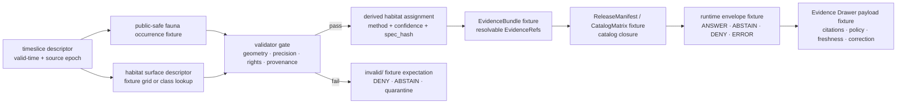

<!-- [KFM_META_BLOCK_V2]
doc_id: kfm://doc/TODO-NEEDS-UUID
title: Ecology Timeslice Fixtures
type: standard
version: v1
status: draft
owners: TODO-NEEDS-OWNER-VERIFICATION
created: TODO-NEEDS-CREATED-DATE
updated: TODO-NEEDS-UPDATED-DATE
policy_label: TODO-NEEDS-POLICY-LABEL
related: [tests/README.md, tests/fixtures/README.md, tests/fixtures/ecology/README.md, schemas/contracts/v1/README.md, policy/README.md, tools/validators/README.md, data/quarantine/README.md, data/receipts/README.md, data/proofs/README.md]
tags: [kfm, tests, fixtures, ecology, timeslice, habitat-fauna, evidence]
notes: [Created from attached KFM Habitat + Fauna, Fauna, documentation, and governed-fixture doctrine because the mounted workspace did not expose this target path; doc_id, owners, dates, policy_label, parent README existence, schema home, and exact test runner remain NEEDS VERIFICATION before merge.]
[/KFM_META_BLOCK_V2] -->

<a id="top"></a>

# Ecology timeslice fixtures

Public-safe fixture lane for time-bounded ecology examples that test evidence-backed habitat/fauna derivation without admitting live, sensitive, or production source data.

> [!IMPORTANT]
> **Status:** experimental  
> **Owners:** `TODO-NEEDS-OWNER-VERIFICATION`  
> **Path:** `tests/fixtures/ecology/timeslice/README.md`  
> **Repo fit:** child fixture lane under [`tests/`](../../../README.md), [`tests/fixtures/`](../../README.md), and [`tests/fixtures/ecology/`](../README.md); supports schema, validator, policy, runtime-proof, and Evidence Drawer tests.  
> **Quick jumps:** [Scope](#scope) · [Repo fit](#repo-fit) · [Accepted inputs](#accepted-inputs) · [Exclusions](#exclusions) · [Directory tree](#directory-tree) · [Quickstart](#quickstart) · [Usage](#usage) · [Fixture invariants](#fixture-invariants) · [Diagram](#diagram) · [Review gates](#review-gates) · [FAQ](#faq) · [Appendix](#appendix)
>
> 
> 
> 
> 
> 

---

## Scope

This directory documents fixture material for **ecology timeslice tests**: small, deterministic, public-safe examples that let validators and runtime-proof tests exercise the KFM trust path without using live source systems.

A timeslice fixture should represent a bounded ecological snapshot, such as:

- one controlled public-safe fauna occurrence;
- one habitat surface descriptor or tiny fixture grid;
- one derived habitat assignment;
- one evidence-backed runtime envelope;
- one Evidence Drawer-compatible payload;
- negative cases for missing precision, provenance, rights, or evidence closure.

**CONFIRMED doctrine:** fixtures in this lane should support the KFM pattern where a fauna occurrence, habitat source, and habitat assignment remain separate object families. The derived join is not canonical truth about species habitat preference.

**PROPOSED local role:** this README treats `tests/fixtures/ecology/timeslice/` as the fixture-side companion to future validator and runtime-proof tests for the Habitat + Fauna thin slice.

[Back to top](#top)

---

## Repo fit

| Relationship | Path from this README | Role |
|---|---:|---|
| Parent test family | [`../../../README.md`](../../../README.md) | Test-suite orientation and ownership conventions. |
| Parent fixture family | [`../../README.md`](../../README.md) | Fixture-wide rules for deterministic, reviewable test material. |
| Parent ecology fixture lane | [`../README.md`](../README.md) | Ecology-domain fixture boundary. |
| Contract/schema context | [`../../../../schemas/contracts/v1/README.md`](../../../../schemas/contracts/v1/README.md) | Expected machine-contract family, if the repo confirms this schema home. |
| Policy context | [`../../../../policy/README.md`](../../../../policy/README.md) | Fail-closed policy expectations for public release, sensitivity, and rights. |
| Validator context | [`../../../../tools/validators/README.md`](../../../../tools/validators/README.md) | Expected validator family for schema, catalog, policy, and evidence closure checks. |
| Downstream fixture sets | `./valid/`, `./invalid/`, `./expected/` | **PROPOSED** local fixture folders; create only after parent fixture conventions are verified. |

> [!NOTE]
> Links above assume the conventional KFM repo layout shown in the attached documentation corpus. Verify parent README paths in the actual checkout before merge.

[Back to top](#top)

---

## Accepted inputs

Only small, deterministic, public-safe fixture files belong here.

| Fixture class | Accepted shape | Why it belongs here |
|---|---|---|
| Timeslice descriptor | `timeslice_descriptor.*.json` | Defines fixture epoch, valid-time window, source epochs, and fixture purpose. |
| Habitat source descriptor | `habitat_surface_descriptor.*.json` | Describes the tiny test habitat surface or fixture grid used by tests. |
| Fauna occurrence fixture | `fauna_occurrence.*.json` | Represents one controlled occurrence with public-safe geometry, precision, source ref, rights posture, and provenance. |
| Habitat assignment fixture | `habitat_assignment.*.json` | Captures the derived point-to-raster or point-to-cell assignment, with method, confidence, and `spec_hash`. |
| Evidence fixture | `evidence_bundle.*.json` | Gives tests resolvable evidence refs without reading production evidence stores. |
| Runtime envelope fixture | `runtime_response_envelope.*.json` | Lets runtime-proof tests assert finite `ANSWER`, `ABSTAIN`, `DENY`, and `ERROR` behavior. |
| Evidence Drawer fixture | `evidence_drawer_payload.*.json` | Lets UI-facing tests assert trust fields: citations, freshness, rights, policy, provenance, review, correction, and release state. |
| Negative fixtures | `*.invalid.json` or files under `invalid/` | Exercise fail-closed cases such as missing precision, missing provenance, unknown rights, or unresolved evidence refs. |

Naming convention is **PROPOSED** until the repo’s fixture naming standard is confirmed:

```text
<fixture-family>.<case>.<status>.json

status := valid | invalid | expected
```

[Back to top](#top)

---

## Exclusions

Do not use this directory as a convenient dump folder.

| Excluded material | Put it elsewhere | Reason |
|---|---|---|
| Live source API responses | `data/raw/**` or source-specific intake fixtures after review | Live payloads may carry rights, freshness, sensitivity, or terms obligations. |
| Full rasters, tiles, COGs, PMTiles, or source archives | `data/raw/**`, `data/processed/**`, or artifact-specific fixture areas | This directory should remain lightweight and test-focused. |
| Rare-species exact locations or sensitive occurrence points | Restricted fixture lane or `data/quarantine/**` after policy review | Public fixture paths must not leak sensitive locations. |
| Production receipts, proofs, manifests, or release bundles | `data/receipts/**`, `data/proofs/**`, `data/published/**` | This folder may include tiny expected-shape fixtures, not live process memory. |
| Secrets, API keys, access tokens, cookies, or credentials | Nowhere in Git | KFM fixture tests must not depend on private credentials. |
| AI-generated unsupported claims | Nowhere as truth | Generated language is never a substitute for EvidenceBundle-backed claims. |

[Back to top](#top)

---

## Directory tree

**PROPOSED tree.** Adjust names only after checking adjacent fixture conventions in the mounted repository.

```text
tests/fixtures/ecology/timeslice/
├── README.md
├── valid/
│   ├── timeslice_descriptor.valid.json
│   ├── habitat_surface_descriptor.valid.json
│   ├── fauna_occurrence_public_safe.valid.json
│   ├── habitat_assignment.valid.json
│   ├── evidence_bundle.valid.json
│   └── release_manifest.valid.json
├── invalid/
│   ├── fauna_occurrence_missing_precision.invalid.json
│   ├── fauna_occurrence_missing_provenance.invalid.json
│   ├── habitat_assignment_unresolved_evidence_ref.invalid.json
│   └── habitat_assignment_unknown_rights.invalid.json
└── expected/
    ├── runtime_answer.expected.json
    ├── runtime_abstain.expected.json
    ├── runtime_deny.expected.json
    ├── runtime_error.expected.json
    └── evidence_drawer_payload.expected.json
```

[Back to top](#top)

---

## Quickstart

These commands are **NEEDS VERIFICATION** because the active checkout, package manager, validator language, and test runner were not visible in the current workspace.

```bash
# From repo root — adapt to the confirmed repo-native validator entry point.
python tools/validators/habitat_fauna/run_all.py \
  --fixtures tests/fixtures/ecology/timeslice
```

```bash
# From repo root — adapt to the confirmed repo-native test runner.
pytest -q \
  tests/habitat_fauna \
  tests/e2e/runtime_proof/habitat_fauna
```

Expected result after the fixture lane is wired:

```text
schema fixtures: pass
source descriptor fixtures: pass
occurrence normalization fixtures: pass
habitat assignment fixtures: pass
catalog/evidence closure fixtures: pass
runtime finite-outcome fixtures: pass
Evidence Drawer payload fixtures: pass
```

[Back to top](#top)

---

## Usage

Use this directory to make trust-path tests boringly repeatable.

1. Start with a `timeslice_descriptor` that says what the fixture epoch represents.
2. Add one public-safe occurrence fixture, not a live source dump.
3. Add one habitat surface descriptor or tiny fixture grid reference.
4. Add one derived habitat assignment that points back to both source families.
5. Add evidence and release references only when they can be resolved by fixture tests.
6. Add negative fixtures beside the positive case so fail-closed behavior is tested as deliberately as success.
7. Change fixture content only with an explanation of expected `spec_hash`, validator, and runtime-outcome effects.

A fixture update should answer this review question:

> Can one public-safe ecology claim be traced from fixture source intake through derivation, evidence closure, runtime envelope, and Evidence Drawer payload without relying on live data?

[Back to top](#top)

---

## Fixture invariants

| Invariant | Fixture rule | Failure mode to test |
|---|---|---|
| Public-safe by default | No rare-species exact locations, private coordinates, secrets, or live third-party payloads. | `DENY` or quarantine expectation. |
| Derived joins are not canonical truth | Habitat assignments must reference occurrence, habitat source, method, and `spec_hash`. | Assignment without evidence refs fails schema or policy. |
| Cite-or-abstain | Every claim-facing fixture must resolve to evidence refs or intentionally return `ABSTAIN`. | Missing evidence produces `ABSTAIN`, not `ANSWER`. |
| Fail closed on precision | Occurrence precision below threshold must not produce a public habitat assignment. | Missing or weak precision produces `DENY` or quarantine expectation. |
| Rights remain explicit | Unknown rights must block publication-shaped fixtures. | Unknown rights produces `DENY` or `HOLD`, never public `ANSWER`. |
| Time is visible | Fixture records must carry observed, source, generated, or published time fields appropriate to their role. | Ambiguous time produces validator failure. |
| Receipts and proofs stay separate | Fixture payloads may reference receipt/proof shapes, but must not flatten process memory into source records. | Embedded proof blobs in source fixture should fail review. |

[Back to top](#top)

---

## Diagram



[Back to top](#top)

---

## Review gates

Use this checklist when adding or revising files in this folder.

- [ ] Meta block remains present and placeholders are either verified or still clearly labeled.
- [ ] Fixture files are small, deterministic, and public-safe.
- [ ] No live API payloads, secrets, source credentials, or production artifacts were added.
- [ ] Positive fixtures have paired negative fixtures for fail-closed behavior.
- [ ] Occurrence fixtures include precision, provenance, source refs, and rights posture.
- [ ] Habitat assignment fixtures remain derived artifacts, not canonical species-habitat truth.
- [ ] Evidence refs resolve inside fixture tests or deliberately drive `ABSTAIN`.
- [ ] Runtime fixture outcomes are finite: `ANSWER`, `ABSTAIN`, `DENY`, or `ERROR`.
- [ ] Evidence Drawer fixtures expose citation, freshness, policy, rights, provenance, publication, correction, and rollback fields.
- [ ] Any fixture content change is accompanied by test updates and an expected `spec_hash` or fixture-version explanation.

[Back to top](#top)

---

## FAQ

### Is this directory for real ecology data?

No. It is for controlled fixture material. Real source material belongs in governed lifecycle paths and must pass source, rights, sensitivity, provenance, and promotion gates.

### Can a fixture mention NLCD, GBIF, eBird, iNaturalist, KDWP, USFWS, or NatureServe?

Yes, as a source descriptor or illustrative reference when the fixture is public-safe and rights-aware. Do not copy live or sensitive payloads here unless a steward explicitly approves the fixture and the license/sensitivity posture is recorded.

### Is a habitat assignment a claim that the species prefers that habitat?

No. In this fixture lane, a habitat assignment means only that a public-safe occurrence geometry was sampled against a stated habitat surface under a stated method and source epoch.

### Should invalid fixtures be deleted after validators pass?

No. Invalid fixtures are proof that fail-closed behavior is tested. Keep them visible and labeled.

[Back to top](#top)

---

## Appendix

<details>
<summary>Illustrative timeslice descriptor skeleton</summary>

This is illustrative only. Confirm exact schema names and required fields before committing fixture JSON.

```json
{
  "version": "v1",
  "timeslice_id": "ecology-timeslice-fixture-001",
  "description": "Public-safe fixture timeslice for one fauna occurrence and one habitat assignment.",
  "valid_time": {
    "start": "2021-01-01",
    "end": "2021-12-31"
  },
  "source_epochs": [
    {
      "source_id": "fixture-habitat-surface",
      "epoch": "2021"
    },
    {
      "source_id": "fixture-fauna-occurrence-public-safe",
      "epoch": "fixture"
    }
  ],
  "policy_posture": "public_safe_fixture_only",
  "notes": [
    "Illustrative skeleton; schema home and exact fields remain NEEDS VERIFICATION."
  ]
}
```

</details>

<details>
<summary>Illustrative habitat assignment skeleton</summary>

```json
{
  "version": "v1",
  "assignment_id": "habitat-assignment-fixture-001",
  "occurrence_ref": "fauna-occurrence-fixture-001",
  "habitat_surface_ref": "habitat-surface-fixture-001",
  "method": "point_to_raster_sample",
  "class_code": "71",
  "class_label": "Grassland/Herbaceous",
  "confidence": "fixture_controlled",
  "generated_at": "TODO-NEEDS-FIXTURE-TIMESTAMP",
  "spec_hash": "TODO-NEEDS-DETERMINISTIC-SPEC-HASH",
  "evidence_refs": [
    "evidence-bundle-fixture-001"
  ],
  "policy_status": {
    "public_release_allowed": true,
    "reason": "controlled public-safe fixture"
  }
}
```

</details>

<details>
<summary>Maintainer notes</summary>

- Treat this README as a fixture contract until executable tests prove the directory.
- Keep synthetic and controlled fixture material visibly separate from source-derived material.
- Prefer small, named fixture cases over one large all-purpose JSON blob.
- When the actual repo is mounted, verify parent README links, owner coverage, policy label, schema home, and validator commands before merge.

</details>

[Back to top](#top)
