<!-- [KFM_META_BLOCK_V2]
doc_id: kfm://doc/NEEDS_VERIFICATION__ecology_timeslice_pass_fixtures_readme
title: Ecology Timeslice Pass Fixtures
type: standard
version: v1
status: draft
owners: NEEDS_VERIFICATION__tests_owner
created: 2026-04-29
updated: 2026-04-29
policy_label: NEEDS_VERIFICATION__public_or_internal
related: [../README.md, ../fail/README.md, ../../README.md, ../../../README.md, ../../../../README.md, ../../../../../contracts/README.md, ../../../../../schemas/README.md, ../../../../../policy/README.md, ../../../../../tools/validators/README.md, ../../../../../.github/workflows/README.md]
tags: [kfm, tests, fixtures, ecology, timeslice, pass]
notes: [Generated for tests/fixtures/ecology/timeslice/pass/README.md. Exact leaf ownership, active fixture inventory, schema home, validator command, workflow coverage, and policy label remain NEEDS VERIFICATION in a mounted checkout.]
[/KFM_META_BLOCK_V2] -->

<a id="top"></a>

# Ecology Timeslice Pass Fixtures

Public-safe passing fixture lane for **ecology time-slice** examples that should validate cleanly without becoming source truth, publication truth, or sensitive-location disclosure.

> [!NOTE]
> **Status:** `experimental`  
> **Owners:** `NEEDS_VERIFICATION__tests_owner`  
> **Path:** `tests/fixtures/ecology/timeslice/pass/README.md`  
> **Repo fit:** child fixture README for positive ecology time-slice examples inside the broader `tests/fixtures/` verification boundary  
> **Quick jumps:** [Scope](#scope) · [Repo fit](#repo-fit) · [Accepted inputs](#accepted-inputs) · [Exclusions](#exclusions) · [Directory tree](#directory-tree) · [Quickstart](#quickstart) · [Usage](#usage) · [Diagram](#diagram) · [Operating tables](#operating-tables) · [Task list](#task-list--definition-of-done) · [FAQ](#faq) · [Appendix](#appendix)


> [!IMPORTANT]
> `pass/` means **positive validator examples**. It does **not** mean a public release was promoted, a species observation is authoritative, a model is endorsed, or a promotion gate emitted `PASS`.

> [!WARNING]
> Ecology fixtures can carry precision and sensitivity risk. Do not place exact sensitive species locations, steward-restricted records, private-land details, embargoed observations, or rights-unclear source payloads in this directory.

---

## Scope

This directory is for small, deterministic ecology time-slice fixtures that are expected to pass the repo’s ecology time-slice validation once the active schema and validator surfaces are verified.

Use this lane to prove that KFM can recognize a valid, reviewable, public-safe ecology time-slice object with:

- explicit temporal scope, such as `valid_time`, `as_of`, or equivalent repo-native fields;
- spatial scope and precision posture, especially when a generalized or redacted location is served;
- source role, knowledge character, and evidence references;
- sensitivity and policy labels that keep publication risk visible;
- no live API dependency and no hidden source harvesting;
- stable fixture bytes suitable for repeatable tests.

### What this README does not prove

| Claim | Status |
|---|---|
| The active branch already has this exact leaf inventory | **NEEDS VERIFICATION** |
| A repo-native ecology time-slice schema exists at a specific path | **UNKNOWN** |
| The validator command is already wired into CI | **UNKNOWN** |
| Leaf-level ownership is narrower than the broader tests owner | **NEEDS VERIFICATION** |
| Passing fixtures are published KFM claims | **False boundary — never infer this from `pass/`** |

[Back to top](#top)

---

## Repo fit

This is a **fixture lane**, not a source lane, policy lane, schema lane, or release lane.

| Relationship | Expected path | Role |
|---|---|---|
| Parent time-slice fixture lane | [`../README.md`](../README.md) | Owns shared rules for ecology time-slice fixtures. |
| Negative-path sibling | [`../fail/README.md`](../fail/README.md) | Holds invalid, denied, malformed, or unsafe examples. |
| Ecology fixture family | [`../../README.md`](../../README.md) | Owns ecology fixture-family conventions. |
| Fixture root | [`../../../README.md`](../../../README.md) | Owns repo-wide fixture posture and safe test-data rules. |
| Test root | [`../../../../README.md`](../../../../README.md) | Owns broader test strategy. |
| Contract meaning | [`../../../../../contracts/README.md`](../../../../../contracts/README.md) | Owns human-readable contract semantics. |
| Machine schema authority | [`../../../../../schemas/README.md`](../../../../../schemas/README.md) | Owns executable schema placement once verified. |
| Policy authority | [`../../../../../policy/README.md`](../../../../../policy/README.md) | Owns deny/restrict/generalize/publication logic. |
| Validator implementation | [`../../../../../tools/validators/README.md`](../../../../../tools/validators/README.md) | Owns executable validation helpers. |
| Workflow orchestration | [`../../../../../.github/workflows/README.md`](../../../../../.github/workflows/README.md) | Owns CI wiring and merge gates. |

> [!NOTE]
> Relative links above are intentionally repo-shaped. Verify them in the mounted checkout before merge; do not silently convert broken links into implied implementation claims.

[Back to top](#top)

---

## Accepted inputs

Content here should be **tiny**, **repeatable**, **public-safe**, and **expected to validate**.

### Typical accepted inputs

- Valid ecology time-slice JSON fixtures.
- Synthetic or generalized occurrence-context examples.
- Public-safe habitat, protected-area, range, or ecological-context slices.
- Fixtures with explicit source-role and knowledge-character fields.
- Fixtures that reference evidence by stable IDs or mock refs, without embedding sensitive source payloads.
- Expected validator pass metadata, if the parent fixture lane already uses that pattern.
- Small README-local examples that clarify fixture posture.

### Accepted input profile

| Input family | Typical shape | Keep it here when |
|---|---|---|
| Time-slice object | `*.json` | The object is expected to pass the repo-native ecology time-slice validator. |
| Public-safe ecological context | generalized habitat or protected-area context | Precision, source role, and sensitivity status are visible. |
| Evidence refs | `kfm://evidence/...` or repo-native mock refs | They support traceability without embedding restricted evidence. |
| Policy labels | `public`, `restricted`, `generalized`, or repo-native equivalents | The fixture proves policy posture is present, not that policy is authored here. |
| Expected pass hints | `expected.*.json` only if parent lanes use that convention | The fixture needs a stable expected validator outcome. |
| Minimal synthetic values | small hand-authored records | The fixture avoids live-source mirroring and remains easy to review. |

### Minimum review burden for a passing ecology time-slice fixture

| Burden | Why it matters |
|---|---|
| Temporal scope | Ecology claims change meaning across season, year, observation window, and source update date. |
| Spatial support and precision served | A valid fixture must not imply exactness when only generalized support is safe or justified. |
| Source role | Occurrence evidence, habitat models, status lists, and protected-area context are not interchangeable. |
| Knowledge character | Observed, modeled, interpreted, statutory, and contextual fields must not collapse into one “fact.” |
| Sensitivity posture | At-risk species and steward-controlled records require default caution. |
| Evidence linkage | A fixture is more useful when downstream tests can resolve or mock `EvidenceRef` / `EvidenceBundle` behavior. |
| Policy label | Public use must remain visibly policy-aware, even in tests. |

[Back to top](#top)

---

## Exclusions

| Does **not** belong here | Put it here instead | Why |
|---|---|---|
| Invalid or intentionally unsafe fixtures | [`../fail/`](../fail/) | Keep positive and negative cases visually separate. |
| Live source downloads, provider mirrors, or harvested records | governed `data/raw/`, `data/work/`, or pipeline fixtures once verified | Test fixtures must not become source storage. |
| Exact sensitive species locations | restricted/quarantine data lanes or steward-reviewed fixtures outside public clone surfaces | Public test fixtures must not create geoprivacy harm. |
| Canonical ecology schemas | [`../../../../../schemas/`](../../../../../schemas/) or the repo-native schema home | Fixture lanes validate schema behavior; they do not own schema meaning. |
| Human-readable contract authority | [`../../../../../contracts/`](../../../../../contracts/) | Contracts define semantics; fixtures demonstrate examples. |
| Policy bundles or policy decisions | [`../../../../../policy/`](../../../../../policy/) | Tests may assert policy-visible fields, but policy remains centralized. |
| Validator implementation code | [`../../../../../tools/validators/`](../../../../../tools/validators/) | This lane holds inputs, not validator logic. |
| Runtime API payload choreography | `tests/e2e/` or a repo-native runtime-proof lane | `pass/` is schema/fixture-facing, not full runtime proof. |
| Release manifests, receipts, proofs, or promotion records | governed `data/receipts/`, `data/proofs/`, `data/catalog/`, or `release/` homes once verified | Passing validation is not publication. |
| UI drawer snapshots or MapLibre styling | UI/e2e fixture lanes once verified | Rendering examples are downstream of validated fixture meaning. |

[Back to top](#top)

---

## Directory tree

### Expected local shape

```text
tests/fixtures/ecology/timeslice/
├── README.md                  # parent time-slice fixture rules — NEEDS VERIFICATION
├── pass/
│   ├── README.md              # this file
│   └── *.json                 # valid public-safe examples — inventory NEEDS VERIFICATION
└── fail/
    ├── README.md              # negative-path sibling — NEEDS VERIFICATION
    └── *.json                 # invalid / unsafe / denied examples
```

### File naming guidance

Use names that explain the validation behavior without encoding source secrets.

| Pattern | Example | Notes |
|---|---|---|
| `public_safe_<topic>.json` | `public_safe_habitat_context.json` | Use for generalized, public-safe context slices. |
| `generalized_<topic>.json` | `generalized_occurrence_context.json` | Use where exact location is intentionally not served. |
| `<source_role>_<topic>.json` | `contextual_protected_area_slice.json` | Useful when source role is the test focus. |
| `expected.<purpose>.json` | `expected.validation.json` | Use only if the parent lane already supports expected-output fixtures. |

> [!IMPORTANT]
> Do not add a fixture file merely because a provider record exists. Add it only when it proves a stable contract, validator, policy, or downstream handoff behavior.

[Back to top](#top)

---

## Quickstart

Use this as a safe first local check from the repository root.

```bash
# JSON parse check only.
# This does not replace schema, policy, or validator coverage.

python - <<'PY'
from pathlib import Path
import json
import sys

root = Path("tests/fixtures/ecology/timeslice/pass")

if not root.exists():
    print(f"NEEDS VERIFICATION: fixture path is missing: {root}")
    sys.exit(1)

files = sorted(root.glob("*.json"))

if not files:
    print(f"NEEDS VERIFICATION: no JSON fixtures found under {root}")
    sys.exit(0)

for fixture in files:
    with fixture.open("r", encoding="utf-8") as handle:
        json.load(handle)
    print(f"ok: {fixture}")

print(f"parsed {len(files)} fixture(s)")
PY
```

For schema validation, use the repo-native command declared by the parent fixture lane or validator README once confirmed.

```bash
# NEEDS VERIFICATION: example shape only.
# Replace with the actual repo-native validator command before relying on this in CI.

python -m tools.validators.validate_ecology_timeslice \
  --fixtures tests/fixtures/ecology/timeslice/pass \
  --expect pass
```

[Back to top](#top)

---

## Usage

### Add a passing fixture

1. Confirm the fixture belongs in `pass/`, not `fail/`.
2. Confirm it is public-safe, synthetic, generalized, or otherwise cleared for checked-in test use.
3. Confirm temporal scope and spatial precision are visible.
4. Confirm source role and knowledge character are not ambiguous.
5. Confirm evidence and policy references use repo-native mock or stable IDs.
6. Run JSON parse, schema validation, and any ecology time-slice validator.
7. Update this README only when adding a new fixture class, naming rule, or exclusion.

### Review a passing fixture

A reviewer should be able to answer these questions without opening source systems:

| Review question | Expected answer |
|---|---|
| What time window does this represent? | The fixture states it directly. |
| What spatial support is being served? | The fixture states precision, support, or generalization. |
| What kind of ecology knowledge is represented? | Observed, modeled, statutory, contextual, or interpreted status is explicit. |
| Is sensitive precision exposed? | No, or the fixture is not eligible for this lane. |
| Does this fixture claim publication? | No. It is a test input only. |
| What validator behavior does it prove? | The file name, comments in parent docs, or expected output make that legible. |

[Back to top](#top)

---

## Diagram

```mermaid
flowchart LR
    SRC[Ecology source systems<br/>observations, models, status lists] -. not stored here .-> LIFE[RAW → WORK / QUARANTINE → PROCESSED]
    LIFE -. candidate shaping outside this lane .-> TS[Ecology time-slice fixture]
    TS --> PASS[tests/fixtures/ecology/timeslice/pass/*.json]
    PASS --> VAL[Schema / fixture validator<br/>NEEDS VERIFICATION]
    VAL --> OK[Expected result:<br/>validator accepts fixture]
    PASS --> MOCK[EvidenceRef / policy label / sensitivity posture]
    OK --> TESTS[Repo tests and reviewer checks]
    TESTS -. does not publish .-> PUB[PUBLISHED]
    PASS -. invalid or unsafe cases belong in .-> FAIL[../fail/]
    FAIL --> VAL

    classDef blocked fill:#fff3cd,stroke:#d29922,color:#24292f;
    class PUB blocked;
```



The key boundary is deliberate: **passing fixture validation is not publication**.

[Back to top](#top)

---

## Operating tables

### Truth labels used here

| Label | Meaning in this README |
|---|---|
| **CONFIRMED** | Supported by current KFM doctrine, current-session workspace inspection, or directly surfaced repo-facing documentation patterns. |
| **INFERRED** | Strongly implied by target path and adjacent KFM fixture conventions, but not directly verified for this exact leaf. |
| **PROPOSED** | Recommended pattern for this fixture lane, pending branch verification. |
| **UNKNOWN** | Not verifiable without a mounted checkout, active schema registry, validator code, workflow YAML, or fixture inventory. |
| **NEEDS VERIFICATION** | A concrete branch-level check must be performed before merge or CI reliance. |

### Fixture class matrix

| Fixture class | Belongs in `pass/`? | Conditions |
|---|---:|---|
| Generalized habitat context slice | Yes | Public-safe, time-scoped, source-role labeled. |
| Protected-area context slice | Yes | Contextual only; not treated as occurrence proof. |
| Steward-reviewed public occurrence summary | Conditional | Only if generalized and rights/sensitivity labels are explicit. |
| Exact at-risk species coordinate | No | Use restricted/quarantine lanes; do not check into public fixtures. |
| Missing evidence reference | No | Put in `../fail/` if the purpose is negative-path validation. |
| Malformed temporal window | No | Put in `../fail/`. |
| Live provider response body | No | Use governed source/lifecycle lanes, not this test fixture directory. |
| Model output without knowledge-character label | No | Put in `../fail/` or repair the fixture before adding. |

### Boundary map

| This lane may prove | This lane must not own |
|---|---|
| A valid public-safe fixture shape | Ecology source truth |
| Positive schema or validator behavior | Policy semantics |
| Stable examples for tests | Live source ingestion |
| Time, space, role, sensitivity visibility | Release approval |
| Cross-lane references to evidence and policy | EvidenceBundle authority |
| Repeatable no-network fixture checks | UI, AI, or MapLibre runtime behavior |

[Back to top](#top)

---

## Task list / definition of done

Use this checklist before adding or changing files in this directory.

- [ ] **Path verified:** `tests/fixtures/ecology/timeslice/pass/` exists in the mounted checkout.
- [ ] **Owner verified:** leaf owner or inherited tests owner is confirmed from repo evidence.
- [ ] **Parent docs checked:** parent and sibling READMEs are opened before editing.
- [ ] **Fixture is public-safe:** no exact sensitive species locations, private records, or restricted steward payloads.
- [ ] **No provider mirror:** fixture is tiny, deterministic, and not a cached source response dump.
- [ ] **Temporal scope present:** valid time, as-of time, or repo-native equivalent is explicit.
- [ ] **Spatial precision visible:** CRS/support/precision/generalization is explicit where relevant.
- [ ] **Source role present:** occurrence, model, status, protected-area, or contextual role is not implied by prose alone.
- [ ] **Knowledge character present:** observed, modeled, statutory, contextual, or interpreted status is explicit.
- [ ] **Evidence linkage present:** EvidenceRef, mock ref, or repo-native evidence handle is inspectable.
- [ ] **Policy posture present:** public/restricted/generalized/sensitivity posture is visible.
- [ ] **Positive-path only:** invalid, unsafe, denied, or malformed fixtures are moved to `../fail/`.
- [ ] **No network required:** validation can run without live API calls.
- [ ] **Validator command verified:** README examples match actual repo-native validator behavior before CI reliance.
- [ ] **Links verified:** relative links resolve from this README location.
- [ ] **No publication claim:** no fixture language implies promotion, release, or authoritative ecology truth.

[Back to top](#top)

---

## FAQ

### Does `pass/` mean this fixture is a published KFM claim?

No. `pass/` only means the fixture is expected to satisfy the relevant validator. Publication remains a governed release transition with evidence, policy, review, manifest, proof, and rollback requirements.

### Can a passing ecology fixture include exact coordinates?

Only when the repo’s sensitivity policy, owner review, and source rights explicitly allow it. For this public-safe lane, prefer generalized or synthetic geometry. Exact sensitive locations should not be checked into this directory.

### Where do invalid examples go?

Use [`../fail/`](../fail/). Keep `pass/` visually clean so reviewers can trust that every fixture here is intended to validate.

### Can this directory contain real source responses?

No. Real source data belongs in governed lifecycle lanes. If a real source response is needed for a test, use a tiny, rights-reviewed, redacted, deterministic fixture and document why it is safe.

### What if the schema home changes?

Update the parent fixture README, this README’s related links, and any validator command examples. Do not duplicate schema authority inside fixture docs.

### Should this README define final JSON keys?

Not unless the active schema, fixtures, or validator code prove them. This README can define minimum review burdens and illustrative shapes, but it must not smuggle placeholder fields into implementation fact.

[Back to top](#top)

---

## Appendix

<details>
<summary><strong>Illustrative fixture card — not a schema</strong></summary>

The following shape is an example of the kind of information a passing ecology time-slice fixture should make visible. It is **illustrative only** until the repo’s actual schema home and field names are verified.

```json
{
  "fixture_kind": "ecology_timeslice",
  "fixture_status": "pass",
  "time": {
    "valid_time": {
      "start": "2026-04-01",
      "end": "2026-04-30"
    },
    "as_of": "2026-04-29"
  },
  "space": {
    "scope_label": "generalized Kansas ecology test area",
    "precision_served": "generalized",
    "crs": "NEEDS_VERIFICATION"
  },
  "ecology": {
    "knowledge_character": "contextual",
    "source_role": "protected_area_context",
    "sensitivity": "public_safe"
  },
  "evidence": {
    "evidence_refs": [
      "kfm://evidence/NEEDS_VERIFICATION"
    ]
  },
  "policy": {
    "policy_label": "NEEDS_VERIFICATION__public_or_restricted"
  }
}
```

</details>

<details>
<summary><strong>Branch verification prompts</strong></summary>

Before this README is treated as complete, verify:

1. Does `tests/fixtures/ecology/timeslice/pass/` already contain fixture files?
2. Is there a parent `tests/fixtures/ecology/timeslice/README.md`?
3. Is there a sibling `fail/` lane?
4. What schema validates ecology time-slice fixtures?
5. What validator command is intended to run in CI?
6. Does the repo use `expected.*.json` files in fixture directories?
7. Which owner or CODEOWNERS rule covers this leaf?
8. Are ecology fixture policy labels public, internal, restricted, or mixed?
9. Are sensitive ecology precision rules already expressed in policy?
10. Should this lane link to an EvidenceBundle fixture family or keep refs mocked?

</details>

<details>
<summary><strong>Change discipline</strong></summary>

Small, reversible changes are preferred.

When adding a fixture, update this README only if the change affects:

- accepted fixture classes;
- excluded material;
- naming rules;
- validation commands;
- sensitivity posture;
- relative links;
- the definition-of-done checklist.

Do not rewrite this file merely to make the directory look more mature than the fixtures, schemas, policies, or tests prove.

</details>

[Back to top](#top)
