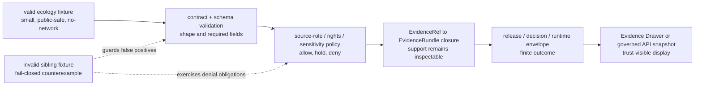

<!-- [KFM_META_BLOCK_V2]
doc_id: kfm://doc/NEEDS_VERIFICATION__uuid_for_tests_fixtures_ecology_valid_readme
title: Ecology Valid Fixtures
type: standard
version: v1
status: draft
owners: NEEDS_VERIFICATION__team_or_codeowners
created: NEEDS_VERIFICATION__YYYY-MM-DD
updated: NEEDS_VERIFICATION__YYYY-MM-DD
policy_label: NEEDS_VERIFICATION__public_or_restricted
related: [../README.md, ../invalid/README.md, ../../README.md, ../../../README.md, ../../../../schemas/contracts/v1/README.md, ../../../../policy/README.md, ../../../../tools/validators/ecology/README.md]
tags: [kfm, tests, fixtures, ecology, valid, habitat, fauna, evidence]
notes: [Generated as a fixture-facing README for tests/fixtures/ecology/valid. Verify owner, dates, policy label, related paths, validator commands, and actual fixture inventory in the mounted repository before merge.]
[/KFM_META_BLOCK_V2] -->

<a id="top"></a>

# Ecology Valid Fixtures

Deterministic, public-safe positive fixtures for ecology-shaped KFM validation without admitting live biodiversity sources or turning examples into publication authority.


| Impact field | Value |
| --- | --- |
| **Status** | `experimental` |
| **Owners** | `NEEDS_VERIFICATION__team_or_codeowners` |
| **Path** | `tests/fixtures/ecology/valid/` |
| **Fixture role** | Positive, schema-valid, public-safe ecology examples |
| **Primary users** | Validator authors, policy reviewers, fixture maintainers, API/UI proof-lane reviewers |
| **Quick jumps** | [Scope](#scope) · [Repo fit](#repo-fit) · [Accepted inputs](#accepted-inputs) · [Exclusions](#exclusions) · [Directory tree](#directory-tree) · [Quickstart](#quickstart) · [Usage](#usage) · [Diagram](#diagram) · [Operating tables](#operating-tables) · [Definition of done](#definition-of-done) · [FAQ](#faq) · [Appendix](#appendix) |

> [!IMPORTANT]
> This directory is a **fixture lane**, not a source registry, canonical ecology store, release bundle, or proof of public publication. A fixture may demonstrate an allowed shape only when evidence, source role, rights, sensitivity, review, and release-state fields stay visible.

> [!WARNING]
> Do not place live rare-species records, exact sensitive locations, unverified third-party occurrence data, source credentials, RAW/WORK/QUARANTINE artifacts, or broad provider mirrors in this folder.

---

## Scope

`tests/fixtures/ecology/valid/` holds small examples that should pass the relevant ecology validators once the active branch confirms the schema, policy, and validator homes.

This README uses **ecology** as a fixture grouping for habitat/fauna/flora-adjacent proof work. It does **not** rename or collapse the project’s habitat, fauna, flora, biodiversity, source, evidence, policy, or release object families.

A valid fixture here should help prove one narrow thing:

> A public-safe ecology claim can be reconstructed from source identity, admissible evidence, policy posture, review/release state, and a finite runtime outcome without touching live source systems.

### What “valid” means here

| Validity layer | Meaning | Does **not** mean |
| --- | --- | --- |
| Schema-valid | The fixture conforms to the confirmed machine schema. | The object is published or production-ready. |
| Policy-visible | Rights, sensitivity, source role, review, and release posture are represented. | Policy has approved public release. |
| Evidence-linked | EvidenceRefs and/or EvidenceBundle refs are present where required. | Every EvidenceRef is currently resolvable in this branch without validator confirmation. |
| Public-safe | The example avoids restricted precision and sensitive exact geometry. | Live biodiversity data may be copied in. |
| No-network | Tests can run from checked-in fixtures. | The fixture mirrors or refreshes a provider dataset. |

↩ [Back to top](#top)

---

## Repo fit

This directory sits inside the `tests/fixtures/` verification boundary. It should pressure-test object shape and policy expectations; it should not become a parallel contract, policy, source, or publication authority.

| Relationship | Candidate path | Status | Role |
| --- | --- | --- | --- |
| Parent ecology fixture README | [`../README.md`](../README.md) | `NEEDS VERIFICATION` | Explains ecology fixture family scope. |
| Sibling invalid ecology fixtures | [`../invalid/README.md`](../invalid/README.md) | `NEEDS VERIFICATION` | Holds malformed or fail-closed counterexamples. |
| Fixture root | [`../../README.md`](../../README.md) | `NEEDS VERIFICATION` | Explains repo-wide fixture conventions. |
| Test root | [`../../../README.md`](../../../README.md) | `NEEDS VERIFICATION` | Explains test execution and ownership. |
| Schema contract lane | [`../../../../schemas/contracts/v1/README.md`](../../../../schemas/contracts/v1/README.md) | `NEEDS VERIFICATION` | Owns executable schema shape once confirmed. |
| Policy lane | [`../../../../policy/README.md`](../../../../policy/README.md) | `NEEDS VERIFICATION` | Owns allowed/denied behavior, obligations, sensitivity, and rights gates. |
| Ecology validators | [`../../../../tools/validators/ecology/README.md`](../../../../tools/validators/ecology/README.md) | `PROPOSED / NEEDS VERIFICATION` | Runs no-network checks against these examples. |
| Runtime proof fixtures | [`../../../e2e/runtime_proof/fauna/README.md`](../../../e2e/runtime_proof/fauna/README.md) | `PROPOSED / NEEDS VERIFICATION` | Downstream route/envelope/drawer proof lane if present. |

> [!TIP]
> Keep the split visible: **fixtures prove success and failure recognition**, contracts define meaning, schemas validate shape, policy decides admissibility, receipts record process memory, proofs support release, and UI/API surfaces consume governed outputs.

↩ [Back to top](#top)

---

## Accepted inputs

Content that belongs here should stay **tiny**, **explicit**, **public-safe**, and easy to review in a pull request.

| Input class | Example names | Why it belongs here |
| --- | --- | --- |
| Habitat source descriptor fixture | `source_descriptor.nlcd_2021_kansas.valid.json` | Exercises an ecology source descriptor without redistributing a full upstream raster. |
| Controlled occurrence fixture | `occurrence.public_safe.valid.json` | Provides one synthetic or controlled public-safe occurrence for deterministic validation. |
| Habitat surface fixture | `habitat_surface.nlcd_2021_kansas.valid.json` | Carries class system, epoch, resolution, source refs, and content identity. |
| Derived assignment fixture | `habitat_assignment.public_safe.valid.json` | Shows point-to-raster or point-to-class derivation as a derived artifact, not sovereign truth. |
| EvidenceBundle fixture | `evidence_bundle.public_safe.valid.json` | Proves that evidence support remains visible and linkable. |
| ReleaseManifest fixture | `release_manifest.public_safe.valid.json` | Demonstrates release-state fields without claiming an actual release occurred. |
| Runtime envelope fixture | `runtime_response.answer.valid.json` | Shows finite `ANSWER` behavior when public-safe evidence resolves. |
| Evidence Drawer payload fixture | `evidence_drawer.answer.valid.json` | Ensures UI trust payloads contain claim, source, evidence, policy, rights, freshness, and correction state. |
| Schema-valid negative-outcome envelope | `runtime_response.deny_sensitive.valid.json` | Allowed only if this directory means “schema-valid”; move elsewhere if repo convention uses `valid/` strictly for allow cases. |

### Input rules

1. Keep each fixture small enough to inspect manually.
2. Use controlled or synthetic occurrence examples unless source rights and sensitivity are explicitly verified.
3. Preserve `source_role`; do not flatten observed occurrence, modeled habitat, protected-area context, and statutory context into one class.
4. Include rights and sensitivity posture even for synthetic examples.
5. Include temporal fields such as `observed_at`, `source_temporal_extent`, `habitat_epoch`, `generated_at`, or `published_at` when the object family requires them.
6. Include evidence references and policy/review/release state where downstream claims depend on them.
7. Treat derived joins as derived outputs. Do not store “species habitat truth” as a fixture assertion.
8. Do not use this directory to prove live connector availability.

↩ [Back to top](#top)

---

## Exclusions

| Does **not** belong here | Put it here instead | Why |
| --- | --- | --- |
| RAW provider downloads, rasters, or occurrence dumps | `data/raw/...` or source-ingest fixtures after repo policy confirms | This directory is not a mirror of NLCD, GBIF, eBird, iNaturalist, KDWP, NatureServe, USFWS, or any other provider. |
| WORK or QUARANTINE artifacts | `data/work/...` or `data/quarantine/...` | Public fixture lanes must not normalize around unreviewed or blocked material. |
| Canonical schemas | `schemas/contracts/v1/...` | Fixtures test schema law; they do not define it. |
| Semantic contract docs | `contracts/...` or confirmed docs home | This README is operational guidance, not the authoritative object contract. |
| Policy source files | `policy/...` | Policy owns admissibility, denial, obligations, rights, and sensitivity logic. |
| Live source credentials or API keys | Never commit; use approved secret handling | Secrets are not fixtures. |
| Exact sensitive species locations | Controlled-access lane or generalized/redacted fixture with transform receipt | KFM fails closed on precision-sensitive ecology data. |
| Production release bundles, proofs, or receipts | `data/proofs/...`, `data/receipts/...`, `release/...` after repo confirmation | Proof objects and receipts are emitted artifacts, not local examples unless explicitly fixture-scoped. |
| UI screenshots or rendered maps | UI test fixtures or docs assets after confirmation | This lane tests data/contract shape, not renderer output. |
| AI-generated species claims | Governed AI test lane after EvidenceBundle and policy checks | AI is interpretive only and cannot act as root truth. |

↩ [Back to top](#top)

---

## Directory tree

The exact inventory is `NEEDS VERIFICATION` until inspected in the mounted repository. The shape below is the recommended minimal fixture set for a Habitat + Fauna ecology proof lane.

```text
tests/fixtures/ecology/valid/
├── README.md
├── source_descriptor.nlcd_2021_kansas.valid.json
├── source_descriptor.controlled_occurrence.valid.json
├── habitat_surface.nlcd_2021_kansas.valid.json
├── occurrence.public_safe.valid.json
├── habitat_assignment.public_safe.valid.json
├── evidence_bundle.public_safe.valid.json
├── release_manifest.public_safe.valid.json
├── runtime_response.answer.valid.json
└── evidence_drawer.answer.valid.json
```

Optional schema-valid finite-outcome examples, if repo convention allows `valid/` to mean “schema-valid” rather than “allowed answer”:

```text
tests/fixtures/ecology/valid/
├── runtime_response.abstain_missing_evidence.valid.json
├── runtime_response.deny_sensitive_without_generalization.valid.json
└── runtime_response.error_malformed_support_object.valid.json
```

> [!NOTE]
> Pair every positive fixture family with an invalid or fail-closed counterpart under `../invalid/` once that sibling path exists. A test suite that only proves `ANSWER` can pass is too weak for KFM.

↩ [Back to top](#top)

---

## Quickstart

### Safe inspection

```bash
# List this fixture leaf exactly as the checked-out branch exposes it.
find tests/fixtures/ecology/valid -maxdepth 2 -type f | sort
```

### JSON sanity check

```bash
# Parse local JSON fixtures without contacting any network service.
python - <<'PY'
from pathlib import Path
import json

root = Path("tests/fixtures/ecology/valid")

if not root.exists():
    raise SystemExit(f"missing fixture directory: {root}")

for path in sorted(root.glob("*.json")):
    json.loads(path.read_text(encoding="utf-8"))
    print(f"ok {path}")
PY
```

### Proposed validator command

```bash
# PROPOSED / NEEDS VERIFICATION:
# Confirm the validator path and flags in the mounted repo before making this command normative.
python tools/validators/ecology/run_all.py \
  --valid tests/fixtures/ecology/valid \
  --no-network
```

Expected validator posture:

| Result | Meaning |
| --- | --- |
| `PASS` | Fixture shape and policy-visible fields satisfy the confirmed validator. |
| `HOLD` | Fixture is structurally close but needs review, owner, rights, schema-home, or policy clarification. |
| `DENY` | Fixture would create a public-safety, rights, source-role, or sensitivity violation. |
| `ERROR` | Validator or fixture parse failure; do not fabricate an answer. |

↩ [Back to top](#top)

---

## Usage

### Add a valid ecology fixture

1. Choose the object family: source descriptor, occurrence, habitat surface, assignment, EvidenceBundle, ReleaseManifest, runtime envelope, or drawer payload.
2. Confirm the upstream contract and schema home.
3. Keep the example synthetic or controlled unless source rights and sensitivity are verified.
4. Include source role, rights, sensitivity, temporal scope, evidence refs, and review/release posture.
5. Add or update the matching invalid fixture under `../invalid/`.
6. Run no-network validation.
7. Update this README, the parent README, and any manifest or case index required by the repo.

### Review a valid fixture

Ask these questions before accepting the file:

- Does the fixture avoid live sensitive biodiversity data?
- Does it preserve the distinction between source evidence, derived assignment, publication state, and runtime response?
- Does it include source identity and source role?
- Does it make rights and sensitivity visible?
- Does it include temporal and spatial scope appropriate to the object family?
- Does it avoid RAW/WORK/QUARANTINE paths?
- Does it have a fail-closed sibling case?
- Does it support EvidenceRef → EvidenceBundle inspection where required?

↩ [Back to top](#top)

---

## Diagram



↩ [Back to top](#top)

---

## Operating tables

### Minimum burden matrix

| Burden | This directory should prove | This directory should not pretend |
| --- | --- | --- |
| Source identity | Source IDs, source roles, citation labels, rights posture, and content identity are present. | The source is live, reachable, current, or fully admitted. |
| Geometry safety | Public-safe geometry, precision bucket, or generalized geometry flags are visible. | Exact sensitive locations are okay because the fixture is “just a test.” |
| Habitat context | Habitat class codes, labels, epoch, classification system, and source refs are explicit. | A land-cover class proves species habitat preference. |
| Occurrence context | Controlled occurrence support has time, taxon label, precision, source refs, and sensitivity status. | One occurrence proves abundance, range, population, or regulatory status. |
| Derived assignment | Join method, parameters, generated time, confidence/support, and `spec_hash` or equivalent identity are visible. | The derived join becomes canonical truth. |
| Evidence support | EvidenceBundle or evidence refs are present and resolvable by the validator. | A UI label or map popup is evidence by itself. |
| Runtime behavior | Finite outcomes remain visible: `ANSWER`, `ABSTAIN`, `DENY`, `ERROR`. | `DENY` and `ABSTAIN` are failures by default. |
| Publication state | Release, review, correction, rollback, and freshness fields are present where required. | Valid fixture equals approved public release. |

### Candidate first fixtures

| Candidate fixture | Status | Why it is useful |
| --- | --- | --- |
| Minimal valid NLCD 2021 Kansas source descriptor | `PROPOSED` | Anchors habitat context without full raster redistribution. |
| Minimal valid controlled occurrence | `PROPOSED` | Keeps first slice public-safe and deterministic. |
| Minimal valid habitat assignment | `PROPOSED` | Shows the join as reproducible derived output. |
| Minimal valid EvidenceBundle | `PROPOSED` | Proves evidence support is not hidden in prose. |
| Minimal valid ReleaseManifest | `PROPOSED` | Keeps promotion/release state visible. |
| Minimal valid runtime `ANSWER` envelope | `PROPOSED` | Provides positive outward behavior without live API implementation claims. |
| Minimal valid Evidence Drawer payload | `PROPOSED` | Makes trust state visible at UI boundary. |
| Schema-valid `DENY` or `ABSTAIN` envelope | `CONDITIONAL` | Useful only if branch convention treats `valid/` as schema-valid rather than allowed-public-answer. |

### Field families worth watching

These are review prompts, not a replacement for schema law.

| Family | Watch for |
| --- | --- |
| Identity | `id`, `source_id`, `occurrence_id`, `assignment_id`, `release_id`, `spec_hash`, schema version |
| Source role | `source_role`, authority scope, publisher, citation, access class |
| Rights | license, rights status, terms status, attribution, redistribution eligibility |
| Sensitivity | sensitivity class, geoprivacy status, generalized geometry flag, redaction or transform refs |
| Time | observed time, source epoch, generated time, published time, valid time, retrieval time |
| Space | CRS, geometry type, public-safe geometry summary, precision bucket, support geometry |
| Evidence | evidence refs, bundle refs, source refs, checksums, catalog refs |
| Policy | outcome, reason codes, obligations, policy label, review state |
| Release | promotion state, release manifest ref, correction notice ref, rollback ref |

↩ [Back to top](#top)

---

## Definition of done

A change to this directory is ready for review when:

- [ ] Branch inspection confirms this path and its parent/sibling README conventions.
- [ ] Owners are confirmed through the repo’s ownership mechanism.
- [ ] All JSON fixtures parse locally without network access.
- [ ] Valid fixtures pass the confirmed schema validator.
- [ ] Valid fixtures include required source role, rights, sensitivity, temporal, spatial, and evidence fields.
- [ ] No fixture reads, names, embeds, or depends on RAW, WORK, QUARANTINE, source APIs, or secrets.
- [ ] Every new positive fixture has a negative or fail-closed sibling case.
- [ ] Public-safe geometry is explicit; sensitive exact geometry is absent.
- [ ] Evidence refs resolve or are explicitly marked as validator-blocking `NEEDS VERIFICATION`.
- [ ] `ANSWER`, `ABSTAIN`, `DENY`, and `ERROR` behavior remains finite and visible where runtime fixtures are present.
- [ ] Documentation is updated when fixture meaning or validator behavior changes.
- [ ] Rollback is simple: remove the fixture and its paired invalid case; no data migration or public release change is required.

↩ [Back to top](#top)

---

## FAQ

### Does “valid” mean “published”?

No. `valid/` means the fixture is expected to pass the relevant shape and policy-visible checks. Publication requires a separate promotion path, release state, evidence closure, proof objects, and review.

### Can live occurrence records be added here?

No. Use controlled or synthetic public-safe examples first. Live GBIF, eBird, iNaturalist, KDWP, NatureServe, USFWS, or other occurrence sources require rights, sensitivity, precision, source-role, and publication review before any connector or public fixture admission.

### Can this folder contain a `DENY` fixture?

Conditionally. If repo convention means “schema-valid,” then a valid `DENY` envelope can belong here because fail-closed outcomes are valid runtime behavior. If repo convention means “allowed-public-answer,” put `DENY`, `ABSTAIN`, and `ERROR` examples in a runtime proof lane or sibling fixture set instead.

### Does this README define the ecology schema?

No. This README explains fixture usage only. Schema authority belongs to the confirmed schema home; policy authority belongs to policy files; source admission belongs to the source registry or contract surface.

### Why is the habitat assignment treated as derived?

Because the habitat source, occurrence, and assignment have different evidence and update lifecycles. A point sampled against a land-cover class is useful context, not canonical truth about the species, population, or habitat preference.

↩ [Back to top](#top)

---

## Appendix

<details>
<summary>Illustrative fixture header pattern</summary>

The structure below is illustrative only. Reconcile field names with the mounted branch’s schema before committing.

```json
{
  "schema_version": "NEEDS_VERIFICATION",
  "fixture_id": "ecology.valid.public_safe_occurrence_habitat_assignment.001",
  "fixture_kind": "habitat_assignment",
  "status": "valid",
  "source_refs": [
    "kfm://source/usgs_nlcd_2021_kansas",
    "kfm://source/controlled_occurrence_fixture"
  ],
  "source_roles": [
    "habitat_context",
    "observed_occurrence_fixture"
  ],
  "rights_status": "public_safe_fixture",
  "sensitivity_status": "non_sensitive_public_safe",
  "evidence_refs": [
    "kfm://evidence/ecology/public_safe_assignment_001"
  ],
  "policy_label": "NEEDS_VERIFICATION",
  "review_state": "fixture_only",
  "release_state": "not_published",
  "notes": [
    "Illustrative example. Do not treat as schema law.",
    "No live source connector or publication state is implied."
  ]
}
```

</details>

<details>
<summary>Review labels used in this README</summary>

| Label | Meaning |
| --- | --- |
| `CONFIRMED` | Verified from mounted repo evidence or current-session inspection. |
| `PROPOSED` | Recommended fixture, validator, path, or behavior not yet verified in the repo. |
| `NEEDS VERIFICATION` | Check the mounted branch, owner, schema, policy, command, or source rights before relying on it. |
| `CONDITIONAL` | Acceptable only if the repo’s local convention supports it. |
| `UNKNOWN` | Not knowable from this README or currently visible evidence. |

</details>

↩ [Back to top](#top)
