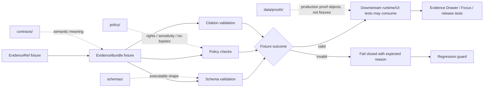

<!-- [KFM_META_BLOCK_V2]
doc_id: kfm://doc/NEEDS_VERIFICATION__tests_fixtures_evidence_readme
title: Evidence Fixtures
type: standard
version: v1
status: draft
owners: NEEDS_VERIFICATION__fixture_owners
created: 2026-04-27
updated: 2026-04-27
policy_label: NEEDS_VERIFICATION__public_or_restricted
related: [../../README.md, ../README.md, ../../../contracts/README.md, ../../../schemas/README.md, ../../../policy/README.md, ../../../data/proofs/README.md, ../../../data/receipts/README.md]
tags: [kfm, tests, fixtures, evidence, evidence-ref, evidence-bundle, validation]
notes: [Drafted from attached KFM doctrine and fixture/readme patterns. Active-branch path, owners, policy label, schema home, validator command, and fixture inventory remain NEEDS VERIFICATION before merge.]
[/KFM_META_BLOCK_V2] -->

<a id="top"></a>

# Evidence Fixtures

Deterministic, public-safe fixtures for proving that KFM evidence objects resolve, validate, fail closed, and stay inspectable.

| Field | Value |
| --- | --- |
| **Status** | `experimental` |
| **Owners** | `NEEDS_VERIFICATION__fixture_owners` |
| **Path** | `tests/fixtures/evidence/README.md` |
| **Repo fit** | Child fixture lane for `EvidenceRef`, `EvidenceBundle`, citation validation, and evidence-closure examples used by validators, policy tests, runtime proof tests, and documentation examples. |
| **Badges** |      |
| **Quick jumps** | [Scope](#scope) · [Repo fit](#repo-fit) · [Accepted inputs](#accepted-inputs) · [Exclusions](#exclusions) · [Directory tree](#directory-tree) · [Quickstart](#quickstart) · [Usage](#usage) · [Diagram](#diagram) · [Fixture matrix](#fixture-matrix) · [Task list](#task-list--definition-of-done) · [FAQ](#faq) · [Appendix](#appendix) |

> [!IMPORTANT]
> This directory is a **fixture surface**, not a production evidence store. Fixtures here must be small, deterministic, reviewable, and safe to clone. They may model sensitive or denied conditions only through synthetic or redacted examples.

> [!WARNING]
> **NEEDS VERIFICATION:** This README is written for the requested path. Before merge, verify the active checkout’s actual fixture homes, schema authority, validator commands, `CODEOWNERS`, and any existing sibling directory such as `tests/fixtures/evidence-bundle/`.

---

## Scope

`tests/fixtures/evidence/` exists to help maintainers test the KFM evidence contract without depending on live data, private records, unpublished stores, or external services.

This lane should make the following questions easy to answer:

| Question | Expected answer from this lane |
| --- | --- |
| Can an `EvidenceRef` resolve to a policy-safe `EvidenceBundle`? | Valid fixtures prove the happy path; invalid fixtures prove unresolved or malformed refs fail. |
| Can unsupported claims be detected? | Citation-validation fixtures include supported and unsupported claim examples. |
| Can evidence closure be checked without live services? | Fixtures use stable local files, hashes, and synthetic refs only. |
| Can denied or redacted cases be tested visibly? | Negative fixtures model missing provenance, restricted rights, sensitivity, and unredacted geometry failures. |
| Can downstream UI/API tests reuse evidence examples? | Yes, but runtime envelopes and drawer payloads should keep their own fixture homes unless this repo’s convention says otherwise. |

[Back to top](#top)

---

## Repo fit

### This path

```text
tests/fixtures/evidence/
```

### Upstream surfaces

These paths are expected neighbors for this fixture lane. Verify them in the active branch before relying on the links.

| Surface | Relationship | Status |
| --- | --- | --- |
| [`../../README.md`](../../README.md) | Parent `tests/` boundary and repo-wide test posture. | NEEDS VERIFICATION |
| [`../README.md`](../README.md) | Parent fixture taxonomy and ownership rules. | NEEDS VERIFICATION |
| [`../../../contracts/README.md`](../../../contracts/README.md) | Semantic contract authority for object meaning. | NEEDS VERIFICATION |
| [`../../../schemas/README.md`](../../../schemas/README.md) | Executable schema authority, if this repo uses `schemas/` as canonical. | NEEDS VERIFICATION |
| [`../../../schemas/contracts/v1/evidence/evidence_bundle.schema.json`](../../../schemas/contracts/v1/evidence/evidence_bundle.schema.json) | Expected schema target for `EvidenceBundle`, pending schema-home ADR and branch inspection. | PROPOSED / NEEDS VERIFICATION |
| [`../../../policy/README.md`](../../../policy/README.md) | Policy authority for rights, sensitivity, publication, and no-bypass rules. | NEEDS VERIFICATION |
| [`../../../tools/validators/README.md`](../../../tools/validators/README.md) | Validator entrypoint index, if present. | NEEDS VERIFICATION |

### Downstream consumers

| Consumer | How it may use these fixtures | Boundary rule |
| --- | --- | --- |
| Validator tests | Validate `EvidenceRef`, `EvidenceBundle`, citation reports, and closure examples. | Tests must not call live services. |
| Policy tests | Assert fail-closed behavior for missing source role, rights, review state, sensitivity, or release context. | Policy remains in `policy/`, not here. |
| Runtime proof tests | Reuse an evidence fixture as input to an `ANSWER`, `ABSTAIN`, `DENY`, or `ERROR` scenario. | Runtime envelopes stay in runtime/e2e fixture lanes. |
| Evidence Drawer tests | Confirm the drawer can display claim support, caveats, source roles, review state, and correction lineage. | Drawer payload contracts stay in UI/runtime contract lanes. |
| Documentation examples | Show small, stable evidence examples in README/runbook prose. | Examples must remain visibly illustrative unless validated by schema. |

[Back to top](#top)

---

## Accepted inputs

Use this directory for tiny fixtures that exercise evidence behavior.

| Fixture family | Belongs here | Notes |
| --- | --- | --- |
| `EvidenceRef` examples | Stable refs, malformed refs, unresolved refs, superseded refs. | Use deterministic local IDs; avoid live resolver dependencies. |
| `EvidenceBundle` examples | Minimal public-safe bundles, multi-source support bundles, redacted bundles, invalid bundles. | Include rights, sensitivity, source role, temporal scope, review/release posture when the schema requires them. |
| Citation-validation examples | Claim-to-evidence mappings, unsupported-claim failures, missing-citation failures. | Keep claims short and fixture-specific. |
| Evidence closure examples | Small proof-closure bundles that connect refs, source descriptors, release refs, and validation reports. | Do not store production proof packs here. |
| Negative-path fixtures | Missing ref, missing source role, missing rights, stale release, unredacted sensitive geometry, malformed hash. | Negative paths are first-class in KFM. |
| Golden snippets | Small expected JSON fragments or reviewable summaries used by tests. | Prefer exact fields over broad prose snapshots. |

### Input rules

1. Prefer synthetic, public-safe fixtures.
2. Prefer deterministic local refs over live service calls.
3. Keep fixture files small enough to review in a pull request.
4. Include both valid and invalid examples for each object family.
5. Preserve the upstream object shape; do not simplify fields just to make tests easier.
6. Do not encode actual sensitive locations, living-person data, DNA-derived information, protected archaeology, rare-species exact coordinates, critical infrastructure details, secrets, tokens, or rights-unclear source payloads.
7. Mark illustrative examples as illustrative if they are not schema-validated.

[Back to top](#top)

---

## Exclusions

| Does **not** belong here | Put it here instead | Why |
| --- | --- | --- |
| Production `EvidenceBundle` objects | `data/proofs/` or release/proof object homes | Fixtures are not release-grade proof stores. |
| Process receipts such as `run_receipt` or `ai_receipt` | `data/receipts/` fixtures or receipt fixture lanes | Receipts are process memory, not evidence fixtures. |
| Raw source payloads | `data/raw/`, `data/work/`, or source-specific test fixtures | This lane validates evidence contracts, not source mirroring. |
| Unpublished candidate evidence | `data/work/` or `data/quarantine/` with governed access | Public test fixtures must not expose candidate stores. |
| Source descriptors | `tests/fixtures/source/` or source-descriptor fixture lanes | Source admission has its own contract surface. |
| Runtime response envelopes | `tests/fixtures/runtime/` or `tests/e2e/runtime_proof/` | Runtime outcomes are downstream of evidence resolution. |
| Evidence Drawer payload fixtures | UI/runtime fixture lanes, unless this repo explicitly centralizes them here | Drawer payloads are shell-facing views over evidence, not evidence itself. |
| Policy code or policy decisions as canonical truth | `policy/` and policy-specific fixtures | Tests may assert policy outcomes; policy authority stays separate. |
| Large tiles, COGs, PMTiles, GeoParquet, shapefiles, images, or archives | Published/release artifact fixtures or generated artifact lanes | Large geospatial artifacts make fixture review brittle. |
| Secrets, credentials, live API keys, private tokens | Nowhere in the repository | These must never enter fixtures. |

[Back to top](#top)

---

## Directory tree

> [!NOTE]
> This is a **proposed target shape**, not a verified active-branch inventory.

```text
tests/fixtures/evidence/
├── README.md
├── evidence_ref/
│   ├── stable_ref.valid.json
│   ├── unresolved_ref.invalid.json
│   └── superseded_ref.invalid.json
├── evidence_bundle/
│   ├── minimal_public_safe.valid.json
│   ├── multi_source_reviewed.valid.json
│   ├── missing_ref.invalid.json
│   ├── missing_source_role.invalid.json
│   ├── restricted_rights.invalid.json
│   └── unredacted_sensitive_geometry.invalid.json
├── citation_validation/
│   ├── all_claims_supported.valid.json
│   ├── unsupported_claim.invalid.json
│   └── missing_citation.invalid.json
└── proof_closure/
    ├── complete_release_support.valid.json
    ├── missing_catalog_ref.invalid.json
    └── stale_release_ref.invalid.json
```

### Naming convention

| Suffix | Meaning |
| --- | --- |
| `.valid.json` | Expected to pass schema and lane-specific validation. |
| `.invalid.json` | Expected to fail deterministically. |
| `.expected.json` | Expected output from a validator or report generator. |
| `.notes.md` | Human-readable fixture explanation; keep short and non-authoritative. |

[Back to top](#top)

---

## Quickstart

Use the repo-native validator once the active checkout confirms the schema and tool paths.

```text
# PSEUDOCODE — replace after validator inventory
<repo-validator> \
  --schema schemas/contracts/v1/evidence/evidence_bundle.schema.json \
  --fixtures tests/fixtures/evidence \
  --no-network
```

Before relying on any command in this README:

1. Verify the canonical schema home.
2. Verify the validator entrypoint.
3. Verify whether `tests/fixtures/evidence/` or another sibling path is the repo’s canonical evidence-fixture home.
4. Confirm invalid fixtures fail for the expected reason, not because of unrelated path or schema drift.

[Back to top](#top)

---

## Usage

### When adding a fixture

1. Pick the narrowest fixture family.
2. Name the file with a readable scenario and `.valid.json` or `.invalid.json`.
3. Keep the object synthetic and public-safe.
4. Include only fields supported by the active schema.
5. Add a paired negative fixture when the object introduces a new validation rule.
6. Update this README’s tree or matrix.
7. Run the repo-native schema, policy, and no-network checks.

### When reusing a fixture downstream

Downstream tests may reference these fixtures, but should not mutate them or silently reinterpret their meaning.

| Downstream test | Good reuse | Bad reuse |
| --- | --- | --- |
| Runtime proof | Load `minimal_public_safe.valid.json` as resolved evidence context. | Treat the evidence fixture as a complete runtime response. |
| Evidence Drawer | Assert that source role, caveats, and review state are displayable. | Invent drawer-only fields inside the evidence fixture. |
| Policy gate | Verify restricted rights or sensitive geometry fail closed. | Move policy logic into fixture JSON. |
| Documentation | Show a tiny validated example. | Present a synthetic fixture as real evidence. |

[Back to top](#top)

---

## Diagram



[Back to top](#top)

---

## Fixture matrix

| Family | Required posture | Example pass case | Example fail case |
| --- | --- | --- | --- |
| `EvidenceRef` | Stable, resolvable, scoped, and not a raw store path. | `stable_ref.valid.json` | `unresolved_ref.invalid.json` |
| `EvidenceBundle` | Policy-safe resolved evidence payload with source role, scope, review/release posture, and evidence refs. | `minimal_public_safe.valid.json` | `missing_source_role.invalid.json` |
| Citation validation | Every consequential claim maps to admissible evidence or fails. | `all_claims_supported.valid.json` | `unsupported_claim.invalid.json` |
| Rights and sensitivity | Unknown or restricted release posture fails closed unless explicitly modeled as redacted/public-safe. | `multi_source_reviewed.valid.json` | `restricted_rights.invalid.json` |
| Spatial safety | Exact sensitive geometry is withheld, generalized, or denied. | `redacted_public_safe.valid.json` | `unredacted_sensitive_geometry.invalid.json` |
| Proof closure | Bundle references can be traced to catalog/release support without becoming production proof. | `complete_release_support.valid.json` | `missing_catalog_ref.invalid.json` |
| Supersession | Superseded evidence remains traceable but is not silently current. | `superseded_with_successor.valid.json` | `stale_release_ref.invalid.json` |

[Back to top](#top)

---

## Current evidence boundary

| Item | Status | Maintainer action |
| --- | --- | --- |
| Active branch contains this exact path | NEEDS VERIFICATION | Check the mounted repository before merge. |
| Parent `tests/fixtures/README.md` links here | NEEDS VERIFICATION | Add or update parent navigation if missing. |
| Canonical schema path for `EvidenceBundle` | NEEDS VERIFICATION | Resolve via schema-home ADR or existing repo convention. |
| Validator command exists | NEEDS VERIFICATION | Link the real command after inspection. |
| `CODEOWNERS` owner for this leaf path | NEEDS VERIFICATION | Replace owner placeholder after branch check. |
| Fixture inventory shown above | PROPOSED | Replace with current inventory if files already exist. |
| No live data required | PROPOSED / REQUIRED | Enforce in validator and CI once tooling is confirmed. |

[Back to top](#top)

---

## Task list / definition of done

- [ ] The active checkout was inspected before claiming path, owner, schema, validator, or CI maturity.
- [ ] Parent README navigation points to this directory.
- [ ] Contract, schema, policy, validator, receipt, proof, and runtime fixture roles remain separate.
- [ ] Valid fixtures pass schema and lane-specific validation.
- [ ] Invalid fixtures fail deterministically with expected reasons.
- [ ] No fixture requires network access.
- [ ] No fixture points directly to `RAW`, `WORK`, `QUARANTINE`, canonical stores, private model prompts, or unpublished candidate data.
- [ ] No fixture contains secrets, restricted geometry, living-person data, DNA-derived data, protected archaeology, rare-species exact locations, or rights-unclear payloads.
- [ ] Citation-validation fixtures prove cite-or-abstain behavior with at least one unsupported-claim failure.
- [ ] Evidence closure fixtures include at least one missing-ref or missing-catalog negative case.
- [ ] Any downstream runtime or UI fixture that uses this lane points back here rather than duplicating evidence shape.
- [ ] README links and quick jumps are valid from `tests/fixtures/evidence/README.md`.

[Back to top](#top)

---

## FAQ

### Why does this directory avoid live source calls?

Because evidence fixtures should prove contract behavior, not the current availability or terms of an external service. Live source activation belongs in governed ingestion and source-descriptor lanes.

### Are these fixtures real evidence?

No. They are reviewable examples used to validate evidence-related contracts. Production evidence and proof objects belong in governed data/proof/release surfaces.

### Can this directory contain sensitive-denial examples?

Yes, but only as synthetic or safely generalized examples. A denial fixture can model a sensitive condition without storing the sensitive location or private payload itself.

### Should runtime outcomes live here?

Usually no. This lane may provide the resolved evidence fixture consumed by a runtime proof, but `ANSWER`, `ABSTAIN`, `DENY`, and `ERROR` envelopes belong in runtime or e2e proof fixtures unless the active repo explicitly centralizes them here.

### What is the easiest way for this lane to go wrong?

It becomes a dumping ground for “example data.” Keep it narrow: evidence refs, evidence bundles, citation validation, and evidence-closure fixtures only.

[Back to top](#top)

---

## Appendix

<details>
<summary>Maintainer review prompts</summary>

Use these prompts during review:

1. Does the fixture prove one clear behavior?
2. Is the fixture small enough to review line by line?
3. Does it stay public-safe?
4. Does it avoid raw, work, quarantine, and canonical-store shortcuts?
5. Does it keep schema, policy, validator, runtime, proof, and receipt authority in their own lanes?
6. Does an invalid fixture fail for the intended reason?
7. Does the fixture need a paired valid or invalid example?
8. Does downstream documentation describe it as synthetic unless it is verified otherwise?

</details>

<details>
<summary>Suggested first fixture wave</summary>

A minimal first wave should be enough to prove the lane without overbuilding it:

| Priority | Fixture | Purpose |
| --- | --- | --- |
| P0 | `evidence_ref/stable_ref.valid.json` | Proves the basic ref shape. |
| P0 | `evidence_ref/unresolved_ref.invalid.json` | Proves unresolved refs fail. |
| P0 | `evidence_bundle/minimal_public_safe.valid.json` | Proves a small policy-safe bundle. |
| P0 | `evidence_bundle/missing_ref.invalid.json` | Proves bundle closure failure. |
| P1 | `citation_validation/all_claims_supported.valid.json` | Proves cite-or-abstain happy path. |
| P1 | `citation_validation/unsupported_claim.invalid.json` | Proves unsupported claims fail. |
| P1 | `proof_closure/missing_catalog_ref.invalid.json` | Proves release/catalog support cannot be skipped. |
| P2 | `evidence_bundle/unredacted_sensitive_geometry.invalid.json` | Proves sensitive geometry fails closed. |

</details>

[Back to top](#top)
