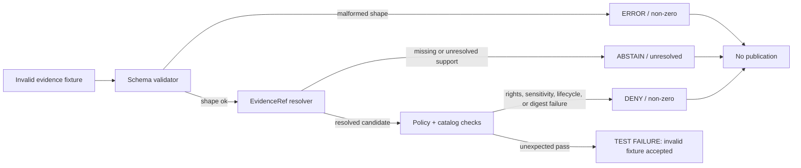

<!-- [KFM_META_BLOCK_V2]
doc_id: kfm://doc/NEEDS_VERIFICATION__tests_fixtures_evidence_invalid_readme
title: Invalid Evidence Fixtures
type: standard
version: v1
status: draft
owners: NEEDS_VERIFICATION__tests_fixture_owner
created: NEEDS_VERIFICATION__YYYY-MM-DD
updated: 2026-04-27
policy_label: NEEDS_VERIFICATION__public_or_internal
related: [../README.md, ../valid/README.md, ../../README.md, ../../../README.md, ../../../../contracts/README.md, ../../../../schemas/README.md, ../../../../policy/README.md, ../../../../tools/validators/README.md]
tags: [kfm, tests, fixtures, evidence, invalid, EvidenceBundle, EvidenceRef, fail-closed]
notes: [README generated from KFM doctrine and surfaced tests/fixtures README patterns. Owners, created date, policy label, active branch inventory, validator entrypoint, and exact schema home remain NEEDS_VERIFICATION. This directory documents intentionally invalid fixture cases; it does not prove current executable CI coverage.]
[/KFM_META_BLOCK_V2] -->

<a id="top"></a>

# Invalid Evidence Fixtures

Intentionally broken evidence fixtures that prove KFM validators, policy gates, and evidence resolvers fail closed rather than publishing unsupported claims.

<div align="left">


</div>

> [!IMPORTANT]
> Invalid fixtures are **review assets**, not disposable clutter. They prove that KFM refuses unresolved evidence, missing citations, unsafe storage references, stale release bases, rights/sensitivity mismatches, and malformed proof objects.

| Field | Value |
|---|---|
| **Status** | `experimental` |
| **Owners** | `NEEDS_VERIFICATION__tests_fixture_owner` |
| **Path** | `tests/fixtures/evidence/invalid/README.md` |
| **Repo fit** | Child README for invalid evidence fixtures under [`../`](../); sibling to expected valid evidence fixtures in [`../valid/`](../valid/); downstream of [`../../`](../../), [`../../../`](../../../), [`../../../../contracts/`](../../../../contracts/), [`../../../../schemas/`](../../../../schemas/), [`../../../../policy/`](../../../../policy/), and [`../../../../tools/validators/`](../../../../tools/validators/) |
| **Quick jumps** | [Scope](#scope) · [Repo fit](#repo-fit) · [Accepted inputs](#accepted-inputs) · [Exclusions](#exclusions) · [Directory tree](#directory-tree) · [Quickstart](#quickstart) · [Usage](#usage) · [Diagram](#diagram) · [Invalid-case matrix](#invalid-case-matrix) · [Task list](#task-list--definition-of-done) · [FAQ](#faq) · [Appendix](#appendix) |

> [!NOTE]
> The links above follow the expected repository placement for `tests/fixtures/evidence/invalid/`. Because the active checkout was not directly inspectable in this session, link targets and exact sibling README names remain **NEEDS VERIFICATION** before merge.

---

## Scope

This directory contains **negative-path evidence fixtures**: small, deterministic files that are supposed to fail validation or resolution.

They exist to test KFM’s evidence posture:

- `EvidenceRef` must resolve to a policy-safe `EvidenceBundle` before runtime answers, map popups, story nodes, exports, or publication-facing surfaces can make consequential claims.
- Invalid evidence must produce visible failure states such as `ABSTAIN`, `DENY`, or `ERROR`, not quiet fallback or fabricated support.
- Public or semi-public outputs must never treat RAW, WORK, QUARANTINE, unresolved, stale, rights-unknown, or sensitivity-conflicted material as release-grade evidence.

### What this directory owns

| Owns | Description |
|---|---|
| Invalid evidence fixtures | Fixture files intentionally shaped to fail schema, resolver, policy, catalog, freshness, citation, or release-basis checks. |
| Expected failure intent | Filenames, comments, or paired metadata that make the intended failure mode reviewable. |
| Negative-path coverage cues | Human-readable guidance for reviewers adding or updating invalid evidence cases. |

### What this directory does not own

| Does not own | Belongs instead |
|---|---|
| Canonical evidence contract definitions | `contracts/` and/or `schemas/` after schema-home authority is verified. |
| Policy rule bodies | `policy/` or the repo’s verified policy home. |
| Validator implementation | `tools/validators/` or the repo’s verified validator home. |
| Emitted proof objects | `data/proofs/`, `data/receipts/`, `release/`, or the repo’s verified artifact home. |
| Valid golden examples | [`../valid/`](../valid/) or the verified valid fixture lane. |

[Back to top](#top)

---

## Repo fit

`tests/fixtures/evidence/invalid/` is a leaf fixture lane. It supports contract, policy, resolver, runtime, and promotion tests without becoming a second contract authority.

```text
contracts / schemas       define what evidence objects mean
policy                    decides allow / deny / obligation behavior
tools/validators          execute schema, resolver, and policy checks
tests/fixtures/evidence   provides local valid and invalid evidence examples
tests/*                   proves expected behavior using those examples
```

### Boundary ownership matrix

| Concern | This directory owns | This directory consumes | This directory must not replace |
|---|---:|---:|---:|
| Invalid evidence examples | ✓ |  |  |
| Expected negative fixture intent | ✓ |  |  |
| EvidenceBundle semantics |  | ✓ | ✓ |
| EvidenceRef resolver behavior |  | ✓ | ✓ |
| Rights / sensitivity / policy rules |  | ✓ | ✓ |
| Runtime response envelopes |  | ✓ | ✓ |
| Release manifests and proof packs |  | ✓ | ✓ |
| Canonical source-of-truth data |  |  | ✓ |
| Production proof or receipt storage |  |  | ✓ |

[Back to top](#top)

---

## Accepted inputs

Place only deterministic, reviewable negative fixtures here.

| Input class | Examples | Expected handling |
|---|---|---|
| Malformed evidence bundle | missing required identifier, missing evidence refs, invalid schema version | validator returns non-zero / `ERROR` |
| Unresolved evidence ref | points to absent bundle, absent source descriptor, or unknown release basis | resolver returns `ABSTAIN` or test fails as unresolved |
| Policy-incompatible evidence | restricted evidence used in public fixture, rights unknown, sensitivity unresolved | policy gate returns `DENY` with reason / obligation |
| Unsafe storage reference | fixture points to `data/raw`, `data/work`, or `data/quarantine` as public support | validator or policy gate returns `DENY` |
| Broken citation closure | answer/support fixture cites material not present in the bundle | citation validation returns `ABSTAIN` or `ERROR` |
| Catalog / release mismatch | digest mismatch, missing release manifest ref, stale correction lineage | promotion / catalog gate returns `DENY` or `ERROR` |
| Stale or superseded evidence | fixture omits freshness state, correction notice, or replacement reference | validator returns non-zero or policy returns `HOLD` / `DENY` if supported |

> [!TIP]
> Prefer one failure reason per fixture. A precise invalid case is easier to review and harder for validators to accidentally pass.

[Back to top](#top)

---

## Exclusions

Do not place these here.

| Exclusion | Where it should go | Reason |
|---|---|---|
| Valid `EvidenceBundle` examples | [`../valid/`](../valid/) or verified valid fixture lane | Keeps pass/fail fixture intent obvious. |
| Source-descriptor-only invalids | `tests/fixtures/source/` or verified source fixture lane | Source admission is related but not identical to resolved evidence support. |
| Runtime-response-only invalids | `tests/fixtures/runtime/`, `tests/fixtures/focus/`, or verified runtime fixture lane | Runtime envelopes can consume evidence fixtures, but this directory should not own runtime contract shape. |
| Policy fixtures unrelated to evidence | `tests/fixtures/policy/` or `policy/fixtures/` | Avoids collapsing evidence examples into policy-authority examples. |
| Real unpublished source data | RAW / WORK / QUARANTINE lifecycle areas | Fixtures must stay small, synthetic, and safe. |
| Secrets, tokens, private identifiers, or exact sensitive locations | Nowhere in public fixtures | Invalid examples must not create real exposure risk. |
| Live-source probes | Integration or connector tests with explicit gating | Invalid fixtures should run offline and deterministically. |

[Back to top](#top)

---

## Directory tree

**PROPOSED / NEEDS VERIFICATION.** This tree shows the expected shape of a useful invalid evidence fixture lane. It does not claim the active branch already contains these files.

```text
tests/fixtures/evidence/invalid/
├── README.md
├── evidence_bundle.missing-evidence-ref.invalid.json
├── evidence_bundle.unresolved-release.invalid.json
├── evidence_bundle.rights-unknown-public.invalid.json
├── evidence_bundle.catalog-digest-mismatch.invalid.json
├── evidence_ref.raw-storage-path.invalid.json
├── evidence_ref.quarantine-storage-path.invalid.json
├── citation.unsupported-claim.invalid.json
└── freshness.superseded-without-correction.invalid.json
```

### Naming convention

Use names that say **what fails**.

```text
<object-family>.<failure-reason>.invalid.json
```

Recommended failure-reason vocabulary:

| Reason fragment | Use when |
|---|---|
| `missing-evidence-ref` | Bundle lacks required support references. |
| `unresolved-release` | Release or dataset version cannot be resolved. |
| `rights-unknown-public` | Public fixture uses evidence without public release rights. |
| `catalog-digest-mismatch` | Catalog / manifest / proof digests disagree. |
| `raw-storage-path` | Public support points at RAW storage. |
| `quarantine-storage-path` | Public support points at QUARANTINE storage. |
| `unsupported-claim` | Citation or support does not cover the claim. |
| `superseded-without-correction` | Correction lineage is missing or stale. |

[Back to top](#top)

---

## Quickstart

### Safe inspection

```bash
find tests/fixtures/evidence/invalid -maxdepth 2 -type f | sort
```

### Drift check before adding a fixture

```bash
grep -RIn \
  -e 'EvidenceBundle' \
  -e 'EvidenceRef' \
  -e 'DecisionEnvelope' \
  -e 'RuntimeResponseEnvelope' \
  -e 'ReleaseManifest' \
  -e 'CorrectionNotice' \
  -e 'ABSTAIN' \
  -e 'DENY' \
  -e 'ERROR' \
  tests contracts schemas policy tools docs .github 2>/dev/null || true
```

### Expected validator shape

> [!WARNING]
> The exact validator command is **NEEDS VERIFICATION**. Use the repo’s checked-in validator entrypoint when available; do not create a parallel validator just for this directory.

```bash
# NEEDS VERIFICATION: adapt to the checked-in validator interface.
python tools/validators/schema_validate.py \
  --root . \
  --expect-fail tests/fixtures/evidence/invalid
```

Expected local behavior:

```text
no network calls
no production writes
no live credentials
no mutation outside temporary test output
invalid fixtures fail for the documented reason
no invalid fixture reaches publication or runtime ANSWER status
```

[Back to top](#top)

---

## Usage

### Adding a new invalid fixture

1. Choose the narrowest failure reason.
2. Name the fixture with `<object-family>.<failure-reason>.invalid.json`.
3. Keep the fixture synthetic, small, and deterministic.
4. Include enough fields for the validator to reach the intended failure.
5. Avoid stacking unrelated failures in one file.
6. Add or update the test that proves the fixture fails.
7. Confirm the failure reason is asserted, not merely that “something failed.”
8. Cross-link the fixture to the relevant contract, schema, or policy test if the repo convention supports it.

### Review rules

| Rule | Why it matters |
|---|---|
| Invalid fixtures must not pass silently | A passing invalid fixture weakens the trust membrane. |
| Failure reason must be visible | Reviewers need to know whether the validator caught the intended defect. |
| Negative cases must be deterministic | CI should not depend on network, clocks, or external source availability. |
| Evidence fixtures must stay evidence-focused | Runtime, source, or policy-only failures belong in their own fixture lanes. |
| Sensitive examples must be synthetic | Invalid does not mean unsafe. |
| RAW / WORK / QUARANTINE references must fail | Public support cannot bypass governed lifecycle and release state. |
| Receipts are not proofs | Process-memory fixtures must not masquerade as release-grade support. |
| Unsupported citations must abstain or error | KFM must cite-or-abstain, not cite decoratively. |

[Back to top](#top)

---

## Diagram



The successful path for this directory is not publication. The successful path is a **clear, bounded failure**.

[Back to top](#top)

---

## Invalid-case matrix

| Fixture family | Example failure | Expected result | Reviewer question |
|---|---|---|---|
| `EvidenceBundle` | required support ref missing | `ERROR` or schema failure | Does the test assert the exact missing field or reason code? |
| `EvidenceBundle` | release basis missing or unresolved | `ABSTAIN` / non-zero resolver result | Does the fixture prove unresolved evidence cannot support an answer? |
| `EvidenceRef` | points to RAW / WORK / QUARANTINE | `DENY` | Does policy block public use of non-published storage? |
| `EvidenceBundle` | rights unknown for public claim | `DENY` | Is the rights failure explicit, not implied by prose? |
| `EvidenceBundle` | sensitivity review unresolved | `DENY` or `HOLD` | Is the public-safe outcome bounded or withheld? |
| `CatalogClosure` | digest mismatch | `DENY` / non-zero catalog gate | Does the failure include both declared and computed digest context if available? |
| Citation closure | citation does not support claim | `ABSTAIN` or `ERROR` | Does the test prevent unsupported answer text from leaking through? |
| Freshness / correction | superseded support without correction notice | `DENY`, `HOLD`, or non-zero validator result | Is correction lineage visible enough to reconstruct? |

[Back to top](#top)

---

## Task list / definition of done

### First useful fixture wave

- [ ] Confirm the repo’s authoritative evidence schema home.
- [ ] Confirm whether invalid fixtures live under `tests/fixtures/evidence/invalid/` or a schema-side fixture subtree.
- [ ] Confirm the validator entrypoint that should consume this directory.
- [ ] Add one invalid fixture for missing evidence support.
- [ ] Add one invalid fixture for unresolved `EvidenceRef`.
- [ ] Add one invalid fixture for RAW / WORK / QUARANTINE public support.
- [ ] Add one invalid fixture for rights or sensitivity denial.
- [ ] Add one invalid fixture for catalog / digest mismatch.
- [ ] Add tests that assert expected reason codes or failure classes.
- [ ] Wire the tests into the verified CI path before claiming merge-blocking coverage.

### Definition of done

| Gate | Done when |
|---|---|
| Fixture gate | Each invalid fixture has one clear failure reason. |
| Schema gate | Malformed evidence fixtures fail the checked-in schema validator. |
| Resolver gate | Unresolved `EvidenceRef` cases cannot produce a supported public answer. |
| Policy gate | Rights, sensitivity, and lifecycle violations return deny/hold behavior as expected. |
| Catalog gate | Digest, release, and catalog mismatches fail closed. |
| Citation gate | Unsupported citations produce abstention or error, not decorative citation success. |
| CI gate | Offline tests fail if an invalid fixture is accepted. |
| Documentation gate | README links, owners, policy label, and validator commands are verified in the active branch. |

[Back to top](#top)

---

## FAQ

### Why keep invalid fixtures in the repo?

Because KFM’s trust posture depends on visible negative paths. A validator that only sees valid examples can drift into permissive behavior without reviewers noticing.

### Can invalid fixtures include real source records?

No. Use synthetic, minimal records. Real source records belong in governed lifecycle areas and must respect rights, sensitivity, and source-role controls.

### Should every invalid fixture fail schema validation?

No. Some invalid fixtures should be schema-valid but semantically unsafe. KFM needs both shape failures and policy / resolver / catalog failures.

### What should happen if an invalid fixture starts passing?

Treat it as a regression unless the contract, schema, or policy was intentionally changed and the fixture was migrated with a documented reason.

### Is this directory evidence authority?

No. It is a test fixture lane. Contracts and schemas define evidence object meaning; policy defines release behavior; validators execute checks; fixtures prove those checks.

[Back to top](#top)

---

## Appendix

<details>
<summary>Suggested fixture metadata pattern</summary>

When the repo has a settled fixture convention, consider pairing invalid fixtures with expected-failure metadata.

```json
{
  "fixture_id": "evidence_bundle.missing-evidence-ref.invalid",
  "expected": {
    "accepted": false,
    "outcome": "ERROR",
    "reason_code": "EVIDENCE_REF_MISSING"
  },
  "notes": [
    "Illustrative expected-failure metadata only.",
    "Use the repo-native manifest or test-case format if one exists."
  ]
}
```

</details>

<details>
<summary>Review anti-patterns</summary>

| Anti-pattern | Safer replacement |
|---|---|
| “This file is invalid” with no reason | Name and assert the exact failure reason. |
| Many failures in one fixture | Split into one reason per fixture. |
| Live API dependency | Use a synthetic local fixture. |
| Public RAW reference accepted by test | Assert `DENY` and no publication. |
| Unsupported citation still returns answer | Assert `ABSTAIN` or `ERROR`. |
| Fixture requires current date | Freeze dates or inject deterministic test time. |
| README claims CI enforcement without workflow proof | Mark CI coverage `NEEDS VERIFICATION`. |

</details>

[Back to top](#top)
