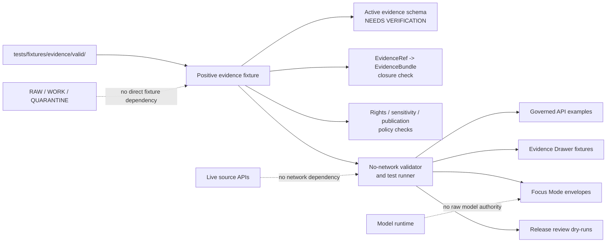

<!-- [KFM_META_BLOCK_V2]
doc_id: kfm://doc/NEEDS_VERIFICATION__tests_fixtures_evidence_valid_readme
title: Valid Evidence Fixtures
type: standard
version: v1
status: draft
owners: NEEDS_VERIFICATION__test_fixture_owner
created: 2026-04-27
updated: 2026-04-27
policy_label: NEEDS_VERIFICATION__public_or_internal
related: [NEEDS_VERIFICATION__../README.md, NEEDS_VERIFICATION__../../README.md, NEEDS_VERIFICATION__../../../README.md, NEEDS_VERIFICATION__../../../../schemas/contracts/v1/evidence/, NEEDS_VERIFICATION__../../../../tools/validators/]
tags: [kfm, tests, fixtures, evidence, valid, evidence-bundle]
notes: [Created as a repo-ready draft for tests/fixtures/evidence/valid/README.md. Exact owner, policy label, sibling README links, schema home, validator path, and live fixture inventory must be verified in the mounted repository before merge.]
[/KFM_META_BLOCK_V2] -->

<a id="top"></a>

# Valid Evidence Fixtures

Positive, deterministic evidence fixtures used to prove that KFM `EvidenceBundle`-style examples can validate, resolve, and support governed surfaces without becoming source truth.

> **Status:** `experimental`  
> **Owners:** `NEEDS_VERIFICATION__test_fixture_owner`  
> **Path:** `tests/fixtures/evidence/valid/README.md`  
> **Repo fit:** child README for the positive evidence-fixture lane under `tests/fixtures/evidence/`  
> **Quick jumps:** [Scope](#scope) · [Repo fit](#repo-fit) · [Accepted inputs](#accepted-inputs) · [Exclusions](#exclusions) · [Directory tree](#directory-tree) · [Quickstart](#quickstart) · [Usage](#usage) · [Diagram](#diagram) · [Operating tables](#operating-tables) · [Task list](#task-list--definition-of-done) · [FAQ](#faq) · [Appendix](#appendix)


> [!IMPORTANT]
> This directory is for **positive test fixtures**, not for canonical evidence, release proofs, raw source captures, or provider mirrors. A fixture may demonstrate a valid shape and a resolvable evidence path; it does not make a claim authoritative by itself.

> [!WARNING]
> Do not add live credentials, RAW / WORK / QUARANTINE payloads, sensitive exact locations, private records, or unconstrained source dumps here. Valid fixtures must remain small, deterministic, reviewable, and safe to run without network access.

---

## Scope

`tests/fixtures/evidence/valid/` holds fixtures that should pass the evidence-fixture validation path.

A valid fixture should demonstrate one narrow positive condition:

- an `EvidenceBundle` or evidence-support object is structurally valid;
- every declared evidence reference is locally resolvable or intentionally mocked through a reviewed fixture reference;
- source, rights, freshness, policy, review, release, and correction fields are present at the level required by the active schema;
- the fixture can support downstream tests for governed API responses, Evidence Drawer payloads, Focus Mode envelopes, or release review without bypassing KFM’s trust membrane.

**CONFIRMED doctrine:** KFM centers the inspectable claim, not the rendered map, model answer, tile, cache, or summary. This directory supports that doctrine by giving validators a small positive surface to exercise.

**NEEDS VERIFICATION:** The exact active schema name, validator command, owner, and sibling invalid-fixture path must be confirmed in the live checkout.

[Back to top](#top)

---

## Repo fit

| Role | Path or link | Status | Notes |
|---|---|---:|---|
| This README | `tests/fixtures/evidence/valid/README.md` | **PROPOSED** | Directory orientation for positive evidence fixtures. |
| Parent evidence fixture lane | [`../README.md`](../README.md) | **NEEDS VERIFICATION** | Expected to explain the shared evidence fixture family. |
| Fixtures root | [`../../README.md`](../../README.md) | **NEEDS VERIFICATION** | Expected to explain repository-wide fixture conventions. |
| Tests root | [`../../../README.md`](../../../README.md) | **NEEDS VERIFICATION** | Expected to explain test boundaries, runners, and review burden. |
| Candidate evidence schemas | [`../../../../schemas/contracts/v1/evidence/`](../../../../schemas/contracts/v1/evidence/) | **NEEDS VERIFICATION** | Use the active schema home after ADR / repo inspection resolves it. |
| Candidate validators | [`../../../../tools/validators/`](../../../../tools/validators/) | **NEEDS VERIFICATION** | Prefer repo-native validators if their names differ. |
| Downstream consumers | `tests/**`, governed API examples, Evidence Drawer fixtures, Focus Mode fixtures | **PROPOSED** | Positive fixtures should be reusable without network or source access. |

This lane is downstream of contracts and schemas, peer to invalid evidence fixtures, and upstream of tests that prove evidence resolution, citation closure, and negative-path safety.

[Back to top](#top)

---

## Accepted inputs

Place only compact, reviewable positive fixtures here.

| Accepted input | Why it belongs | Minimum review check |
|---|---|---|
| `*.valid.json` evidence fixtures | Positive examples that should pass the active evidence schema. | Schema validates with no network access. |
| `*.valid.yaml` evidence fixtures | Acceptable only if repo validators support YAML. | YAML support is confirmed and deterministic. |
| Minimal `EvidenceBundle` examples | Proves the smallest valid evidence-support object. | Required refs, rights, freshness, and audit fields are present. |
| Release-backed examples | Proves a bundle can point to release / catalog / proof context without storing proofs here. | Release refs are fixture-safe and do not imply public publication. |
| Correction-linked examples | Proves supersession, withdrawal, or narrowed-publication references can be expressed. | Correction refs are local, deterministic, and non-sensitive. |
| Runtime-support examples | Proves Focus Mode or API responses can resolve evidence before answering. | Uses finite outcome grammar through downstream tests. |

Fixture names should make the success condition obvious:

```text
<case>.<object-family>.valid.json
```

Examples of naming patterns:

```text
minimal.evidence_bundle.valid.json
release_linked.evidence_bundle.valid.json
correction_linked.evidence_bundle.valid.json
runtime_support.evidence_bundle.valid.json
```

These names are **PROPOSED patterns**, not a confirmed inventory.

[Back to top](#top)

---

## Exclusions

Keep this directory narrow. Anything outside the positive evidence-fixture role belongs elsewhere.

| Do not put here | Put it instead | Why |
|---|---|---|
| Invalid evidence fixtures | `../invalid/` | Positive and negative paths must stay visually separable. |
| RAW source captures | `data/raw/` or the repo’s source-capture fixture lane | Valid fixtures must not become source mirrors. |
| WORK / QUARANTINE records | `data/work/`, `data/quarantine/`, or lane-specific fixtures | Ambiguous or unsafe material must not masquerade as valid evidence. |
| Release proofs or attestations | `data/proofs/` or release/proof fixtures | Proof objects justify release; this directory only tests valid evidence shape. |
| Run receipts / validation reports | `data/receipts/` or receipt fixtures | Receipts are process memory, not EvidenceBundle fixtures. |
| Secrets, tokens, cookies, private endpoints | Nowhere in the repo | Checked-in fixtures must be safe by construction. |
| Sensitive exact coordinates | Restricted fixture lanes with explicit policy review, if allowed at all | Public-safe fixture posture must fail closed. |
| Model-generated answers | Runtime response fixtures | AI language is downstream of resolved evidence and policy checks. |

[Back to top](#top)

---

## Directory tree

**NEEDS VERIFICATION:** the active branch inventory was not confirmed here. The tree below is a recommended shape, not a claim that these files already exist.

```text
tests/fixtures/evidence/
├── README.md                         # parent evidence fixture lane — NEEDS VERIFICATION
├── valid/
│   ├── README.md                     # this file
│   ├── minimal.evidence_bundle.valid.json
│   ├── release_linked.evidence_bundle.valid.json
│   ├── correction_linked.evidence_bundle.valid.json
│   └── runtime_support.evidence_bundle.valid.json
└── invalid/
    ├── README.md                     # sibling negative lane — NEEDS VERIFICATION
    └── missing_ref.evidence_bundle.invalid.json
```

A valid fixture should be paired with at least one negative test case somewhere in the evidence fixture family. Positive-only coverage can make validators look stronger than they are.

[Back to top](#top)

---

## Quickstart

Use the inspection commands first. They are safe, read-only, and do not require live source access.

```bash
# Inspect this fixture lane.
find tests/fixtures/evidence/valid -maxdepth 2 -type f 2>/dev/null | sort

# Inspect sibling evidence fixture lanes.
find tests/fixtures/evidence -maxdepth 3 -type f 2>/dev/null | sort

# Inspect candidate schema and validator homes before assuming names.
find schemas/contracts -path '*evidence*' -type f 2>/dev/null | sort
find tools/validators -iname '*evidence*' -type f 2>/dev/null | sort
```

Candidate validation commands are intentionally shown as patterns because the repo-native runner must win if it differs.

```bash
# Pattern only — replace with the verified repo-native command.
python tools/validators/validate_evidence_bundle.py \
  tests/fixtures/evidence/valid/*.json
```

```bash
# Pattern only — run the relevant test family once confirmed.
pytest tests -k "evidence and fixture and valid"
```

> [!NOTE]
> Validation should not fetch source APIs, call model providers, read RAW / WORK / QUARANTINE folders, or depend on current wall-clock freshness. Fixture tests should prove shape, closure, policy-safe references, and deterministic behavior.

[Back to top](#top)

---

## Usage

### Add a positive fixture

1. Start from the active schema, not from memory.
2. Keep the fixture small enough to review in a diff.
3. Use fixture-local or release-fixture references only.
4. Include rights, freshness, review, release, correction, and audit fields required by the schema.
5. Run the no-network validator.
6. Add or update the paired invalid case when the positive case introduces a new rule.
7. Update this README if the fixture adds a new fixture class, naming pattern, or downstream consumer.

### Keep valid fixtures honest

A valid fixture may show that evidence support is internally coherent. It must not silently imply that:

- a source is authoritative for every claim type;
- a release has actually been published;
- a proof pack has been signed;
- a model answer is approved;
- a derived layer is canonical truth;
- a public UI may bypass the governed API.

[Back to top](#top)

---

## Diagram



The diagram shows the intended responsibility boundary. This directory feeds positive tests; it does not create evidence authority, policy authority, or publication authority.

[Back to top](#top)

---

## Operating tables

### Fixture acceptance matrix

| Gate | PASS means | Reject if |
|---|---|---|
| Shape | Fixture validates against the active evidence schema. | Required fields are missing, ambiguous, or schema-drifted. |
| Evidence closure | Evidence refs resolve to fixture-safe support. | A ref points to RAW / WORK / QUARANTINE, a live source, or an unresolved path. |
| Rights posture | Rights and use constraints are explicit. | Rights are unknown, copied from live source terms without review, or omitted. |
| Sensitivity posture | Public-safe by default. | Exact sensitive locations, private records, or steward-only data are present. |
| Review state | Review / release fields are explicit enough for downstream tests. | The fixture implies approval without a `DecisionEnvelope`, review record, or equivalent test context. |
| Determinism | Tests can run offline and produce stable results. | Current time, network response, random ID, or provider behavior changes the result. |
| Pairing | New positive semantics have negative coverage nearby. | No invalid sibling or negative test exercises the boundary. |

### Boundary matrix

| Surface | This directory may reference | This directory must not become |
|---|---|---|
| `EvidenceBundle` | Valid support object for a claim or runtime answer. | Canonical store of all evidence. |
| `EvidenceRef` | Local or fixture-safe reference that can be resolved by tests. | Shortcut into RAW, WORK, QUARANTINE, or live source APIs. |
| `DecisionEnvelope` | Downstream governance object used by tests or examples. | Substitute for policy execution or reviewer authority. |
| `ReleaseManifest` | Fixture-safe release context. | Proof that real publication occurred. |
| `RuntimeResponseEnvelope` | Downstream positive runtime example after evidence resolution. | Free-form model output. |
| `CorrectionNotice` | Fixture-safe correction / supersession link. | Silent edit history or deletion path. |

### Truth labels for this README

| Label | Use here |
|---|---|
| **CONFIRMED** | KFM doctrine requires inspectable, evidence-bound, policy-aware outputs. |
| **PROPOSED** | Directory shape, fixture naming, validator commands, and downstream consumer examples. |
| **UNKNOWN** | Live branch inventory, exact owner, active schema path, active validator command, CI wiring. |
| **NEEDS VERIFICATION** | Links, owner, policy label, sibling READMEs, schema home, validator home. |

[Back to top](#top)

---

## Task list / definition of done

Before this README and fixture lane should be treated as active:

- [ ] Confirm the live checkout contains `tests/fixtures/evidence/valid/`.
- [ ] Confirm or create the parent evidence fixture README.
- [ ] Replace `NEEDS_VERIFICATION__test_fixture_owner` with the repo-confirmed owner.
- [ ] Verify `policy_label` and update the meta block.
- [ ] Confirm the active evidence schema home.
- [ ] Confirm the active validator command and test runner.
- [ ] Ensure every checked-in valid fixture passes with no network access.
- [ ] Ensure each new positive rule has paired negative coverage.
- [ ] Confirm no fixture contains secrets, sensitive exact locations, raw source captures, or live provider payload mirrors.
- [ ] Confirm downstream tests resolve `EvidenceRef -> EvidenceBundle` before producing runtime or UI examples.
- [ ] Verify all relative links from this README in the mounted branch.
- [ ] Keep rollback simple: removing this README or any fixture must not require data migration or public release withdrawal.

[Back to top](#top)

---

## FAQ

### Is every valid fixture an approved KFM claim?

No. A valid fixture proves a test object can pass the active validation path. It is not an authoritative public claim, release proof, steward approval, or publication decision.

### Can a valid fixture point to live source data?

No. Checked-in evidence fixtures should be no-network and deterministic. Use source descriptors, catalog fixtures, or mocked fixture-local references instead of live source calls.

### Can a valid fixture include model output?

Only if the active runtime fixture contract explicitly requires it, and even then the model output belongs in a runtime envelope fixture. Evidence fixtures should focus on evidence support, not free-form generated text.

### Where do failure cases go?

Failure cases belong in the sibling invalid evidence fixture lane, expected as `../invalid/` unless the repo uses another confirmed convention.

[Back to top](#top)

---

## Appendix

<details>
<summary><strong>Glossary</strong></summary>

| Term | Meaning in this README |
|---|---|
| `EvidenceBundle` | Governed support object that resolves a visible claim, API answer, or UI explanation back to inspectable evidence. |
| `EvidenceRef` | Reference that must resolve before consequential claims or runtime answers proceed. |
| Valid fixture | A small positive example expected to pass schema and closure checks. |
| Invalid fixture | A negative example expected to fail for a specific, reviewable reason. |
| Trust membrane | KFM boundary that prevents clients, UI, model runtimes, and tests from bypassing governed APIs and evidence resolution. |
| Proof object | Machine-checkable object that anchors evidence, release, correction, or runtime trust state. |
| Receipt | Process-memory object for a run, validation, ingestion, or audit event; not the same as a release proof. |
| Governed API | Public or role-limited interface that mediates policy, evidence, release state, and response envelopes. |

</details>

<details>
<summary><strong>Verification backlog carried by this README</strong></summary>

| Item | Why it matters |
|---|---|
| Leaf owner | Avoids orphaned fixture stewardship. |
| Active schema path | Prevents contract drift between `contracts/`, `schemas/`, and test fixtures. |
| Active validator command | Keeps quickstart commands runnable rather than aspirational. |
| Parent and sibling README links | Keeps navigation useful in GitHub. |
| Fixture inventory | Converts proposed examples into branch-confirmed facts. |
| CI behavior | Distinguishes documentation posture from merge-blocking enforcement. |
| Policy label | Prevents accidentally publishing restricted fixture guidance as public. |

</details>

<details>
<summary><strong>Related entrypoints to verify</strong></summary>

- [`../README.md`](../README.md)
- [`../../README.md`](../../README.md)
- [`../../../README.md`](../../../README.md)
- [`../../../../schemas/contracts/v1/evidence/`](../../../../schemas/contracts/v1/evidence/)
- [`../../../../policy/`](../../../../policy/)
- [`../../../../tools/validators/`](../../../../tools/validators/)
- [`../../../../.github/workflows/`](../../../../.github/workflows/)

</details>

[Back to top](#top)
