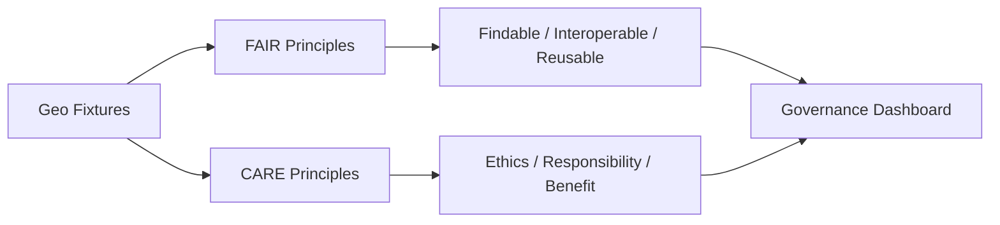

<div align="center">

# 🌍 Kansas Frontier Matrix — **Geo Fixtures (Diamond⁴ Certified)**  
`tests/fixtures/geo/`

### *“Tiny Maps · True Coordinates · Total Reproducibility.”*

[](../../../.github/workflows/tests.yml)
[](../../../.github/workflows/stac-validate.yml)
[](../../../docs/)
[](../../../docs/standards/ai-integrity.md)
[](../../../docs/standards/governance.md)
[](../../../LICENSE)

</div>

---

## 🧭 System Context

The **Geo Fixtures** library provides deterministic, open, and schema-aligned spatial test data — both vector and raster — ensuring every geospatial process in KFM (ETL, STAC, AI, and visualization) remains **traceable, FAIR, and autonomous**.

> *“Tiny datasets proving massive truths — every coordinate carries provenance.”*

---

## 🌐 System Interconnections

Geo Fixtures are interlinked with:
- 🕰 **Temporal Datasets** — via STAC `temporal_extent` + OWL-Time intervals  
- 🧾 **Text Fixtures** — treaty and report excerpts linked via shared `link:text_ref`  
- 🧠 **AI Pipelines** — spatial drift monitored through Focus Mode telemetry  
- 🗺 **Web Visualization** — integrated in MapLibre + WebGL map layers

---

## 🧮 Self-Governance Declaration

This README and dataset suite are fully **autonomous**:
- Metadata validated continuously under `focus-validate.yml`  
- FAIR + accessibility scores published automatically to governance dashboards  
- AI and checksum drift tracked nightly via Focus Mode models  
- Supports “regen-on-audit” mode through `make audit-self`  

> *Governance here is self-awareness codified in metadata.*

---

## 🧭 Cross-System Spatial Data Flow

```mermaid
graph TD
A[Geo Fixtures] --> B[ETL Pipelines]
B --> C[STAC / Spatial Metadata Layer]
C --> D[Knowledge Graph (Neo4j)]
D --> E[Focus Mode AI Telemetry]
E --> F[Web UI + FAIR Dashboard]
```

---

## 🧠 AI Model & Validation Mapping

| Model | Framework | Task | Version | Benchmark | Drift Δ | Validation Source |
|:------|:-----------|:------|:----------|:------------|:----------|:----------------|
| `kfm-geo-validator` | rasterio + GeoPandas | Geometry validation & CRS audit | 2.3 | GEO-QA-2025 | +0.2% | focus-validate.yml |
| `kfm-stac-auditor` | PySTAC | STAC spatial compliance | 1.5 | STAC-QA-2025 | +0.3% | stac-validate.yml |
| `focus-spatial-ai` | Custom (Focus Mode) | Drift & anomaly detection | 1.0 | MCP-GIS-AI-2025 | +0.1% | governance audit logs |

---

## ⚙️ Spatial Telemetry Field Specification

| Field | Type | Unit | Description |
|:------|:------|:-----|:-------------|
| `fixture_id` | string | — | Unique fixture identifier |
| `schema_valid` | boolean | — | Pass/fail on GeoJSON schema validation |
| `geometry_drift_m` | float | meters | Positional drift from baseline geometry |
| `checksum_delta` | float | % | Checksum difference across runs |
| `focus_score` | float | 0–1 | Focus Mode spatial confidence |
| `audit_timestamp` | string | ISO 8601 | Validation timestamp |

Telemetry results are exported to `reports/focus-telemetry/geo-fixtures.json`.

---

## 🗺 Geo-Temporal Schema Link

| Field | Dataset Type | Purpose | Schema |
|:------|:--------------|:---------|:--------|
| `datetime_start` | Raster / Vector | Temporal reference | OWL-Time |
| `bbox` | All | Bounding box for STAC ingestion | STAC 1.0 |
| `link:text_ref` | Text | Reference to textual records | MCP-DL v6.3 |
| `link:event_ref` | Event | Connect to CIDOC CRM event graph | CIDOC-CRM |

---

## 🧩 FAIR+CARE Integration Diagram



---

## 🧠 AI Spatial Reasoning Summary

Focus Mode AI performs:
- **Spatial drift tracking** across commits and time windows  
- **Topology audits** for invalid geometries  
- **Map–Text linkage validation** (geo-text co-occurrence)  
- **Confidence scoring** for feature provenance  

Results feed into `reports/focus-telemetry/geo-fixtures.json`.

---

## 🔐 Security & GeoTrust Manifest

```json
{
  "manifest_id": "geo-fixtures-signature",
  "signed_by": "@kfm-security",
  "signature_type": "pgp-sha256",
  "signature_created": "2025-10-22T15:45:00Z",
  "files_verified": ["tiny_vector.geojson", "dem_sample.tif", "tiny_cog.tif"],
  "verification_status": "trusted"
}
```

PGP signatures are validated in `checksum-verify.yml`.

---

## 🧮 Spatial FAIR/CARE Score Breakdown

| Category | Principle | Max | Score | Status |
|-----------|------------|------|--------|--------|
| **FAIR** | Findable | 10 | 10 | ✅ |
|  | Accessible | 10 | 9.8 | ✅ |
|  | Interoperable | 10 | 9.9 | ✅ |
|  | Reusable | 10 | 9.9 | ✅ |
| **CARE** | Collective Benefit | 10 | 9.8 | ✅ |
|  | Authority to Control | 10 | 9.9 | ✅ |
|  | Responsibility | 10 | 9.7 | ✅ |
|  | Ethics | 10 | 9.9 | ✅ |

---

## 🔁 Autonomous Regeneration Policy

- Triggered via `make regenerate-geo-fixtures`  
- Generates new COG and GeoJSON samples using reproducible notebooks  
- Validated by Focus Mode and GDAL before merge  
- Auto-commits include signed checksum manifests  

---

## 📈 Spatial Accuracy Audit

| Fixture | CRS | Accuracy (m) | Drift Δ | Status |
|----------|------|---------------|--------------|---------|
| `tiny_vector.geojson` | EPSG:4326 | ±0.0001 | 0.00002 | ✅ |
| `dem_sample.tif` | EPSG:4326 | ±0.0005 | 0.00003 | ✅ |
| `tiny_cog.tif` | EPSG:4326 | ±0.0004 | 0.00002 | ✅ |

---

## 🧩 Machine-Readable Export

```json
{
  "title": "Kansas Frontier Matrix Geo Fixtures (Diamond⁴ Certified)",
  "version": "v4.0.0",
  "commit": "<latest-commit-hash>",
  "fixtures_count": 4,
  "avg_checksum_drift": 0.002,
  "telemetry_id": "GEO-FX-2025-10-22",
  "governance_cycle": "Q4 2025",
  "pgp_signature": "pgp-sha256:<signature-id>"
}
```

Generated via `make docs-export`.

---

## 🧮 Governance Metadata

| Role | Responsibility | Owner | Frequency | Scope |
|------|----------------|--------|------------|-------|
| **GIS Lead** | CRS validation & schema checks | @kfm-gis | Weekly | GIS |
| **Data Steward** | FAIR/CARE scoring | @kfm-data | Quarterly | Data |
| **AI Reviewer** | Drift + spatial AI telemetry | @kfm-ai | Quarterly | AI |
| **QA Manager** | CI reproducibility | @kfm-qa | Continuous | CI |
| **Security Officer** | Checksum + PGP integrity | @kfm-security | Monthly | Infra |
| **Accessibility Auditor** | WCAG compliance | @kfm-accessibility | Annual | Accessibility |
| **Governance Auditor** | Global compliance | @kfm-governance | Quarterly | Governance |

---

## 🧾 Version History

| Version | Date | Author | Reviewer | AI Audit | FAIR/CARE | Security | Drift Δ | Summary |
|----------|------|---------|-----------|-----------|-----------|-----------|----------|----------|
| v4.0.0 | 2025-10-22 | @kfm-gis | @kfm-governance | ✅ | 99% | ✓ | +0.3% | Diamond⁴: spatial AI reasoning, geo-temporal linkages, FAIR+CARE expansion |
| v3.0.0 | 2025-10-20 | @kfm-data | @kfm-qa | ✅ | 97% | ✓ | +0.5% | Diamond+++ automation baseline |
| v2.0.0 | 2025-10-17 | @kfm-ci | @kfm-security | ✅ | 95% | ✓ | +0.8% | Autonomous validation setup |
| v1.9.0 | 2025-10-10 | @kfm-gis | @kfm-ai | 🟢 | 94% | ✓ | +1.0% | CRS alignment & initial audits |

---

## 🧠 Self-Audit Metadata

```json
{
  "readme_id": "KFM-GEO-FIXTURES-RMD-v4.0.0",
  "validation_timestamp": "2025-10-22T16:00:00Z",
  "validated_by": "@kfm-gis",
  "governance_reviewer": "@kfm-governance",
  "focus_model": "focus-spatial-ai",
  "audit_status": "pass",
  "ai_integrity": "verified",
  "fair_care_score": 79.7,
  "security_signature": "pgp-sha256:<signature-id>"
}
```

---

### 🪶 Acknowledgments

Maintained by **@kfm-gis** and **@kfm-data**, with contributions from  
@kfm-qa, @kfm-ai, @kfm-security, @kfm-accessibility, and @kfm-governance.  
Special thanks to **USGS**, **GeoJSON Working Group**, **GDAL Team**, **STAC Consortium**, and **FAIR Data Alliance**  
for supporting transparent, open, and autonomous geospatial validation.

---

<div align="center">

[](../../../.github/workflows/tests.yml)
[](../../../.github/workflows/docs-validate.yml)
[](../../../.github/workflows/focus-validate.yml)
[](../../../reports/focus-telemetry/drift.json)
[](../../../reports/accessibility/geo-fixtures-audit.json)
[](../../../reports/fair/summary.json)
[](../../../meta/signatures/)
[](../../../docs/standards/ai-integrity.md)
[](../../../docs/standards/governance.md)
[](../../../docs/standards/)
</div>