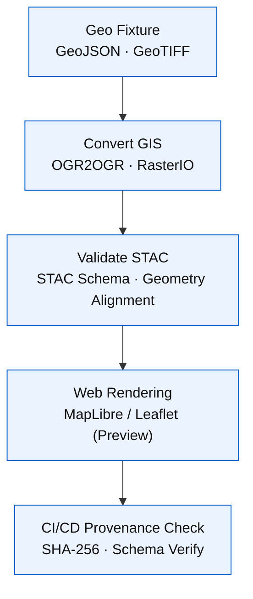

<div align="center">

# 🌍 Kansas Frontier Matrix — **Geo Fixtures**  
`tests/fixtures/geo/`

### *“Tiny Maps · True Coordinates · Total Reproducibility.”*

[](../../../.github/workflows/tests.yml)  
[](../../../.github/workflows/stac-validate.yml)  
[](../../../docs/)  
[](../../../LICENSE)

</div>

---

```yaml
---
title: "KFM • Geo Fixtures (tests/fixtures/geo/)"
version: "v1.3.0"
last_updated: "2025-10-17"
created: "2025-09-28"
owners: ["@kfm-data", "@kfm-gis", "@kfm-ci"]
status: "Stable"
maturity: "Production"
tags: ["geojson","raster","fixtures","gis","stac","mcp","testing"]
license: "MIT"
semantic_alignment:
  - GeoJSON RFC 7946
  - STAC 1.0.0
  - EPSG:4326 (WGS84)
  - FAIR Principles (Accessible & Reusable Data)
  - MCP-DL v6.3 Reproducibility + Provenance
---
```

---

## 🧭 Overview

The **Geo Fixtures** directory provides **small-scale spatial datasets** — both **vector (GeoJSON)** and **raster (GeoTIFF/COG)** —  
used to validate KFM’s **GIS**, **ETL**, and **STAC** workflows. Each fixture is compact, schema-valid, and designed for deterministic testing.

- 🌐 **Spatially Accurate** — All data projected to EPSG:4326 (WGS84)  
- 🧩 **Schema-Aligned** — Follows GeoJSON RFC 7946 and STAC 1.0.0 conventions  
- 📦 **Lightweight** — Ideal for fast CI/CD validation  
- 🧾 **Traceable** — Embedded checksums and metadata for full provenance  

> **Purpose:** Ensure all KFM GIS pipelines and STAC builders work seamlessly, reproducibly, and in compliance with open spatial data standards.

---

## ⚙️ Architecture


<!-- END OF MERMAID -->

---

## 🗂 Directory Layout

```text
tests/fixtures/geo/
├── ks_county_sample.geojson   # Simplified Kansas county boundaries
├── tiny_vector.geojson        # Two-point vector dataset (Larned, Ellsworth)
├── dem_sample.tif             # 10×10 DEM raster
├── tiny_cog.tif               # Cloud-Optimized GeoTIFF sample
└── README.md                  # This documentation file
```

---

## 🧩 Fixture Summary

| File | Type | Description | CRS | Used By |
|:-----|:-----|:-------------|:----|:--------|
| `ks_county_sample.geojson` | Vector | Polygon boundaries for select Kansas counties | EPSG:4326 | `convert_gis.py`, reprojection tests |
| `tiny_vector.geojson` | Vector | Two-point test sample (Larned, Ellsworth) | EPSG:4326 | CI feature parsing + validation |
| `dem_sample.tif` | Raster | 10×10 elevation raster | EPSG:4326 | Raster metadata + COG validation |
| `tiny_cog.tif` | Raster (COG) | Cloud-Optimized GeoTIFF | EPSG:4326 | Integrity and checksum testing |

---

## 🧠 Example Fixture — `tiny_vector.geojson`

```json
{
  "type": "FeatureCollection",
  "features": [
    {
      "type": "Feature",
      "properties": { "name": "Larned", "county": "Pawnee" },
      "geometry": { "type": "Point", "coordinates": [-99.1012, 38.1803] }
    },
    {
      "type": "Feature",
      "properties": { "name": "Ellsworth", "county": "Ellsworth" },
      "geometry": { "type": "Point", "coordinates": [-98.2289, 38.7312] }
    }
  ],
  "crs": {
    "type": "name",
    "properties": { "name": "EPSG:4326" }
  }
}
```

> Minimal and schema-valid GeoJSON sample used to validate projection logic and feature integrity.

---

## 🧪 Testing Integration

These geo fixtures support testing across KFM modules:

- `tools/convert_gis.py` — Vector/raster reprojection validation  
- `tools/validate_stac.py` — Geometry alignment and STAC spatial validation  
- `tools/tests/test_convert_gis.py` — End-to-end integration with temporary layers  
- `web/src/components/MapView` — Snapshot tests for rendered output  

Example validation test:

```python
import json
from pathlib import Path

def test_geojson_valid(fixtures_dir):
    geo = json.loads((fixtures_dir / "geo/tiny_vector.geojson").read_text())
    assert geo["type"] == "FeatureCollection"
    assert all("geometry" in f for f in geo["features"])
```

---

## 🧮 Regeneration Workflow

| Step | Tool | Purpose |
|:----:|:-----|:---------|
| 1️⃣ | `tools/notebooks/gis_processing.ipynb` | Generate or update geometry samples |
| 2️⃣ | `GDAL` / `ogr2ogr` | Reproject to EPSG:4326 |
| 3️⃣ | `rio-cogeo` | Convert rasters to COG format |
| 4️⃣ | `sha256sum` | Produce fixture checksums for provenance |
| 5️⃣ | `pytest` | Validate file readability and schema integrity |

All regenerated files are committed with a new checksum and version entry under CI validation.

---

## ♿ Accessibility & Standards

- CRS defined (`EPSG:4326`) and stored in metadata  
- UTF-8 encoding for all GeoJSON fixtures  
- Filenames descriptive, lowercase, hyphenated  
- Conforms to **GeoJSON RFC 7946** & **STAC 1.0.0 spatial standards**  
- Rasters ≤10×10 pixels for fast validation  
- Visual demos conform to **WCAG 2.1 AA** contrast ratios  

---

## 🧾 Provenance & Integrity

| Artifact | Description |
|:----------|:-------------|
| **Inputs** | Synthetic geometries & DEM rasters from open datasets |
| **Outputs** | Minimal reproducible GeoJSON/COG test assets |
| **Dependencies** | GDAL · rasterio · geopandas |
| **Integrity** | SHA-256 checksum per file, verified under CI |
| **Traceability** | Linked to regeneration notebook commits |

---

## 🧮 Versioning & Metadata

| Field | Value |
|:------|:------|
| **Version** | `v1.3.0` |
| **Codename** | *Micro-Geo Sample Alignment* |
| **Last Updated** | 2025-10-17 |
| **Maintainers** | @kfm-data · @kfm-gis |
| **License** | MIT (code) · CC-BY 4.0 (docs) |
| **Semantic Alignment** | GeoJSON RFC 7946 · STAC 1.0.0 · EPSG:4326 · MCP-DL v6.3 |
| **Maturity** | Production |
| **Integrity** | All fixtures checksum-verified via CI |

---

## 🧾 CHANGELOG

| Version | Date | Author | Summary |
|:--------|:------|:--------|:--------|
| **v1.3.0** | 2025-10-17 | @kfm-gis | Added metadata versioning and WCAG-compliant previews |
| **v1.2.0** | 2025-10-10 | @kfm-data | Expanded raster samples, updated reprojection |
| **v1.1.0** | 2025-09-30 | @kfm-ci | Introduced `tiny_cog.tif` and deterministic test data |
| **v1.0.0** | 2025-09-25 | @kfm-data | Initial GeoJSON and DEM test fixture set |

---

## 🧠 MCP-DL v6.3 Compliance

| Principle | Implementation |
|:-----------|:----------------|
| **Documentation-First** | Fully versioned README with schema and sample coverage |
| **Reproducibility** | Generated from reproducible notebooks with checksum validation |
| **Provenance** | Embedded CRS, metadata, and SHA-256 integrity fields |
| **Accessibility** | Open, readable GeoJSON with WCAG-compliant demos |
| **Open Standards** | GeoJSON RFC 7946, STAC 1.0.0, EPSG:4326 |
| **Auditability** | CI validation for all geometry and raster assets |

---

<div align="center">

**© Kansas Frontier Matrix — Geo Fixtures**  
Maintained under the **Master Coder Protocol (MCP)**  

[]()  
[]()

</div>