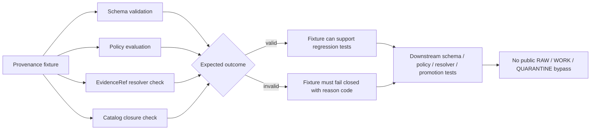

<!-- [KFM_META_BLOCK_V2]
doc_id: kfm://doc/NEEDS_VERIFICATION__provenance_fixtures_readme
title: Provenance Fixtures
type: standard
version: v1
status: draft
owners: NEEDS_VERIFICATION__tests_owner
created: NEEDS_VERIFICATION__YYYY-MM-DD
updated: 2026-04-27
policy_label: NEEDS_VERIFICATION__public_or_internal
related: [../README.md, ../../README.md, ../../../README.md, ../../../contracts/README.md, ../../../schemas/README.md, ../../../policy/README.md, ../../../data/catalog/README.md, ../../../data/receipts/README.md, ../../../data/proofs/README.md]
tags: [kfm, tests, fixtures, provenance, prov, evidence-bundle, run-receipt, catalog-closure]
notes: [Created as a repo-ready draft for tests/fixtures/provenance/README.md from attached KFM doctrine and surfaced fixture README patterns. Exact leaf subtree, owner, policy label, created date, validator command, and active-branch fixture inventory remain NEEDS VERIFICATION because no mounted KFM repository was visible in this session.]
[/KFM_META_BLOCK_V2] -->

<a id="top"></a>

# Provenance Fixtures

Deterministic, public-safe fixture lane for proving that KFM can recognize provenance success, provenance failure, and catalog-lineage closure without treating test data as authoritative truth.

> [!NOTE]
> **Status:** `experimental`  
> **Owners:** `NEEDS_VERIFICATION__tests_owner`  
> **Path:** `tests/fixtures/provenance/README.md`  
> **Repo fit:** child fixture README under `tests/fixtures/`; supports schema, policy, resolver, catalog-closure, receipt/proof, and promotion-gate tests without owning any of those authorities.  
> **Quick jumps:** [Scope](#scope) · [Repo fit](#repo-fit) · [Accepted inputs](#accepted-inputs) · [Exclusions](#exclusions) · [Directory tree](#directory-tree) · [Quickstart](#quickstart) · [Usage](#usage) · [Diagram](#diagram) · [Operating tables](#operating-tables) · [Task list](#task-list--definition-of-done) · [FAQ](#faq) · [Appendix](#appendix)


> [!IMPORTANT]
> This README is **fixture-bounded**. It documents the intended role of `tests/fixtures/provenance/`; it does not claim that active-branch validators, CI wiring, emitted receipt/proof objects, or exact fixture files already exist.

> [!WARNING]
> Do not turn this directory into a hidden provenance store. Production lineage belongs in governed emitted-artifact lanes such as `data/catalog/`, `data/receipts/`, `data/proofs/`, or the repo-native equivalents confirmed by the active branch.

---

## Scope

`tests/fixtures/provenance/` exists to hold **small, deterministic, reviewable** examples that let KFM tests prove whether provenance-bearing objects are structurally coherent and policy-admissible.

Use this directory for fixture cases that answer questions like:

- Can an `EvidenceRef` resolve to an `EvidenceBundle` without loose citation habits?
- Does a PROV bundle identify the same subject as the related STAC/DCAT/catalog fixture?
- Does a `run_receipt` point to process memory without pretending to be a proof pack?
- Does a release candidate fail closed when provenance, source identity, license, digest, or catalog closure is missing?
- Can validators distinguish a genuinely valid lineage fixture from a plausible-looking but unsupported one?

### Truth labels used here

| Label | Meaning in this README |
| --- | --- |
| **CONFIRMED** | Supported by attached KFM doctrine, surfaced repo-facing README patterns, or direct current-session workspace inspection. |
| **INFERRED** | Conservative fit with adjacent KFM fixture and runtime-proof patterns, but not directly proven as active-branch leaf reality. |
| **PROPOSED** | Recommended target shape or future fixture class consistent with KFM doctrine. |
| **UNKNOWN** | Not verified strongly enough to describe as current repo fact. |
| **NEEDS VERIFICATION** | Path, owner, link, fixture inventory, command, or workflow claim that should be checked against the active branch before merge. |

### Current evidence posture

| Surface | Status | Why it matters |
| --- | --- | --- |
| `tests/fixtures/provenance/README.md` target file | **NEEDS VERIFICATION** | No mounted KFM checkout was visible in this session, so the active branch could not be inspected directly. |
| `tests/fixtures/` as a fixture authority boundary | **CONFIRMED doctrine / PROPOSED repo realization** | KFM documentation separates fixtures from contracts, schemas, policy, emitted receipts, and proofs. |
| Exact fixture inventory under this leaf | **UNKNOWN** | This README must not pretend to know file names already committed under `provenance/`. |
| Validator command for provenance fixtures | **UNKNOWN** | Proposed commands below are review targets, not current implementation proof. |
| Owner and policy label | **NEEDS VERIFICATION** | Use the active `CODEOWNERS`, maintainership docs, and policy registry before replacing placeholders. |

[Back to top](#top)

---

## Repo fit

**Path:** `tests/fixtures/provenance/README.md`

This directory is a **verification-support lane**. It sits downstream of semantic contracts and executable schemas, beside sibling fixture lanes, and upstream of tests that prove KFM can fail closed.

| Direction | Surface | Role | Status |
| --- | --- | --- | --- |
| Parent | [`../README.md`](../README.md) | Fixture-family orientation and shared rules. | **NEEDS VERIFICATION** |
| Test boundary | [`../../README.md`](../../README.md) | Test suite posture, runner expectations, and review burden. | **NEEDS VERIFICATION** |
| Root | [`../../../README.md`](../../../README.md) | Repo entry point and contributor orientation. | **NEEDS VERIFICATION** |
| Semantic contracts | [`../../../contracts/README.md`](../../../contracts/README.md) | Meaning, field intent, lifecycle semantics, and object responsibilities. | **NEEDS VERIFICATION** |
| Executable schemas | [`../../../schemas/README.md`](../../../schemas/README.md) | Machine-checkable shape and validation constraints. | **NEEDS VERIFICATION** |
| Policy authority | [`../../../policy/README.md`](../../../policy/README.md) | Rights, sensitivity, release, deny/allow/abstain rules. | **NEEDS VERIFICATION** |
| Catalog artifacts | [`../../../data/catalog/README.md`](../../../data/catalog/README.md) | Emitted catalog instances and outward discoverability. | **NEEDS VERIFICATION** |
| Receipts | [`../../../data/receipts/README.md`](../../../data/receipts/README.md) | Process memory from runs, validations, or gates. | **NEEDS VERIFICATION** |
| Proofs | [`../../../data/proofs/README.md`](../../../data/proofs/README.md) | Release-significant proof packs, attestations, and verifier-facing bundles. | **NEEDS VERIFICATION** |

> [!TIP]
> If the active branch uses a different emitted-artifact layout, update the links rather than weakening the boundary. The fixture rule stays the same: **fixtures prove expected success and failure behavior; emitted artifacts prove specific events or releases.**

[Back to top](#top)

---

## Accepted inputs

Add only tiny, public-safe fixtures that are easy to inspect in a code review.

Accepted fixture classes include:

- minimal PROV entity/activity/agent examples;
- STAC/DCAT/PROV cross-link examples for catalog-closure tests;
- `EvidenceRef` → `EvidenceBundle` resolution examples;
- `run_receipt` → PROV activity linkage examples;
- release-candidate provenance sidecars with deterministic `sha256:` digests;
- invalid examples for missing source URI, missing license, missing digest, unresolved evidence reference, mismatched subject identity, or receipt/proof role collapse;
- small JSON or JSON-LD objects used by no-network validators.

### Naming guidance

Prefer names that state both expected outcome and failure reason:

```text
minimal_prov_bundle.valid.json
catalog_closure.valid.json
run_receipt_linked.valid.json
missing_source_uri.invalid.json
missing_license.invalid.json
digest_mismatch.invalid.json
unresolved_evidence_ref.invalid.json
receipt_as_proof.invalid.json
```

[Back to top](#top)

---

## Exclusions

This directory must not contain or silently become:

- authoritative source truth;
- live provider mirrors;
- canonical contracts or schema definitions;
- policy bundles or Rego rule ownership;
- production receipts, proof packs, signed attestations, or release manifests;
- raw, work, quarantine, processed, or published data stores;
- sensitive exact locations, private records, credentials, secrets, API keys, or unredacted identifiers;
- large binary artifacts;
- exploratory packet material unless converted into a clearly bounded fixture case.

> [!CAUTION]
> A fixture may reference a receipt, proof, catalog item, or evidence bundle shape, but it must not replace those owning lanes. KFM keeps these seams visible so a reviewer can ask what happened, what was proven, what was released, and what can be rolled back.

[Back to top](#top)

---

## Directory tree

PROPOSED starter shape — verify the active branch before creating or renaming files:

```text
tests/fixtures/provenance/
├── README.md
├── valid/
│   ├── minimal_prov_bundle.valid.json
│   ├── catalog_closure.valid.json
│   └── run_receipt_linked.valid.json
├── invalid/
│   ├── missing_source_uri.invalid.json
│   ├── missing_license.invalid.json
│   ├── digest_mismatch.invalid.json
│   ├── unresolved_evidence_ref.invalid.json
│   └── receipt_as_proof.invalid.json
└── expected/
    ├── catalog_closure.report.json
    └── fail_closed.reason_codes.json
```

### File-size rule of thumb

Keep committed provenance fixtures small enough that reviewers can read them without tooling. Larger examples belong in generated test artifacts or emitted proof lanes, not this directory.

[Back to top](#top)

---

## Quickstart

### 1. Inspect what is actually present

```bash
find tests/fixtures/provenance -maxdepth 3 -type f | sort
```

### 2. Confirm fixtures stay small and text-reviewable

```bash
find tests/fixtures/provenance -type f -size +25k -print
```

Expected result for ordinary fixtures: no output.

### 3. Run the repo-native validator

NEEDS VERIFICATION — replace this placeholder with the active branch’s real command before CI usage:

```bash
python -m tools.validators.provenance.validate_fixture \
  --fixture-root tests/fixtures/provenance \
  --schema-root schemas
```

### 4. Prove negative cases fail closed

NEEDS VERIFICATION — use the active validator and expected reason-code format:

```bash
python -m tools.validators.provenance.validate_fixture \
  --fixture tests/fixtures/provenance/invalid/missing_source_uri.invalid.json \
  --expect-deny policy.provenance.source_uri_missing
```

[Back to top](#top)

---

## Usage

Use these fixtures in tests that need deterministic provenance behavior without live network calls.

### Schema tests

Schema tests should load fixture JSON and assert that:

- valid examples pass the active schema;
- invalid examples fail for the expected structural reason;
- additional properties are rejected where the schema requires strictness;
- digest fields use the repo’s accepted `sha256:` form.

### Policy tests

Policy tests should assert that missing or unsafe provenance cannot proceed quietly.

Expected fail-closed cases include:

| Case | Expected behavior |
| --- | --- |
| Missing source URI | `DENY` or equivalent policy failure. |
| Missing license or rights posture | `DENY` or equivalent policy failure. |
| Missing provenance support | `ABSTAIN`, `DENY`, or equivalent non-promotable state, depending on claim class. |
| Digest mismatch | `ERROR` or explicit integrity failure. |
| Unresolved `EvidenceRef` | `ABSTAIN` or explicit resolver failure. |
| Receipt presented as proof | `DENY` or explicit role-collapse failure. |

### Resolver tests

Resolver tests may use these fixtures to prove:

1. `EvidenceRef` is not a pasted URL.
2. Resolution returns a bounded `EvidenceBundle`.
3. The bundle carries source identity, lineage, rights/sensitivity posture, and review/release state.
4. Failure to resolve does not produce a fluent but unsupported answer.

### Catalog-closure tests

Catalog-closure tests should verify that STAC, DCAT, and PROV fixtures agree on:

- subject identity;
- scope;
- version or release candidate identity;
- source role;
- correction or rollback posture where relevant.

[Back to top](#top)

---

## Diagram



Plain-language reading: a provenance fixture is useful only when tests can prove both the happy path and the failure path. Valid fixtures support regression tests; invalid fixtures prove KFM does not silently promote weak lineage.

[Back to top](#top)

---

## Operating tables

### Fixture class matrix

| Fixture class | Example name | Proves | Required posture |
| --- | --- | --- | --- |
| Minimal PROV bundle | `minimal_prov_bundle.valid.json` | Entity/activity/agent structure is recognizable. | **PROPOSED** |
| Catalog closure | `catalog_closure.valid.json` | STAC/DCAT/PROV identify the same subject. | **PROPOSED** |
| Run receipt linkage | `run_receipt_linked.valid.json` | Process memory can link to provenance without becoming proof. | **PROPOSED** |
| Missing source URI | `missing_source_uri.invalid.json` | Source identity is required. | **PROPOSED** |
| Missing license | `missing_license.invalid.json` | Rights posture is required before release-significant use. | **PROPOSED** |
| Digest mismatch | `digest_mismatch.invalid.json` | Integrity checks fail closed. | **PROPOSED** |
| Unresolved evidence ref | `unresolved_evidence_ref.invalid.json` | Loose citations cannot masquerade as evidence. | **PROPOSED** |
| Role collapse | `receipt_as_proof.invalid.json` | Receipts, proofs, catalogs, and publication objects remain distinct. | **PROPOSED** |

### Boundary map

| Layer | Owns | Must not silently own |
| --- | --- | --- |
| `contracts/` | Object meaning, field intent, lifecycle semantics. | Executable validation as the only source of truth. |
| `schemas/` | Machine-checkable shape, constraints, enums, fragments. | Semantic explanation as the only source of meaning. |
| `policy/` | Allow/deny/abstain logic, rights, sensitivity, release obligations. | Generic object semantics. |
| `tests/fixtures/provenance/` | Valid and invalid provenance exemplars. | Production doctrine, emitted receipts, proof packs, or source truth. |
| `data/catalog/` | Catalog instances and discoverability records. | Contract definitions. |
| `data/receipts/` | Process memory. | Release proof or catalog truth. |
| `data/proofs/` | Release-significant proof objects and verification bundles. | Raw data, policy definitions, or routine run chronology. |

[Back to top](#top)

---

## Task list / definition of done

Before this README is treated as merged documentation, confirm:

- [ ] KFM meta block placeholders are resolved or intentionally left with review notes.
- [ ] Owners are confirmed from active `CODEOWNERS` or maintainer routing.
- [ ] Relative links resolve from `tests/fixtures/provenance/README.md`.
- [ ] Fixture names match active test and validator conventions.
- [ ] Valid fixtures pass the repo-native validator with no network access.
- [ ] Invalid fixtures fail with deterministic reason codes.
- [ ] No fixture contains secrets, credentials, sensitive exact locations, private records, or large binary data.
- [ ] Every fixture links to a contract, schema, policy surface, or validator expectation where applicable.
- [ ] STAC/DCAT/PROV closure fixtures use one consistent subject identity.
- [ ] `run_receipt` examples are not presented as proof packs.
- [ ] Receipt/proof/catalog/publication seams stay visible in tests and prose.
- [ ] No test path implies public access to RAW, WORK, QUARANTINE, or unpublished candidate data.
- [ ] Rollback is simple: remove the README and fixture files without data migration or public release impact.

[Back to top](#top)

---

## FAQ

### Is this a production provenance directory?

No. It is a fixture directory. Production or emitted provenance belongs in the repo’s governed data/catalog/proof/receipt layout after that layout is verified.

### Why include invalid fixtures?

Invalid fixtures are how KFM proves fail-closed behavior. A provenance validator that only tests happy paths cannot prove the trust membrane.

### Can a fixture include STAC or DCAT content?

Yes, when the fixture is tiny and clearly scoped to catalog-closure testing. The fixture still does not become the STAC/DCAT authority.

### Can fixtures reference sibling `EvidenceBundle` or `run_receipt` examples?

Yes, as long as the reference is explicit and the test confirms the object role. A receipt records process memory; an `EvidenceBundle` groups support; a proof pack supports release-significant verification.

### Should these fixtures use live source URLs?

Only if the URL is part of a tiny, public, rights-reviewed example and no test performs a live fetch by default. CI should remain no-network unless a separate live-source probe is explicitly configured.

### What should happen when provenance is incomplete?

The test should expect a bounded negative outcome: `ABSTAIN`, `DENY`, or `ERROR`, depending on the validator or policy surface. It should not expect a promoted claim.

[Back to top](#top)

---

## Appendix

<details>
<summary><strong>Illustrative fixture metadata sidecar</strong></summary>

The following shape is illustrative. Replace it with the repo-approved schema before committing executable fixtures.

```json
{
  "fixture_id": "kfm://fixture/provenance/minimal",
  "fixture_status": "valid",
  "expected_outcome": "PASS",
  "subject_ref": "kfm://fixture/subject/demo-release-candidate",
  "object_family": "provenance",
  "links": {
    "prov_bundle": "valid/minimal_prov_bundle.valid.json",
    "evidence_bundle": "../evidence_bundle/valid/minimal.valid.json",
    "run_receipt": "../run_receipt/valid/minimal.valid.json"
  },
  "checks": {
    "schema_valid": true,
    "source_uri_present": true,
    "license_present": true,
    "digest_fields_present": true,
    "evidence_ref_resolves": true,
    "receipt_not_used_as_proof": true
  },
  "notes": [
    "Illustrative only until active schema and validator command are verified."
  ]
}
```

</details>

<details>
<summary><strong>Review checklist for new provenance fixtures</strong></summary>

| Check | Pass condition |
| --- | --- |
| Public-safe content | No secrets, credentials, sensitive exact locations, or private data. |
| Size | Small enough for normal code review. |
| Role clarity | Fixture clearly states whether it is valid or invalid. |
| Expected result | Expected outcome and reason code are deterministic. |
| Source identity | Source URI or source descriptor reference is present when required. |
| Rights posture | License, attribution, or rights state is explicit where required. |
| Integrity | Digests use the repo-approved format and are stable. |
| Resolver behavior | `EvidenceRef` either resolves or fails with the expected bounded negative outcome. |
| Catalog closure | STAC/DCAT/PROV references agree when closure is claimed. |
| Seam preservation | Receipt, proof, catalog, and publication roles do not collapse into one object. |

</details>

[Back to top](#top)
