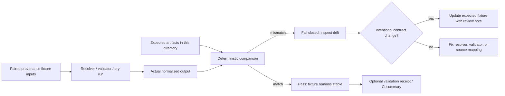

<!-- [KFM_META_BLOCK_V2]
doc_id: kfm://doc/NEEDS_VERIFICATION__tests_fixtures_provenance_expected_readme
title: Provenance Expected Fixtures
type: standard
version: v1
status: draft
owners: @bartytime4life
created: 2026-04-27
updated: 2026-04-27
policy_label: NEEDS_VERIFICATION__public_fixture_doc
related: [
  ../README.md,
  ../../README.md,
  ../../../README.md,
  ../../../../README.md,
  ../../../../schemas/contracts/v1/evidence_ref.schema.json,
  ../../../../schemas/contracts/v1/evidence_bundle.schema.json,
  ../../../../schemas/contracts/v1/policy_decision.schema.json,
  ../../../../schemas/contracts/v1/run_receipt.schema.json,
  ../../../../schemas/contracts/v1/release_manifest.schema.json,
  ../../../../data/receipts/README.md,
  ../../../../data/proofs/README.md,
  ../../../../docs/registers/SOURCE_LEDGER.md,
  ../../../../tools/validators/README.md,
  ../../../../.github/workflows/README.md
]
tags: [kfm, tests, fixtures, provenance, expected, evidence, receipts, proofs, validation]
notes: [
  Target path requested in-session: tests/fixtures/provenance/expected/README.md.
  Local mounted KFM repository was not available during this authoring pass; exact parent README inventory, fixture filenames, workflow wiring, and schema-home authority remain NEEDS VERIFICATION.
  Owner is carried from surfaced KFM repo-facing README patterns; exact leaf-path ownership should be rechecked against CODEOWNERS before merge.
  This README describes deterministic expected/golden fixture outputs only; it does not claim executable test-runner behavior.
]
[/KFM_META_BLOCK_V2] -->

<a id="top"></a>

# Provenance Expected Fixtures

Deterministic golden-output fixtures for proving that KFM provenance chains remain reconstructable, policy-aware, and safe to compare in CI.

> [!IMPORTANT]
> **Status:** experimental  
> **Owners:** `@bartytime4life` *(leaf-path ownership **NEEDS VERIFICATION** before merge)*  
> **Path:** `tests/fixtures/provenance/expected/README.md`  
> **Role:** expected-output fixture lane for provenance, receipt, proof, and evidence-resolution tests  
> **Quick jumps:** [Scope](#scope) · [Repo fit](#repo-fit) · [Accepted inputs](#accepted-inputs) · [Exclusions](#exclusions) · [Directory tree](#directory-tree) · [Quickstart](#quickstart) · [Usage](#usage) · [Diagram](#diagram) · [Fixture contract](#fixture-contract) · [Definition of done](#definition-of-done) · [FAQ](#faq) · [Appendix](#appendix)
>
> 
> 
> 
> 
> 
> 

---

## Scope

This directory is the **expected-output side** of provenance fixture testing.

It belongs to tests that ask questions like:

- Can an `EvidenceRef` resolve to the expected `EvidenceBundle`?
- Did a run receipt preserve deterministic execution facts without becoming a proof pack?
- Did a policy decision remain finite, reason-bearing, and separate from the receipt?
- Does a PROV-shaped lineage bundle still connect entities, activities, and agents?
- Did a validator fail closed when evidence, source role, rights, or sensitivity data was missing?

This lane is intentionally narrow: it holds **small, deterministic, public-safe expected artifacts** used for comparison. It is not a home for raw data, generated runtime output, schemas, policy code, or live source material.

[Back to top](#top)

---

## Repo fit

| Relationship | Path | Status | Why it matters |
|---|---:|---|---|
| This README | `tests/fixtures/provenance/expected/README.md` | **PROPOSED / NEEDS VERIFICATION** | Requested target path for this documentation pass. |
| Parent provenance fixture lane | [`../README.md`](../README.md) | **NEEDS VERIFICATION** | Should define the paired provenance fixture set. |
| Broader fixture lane | [`../../README.md`](../../README.md) | **NEEDS VERIFICATION** | Should define fixture conventions across test families. |
| Test family boundary | [`../../../README.md`](../../../README.md) | **NEEDS VERIFICATION** | Should define test posture, ownership, and runner conventions. |
| Evidence contracts | `../../../../schemas/contracts/v1/` | **PROPOSED / NEEDS VERIFICATION** | Expected artifacts should remain aligned with contract schemas. |
| Receipt lane | [`../../../../data/receipts/README.md`](../../../../data/receipts/README.md) | **NEEDS VERIFICATION** | Receipts are process memory; expected receipt fixtures should preserve that separation. |
| Proof lane | [`../../../../data/proofs/README.md`](../../../../data/proofs/README.md) | **NEEDS VERIFICATION** | Proof packs should not be collapsed into receipts or expected runtime envelopes. |
| Source ledger | [`../../../../docs/registers/SOURCE_LEDGER.md`](../../../../docs/registers/SOURCE_LEDGER.md) | **NEEDS VERIFICATION** | Provenance expected artifacts should carry stable source identifiers. |
| Validator surface | [`../../../../tools/validators/README.md`](../../../../tools/validators/README.md) | **NEEDS VERIFICATION** | Expected outputs should match validator result shape and fail-closed semantics. |

> [!NOTE]
> The relative paths above are computed from `tests/fixtures/provenance/expected/`. Path existence and current branch naming still need direct repo verification.

[Back to top](#top)

---

## Accepted inputs

Only expected/golden fixture artifacts belong here.

| Accepted artifact | Typical filename pattern | Required posture |
|---|---|---|
| Evidence resolution fixture | `expected.evidence_bundle.json` | Resolves cited evidence without reading RAW, WORK, or QUARANTINE material. |
| Evidence reference fixture | `expected.evidence_ref.json` | Points to a resolvable evidence target and carries stable identifiers. |
| Run receipt fixture | `expected.run_receipt.json` | Records execution facts, `spec_hash`, input/output digests, and status without embedding proof or policy truth. |
| Policy decision fixture | `expected.policy_decision.json` | Uses finite decisions such as `ALLOW`, `DENY`, `ABSTAIN`, or `ERROR` with reason and obligations. |
| Validation report fixture | `expected.validation_report.json` | Records validator identity, subject refs, checks, errors, and fail-closed outcome. |
| PROV bundle fixture | `expected.prov.json` or `expected.prov.jsonld` | Preserves entity/activity/agent lineage in a small deterministic form. |
| Release manifest fixture | `expected.release_manifest.json` | Used only when the fixture exercises release or promotion closure. |
| Decision envelope fixture | `expected.decision_envelope.json` | Used only when the test asserts outward finite trust state. |

Expected artifacts should be:

- deterministic
- small
- reviewable in Git
- public-safe
- free of secrets
- normalized for stable comparison
- paired with a clear fixture scenario in the parent provenance fixture lane

[Back to top](#top)

---

## Exclusions

| Do not put here | Put it here instead | Reason |
|---|---|---|
| Raw source payloads | `../input/` or the repo’s governed RAW fixture lane | Expected outputs should not duplicate source material. |
| Actual generated test outputs | Test temp/output directories, CI artifacts, or ignored runtime paths | This directory is for committed goldens, not transient run products. |
| Canonical schemas | `../../../../schemas/contracts/v1/` | Schemas define contract law; fixtures only demonstrate expected examples. |
| Policy bundles or Rego files | `../../../../policy/` | Policy code must stay separate from expected decision examples. |
| Validator implementation | `../../../../tools/validators/` | Tests compare validator output; they do not store validator logic here. |
| Proof packs | `../../../../data/proofs/` or test fixture proof lane | Proof packs are not run receipts and should not be flattened into expected outputs. |
| Secrets, tokens, credentials | Nowhere in the repo | Provenance fixtures must remain public-safe. |
| Sensitive exact locations | Public-safe generalized fixture lanes only | KFM fails closed where location exposure or sensitivity is unclear. |
| Non-deterministic timestamps | Normalize or fixture-freeze under review | Golden comparisons must not drift across runs. |

[Back to top](#top)

---

## Directory tree

The exact current tree is **NEEDS VERIFICATION**. The shape below is the intended local pattern for this README’s directory.

```text
tests/fixtures/provenance/
├── README.md                         # parent fixture purpose and scenario map
├── input/                            # paired source-side fixture material, if used
│   └── README.md
└── expected/
    ├── README.md                     # this file
    ├── expected.evidence_ref.json    # optional golden EvidenceRef
    ├── expected.evidence_bundle.json # optional golden EvidenceBundle
    ├── expected.run_receipt.json     # optional golden run receipt
    ├── expected.policy_decision.json # optional golden policy decision
    ├── expected.validation_report.json
    ├── expected.prov.json
    └── expected.release_manifest.json
```

> [!TIP]
> A fixture scenario does not need every file above. Include only the expected artifacts that the paired test actually asserts.

[Back to top](#top)

---

## Quickstart

Use inspection-first commands until the active branch proves the test runner and validator entrypoints.

```bash
# From the repository root: inspect the expected fixture inventory.
find tests/fixtures/provenance/expected -maxdepth 2 -type f | sort

# Check for large or accidental binary artifacts.
find tests/fixtures/provenance/expected -type f -size +100k -print

# Check for common secret-looking tokens before committing fixture changes.
grep -RInE '(api[_-]?key|secret|token|password|bearer)' tests/fixtures/provenance/expected || true
```

> [!WARNING]
> Do not document or rely on a repo-specific runner such as `pytest`, `npm test`, `pnpm test`, `cargo test`, or a GitHub workflow name here until the checked-out branch proves it.

[Back to top](#top)

---

## Usage

Expected provenance fixtures are **comparators**. They should make it easy for a reviewer to see exactly what a validator, resolver, or pipeline dry-run is supposed to emit.

A healthy fixture update usually includes:

1. A small scenario in the parent provenance fixture lane.
2. One or more expected artifacts in this directory.
3. A test that compares actual output to these expected artifacts after normalization.
4. A review note explaining why the expected output changed.
5. No live network dependency.
6. No RAW, WORK, QUARANTINE, secret, or sensitive payload leakage.

### Review rhythm

| Change type | Review expectation |
|---|---|
| New expected fixture | Confirm it is public-safe, deterministic, and tied to a documented scenario. |
| Changed `EvidenceBundle` | Confirm EvidenceRefs still resolve and source roles remain visible. |
| Changed `RunReceipt` | Confirm receipt remains execution memory and does not absorb proof or policy semantics. |
| Changed `PolicyDecision` | Confirm finite decision, reason code, obligations, and policy package identity remain explicit. |
| Changed PROV bundle | Confirm entity/activity/agent links are preserved without overclaiming authority. |
| Removed expected artifact | Confirm the paired test and parent scenario no longer require it. |

[Back to top](#top)

---

## Diagram



The diagram is intentionally fixture-local. It does not claim a specific implementation framework, validator executable, or CI job name.

[Back to top](#top)

---

## Fixture contract

Expected artifacts should keep KFM’s provenance object families distinct.

| Object family | Must show | Must not do |
|---|---|---|
| `EvidenceRef` | Stable reference to resolvable evidence | Pretend the reference alone is the evidence bundle. |
| `EvidenceBundle` | Source IDs, scope, support, citation material, and review state as applicable | Read unpublished stores or hide missing evidence. |
| `RunReceipt` | Execution facts, run ID, `spec_hash`, inputs, outputs, status | Become a proof pack, policy decision, or public narrative. |
| `PolicyDecision` | Finite decision, reason, obligations, policy package identity | Collapse policy reasoning into a receipt body. |
| `ValidationReport` | Validator identity, subject, checks, errors, deterministic outcome | Smooth away `DENY`, `ABSTAIN`, or `ERROR` into a vague failure. |
| `PROV` bundle | Entities, activities, agents, and lineage relation | Promote lineage into authority without evidence review. |
| `ReleaseManifest` | Artifact refs, digests, catalog/proof closure, release identity | Publish from intermediate lifecycle states. |

### Naming guidance

Prefer names that make the assertion burden obvious:

```text
expected.evidence_bundle.json
expected.run_receipt.json
expected.policy_decision.deny_missing_provenance.json
expected.validation_report.invalid_missing_evidence_ref.json
expected.prov.json
```

Use suffixes such as `.invalid`, `.deny`, `.abstain`, or `.error` when the expected fixture intentionally represents a negative outcome.

[Back to top](#top)

---

## Definition of done

A change to this directory is ready for review when:

- [ ] Every expected artifact is small enough to review in Git.
- [ ] Every expected artifact is deterministic after normalization.
- [ ] Every expected artifact is public-safe and contains no secrets.
- [ ] Expected outputs do not duplicate raw source payloads.
- [ ] Negative outcomes remain visible and specific.
- [ ] Receipts, proofs, policy decisions, and release manifests remain separate.
- [ ] EvidenceRefs either resolve in the paired fixture context or the expected failure states why not.
- [ ] Any changed `spec_hash` is intentional and explained.
- [ ] Any changed source identifier is tied to a source-ledger or source-descriptor update.
- [ ] The active branch’s test runner, if documented elsewhere, can compare actual output to these expected files without live network access.
- [ ] Parent README links and scenario names still match this directory’s fixture names.

[Back to top](#top)

---

## FAQ

### Why are expected outputs committed?

Because KFM provenance claims need visible, reviewable comparator artifacts. A maintainer should be able to inspect what the system is expected to emit without replaying a live source connector.

### Can expected fixtures include timestamps?

Only when the timestamp is part of the assertion and is fixture-frozen. Volatile runtime timestamps should be normalized out or represented through deterministic placeholder values.

### Can this directory contain invalid fixtures?

Yes, when they are **expected invalid outputs** or expected failure examples. Name them clearly and keep the failure reason visible.

### Can a receipt fixture prove publication readiness?

No. A receipt records execution facts. Publication readiness requires the appropriate proof, catalog, policy, review, and release artifacts.

### Can a fixture read from RAW, WORK, or QUARANTINE?

No. Expected fixtures may reference governed fixture inputs, but normal public/test-facing assertions should not depend on canonical or unpublished stores.

[Back to top](#top)

---

## Appendix

<details>
<summary>Authoring checklist for a new provenance expected fixture</summary>

1. Create or identify the paired parent scenario.
2. Decide which object family is being asserted.
3. Freeze or normalize all volatile values.
4. Use stable IDs and deterministic ordering.
5. Preserve KFM object-family separation:
   - receipt ≠ proof
   - proof ≠ policy decision
   - EvidenceRef ≠ EvidenceBundle
   - release manifest ≠ runtime output
6. Add negative expected cases when they prove trust behavior.
7. Confirm the fixture does not contain:
   - credentials
   - live tokens
   - private user data
   - sensitive exact coordinates
   - large binaries
   - raw source payload duplication
8. Update the parent README or scenario registry if a new scenario was added.
9. Record unresolved assumptions with `NEEDS VERIFICATION` rather than hiding them.

</details>

<details>
<summary>Suggested reviewer questions</summary>

- What claim does this expected artifact prove?
- What evidence does it resolve to?
- What source role is being trusted?
- What policy decision applies?
- What would fail closed?
- What changed since the previous expected artifact?
- Is the fixture small enough for humans to review?
- Does the fixture preserve correction or rollback meaning if the assertion later changes?

</details>

[Back to top](#top)
