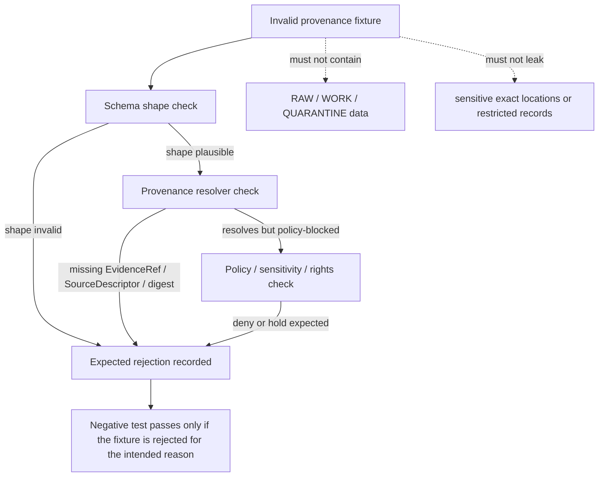

<!-- [KFM_META_BLOCK_V2]
doc_id: kfm://doc/NEEDS_VERIFICATION__tests_fixtures_provenance_invalid_readme
title: Invalid Provenance Fixtures
type: standard
version: v1
status: draft
owners: NEEDS_VERIFICATION__tests_or_provenance_owner
created: 2026-04-27
updated: 2026-04-27
policy_label: NEEDS_VERIFICATION__public_or_internal
related: [../README.md, ../../README.md, ../../../README.md, ../../../../contracts/README.md, ../../../../schemas/README.md, ../../../../policy/README.md, ../../../../tools/validators/README.md, ../../../../.github/workflows/README.md]
tags: [kfm, tests, fixtures, provenance, invalid, validation]
notes: [doc_id owner policy_label and related-link existence require active-checkout verification. Created and updated dates reflect this drafting pass, not pre-existing repository evidence. This README is fixture-facing and does not claim runnable validators, CI enforcement, or fixture inventory beyond the target path.]
[/KFM_META_BLOCK_V2] -->

# Invalid Provenance Fixtures

Known-bad provenance examples used to prove that KFM validators reject unsupported lineage, unresolved evidence, receipt/proof crossover, and publication-shaped claims without admissible support.

> [!IMPORTANT]
> **Status:** `experimental`  
> **Owners:** `NEEDS_VERIFICATION__tests_or_provenance_owner`  
> **Path:** `tests/fixtures/provenance/invalid/README.md`  
> **Repo fit:** child fixture README for intentionally invalid provenance-bearing examples under the broader `tests/fixtures/` verification boundary  
> **Quick jumps:** [Scope](#scope) · [Repo fit](#repo-fit) · [Accepted inputs](#accepted-inputs) · [Exclusions](#exclusions) · [Directory tree](#directory-tree) · [Quickstart](#quickstart) · [Usage](#usage) · [Diagram](#diagram) · [Failure matrix](#failure-matrix) · [Definition of done](#definition-of-done) · [FAQ](#faq) · [Appendix](#appendix)


> [!WARNING]
> These fixtures are **intentionally invalid**. They are not examples to copy into production data, source registries, release manifests, receipts, proofs, catalogs, or public UI payloads.

---

## Scope

This directory is for compact, deterministic, reviewable fixtures that should fail provenance validation.

In this README, **provenance** means the traceable support chain that lets KFM reconstruct how a claim, artifact, runtime envelope, receipt, proof, manifest, correction, or catalog record connects to admissible evidence, source role, validation state, release state, and correction lineage.

This leaf should help reviewers answer four questions:

1. Can the validator reject an object that looks plausible but cannot resolve its evidence?
2. Can it distinguish **receipt**, **proof**, **manifest**, **catalog**, and **runtime envelope** boundaries?
3. Can it fail closed when source role, rights, digest, release basis, or review state is missing?
4. Can invalid examples stay small enough to review without becoming fake production artifacts?

### Evidence labels used here

| Label | Meaning in this README |
|---|---|
| **CONFIRMED** | Strongly anchored in supplied KFM doctrine or directly verified in this authoring session |
| **INFERRED** | Consistent with adjacent KFM documentation patterns, but not re-proven against an active checkout |
| **PROPOSED** | Commit-ready guidance for this target path, not asserted as current implementation |
| **UNKNOWN** | Not supported strongly enough to state as active repo fact |
| **NEEDS VERIFICATION** | Must be checked against the mounted repository before merge |

[Back to top](#invalid-provenance-fixtures)

---

## Repo fit

**Path:** `tests/fixtures/provenance/invalid/README.md`

**Role in repo:** invalid-fixture guide for provenance-bearing objects. This leaf should document what belongs in the invalid side of the provenance fixture family and how failure expectations stay visible to reviewers.

### Upstream, lateral, and downstream surfaces

| Direction | Surface | Status | Why it matters |
|---|---|---:|---|
| Parent | [`../README.md`][provenance-readme] | NEEDS VERIFICATION | Should define the whole provenance fixture family, including valid and invalid sides |
| Parent | [`../../README.md`][fixtures-readme] | NEEDS VERIFICATION | Should define shared fixture placement rules |
| Upstream | [`../../../README.md`][tests-readme] | NEEDS VERIFICATION | Should define the broader test taxonomy |
| Contract semantics | [`../../../../contracts/README.md`][contracts-readme] | NEEDS VERIFICATION | Should define what provenance-bearing object families mean |
| Machine validation | [`../../../../schemas/README.md`][schemas-readme] | NEEDS VERIFICATION | Should point to executable schemas or schema-home rules |
| Policy constraints | [`../../../../policy/README.md`][policy-readme] | NEEDS VERIFICATION | Should define admissibility, rights, sensitivity, and release constraints |
| Validators | [`../../../../tools/validators/README.md`][validators-readme] | NEEDS VERIFICATION | Should define repo-native validation commands when available |
| CI / workflows | [`../../../../.github/workflows/README.md`][workflows-readme] | NEEDS VERIFICATION | Should describe whether invalid fixtures are merge-blocking |

> [!NOTE]
> The target file path is known from the requested task. The surrounding subtree, owner, validator command, workflow binding, and sibling fixture inventory remain **NEEDS VERIFICATION** until checked in the active repository.

[Back to top](#invalid-provenance-fixtures)

---

## Accepted inputs

Place a fixture here only when it is deliberately invalid and proves a specific rejection path.

| Input class | Why it belongs here | Expected validator posture |
|---|---|---|
| Missing or dangling `EvidenceRef` examples | Proves claims cannot cite absent support | Reject as unresolved provenance |
| `EvidenceBundle` examples with incomplete source basis | Proves bundle shape alone is not enough | Reject or abstain according to validator contract |
| Receipt/proof crossover examples | Proves receipts are process memory and proofs are separate | Reject explicit kind ambiguity |
| Missing digest, `spec_hash`, or artifact checksum examples | Proves integrity is not optional | Reject as incomplete provenance |
| Source descriptor examples without source role, rights, or identity | Proves source admission is explicit | Reject as inadmissible source basis |
| Release-like manifests without catalog/proof/review closure | Proves publication cannot be inferred from shape | Reject as not release-ready |
| Correction or rollback examples without affected object lineage | Proves correction lineage must be reconstructable | Reject as incomplete correction support |
| Runtime envelopes citing unavailable evidence | Proves response language cannot outrank EvidenceBundle resolution | Reject, deny, or abstain per finite outcome contract |
| Malformed PROV / provenance JSON-LD sketches | Proves syntax and relation structure are validated | Reject as schema or semantic invalid |

### Fixture naming rule

Use filenames that name the failure reason, not the domain story.

Preferred shape:

```text
<object-family>__<failure-reason>.invalid.json
```

Examples, all **PROPOSED** until schema names and reason codes are verified:

```text
evidence-bundle__missing-evidence-ref.invalid.json
run-receipt__missing-spec-hash.invalid.json
release-manifest__missing-proof-ref.invalid.json
correction-notice__missing-affected-object.invalid.json
runtime-response-envelope__unsupported-citation.invalid.json
```

[Back to top](#invalid-provenance-fixtures)

---

## Exclusions

This directory is intentionally narrow.

| Does **not** belong here | Put it here instead | Why |
|---|---|---|
| Valid provenance fixtures | `../valid/` or the parent provenance fixture family | Valid examples should prove acceptance separately from rejection |
| Semantic contract definitions | `../../../../contracts/` | Contracts explain meaning; fixtures prove recognition |
| Executable schemas | `../../../../schemas/` | Schemas define machine-checkable shape |
| Policy bundle source files | `../../../../policy/` | Policy owns admissibility, rights, sensitivity, and release logic |
| Validator implementations | `../../../../tools/validators/` | Validators should consume fixtures, not live inside them |
| Production receipts, proofs, manifests, catalogs, or release artifacts | governed `data/`, `release/`, or proof/receipt surfaces once verified | Emitted instances are not normative fixture definitions |
| RAW, WORK, or QUARANTINE source material | governed lifecycle zones only | Invalid fixtures must never smuggle ungoverned data into public test paths |
| Sensitive coordinates, living-person data, restricted DNA, exact protected-site locations, or steward-only source detail | restricted or quarantined stewardship surfaces | Invalid tests should prove denial without leaking the thing being denied |
| Live provider mirrors, scrape caches, or large downloaded examples | source registry, pipeline, or ignored local cache paths | Fixture directories should remain small, deterministic, and reviewable |

[Back to top](#invalid-provenance-fixtures)

---

## Directory tree

### Current safe claim

This authoring pass did **not** surface a mounted KFM checkout containing this target path. The tree below is a target shape for review, not a claim of current branch inventory.

```text
tests/fixtures/provenance/invalid/
├── README.md
├── *.invalid.json
└── *.invalid.yaml        # optional only if the active repo uses YAML fixtures
```

### Preferred target rhythm

```text
tests/fixtures/provenance/
├── README.md
├── valid/
│   └── README.md
└── invalid/
    ├── README.md
    ├── evidence-bundle__missing-evidence-ref.invalid.json
    ├── release-manifest__missing-proof-ref.invalid.json
    ├── run-receipt__missing-spec-hash.invalid.json
    └── runtime-response-envelope__unsupported-citation.invalid.json
```

> [!IMPORTANT]
> Add concrete filenames only after checking the active branch’s schema names, validator entry points, and approved reason-code registry.

[Back to top](#invalid-provenance-fixtures)

---

## Quickstart

### Safe inspection

Run these from `tests/fixtures/provenance/invalid/` after the real repository is mounted:

```bash
pwd
find . -maxdepth 2 -type f | sort
git -C ../../../../ status --short
git -C ../../../../ grep -n "provenance" -- tests schemas contracts policy tools 2>/dev/null || true
```

### Proposed invalid-fixture validation

The validator command is **NEEDS VERIFICATION**. Use the repo-native command when it exists. Until then, this is only a review placeholder:

```bash
# PROPOSED — replace with the active repo's real validator command.
python ../../../../tools/validators/validate_json_schema.py \
  --mode invalid \
  --fixtures .
```

Expected behavior:

```text
PASS: every fixture in this directory is rejected for the intended reason.
FAIL: any fixture is accepted, rejected for an unrelated reason, or requires network access.
```

[Back to top](#invalid-provenance-fixtures)

---

## Usage

### Contributor rule

When adding an invalid fixture, include a nearby reason comment only if the file format permits it. JSON fixtures cannot carry comments, so the filename and test case name must carry the failure reason.

### Review checklist for each fixture

| Check | Required? | Why |
|---|---:|---|
| File name ends in `.invalid.json` or approved equivalent | Yes | Keeps bad examples visually distinct |
| Failure reason is visible in the filename or test case | Yes | Lets reviewers understand intent before opening the file |
| Fixture is minimal | Yes | Prevents test data from becoming disguised documentation sprawl |
| No network is needed | Yes | Fixtures should be deterministic |
| No sensitive data is present | Yes | Invalid does not mean unsafe |
| Validator asserts rejection | Yes | Negative examples must fail for a known reason |
| Related contract/schema/policy path is documented | Yes, once verified | Prevents orphaned fixtures |

### Example invalid fixture pattern

<details>
<summary><strong>Illustrative only — unsupported citation envelope</strong></summary>

This sketch is intentionally incomplete and may not match the final schema. It exists to show the kind of failure this directory should make visible.

```json
{
  "version": "v1",
  "kind": "RuntimeResponseEnvelope",
  "outcome": "ANSWER",
  "claim": {
    "text": "A public claim was made without a resolvable evidence reference."
  },
  "citations": [
    {
      "evidence_ref": "kfm://evidence/DOES_NOT_EXIST"
    }
  ]
}
```

Expected rejection:

```text
PROVENANCE_UNRESOLVED or repo-approved equivalent:
citation evidence_ref does not resolve to an admissible EvidenceBundle.
```

</details>

[Back to top](#invalid-provenance-fixtures)

---

## Diagram



[Back to top](#invalid-provenance-fixtures)

---

## Failure matrix

| Failure family | Example invalid condition | Expected posture | Truth label |
|---|---|---|---|
| Schema shape | Required provenance field missing | Reject as schema invalid | PROPOSED |
| Evidence resolution | `EvidenceRef` cannot resolve to an `EvidenceBundle` | Reject or abstain according to owning validator | PROPOSED |
| Source admission | Source identity, role, rights, or support missing | Reject as inadmissible source basis | PROPOSED |
| Integrity | Digest, checksum, or `spec_hash` absent where required | Reject as incomplete integrity chain | PROPOSED |
| Receipt/proof boundary | Receipt claims proof authority or proof lacks declared basis | Reject boundary crossover | PROPOSED |
| Release closure | Manifest declares publication without catalog/proof/review closure | Reject as not publishable | PROPOSED |
| Correction lineage | Correction lacks affected object, reason, or replacement/supersession reference | Reject incomplete correction path | PROPOSED |
| Runtime response | Answer cites unsupported evidence or unsupported outcome | Reject, deny, or abstain per finite outcome rules | PROPOSED |
| Sensitivity | Fixture exposes sensitive exact data while trying to prove denial | Reject fixture as unsafe for this public path | PROPOSED |

> [!NOTE]
> Replace these posture names with the active repository’s approved reason and obligation registry once that registry is verified.

[Back to top](#invalid-provenance-fixtures)

---

## Definition of done

Before this README and any sibling invalid fixtures are treated as merge-ready:

- [ ] Active checkout confirms whether `tests/fixtures/provenance/invalid/` already exists.
- [ ] Parent fixture README links are verified or corrected.
- [ ] Owner is resolved from CODEOWNERS or the project’s current ownership register.
- [ ] Policy label is resolved.
- [ ] Concrete schema home is verified.
- [ ] Every invalid fixture is small, deterministic, and named by failure reason.
- [ ] Every invalid fixture is rejected by a repo-native validator.
- [ ] Negative tests assert the intended rejection reason, not merely “some failure happened.”
- [ ] No fixture requires network access.
- [ ] No fixture includes RAW, WORK, QUARANTINE, sensitive, restricted, or provider-mirror data.
- [ ] CI behavior is documented only after workflow YAML or platform settings are verified.
- [ ] Rollback is simple: revert this README and fixture additions without data migration or public-release changes.

[Back to top](#invalid-provenance-fixtures)

---

## FAQ

### Why keep invalid fixtures in their own directory?

Because KFM treats failure recognition as part of the trust model. Invalid fixtures make rejection behavior inspectable instead of relying on prose claims.

### Can an invalid fixture be realistic?

Yes, but it should be minimal. The goal is to prove one failure boundary, not to simulate a whole provider, release, or runtime.

### Can this directory contain malformed JSON?

Only if the test harness explicitly supports parser-failure cases. Otherwise malformed syntax can hide the provenance failure being tested.

### Should invalid fixtures include sensitive records to prove denial?

No. A fixture can prove denial using redacted, generalized, synthetic, or placeholder-safe content. Do not leak the data category the policy is supposed to protect.

### Does this README prove that validators or CI already exist?

No. Validator commands, workflow enforcement, and exact reason codes remain **NEEDS VERIFICATION** until confirmed in the active checkout.

[Back to top](#invalid-provenance-fixtures)

---

## Appendix

<details>
<summary><strong>Appendix A — Object-family cues for invalid provenance fixtures</strong></summary>

| Object family | Invalid fixture idea | What it proves |
|---|---|---|
| `SourceDescriptor` | Missing `source_id`, source role, rights, or support scope | Source admission must be explicit |
| `EvidenceRef` | Ref points to no bundle or mismatched bundle | Claims cannot cite ghosts |
| `EvidenceBundle` | Missing source basis, release basis, or correction lineage | Bundles must be reconstructable |
| `RunReceipt` / `IngestReceipt` / `AIReceipt` | Missing digest, run id, input/output refs, or policy context | Receipts are auditable process memory |
| `ReleaseManifest` | Published state without proof/catalog/review closure | Promotion is governed, not a file move |
| `CorrectionNotice` | No affected object or effective replacement | Correction lineage must remain visible |
| `DecisionEnvelope` / `RuntimeResponseEnvelope` | Unsupported citation, illegal outcome, or missing policy basis | Runtime language cannot outrank governed evidence |
| PROV / catalog record | Entity/activity/agent relation missing or public-safe geometry absent | Catalog prose cannot replace provenance structure |

</details>

<details>
<summary><strong>Appendix B — Change discipline</strong></summary>

When branch reality changes, update this README in this order:

1. Confirm parent and lateral links.
2. Replace owner and policy placeholders.
3. Replace proposed validator command with the real command.
4. Replace proposed reason names with the approved registry names.
5. Add only the concrete fixture filenames that exist.
6. Record any new exclusions needed to prevent fixture directories from becoming proof, release, or production data surfaces.

</details>

[Back to top](#invalid-provenance-fixtures)

[provenance-readme]: ../README.md
[fixtures-readme]: ../../README.md
[tests-readme]: ../../../README.md
[root-readme]: ../../../../README.md
[contracts-readme]: ../../../../contracts/README.md
[schemas-readme]: ../../../../schemas/README.md
[policy-readme]: ../../../../policy/README.md
[validators-readme]: ../../../../tools/validators/README.md
[workflows-readme]: ../../../../.github/workflows/README.md
