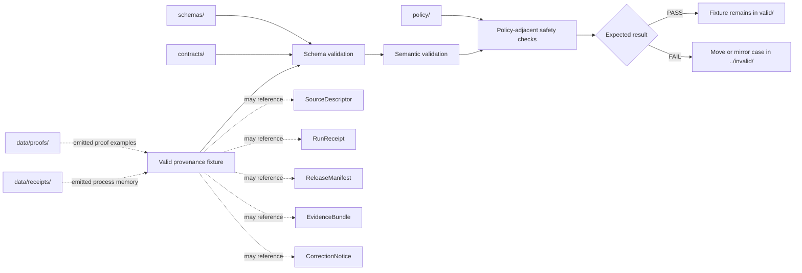

<!-- [KFM_META_BLOCK_V2]
doc_id: kfm://doc/NEEDS_VERIFICATION__tests_fixtures_provenance_valid_readme
title: Provenance Valid Fixtures
type: standard
version: v1
status: draft
owners: NEEDS_VERIFICATION__tests_or_provenance_fixture_owner
created: NEEDS_VERIFICATION__YYYY-MM-DD
updated: 2026-04-27
policy_label: NEEDS_VERIFICATION__public_or_internal
related: [../README.md, ../invalid/README.md, ../../README.md, ../../../README.md, ../../../../README.md, ../../../../contracts/README.md, ../../../../schemas/README.md, ../../../../policy/README.md, ../../../../data/receipts/README.md, ../../../../data/proofs/README.md]
tags: [kfm, tests, fixtures, provenance, valid, prov, evidence]
notes: [doc_id, owner, created date, policy label, active branch fixture inventory, validator command, and adjacent path existence remain NEEDS VERIFICATION. This README is fixture-facing and does not claim live workflow, promotion, signing, or production provenance implementation.]
[/KFM_META_BLOCK_V2] -->

<a id="top"></a>

# Provenance Valid Fixtures

Known-good provenance examples for proving that KFM lineage records can pass schema, semantic, policy-adjacent, and no-bypass validation without relying on live data.

| Field | Value |
|---|---|
| **Status** | `experimental` |
| **Owners** | `NEEDS_VERIFICATION__tests_or_provenance_fixture_owner` |
| **Path** | `tests/fixtures/provenance/valid/README.md` |
| **Repo fit** | Child fixture README for valid provenance examples under `tests/fixtures/provenance/`; sibling invalid cases belong in `../invalid/`. |
| **Truth posture** | `CONFIRMED` doctrine · `PROPOSED` fixture organization · `UNKNOWN` active-branch inventory |
| **Quick jumps** | [Scope](#scope) · [Repo fit](#repo-fit) · [Accepted inputs](#accepted-inputs) · [Exclusions](#exclusions) · [Directory tree](#directory-tree) · [Quickstart](#quickstart) · [Usage](#usage) · [Diagram](#diagram) · [Validation matrix](#validation-matrix) · [Definition of done](#definition-of-done) · [FAQ](#faq) · [Appendix](#appendix) |


> [!IMPORTANT]
> `valid/` means **expected to pass validation**, not “approved for publication,” “current production record,” or “proof that a live pipeline exists.”
>
> These fixtures are small, deterministic, public-safe examples that help validators recognize well-formed provenance. Production provenance, receipts, proof packs, release manifests, and catalog records remain owned by their dedicated runtime or data surfaces.

> [!NOTE]
> Active branch contents for this exact leaf are **NEEDS VERIFICATION**. Update the directory tree and fixture catalog after inspecting the real checkout.

---

## Scope

This directory is for **valid provenance fixtures**: compact records that should pass the current KFM provenance validation profile.

A valid provenance fixture should help answer:

- **What was produced?**
- **What was used to produce it?**
- **What activity produced it?**
- **Who or what agent performed the activity?**
- **Which KFM trust object does the lineage support or reference?**
- **Why is the example safe to keep in public test fixtures?**

This surface is intentionally narrow. It should prove the shape and semantics of lineage records, not become a shadow catalog, a storage lane, a promotion gate, or a real provider archive.

[Back to top](#top)

---

## Repo fit

### Where this directory sits

```text
tests/
└── fixtures/
    └── provenance/
        └── valid/
            └── README.md
```

### Upstream and downstream responsibilities

| Neighbor | Relationship | Responsibility |
|---|---|---|
| `../README.md` | parent provenance fixture lane | explains the provenance fixture family and sibling valid/invalid split |
| `../invalid/README.md` | sibling negative fixture lane | holds fixtures expected to fail deterministically |
| `../../README.md` | broader fixture boundary | explains how test fixtures should remain small, deterministic, and reviewable |
| `../../../README.md` | test-system boundary | explains how tests use fixtures without becoming doctrine |
| `../../../../contracts/README.md` | semantic authority | explains what provenance-bearing objects mean |
| `../../../../schemas/README.md` | executable shape authority | owns machine-checkable schema placement and versioning |
| `../../../../policy/README.md` | admissibility authority | owns allow/deny/restrict behavior and obligations |
| `../../../../data/receipts/README.md` | emitted process-memory surface | owns real run receipts when emitted |
| `../../../../data/proofs/README.md` | emitted proof surface | owns real proof objects when emitted |

> [!WARNING]
> Do not move contract meaning, schema authority, policy decisions, production evidence, or emitted proof objects into this fixture directory. Fixtures pressure-test those surfaces; they do not replace them.

[Back to top](#top)

---

## Accepted inputs

Valid fixtures in this directory may include small JSON or JSON-LD examples that demonstrate one clear provenance behavior.

| Input class | Belongs here when... | Example fixture intent |
|---|---|---|
| Minimal entity/activity/agent lineage | the record proves basic provenance completeness | “a processed artifact was generated by a named activity using a named input” |
| Source-to-output lineage | the record links a source reference to a processed or cataloged artifact without copying source data | “source descriptor plus input checksum produced a dataset version” |
| Run-linked provenance | the record references a run receipt or validation report without pretending to be that receipt/report | “activity is associated with a run identifier and validator agent” |
| Release-linked provenance | the record connects a release manifest or EvidenceBundle to its production activity | “released bundle was generated from validated artifacts” |
| Correction-linked provenance | the record preserves supersession or withdrawal lineage without becoming a correction notice | “replacement artifact was generated after correction activity” |
| Catalog-closure provenance | the record demonstrates a traceable connection among catalog, bundle, and artifact references | “catalog record points back to the generating activity” |
| Public-safe synthetic examples | values are fictional, minimized, and non-sensitive | “example IDs use `example.invalid` or `kfm://example/...` style placeholders” |

### Minimum properties of a valid fixture

A fixture in this directory should be:

- **static** — checked in as a stable file, not generated during validation;
- **small** — easy to review in a pull request;
- **deterministic** — no live fetch, current clock dependency, random ID, or hidden environment dependency;
- **public-safe** — no secrets, live tokens, private URLs, exact restricted locations, or personal data;
- **traceable** — entity, activity, agent, and relation roles are inspectable;
- **bounded** — it validates provenance, not publication readiness.

[Back to top](#top)

---

## Exclusions

| Does **not** belong here | Put it here instead | Why |
|---|---|---|
| Invalid provenance cases | `../invalid/` | negative-path behavior needs explicit failure fixtures |
| Canonical provenance contracts | `../../../../contracts/` | contracts own meaning and invariants |
| Provenance schemas | `../../../../schemas/` | schemas own executable validation shape |
| Policy rules or Rego bundles | `../../../../policy/` | policy owns admissibility, obligations, and denial logic |
| Real emitted run receipts | `../../../../data/receipts/` | receipts are process memory, not static fixture doctrine |
| Real emitted proof packs | `../../../../data/proofs/` | proofs are release/evidence artifacts, not examples |
| Release manifests as authoritative records | release or proof-bearing surfaces | valid provenance may reference a manifest, but must not replace it |
| Full provider snapshots, copied source archives, or scrape caches | governed data lifecycle zones | fixtures should not become source mirrors |
| Secrets, credentials, tokens, private URLs, or host-local paths | nowhere in checked-in fixtures | public test surfaces must remain safe to clone |
| Large geospatial assets, PMTiles, COGs, MBTiles, or raster payloads | released artifact or local ignored storage | provenance fixtures should reference assets, not embed them |
| Browser-side reconstruction logic or ad hoc validator code | `tools/validators/` or test runner surfaces | this directory stores examples, not validation implementation |

> [!CAUTION]
> A fixture can reference a RAW, WORK, QUARANTINE, PROCESSED, CATALOG, TRIPLET, or PUBLISHED lifecycle concept only when the reference is symbolic and safe. Do not commit real unpublished data paths or sensitive source material.

[Back to top](#top)

---

## Directory tree

### Current safe claim

```text
tests/fixtures/provenance/valid/
└── README.md
```

That is the only direct subtree claim this README can make until the active branch is inspected.

### Expected parent shape — NEEDS VERIFICATION

```text
tests/fixtures/provenance/
├── README.md
├── valid/
│   └── README.md
└── invalid/
    └── README.md
```

### Possible stable growth shape — PROPOSED

```text
tests/fixtures/provenance/valid/
├── README.md
├── provenance__minimal_entity_activity_agent__valid.json
├── provenance__source_to_dataset_version__valid.json
├── provenance__run_receipt_link__valid.json
├── provenance__release_manifest_link__valid.json
├── provenance__evidence_bundle_link__valid.json
├── provenance__catalog_closure_link__valid.json
└── provenance__correction_lineage_link__valid.json
```

Working rule: add the **smallest real valid fixture first**. Do not create a broad fixture catalog until one validator can prove one valid example and one sibling invalid example behave as expected.

[Back to top](#top)

---

## Quickstart

### Safe inspection commands

These commands inspect the branch shape without assuming a package manager, schema runner, workflow, or validator implementation.

```bash
# inspect this leaf
find tests/fixtures/provenance/valid -maxdepth 3 -type f 2>/dev/null | sort

# inspect sibling provenance fixture docs
sed -n '1,220p' tests/fixtures/provenance/README.md 2>/dev/null || true
sed -n '1,220p' tests/fixtures/provenance/invalid/README.md 2>/dev/null || true

# inspect likely upstream authority surfaces
sed -n '1,220p' tests/fixtures/README.md 2>/dev/null || true
sed -n '1,220p' tests/README.md 2>/dev/null || true
sed -n '1,220p' contracts/README.md 2>/dev/null || true
sed -n '1,220p' schemas/README.md 2>/dev/null || true
sed -n '1,220p' policy/README.md 2>/dev/null || true

# list JSON/JSON-LD examples without asserting they are valid
find tests/fixtures/provenance/valid \
  \( -name '*.json' -o -name '*.jsonld' \) \
  -type f 2>/dev/null | sort
```

### Lightweight JSON sanity check

Use this only for syntax inspection. It is not a substitute for the KFM provenance validator.

```bash
find tests/fixtures/provenance/valid -name '*.json' -type f -print0 2>/dev/null \
  | xargs -0 -I{} python -m json.tool "{}" >/dev/null
```

> [!TIP]
> Do not document a stronger validator command here until the active branch proves the schema path and runner entry point.

[Back to top](#top)

---

## Usage

### Naming convention

Prefer filenames that encode object family, scenario, and validity:

```text
<object-family>__<scenario>__valid.json
```

Good names are boring in the best way:

| Good pattern | Why |
|---|---|
| `provenance__minimal_entity_activity_agent__valid.json` | tells reviewers it is the smallest complete provenance case |
| `provenance__release_manifest_link__valid.json` | names the trust object being linked |
| `provenance__correction_lineage_link__valid.json` | names the correction/supersession behavior |
| `provenance__catalog_closure_link__valid.json` | names the catalog closure behavior |

Avoid names that hide the review burden:

| Weak pattern | Problem |
|---|---|
| `test1.json` | no object, behavior, or validity signal |
| `good.json` | “good” is not a scenario |
| `prov-full.json` | encourages overlarge examples |
| `real-output.json` | suggests production provenance belongs in fixtures |

### Review rule for adding a fixture

Before adding a new file, answer:

1. Which schema or semantic contract should this pass?
2. Which behavior does the filename prove?
3. Which sibling invalid fixture proves the negative path?
4. Does the fixture avoid live source data, secrets, personal data, and restricted locations?
5. Does it reference receipts, proofs, manifests, bundles, and catalog records without becoming them?
6. Is the example still useful if the validator runs offline?

[Back to top](#top)

---

## Diagram



The diagram is a boundary map, not a claim that every referenced validator or data directory already exists.

[Back to top](#top)

---

## Validation matrix

| Check | Valid fixture must show | Failure belongs in |
|---|---|---|
| Syntax | parseable JSON or JSON-LD, if those are the active fixture formats | `../invalid/` |
| Provenance completeness | at least one clear entity, activity, agent, and relation path | `../invalid/` |
| Determinism | stable IDs, stable timestamps, stable checksums or explicit placeholder markers | `../invalid/` |
| Fixture safety | no secrets, live credentials, sensitive exact locations, private identifiers, or provider mirrors | `../invalid/` or quarantine-only test lane |
| Receipt/proof separation | references to receipts or proofs do not collapse object roles | `../invalid/` |
| Lifecycle clarity | RAW/WORK/QUARANTINE/PROCESSED/CATALOG/TRIPLET/PUBLISHED terms are symbolic or public-safe | `../invalid/` |
| Source role clarity | source references preserve role, rights posture, and scope where applicable | `../invalid/` |
| Release linkage | release or bundle references are traceable but not treated as publication approval | `../invalid/` |
| Correction linkage | supersession or withdrawal provenance is visible without becoming a correction notice | `../invalid/` |

[Back to top](#top)

---

## Fixture role table

| Provenance fixture role | Should reference | Should not become |
|---|---|---|
| Source-to-output lineage | `SourceDescriptor`, input entity, output entity, generating activity | source registry entry |
| Run lineage | run activity, validator agent, run receipt reference | actual run receipt |
| Release lineage | release activity, manifest reference, generated bundle/entity | release manifest |
| Evidence lineage | EvidenceBundle reference, cited source entities, activity that assembled the bundle | EvidenceBundle contract |
| Catalog lineage | catalog entity, dataset/version entity, activity that closed catalog refs | catalog authority |
| Correction lineage | prior entity, replacement entity, correction activity | CorrectionNotice or rollback command |

[Back to top](#top)

---

## Definition of done

### Ready to merge this README

- [ ] `doc_id` is assigned or intentionally left as a documented placeholder.
- [ ] owner is verified from CODEOWNERS or the relevant test/provenance steward.
- [ ] policy label is set to the repo’s actual convention.
- [ ] parent and sibling links are verified from this file location.
- [ ] active branch inventory is reflected in [Directory tree](#directory-tree).
- [ ] this README does not claim validator, workflow, promotion, signing, or runtime maturity without direct evidence.

### Ready to add the first valid fixture

- [ ] one schema or validation target is identified;
- [ ] one minimal valid fixture is added;
- [ ] one sibling invalid fixture is added for the nearest failure mode;
- [ ] fixture names encode object family, scenario, and validity;
- [ ] fixture content is public-safe and deterministic;
- [ ] no live network call is required to validate the fixture;
- [ ] validator output is reviewable and fail-closed;
- [ ] README links are updated to point to the new example.

### Ready to claim stronger fixture maturity

- [ ] valid fixtures pass schema and semantic validation in CI;
- [ ] invalid fixtures fail deterministically in CI;
- [ ] validator command is documented and runnable;
- [ ] fixtures cover entity/activity/agent, run linkage, release linkage, EvidenceBundle linkage, and correction lineage;
- [ ] no fixture contains production-only data, secrets, restricted geometry, or provider mirrors;
- [ ] provenance object roles remain distinct from receipts, proofs, manifests, bundles, and notices.

[Back to top](#top)

---

## FAQ

### Does `valid/` mean these files are authoritative provenance?

No. It means they are **known-good examples** for validators. Authoritative emitted provenance belongs in the appropriate data, receipt, proof, catalog, or release surface.

### Can a valid fixture include placeholder IDs?

Yes, when the placeholder is explicit, deterministic, and allowed by the relevant schema/profile. Prefer stable example identifiers such as `kfm://example/...` or `https://example.invalid/...` when the schema permits them.

### Can a fixture reference RAW or QUARANTINE?

Only symbolically and safely. A valid public fixture should not expose real raw source content, private staging paths, sensitive identifiers, or unreleased data.

### Should this directory contain invalid examples too?

No. Invalid examples belong in `../invalid/` so that positive and negative expectations stay obvious.

### Should provenance fixtures use W3C PROV exactly?

NEEDS VERIFICATION. KFM doctrine supports PROV-style entity/activity/agent lineage, but the active schema profile and exact JSON shape must be verified before this README claims a final format.

[Back to top](#top)

---

## Appendix

<details>
<summary><strong>Truth-label guide for this leaf</strong></summary>

| Label | Use in this README |
|---|---|
| `CONFIRMED` | verified doctrine, directly inspected branch/file evidence, or a fixture/validator result proven in the active checkout |
| `INFERRED` | reasonable placement or role conclusion drawn from adjacent KFM docs, still below direct implementation proof |
| `PROPOSED` | recommended fixture names, growth shape, or validation pattern not yet verified in branch |
| `UNKNOWN` | not verified from the active checkout, schema registry, workflow, validator, or emitted artifacts |
| `NEEDS VERIFICATION` | concrete check required before a stronger claim is safe |

</details>

<details>
<summary><strong>Illustrative provenance shape</strong> (<strong>not a canonical fixture</strong>)</summary>

This sketch is intentionally non-normative. Use the active schema and validator before turning it into a checked-in JSON fixture.

```text
Provenance fixture:
  entity:
    input source reference
    generated artifact reference
  activity:
    transformation or validation activity
    stable time bounds
    parameters or spec hash reference
  agent:
    pipeline, validator, or reviewer role
  relations:
    activity used input entity
    output entity was generated by activity
    activity was associated with agent
  KFM references:
    source descriptor ref
    run receipt ref, if applicable
    release manifest ref, if applicable
    evidence bundle ref, if applicable
    correction notice ref, if applicable
```

</details>

<details>
<summary><strong>Pre-commit reviewer questions</strong></summary>

- Is this fixture still the smallest meaningful proof case?
- Does it validate provenance, or is it trying to validate release, policy, catalog, or runtime behavior instead?
- Are object roles preserved: fixture ≠ receipt ≠ proof ≠ manifest ≠ EvidenceBundle ≠ CorrectionNotice?
- Are all IDs stable and reviewable?
- Are all timestamps deterministic?
- Are all hashes, if present, in the expected algorithm/encoding format?
- Does the sibling invalid case fail for exactly the reason its filename claims?
- Would this fixture remain safe in a public fork?

</details>

[Back to top](#top)
