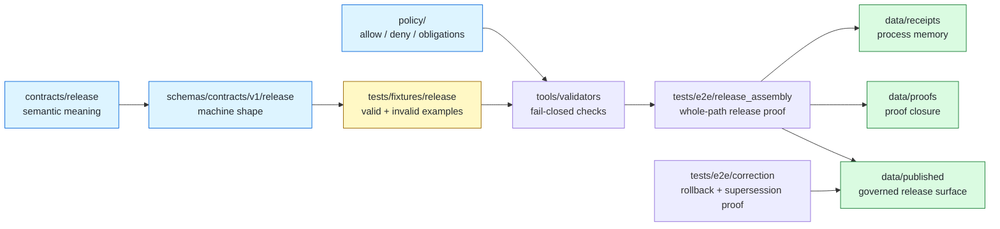

<!-- [KFM_META_BLOCK_V2]
doc_id: kfm://doc/NEEDS-VERIFICATION__tests_fixtures_release_readme
title: Release Fixtures
type: standard
version: v1
status: draft
owners: @bartytime4life
created: NEEDS_VERIFICATION__YYYY-MM-DD
updated: NEEDS_VERIFICATION__YYYY-MM-DD
policy_label: NEEDS_VERIFICATION__public_or_internal
related: [../../README.md, ../../e2e/release_assembly/README.md, ../../e2e/correction/README.md, ../../e2e/runtime_proof/README.md, ../../../contracts/README.md, ../../../schemas/README.md, ../../../policy/README.md, ../../../.github/workflows/README.md]
tags: [kfm, tests, fixtures, release, release-manifest, proof-pack, catalog-closure, promotion, rollback]
notes: [Owner is grounded in surfaced /tests/ ownership patterns, but leaf-specific ownership still needs branch verification. Dates, doc_id, policy_label, exact leaf inventory, schema home, validator command, and merge-blocking CI posture remain NEEDS VERIFICATION. The requested target path is tests/fixtures/release/README.md; corpus materials also mention tests/contracts/fixtures/release for contract-facing ReleaseManifest examples, so placement should be rechecked before merge.]
[/KFM_META_BLOCK_V2] -->

<a id="top"></a>

# Release Fixtures

Deterministic, public-safe release fixture lane for testing KFM release manifests, proof closure, catalog linkage, promotion outcomes, rollback references, and negative-path release behavior.

> [!NOTE]
> **Status:** `experimental`  
> **Document status:** `draft`  
> **Owners:** `@bartytime4life` *(surfaced at the broader `/tests/` scope; leaf-level routing needs branch verification)*  
> **Path:** `tests/fixtures/release/README.md`  
> **Repo fit:** child fixture lane under the governed `tests/` verification surface; upstream from release-assembly, correction, runtime-proof, validator, and CI checks; downstream of release contracts, schemas, policy, and evidence/proof doctrine.  
> **Quick jumps:** [Scope](#scope) · [Repo fit](#repo-fit) · [Accepted inputs](#accepted-inputs) · [Exclusions](#exclusions) · [Directory tree](#directory-tree) · [Quickstart](#quickstart) · [Usage](#usage) · [Diagram](#diagram) · [Operating tables](#operating-tables) · [Task list](#task-list--definition-of-done) · [FAQ](#faq) · [Appendix](#appendix)


> [!IMPORTANT]
> This directory is a **fixture lane**, not a publication lane.  
> A fixture may model a `ReleaseManifest`, `ProofPack`, `CatalogMatrix`, `PromotionDecision`, rollback reference, or correction state, but it must not become the authoritative published object, receipt store, proof store, policy store, or catalog.

---

## Scope

`tests/fixtures/release/` exists to keep release-facing examples small, deterministic, reviewable, and safe to use in tests.

It should help KFM prove that release-related validation can distinguish:

- complete release objects from incomplete ones
- published-state examples from fixture-only examples
- release identity from raw source identity
- proof references from process receipts
- catalog closure from a loose collection of links
- promotion outcomes from direct file movement
- rollback or correction references from silent overwrites
- outward state such as `superseded` or `withdrawn` from hidden implementation churn

### Truth labels used here

| Label | Meaning in this README |
| --- | --- |
| **CONFIRMED** | Supported by surfaced KFM doctrine, surfaced README patterns, or current workspace inspection. |
| **PROPOSED** | A safe fixture structure or naming rule that fits KFM doctrine but was not verified as present in the mounted repo. |
| **UNKNOWN** | Not verifiable because the active repository, branch, runner, validators, schema files, and workflow enforcement were not mounted. |
| **NEEDS VERIFICATION** | A concrete branch check is required before merging or relying on the claim. |

[Back to top](#top)

---

## Repo fit

**Path:** `tests/fixtures/release/README.md`  
**Role:** release-object fixture lane for tests that need stable valid/invalid release examples without treating fixtures as live releases.

| Direction | Surface | Why it matters |
| --- | --- | --- |
| Parent verification boundary | [`../../README.md`](../../README.md) | Keeps this leaf subordinate to the repo’s governed `tests/` posture. |
| Release assembly proof | [`../../e2e/release_assembly/README.md`](../../e2e/release_assembly/README.md) | Whole-path release tests may consume these fixtures, but e2e proof belongs there. |
| Correction lineage proof | [`../../e2e/correction/README.md`](../../e2e/correction/README.md) | Supersession, withdrawal, rollback, and correction behavior should be proven outside this fixture leaf. |
| Runtime proof | [`../../e2e/runtime_proof/README.md`](../../e2e/runtime_proof/README.md) | Runtime visibility of release state is a request-time proof burden, not a fixture authority. |
| Contract authority | [`../../../contracts/README.md`](../../../contracts/README.md) | Human meaning and invariants stay upstream from examples. |
| Schema authority | [`../../../schemas/README.md`](../../../schemas/README.md) | Fixtures pressure-test schemas; they do not define schema law. |
| Policy authority | [`../../../policy/README.md`](../../../policy/README.md) | Release admissibility, denial, obligations, rights, and sensitivity remain policy-owned. |
| Workflow boundary | [`../../../.github/workflows/README.md`](../../../.github/workflows/README.md) | This README must not imply merge-blocking CI until workflow files prove it. |

> [!WARNING]
> Placement needs one final branch check. KFM documentation also surfaces `tests/contracts/fixtures/release/` as a possible contract-facing fixture home for `ReleaseManifest`. Use this requested `tests/fixtures/release/` path only if the checked-out branch’s fixture convention supports it, or add a short ADR / migration note that resolves the split.

[Back to top](#top)

---

## Accepted inputs

Content that belongs here should be **tiny**, **deterministic**, and **safe to review in Git**.

| Input class | Typical examples | Why it belongs here |
| --- | --- | --- |
| Valid release manifest fixture | `valid/release-manifest.min.valid.json` | Proves the smallest acceptable release object shape. |
| Invalid release manifest fixture | `invalid/release-manifest.missing-spec-hash.invalid.json` | Keeps failure states first-class and named by reason. |
| Proof-closure fixture | minimal `ProofPack` or proof-index fragment | Lets validators test release proof references without emitting real proofs here. |
| Catalog-closure fixture | compact STAC / DCAT / PROV / internal crosswalk fragment | Tests release catalog closure without turning the fixture into the catalog. |
| Promotion decision fixture | `expected/promotion-decision.promoted.expected.json`, `expected/promotion-decision.denied.expected.json` | Supports deterministic promotion-gate tests while keeping decisions reviewable. |
| Rollback / correction reference fixture | `states/release.superseded.valid.json`, `states/release.withdrawn.valid.json` | Tests visible release state and lineage references. |
| Expected validator output | allow / deny / abstain / error fragments with reason codes | Helps tests compare machine-readable outcomes. |
| Handoff summary fixture | tiny reviewer-facing Markdown or JSON expected output | Keeps release review summaries subordinate to machine artifacts. |

### Input rules

1. Keep every fixture small enough to review in a pull request.
2. Name invalid fixtures by the missing or forbidden condition.
3. Preserve the boundary **fixture ≠ receipt ≠ proof ≠ catalog ≠ publication**.
4. Include stable identifiers and hashes only as deterministic test values.
5. Do not imply a fixture was emitted by a real promotion run unless it was.
6. Keep release state explicit: candidate, promoted, denied, on-hold, superseded, withdrawn, or correction-requested where the active schema supports those states.
7. Keep rollback targets and correction references visible when the fixture models a non-current release.
8. Prefer one valid / one invalid pair before expanding fixture families.

[Back to top](#top)

---

## Exclusions

| Does **not** belong here | Put it here instead | Why |
| --- | --- | --- |
| Canonical contract text | [`../../../contracts/README.md`](../../../contracts/README.md) or release contract docs | Fixtures do not define object meaning. |
| Machine schemas | [`../../../schemas/README.md`](../../../schemas/README.md) and versioned release schemas | Fixtures test schema behavior; they are not schema authority. |
| Policy bundles or reviewer-role rules | [`../../../policy/README.md`](../../../policy/README.md) | Policy decides admissibility; fixtures only exercise cases. |
| Real run receipts | `data/receipts/` or the repo’s receipt lane | Receipts are process memory, not example inputs. |
| Real signed proofs, attestations, or SBOMs | `data/proofs/` or the repo’s proof lane | Proof objects must remain separate and auditable. |
| Published release artifacts | `data/published/` or the repo’s published lane | Publication is a governed state transition, not a test fixture. |
| Live workflow YAML or scheduler state | `.github/workflows/`, `tools/`, or pipeline lanes | Fixture docs must not imply hidden automation. |
| Secrets, tokens, signing keys, credentials | secret manager / host configuration | Public test paths must stay safe to clone. |
| Large PMTiles, COGs, 3D Tiles, ZIPs, or provider mirrors | governed data zones or local ignored paths | This lane should model release metadata, not carry heavyweight assets. |
| One-off scratch examples | local ignored paths | Checked-in fixtures should be reusable and intentional. |

> [!CAUTION]
> Do not place a real released bundle here because it is convenient for a test. Tests should reference tiny fixtures or explicit fixture copies, never blur release storage into a public fixture path.

[Back to top](#top)

---

## Directory tree

### Current safe claim

```text
tests/fixtures/release/
└── README.md
```

That is the only subtree claim this README can safely make without direct branch inspection of this exact leaf.

<details>
<summary><strong>Possible stable growth shape</strong> (<strong>PROPOSED</strong>)</summary>

```text
tests/fixtures/release/
├── README.md
├── valid/
│   ├── release-manifest.min.valid.json
│   ├── release-manifest.with-ai-receipt.valid.json
│   └── release-bundle.public-safe.valid.json
├── invalid/
│   ├── release-manifest.missing-spec-hash.invalid.json
│   ├── release-manifest.missing-run-receipt.invalid.json
│   ├── release-manifest.missing-catalog-ref.invalid.json
│   ├── release-manifest.unreviewed-sensitive-location.invalid.json
│   └── release-bundle.unresolved-evidence-ref.invalid.json
├── states/
│   ├── release.candidate.valid.json
│   ├── release.promoted.valid.json
│   ├── release.on-hold.valid.json
│   ├── release.superseded.valid.json
│   └── release.withdrawn.valid.json
├── expected/
│   ├── validation.allow.expected.json
│   ├── validation.deny.expected.json
│   ├── promotion.promoted.expected.json
│   └── promotion.correction-requested.expected.json
└── handoff/
    ├── release-review.summary.expected.md
    └── release-review.handoff.expected.md
```

Working rule: add the smallest real fixture pair first, then grow only where a validator, schema, or e2e release-assembly case consumes it.

</details>

[Back to top](#top)

---

## Quickstart

Start with inspection. Do not assume the runner, schema path, validator path, or workflow gate until the checked-out branch proves them.

### 1) Inspect this leaf

```bash
find tests/fixtures/release -maxdepth 4 -type f 2>/dev/null | sort
```

### 2) Inspect parent and release-adjacent test docs

```bash
sed -n '1,260p' tests/README.md 2>/dev/null || true
sed -n '1,240p' tests/e2e/release_assembly/README.md 2>/dev/null || true
sed -n '1,240p' tests/e2e/correction/README.md 2>/dev/null || true
sed -n '1,240p' tests/e2e/runtime_proof/README.md 2>/dev/null || true
```

### 3) Inspect authority surfaces before adding fixtures

```bash
sed -n '1,260p' contracts/README.md 2>/dev/null || true
sed -n '1,260p' schemas/README.md 2>/dev/null || true
sed -n '1,260p' schemas/contracts/v1/README.md 2>/dev/null || true
sed -n '1,240p' policy/README.md 2>/dev/null || true
sed -n '1,240p' .github/workflows/README.md 2>/dev/null || true
```

### 4) Search for release vocabulary before inventing new names

```bash
grep -RIn \
  -e 'ReleaseManifest' \
  -e 'ProofPack' \
  -e 'CatalogMatrix' \
  -e 'PromotionDecision' \
  -e 'DecisionEnvelope' \
  -e 'CorrectionNotice' \
  -e 'RollbackReference' \
  -e 'spec_hash' \
  -e 'run_receipt_ref' \
  -e 'ai_receipt_ref' \
  tests contracts schemas policy docs tools data .github 2>/dev/null || true
```

> [!TIP]
> The first useful edit is usually not a large fixture tree. It is one valid fixture, one invalid fixture, and one test that proves the invalid fixture fails for the named reason.

[Back to top](#top)

---

## Usage

### When to add a release fixture

Add a fixture here when the test’s main question is:

| Question | Fixture burden |
| --- | --- |
| “Can a minimal release manifest validate?” | Add a valid manifest fixture. |
| “Does a missing digest or receipt fail closed?” | Add an invalid fixture named after the missing field. |
| “Does catalog closure require all expected references?” | Add a catalog-closure fixture and expected denial. |
| “Does a superseded release still point to correction lineage?” | Add a release-state fixture with rollback / correction references. |
| “Does a reviewer handoff render stable trust facts?” | Add a handoff expected-output fixture, not a real proof object. |

### Naming convention

Prefer names that reveal both object family and expected result.

```text
<object-family>.<condition>.<valid|invalid|expected>.json
```

Examples:

```text
release-manifest.min.valid.json
release-manifest.missing-spec-hash.invalid.json
release-manifest.unresolved-evidence-ref.invalid.json
promotion-decision.denied.expected.json
release-review.handoff.expected.md
```

### Minimum fixture shape guidance

A release fixture should make these relationships visible when the active schema supports them:

| Field family | Why it matters |
| --- | --- |
| release identity | prevents fixture drift and duplicate ambiguity |
| `spec_hash` or equivalent digest | proves deterministic identity pressure |
| `run_receipt_ref` | keeps process memory visible without storing the receipt here |
| optional `ai_receipt_ref` | keeps model assistance bounded and auditable when used |
| `evidence_bundle_ref` or evidence closure reference | keeps cite-or-abstain pressure visible |
| `catalog_ref` / `catalog_matrix_ref` | proves catalog closure is not optional decoration |
| `proof_pack_ref` / `attestation_refs` | keeps proof material separate from fixture examples |
| `promotion_decision_ref` | ties publication to governed state transition |
| `rollback_ref` / `correction_notice_ref` | keeps correction lineage inspectable |
| policy / sensitivity state | prevents accidental public release examples from ignoring rights or risk |

[Back to top](#top)

---

## Diagram



[Back to top](#top)

---

## Operating tables

### Fixture boundary matrix

| Surface | Owns | Must not silently own |
| --- | --- | --- |
| `contracts/` | semantic meaning, invariants, lifecycle intent | executable validation as the only expression of truth |
| `schemas/` | machine-checkable shape and required fields | policy permission or release approval |
| `policy/` | admissibility, denial, obligations, sensitivity and rights logic | fixture examples or schema definitions |
| `tests/fixtures/release/` | small valid/invalid release examples | real receipts, proofs, published releases, or publication state |
| `tests/e2e/release_assembly/` | whole-path release proof drills | canonical object meaning |
| `data/receipts/` | process-memory instances | proof authority or schema authority |
| `data/proofs/` | proof and attestation material | raw source truth or test fixture authority |
| `data/published/` | outward release artifacts | release eligibility decision itself |

### First useful fixture set

| Priority | Fixture | Purpose | Status |
| ---: | --- | --- | --- |
| 1 | `valid/release-manifest.min.valid.json` | proves the smallest acceptable release manifest | **PROPOSED** |
| 2 | `invalid/release-manifest.missing-spec-hash.invalid.json` | proves deterministic identity is required | **PROPOSED** |
| 3 | `invalid/release-manifest.missing-run-receipt.invalid.json` | proves release cannot hide run lineage | **PROPOSED** |
| 4 | `invalid/release-manifest.missing-catalog-ref.invalid.json` | proves catalog closure is required | **PROPOSED** |
| 5 | `states/release.superseded.valid.json` | proves non-current outward state can stay visible | **PROPOSED / NEEDS VERIFICATION** |
| 6 | `expected/validation.deny.expected.json` | gives tests a stable negative expected output | **PROPOSED** |

### Review checklist by fixture

| Check | Pass condition |
| --- | --- |
| Size | fixture is small enough to review manually |
| Scope | fixture exercises one clear release behavior |
| Naming | filename states object family and failure / success condition |
| Source safety | fixture does not include real secrets, tokens, or large provider data |
| Authority split | fixture does not claim to be contract, schema, policy, receipt, proof, or publication |
| Negative path | at least one invalid fixture fails for the intended reason |
| Links | README points to parent tests, contracts, schemas, policy, and e2e release surfaces |
| Branch evidence | any current inventory claim is backed by checked-out files |

[Back to top](#top)

---

## Task list / definition of done

A change to this directory is done only when:

- [ ] the checked-out branch confirms whether `tests/fixtures/release/` is the correct fixture home
- [ ] any `tests/contracts/fixtures/release/` overlap is resolved or documented
- [ ] every added fixture is small, deterministic, and reviewable
- [ ] every invalid fixture is named by failure reason
- [ ] at least one validator or test consumes each fixture family
- [ ] no fixture contains secrets, signing keys, provider mirrors, or heavyweight release assets
- [ ] README links still point to the correct parent and adjacent surfaces
- [ ] contract and schema links remain upstream from fixture examples
- [ ] policy remains the source of allow / deny / obligation logic
- [ ] release-assembly or correction tests cover any fixture that claims promoted, superseded, withdrawn, or correction-requested state
- [ ] CI / workflow claims are marked **NEEDS VERIFICATION** unless workflow YAML and branch rules prove them
- [ ] rollback and correction references are visible in any fixture modeling non-current release state

[Back to top](#top)

---

## FAQ

### Is this a release directory?

No. It is a test fixture directory. Real release artifacts belong under the project’s governed published / release surfaces, with receipts, proofs, catalog closure, and promotion state kept separate.

### Can a fixture contain a complete real `ReleaseManifest`?

Only if it is explicitly safe, tiny, deterministic, and copied as a fixture example. Do not move or duplicate live release authority into this lane.

### Should fixtures live here or under `tests/contracts/fixtures/release/`?

**NEEDS VERIFICATION.** The requested target path is `tests/fixtures/release/README.md`, but surfaced KFM documentation also names `tests/contracts/fixtures/release/` for contract-facing `ReleaseManifest` examples. The active branch should resolve this by convention, ADR, symlink-free migration, or explicit parent README guidance.

### Can this directory include Markdown handoff outputs?

Yes, if they are expected outputs for deterministic tests and remain subordinate to machine artifacts. Handoffs should summarize trust state; they should not become proof authority.

### What is the safest first fixture?

A minimal valid `ReleaseManifest` plus one invalid fixture missing `spec_hash` or `run_receipt_ref`. That pair proves both acceptance shape and fail-closed behavior without broad subtree speculation.

[Back to top](#top)

---

## Appendix

<details>
<summary><strong>Authoring notes for future maintainers</strong></summary>

### Keep these boundaries visible

- **Release fixture**: small example for tests.
- **Release manifest**: release object identity and references.
- **Run receipt**: process memory from execution.
- **AI receipt**: process memory for model-assisted interpretation.
- **Proof pack**: proof closure and attestations.
- **Catalog matrix**: catalog crosswalk and closure.
- **Promotion decision**: governed state transition.
- **Published artifact**: outward release surface.
- **Correction notice / rollback reference**: lineage for changed release state.

### Avoid these anti-patterns

- treating a fixture as proof that a release exists
- treating a passing schema check as publication approval
- storing real receipts or proofs inside test fixtures
- using fixture examples to bypass policy
- committing large assets for convenience
- documenting CI enforcement before workflow evidence exists
- flattening supersession, withdrawal, and correction into “old files”

</details>

[Back to top](#top)
