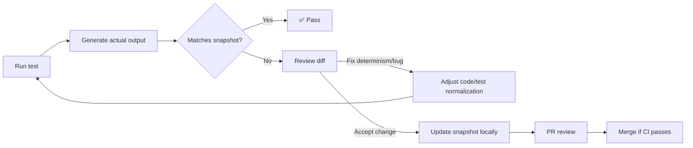

# Snapshots (Golden Files) — Test Fixtures


This folder contains **committed snapshot (“golden”) files** used by automated tests to prevent regressions in **serialized outputs** (API payloads, catalogs, policy decisions, evidence bundles, render output, etc.).

Snapshots are intentionally treated as **reviewed artifacts**:
- Tests compare “actual output” → “expected snapshot”.
- A snapshot change is treated like a behavioral change and must be reviewed.
- CI should fail on drift unless snapshots are intentionally updated.

> [!IMPORTANT]
> Snapshots **must be deterministic** and **must not contain secrets, PII, or sensitive precise locations**.
> If you need “sensitive” test coverage (restricted fields, precise locations, small counts), use **synthetic fixtures** that exercise redaction rules.

---

## Table of Contents

- [What Belongs Here](#what-belongs-here)
- [What Must Never Go Here](#what-must-never-go-here)
- [Directory Layout](#directory-layout)
- [Naming Conventions](#naming-conventions)
- [File Format Rules](#file-format-rules)
- [Determinism Rules](#determinism-rules)
- [Redaction and Sensitivity Rules](#redaction-and-sensitivity-rules)
- [How to Add a New Snapshot](#how-to-add-a-new-snapshot)
- [How to Update Snapshots](#how-to-update-snapshots)
- [CI Expectations](#ci-expectations)
- [Troubleshooting Snapshot Drift](#troubleshooting-snapshot-drift)
- [Definition of Done](#definition-of-done)
- [FAQ](#faq)

---

## What Belongs Here

Snapshots belong here when the output is:

- **Structured and meaningful** to review as a file diff (JSON, YAML, NDJSON, HTML, Markdown, text).
- A **contract-like output** that should not change accidentally (schemas, catalogs, policy decisions, evidence bundles).
- A **non-regression guard** for previously-fixed bugs (especially “leaks” and policy enforcement).

Typical snapshot categories:

| Category | Examples | Why snapshot it? |
|---|---|---|
| Catalog outputs | STAC Item/Collection, DCAT dataset/distributions, PROV run receipts/lineage | Catalog shape must remain stable for interoperability and governance |
| Policy decisions | allow/deny decisions, redaction results, field-level suppression/generalization | “Restricted fields must never leak” is a forever-rule |
| API responses | representative endpoints with stable payloads | Detect breaking changes and accidental field reordering/renaming |
| Evidence bundles | evidence refs, bundle manifests, “cite panel” payloads | Ensure evidence UX remains resolvable and complete |
| Rendering output | HTML fragments, UI serializations | Catch unintended presentation regressions (use sparingly) |

---

## What Must Never Go Here

Do **not** commit snapshots that include:

- **Secrets**: API keys, tokens, session cookies, passwords, private certs.
- **Real PII**: real names, emails, phone numbers, parcel owner names, or anything that would be restricted in production.
- **Precise sensitive locations**: exact archaeology locations or protected species coordinates (use generalized/synthetic points instead).
- **Unstable values** without normalization: timestamps, UUIDs, random seeds, nondeterministic ordering, floating-point noise.
- Large opaque binaries (unless explicitly approved): e.g., multi-GB rasters, full database dumps.

> [!WARNING]
> If you accidentally commit secrets, treat it as a security incident: rotate credentials and purge the secret from history per your org’s incident runbook.

---

## Directory Layout

This repo uses a **central, auditable snapshot directory**.

Recommended substructure (create folders as needed; keep it tidy):

```text
tests/
└─ fixtures/
   └─ snapshots/                                           # Normalized “known-good” outputs for regression diffs
      ├─ README.md                                         # Snapshot rules (normalization, update workflow, review gates)
      │
      ├─ api/                                              # API response snapshots (contract/regression)
      │  └─ v1/                                            # API version namespace
      │     ├─ evidence/
      │     │  └─ resolve-basic.snap.json                  # Evidence resolver: minimal happy-path response
      │     └─ datasets/
      │        └─ list-public.snap.json                    # Dataset listing: public-only view (policy-filtered)
      │
      ├─ catalogs/                                         # Catalog render snapshots (validator outputs)
      │  ├─ dcat/
      │  │  └─ dataset-minimal.snap.json                   # Minimal DCAT dataset snapshot (canonical field ordering)
      │  ├─ stac/
      │  │  ├─ collection-minimal.snap.json                # Minimal STAC Collection snapshot (canonicalized)
      │  │  └─ item-example.snap.json                      # Example STAC Item snapshot (geometry/time/assets)
      │  └─ prov/
      │     └─ run-receipt-minimal.snap.json               # Minimal PROV/run-receipt snapshot (lineage envelope)
      │
      ├─ policy/                                           # Policy decision + transform snapshots (deny/redact)
      │  ├─ redaction/
      │  │  └─ restricted-fields-redacted.snap.json        # Redaction transform output (restricted fields removed/masked)
      │  └─ denies/
      │     ├─ sensitive-location-deny.snap.json           # Deny decision: sensitive location precision not allowed
      │     └─ restricted-field-deny.snap.json             # Deny decision: restricted field present without clearance
      │
      └─ ui/                                               # UI snapshots (content renders; markdown/text diffs)
         └─ focus-mode/
            └─ cite-panel.snap.md                          # Focus Mode citation panel render (stable layout/text)
```

Notes:
- Prefer **more folders** over giant files.
- Prefer **one scenario per snapshot**.
- Co-locate “input fixture” files *near the test* or under `tests/fixtures/` (outside this folder) and keep snapshots here as the expected output.

---

## Naming Conventions

Use filenames that are stable, searchable, and review-friendly:

- **kebab-case** for names
- Include what the snapshot represents (endpoint, policy rule, catalog type)
- Use `.snap.<ext>` to make “golden files” obvious

Examples:
- `resolve-basic.snap.json`
- `restricted-fields-redacted.snap.json`
- `collection-minimal.snap.json`
- `cite-panel.snap.md`

Avoid:
- `snapshot1.json`
- `test-output.json`
- timestamps in names

---

## File Format Rules

Prefer formats that diff well:

| Format | Allowed | Rules |
|---|---:|---|
| JSON (`.json`) | ✅ | Stable key ordering; stable whitespace; newline at EOF |
| NDJSON (`.ndjson`) | ✅ | One JSON object per line; stable ordering within each object |
| YAML (`.yml` / `.yaml`) | ⚠️ | Only if ordering/serialization is stable; JSON preferred |
| Markdown (`.md`) | ✅ | Keep lines wrap-friendly; avoid embedding volatile data |
| Text (`.txt`) | ✅ | Normalize newlines (LF) |
| GeoJSON (`.geojson`) | ✅ | Control coordinate precision + stable feature ordering |
| Binary (PNG/PDF/Parquet/etc.) | ⚠️ | Only with explicit justification + size discipline |

> [!NOTE]
> If your snapshot is JSON: prefer “canonical JSON” (stable serialization) so diffs represent real meaning, not formatting noise.

---

## Determinism Rules

Snapshots only work if outputs are **repeatable**. Tests that write snapshots must:

1. **Freeze time**  
   - Prefer fixed clocks (e.g., `2020-01-01T00:00:00Z`).
2. **Freeze randomness**  
   - Fixed RNG seeds, deterministic UUID generators (or placeholders).
3. **Normalize ordering**  
   - Sort object keys in serializers; sort arrays where order isn’t semantic.
4. **Normalize floats**  
   - Round coordinates/metrics to a defined precision (e.g., 6 decimals).
5. **Normalize locale/timezone**  
   - Use UTC, consistent locale (`en-US`), stable number formatting.
6. **Strip nondeterministic fields** (or replace with placeholders)  
   - e.g., `run_id`, `audit_ref`, `bundle_hash`, dynamic request IDs.

Recommended placeholder conventions:

| Field type | Placeholder |
|---|---|
| UUID | `"<UUID>"` |
| Timestamp | `"<ISO_DATETIME_UTC>"` |
| Hash/digest | `"<SHA256>"` |
| Audit reference | `"<AUDIT_REF>"` |

---

## Redaction and Sensitivity Rules

This project treats redaction as a **first-class transformation** and tests must prove:
- restricted fields are removed/masked,
- sensitive locations are generalized/suppressed,
- audit/evidence metadata is present and consistent.

Snapshot guidance for sensitive coverage:
- Use **synthetic fixtures** that contain “would-be sensitive fields” (e.g., `owner_name`, exact coordinates) so tests can assert they are redacted.
- Store the **expected redacted output** as the snapshot.
- Add “negative” snapshots where unauthorized access is denied (policy decision snapshots).

> [!IMPORTANT]
> Never use real restricted datasets as fixtures unless governance explicitly approves the redistribution and storage of test copies.

---

## How to Add a New Snapshot

1. Create or reuse a **minimal input fixture** (synthetic, deterministic).
2. Write the test to produce an **actual output artifact** (JSON/text/etc.).
3. Compare it to a snapshot file in this folder.
4. Run the suite:
   - the test should fail if the snapshot doesn’t exist yet.
5. Generate the initial snapshot (see next section).
6. Inspect the snapshot for:
   - no secrets/PII,
   - normalized determinism,
   - stable formatting,
   - only the fields you want to “lock”.

---

## How to Update Snapshots

Snapshots should be updated **only when**:
- behavior changed intentionally,
- a contract change is approved,
- a bug fix changes output and the new output is correct.

Update process (required):
1. Run tests with your runner’s snapshot update flag.
2. Review diffs carefully (treat like code):
   - Are changes expected?
   - Are any new fields sensitive or volatile?
   - Did ordering/formatting noise sneak in?
3. If diffs include volatile fields:
   - fix determinism in code/tests,
   - regenerate snapshots again.
4. Commit snapshots with a clear message (example):
   - `test(snapshots): update policy redaction golden files for owner_name masking`
5. In the PR description, include:
   - what changed,
   - why it changed,
   - which invariants are strengthened/maintained.

<details>
<summary>Examples: common snapshot update commands</summary>

> Use the one that matches your stack; keep CI fail-closed (no auto-update in CI).

### Jest
```bash
npm test -- --updateSnapshot
# or
pnpm test -- --updateSnapshot
```

### Vitest
```bash
vitest -u
# or
pnpm vitest -u
```

### Pytest snapshot plugins (example pattern)
```bash
pytest --snapshot-update
```

### Go “golden file” pattern (example)
```bash
go test ./... -update
```

</details>

---

## CI Expectations

CI should treat snapshot drift as a **merge-blocking failure**.

Expectations:
- Tests fail if snapshots differ.
- Developers must explicitly update snapshots locally.
- Snapshot diffs must be reviewed like code.

Snapshot gates commonly protect:
- Catalog outputs (STAC/DCAT/PROV),
- Policy regression (restricted fields never leak),
- API contract stability,
- Audit/evidence metadata presence.

---

## Troubleshooting Snapshot Drift

Common causes and fixes:

| Symptom | Likely cause | Fix |
|---|---|---|
| Snapshot changes every run | timestamps/UUIDs/randomness | freeze time, stub UUIDs, fixed seeds |
| Ordering changes | nondeterministic map iteration / DB ordering | sort before serialize; enforce `ORDER BY` |
| Float noise | coordinate math / serialization | round to fixed precision |
| Platform-specific diffs | Windows CRLF, locale, timezone | enforce LF, fixed locale/UTC |
| Large diffs from refactors | snapshot too broad | snapshot smaller units; assert only stable fields |

---

## Definition of Done

Before merging a PR that adds/updates snapshots:

- [ ] Snapshot represents an **intentional contract** (not incidental formatting).
- [ ] Inputs are **synthetic** or otherwise approved for redistribution.
- [ ] No secrets, tokens, PII, or precise sensitive locations.
- [ ] Output is deterministic (time, random, ordering, locale normalized).
- [ ] Snapshots are minimal (only what needs to be locked).
- [ ] CI passes without “auto-updating” snapshots.
- [ ] PR description documents *why* the snapshot changed.

---

## FAQ

### Why store snapshots under `tests/fixtures/snapshots/` instead of framework defaults?
Centralizing snapshots makes them easier to audit, review, and govern—especially when snapshots cover policy, catalogs, and evidence outputs (not just UI component renders).

### Are snapshots the same as fixtures?
No:
- **Fixtures** are *inputs* (sample requests, sample datasets, sample docs).
- **Snapshots** are *expected outputs*.

### Should we snapshot entire API responses?
Only for **representative** responses and only after **normalizing volatile fields**. Prefer smaller “shape + critical fields” snapshots when possible.

### What if a snapshot includes sensitive fields needed for testing?
Use synthetic inputs that contain those fields, then snapshot the **redacted output** or the **deny decision** (never commit real restricted content).

---

## Snapshot Lifecycle Diagram



