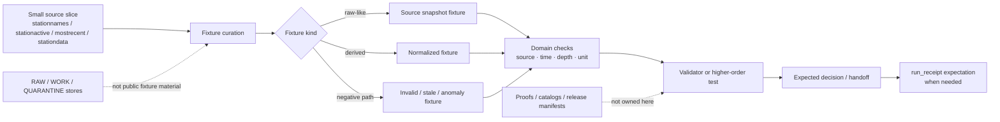

<!-- [KFM_META_BLOCK_V2]
doc_id: kfm://doc/NEEDS_VERIFICATION__soil_moisture_fixtures_readme
title: Soil Moisture Fixtures
type: standard
version: v1
status: draft
owners: @bartytime4life
created: NEEDS_VERIFICATION__YYYY-MM-DD
updated: 2026-04-27
policy_label: NEEDS_VERIFICATION__public_or_internal
related: [../../README.md, ../../policy/README.md, ../../reproducibility/README.md, ../../../contracts/README.md, ../../../policy/README.md, ../../../schemas/README.md, ../../../.github/CODEOWNERS, ../../../.github/workflows/README.md]
tags: [kfm, tests, fixtures, soil-moisture, mesonet, content-spec-hash, run-receipt]
notes: [Owner is inherited from surfaced /tests scope documentation and still needs active-branch verification at this leaf. The exact subtree, created date, policy label, fixture inventory, runner wiring, and workflow enforcement remain NEEDS VERIFICATION. This README is source-bounded and must not be read as proof of live provider ingestion or existing fixture files beyond the committed document itself.]
[/KFM_META_BLOCK_V2] -->

<a id="top"></a>

# Soil Moisture Fixtures

Deterministic, public-safe fixture lane for soil-moisture source samples and normalized records used to prove watcher, validator, anomaly, stale-state, and receipt-handoff behavior without treating test data as authoritative truth.

> [!NOTE]
> **Status:** `experimental`  
> **Owners:** `@bartytime4life` *(NEEDS VERIFICATION at this leaf before merge)*  
> **Path:** `tests/fixtures/soil_moisture/README.md`  
> **Repo fit:** child fixture lane for reviewable soil-moisture examples that support governed tests without becoming source truth, policy truth, release proof, or provider archive  
> **Quick jumps:** [Scope](#scope) · [Repo fit](#repo-fit) · [Accepted inputs](#accepted-inputs) · [Exclusions](#exclusions) · [Directory tree](#directory-tree) · [Quickstart](#quickstart) · [Usage](#usage) · [Diagram](#diagram) · [Operating tables](#operating-tables) · [Task list](#task-list--definition-of-done) · [FAQ](#faq) · [Appendix](#appendix)


> [!IMPORTANT]
> This README is **source-bounded**. It fits the KFM soil-moisture watcher doctrine and the surfaced `tests/` fixture pattern, but it does **not** prove that the active checkout already contains this full subtree, fixture inventory, runner wiring, live-source probes, workflow YAML, branch protection, or merge-blocking enforcement.

> [!WARNING]
> **Kansas Mesonet is a valuable public connector, not a free-for-all ingestion surface.** Keep checked-in fixtures tiny, rights-conscious, and reviewable. Do not turn `tests/fixtures/soil_moisture/` into a silent provider mirror, scraping cache, or bulk historical archive.

---

## Scope

`tests/fixtures/soil_moisture/` is the fixture lane for **small, deterministic soil-moisture examples** that help higher-order verification surfaces prove:

| Proof burden | What this fixture lane should make testable |
| --- | --- |
| Source-role clarity | Kansas Mesonet, SCAN/AWDB, USCRN, and SMAP-style context do not collapse into one generic “soil moisture” bucket. |
| Station-vs-grid separation | Station readings and satellite/model grids stay visibly distinct. |
| Time basis | observation time, source timezone, UTC normalization, and stale-state behavior remain testable. |
| Depth semantics | 5/10/20/50 cm station readings are not silently interchangeable. |
| Unit semantics | VWC, percent saturation, normalized `m3/m3`, and derived anomaly values remain labeled. |
| Deterministic identity | normalized fixture content can support `content_spec_hash`; execution events can support `run_hash` / `run_receipt`. |
| Fail-closed behavior | missing station identity, invalid values, unsupported depths, missing provenance, or rights ambiguity can deny or quarantine safely. |

This directory is the right place for **fixture materials** that support those proofs.

This directory is **not** the right place for:

- authoritative source truth
- long-lived provider mirrors
- canonical schemas
- policy bundle ownership
- release-grade proofs
- live automation state
- unpublished, secret-bearing, or credential-bearing data

### Truth labels used in this README

| Label | Meaning here |
| --- | --- |
| **CONFIRMED** | Supported by surfaced KFM doctrine or current repo-facing documentation evidence. |
| **INFERRED** | Conservative reading that fits adjacent surfaces but is not directly proven as checked-in leaf reality. |
| **PROPOSED** | Recommended target shape or future coverage pattern consistent with KFM doctrine. |
| **UNKNOWN** | Not surfaced strongly enough to describe as current repo fact. |
| **NEEDS VERIFICATION** | Path, runner, file inventory, metadata value, source term, or implementation detail that should be rechecked against the active branch before merge. |

### Current evidence posture

| Surface | Status | Why it matters |
| --- | --- | --- |
| `tests/` as governed verification boundary | **CONFIRMED from surfaced docs / NEEDS VERIFICATION in mounted checkout** | This file should read like a child test lane, not a generic data folder. |
| `/tests/` owner coverage | **SURFACED / NEEDS VERIFICATION** | The owner line is inherited from surfaced documentation and must be rechecked against active `CODEOWNERS`. |
| `tests/fixtures/` as parent family | **DOCUMENTED / NEEDS VERIFICATION ON ACTIVE BRANCH** | Parent fixture conventions should win if they differ from this draft. |
| Exact `tests/fixtures/soil_moisture/` contents | **UNKNOWN** | Do not assert checked-in fixture files until the real branch proves them. |
| Kansas Mesonet first-wave source role | **CONFIRMED doctrine / source terms NEEDS VERIFICATION** | Source-role and usage constraints shape what safe checked-in fixtures may look like. |
| Soil-moisture fixture classes | **PROPOSED** | Strongly supported by KFM soil-lane doctrine, but not proven as mounted files. |

[Back to top](#top)

---

## Repo fit

**Path:** `tests/fixtures/soil_moisture/README.md`  
**Role:** child fixture README for governed, public-safe soil-moisture examples inside the broader `tests/` verification boundary.

| Direction | Surface | Relationship |
| --- | --- | --- |
| Parent | [`../../README.md`](../../README.md) | `tests/` is the governing proof surface this lane stays subordinate to. |
| Sibling proof family | [`../../policy/README.md`](../../policy/README.md) | Policy-facing tests may consume fixtures from here; policy meaning does not originate here. |
| Sibling proof family | [`../../reproducibility/README.md`](../../reproducibility/README.md) | Stable fixture content matters when replayability and digest checks are the burden. |
| Canonical contract boundary | [`../../../contracts/README.md`](../../../contracts/README.md) | Fixtures may support contract tests, but contract law does not originate here. |
| Canonical schema boundary | [`../../../schemas/README.md`](../../../schemas/README.md) | Schema authority stays there even when fixture shape pressure grows here. |
| Policy authority boundary | [`../../../policy/README.md`](../../../policy/README.md) | This lane may feed policy tests; it must not become policy truth. |
| Workflow boundary | [`../../../.github/workflows/README.md`](../../../.github/workflows/README.md) | Documentation about fixture use is not proof of active workflow enforcement. |
| Ownership boundary | [`../../../.github/CODEOWNERS`](../../../.github/CODEOWNERS) | Leaf ownership must be verified before merge. |

> [!TIP]
> Keep this lane narrow: **fixture and explain** here, **validate and decide** in higher-order test and validator lanes, **prove and publish** downstream.

[Back to top](#top)

---

## Accepted inputs

This lane should hold **small, stable, reviewable** examples that help prove soil-moisture behavior clearly.

| Input class | Examples | Why it belongs here | Status |
| --- | --- | --- | --- |
| Source-snapshot fixtures | tiny `stationnames`, `stationactive`, `mostrecent`, or `stationdata` slices | Lets tests prove source-role handling without depending on live network calls | **CONFIRMED source class / PROPOSED local file form** |
| Normalized series fixtures | compact JSON or CSV rows after field cleanup | Helps prove deterministic normalization and `content_spec_hash` stability | **INFERRED / PROPOSED** |
| Health-state fixtures | stale station activity, partial roster loss, degraded station examples | Supports fail-closed freshness and availability logic | **PROPOSED** |
| Anomaly fixtures | z-score spike, impossible VWC value, sudden jump | Supports reviewable anomaly behavior without scraping live data | **PROPOSED** |
| Comparison / corroboration metadata | tiny SCAN/AWDB, USCRN, or SMAP context stubs | Keeps Kansas Mesonet from becoming the only implied truth surface when cross-checking matters | **PROPOSED** |
| Receipt-adjacent expected outputs | minimal expected `run_receipt` or handoff fragments | Useful when fixture-driven tests need to prove machine-readable outcome seams | **INFERRED / PROPOSED** |

### What belongs here

- candidate source slices that can be checked into Git safely
- deterministic normalized examples that isolate one behavior cleanly
- valid and invalid fixture pairs named by failure reason
- tiny stale-data and anomaly cases that support negative-path tests
- reviewable examples for soil-moisture depth handling
- public-safe payloads that do **not** pretend to be release artifacts

### Fixture rules

1. Keep fixtures **small enough to review in a pull request**.
2. Keep source identity explicit so **Kansas Mesonet** does not get flattened into generic “sensor data.”
3. Keep time windows explicit; stale-state logic is meaningless without time semantics.
4. Keep depth identity explicit; soil-moisture values are not interchangeable across depths.
5. Do not silently mix **VWC**, **percent saturation**, and normalized `m3/m3`.
6. If a fixture is derived, label it as derived; do not let a normalized example masquerade as a raw source snapshot.
7. Preserve the distinction **receipt ≠ proof ≠ catalog** even in tests.
8. Treat source terms, access constraints, and attribution as part of fixture review, not an afterthought.

[Back to top](#top)

---

## Exclusions

| Does **not** belong here | Put it here instead | Why |
| --- | --- | --- |
| Canonical schema files | [`../../../contracts/README.md`](../../../contracts/README.md) or [`../../../schemas/README.md`](../../../schemas/README.md) | Fixtures should pressure-test schema law, not replace it. |
| Policy bundle source files or review-role registries | [`../../../policy/README.md`](../../../policy/README.md) | This lane may support policy tests, but policy remains the source of truth. |
| Full historical provider pulls or scrape caches | governed data zones or ignored local paths | Public fixture surfaces should stay tiny and rights-conscious. |
| Live automation state, schedulers, or connector code | watcher / tool / pipeline lanes on the active branch | Fixture README prose is not implementation proof. |
| Release manifests, signed proofs, SBOMs, or promoted artifacts as primary records | governed receipt / proof / release surfaces | A fixture example is not the authoritative published object. |
| Secrets, API credentials, session cookies, or host-specific automation helpers | secret manager / host configuration | Sensitive operational material must not live in public fixture paths. |
| One-off analyst scratch files | local ignored paths | Checked-in fixtures should be reusable and reviewable. |
| Raw provider mirrors large enough to hide rights or usage posture | nowhere in this lane | This README keeps provider constraints visible on purpose. |

> [!WARNING]
> Do not commit “convenience dumps” of live provider data here just because they are easy to fetch. Tests should prove behavior with the **smallest meaningful slice**, not accumulate accidental archives.

[Back to top](#top)

---

## Directory tree

### Current safe claim

```text
tests/fixtures/soil_moisture/
└── README.md
```

That is the only subtree claim this README can make safely without direct active-branch inspection.

### Preferred growth shape (`PROPOSED` / `NEEDS VERIFICATION`)

```text
tests/fixtures/soil_moisture/
├── README.md
├── valid/
│   ├── mesonet_stationnames.min.csv
│   ├── mesonet_stationactive.min.csv
│   ├── mesonet_mostrecent.min.csv
│   └── mesonet_stationdata.hourly.min.csv
├── invalid/
│   ├── missing_station_id.csv
│   ├── unordered_timestamps.csv
│   ├── unsupported_depth_column.csv
│   └── impossible_vwc_value.csv
├── health/
│   ├── stale_station_activity.json
│   └── roster_loss_threshold.json
└── anomalies/
    ├── zscore_spike.json
    └── seven_day_jump.json
```

### Optional derived-fixture extension (`PROPOSED`)

```text
tests/fixtures/soil_moisture/
├── normalized/
│   ├── series.long.min.json
│   └── series.window.min.json
└── expected/
    ├── run_receipt.allow.json
    └── run_receipt.deny.json
```

> [!TIP]
> Add only the fixture leaves the active branch can actually support. A smaller truthful subtree is better than a broad speculative one.

[Back to top](#top)

---

## Quickstart

Start with inspection-first commands so this README stays honest as the branch evolves.

### 1) Confirm what is actually mounted

```bash
find tests -maxdepth 4 -print 2>/dev/null | sort
find tests/fixtures -maxdepth 4 -print 2>/dev/null | sort
find tests/fixtures/soil_moisture -maxdepth 4 -print 2>/dev/null | sort
```

### 2) Re-read parent and adjacent lane contracts

```bash
sed -n '1,260p' tests/README.md 2>/dev/null || true
sed -n '1,220p' tests/fixtures/README.md 2>/dev/null || true
sed -n '1,220p' tests/policy/README.md 2>/dev/null || true
sed -n '1,220p' tests/reproducibility/README.md 2>/dev/null || true
sed -n '1,220p' contracts/README.md 2>/dev/null || true
sed -n '1,220p' schemas/README.md 2>/dev/null || true
sed -n '1,220p' policy/README.md 2>/dev/null || true
sed -n '1,220p' .github/CODEOWNERS 2>/dev/null || true
```

### 3) Reconfirm soil-moisture vocabulary before adding new fixtures

```bash
grep -RIn \
  -e 'Kansas Mesonet' \
  -e 'soil moisture' \
  -e 'stationactive' \
  -e 'mostrecent' \
  -e 'stationdata' \
  -e 'content_spec_hash' \
  -e 'spec_hash' \
  -e 'run_hash' \
  -e 'run_receipt' \
  -e 'EvidenceBundle' \
  -e 'DecisionEnvelope' \
  tests contracts schemas policy docs tools pipelines 2>/dev/null || true
```

### 4) Add the smallest useful fixture pair first

Use one valid and one invalid fixture before creating larger families:

1. one **passing** hourly `stationdata` slice
2. one **failing** slice named by reason, such as `unordered_timestamps.csv` or `impossible_vwc_value.csv`
3. one tiny expected-output fragment only if a downstream test needs it

### 5) Document the real runner only after it exists

If this leaf gains executable consumers, document the actual local and CI invocation paths used on the active branch. Do not leave guessed `pytest`, shell, Node, or workflow commands behind.

[Back to top](#top)

---

## Usage

### When to use this fixture lane

Use this lane when the main question is:

> “Can a small, reviewable fixture prove soil-moisture source identity, time/depth/unit semantics, deterministic normalization, stale-state handling, anomaly handling, or receipt-handoff behavior?”

### When to use another lane

| If the main question is… | Best home | Why |
| --- | --- | --- |
| “Is the source admitted safely and explicitly?” | source-descriptor contract / fixture surfaces | Admission law belongs there. |
| “Does the runtime return the right answer/abstain/deny/error envelope?” | `tests/e2e/runtime_proof/soil_moisture/` | Runtime proof is a request/response concern, not raw fixture custody. |
| “Does the validator pass or fail this candidate?” | `tools/validators/soil_moisture/` and unit tests | Validator meaning should not live in this README. |
| “Can this be promoted?” | promotion-gate tests and release/proof lanes | Promotion is a governed state transition, not a fixture side effect. |
| “Is this authoritative soil truth?” | governed source/canonical data lifecycle lanes | Fixture examples are not source truth. |

### Adding a fixture

Before adding any fixture file:

1. Name the behavior, not just the source.
2. Keep the file tiny.
3. Preserve source identity and time basis.
4. Preserve depth and unit meaning.
5. Add one valid and one invalid case where possible.
6. Note whether the example is raw-like, normalized, derived, or expected-output.
7. Confirm that the fixture does not contain secrets, credentials, private records, or hidden bulk data.
8. Update this README’s [Directory tree](#directory-tree), [Operating tables](#operating-tables), and [Task list](#task-list--definition-of-done) if the branch reality changes.

[Back to top](#top)

---

## Diagram



> [!IMPORTANT]
> This fixture lane may support receipt-aware tests, but **release proofs, catalogs, canonical stores, and publication decisions remain outside its authority**.

[Back to top](#top)

---

## Operating tables

### Fixture class matrix

| Fixture class | Smallest good example | What it should prove | What it should not imply |
| --- | --- | --- | --- |
| Station roster | one or two stations from `stationnames` | identity and roster shape | that the fixture is a live roster mirror |
| Station activity | tiny `stationactive` slice | freshness / stale-state logic | that provider uptime or polling is proven live |
| Most recent observation | one `mostrecent` record | recent-value shape and station linkage | that historical continuity exists |
| Historical interval slice | one short `stationdata` window | ordered timestamps and depth handling | that full provider retention is mirrored locally |
| Normalized long-form example | one short window after cleanup | deterministic transform target | that normalized output is canonical source truth |
| Health-state case | stale or degraded sample | explicit negative-path behavior | that branch-level workflows already quarantine live data |
| Anomaly case | one z-score or jump example | named anomaly review burden | that the repo already contains a mounted anomaly pipeline |
| Receipt handoff fragment | one expected allow/deny fragment | finite validator or promotion handoff seam | that a receipt is a release proof |

### Concepts this lane should keep visible

| Concept | Why it matters |
| --- | --- |
| Source identity | Prevents “soil moisture” from becoming an undifferentiated source bucket. |
| Time basis | Stale-state and anomaly tests collapse without explicit observation time. |
| Depth identity | 5/10/20/50 cm values are not semantically interchangeable. |
| Unit meaning | VWC, percent saturation, and `m3/m3` should not blur silently. |
| Support type | Station readings, reference-network readings, and satellite grids have different support. |
| Public-safe posture | Test fixtures must stay safe to clone and review. |
| Receipt boundary | Fixtures may support `run_receipt` expectations without becoming proof packs. |
| Deterministic shape | Replay, diff, hashing, and policy behavior depend on stable fixture content. |

### Candidate first checks

| Check | Why | Good failing fixture name |
| --- | --- | --- |
| Timestamp ordering | supports continuity and replay behavior | `unordered_timestamps.csv` |
| Allowed depth set | keeps depth semantics honest | `unsupported_depth_column.csv` |
| Value range sanity | catches impossible readings early | `impossible_vwc_value.csv` |
| Explicit station identity | supports source linkage and health logic | `missing_station_id.csv` |
| Stale-state threshold case | supports degraded-source handling | `stale_station_activity.json` |
| Jump / anomaly case | supports named review burden | `seven_day_jump.json` |
| Station-vs-grid distinction | prevents SMAP-style context from masquerading as station reading | `grid_record_as_station_reading.json` |
| Missing source role | blocks generic, unreviewable “sensor” records | `missing_source_role.json` |

### Outcome vocabulary

| Outcome | Fixture meaning |
| --- | --- |
| `pass` | Fixture is structurally usable for its intended test burden. |
| `quarantine` | Fixture shows recoverable or reviewable ambiguity, such as suspicious value range or stale state. |
| `deny` | Fixture is not safe to use for the claimed behavior, usually because identity, rights posture, depth basis, or support type is broken. |
| `error` | Fixture or candidate is malformed enough that the validator cannot meaningfully evaluate it. |

[Back to top](#top)

---

## Task list / definition of done

Treat this README as healthy only when it stays both readable and truthful.

- [ ] Verify whether `tests/fixtures/soil_moisture/` already exists on the active branch beyond this README.
- [ ] Replace placeholder `doc_id`, `created`, and `policy_label` with repo-backed values.
- [ ] Confirm whether a parent `tests/fixtures/README.md` exists and should be linked explicitly.
- [ ] Confirm whether the owner remains `@bartytime4life` for this leaf on the active branch.
- [ ] Land one passing and one failing fixture before adding broader families.
- [ ] Keep any real provider-derived fixture slices tiny enough for pull-request review.
- [ ] Document the real local and CI invocation path once this leaf has executable consumers.
- [ ] Verify that this README does not imply workflow YAML, branch protection, scheduler wiring, or mounted automation the branch does not prove.
- [ ] Reconcile this leaf with the parent `tests/README.md` family map once branch reality is rechecked.
- [ ] Keep Mesonet usage, attribution, and automation constraints visible if real source rows remain checked in.
- [ ] Verify whether branch terminology still uses `spec_hash`; if so, document whether it maps to `content_spec_hash` or some other identity concept.
- [ ] Confirm that invalid fixtures exercise finite outcomes instead of only “happy path” parsing.

### Definition of done

This lane is ready to move from draft toward review when all of the following are true:

1. the active checkout clearly proves the leaf subtree
2. at least one valid and one invalid fixture exist
3. failure reasons are named cleanly in filenames
4. source-role clarity remains visible
5. station readings and grid/satellite context remain distinct
6. the leaf does not become a hidden provider archive
7. parent and adjacent docs no longer disagree about subtree reality
8. branch-level metadata placeholders are replaced with real values
9. local and CI runner guidance is real, not guessed

[Back to top](#top)

---

## FAQ

### Why keep this under `tests/fixtures/` instead of a data folder?

Because the primary job here is **verification support**, not data custody. These files should help tests prove behavior, not become the authoritative home of source data.

### Why not commit full Kansas Mesonet pulls here?

Because that would blur the line between a fixture lane and a provider mirror, and it would make rights, attribution, automation limits, and review posture harder to manage. Tiny slices are easier to review and safer to govern.

### Does this lane own `run_receipt` or proof objects?

No. It may contain tiny expected-output fragments that help tests prove downstream handoff, but **receipt**, **proof**, and **catalog** roles should remain visibly distinct.

### Should this lane use only Kansas Mesonet?

Not necessarily. **Kansas Mesonet** is the strongest current Kansas-first station source role surfaced for this lane, but comparison fixtures from SCAN/AWDB, USCRN, or SMAP may be useful when they stay tiny, clearly labeled, and subordinate to the test burden.

### Does this README prove live automation already exists?

No. It documents a truthful fixture lane shape that fits current doctrine. Live runner, workflow, scheduler, branch-protection, and merge-gate details still need direct branch verification.

### Why keep mentioning source usage constraints?

Because source access and usage posture are part of the trust boundary. Fixture practice should reflect provider constraints instead of quietly ignoring them.

### Why prefer `content_spec_hash` over generic `spec_hash`?

KFM soil-lane planning distinguishes normalized content identity from execution identity. Use `content_spec_hash` when the test is about stable normalized content, and use `run_hash` / `run_receipt` when the test is about a specific execution event. If the active branch still uses `spec_hash`, verify and document what it means before adding new fixtures.

[Back to top](#top)

---

## Appendix

<details>
<summary><strong>Illustrative fixture examples</strong> (<strong>illustrative only</strong>)</summary>

These examples make the lane concrete without pretending the final checked-in filenames, columns, or schemas are already verified.

### Minimal normalized reading

```json
{
  "kind": "SoilMoistureReading",
  "fixture_status": "illustrative_only",
  "source_id": "NEEDS_VERIFICATION__kansas_mesonet",
  "source_role": "station_soil_moisture",
  "station_id": "KS_EXAMPLE_001",
  "observed_at_utc": "2026-04-19T12:00:00Z",
  "source_timezone": "America/Chicago",
  "depth_cm": 10,
  "value_m3m3": 0.214,
  "qc_flag": "NEEDS_VERIFICATION",
  "support_type": "station_soil_moisture",
  "derived_from": [
    "tests/fixtures/soil_moisture/valid/mesonet_stationdata.hourly.min.csv"
  ]
}
```

### Minimal invalid reading

```json
{
  "kind": "SoilMoistureReading",
  "fixture_status": "illustrative_only",
  "source_id": "NEEDS_VERIFICATION__kansas_mesonet",
  "source_role": "station_soil_moisture",
  "observed_at_utc": "2026-04-19T12:00:00Z",
  "depth_cm": 999,
  "value_m3m3": 2.5
}
```

Expected reason codes for a fixture like this might include:

```text
station_id_missing
unsupported_depth_cm
soil_moisture_value_out_of_range
```

### Minimal receipt-handoff fragment

```json
{
  "kind": "RunReceiptExpectation",
  "fixture_status": "illustrative_only",
  "run_id": "soil-moisture-fixture-run-001",
  "content_spec_hash": "sha256:NEEDS_VERIFICATION",
  "run_hash": "sha256:NEEDS_VERIFICATION",
  "source_refs": [
    "source:kansas_mesonet:NEEDS_VERIFICATION"
  ],
  "validation_summary": {
    "outcome": "deny",
    "reason_codes": [
      "station_id_missing",
      "unsupported_depth_cm"
    ]
  }
}
```

</details>

<details>
<summary><strong>Review questions before merge</strong></summary>

1. Does every fixture have a clear reason to exist?
2. Is every provider-derived row small enough to review?
3. Is the source identity explicit?
4. Are time basis, depth, and units explicit?
5. Does the fixture avoid hidden bulk provider retention?
6. Are valid and invalid cases balanced?
7. Does any expected output accidentally claim to be a proof, catalog, or release artifact?
8. Does any example rely on live network state?
9. Does the README imply a runner, workflow, or policy gate that the active branch does not prove?
10. Are `content_spec_hash`, `run_hash`, `run_receipt`, `EvidenceBundle`, and `DecisionEnvelope` terms used consistently with adjacent docs?

</details>

<details>
<summary><strong>Files worth opening before changing this lane</strong></summary>

- [`../../README.md`](../../README.md)
- [`../README.md`](../README.md)
- [`../../policy/README.md`](../../policy/README.md)
- [`../../reproducibility/README.md`](../../reproducibility/README.md)
- [`../../../contracts/README.md`](../../../contracts/README.md)
- [`../../../schemas/README.md`](../../../schemas/README.md)
- [`../../../policy/README.md`](../../../policy/README.md)
- [`../../../.github/CODEOWNERS`](../../../.github/CODEOWNERS)
- [`../../../.github/workflows/README.md`](../../../.github/workflows/README.md)

If any of those paths do not exist in the active branch, update this README rather than preserving stale links.

</details>

[Back to top](#top)
