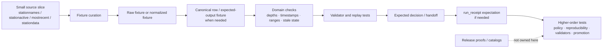

<!-- [KFM_META_BLOCK_V2]
doc_id: kfm://doc/NEEDS_VERIFICATION__soil_moisture_fixtures_readme
title: Soil Moisture Fixtures
type: standard
version: v1
status: draft
owners: @bartytime4life
created: NEEDS_VERIFICATION__YYYY-MM-DD
updated: 2026-04-15
policy_label: public-safe
related: [
  ../../README.md,
  ../../policy/README.md,
  ../../reproducibility/README.md,
  ../../../tools/validators/soil_moisture/README.md,
  ../../../tools/validators/promotion_gate/README.md,
  ../../../pipelines/soil-moisture-watch/README.md,
  ../../../contracts/README.md,
  ../../../contracts/soil_moisture/reading.schema.json,
  ../../../policy/README.md,
  ../../../schemas/README.md,
  ../../../.github/CODEOWNERS,
  ../../../.github/workflows/README.md
]
tags: [kfm, tests, fixtures, soil-moisture, mesonet, spec_hash, run_receipt]
notes: [
  Owner is confirmed at the /tests/ scope via current CODEOWNERS coverage; exact leaf subtree and created date remain branch-level verification items.
  This revision preserves the stronger existing fixture-lane doctrine around source-role clarity, public-safe fixture practice, and receipt-aware testing while aligning the leaf to the newer soil-moisture validator and promotion-gate surfaces.
  This README is intentionally source-bounded and does not assert live fixture inventory beyond the target document itself.
]
[/KFM_META_BLOCK_V2] -->

<a id="top"></a>

# Soil Moisture Fixtures

Deterministic, public-safe fixture lane for soil-moisture source samples and normalized records used to prove watcher, validation, anomaly, replay, and receipt behavior without treating test data as authoritative truth.

> [!NOTE]
> **Status:** `experimental`  
> **Owners:** `@bartytime4life` *(confirmed at `/tests/` scope; leaf-level ownership should still be rechecked before merge)*  
> **Path:** `tests/fixtures/soil_moisture/README.md`  
>        
> **Quick jumps:** [Scope](#scope) · [Repo fit](#repo-fit) · [Accepted inputs](#accepted-inputs) · [Exclusions](#exclusions) · [Directory tree](#directory-tree) · [Quickstart](#quickstart) · [Usage](#usage) · [Diagram](#diagram) · [Fixture matrix](#fixture-matrix) · [Task list](#task-list--definition-of-done) · [FAQ](#faq) · [Appendix](#appendix)

> [!IMPORTANT]
> This README is **source-bounded**. It is written to fit the repo’s current documented `tests/` posture and the current KFM watcher / validator doctrine for soil-moisture work. It does **not** prove that the checked-out branch already contains this exact subtree, fixture inventory, runner wiring, or merge-blocking coverage.

> [!WARNING]
> **Kansas Mesonet is a valuable public connector, not a free-for-all ingestion surface.** Keep checked-in fixtures tiny, reviewable, and rights-conscious. Do not turn `tests/fixtures/soil_moisture/` into a silent mirror of provider data or an unconstrained scraping cache.

> [!TIP]
> Keep this lane narrow: **fixture and explain** here, **validate and decide** in higher-order test and validator lanes, **prove and publish** downstream.

---

## Scope

`tests/fixtures/soil_moisture/` is the fixture lane for **small, deterministic soil-moisture examples** that help higher-order verification surfaces prove:

- source-role clarity
- normalization behavior
- stale-data and station-health checks
- anomaly handling
- canonical row behavior
- `spec_hash` stability
- `run_receipt` handoff expectations
- fail-closed behavior when required fields or provenance support are missing

This directory is the right place for **fixture materials** that support those proofs.

This directory is **not** the right place for:

- authoritative source truth
- long-lived provider mirrors
- canonical schemas
- policy bundle ownership
- release-grade proofs
- live automation state
- unpublished or secret-bearing data

### Truth labels used in this README

| Label | Meaning here |
| --- | --- |
| **CONFIRMED** | Supported by current repo-facing documentation or current KFM doctrinal material surfaced in this session |
| **INFERRED** | Conservative reading that fits adjacent surfaces but is not directly proven as checked-in leaf reality |
| **PROPOSED** | Recommended target shape or future coverage pattern consistent with KFM doctrine |
| **UNKNOWN** | Not surfaced strongly enough to describe as current repo fact |
| **NEEDS VERIFICATION** | Path, runner, file inventory, metadata value, or implementation detail that should be rechecked against the active branch before merge |

### Current evidence posture

| Surface | Status | Why it matters |
| --- | --- | --- |
| `tests/` as a governed verification boundary | **CONFIRMED** | This file should read like a child test lane, not like a generic data folder. |
| `/tests/` owner coverage via `.github/CODEOWNERS` | **CONFIRMED** | Grounds the owners line at the family scope. |
| `tests/fixtures/` as a documented current parent family | **DOCUMENTED / NEEDS VERIFICATION ON ACTIVE BRANCH** | Some current repo-facing docs show `fixtures/` in the visible `tests/` tree, but the exact public-tree snapshot is not fully uniform across surfaced materials. |
| Exact `tests/fixtures/soil_moisture/` subtree contents | **NEEDS VERIFICATION** | This README should not pretend to know the mounted leaf inventory. |
| Kansas Mesonet soil-moisture source role and usage constraints | **CONFIRMED** | These constraints materially affect what safe checked-in fixtures should look like. |
| First-wave soil-moisture fixture classes for health / anomaly / provenance checks | **PROPOSED** | Strongly pressured by the corpus, but not directly surfaced as mounted leaf files. |

[Back to top](#top)

---

## Repo fit

**Path:** `tests/fixtures/soil_moisture/README.md`  
**Role:** child fixture README for governed, public-safe soil-moisture examples inside the broader `tests/` verification boundary.

| Direction | Surface | Why it matters |
| --- | --- | --- |
| Parent | [`../../README.md`](../../README.md) | `tests/` is the governing proof surface this lane stays subordinate to. |
| Sibling proof family | [`../../policy/README.md`](../../policy/README.md) | Policy-facing test burdens should consume fixtures from here, not be re-authored ad hoc. |
| Sibling proof family | [`../../reproducibility/README.md`](../../reproducibility/README.md) | Stable fixture content matters when replayability and digest checks are the real burden. |
| Upstream watcher | [`../../../pipelines/soil-moisture-watch/README.md`](../../../pipelines/soil-moisture-watch/README.md) | Supplies the Mesonet-first candidate vocabulary this fixture lane should support. |
| Upstream validator | [`../../../tools/validators/soil_moisture/README.md`](../../../tools/validators/soil_moisture/README.md) | Consumes deterministic fixture families for pass / quarantine / deny / error behavior. |
| Downstream promotion gate | [`../../../tools/validators/promotion_gate/README.md`](../../../tools/validators/promotion_gate/README.md) | Needs clean fixture-driven evidence for downstream review and no-op / anomaly visibility. |
| Canonical contract boundary | [`../../../contracts/README.md`](../../../contracts/README.md) | Fixtures may support contract tests, but contract meaning does not originate here. |
| Canonical row contract | [`../../../contracts/soil_moisture/reading.schema.json`](../../../contracts/soil_moisture/reading.schema.json) | Gives the first-wave row shape this lane should help prove. |
| Canonical schema boundary | [`../../../schemas/README.md`](../../../schemas/README.md) | Schema authority stays there even when fixture shape pressure grows here. |
| Policy authority boundary | [`../../../policy/README.md`](../../../policy/README.md) | This lane may feed policy tests; it must not become policy truth. |
| Workflow boundary | [`../../../.github/workflows/README.md`](../../../.github/workflows/README.md) | Documentation about fixture use is not proof of active workflow enforcement. |
| Ownership boundary | [`../../../.github/CODEOWNERS`](../../../.github/CODEOWNERS) | Confirms current owner coverage at the `/tests/` family level. |

> [!NOTE]
> This fixture lane should support the newer soil-moisture truth path without becoming its source of truth. It exists to make watcher, validator, and promotion behavior easier to prove, not to replace those lanes.

[Back to top](#top)

---

## Accepted inputs

This lane should hold **small, stable, reviewable** examples that help prove soil-moisture behavior clearly.

### Typical accepted inputs

| Input class | Examples | Why it belongs here | Status |
| --- | --- | --- | --- |
| Source-snapshot fixtures | tiny `stationnames`, `stationactive`, `mostrecent`, or `stationdata` slices | Lets tests prove source-role handling without depending on live network calls | **CONFIRMED source class / PROPOSED local file form** |
| Normalized series fixtures | compact JSON / CSV rows after field cleanup | Helps prove deterministic normalization and later `spec_hash` stability | **INFERRED / PROPOSED** |
| Canonical row fixtures | one or more rows matching the reading contract | Supports validator and promotion-lane replayability | **CONFIRMED pressure / PROPOSED local form** |
| Health-state fixtures | stale station activity, partial roster loss, degraded station examples | Supports fail-closed freshness and availability logic | **PROPOSED, strongly source-grounded** |
| Anomaly fixtures | z-score spike, impossible VWC value, sudden 7-day jump | Supports reviewable anomaly behavior without scraping live data | **PROPOSED, strongly source-grounded** |
| Comparison / corroboration metadata | tiny references for SCAN / AWDB, USCRN, or SMAP comparison cases | Helps keep Mesonet from becoming the only implied truth surface when cross-checking matters | **PROPOSED** |
| Receipt-adjacent expected outputs | minimal expected `run_receipt` or handoff fragments used by tests | Useful when fixture-driven tests need to prove machine-readable outcome seams | **INFERRED / PROPOSED** |
| No-op replay fixtures | prior / current examples with unchanged `spec_hash` | Supports downstream no-meaningful-change behavior | **PROPOSED** |

### What belongs here

- candidate source slices that can be checked into Git safely
- deterministic normalized examples that isolate one behavior cleanly
- canonical row examples with explicit depth and time semantics
- valid and invalid fixture pairs named by failure reason
- tiny stale-data and anomaly cases that support negative-path tests
- reviewable examples for soil-moisture depth handling
- public-safe payloads that do **not** pretend to be release artifacts

### Fixture rules

1. Keep fixtures **small enough to review in a pull request**.
2. Keep source identity explicit so **Kansas Mesonet** does not get flattened into generic “sensor data.”
3. Keep time windows explicit; stale-state logic is meaningless without time semantics.
4. Keep depth identity explicit; soil-moisture values are not interchangeable across depths.
5. Do not silently mix **VWC** and **percent saturation** without a clear note or normalized derivative.
6. If a fixture is derived, label it as derived; do not let a normalized example masquerade as a raw source snapshot.
7. Preserve the distinction **fixture ≠ receipt ≠ proof ≠ catalog** even in tests.
8. Keep `spec_hash`, `schema_ver`, and any `run_receipt_ref` explicit when the test burden depends on them.
9. Prefer fixture families named by burden: `valid`, `invalid`, `health`, `anomalies`, `normalized`, `expected`.

> [!NOTE]
> The current source corpus most strongly supports **Kansas Mesonet** as the first local soil-moisture source role here. Additional comparison fixtures from SCAN / AWDB, USCRN, or SMAP are useful only when they remain tiny and clearly labeled as comparison or validation context.

[Back to top](#top)

---

## Exclusions

| Does **not** belong here | Put it here instead | Why |
| --- | --- | --- |
| Canonical schema files | [`../../../contracts/README.md`](../../../contracts/README.md) and [`../../../schemas/README.md`](../../../schemas/README.md) | Fixtures should pressure-test schema law, not replace it. |
| Policy bundle source files or review-role registries | [`../../../policy/README.md`](../../../policy/README.md) | This lane may support policy tests, but policy remains the source of truth. |
| Full historical provider pulls or scrape caches | governed data zones or ignored local paths | Public fixture surfaces should stay tiny and rights-conscious. |
| Live automation state, schedulers, or connector code | watcher / tool / pipeline lanes on the active branch | Fixture README prose is not implementation proof. |
| Release manifests, signed proofs, SBOMs, or promoted artifacts as primary records | governed receipt / proof / release surfaces | A fixture example is not the authoritative published object. |
| One-off analyst scratch files | local ignored paths | Checked-in fixtures should be reusable and reviewable. |
| Raw provider mirrors large enough to hide rights or usage posture | nowhere in this lane | This README keeps provider constraints visible on purpose. |
| Promotion decisions as authoritative records | downstream validator / promotion lanes | This fixture lane may support them, but does not own them. |

> [!WARNING]
> Do not commit “convenience dumps” of live provider data here just because they are easy to fetch. Tests should prove behavior with the **smallest meaningful slice**, not accumulate accidental archives.

[Back to top](#top)

---

## Directory tree

### Current safe claim

```text
tests/fixtures/soil_moisture/
└── README.md
```

That is the only subtree claim this README can make safely without direct branch inspection.

### Preferred growth shape (`PROPOSED` / `NEEDS VERIFICATION`)

```text
tests/fixtures/soil_moisture/
├── README.md
├── valid/
│   ├── mesonet_stationnames.min.csv
│   ├── mesonet_stationactive.min.csv
│   ├── mesonet_mostrecent.min.csv
│   ├── mesonet_stationdata.hourly.min.csv
│   └── canonical_rows.pass.min.json
├── invalid/
│   ├── missing_station_id.csv
│   ├── unordered_timestamps.csv
│   ├── unsupported_depth_column.csv
│   ├── impossible_vwc_value.csv
│   └── missing_spec_hash.json
├── health/
│   ├── stale_station_activity.json
│   └── roster_loss_threshold.json
└── anomalies/
    ├── zscore_spike.json
    └── seven_day_jump.json
```

### Optional derived-fixture extension (`PROPOSED`)

```text
tests/fixtures/soil_moisture/
├── normalized/
│   ├── series.long.min.json
│   └── series.window.min.json
├── expected/
│   ├── validator.pass.json
│   ├── validator.quarantine.json
│   ├── validator.deny.json
│   ├── run_receipt.allow.json
│   └── run_receipt.deny.json
└── replay/
    ├── prior.current.same_spec_hash.json
    └── prior.current.changed_spec_hash.json
```

> [!TIP]
> Add only the fixture leaves the active branch can actually support. A smaller truthful subtree is better than a broad speculative one.

[Back to top](#top)

---

## Quickstart

Start with inspection-first commands so this README stays honest as the branch evolves.

### 1) Confirm what is actually mounted

```bash
find tests -maxdepth 4 -print 2>/dev/null | sort
find tests/fixtures -maxdepth 4 -print 2>/dev/null | sort
find tests/fixtures/soil_moisture -maxdepth 4 -print 2>/dev/null | sort
```

### 2) Re-read the parent and adjacent lane contracts

```bash
sed -n '1,260p' tests/README.md 2>/dev/null || true
sed -n '1,220p' tests/policy/README.md 2>/dev/null || true
sed -n '1,220p' tests/reproducibility/README.md 2>/dev/null || true
sed -n '1,220p' tools/validators/soil_moisture/README.md 2>/dev/null || true
sed -n '1,220p' tools/validators/promotion_gate/README.md 2>/dev/null || true
sed -n '1,220p' pipelines/soil-moisture-watch/README.md 2>/dev/null || true
sed -n '1,220p' contracts/README.md 2>/dev/null || true
sed -n '1,220p' contracts/soil_moisture/reading.schema.json 2>/dev/null || true
sed -n '1,220p' schemas/README.md 2>/dev/null || true
sed -n '1,220p' policy/README.md 2>/dev/null || true
sed -n '1,220p' .github/CODEOWNERS 2>/dev/null || true
```

### 3) Reconfirm soil-moisture vocabulary before adding new fixtures

```bash
grep -RIn \
  -e 'Kansas Mesonet' \
  -e 'soil moisture' \
  -e 'stationactive' \
  -e 'mostrecent' \
  -e 'stationdata' \
  -e 'canonical rows' \
  -e 'spec_hash' \
  -e 'schema_ver' \
  -e 'run_receipt' \
  tests contracts schemas policy docs tools pipelines 2>/dev/null || true
```

### 4) Add the smallest useful fixture pair first

Use one valid and one invalid fixture before creating larger families:

1. one **passing** hourly `stationdata` slice
2. one **failing** slice named by reason (`unordered_timestamps`, `impossible_vwc_value`, `missing_spec_hash`, etc.)
3. one tiny canonical-row example if validator or contract tests need it
4. one expected-output fragment if a downstream test needs it

### 5) Document the real runner only after it exists

If this leaf gains executable cases, document the actual local and CI invocation paths used on the active branch. Do not leave guessed `pytest`, shell, or workflow commands behind.

[Back to top](#top)

---

## Usage

### Design fixtures by burden, not by source abundance

A good fixture here isolates one burden clearly:

- **source-role burden**: “this came from `stationactive`, not `stationdata`”
- **normalization burden**: “depths are preserved and time ordering is explicit”
- **canonical-shape burden**: “this row is or is not contract-ready”
- **health burden**: “the station is stale or degraded”
- **anomaly burden**: “this jump should be flagged”
- **handoff burden**: “downstream code can attach a `run_receipt` or deny cleanly”
- **replay burden**: “unchanged inputs preserve deterministic identity”

A weak fixture does the opposite:

- hides the burden under too many fields
- mixes raw and normalized state without saying so
- carries more provider data than the test needs
- makes failure reasons harder to review than the code itself

### Keep raw, normalized, and expected roles separate

| Fixture role | Use when | Avoid |
| --- | --- | --- |
| Raw source slice | the test needs provider-shaped input behavior | silently editing provider columns until the “raw” sample is no longer raw |
| Normalized example | the test needs stable post-cleanup semantics | pretending the normalized file is the source of truth |
| Canonical row example | the test needs contract-ready row semantics | mixing it back into raw snapshots without explanation |
| Health / anomaly case | the test needs a named negative path | hiding the failure inside a giant mixed payload |
| Expected-output fragment | the test needs a deterministic downstream comparison | storing full release or proof artifacts here as the primary record |

### Keep source-role clarity visible

The strongest current local source role for this lane is **Kansas Mesonet**. If you later add SCAN / AWDB, USCRN, or SMAP comparison fixtures, keep them explicitly marked as:

- comparison
- corroboration
- long-horizon reference
- gridded context

Do **not** let a comparison fixture flatten away the difference between a Kansas station network, a national in-situ network, and a satellite / grid product.

### Keep provider constraints visible in fixture practice

The surfaced corpus pressure suggests these practical rules:

- prefer tiny slices over bulk pulls
- preserve enough source columns to explain the test
- keep usage and attribution notes visible when real provider rows are retained
- avoid building a hidden local mirror by accretion
- trim to one station, one window, or one failure reason when possible

[Back to top](#top)

---

## Diagram



> [!IMPORTANT]
> This fixture lane may support receipt-aware tests, but **release proofs and catalog objects remain outside its authority**.

[Back to top](#top)

---

## Fixture matrix

### Fixture class matrix

| Fixture class | Smallest good example | What it should prove | What it should not imply |
| --- | --- | --- | --- |
| Station roster | one or two stations from `stationnames` | identity and roster shape | that the fixture is a live roster mirror |
| Station activity | tiny `stationactive` slice | freshness / stale-state logic | that provider uptime or polling is proven live |
| Most recent observation | one `mostrecent` record | recent-value shape and station linkage | that historical continuity exists |
| Historical interval slice | one short `stationdata` window | ordered timestamps and depth handling | that full provider retention is mirrored locally |
| Normalized long-form example | one short window after cleanup | deterministic transform target | that normalized output is the canonical source |
| Canonical row example | one row or short batch matching the reading contract | deterministic validator and contract checks | that contracts originate here |
| Health-state case | stale or degraded sample | explicit negative-path behavior | that branch-level workflows already quarantine live data |
| Anomaly case | one z-score or jump example | named anomaly review burden | that the repo already contains a mounted anomaly pipeline |
| Expected validator output | one pass / quarantine / deny fragment | deterministic downstream comparison | that this lane owns the validator contract |
| Expected receipt fragment | one tiny handoff surface | receipt-aware seam testing | that fixtures are receipts |

### Concepts this lane should keep visible

| Concept | Why it matters |
| --- | --- |
| Source identity | Prevents “soil moisture” from becoming an undifferentiated source bucket |
| Time basis | Stale-state and anomaly tests collapse without explicit observation time |
| Depth identity | 5 / 10 / 20 / 50 cm values are not semantically interchangeable |
| Unit meaning | VWC and percent saturation should not blur silently |
| Public-safe posture | Test fixtures must stay safe to clone and review |
| Deterministic identity | Replay, diff, and policy behavior depend on stable fixture content |
| `schema_ver` | Keeps contract evolution explicit in tests |
| Receipt boundary | Fixtures may support `run_receipt` expectations without becoming proof packs |

### Candidate first checks for this lane

| Check | Why | Good failing fixture name |
| --- | --- | --- |
| Timestamp ordering | supports continuity and replay behavior | `unordered_timestamps.csv` |
| Allowed depth set | keeps depth semantics honest | `unsupported_depth_column.csv` |
| Value range sanity | catches impossible readings early | `impossible_vwc_value.csv` |
| Explicit station identity | supports source linkage and health logic | `missing_station_id.csv` |
| Missing deterministic identity | supports fail-closed replay posture | `missing_spec_hash.json` |
| Missing schema version | keeps contract ambiguity visible | `missing_schema_ver.json` |
| Stale-state threshold case | supports degraded-source handling | `stale_station_activity.json` |
| Jump / anomaly case | supports named review burden | `seven_day_jump.json` |

[Back to top](#top)

---

## Task list / definition of done

Treat this README as healthy only when it stays both readable and truthful.

- [ ] Verify whether `tests/fixtures/soil_moisture/` already exists on the active branch beyond this README.
- [ ] Replace placeholder `doc_id` and `created` with repo-backed values.
- [ ] Confirm whether a parent `tests/fixtures/README.md` exists and should be linked explicitly.
- [ ] Confirm whether the owner remains `@bartytime4life` for this leaf on the active branch.
- [ ] Land one passing and one failing fixture before adding broader families.
- [ ] Land one canonical-row example if validator / contract tests depend on it.
- [ ] Keep any real provider-derived fixture slices tiny enough for pull-request review.
- [ ] Document the real local and CI invocation path once this leaf has executable consumers.
- [ ] Verify that this README does not imply workflow YAML, branch protection, or mounted automation the branch does not prove.
- [ ] Reconcile this leaf with the parent `tests/README.md` family map once branch reality is rechecked.
- [ ] Keep Mesonet usage and automation constraints visible if real source rows remain checked in.
- [ ] Confirm whether replay fixtures and expected-output fragments are actually needed on branch before adding them.

### Definition of done

This lane is ready to move from draft toward review when all of the following are true:

1. the active checkout clearly proves the leaf subtree
2. at least one valid and one invalid fixture exist
3. at least one failure reason is named cleanly in a filename
4. source-role clarity remains visible
5. the leaf does not become a hidden provider archive
6. parent and adjacent docs no longer disagree about subtree reality
7. branch-level metadata placeholders are replaced with real values

[Back to top](#top)

---

## FAQ

### Why keep this under `tests/fixtures/` instead of a data folder?

Because the primary job here is **verification support**, not data custody. These files should help tests prove behavior, not become the authoritative home of source data.

### Why not commit full Kansas Mesonet pulls here?

Because that would blur the line between a fixture lane and a provider mirror, and it would make rights, attribution, and review posture harder to manage. Tiny slices are easier to review and safer to govern.

### Does this lane own `run_receipt` or proof objects?

No. It may contain tiny expected-output fragments that help tests prove downstream handoff, but **receipt**, **proof**, and **catalog** roles should remain visibly distinct.

### Should this lane use only Kansas Mesonet?

Not necessarily. **Kansas Mesonet** is the strongest current local first-wave source role, but comparison fixtures from SCAN / AWDB, USCRN, or SMAP may be useful when they stay tiny, clearly labeled, and subordinate to the test burden.

### Does this README prove live automation already exists?

No. It documents a truthful fixture lane shape that fits the current doctrine. Live runner, workflow, scheduler, and merge-gate details still need direct branch verification.

### Why keep mentioning usage constraints?

Because the surfaced corpus explicitly warns that Kansas Mesonet should not be treated as an unconstrained ingestion surface. Fixture practice should reflect that instead of quietly ignoring it.

[Back to top](#top)

---

## Appendix

<details>
<summary><strong>Illustrative fixture examples</strong> (<strong>illustrative only</strong>)</summary>

These examples are here to make the lane concrete without pretending the final checked-in filenames or schemas are already verified.

### Minimal hourly source slice

```csv
station,observed_at,VWC5CM,VWC10CM,VWC20CM,VWC50CM
MANH,2026-04-01T00:00:00Z,0.22,0.24,0.27,0.31
MANH,2026-04-01T01:00:00Z,0.23,0.24,0.27,0.31
```

### Invalid range case

```csv
station,observed_at,VWC5CM,VWC10CM,VWC20CM,VWC50CM
MANH,2026-04-01T00:00:00Z,1.42,0.24,0.27,0.31
```

### Tiny canonical row example

```json
{
  "station_id": "MANH",
  "source": "mesonet",
  "lat": 39.2042,
  "lon": -96.5814,
  "depth_cm": 5,
  "measure": "soil_moisture_vwc",
  "value": 0.22,
  "unit": "m3/m3",
  "timestamp_iso": "2026-04-01T00:00:00Z",
  "schema_ver": 1
}
```

### Tiny normalized example

```json
{
  "source": "kansas-mesonet",
  "station_id": "MANH",
  "window": {
    "start": "2026-04-01T00:00:00Z",
    "end": "2026-04-01T01:00:00Z"
  },
  "series": [
    {"depth_cm": 5, "observed_at": "2026-04-01T00:00:00Z", "value": 0.22, "unit": "m3/m3"},
    {"depth_cm": 10, "observed_at": "2026-04-01T00:00:00Z", "value": 0.24, "unit": "m3/m3"}
  ],
  "spec_hash": "sha256:REPLACE_ME"
}
```

### Review prompt before merge

- Is the fixture still the smallest meaningful example?
- Does the filename name the behavior or failure reason clearly?
- Is the source role explicit?
- Is the time basis explicit?
- Did we accidentally commit a provider mirror instead of a fixture?
- Did we preserve the boundary **fixture ≠ receipt ≠ proof ≠ catalog**?

</details>

[Back to top](#top)
